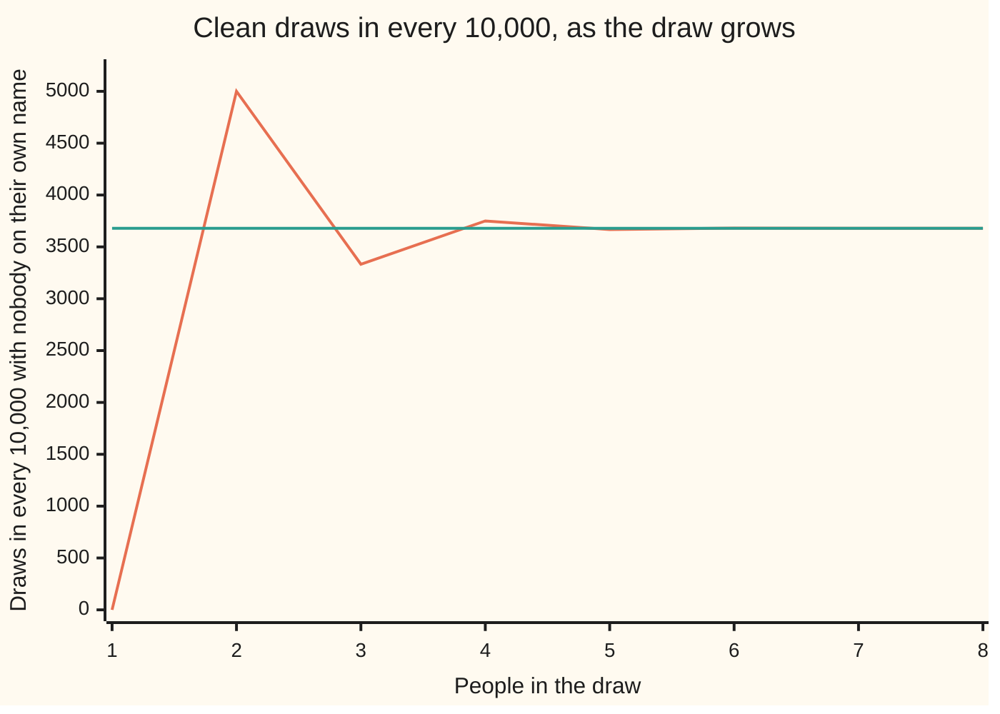
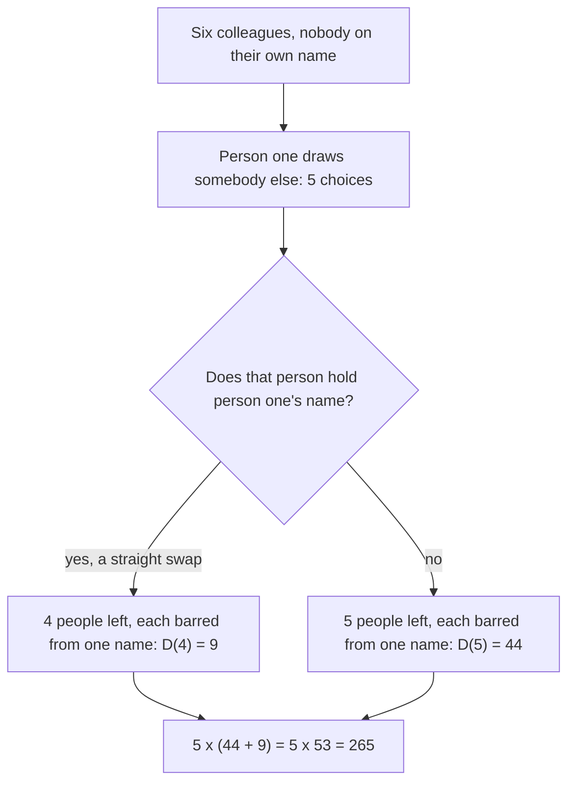

# Derangements: shuffles where nothing lands in its own place, counted by the sieve

[Syllabus](../../../SYLLABUS.md) → [Combinatorics and graphs](../README.md) → [Inclusion-Exclusion and Pigeonhole](../README.md#s04) → Derangements

---

## General Overview

Six colleagues run a Secret Santa. Six names go into a hat and each person takes one out, then buys a gift for whoever they drew. The draw is spoilt if anyone pulls out their own name.

There are 720 ways the names can come out: six choices for the first person, five for the next, then four, three, two, one. Exactly 265 leave nobody holding their own name — a share of 0.3681, a little over a third.

More people barely move it. Twenty colleagues, or twenty thousand, and the share is still 0.3679 to four decimals. A shuffle with nothing in its own place is a **derangement**, the word used from here on.

**Count the spoilt draws instead of the clean ones, repair their overlaps, and take the result off the total: what survives is the derangement count, whose share settles almost at once on 0.3679.**

**What kind of fact this is:** a theorem, proved on this card in Why it works.

### The picture: the share stops moving by seven people



The wobbling line is clean draws per 10,000. The flat line is 3,679, the level it closes on.

---

## The formula

Three shorthands, all met earlier. $n!$, "n factorial", counts the ways $n$ things line up: 6! = 720 ([Factorials](../01-Counting%20Principles/03-factorial.md)). C(6, 2), "six choose two", counts the ways to pick 2 of 6 when order does not matter: 15 ([Combinations, n choose k](../01-Counting%20Principles/05-n-choose-k.md)). The capital sigma sign, with a counter $k$ below and a stopping value above, says to add the term on its right once for each $k$ in that range ([The binomial theorem](../03-Binomial%20Coefficients%20and%20Identities/02-binomial-theorem.md)).

One shorthand is new: D(6) is the number of draws among six people with nobody on their own name, D(n) the count among $n$. Elsewhere it is written !n, read "subfactorial n".

$$D(n) \;=\; \sum_{k=0}^{n} (-1)^k \, C(n,k)\,(n-k)! \;=\; \sum_{k=0}^{n} (-1)^k \, \frac{n!}{k!} \;=\; n!\left(1 - \frac{1}{1!} + \frac{1}{2!} - \cdots \pm \frac{1}{n!}\right)$$

**Read it aloud:** start with every draw, take off the ones where some chosen person holds their own name, put back the ones that removed twice, and keep alternating up to all $n$.

| Symbol | Plain meaning | In our example | Push it up and the answer… |
| --- | --- | --- | --- |
| $n$ | people in the draw | 6 | D(n) grows, fast |
| $n!$ | all the ways the names come out | 720 | — |
| $D(n)$ | draws with nobody on their own name | 265 | — |
| $k$ | people one term pins | 0 up to 6 | the term shrinks |
| $C(n,k)$ | ways to choose the pinned $k$ | C(6, 2) = 15 | more terms of that size |
| $(n-k)!$ | ways the rest come out | 4! = 24 | — |
| $D(n)/n!$ | the clean share | 265/720 = 0.3681 | it settles on 0.3679 |
| $e$ | the compounding number | 2.718282, and 1 over it 0.367879 | — |

A **recurrence** builds each count from the ones before it, starting from two seeds fixed by hand.

$$D(n) = (n-1)\bigl(D(n-1) + D(n-2)\bigr), \qquad D(0) = 1, \quad D(1) = 0$$

Person one has $n-1$ names to draw, and each case leaves a smaller draw of the same kind (Step 3). Shorter still is $D(n) = n\,D(n-1) + (-1)^n$.

### When it holds

- **Every name drawn exactly once.** Put each name back in the hat and each of the six has five allowed names: 5^6 = 15,625 lists, not 265 draws.
- **One barred name each, no two the same.** Bar Ann from her husband's name too and the pinned blocks lose the size the sieve assumes.
- **The seeds are D(0) = 1 and D(1) = 0.** The empty draw has nobody to go wrong; one person can only draw themselves. Start at D(0) = 0 and every count after collapses to 0.
- **Rounding works from one person up.** D(n) is the nearest whole number to n! divided by $e$: 720 × 0.367879 = 264.873, nearest 265. At zero people it fails, since 0.367879 rounds to 0.

---

## Why it works

### Step 0: count the spoilt draws instead

Listing clean draws directly means holding six conditions in the air at once. Every draw is clean or spoilt, so the clean count is 720 minus the spoilt count ([Counting the complement](../01-Counting%20Principles/06-complementary-counting.md)). Spoilt means at least one person holds their own name — and "at least one" is what the sieve was built for.

### Step 1: pin some people and count what is left

For each colleague, collect the draws in which that colleague holds their own name: six colleagues, six blocks. Ann's block has 5! = 120 members: her name is settled and the other five come out any way at all — including ways that put Ben on his own name too. A block says "at least Ann", never "only Ann".

Pinning any $k$ people leaves $(n-k)!$ draws, with C(n, k) choices of which $k$: at $k$ = 2 that is C(6, 2) = 15 blocks of 24.

### Step 2: the alternating sum repairs the overlaps

Adding the six blocks counts a draw with two people on their own names twice, one with three three times, and so on. Subtracting the pairs over-corrects the other way. Alternating leaves each spoilt draw counted once ([Inclusion-exclusion for any number of sets](01-inclusion-exclusion-for-n-sets.md)). Take that off 720, reading the untouched 720 as the term for $k$ = 0.

The formula's middle form is the first tidied — the two factors of each term collapse:

$$C(n,k)\,(n-k)! = \frac{n!}{k!\,(n-k)!}\,(n-k)! = \frac{n!}{k!}$$

### Step 3: a second road, splitting on person one's name



Person one draws one of the five other names, say Ben's. Either Ben holds person one's name — a swap, leaving four people to avoid their own — or Ben does not, leaving five with one barred name each. Five choices of Ben, no block mentioned: 5 × (44 + 9) = 265.

<details>
<summary>Detailed proof: the no-swap case is a smaller draw of the same kind</summary>

In the no-swap case person one holds Ben's name and Ben does not hold person one's. Five remain: four barred from their own names, Ben barred from person one's name. Rename person one's name "Ben's name" and all five are barred from the name carrying their own label — a derangement of five. The renaming reverses, so nothing is double-counted and nothing missed. The two cases exclude each other and cover every clean draw, so their counts add, and the $n-1$ choices of whose name person one drew multiply: $D(n) = (n-1)(D(n-1) + D(n-2))$.

Rewriting it as $D(n) - n\,D(n-1) = -\bigl(D(n-1) - (n-1)D(n-2)\bigr)$ gives the one-step form: the bracket is that same expression one step down, so it flips sign each step from $D(1) - D(0) = -1$.

</details>

### Step 4: why the share stops moving

Divide the formula by $n!$ and the clean share is 1 − 1/1! + 1/2! − 1/3! + … ± 1/n!, one term for each step of the sieve. Those terms shrink fast: a seventh colleague moves the share by 0.000198, an eighth by 0.000025.

It closes on 1 divided by $e$, the compounding number the code reaches as 2.718282 ([Compounding more often, and the number e](../../01-Foundations/04-Compound%20Growth%20and%20Discounting/04-compounding-frequency-and-e.md)): 0.367879. Why an endless alternating sum of 1/k! comes to exactly that is settled on [The binomial series and the number e](../../06-Calculus%20and%20analysis/06-Series/06-binomial-series-and-e.md); this card checks it twice.

---

## Worked numbers, by hand

| Step | Arithmetic | Value |
| --- | --- | --- |
| all draws, none pinned | 6! | 720 |
| take off the singles | −C(6, 1) × 5! | −720 |
| put the pairs back | C(6, 2) × 4! | +360 |
| take off the triples | −C(6, 3) × 3! | −120 |
| put the fours back | C(6, 4) × 2! | +30 |
| take off the fives | −C(6, 5) × 1! | −6 |
| put the all-six back | C(6, 6) × 0! | +1 |
| add them up | 720 − 720 + 360 − 120 + 30 − 6 + 1 | **265** |
| by recurrence | 5 × (44 + 9) | **265** |
| in one step | 6 × 44 + 1 | **265** |
| the clean share | 265 / 720 | **0.3681** |

265 of the 720 draws leave nobody buying their own gift. The running totals are 720, 0, 360, 240, 270, 264, 265: they overshoot and undershoot by turns, which lets a half-finished sieve serve as a bound, on [Stopping the sieve early](04-union-bound-and-bonferroni.md).

### What breaks if you drop a piece

| Mistake | Comes out at | What went wrong |
| --- | --- | --- |
| Subtract the six blocks and stop | 720 − 6 × 120 = 0 | Blocks overlap: their sizes total more than the spoilt draws |
| Drop the sieve's last term | 264 | 0! is 1, so the all-six draw still goes back |
| Recurrence read as 5 × 44 + 9 | 229 | Both earlier counts sit in the bracket |

The code prints all three.

---

## Code, from first principles, and it actually runs

Nothing is imported. Three roads sharing no arithmetic reach the count: dealing out all 720 draws and keeping the clean ones, the sieve in whole numbers, and the recurrence. The share is then set against 1/e, reached twice.

### Python

```python
# Derangements -- the check behind the card.  Nothing is imported.  Six colleagues
# draw names for Secret Santa, and a draw is good when nobody draws their own name.
# Three roads that share no arithmetic count the good draws: listing, the alternating
# sieve, and the recurrence.  Their share of all draws is then set against 1/e, twice.
TOP = 8

def factorial(n):                      # n! = 1 x 2 x ... x n, with 0! = 1
    out = 1
    for i in range(2, n + 1):
        out *= i
    return out

def every_draw(n):                     # every way to hand out n names, in order
    draws = [()]
    for k in range(n):
        draws = [p[:i] + (k,) + p[i:] for p in draws for i in range(k + 1)]
    return draws

def sieve_terms(n):                    # road two: the alternating sieve, in whole numbers
    return [(-1) ** k * (factorial(n) // factorial(k)) for k in range(n + 1)]

def row(name, values):
    print(f"{name:<19}" + "".join(f"{v:>6}" for v in values))

listed = [sum(1 for p in every_draw(n) if all(p[i] != i for i in range(n)))
          for n in range(TOP + 1)]     # road one: deal them all, keep the good ones
sieved = [sum(sieve_terms(n)) for n in range(TOP + 1)]
recurred = [1, 0]                      # road three: D(n) = (n-1) x (D(n-1) + D(n-2))
for n in range(2, TOP + 1):
    recurred.append((n - 1) * (recurred[n - 1] + recurred[n - 2]))
facts = [factorial(n) for n in range(TOP + 1)]
share = [listed[n] / facts[n] for n in range(1, TOP + 1)]
alt = sum((-1) ** k / factorial(k) for k in range(21))     # road one to 1/e
compounded = (1 + 1e-7) ** 10 ** 7                         # road two: a dollar, 10^7 times
terms = sieve_terms(6)
flat = f"{terms[0]}" + "".join(f" {'-' if t < 0 else '+'} {abs(t)}" for t in terms[1:])
print(f"Secret Santa, 6 colleagues: {facts[6]} draws in all, {listed[6]} with nobody drawing their own name")
row("n", list(range(TOP + 1)))
row("n!, all draws", facts)
row("D(n) by listing", listed)
row("D(n) by the sieve", sieved)
row("D(n) by recurrence", recurred)
print("D(n)/n!, n = 1 to 8: " + " ".join(f"{s:.4f}" for s in share))
print(f"sieve at n = 6: {flat} = {sieved[6]}")
print(f"pairs at n = 6: C(6,2) = {facts[6] // (facts[2] * facts[4])}, each leaving 4! = {facts[4]} draws, so the k = 2 term is {terms[2]}")
print("sieve running totals at n = 6: " + ", ".join(str(sum(terms[:k + 1])) for k in range(7)))
print(f"recurrence at n = 6: 5 x ({listed[5]} + {listed[4]}) = 5 x {listed[5] + listed[4]} = {recurred[6]}")
print(f"one-step form at n = 6: 6 x {listed[5]} + 1 = {6 * listed[5] + 1}")
print(f"1/e by the alternating sum to 20 terms: {alt:.6f}; by compounding a dollar 10000000 times: {1 / compounded:.6f}")
print(f"720 x (1/e) = {facts[6] * alt:.3f}, nearest whole number {int(facts[6] * alt + 0.5)}")
print(f"e by the same compounding: {compounded:.6f}; the 7th and 8th terms of the share: {1 / facts[7]:.6f} and {1 / facts[8]:.6f}")
print(f"names put back after each draw, own name barred: 5^6 = {5 ** 6} lists, not {listed[6]} draws")
print(f"mistake 1, subtract the six own-name blocks and stop: 720 - 6 x 120 = {facts[6] - 6 * facts[5]}; "
      f"mistake 2, drop the sieve's last term: {sieved[6] - terms[6]}; "
      f"mistake 3, recurrence read as 5 x 44 + 9: {5 * listed[5] + listed[4]}")
assert listed == sieved                                    # listing against the sieve
assert listed == recurred                                  # listing against the recurrence
assert listed[:7] == [1, 0, 1, 2, 9, 44, 265]              # against the counts worked by hand
assert abs(alt - 1 / compounded) < 1e-6                    # two roads to 1/e
print("ALL CHECKS PASS")
```

**Ran 2026-09-14 on macOS, Python 3.14.6, standard library only. All checks passed. Output, pasted from the run:**

```
Secret Santa, 6 colleagues: 720 draws in all, 265 with nobody drawing their own name
n                       0     1     2     3     4     5     6     7     8
n!, all draws           1     1     2     6    24   120   720  5040 40320
D(n) by listing         1     0     1     2     9    44   265  1854 14833
D(n) by the sieve       1     0     1     2     9    44   265  1854 14833
D(n) by recurrence      1     0     1     2     9    44   265  1854 14833
D(n)/n!, n = 1 to 8: 0.0000 0.5000 0.3333 0.3750 0.3667 0.3681 0.3679 0.3679
sieve at n = 6: 720 - 720 + 360 - 120 + 30 - 6 + 1 = 265
pairs at n = 6: C(6,2) = 15, each leaving 4! = 24 draws, so the k = 2 term is 360
sieve running totals at n = 6: 720, 0, 360, 240, 270, 264, 265
recurrence at n = 6: 5 x (44 + 9) = 5 x 53 = 265
one-step form at n = 6: 6 x 44 + 1 = 265
1/e by the alternating sum to 20 terms: 0.367879; by compounding a dollar 10000000 times: 0.367879
720 x (1/e) = 264.873, nearest whole number 265
e by the same compounding: 2.718282; the 7th and 8th terms of the share: 0.000198 and 0.000025
names put back after each draw, own name barred: 5^6 = 15625 lists, not 265 draws
mistake 1, subtract the six own-name blocks and stop: 720 - 6 x 120 = 0; mistake 2, drop the sieve's last term: 264; mistake 3, recurrence read as 5 x 44 + 9: 229
ALL CHECKS PASS
```

### Rust

Same numbers and labels, built with `rustc --edition 2021 -O`.

```rust
// Derangements -- the same check as the Python, in Rust.  No crates.  Six
// colleagues draw names for Secret Santa, and a draw is good when nobody draws
// their own name.  Three roads that share no arithmetic count the good draws:
// listing, the alternating sieve, and the recurrence.  Their share of all draws
// is then set against 1/e, reached twice.
const TOP: usize = 8;

fn factorial(n: usize) -> i64 {        // n! = 1 x 2 x ... x n, with 0! = 1
    let mut out: i64 = 1;
    for i in 2..=n as i64 { out *= i }
    out
}

fn every_draw(n: usize) -> Vec<Vec<usize>> {   // every way to hand out n names, in order
    let mut draws: Vec<Vec<usize>> = vec![vec![]];
    for k in 0..n {
        let mut next: Vec<Vec<usize>> = Vec::new();
        for p in &draws {
            for i in 0..=k { let mut q = p.clone(); q.insert(i, k); next.push(q) }
        }
        draws = next;
    }
    draws
}

fn sieve_terms(n: usize) -> Vec<i64> {  // road two: the alternating sieve, in whole numbers
    (0..=n).map(|k| { let t = factorial(n) / factorial(k); if k % 2 == 0 { t } else { -t } }).collect()
}

fn row(name: &str, values: &[i64]) {
    let mut line = format!("{:<19}", name);
    for v in values { line.push_str(&format!("{:>6}", v)) }
    println!("{}", line);
}

fn main() {
    let listed: Vec<i64> = (0..=TOP).map(|n|                 // road one: deal them all, keep the good ones
        every_draw(n).iter().filter(|p| (0..n).all(|i| p[i] != i)).count() as i64).collect();
    let sieved: Vec<i64> = (0..=TOP).map(|n| sieve_terms(n).iter().sum()).collect();
    let mut recurred: Vec<i64> = vec![1, 0];  // road three: D(n) = (n-1) x (D(n-1) + D(n-2))
    for n in 2..=TOP { recurred.push((n as i64 - 1) * (recurred[n - 1] + recurred[n - 2])) }
    let facts: Vec<i64> = (0..=TOP).map(factorial).collect();
    let share: Vec<f64> = (1..=TOP).map(|n| listed[n] as f64 / facts[n] as f64).collect();
    let mut alt = 0.0;                                       // road one to 1/e
    for k in 0..21 { alt += (if k % 2 == 0 { 1.0 } else { -1.0 }) / factorial(k) as f64 }
    let compounded = (1.0 + 1e-7f64).powf(1e7);              // road two: a dollar, 10^7 times
    let terms = sieve_terms(6);
    let mut flat = format!("{}", terms[0]);
    for t in &terms[1..] { flat.push_str(&format!(" {} {}", if *t < 0 { "-" } else { "+" }, t.abs())) }
    let running: Vec<String> = (0..7).map(|k| terms[..=k].iter().sum::<i64>().to_string()).collect();
    println!("Secret Santa, 6 colleagues: {} draws in all, {} with nobody drawing their own name", facts[6], listed[6]);
    row("n", &(0..=TOP as i64).collect::<Vec<i64>>());
    row("n!, all draws", &facts);
    row("D(n) by listing", &listed);
    row("D(n) by the sieve", &sieved);
    row("D(n) by recurrence", &recurred);
    println!("D(n)/n!, n = 1 to 8: {}", share.iter().map(|s| format!("{:.4}", s)).collect::<Vec<String>>().join(" "));
    println!("sieve at n = 6: {} = {}", flat, sieved[6]);
    println!("pairs at n = 6: C(6,2) = {}, each leaving 4! = {} draws, so the k = 2 term is {}",
             facts[6] / (facts[2] * facts[4]), facts[4], terms[2]);
    println!("sieve running totals at n = 6: {}", running.join(", "));
    println!("recurrence at n = 6: 5 x ({} + {}) = 5 x {} = {}", listed[5], listed[4], listed[5] + listed[4], recurred[6]);
    println!("one-step form at n = 6: 6 x {} + 1 = {}", listed[5], 6 * listed[5] + 1);
    println!("1/e by the alternating sum to 20 terms: {:.6}; by compounding a dollar 10000000 times: {:.6}", alt, 1.0 / compounded);
    println!("720 x (1/e) = {:.3}, nearest whole number {}", facts[6] as f64 * alt, (facts[6] as f64 * alt + 0.5) as i64);
    println!("e by the same compounding: {:.6}; the 7th and 8th terms of the share: {:.6} and {:.6}",
             compounded, 1.0 / facts[7] as f64, 1.0 / facts[8] as f64);
    println!("names put back after each draw, own name barred: 5^6 = {} lists, not {} draws", 5i64.pow(6), listed[6]);
    println!("mistake 1, subtract the six own-name blocks and stop: 720 - 6 x 120 = {}; mistake 2, drop the sieve's last term: {}; mistake 3, recurrence read as 5 x 44 + 9: {}",
             facts[6] - 6 * facts[5], sieved[6] - terms[6], 5 * listed[5] + listed[4]);
    assert!(listed == sieved);                               // listing against the sieve
    assert!(listed == recurred);                             // listing against the recurrence
    assert!(listed[..7] == [1, 0, 1, 2, 9, 44, 265]);        // against the counts worked by hand
    assert!((alt - 1.0 / compounded).abs() < 1e-6);          // two roads to 1/e
    println!("ALL CHECKS PASS");
}
```

**Ran 2026-09-14 on macOS, rustc 1.98.1, no crates. All checks passed. Output, pasted from the run:**

```
Secret Santa, 6 colleagues: 720 draws in all, 265 with nobody drawing their own name
n                       0     1     2     3     4     5     6     7     8
n!, all draws           1     1     2     6    24   120   720  5040 40320
D(n) by listing         1     0     1     2     9    44   265  1854 14833
D(n) by the sieve       1     0     1     2     9    44   265  1854 14833
D(n) by recurrence      1     0     1     2     9    44   265  1854 14833
D(n)/n!, n = 1 to 8: 0.0000 0.5000 0.3333 0.3750 0.3667 0.3681 0.3679 0.3679
sieve at n = 6: 720 - 720 + 360 - 120 + 30 - 6 + 1 = 265
pairs at n = 6: C(6,2) = 15, each leaving 4! = 24 draws, so the k = 2 term is 360
sieve running totals at n = 6: 720, 0, 360, 240, 270, 264, 265
recurrence at n = 6: 5 x (44 + 9) = 5 x 53 = 265
one-step form at n = 6: 6 x 44 + 1 = 265
1/e by the alternating sum to 20 terms: 0.367879; by compounding a dollar 10000000 times: 0.367879
720 x (1/e) = 264.873, nearest whole number 265
e by the same compounding: 2.718282; the 7th and 8th terms of the share: 0.000198 and 0.000025
names put back after each draw, own name barred: 5^6 = 15625 lists, not 265 draws
mistake 1, subtract the six own-name blocks and stop: 720 - 6 x 120 = 0; mistake 2, drop the sieve's last term: 264; mistake 3, recurrence read as 5 x 44 + 9: 229
ALL CHECKS PASS
```

> [!TIP]
> **Try changing**
> Guess first, then run it. The asserts are pinned to the counts above, so expect one to stop it.
> - **Stop alternating.** In `sieve_terms`, drop the `(-1) ** k *`: the sieve reads 1957 at six people, listing still says 265, the first assert stops it.
> - **Break the recurrence's bracket.** Make it `(n - 1) * recurred[n - 1] + recurred[n - 2]`: the recurrence reads 157 at six people, the second assert stops it.
> - **Cut the sum short.** `range(21)` becomes `range(3)`: 0.500000 against 0.367879, the last assert stops it.

---

## The usual mistake

> [!warning]
> **Subtracting each person's block and stopping.** Six blocks of 120 gives 720 − 6 × 120 = 0, claiming no clean draw exists when 265 do. Blocks overlap, so their sizes total more than what they cover; repairing that is the whole job of the alternating sum.
>
> - **Writing 0! as 0 in the last term.** Six people then read 264. The draw where everybody holds their own name is one draw, not none.
> - **Treating 0.3679 as exact for small draws.** At six people the share is 0.3681; at five, 0.3667.
> - **Starting the recurrence at D(0) = 0.** Every later count then reads 0.

---

## Where you meet it in real life

- **Gift exchanges.** Secret Santa, shifts handed round so nobody keeps their own, exam scripts so nobody marks their own: 265 of the 720 draws work.
- **Card games.** Montmort set this count out in 1708 for *treize*: a dealer turns cards while counting one to thirteen and wins on any match, so a deal with no match anywhere is the derangement case.
- **Other sieve counts.** The same machine counts assignments leaving nothing unused, on [Onto functions](03-counting-surjections.md).

> **Say it back**
> A derangement is a shuffle with nothing in its own place. Counting the spoilt shuffles is easier: pinning k people leaves (n − k)! shuffles, C(n, k) ways choose them, and alternating signs count each spoilt shuffle once. Taking that off n! gives D(n) = n!(1 − 1/1! + 1/2! − …): 265 of the 720 draws among six colleagues. Splitting on whether person one's name came back as a swap gives the same 265, and the share settles on 0.3679, which is 1 divided by the compounding number e.

---

## What this builds on

- [Inclusion-exclusion for any number of sets](01-inclusion-exclusion-for-n-sets.md): the alternating sum that counts each thing in overlapping blocks once.
- [Compounding more often, and the number e](../../01-Foundations/04-Compound%20Growth%20and%20Discounting/04-compounding-frequency-and-e.md): the number 2.71828…, and the compounding road the code takes to it.
- [Permutations](../../03-Algebra/08-Groups/03-permutations-and-the-symmetric-group.md): shuffles as objects in their own right, and the name "fixed point".

## Where this goes next

- [Counting shuffles by their loops](../08-Partitions/05-permutations-by-cycles.md): sorting shuffles by the loops they fall into, where derangements are those with no loop of length one.
- [The binomial series and the number e](../../06-Calculus%20and%20analysis/06-Series/06-binomial-series-and-e.md): why the endless alternating sum of 1/k! comes to 1 divided by $e$.

This card counts the draws with nobody on their own name; how many leave exactly two, and why those counts add back to 720, is what [Counting shuffles by their loops](../08-Partitions/05-permutations-by-cycles.md) takes up.

---

## Sources

Verified 14 Sep 2026: every link below resolves to the publisher's page.

- NIST *Digital Library of Mathematical Functions*, section 26.13, "Permutations: Derangements". [dlmf.nist.gov/26.13](https://dlmf.nist.gov/26.13). The closed form and the recurrence.
- Sloane, N. J. A., editor. Sequence A000166, "Subfactorial or rencontres numbers". *The On-Line Encyclopedia of Integer Sequences*. [oeis.org/A000166](https://oeis.org/A000166). The counts 1, 0, 1, 2, 9, 44, 265, 1854, 14833.
- Hammack, Richard. *Book of Proof*, 3rd edition. [Author's page, full text free](https://richardhammack.github.io/BookOfProof/). Chapter 3, section 7: the inclusion-exclusion principle, with worked counts.
- O'Connor, J. J., and E. F. Robertson. "Pierre Rémond de Montmort". MacTutor Archive, St Andrews. [Biography](https://mathshistory.st-andrews.ac.uk/Biographies/Montmort/). Dates the 1708 *Essay d'analyse sur les jeux de hazard*.
