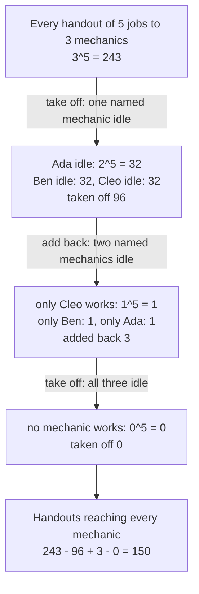
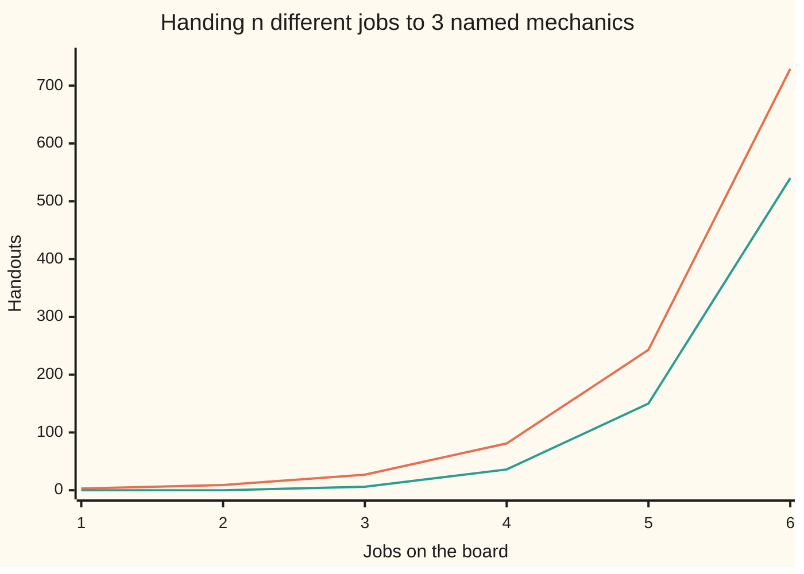

# Onto functions: hand out every item so nobody is left empty-handed, counted by the sieve

[Syllabus](../../../SYLLABUS.md) → [Combinatorics and graphs](../../../SYLLABUS.md#w04) → [Inclusion-Exclusion and Pigeonhole](../../../SYLLABUS.md#w04-s04) → Onto functions

---

## General Overview

A garage opens on Monday with five different repair jobs on the board: brakes, clutch, exhaust, gearbox and headlight. Three mechanics are in: Ada, Ben and Cleo. Each job goes to one mechanic, and the foreman wants all three working.

Drop that last rule and the count is quick. Each job picks one of three mechanics, so there are 3 × 3 × 3 × 3 × 3 = 243 handouts ([Strings with repetition](../01-Counting%20Principles/02-strings-and-powers.md)). Keep the rule and some of those 243 are out: all five jobs to Ada, and every other handout leaving somebody idle.

The answer is 150. "Everybody gets something" is a condition on the whole handout, not on any one job, so counting the good handouts head-on is awkward. Counting the bad ones is easy: "Ada gets nothing" leaves the five jobs to Ben and Cleo, 2 × 2 × 2 × 2 × 2 = 32 handouts. Take those off, the same for Ben and Cleo, then repair the over-subtraction as the sieve always does — sieve being the short name for inclusion-exclusion ([Inclusion-exclusion for any number of sets](01-inclusion-exclusion-for-n-sets.md)).

A handout leaving nobody out is an **onto** function, or **surjection**: every recipient used at least once ([One-to-one and onto](../../01-Foundations/08-Relations%20and%20Functions/04-injective-surjective-bijective.md)). Those are the working terms from here on.

**Count every handout, take off the ones leaving a named recipient empty, add back what was taken off twice, and what survives reaches everybody.**

**What kind of fact this is:** a theorem, proved on this card in Why it works.

### The picture: 243 handouts sieved down to 150



Each arrow is one layer of the sieve.

---

## The formula

Two reminders first. $C(k, j)$, read "k choose j", counts the ways of picking $j$ things from $k$ when order does not matter. The capital sigma sign below means "add up what follows, once for each value of the counter underneath".

$$\mathrm{onto}(n, k) \;=\; \sum_{j=0}^{k} (-1)^j \, C(k, j) \, (k - j)^n$$

**Read it aloud:** for each way of naming $j$ recipients as empty, count the handouts using only the recipients left, adding or taking off as the sign flips.

For five jobs and three mechanics it runs to four terms:

$$3^5 - 3 \times 2^5 + 3 \times 1^5 - 1 \times 0^5 \;=\; 243 - 96 + 3 - 0 \;=\; 150$$

| Symbol | Plain meaning | In our example | Push it up and the answer… |
| --- | --- | --- | --- |
| $n$ | how many different items go out | 5 jobs | climbs hard: each job multiplies the count |
| $k$ | how many recipients, each needing something | 3 mechanics | climbs to 240 at four mechanics, then drops to 0 once $k$ passes $n$ |
| $j$ | the counter: recipients this term names as empty | 0, 1, 2, 3 | — |
| $C(k, j)$ | ways to name $j$ of the $k$ recipients | C(3, 1) = 3 | a bigger correction at that layer |
| $(k - j)^n$ | handouts using only the recipients left | 2^5 = 32 | — |
| $(-1)^j$ | the sign: add, take off, add, take off | + − + − | — |
| $\mathrm{onto}(n, k)$ | the count wanted | 150 | — |
| $S(n, k)$ | groupings into $k$ unnamed piles, none empty | S(5, 3) = 25 | — |

### When it holds

- **The items differ from one another.** Treat the jobs as alike and only the 6 share-out patterns remain.
- **The recipients are named.** Make Ada, Ben and Cleo interchangeable and the count drops to 25, the groupings into piles.
- **"At least one each" is the only restriction.** No capacity limit, no job Cleo cannot do; each extra restriction adds another term.
- **Nothing is assumed about the sizes.** With fewer items than recipients the sum returns 0: three jobs cannot keep five mechanics busy.

---

## Why it works

### Step 0: count the bad handouts, not the good ones

"Every mechanic gets something" cannot be checked job by job, but its opposite can: somebody is idle. So count the handouts leaving Ada idle, or Ben, or Cleo, and take that off 243. Those three sets overlap, which is what the sieve is for ([Inclusion-exclusion for any number of sets](01-inclusion-exclusion-for-n-sets.md)).

### Step 1: one named mechanic idle

Idle Ada means every job goes to Ben or Cleo: two choices per job, 2^5 = 32 handouts. The same for Ben and for Cleo, so 3 × 32 = 96 comes off. Those 96 are not 96 different handouts: all five jobs to Cleo sits in Ada's 32 and in Ben's 32, taken off twice.

### Step 2: two named mechanics idle

Idle Ada and idle Ben leave all five jobs to Cleo: 1^5 = 1 handout. Three pairs can be named this way, so 3 handouts were taken off twice and go back once.

### Step 3: the last layer, and the alternating sum

All three idle would leave the jobs undone, which no handout does: 0^5 = 0. The layers are 243, 96, 3 and 0, and the signs alternate as each repair overshoots: 243 − 96 + 3 − 0 = 150.

The general shape is the same: naming $j$ of the $k$ recipients as empty can be done $C(k, j)$ ways, and the handouts avoiding those $j$ use the other $k - j$ recipients freely, $(k - j)^n$ of them. That product is the term, and the sign flips every layer.

<details>
<summary>Detailed proof: every handout weighed, and only the onto ones survive</summary>

Take one handout and let m be how many of the $k$ recipients it leaves empty. In the term for $j$ it is counted once for every set of $j$ named-empty recipients it genuinely leaves empty, and those $j$ come from its own m, so it appears $C(m, j)$ times with the sign $(-1)^j$. Its weight across the whole sum is the alternating sum of $C(m, j)$ over $j$ from 0 to m, which the binomial theorem reads off as $(1 - 1)^m$.

When m is 0 that is 1: a handout leaving nobody idle is counted exactly once. For any larger m it is 0. So the sum counts the onto handouts once each and everything else zero times.

In the garage: one idle mechanic means counted once, then off once; two idle means once, off twice, back once. Both cancel.

</details>

### Step 4: a second road, group first and name afterwards

Forget the names. Split the five jobs into three piles, none empty: brakes with clutch, exhaust with headlight, gearbox alone. There are 25 such splits, written $S(5, 3)$ ([Stirling numbers of the second kind](../08-Partitions/04-stirling-numbers-second-kind.md)). Now hand the piles over: three piles to three named mechanics is 3! = 6 orders, where 3! means 3 × 2 × 1. Every onto handout is one split with one order, so 6 × 25 = 150. The roads share no arithmetic and agree.

---

## Worked numbers, by hand

| Step | Arithmetic | Value |
| --- | --- | --- |
| every handout | 3 × 3 × 3 × 3 × 3 | 243 |
| one named mechanic idle, three to name | 2 × 2 × 2 × 2 × 2, then 3 × 32 | 32, then 96 |
| two named mechanics idle, three pairs | 1 × 1 × 1 × 1 × 1, then 3 × 1 | 1, then 3 |
| all three idle | no handout leaves a job undone | 0 |
| the sieve | 243 − 96 + 3 − 0 | **150** |
| the grouping road | 6 × 25 | **150** |

Of the 243 ways to hand out Monday's five jobs, 150 keep all three mechanics at work.

### What breaks if you drop a piece

| Mistake | Comes out at | What went wrong |
| --- | --- | --- |
| Stopping after the subtraction | 147 | Handouts leaving two mechanics idle were taken off twice |
| Mechanics treated as alike | 25 | That counts groupings of the jobs, not handouts to named people |
| Jobs treated as alike | 6 | That counts only how many jobs each mechanic gets |

The code prints all three.

### The picture: how far the two counts drift apart



The upper line is every handout, the lower those reaching all three. It sits at 0 while jobs are fewer than mechanics, then climbs: 540 of 729 at six jobs.

---

## Code, from first principles, and it actually runs

Nothing is imported. Three roads reach the same count: the sieve adds its four signed layers; the listing builds all 243 handouts and keeps the onto ones; the grouping road gets S(5, 3) from the recurrence S(n, k) = k × S(n−1, k) + S(n−1, k−1), checks it by listing the piles, and multiplies by 3!. A fourth line splits the 243 by how many mechanics they use, which comes back to 243: 3 + 90 + 150. Two sweeps follow, over jobs and over mechanics, each sieve count met by listing. A second case, six jobs, runs the same roads.

### Python

```python
# Onto functions -- the check behind the card.  Nothing is imported.  Five different repair
# jobs go to three named mechanics, every mechanic getting at least one.  The sieve count is
# met by listing every handout, by the grouping recurrence, and by splitting all handouts.
JOBS, MECHANICS = 5, 3

def choose(n, k):                            # C(n, k), one factor at a time
    out = 1
    for i in range(k): out = out * (n - i) // (i + 1)
    return out
def factorial(n):                            # n! = 1 x 2 x ... x n
    out = 1
    for i in range(2, n + 1): out *= i
    return out
def sieve(n, k):                             # road one: inclusion-exclusion
    return sum((-1) ** j * choose(k, j) * (k - j) ** n for j in range(k + 1))
def handouts(n, k):                          # every way to send n jobs to k mechanics
    out = [()]
    for _ in range(n): out = [h + (w,) for h in out for w in range(k)]
    return out
def listed(n, k):                            # road two: list them, keep the onto ones
    return sum(1 for h in handouts(n, k) if len(set(h)) == k)
def groupings(n, k):                         # road three: list the block structures
    return len({tuple(sorted(tuple(i for i in range(n) if h[i] == w) for w in range(k)))
                for h in handouts(n, k) if len(set(h)) == k})
def stirling(n, k):                          # road three's formula, by recurrence
    row = [1] + [0] * k
    for _ in range(n):
        row = [0] + [j * row[j] + row[j - 1] for j in range(1, k + 1)]
    return row[k]

layer = [choose(MECHANICS, j) * (MECHANICS - j) ** JOBS for j in range(MECHANICS + 1)]
onto, s53 = sieve(JOBS, MECHANICS), stirling(JOBS, MECHANICS)
by_used = [choose(MECHANICS, j) * sieve(JOBS, j) for j in range(1, MECHANICS + 1)]
patterns = sum(1 for a in range(1, JOBS) for b in range(1, JOBS) if JOBS - a - b >= 1)
sieve_row = [sieve(n, MECHANICS) for n in range(1, JOBS + 2)]
listed_row = [listed(n, MECHANICS) for n in range(1, JOBS + 2)]
all_row = [MECHANICS ** n for n in range(1, JOBS + 2)]
k_row = [sieve(JOBS, k) for k in range(1, MECHANICS + 4)]

print(f"{JOBS} jobs to {MECHANICS} named mechanics: all handouts {MECHANICS}^{JOBS} = {layer[0]}")
print(f"one named mechanic left empty: 2^{JOBS} = {(MECHANICS - 1) ** JOBS} each, {choose(MECHANICS, 1)} mechanics to pick, layer 1 = {layer[1]}")
print(f"two named mechanics left empty: 1^{JOBS} = {(MECHANICS - 2) ** JOBS} each, {choose(MECHANICS, 2)} pairs to pick, layer 2 = {layer[2]}")
print(f"all {MECHANICS} left empty: 0^{JOBS} = {0 ** JOBS}, layer 3 = {layer[3]}")
print(f"sieve: {layer[0]} - {layer[1]} + {layer[2]} - {layer[3]} = {onto}")
print(f"listing all {MECHANICS ** JOBS} handouts, those reaching every mechanic: {listed(JOBS, MECHANICS)}")
print(f"groupings of {JOBS} jobs into {MECHANICS} unnamed piles: {s53} by recurrence, {groupings(JOBS, MECHANICS)} by listing")
print(f"naming the piles: {MECHANICS}! x {s53} = {factorial(MECHANICS)} x {s53} = {factorial(MECHANICS) * s53}")
print(f"all handouts split by mechanics used: 3 x {sieve(JOBS, 1)} + 3 x {sieve(JOBS, 2)} + 1 x {sieve(JOBS, 3)} = {sum(by_used)}")
print(f"second case, {JOBS + 1} jobs to {MECHANICS} mechanics: sieve {sieve(JOBS + 1, MECHANICS)}, listed {listed(JOBS + 1, MECHANICS)}, {MECHANICS}! x S(6,3) = 6 x {stirling(JOBS + 1, MECHANICS)} = {factorial(MECHANICS) * stirling(JOBS + 1, MECHANICS)}")
print(f"jobs n = 1 to 6, onto handouts to {MECHANICS} mechanics: {sieve_row}")
print(f"jobs n = 1 to 6, all handouts to {MECHANICS} mechanics:  {all_row}")
print(f"mechanics k = 1 to 6, onto handouts of {JOBS} jobs: {k_row}")
print(f"mistake 1, stopping after the subtraction: {layer[0]} - {layer[1]} = {layer[0] - layer[1]}, not {onto}")
print(f"mistake 2, mechanics treated as alike: {s53} groupings, not {onto} handouts")
print(f"mistake 3, jobs treated as alike: {patterns} share-out patterns, not {onto} handouts")
assert sieve_row == listed_row and k_row == [listed(JOBS, k) for k in range(1, MECHANICS + 4)] and onto == 150
assert factorial(MECHANICS) * s53 == onto and s53 == groupings(JOBS, MECHANICS)
assert sum(by_used) == len(handouts(JOBS, MECHANICS))       # the split accounts for every handout
assert sieve(JOBS + 1, MECHANICS) == listed(JOBS + 1, MECHANICS) == factorial(MECHANICS) * stirling(JOBS + 1, MECHANICS)
print("ALL CHECKS PASS")
```

**Ran 2026-09-14 on macOS, Python 3.14.6, standard library only. All checks passed. Output, pasted from the run:**

```
5 jobs to 3 named mechanics: all handouts 3^5 = 243
one named mechanic left empty: 2^5 = 32 each, 3 mechanics to pick, layer 1 = 96
two named mechanics left empty: 1^5 = 1 each, 3 pairs to pick, layer 2 = 3
all 3 left empty: 0^5 = 0, layer 3 = 0
sieve: 243 - 96 + 3 - 0 = 150
listing all 243 handouts, those reaching every mechanic: 150
groupings of 5 jobs into 3 unnamed piles: 25 by recurrence, 25 by listing
naming the piles: 3! x 25 = 6 x 25 = 150
all handouts split by mechanics used: 3 x 1 + 3 x 30 + 1 x 150 = 243
second case, 6 jobs to 3 mechanics: sieve 540, listed 540, 3! x S(6,3) = 6 x 90 = 540
jobs n = 1 to 6, onto handouts to 3 mechanics: [0, 0, 6, 36, 150, 540]
jobs n = 1 to 6, all handouts to 3 mechanics:  [3, 9, 27, 81, 243, 729]
mechanics k = 1 to 6, onto handouts of 5 jobs: [1, 30, 150, 240, 120, 0]
mistake 1, stopping after the subtraction: 243 - 96 = 147, not 150
mistake 2, mechanics treated as alike: 25 groupings, not 150 handouts
mistake 3, jobs treated as alike: 6 share-out patterns, not 150 handouts
ALL CHECKS PASS
```

### Rust

Same numbers, same labels, built with `rustc --edition 2021 -O`.

```rust
// Onto functions -- the same check as the Python, in Rust.  No crates.  Five different repair
// jobs go to three named mechanics, every mechanic getting at least one.  The sieve count is
// met by listing every handout, by the grouping recurrence, and by splitting all handouts.
const JOBS: u32 = 5;
const MECHANICS: u32 = 3;

fn choose(n: i64, k: i64) -> i64 {                 // C(n, k), one factor at a time
    (0..k).fold(1i64, |out, i| out * (n - i) / (i + 1))
}
fn factorial(n: i64) -> i64 { (2..=n).product() }  // n! = 1 x 2 x ... x n
fn sieve(n: u32, k: i64) -> i64 {                  // road one: inclusion-exclusion
    (0..=k).map(|j| (if j % 2 == 0 { 1i64 } else { -1 }) * choose(k, j) * (k - j).pow(n)).sum()
}
fn handouts(n: u32, k: usize) -> Vec<Vec<usize>> { // every way to send n jobs to k mechanics
    let mut out: Vec<Vec<usize>> = vec![vec![]];
    for _ in 0..n {
        let mut next: Vec<Vec<usize>> = Vec::new();
        for h in &out { for w in 0..k { let mut c = h.clone(); c.push(w); next.push(c) } }
        out = next
    }
    out
}
fn onto_hand(h: &[usize], k: usize) -> bool { (0..k).all(|w| h.contains(&w)) }
fn listed(n: u32, k: usize) -> i64 {               // road two: list them, keep the onto ones
    handouts(n, k).iter().filter(|h| onto_hand(h, k)).count() as i64
}
fn groupings(n: u32, k: usize) -> i64 {            // road three: list the block structures
    let mut seen: Vec<Vec<Vec<usize>>> = Vec::new();
    for h in handouts(n, k).iter().filter(|h| onto_hand(h, k)) {
        let mut blocks: Vec<Vec<usize>> =
            (0..k).map(|w| (0..h.len()).filter(|&i| h[i] == w).collect()).collect();
        blocks.sort();
        if !seen.contains(&blocks) { seen.push(blocks) }
    }
    seen.len() as i64
}
fn stirling(n: u32, k: usize) -> i64 {             // road three's formula, by recurrence
    let mut row = vec![0i64; k + 1];
    row[0] = 1;
    for _ in 0..n {
        let p = row.clone();
        row = (0..=k).map(|j| if j == 0 { 0 } else { j as i64 * p[j] + p[j - 1] }).collect()
    }
    row[k]
}

fn main() {
    let (jobs, mechanics) = (JOBS as i64, MECHANICS as i64);
    let layer: Vec<i64> = (0..=mechanics).map(|j| choose(mechanics, j) * (mechanics - j).pow(JOBS)).collect();
    let (onto, s53) = (sieve(JOBS, mechanics), stirling(JOBS, MECHANICS as usize));
    let by_used: Vec<i64> = (1..=mechanics).map(|j| choose(mechanics, j) * sieve(JOBS, j)).collect();
    let patterns = (1..jobs).flat_map(|a| (1..jobs).map(move |b| (a, b)))
                            .filter(|(a, b)| jobs - a - b >= 1).count() as i64;
    let sieve_row: Vec<i64> = (1..=JOBS + 1).map(|n| sieve(n, mechanics)).collect();
    let listed_row: Vec<i64> = (1..=JOBS + 1).map(|n| listed(n, MECHANICS as usize)).collect();
    let all_row: Vec<i64> = (1..=JOBS + 1).map(|n| mechanics.pow(n)).collect();
    let k_row: Vec<i64> = (1..=mechanics + 3).map(|k| sieve(JOBS, k)).collect();
    println!("{} jobs to {} named mechanics: all handouts {}^{} = {}", jobs, mechanics, mechanics, jobs, layer[0]);
    println!("one named mechanic left empty: 2^{} = {} each, {} mechanics to pick, layer 1 = {}", jobs, (mechanics - 1).pow(JOBS), choose(mechanics, 1), layer[1]);
    println!("two named mechanics left empty: 1^{} = {} each, {} pairs to pick, layer 2 = {}", jobs, (mechanics - 2).pow(JOBS), choose(mechanics, 2), layer[2]);
    println!("all {} left empty: 0^{} = {}, layer 3 = {}", mechanics, jobs, 0i64.pow(JOBS), layer[3]);
    println!("sieve: {} - {} + {} - {} = {}", layer[0], layer[1], layer[2], layer[3], onto);
    println!("listing all {} handouts, those reaching every mechanic: {}", mechanics.pow(JOBS), listed(JOBS, MECHANICS as usize));
    println!("groupings of {} jobs into {} unnamed piles: {} by recurrence, {} by listing", jobs, mechanics, s53, groupings(JOBS, MECHANICS as usize));
    println!("naming the piles: {}! x {} = {} x {} = {}", mechanics, s53, factorial(mechanics), s53, factorial(mechanics) * s53);
    println!("all handouts split by mechanics used: 3 x {} + 3 x {} + 1 x {} = {}", sieve(JOBS, 1), sieve(JOBS, 2), sieve(JOBS, 3), by_used.iter().sum::<i64>());
    println!("second case, {} jobs to {} mechanics: sieve {}, listed {}, {}! x S(6,3) = 6 x {} = {}", jobs + 1, mechanics, sieve(JOBS + 1, mechanics), listed(JOBS + 1, MECHANICS as usize), mechanics, stirling(JOBS + 1, MECHANICS as usize), factorial(mechanics) * stirling(JOBS + 1, MECHANICS as usize));
    println!("jobs n = 1 to 6, onto handouts to {} mechanics: {:?}", mechanics, sieve_row);
    println!("jobs n = 1 to 6, all handouts to {} mechanics:  {:?}", mechanics, all_row);
    println!("mechanics k = 1 to 6, onto handouts of {} jobs: {:?}", jobs, k_row);
    println!("mistake 1, stopping after the subtraction: {} - {} = {}, not {}", layer[0], layer[1], layer[0] - layer[1], onto);
    println!("mistake 2, mechanics treated as alike: {} groupings, not {} handouts", s53, onto);
    println!("mistake 3, jobs treated as alike: {} share-out patterns, not {} handouts", patterns, onto);
    assert!(sieve_row == listed_row && k_row == (1..=mechanics + 3).map(|k| listed(JOBS, k as usize)).collect::<Vec<i64>>() && onto == 150);
    assert!(factorial(mechanics) * s53 == onto && s53 == groupings(JOBS, MECHANICS as usize));
    assert!(by_used.iter().sum::<i64>() == handouts(JOBS, MECHANICS as usize).len() as i64);
    assert!(sieve(JOBS + 1, mechanics) == listed(JOBS + 1, MECHANICS as usize)
            && listed(JOBS + 1, MECHANICS as usize) == factorial(mechanics) * stirling(JOBS + 1, MECHANICS as usize));
    println!("ALL CHECKS PASS");
}
```

**Ran 2026-09-14 on macOS, rustc 1.98.1, no crates. All checks passed. Output, pasted from the run:**

```
5 jobs to 3 named mechanics: all handouts 3^5 = 243
one named mechanic left empty: 2^5 = 32 each, 3 mechanics to pick, layer 1 = 96
two named mechanics left empty: 1^5 = 1 each, 3 pairs to pick, layer 2 = 3
all 3 left empty: 0^5 = 0, layer 3 = 0
sieve: 243 - 96 + 3 - 0 = 150
listing all 243 handouts, those reaching every mechanic: 150
groupings of 5 jobs into 3 unnamed piles: 25 by recurrence, 25 by listing
naming the piles: 3! x 25 = 6 x 25 = 150
all handouts split by mechanics used: 3 x 1 + 3 x 30 + 1 x 150 = 243
second case, 6 jobs to 3 mechanics: sieve 540, listed 540, 3! x S(6,3) = 6 x 90 = 540
jobs n = 1 to 6, onto handouts to 3 mechanics: [0, 0, 6, 36, 150, 540]
jobs n = 1 to 6, all handouts to 3 mechanics:  [3, 9, 27, 81, 243, 729]
mechanics k = 1 to 6, onto handouts of 5 jobs: [1, 30, 150, 240, 120, 0]
mistake 1, stopping after the subtraction: 243 - 96 = 147, not 150
mistake 2, mechanics treated as alike: 25 groupings, not 150 handouts
mistake 3, jobs treated as alike: 6 share-out patterns, not 150 handouts
ALL CHECKS PASS
```

The two outputs match line for line.

> [!TIP]
> **Try changing**
> Guess first, then run it. The asserts are pinned to the garage, so expect one to stop it.
> - **Six jobs instead of five.** Set `JOBS` to `6`. The count is the 540 printed as the second case, and the first assert stops it, since 150 is pinned.
> - **A fourth mechanic.** Set `MECHANICS` to `4`. Guess whether the count rises or falls: it rises to the 240 in the mechanics row, then falls again at five mechanics.
> - **Stop the sieve early.** In `sieve`, change `range(k + 1)` to `range(2)`, keeping the first two layers. The count comes out at 147, the mistake below.

---

## The usual mistake

> [!warning]
> **Taking off the idle-mechanic handouts and stopping there.** 243 − 96 = 147 looks finished and is not. The 96 counts "all five jobs to Cleo" twice, under idle Ada and again under idle Ben, so 147 is only a floor. Where a floor is enough, stopping early is a decision rather than an error ([Stopping the sieve early](04-union-bound-and-bonferroni.md)).
>
> - **Naming the empty recipients but not counting the namings.** Each layer carries its $C(k, j)$: the second layer is 3 pairs × 1 handout = 3, not 1.
> - **Treating the mechanics as alike.** That answers a different question, 25; multiplying by 3! = 6 names the piles, 150.
> - **Reading "at least one each" as "one each".** Five jobs among three mechanics means somebody takes two or more ([Pigeonhole, extended](05-pigeonhole-extended.md)).

---

## Where you meet it in real life

- **Work allocation.** Distinct tasks, named people, nobody left standing about: the count says how much room a scheduler has. Sorting distinct keys into named buckets, none empty, is the same sum.
- **Test suites against code paths.** The ways a batch of test cases can cover every branch is this sum, branches as recipients.
- **Collecting the full set.** Of the 729 ways six jobs can go out, 540 reach all three mechanics: favourable over possible, the reckoning behind how long a full set takes to collect.
- **The same sieve, a different ban.** Forbid each item's own place instead of an empty recipient and the same sum counts derangements ([Derangements](02-derangements.md)).

> **Say it back**
> Counting handouts that reach everybody is hard head-on and easy backwards. Start from every handout: 3^5 = 243 for five jobs and three mechanics. Take off the ones leaving a named mechanic idle, 3 × 2^5 = 96. That removes some twice, so add back the 3 leaving two idle, and keep flipping the sign. The answer is 150 — the same 150 as 25 splits into three piles, each nameable 6 ways.

---

## What this builds on

- [Inclusion-exclusion for any number of sets](01-inclusion-exclusion-for-n-sets.md): the alternating repair, aimed here at three overlapping "somebody is idle" sets.
- [Strings with repetition](../01-Counting%20Principles/02-strings-and-powers.md): why n free choices from k options come to k^n, every layer of the sum.
- [One-to-one and onto](../../01-Foundations/08-Relations%20and%20Functions/04-injective-surjective-bijective.md): what onto means, and how it differs from one-to-one.

## Where this goes next

- [Stirling numbers of the second kind](../08-Partitions/04-stirling-numbers-second-kind.md): the 25 splits in their own right, the recurrence that builds them, and the identity 150 = 3! × S(5, 3).

This card counts handouts to named recipients; strip the names and 150 collapses to 25, the count a later card takes on directly.

---

## Sources

Verified 14 Sep 2026: every link below resolves to the publisher's page.

- Stanley, Richard P. *Enumerative Combinatorics, Volume 1*, 2nd ed. Cambridge University Press, 2011. [Author's full text](https://math.mit.edu/~rstan/ec/ec1.pdf). Chapter 1 counts onto functions; chapter 2, the sieve.
- Keller, Mitchel T., and William T. Trotter. *Applied Combinatorics*. [Full text](https://www.appliedcombinatorics.org/). Derives this count from the sieve.
- Graham, Ronald L., Donald E. Knuth, and Oren Patashnik. *Concrete Mathematics*, 2nd ed. Addison-Wesley, 1994. [Publisher page](https://www.informit.com/store/concrete-mathematics-a-foundation-for-computer-science-9780201558029). Chapter 6, the groupings counted by S(n, k).
- Sloane, N. J. A., ed. "A019538: k! × Stirling2(n, k), the number of onto functions." OEIS Foundation. [Sequence page](https://oeis.org/A019538). The table these counts sit in.
