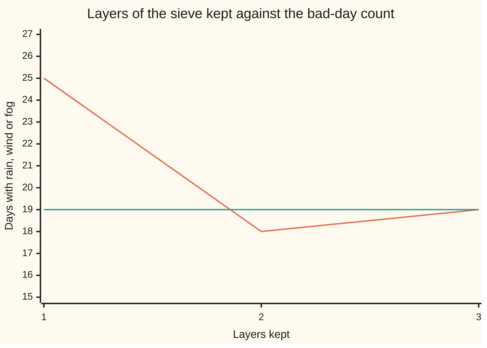

# Stopping the sieve early: the first term over-counts, two terms under-count, and both are guaranteed bounds

[Syllabus](../../../SYLLABUS.md) → [Combinatorics and graphs](../README.md) → [Inclusion-Exclusion and Pigeonhole](../README.md#s04) → Stopping the sieve early

---

## General Overview

A small airfield publishes one line of weather a month. For a 30-day September: rain on 12 days, wind on 8, fog on 5. No day numbers, no breakdown. The flying club needs the unusable days: those with at least one of the three.

Adding gives 25. As a count that is wrong: a day both rainy and windy sits in two totals, counted twice. As a limit it is sound: however the days overlap, the bad days cannot exceed 25.

The pair counts arrive later: 4 days rainy and windy, 2 rainy and foggy, 1 windy and foggy. Take all 7 off and the answer reads 18. Wrong the other way: the day that was rainy, windy and foggy went in three times and came out three times, so it dropped out. But 18 is a floor: the answer sits between 18 and 25 before the log is opened, and the log gives 19.

The exact sieve — add the sets, subtract the pair overlaps, add the triples, keep flipping ([Inclusion-exclusion for any number of sets](01-inclusion-exclusion-for-n-sets.md)) — can be cut off after any layer, and every cut-off is a bound.

**Stop the sieve after an odd number of layers and the total never falls below the true size of the union; after an even number it never rises above it.**

**What kind of fact this is:** a theorem, proved on this card in Why it works.

### The picture: the bracket around the true count



The jagged line is the sieve stopped after one, two and three layers: 25, 18, 19; the flat line is the true count, 19.

---

## The formula

Bars count members: $\lvert A_1 \rvert$ is the number of days in the set $A_1$. $N$ is the size of the union: the days in at least one set. A layer total carries a number under the letter S: $S_1$ adds the set sizes, $S_2$ the sizes of every pair overlap, $S_j$ of every overlap j sets at a time.

The shortest bound, written out in full:

$$\lvert A_1 \cup \cdots \cup A_n \rvert \;\le\; \lvert A_1 \rvert + \cdots + \lvert A_n \rvert$$

**Read it aloud:** the things in at least one of the sets are never more numerous than the sizes added up.

The right side is $S_1$, so the line reads $N \le S_1$: the union bound. One more layer overshoots the other way: subtracting every pair overlap strips the three-heading days out.

$$S_1 - S_2 \;\le\; N \;\le\; S_1$$

Keeping $m$ layers is the general statement. The sigma sign $\sum$ means "add these as $j$ runs from 1 to $m$" ([The binomial theorem](../03-Binomial%20Coefficients%20and%20Identities/02-binomial-theorem.md)); $(-1)^{j+1}$ flips the sign, plus on odd $j$.

$$\sum_{j=1}^{m} (-1)^{j+1} S_j \;\ge\; N \ (m \text{ odd}), \qquad \sum_{j=1}^{m} (-1)^{j+1} S_j \;\le\; N \ (m \text{ even})$$

These are the Bonferroni inequalities (Carlo Emilio Bonferroni, 1936); the first is also Boole's inequality (George Boole, 1854).

| Symbol | Plain meaning | In our example | Push it up and the answer… |
| --- | --- | --- | --- |
| $A_1$, $A_i$, $n$ | the sets, and how many | rainy, windy, foggy; $n$ = 3 | ceiling rises |
| $N$ | the size of the union | 19 bad days | — |
| $S_1$ | set sizes added, uncorrected | 12 + 8 + 5 = 25 | ceiling rises |
| $S_2$, $S_3$, $S_j$ | overlap sizes, j sets at a time | 7, then 1 | floor drops |
| $m$, $j$, $k$ | layers kept, which layer, a day's headings | m = 1, 2, 3; k = 3 | more layers tighten, more headings loosen |
| $\sum$ | add as $j$ runs from below to above | j = 1 to m | — |

### When it holds

- **Finite sets, any overlaps.** No independence and no structure is assumed, and weights add as counts do; a set with infinitely many members has no count to put in a layer total.
- **Whole layers, not part of one.** A partial layer guarantees nothing: removing only the largest overlap here gives 21, above the true 19 by luck.
- **Parity sets the direction.** Odd layer counts bound from above, even ones from below; reading 18 as a ceiling claims the wrong side.

---

## Why it works

### Step 0: the whole claim is about one day

A union's size is the number of days appearing at least once, so the sets can be set aside and single days watched instead. A partial sieve is a bound if it gives each bad day a tally of at least 1 (odd layers) or at most 1 (even). Clear days appear in no layer.

### Step 1: a day under k headings is counted C(k, j) times in layer j

The 12th was rainy, windy and foggy, so k = 3. It appears in all three set sizes, all three pair overlaps and the one triple overlap — 3, 3, 1. Those are the ways of choosing j of its 3 headings, so its share of layer $j$ is C(k, j), the ways to pick j from k ([Combinations, n choose k](../01-Counting%20Principles/05-n-choose-k.md)).

### Step 2: one layer overshoots, two undershoot

Keep one layer. A day under k headings is counted k times but belongs once: k − 1 too many, never negative. Over the log that is 14 days at 0, four at 1, one at 2 — 6 too many, and 25 − 6 = 19. $S_1$ can never fall short: that is the union bound, with its gap named.

Keep two, and a day scores C(k, 1) − C(k, 2): 1 at k = 1, 1 at k = 2, 0 at k = 3, −2 at k = 4. Never above 1, and short once a day carries three headings. Only the 12th does, so two layers give 18 against 19.

### Step 3: the pattern is one binomial coefficient

The tally after m layers collapses to one term.

$$\sum_{j=1}^{m} (-1)^{j+1} C(k,\, j) \;=\; 1 - (-1)^{m}\, C(k-1,\, m) \qquad (k \ge 1)$$

Counts of ways to choose are never negative, so the correction comes off when m is even and goes on when m is odd: at most 1 for even m, at least 1 for odd. C(k − 1, m) is 0 once m reaches k, which is why enough layers are exact.

<details>
<summary>Detailed proof: the partial sum collapses to one coefficient</summary>

Pascal's rule splits each coefficient into the two above it ([Pascal's rule](../03-Binomial%20Coefficients%20and%20Identities/01-pascals-rule-and-the-triangle.md)), and regrouping the signs makes each term one step of a staircase:
$$(-1)^j C(k,\, j) \;=\; (-1)^{j} C(k-1,\, j) \;-\; (-1)^{j-1} C(k-1,\, j-1).$$
Each step's second half cancels the first half of the one before, so adding j from 0 to m leaves only the top: (−1)^m C(k−1, m); the bottom is C(k−1, −1) = 0, there being no way to choose −1 things. That sum differs from the card's by the term C(k, 0) = 1 and by a sign, so the card's is 1 minus it.

</details>

### Step 4: put the days back together

The layer totals are those per-day tallies collected set by set rather than day by day — the same numbers in a different order. For odd m each bad day contributes at least 1 and each clear day 0, so the total is at least the bad-day count; for even m, at most.

The union bound alone has a shorter route: |A ∪ B| ≤ |A| + |B|, applied one set at a time. It says nothing about later layers.

---

## Worked numbers, by hand

| Step | Arithmetic | Value |
| --- | --- | --- |
| the published totals | 12 + 8 + 5 | $S_1$ = 25 |
| one layer kept, odd | 25, nothing taken off | at most **25** |
| the pair overlaps | 4 + 2 + 1 | $S_2$ = 7 |
| two layers kept, even | 25 − 7 | at least **18** |
| the third layer added in | 25 − 7 + 1 | **19** |
| the daily log, listed | 14 + 4 + 1 | **19** |

Nineteen of the thirty days carried rain, wind or fog. The bracket was in hand before any day was named; the third layer closed it.

### What breaks if you drop a piece

| Mistake | Comes out at | What went wrong |
| --- | --- | --- |
| Adding 12, 8 and 5 and stopping | 25 | Five days carry two headings or three, counted again in each |
| Taking the pair overlaps off and stopping | 18 | The three-heading day went in three times and out three times |
| Subtracting the triple overlap, not adding | 17 | A flipped sign: below the truth and below the floor, so no bound |

The code prints these three and the 21 from half a layer.

---

## Code, from first principles, and it actually runs

Nothing is imported. The bad-day count is reached twice, by roads sharing no arithmetic: listing the log, and running the sieve. The per-day tally is built twice too, by sieve and by Step 3's closed form. Both bounds are then tested on all 4096 families of three subsets of a four-day month; 256 have an exact ceiling, one for each way of sending four days to set 1, 2, 3 or nowhere.

### Python

```python
# Stopping the sieve early -- the check behind the card.  Nothing is imported.
# A 30-day log at an airfield: 12 rainy days, 8 windy, 5 foggy, some days under
# two headings and one under all three.  The bad-day count is reached by listing
# the log and again by the sieve, and every truncation is then tested as a bound
# on all 4096 families of three subsets of a four-day month.
RAINY = set(range(1, 13))                        # days 1 to 12
WINDY = {8, 9, 10, 12, 13, 14, 15, 16}           # 8, 9, 10 and 12 are rainy too
FOGGY = {11, 12, 17, 18, 19}                     # 11 and 12 are rainy too
LOG = [RAINY, WINDY, FOGGY]

def layer(sets, j):                              # S_j: all j-at-a-time overlaps added
    total = 0
    for pick in range(1, 1 << len(sets)):        # every group of sets, as a bit pattern
        chosen = [s for i, s in enumerate(sets) if pick >> i & 1]
        if len(chosen) == j:
            total += len(set.intersection(*chosen))
    return total

def truncate(sets, m):                           # the sieve stopped after m layers
    return sum((-1) ** (j + 1) * layer(sets, j) for j in range(1, m + 1))

def yn(claim): return "yes" if claim else "no"

pascal = [[1] + [0] * 5]                         # C(n, k) by Pascal's rule, rows 0 to 5
for r in range(1, 6):
    pascal.append([1] + [pascal[r - 1][i - 1] + pascal[r - 1][i] for i in range(1, 6)])
S = [0] + [layer(LOG, j) for j in (1, 2, 3)]
trunc = [truncate(LOG, m) for m in (1, 2, 3)]
listed = len(RAINY | WINDY | FOGGY)                        # road one: list the log out
by_k = [sum(1 for d in range(1, 31) if sum(d in s for s in LOG) == k) for k in range(4)]
tally = [[truncate([{0}] * k, m) for m in (1, 2, 3, 4)] for k in (1, 2, 3, 4)]
closed = [[1 - (-1) ** m * pascal[k - 1][m] for m in (1, 2, 3, 4)] for k in (1, 2, 3, 4)]
pieces = [{d for d in range(4) if mask >> d & 1} for mask in range(16)]
families, out_of_bounds, tight = 0, 0, 0
for fam in [[a, b, c] for a in pieces for b in pieces for c in pieces]:
    families, u = families + 1, len(fam[0] | fam[1] | fam[2])
    for m in (1, 2, 3):
        t = truncate(fam, m)
        out_of_bounds += (t < u) if m % 2 else (t > u)
        tight += m == 1 and t == u               # ceiling exact: no two sets share a day
biggest = max(len(RAINY & WINDY), len(RAINY & FOGGY), len(WINDY & FOGGY))
wrong = [S[1], S[1] - S[2], S[1] - S[2] - S[3], S[1] - biggest]

print(f"30-day log: rainy {len(RAINY)}, windy {len(WINDY)}, foggy {len(FOGGY)}")
print(f"layer totals: S1 = {S[1]}, S2 = {S[2]}, S3 = {S[3]}")
print(f"sieve stopped after 1, 2, 3 layers: {trunc[0]}, {trunc[1]}, {trunc[2]}")
print(f"bad days by listing the log: {listed}")
print(f"days under 0, 1, 2, 3 headings: {by_k[0]}, {by_k[1]}, {by_k[2]}, {by_k[3]}")
print(f"one layer over-counts by {trunc[0] - listed}, two layers under-count by {listed - trunc[1]}")
print("tally for one day under k headings, m = 1 2 3 4:")
for k in (1, 2, 3, 4):
    print(f"  k = {k}: {tally[k - 1]}")
print(f"the same tallies from 1 - (-1)^m C(k-1, m): {yn(tally == closed)}")
print(f"sweep: {families} families of 3 subsets of 4 days, out of bounds: {out_of_bounds}, ceiling exact: {tight}")
print(f"mistakes come out at {wrong[0]}, {wrong[1]}, {wrong[2]} and {wrong[3]}, against the true {listed}")
assert listed == trunc[2]                                  # listing the log vs the full sieve
assert (trunc[0], trunc[1]) == (25, 18) and trunc[0] >= listed >= trunc[1]
assert tally == closed and tally[2] == [3, 0, 1, 1]        # counted vs the closed form
assert out_of_bounds == 0 and tight == 4 ** 4              # one home per day: set 1, 2, 3 or none
print("ALL CHECKS PASS")
```

**Ran 2026-09-14 on macOS, Python 3.14.6, standard library only. All checks passed. Output, pasted from the run:**

```
30-day log: rainy 12, windy 8, foggy 5
layer totals: S1 = 25, S2 = 7, S3 = 1
sieve stopped after 1, 2, 3 layers: 25, 18, 19
bad days by listing the log: 19
days under 0, 1, 2, 3 headings: 11, 14, 4, 1
one layer over-counts by 6, two layers under-count by 1
tally for one day under k headings, m = 1 2 3 4:
  k = 1: [1, 1, 1, 1]
  k = 2: [2, 1, 1, 1]
  k = 3: [3, 0, 1, 1]
  k = 4: [4, -2, 2, 1]
the same tallies from 1 - (-1)^m C(k-1, m): yes
sweep: 4096 families of 3 subsets of 4 days, out of bounds: 0, ceiling exact: 256
mistakes come out at 25, 18, 17 and 21, against the true 19
ALL CHECKS PASS
```

### Rust

Same numbers and labels, built with `rustc --edition 2021 -O`; days are bit patterns.

```rust
// Stopping the sieve early -- the same check as the Python, in Rust.  No crates.
// A 30-day log at an airfield: 12 rainy days, 8 windy, 5 foggy, some days under
// two headings and one under all three.  The bad-day count is reached by listing
// the log and again by the sieve, and every truncation is then tested as a bound
// on all 4096 families of three subsets of a four-day month.

fn bits(days: &[u32]) -> u64 {                        // a set of days held as one number
    days.iter().fold(0u64, |acc, &d| acc | 1u64 << d)
}

fn layer(sets: &[u64], j: usize) -> i64 {             // S_j: all j-at-a-time overlaps added
    let mut total = 0i64;
    for pick in 1..(1u32 << sets.len()) {             // every group of sets, as a bit pattern
        let chosen: Vec<u64> = sets.iter().enumerate()
            .filter(|(i, _)| pick >> i & 1 == 1).map(|(_, &s)| s).collect();
        if chosen.len() == j {
            total += chosen.iter().fold(u64::MAX, |a, &s| a & s).count_ones() as i64;
        }
    }
    total
}

fn truncate(sets: &[u64], m: usize) -> i64 {          // the sieve stopped after m layers
    (1..=m).map(|j| if j % 2 == 1 { layer(sets, j) } else { -layer(sets, j) }).sum()
}

fn yn(claim: bool) -> &'static str { if claim { "yes" } else { "no" } }

fn main() {
    let rainy = bits(&(1..=12).collect::<Vec<u32>>());     // days 1 to 12
    let windy = bits(&[8, 9, 10, 12, 13, 14, 15, 16]);     // 8, 9, 10 and 12 are rainy too
    let foggy = bits(&[11, 12, 17, 18, 19]);               // 11 and 12 are rainy too
    let log = vec![rainy, windy, foggy];
    let mut pascal = vec![vec![0i64; 6]; 6];               // C(n, k) by Pascal's rule, rows 0 to 5
    pascal[0][0] = 1;
    for r in 1..6 {
        pascal[r][0] = 1;
        for i in 1..6 { pascal[r][i] = pascal[r - 1][i - 1] + pascal[r - 1][i] }
    }
    let s: Vec<i64> = (0usize..4).map(|j| if j == 0 { 0 } else { layer(&log, j) }).collect();
    let trunc: Vec<i64> = (1usize..=3).map(|m| truncate(&log, m)).collect();
    let listed = (rainy | windy | foggy).count_ones() as i64;     // road one: list the log out
    let by_k: Vec<usize> = (0usize..4).map(|k| (1u32..=30)
        .filter(|&d| log.iter().filter(|&&x| x >> d & 1 == 1).count() == k).count()).collect();
    let tally: Vec<Vec<i64>> = (1usize..=4).map(|k|
        (1usize..=4).map(|m| truncate(&vec![1u64; k], m)).collect()).collect();
    let closed: Vec<Vec<i64>> = (1usize..=4).map(|k| (1usize..=4)
        .map(|m| 1 - if m % 2 == 1 { -pascal[k - 1][m] } else { pascal[k - 1][m] }).collect()).collect();
    let (mut families, mut out_of_bounds, mut tight) = (0i64, 0i64, 0i64);
    for a in 0u64..16 { for b in 0u64..16 { for c in 0u64..16 {
        let (fam, u) = ([a, b, c], (a | b | c).count_ones() as i64);
        families += 1;
        for m in 1usize..=3 {
            let t = truncate(&fam, m);
            if if m % 2 == 1 { t < u } else { t > u } { out_of_bounds += 1 }
            if m == 1 && t == u { tight += 1 }   // ceiling exact: no two sets share a day
        }
    }}}
    let biggest = [rainy & windy, rainy & foggy, windy & foggy]
        .iter().map(|x| x.count_ones() as i64).max().unwrap();
    let wrong = [s[1], s[1] - s[2], s[1] - s[2] - s[3], s[1] - biggest];
    println!("30-day log: rainy {}, windy {}, foggy {}",
             rainy.count_ones(), windy.count_ones(), foggy.count_ones());
    println!("layer totals: S1 = {}, S2 = {}, S3 = {}", s[1], s[2], s[3]);
    println!("sieve stopped after 1, 2, 3 layers: {}, {}, {}", trunc[0], trunc[1], trunc[2]);
    println!("bad days by listing the log: {}", listed);
    println!("days under 0, 1, 2, 3 headings: {}, {}, {}, {}", by_k[0], by_k[1], by_k[2], by_k[3]);
    println!("one layer over-counts by {}, two layers under-count by {}", trunc[0] - listed, listed - trunc[1]);
    println!("tally for one day under k headings, m = 1 2 3 4:");
    for k in 1usize..=4 { println!("  k = {}: {:?}", k, tally[k - 1]) }
    println!("the same tallies from 1 - (-1)^m C(k-1, m): {}", yn(tally == closed));
    println!("sweep: {} families of 3 subsets of 4 days, out of bounds: {}, ceiling exact: {}", families, out_of_bounds, tight);
    println!("mistakes come out at {}, {}, {} and {}, against the true {}",
             wrong[0], wrong[1], wrong[2], wrong[3], listed);
    assert!(listed == trunc[2]);                               // listing the log vs the full sieve
    assert!((trunc[0], trunc[1]) == (25, 18) && trunc[0] >= listed && listed >= trunc[1]);
    assert!(tally == closed && tally[2] == vec![3, 0, 1, 1]);  // counted vs the closed form
    assert!(out_of_bounds == 0 && tight == 4i64.pow(4)); // one home per day: set 1, 2, 3 or none
    println!("ALL CHECKS PASS");
}
```

**Ran 2026-09-14 on macOS, rustc 1.98.1, no crates. All checks passed. Output, pasted from the run:**

```
30-day log: rainy 12, windy 8, foggy 5
layer totals: S1 = 25, S2 = 7, S3 = 1
sieve stopped after 1, 2, 3 layers: 25, 18, 19
bad days by listing the log: 19
days under 0, 1, 2, 3 headings: 11, 14, 4, 1
one layer over-counts by 6, two layers under-count by 1
tally for one day under k headings, m = 1 2 3 4:
  k = 1: [1, 1, 1, 1]
  k = 2: [2, 1, 1, 1]
  k = 3: [3, 0, 1, 1]
  k = 4: [4, -2, 2, 1]
the same tallies from 1 - (-1)^m C(k-1, m): yes
sweep: 4096 families of 3 subsets of 4 days, out of bounds: 0, ceiling exact: 256
mistakes come out at 25, 18, 17 and 21, against the true 19
ALL CHECKS PASS
```

Both outputs match line for line.

> [!TIP]
> **Try changing**
> Guess first, then run it. The asserts are pinned to this month's numbers, so expect one to fire.
> - **No day under three headings.** Set `FOGGY` to `{20, 21, 22, 23, 24}`: the floor rises to 21, the truth, two layers being exact once nothing carries three.
> - **Flip the signs.** Change `(-1) ** (j + 1)` to `(-1) ** j`: every truncation lands on the wrong side, and the sweep reports 8190 out of bounds.
> - **A wider sweep.** In the `pieces` line change `range(4)` to `range(5)` and `range(16)` to `range(32)`: 32768 families, still 0 out of bounds.

---

## The usual mistake

> [!warning]
> **Reading the union bound as an estimate.** 25 is a ceiling, not a count. The truth here is 19, about a quarter lower, and the bound gives no hint how loose it is. It is exact only when no two sets share a member.
>
> - **Reporting 18 after the pair overlaps.** That is a floor; the missing 1 is the day under all three headings.
> - **Getting a layer's sign wrong.** Subtracting the triple overlap gives 17, neither the answer nor a bound.
> - **Using part of a layer.** Removing only the 4 rainy-and-windy days gives 21, guaranteed by nothing. And each layer helps less: the third moved the floor by 1.

---

## Where you meet it in real life

- **Error budgets.** A project slips if any of its twelve tasks slips, so slipping runs are at most the twelve task counts added up, however the delays are linked.
- **Proving something exists by counting.** If the bad arrangements fall into families whose sizes add to less than the total, some arrangement escapes them all: the engine behind [Erdos's counting trick](../14-Ramsey%20and%20Extremal%2C%20in%20Outline/03-probabilistic-method-by-counting.md).
- **Testing many things at once.** The chance any of twenty tests raises a false alarm is capped by the twenty chances added up; shrinking each allowance to match carries Bonferroni's name ([Many tests](../../09-Probability%20and%20statistics/08-Confidence%20Intervals%20and%20Tests/08-multiple-testing.md)).

> **Say it back**
> Counting a union exactly means adding the sets, subtracting the pair overlaps, adding the triples, onwards. Cut it off early and what remains is still a guarantee: an odd number of terms never lands below the truth, an even number never above. The sizes alone give the union bound; the pair overlaps taken off too give a floor. At the airfield, 25 and 18 around a true 19.

---

## What this builds on

- [Inclusion-exclusion for any number of sets](01-inclusion-exclusion-for-n-sets.md): the full alternating sieve cut short here, and the C(k, j) appearances in layer j.
- [The number line and inequalities](../../01-Foundations/02-The%20Number%20Line/02-number-line-and-inequalities.md): what "at most" and "at least" claim, and why adding something never negative moves a total one way only.

## Where this goes next

- [Erdos's counting trick](../14-Ramsey%20and%20Extremal%2C%20in%20Outline/03-probabilistic-method-by-counting.md): the bound proving an object exists without producing one.
- [Many tests](../../09-Probability%20and%20statistics/08-Confidence%20Intervals%20and%20Tests/08-multiple-testing.md): the same inequality on chances.
- Tail bounds: capping the chance that any of many trials goes wrong.
- Learning with a guarantee: bounding the chance that any rule in a large collection misleads.

A ceiling from sizes alone is generous when the sets overlap heavily, and nothing here says how generous without opening the log; turning that slack into a proof is a later card's work.

---

## Sources

Verified 14 Sep 2026: every link below resolves to the publisher's page.

- Galambos, Janos. "Bonferroni Inequalities." *The Annals of Probability* 5, no. 4 (1977). [doi:10.1214/aop/1176995765](https://doi.org/10.1214/aop/1176995765). Surveys the truncation bounds and their sharpenings.
- Stanley, Richard P. *Enumerative Combinatorics, Volume 1*, 2nd ed. [Author's page, with the full text](https://math.mit.edu/~rstan/ec/). Chapter 2 sets out the sieve cut short here.
- Boole, George. *An Investigation of the Laws of Thought*, 1854; Cambridge University Press reissue. [doi:10.1017/cbo9780511693090](https://doi.org/10.1017/cbo9780511693090). Source of the first inequality's other name.
