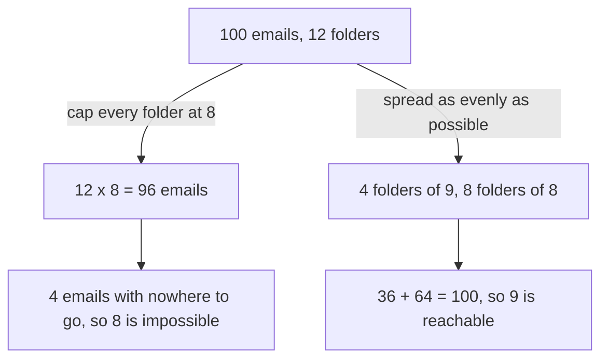

# Pigeonhole, extended: n items in k boxes force a box with at least n/k rounded up, and choosing the boxes is the whole trick

[Syllabus](../../../SYLLABUS.md) → [Combinatorics and graphs](../../../SYLLABUS.md#w04) → [Inclusion-Exclusion and Pigeonhole](../../../SYLLABUS.md#w04-s04) → Pigeonhole, extended

---

## General Overview

An inbox holds 100 emails. Twelve folders are open, and every email must go in one. File them by sender, by date, by mood — any rule at all — and some folder finishes with at least 9 in it.

Nine, not two. The familiar version says only that more items than boxes force some box to take two ([Pigeonhole](../../01-Foundations/08-Relations%20and%20Functions/08-pigeonhole-principle.md)) — far too weak here. Cap every folder at 8 and twelve folders hold 96 emails, leaving 4 standing. Share 100 over 12 folders and each gets 8.3333; folders hold whole emails, so round up.

The principle is free; choosing what counts as an item and what counts as a box is where arguments are won. Ten days of email arrivals — 23, 41, 17, 8, 36, 52, 12, 29, 4, 31 — hide a run of consecutive days totalling an exact multiple of 10. Nothing in the list announces it; the right boxes make it certain, and they are not the days.

**Spread n items over k boxes in any way at all and the fullest box still holds at least n divided by k, rounded up; the skill is choosing what the boxes are.**

**What kind of fact this is:** a theorem, proved on this card in Why it works.

### The picture: two roads to the same 9



The left branch rules out 8; the right reaches 9. Between them, 9 is exact.

---

## The formula

Two pieces of notation, in words first. Corner marks on either side of a number say: round it up to the next whole number. So 8.3333 becomes 9, and 9 stays 9. Straight bars on either side of a set count its members.

$$\max_i \ \lvert B_i \rvert \ \ge\ \left\lceil \frac{n}{k} \right\rceil$$

**Read it aloud:** however the items are placed, the fullest box holds at least the average load, rounded up.

| Symbol | Plain meaning | In our example | Push it up and the answer… |
| --- | --- | --- | --- |
| $n$ | how many items are placed | 100 emails | a fuller box |
| $k$ | how many boxes they go into | 12 folders | an emptier box |
| $B_i$ | the items that landed in box number i | one folder's emails | — |
| $\lvert B_i \rvert$ | that box's load: how many it holds | 8 or 9 | — |
| $\max_i \lvert B_i \rvert$ | the largest load, over every box | the fullest folder's 9 | — |
| $n/k$ | the average load, spread perfectly evenly | 8.3333 | — |
| $\lceil n/k \rceil$ | that average rounded up | 9 | — |
| $q$, $r$ | how many whole times $k$ goes into $n$, and the leftover | 8 and 4 | one more crowded box |

The even spread has its own formula: $n = q \times k + r$. Give $r$ boxes one more than $q$ and the rest $q$ each. For the inbox, 100 = 8 × 12 + 4.

### When it holds

- **One box per item.** Cross-file an email into two folders and the count is of filings, not emails, and the bound moves to that larger number.
- **Items that cannot be split.** Rounding up is the only place whole numbers enter; without it the claim weakens to "at least 8.3333 emails".
- **Finitely many items.** Infinitely many in finitely many boxes force a box with infinitely many — a different theorem.
- **A floor, on no named box.** One folder could hold all 100; the theorem never promises exactly 9, nor says which folder.

---

## Why it works

### Step 0: the largest number in a list is never below the average

Twelve folder loads add up to 100, so their average is 8.3333. Were every one below 8.3333, the twelve together would come to less than 100. They come to exactly 100, so at least one load sits at or above the average. That is the whole theorem; the rest is bookkeeping.

### Step 1: the loads add up to the item count, so the average is n/k

Every item lands in exactly one box, so counting box by box counts each item once ([The rules of sum and product](../01-Counting%20Principles/01-rules-of-sum-and-product.md)):

$$\sum_{i=1}^{k} \lvert B_i \rvert = n$$

The sigma sign says: add up what follows, once for every box, from the first to the k-th. Divide by k and the average load is n/k. A load counts items, so it is a whole number, and the smallest whole number not below n/k is n/k rounded up — for the inbox, 9.

### Step 2: the same thing by contradiction

Suppose the claim fails: every box holds at most one less than n/k rounded up. Rounding up moves a number less than a whole step, so that capped load is below n/k, and k boxes at the cap hold fewer than n items. They hold n between them, so an item has vanished ([Proof by contradiction](../../01-Foundations/06-Proof/03-proof-by-contradiction.md)).

### Step 3: 9 cannot be sharpened, because a filing reaches it

Deal the 100 emails out one at a time round the twelve folders: the loads come out 9, 9, 9, 9 and then eight folders of 8. In general the even spread gives $r$ boxes of $q + 1$ and the rest $q$, so the fullest holds $\lceil n/k \rceil$: $q + 1$ when something is left over, $q$ when $k$ divides $n$ exactly. The bound is attained, not a cautious estimate — and the code confirms it by trying every possible filing for the 32 small cases with n up to 8 and k up to 4.

### Step 4: the boxes are the invention — here, running totals

Back to the ten days of arrivals, and the run that totals a multiple of 10.

The items are not the days. They are the eleven **running totals**: 0 before any day has passed, 23 after one day, 64 after two, on to 253. The boxes are the ten remainders after dividing by 10 ([Congruence](../../02-Number%20theory/03-Clock%20Arithmetic/01-congruence-mod-n.md)).

Eleven items, ten boxes, so two totals share a box: 89 and 189 both leave 9. Subtract, and equal remainders cancel: 189 − 89 = 100, a multiple of 10 — and the difference of two running totals is the total of the days between them, here days 5 to 7.

<details>
<summary>Detailed proof: any n whole numbers hide a run summing to a multiple of n</summary>

Call the numbers a(1) up to a(n) in order and form the n + 1 running totals p(0) = 0, p(1) = a(1), p(2) = a(1) + a(2), on to p(n). Each leaves one of the n remainders 0 to n − 1 after division by n, so n + 1 items go into n boxes and two totals must share: p(u) and p(v), with u below v, leave the same remainder.

Equal remainders cancel, so p(v) − p(u) is a multiple of n. Running totals telescope: p(v) − p(u) = a(u+1) + … + a(v), the consecutive run from position u + 1 through v, non-empty because u is below v.

The empty total p(0) does two jobs: it makes the item count n + 1, and it lets a run start at the first term.

</details>

Pigeonhole forces a crowded box and stops; it never counts the filings that avoid one. That counting is the sieve's job on [Inclusion-exclusion for any number of sets](01-inclusion-exclusion-for-n-sets.md), cut short for a quick bound on [Stopping the sieve early](04-union-bound-and-bonferroni.md).

---

## Worked numbers, by hand

| Step | Arithmetic | Value |
| --- | --- | --- |
| the average load | 100 divided by 12 | 8.3333 |
| rounded up | next whole number above 8.3333 | **9** |
| cap every folder at 8 | 12 × 8 | 96, four short |
| four folders of 9, eight of 8 | 36 + 64 | **100** |
| dealt out one at a time | 9, 9, 9, 9, then eight 8s | fullest **9** |

Some folder ends up with at least 9 of the 100 emails, however they are filed.

### What breaks if you drop a piece

| Mistake | Comes out at | What went wrong |
| --- | --- | --- |
| Whole part of the average, plus 1 | 11, for 120 emails in 12 folders | Adding 1 is right only when something is left over; 12 divides 120, so the forced load is 10 |
| Counting 13 folders where there are 12 | 8, not 9 | One box too many lowers the forced load |
| Leaving out the running total before day 1 | 10 totals, 10 boxes | As many boxes as items forces nothing, and the run argument collapses |

The code prints all three.

---

## Code, from first principles, and it actually runs

Nothing is imported. The fullest folder is reached three ways: the formula, dealing the emails out one at a time, and trying every possible filing at small sizes. The run of days is found twice, by remainders and by adding every run up directly; then both roads run over 2,000 random ten-day lists from a generator the script writes itself.

### Python

```python
# Pigeonhole, extended -- the check behind the card.  Nothing is imported.  100
# emails go into 12 folders and the fullest folder is found three ways: by the
# formula, by dealing the emails out one at a time, and by trying every filing at
# small sizes.  Then ten days of arrivals, and a run totalling a multiple of 10.
N, K, M = 100, 12, 10
ARRIVALS = [23, 41, 17, 8, 36, 52, 12, 29, 4, 31]

def ceil_div(n, k):                          # road one: n divided by k, rounded up
    return -(-n // k)

def fullest(code, n, k):                     # the load of the fullest box in one filing
    loads, c = [0] * k, code
    for _ in range(n): loads[c % k] += 1; c //= k
    return max(loads)

def prefixes(vals):                          # running totals, the first one empty
    return [sum(vals[:j]) for j in range(len(vals) + 1)]

def first_repeat(rs):                        # the two boxes that must collide
    seen = {}
    for i, r in enumerate(rs):
        if r in seen: return seen[r], i
        seen[r] = i

def runs(vals, m):                           # road two: check every run directly
    return [(i + 1, j + 1, sum(vals[i:j + 1])) for i in range(len(vals))
            for j in range(i, len(vals)) if sum(vals[i:j + 1]) % m == 0]

loads, q, r = [0] * K, N // K, N % K
for i in range(N): loads[i % K] += 1         # road two: hand the emails out in turn
cases = [(n, k) for n in range(1, 9) for k in range(1, 5)]
attained = all(min(fullest(c, n, k) for c in range(k ** n)) == ceil_div(n, k) for n, k in cases)
pre, found = prefixes(ARRIVALS), runs(ARRIVALS, M)
rems = [p % M for p in pre]; i0, i1 = first_repeat(rems)
seed, pig, hit = 1, 0, 0
for _ in range(2000):                        # our own random numbers, nothing imported
    lst = []
    for _ in range(10):
        seed = (1103515245 * seed + 12345) % 2147483648; lst.append(seed % 97 + 1)
    pig += first_repeat([p % M for p in prefixes(lst)]) is not None
    hit += len(runs(lst, M)) > 0

print(f"{N} emails into {K} folders: average load {N}/{K} = {N / K:.4f}, rounded up {ceil_div(N, K)}")
print(f"cap every folder at {q}: {K} x {q} = {K * q}, {N - K * q} emails left over; evenly, {N} = {q} x {K} + {r}")
print(f"{r} folders of {q + 1} and {K - r} folders of {q}: {r * (q + 1)} + {(K - r) * q} = {N}")
print(f"dealt one at a time, folder loads: {loads}, fullest {max(loads)}")
print(f"every filing of n items into k boxes, n = 1..8, k = 1..4: {len(cases)} cases, bound met and attained: {'yes' if attained else 'no'}")
print(f"mistake 1, whole part of n/k plus 1, on 120 emails in {K} folders: {120 // K + 1}, the truth is {ceil_div(120, K)}\nmistake 2, 13 folders counted instead of {K}: {ceil_div(N, 13)}, not {ceil_div(N, K)}")
print(f"ten days of arrivals: {ARRIVALS}\nrunning totals, starting with the empty one: {pre}\nremainders after dividing by {M}: {rems}")
print(f"{len(pre)} totals into {M} remainder boxes: totals {pre[i0]} and {pre[i1]} both leave {rems[i1]}\ndays {i0 + 1} to {i1} sum to {pre[i1]} - {pre[i0]} = {pre[i1] - pre[i0]}, a multiple of {M}")
print(f"every run summing to a multiple of {M}, by search: {found}")
print(f"mistake 3, the empty total left out: {len(pre) - 1} totals, {M} boxes, nothing forced")
print(f"2000 random ten-day lists: {pig} found a run by remainders, {hit} by search")
assert ceil_div(N, K) == max(loads) and loads.count(q + 1) == r
assert attained and fullest(0, N, K) == N
assert (i0, i1) == (4, 7) and (i0 + 1, i1, pre[i1] - pre[i0]) in found
assert pig == 2000 and hit == 2000
print("ALL CHECKS PASS")
```

**Ran 2026-09-14 on macOS, Python 3.14.6, standard library only. All checks passed. Output, pasted from the run:**

```
100 emails into 12 folders: average load 100/12 = 8.3333, rounded up 9
cap every folder at 8: 12 x 8 = 96, 4 emails left over; evenly, 100 = 8 x 12 + 4
4 folders of 9 and 8 folders of 8: 36 + 64 = 100
dealt one at a time, folder loads: [9, 9, 9, 9, 8, 8, 8, 8, 8, 8, 8, 8], fullest 9
every filing of n items into k boxes, n = 1..8, k = 1..4: 32 cases, bound met and attained: yes
mistake 1, whole part of n/k plus 1, on 120 emails in 12 folders: 11, the truth is 10
mistake 2, 13 folders counted instead of 12: 8, not 9
ten days of arrivals: [23, 41, 17, 8, 36, 52, 12, 29, 4, 31]
running totals, starting with the empty one: [0, 23, 64, 81, 89, 125, 177, 189, 218, 222, 253]
remainders after dividing by 10: [0, 3, 4, 1, 9, 5, 7, 9, 8, 2, 3]
11 totals into 10 remainder boxes: totals 89 and 189 both leave 9
days 5 to 7 sum to 189 - 89 = 100, a multiple of 10
every run summing to a multiple of 10, by search: [(2, 10, 230), (5, 7, 100)]
mistake 3, the empty total left out: 10 totals, 10 boxes, nothing forced
2000 random ten-day lists: 2000 found a run by remainders, 2000 by search
ALL CHECKS PASS
```

### Rust

Same numbers, same labels, built with `rustc --edition 2021 -O`.

```rust
// Pigeonhole, extended -- the same check as the Python, in Rust.  No crates.  100
// emails go into 12 folders and the fullest folder is found three ways: by the
// formula, by dealing the emails out one at a time, and by trying every filing at
// small sizes.  Then ten days of arrivals, and a run totalling a multiple of 10.
const N: i64 = 100;
const K: i64 = 12;
const M: i64 = 10;

fn ceil_div(n: i64, k: i64) -> i64 { (n + k - 1) / k }   // road one: n over k, rounded up

fn fullest(code: i64, n: i64, k: i64) -> i64 {           // the fullest box in one filing
    let (mut loads, mut c) = (vec![0i64; k as usize], code);
    for _ in 0..n { loads[(c % k) as usize] += 1; c /= k }
    *loads.iter().max().unwrap()
}

fn prefixes(vals: &[i64]) -> Vec<i64> {                  // running totals, the first one empty
    (0..=vals.len()).map(|j| vals[..j].iter().sum()).collect()
}

fn first_repeat(rs: &[i64]) -> Option<(usize, usize)> {  // the two boxes that must collide
    let mut seen: Vec<Option<usize>> = vec![None; M as usize];
    for (i, &r) in rs.iter().enumerate() {
        match seen[r as usize] { Some(j) => return Some((j, i)), None => seen[r as usize] = Some(i) }
    }
    None
}

fn runs(vals: &[i64], m: i64) -> Vec<(i64, i64, i64)> {  // road two: check every run directly
    let mut out = Vec::new();
    for i in 0..vals.len() { for j in i..vals.len() {
        let s: i64 = vals[i..=j].iter().sum();
        if s % m == 0 { out.push((i as i64 + 1, j as i64 + 1, s)) }
    } }
    out
}

fn main() {
    let arrivals: Vec<i64> = vec![23, 41, 17, 8, 36, 52, 12, 29, 4, 31];
    let (mut loads, q, r) = (vec![0i64; K as usize], N / K, N % K);
    for i in 0..N { loads[(i % K) as usize] += 1 }        // road two: hand the emails out in turn
    let cases: Vec<(i64, i64)> = (1..9).flat_map(|n| (1..5).map(move |k| (n, k))).collect();
    let attained = cases.iter().all(|&(n, k)|
        (0..k.pow(n as u32)).map(|c| fullest(c, n, k)).min().unwrap() == ceil_div(n, k));
    let (pre, found) = (prefixes(&arrivals), runs(&arrivals, M));
    let rems: Vec<i64> = pre.iter().map(|p| p % M).collect();
    let (i0, i1) = first_repeat(&rems).unwrap();
    let (mut seed, mut pig, mut hit) = (1i64, 0i64, 0i64);
    for _ in 0..2000 {                                   // our own random numbers, no crates
        let mut lst: Vec<i64> = Vec::new();
        for _ in 0..10 { seed = (1103515245 * seed + 12345) % 2147483648; lst.push(seed % 97 + 1) }
        let rs: Vec<i64> = prefixes(&lst).iter().map(|p| p % M).collect();
        if first_repeat(&rs).is_some() { pig += 1 }
        if !runs(&lst, M).is_empty() { hit += 1 }
    }
    let mx = *loads.iter().max().unwrap();
    println!("{} emails into {} folders: average load {}/{} = {:.4}, rounded up {}", N, K, N, K, N as f64 / K as f64, ceil_div(N, K));
    println!("cap every folder at {}: {} x {} = {}, {} emails left over; evenly, {} = {} x {} + {}", q, K, q, K * q, N - K * q, N, q, K, r);
    println!("{} folders of {} and {} folders of {}: {} + {} = {}", r, q + 1, K - r, q, r * (q + 1), (K - r) * q, N);
    println!("dealt one at a time, folder loads: {:?}, fullest {}", loads, mx);
    println!("every filing of n items into k boxes, n = 1..8, k = 1..4: {} cases, bound met and attained: {}", cases.len(), if attained { "yes" } else { "no" });
    println!("mistake 1, whole part of n/k plus 1, on 120 emails in {} folders: {}, the truth is {}\nmistake 2, 13 folders counted instead of {}: {}, not {}", K, 120 / K + 1, ceil_div(120, K), K, ceil_div(N, 13), ceil_div(N, K));
    println!("ten days of arrivals: {:?}\nrunning totals, starting with the empty one: {:?}\nremainders after dividing by {}: {:?}", arrivals, pre, M, rems);
    println!("{} totals into {} remainder boxes: totals {} and {} both leave {}\ndays {} to {} sum to {} - {} = {}, a multiple of {}", pre.len(), M, pre[i0], pre[i1], rems[i1], i0 + 1, i1, pre[i1], pre[i0], pre[i1] - pre[i0], M);
    println!("every run summing to a multiple of {}, by search: {:?}", M, found);
    println!("mistake 3, the empty total left out: {} totals, {} boxes, nothing forced", pre.len() - 1, M);
    println!("2000 random ten-day lists: {} found a run by remainders, {} by search", pig, hit);
    assert!(ceil_div(N, K) == mx && loads.iter().filter(|&&x| x == q + 1).count() as i64 == r);
    assert!(attained && fullest(0, N, K) == N);
    assert!((i0, i1) == (4, 7) && found.contains(&(i0 as i64 + 1, i1 as i64, pre[i1] - pre[i0])));
    assert!(pig == 2000 && hit == 2000);
    println!("ALL CHECKS PASS");
}
```

**Ran 2026-09-14 on macOS, rustc 1.98.1, no crates. All checks passed. Output, pasted from the run:**

```
100 emails into 12 folders: average load 100/12 = 8.3333, rounded up 9
cap every folder at 8: 12 x 8 = 96, 4 emails left over; evenly, 100 = 8 x 12 + 4
4 folders of 9 and 8 folders of 8: 36 + 64 = 100
dealt one at a time, folder loads: [9, 9, 9, 9, 8, 8, 8, 8, 8, 8, 8, 8], fullest 9
every filing of n items into k boxes, n = 1..8, k = 1..4: 32 cases, bound met and attained: yes
mistake 1, whole part of n/k plus 1, on 120 emails in 12 folders: 11, the truth is 10
mistake 2, 13 folders counted instead of 12: 8, not 9
ten days of arrivals: [23, 41, 17, 8, 36, 52, 12, 29, 4, 31]
running totals, starting with the empty one: [0, 23, 64, 81, 89, 125, 177, 189, 218, 222, 253]
remainders after dividing by 10: [0, 3, 4, 1, 9, 5, 7, 9, 8, 2, 3]
11 totals into 10 remainder boxes: totals 89 and 189 both leave 9
days 5 to 7 sum to 189 - 89 = 100, a multiple of 10
every run summing to a multiple of 10, by search: [(2, 10, 230), (5, 7, 100)]
mistake 3, the empty total left out: 10 totals, 10 boxes, nothing forced
2000 random ten-day lists: 2000 found a run by remainders, 2000 by search
ALL CHECKS PASS
```

> [!TIP]
> **Try changing**
> Guess first, then run it.
> - **One hundred and twenty emails.** Set `N` to 120. Nothing is left over, so every folder ends with 10 and the forced load is 10, not 11. All four asserts still pass.
> - **Drop the empty running total.** In `prefixes`, start the range at 1. Ten totals meet ten boxes, nothing is forced, and the third assert stops the run.
> - **Nine boxes instead of ten.** Set `M` to 9. Both roads still agree, but the forced run becomes days 1 to 3 and the third assert fails.

---

## The usual mistake

> [!warning]
> **Reading "at least 9" as "exactly 9", or as a claim about every folder.** The theorem puts a floor under the fullest folder and nothing else. One folder holding all 100 emails satisfies it; so do eleven empty folders. What it rules out is every folder holding 8 or fewer, which needs 12 × 8 = 96 slots.
>
> - **Miscounting the boxes.** Thirteen folders instead of twelve drops the forced load from 9 to 8; the box count is where these arguments go wrong.
> - **Asking which folder.** The proof counts; it does not point. No amount of rereading it names the crowded folder.
> - **Forgetting the empty running total.** Ten totals into ten boxes force nothing; the item that looks absent is the one doing the work.

---

## Where you meet it in real life

- **Hash tables.** More keys than slots and two must share one, so collision handling is compulsory, not defensive. The extended form sizes the worst bucket: 100 keys in 12 slots put at least 9 somewhere.
- **Capacity planning.** Send 100 requests to 12 workers and one takes at least 9. Planning against the average of 8.3333 plans for a case that cannot happen.
- **Remainders as boxes.** When a question asks for a multiple of something, make the remainders the boxes ([Congruence](../../02-Number%20theory/03-Clock%20Arithmetic/01-congruence-mod-n.md)).
- **Colouring arguments.** Colours as boxes give [Friends and strangers](../14-Ramsey%20and%20Extremal%2C%20in%20Outline/01-friends-and-strangers.md).

> **Say it back**
> Put items into boxes and the fullest box holds at least the average, rounded up: no list has every member below its own average, and loads are whole numbers. One hundred emails in twelve folders force a folder with 9, and a filing reaching exactly 9 exists, so 9 cannot be sharpened. Choosing the items and boxes is the work: ten days of arrivals hide a run totalling a multiple of 10 once the running totals are the items and the remainders the boxes.

---

## What this builds on

- [The rules of sum and product](../01-Counting%20Principles/01-rules-of-sum-and-product.md): why counting box by box returns the item count once.
- [Pigeonhole](../../01-Foundations/08-Relations%20and%20Functions/08-pigeonhole-principle.md): the simple form, sharpened here and used in the running-totals proof.
- [Congruence](../../02-Number%20theory/03-Clock%20Arithmetic/01-congruence-mod-n.md): remainders after division, and why equal ones cancel on subtraction.
- [Proof by contradiction](../../01-Foundations/06-Proof/03-proof-by-contradiction.md): the shape of Step 2, where capping every box loses an item.

## Where this goes next

- [Friends and strangers](../14-Ramsey%20and%20Extremal%2C%20in%20Outline/01-friends-and-strangers.md): three mutual friends or three mutual strangers among any six people.
- [Erdos-Szekeres](../14-Ramsey%20and%20Extremal%2C%20in%20Outline/04-erdos-szekeres.md): two labels at once as boxes, forcing a long run that only rises or only falls.
- Sunflowers and union-closed families: questions of this shape nobody has settled.

A crowded box is not yet a pattern, and forcing patterns rather than mere crowding is the Ramsey cards' work.

---

## Sources

Verified 14 Sep 2026: every link below resolves to the publisher's page.

- Aigner, Martin, and Günter M. Ziegler. "Pigeon-hole and double counting," in *Proofs from THE BOOK*, 6th ed. Springer, 2018. [Chapter page](https://link.springer.com/chapter/10.1007/978-3-662-57265-8_28). The generalised form, with the counting arguments beside it.
- Engel, Arthur. *Problem-Solving Strategies*. Springer, 1998. [Publisher page](https://link.springer.com/book/10.1007/b97682). Its chapter "The Box Principle" drills the choosing of boxes.
- Lehman, Eric, F. Thomson Leighton, and Albert R. Meyer. *Mathematics for Computer Science*, MIT 6.042J. [Course page, with the full text](https://ocw.mit.edu/courses/6-042j-mathematics-for-computer-science-fall-2010/). The principle as a counting tool, and the hashing consequences.
