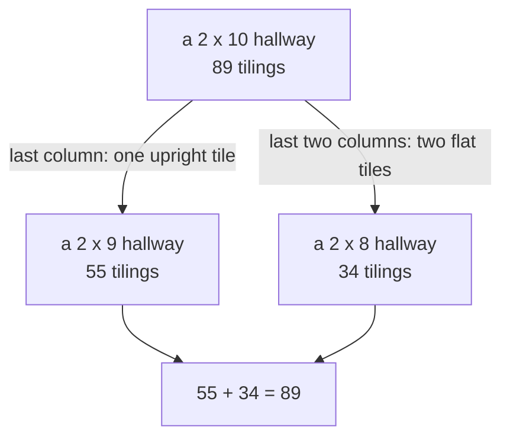

# Recurrences: a rule for the next term from the last few, with Fibonacci as the first example

[Syllabus](../../../SYLLABUS.md) → [Combinatorics and graphs](../README.md) → [Recurrences](../README.md#s05) → Recurrences and Fibonacci

---

## General Overview

A hallway is 2 tiles wide and 10 tiles long. Its floor tiles are 1 × 2: each covers two neighbouring squares, standing upright across the width or lying flat along the length. How many floors, or tilings, can a tiler lay? Listing them all is possible and useless: a list carries no reason.

Ask one question instead: what covers the far end? Two answers, no others. One upright tile fills the last column, leaving a hallway one tile shorter; or two flat tiles cover the last two columns, one per row, leaving a hallway two shorter.

So the count at length 10 is the count at 9 plus the count at 8, and the same holds at every length. A rule of that shape — a term written out of the terms just behind it — is a **recurrence**, the term used from here on. Count the two shortest hallways by hand, 1 floor and 2, and the rule walks forward alone: 1, 2, 3, 5, 8, 13, 21, 34, 55, 89, so a 2 × 10 hallway has 89 floors.

Those counts are the Fibonacci numbers, written down by Leonardo of Pisa in 1202 while counting rabbits. They arrive here out of floor tiles because a step rule follows a problem's shape, not its subject.

**A recurrence is a step rule plus its seeds: say how a term follows from the terms behind it, fix enough terms at the start, and every later term is fixed too.**

**What kind of fact this is:** a definition; the two counts claimed here, for tilings and for Hanoi, are proved in Why it works.

### The picture: what covers the far end



Every floor goes down one branch only, so the counts add.

---

## The formula

Notation first, in words. $T(n)$ names the number in position n of a sequence: the brackets are an address, not a multiplication. Here n is a hallway's length and T(n) counts its floors; an unnamed sequence has terms a(n).

$$T(n) = T(n-1) + T(n-2) \quad \text{for } n \ge 3, \qquad T(1) = 1, \quad T(2) = 2$$

**Read it aloud:** the floors at length n number those one tile shorter plus those two tiles shorter, with two counts by hand to start.

The rule on the left is the **step rule**; the fixed T(1) and T(2) beside it are the **seeds**. Both belong to the definition: "add the two behind it" alone describes endlessly many lists.

The same machinery counts elsewhere. Ten discs of different sizes stand on one peg, largest at the bottom, two empty pegs beside it. Move the stack to the far peg, one disc per move, never a larger disc onto a smaller. Write h(n) for the fewest moves:

$$h(n) = 2\,h(n-1) + 1 \quad \text{for } n \ge 1, \qquad h(0) = 0$$

**Read it aloud:** shift the top n − 1 discs to the spare peg, move the largest once, shift the n − 1 back on top.

| Symbol | Plain meaning | In our example | Push it up and the answer… |
| --- | --- | --- | --- |
| $n$ | the position: a hallway's length, or a disc count | 10 | the count grows fast: 55 at 9 tiles, 89 at 10 |
| $T(n)$ | ways a 2 × n hallway takes 1 × 2 tiles | T(10) = 89 | — |
| $T(1)$, $T(2)$ | the seeds, fixed before the rule starts | 1 and 2 | move a seed, every later term moves |
| $F(n)$ | the nth Fibonacci number, seeds 1 and 1 | F(11) = 89 | — |
| $h(n)$ | fewest moves shifting n discs across | h(10) = 1023 | one disc more than doubles the work |
| $a(n)$ | a term of an unnamed sequence | — | — |

### When it holds

- **The question must split the collection.** Every floor falls under one answer only; a missed case counts short, an overlap counts long.
- **What is left is the same problem, smaller.** Rubbing out the last column must leave an ordinary shorter hallway, not a notched shape.
- **One seed per place the rule reaches back.** Two places back needs two starting terms; the wrong pair slides the whole sequence, 55 instead of 89. The rule starts at n = 3: at n = 2 it would call for T(0), never fixed.

---

## Why it works

### Step 0: one question about the end shrinks the problem

A count too large to list is still pinned down if the collection splits into smaller copies of itself, and one question about the end does the splitting.

### Step 1: the two answers split the floors, with no overlap

Look at the tile covering the top square of the far column: it either stands upright and fills the column, or lies flat and reaches back a column. In that second case only a flat tile can cover the square below, reaching back as well. So the far end is one upright tile or two stacked flat tiles, never both, never neither: the counts add rather than multiply ([The rules of sum and product](../01-Counting%20Principles/01-rules-of-sum-and-product.md)).

### Step 2: each part is a shorter hallway, matched one for one

Rub the upright tile out of a floor that ends in one: a tiled 2 × 9 hallway is left, and adding it back returns the original. The two moves undo each other, so floors ending upright number exactly T(9), 55. Rubbing out the flat pair leaves a tiled 2 × 8 hallway, so those number T(8), 34. Adding: 55 + 34 = 89, and nothing there mentioned 10.

### Step 3: the seeds, and why exactly two

A 2 × 1 hallway takes one upright tile and nothing else: T(1) = 1. A 2 × 2 takes two uprights side by side or two flats stacked: T(2) = 2. Fibonacci's sequence uses the same rule with seeds 1 and 1, putting these counts one place along: T(10) = F(11) = 89.

### Step 4: another rule, a guessed closed form, a proof

The largest disc must move at some point, and at that moment the other n − 1 sit stacked on the one remaining peg: getting them there costs h(n − 1) at best, the largest costs 1, rebuilding costs h(n − 1) again. That is h(n) = 2h(n−1) + 1, with h(0) = 0 because no discs need no moves. Run it forward: 1, 3, 7, 15, 31, every term one short of a power of 2. That suggests the **closed form** h(n) = 2^n − 1, computed straight from the position. Five numbers are a guess; induction settles it, by checking the start and checking that the rule carries the guess onward ([Induction](../../01-Foundations/06-Proof/04-proof-by-induction.md)), so h(10) = 1023.

<details>
<summary>Detailed proof: the closed form h(n) = 2^n − 1, by induction</summary>

**The claim.** For every whole number n ≥ 0, h(0) = 0 with h(n) = 2h(n−1) + 1 gives h(n) = 2^n − 1.

**The first step.** At n = 0 the seed gives 0, and 2^0 − 1 is 1 − 1, also 0.

**The step onward.** Suppose h(n−1) = 2^(n−1) − 1. Then h(n) = 2h(n−1) + 1 = 2 × (2^(n−1) − 1) + 1 = 2^n − 2 + 1 = 2^n − 1. Holding at n − 1 forces it at n, so holding at 0 it holds everywhere after ([Strong induction and the least element](../../01-Foundations/06-Proof/05-strong-induction-and-well-ordering.md)).

</details>

A forward run costs one step per position. Escaping it is the rest of this shelf: read as an equation in an unknown growth factor the rule gives a closed form ([The characteristic equation](04-characteristic-equation-and-binet.md)), as a matrix one power ([A recurrence is a matrix](06-recurrences-as-matrix-powers.md)), as one function a fraction ([Generating functions](../07-Generating%20Functions/01-ordinary-generating-functions.md)).

---

## Worked numbers, by hand

| Step | Arithmetic | Value |
| --- | --- | --- |
| the seeds, by hand | one upright tile; two uprights or two flats | 1, 2 |
| lengths 3, 4, 5 | 2 + 1, 3 + 2, 5 + 3 | 3, 5, 8 |
| lengths 6, 7 | 8 + 5, 13 + 8 | 13, 21 |
| lengths 8, 9 | 21 + 13, 34 + 21 | 34, 55 |
| length 10 | 55 + 34 | **89** |
| Hanoi, 10 discs | 2 × 511 + 1, and the closed form 2^10 − 1 | **1023** |

A tiler chooses between 89 floors; the Hanoi row splits the same way, 511 + 1 + 511 = 1023.

### What breaks if you drop a piece

| Mistake | Comes out at | What went wrong |
| --- | --- | --- |
| Seeds 1 and 1, not 1 and 2 | 55 | Fibonacci's seeds answer a hallway one tile shorter |
| The flat pair counted once per row | 512 | two flat tiles fill both rows together: one arrangement |
| Guessing h(n) = 2^n | 1024 | a closed form failing at the start fails after it |

The code prints all three.

---

## Code, from first principles, and it actually runs

Nothing is imported. The hallway is counted by two roads sharing no arithmetic: the step rule run forward, and a search that fills the first empty square every legal way and counts the finished floors. The discs are counted three ways: the rule, the recipe walked move by move with every move checked legal, and the closed form. The wrong answers above are computed, not asserted.

### Python

```python
# Recurrences and Fibonacci -- the check behind the card.  Nothing is imported.  A hallway
# 2 tiles wide and n tiles long is laid with 1 x 2 tiles; its tilings are counted twice, by
# the step rule and by laying tiles every legal way.  Hanoi is counted three ways.
N, DISCS = 10, 10
def by_rule(n, seeds=(1, 2), w=1):            # road one: the step rule, run forward
    a = list(seeds)
    while len(a) < n: a.append(a[-1] + w * a[-2])
    return a[:n]
def by_listing(n):                            # road two: lay tiles, count the finishes
    cells = [[0] * n for _ in range(2)]
    def fill():                               # fill the first empty square, two ways
        spot = next(((r, c) for c in range(n) for r in range(2) if not cells[r][c]), None)
        if spot is None: return 1
        r, c, total = spot[0], spot[1], 0
        upright = ((0, c), (1, c)) if r == 0 and not cells[1][c] else ()
        flat = ((r, c), (r, c + 1)) if c + 1 < n and not cells[r][c + 1] else ()
        for pair in (upright, flat):
            if not pair: continue
            for y, x in pair: cells[y][x] = 1
            total += fill()
            for y, x in pair: cells[y][x] = 0
        return total
    return fill()
def hanoi_by_rule(k):                         # road one: h(n) = 2 h(n-1) + 1, forward
    h = 0
    for _ in range(k): h = 2 * h + 1
    return h
def hanoi_by_moving(k):                       # road two: shift the discs one at a time
    pegs, count, legal = {"A": list(range(k, 0, -1)), "B": [], "C": []}, 0, True
    def shift(m, src, dst, spare):
        nonlocal count, legal
        if m == 0: return
        shift(m - 1, src, spare, dst)
        d = pegs[src].pop(); legal = legal and (not pegs[dst] or pegs[dst][-1] > d)
        pegs[dst].append(d); count += 1
        shift(m - 1, spare, dst, src)
    shift(k, "A", "C", "B")
    return count, legal and pegs["C"] == list(range(k, 0, -1))
rule, listed = by_rule(N), [by_listing(n) for n in range(1, N + 1)]
fib, (moves, legal) = by_rule(N + 1, (1, 1)), hanoi_by_moving(DISCS)
hanoi, closed_h = [hanoi_by_rule(k) for k in range(1, DISCS + 1)], 2 ** DISCS - 1
print("hallway 2 tiles wide, 1 x 2 tiles; n is its length in tiles, or the number of discs")
for label, xs in (("n", list(range(1, N + 1))), ("tilings by the rule", rule), ("tilings by listing", listed), ("Hanoi moves by rule", hanoi)):
    print(f"{label:<21}:" + "".join(f"{x:5d}" for x in xs))
print(f"the two tiling roads agree: {'yes' if rule == listed else 'no'}")
print(f"a 2 x {N} hallway has {listed[-1]} tilings")
print(f"the last column: {rule[-2]} end in one upright tile, {rule[-3]} end in two flat tiles, {rule[-2]} + {rule[-3]} = {rule[-2] + rule[-3]}")
print(f"Fibonacci from seeds 1, 1: F({N + 1}) = {fib[-1]}, so T(n) = F(n+1)")
print(f"Tower of Hanoi, {DISCS} discs")
print(f"{'moves by the rule h(n) = 2 h(n-1) + 1':<39}: {hanoi[-1]}")
print(f"{'moves by shifting the discs one by one':<39}: {moves}, legal solve: {'yes' if legal else 'no'}")
print(f"{f'moves by the closed form 2^{DISCS} - 1':<39}: {closed_h}")
print(f"mistake 1, seeds 1 and 1 instead of 1 and 2: {fib[N - 1]}, not {listed[-1]}")
print(f"mistake 2, the flat pair counted once per row: {by_rule(N, (1, 2), 2)[-1]}, not {listed[-1]}")
print(f"mistake 3, guessing h(n) = 2^n, first step unchecked: {2 ** DISCS}, not {hanoi[-1]}")
assert rule == listed                                    # two roads, one sequence
assert listed[-1] == 89 and rule[-2] + rule[-3] == listed[-1]
assert fib[-1] == listed[-1] and fib[N - 1] == 55        # Fibonacci, one place along
assert hanoi[-1] == 1023 and moves == hanoi[-1] and closed_h == hanoi[-1] and legal
print("ALL CHECKS PASS")
```

**Ran 2026-09-14 on macOS, Python 3.14.6, standard library only. All checks passed. Output, pasted from the run:**

```
hallway 2 tiles wide, 1 x 2 tiles; n is its length in tiles, or the number of discs
n                    :    1    2    3    4    5    6    7    8    9   10
tilings by the rule  :    1    2    3    5    8   13   21   34   55   89
tilings by listing   :    1    2    3    5    8   13   21   34   55   89
Hanoi moves by rule  :    1    3    7   15   31   63  127  255  511 1023
the two tiling roads agree: yes
a 2 x 10 hallway has 89 tilings
the last column: 55 end in one upright tile, 34 end in two flat tiles, 55 + 34 = 89
Fibonacci from seeds 1, 1: F(11) = 89, so T(n) = F(n+1)
Tower of Hanoi, 10 discs
moves by the rule h(n) = 2 h(n-1) + 1  : 1023
moves by shifting the discs one by one : 1023, legal solve: yes
moves by the closed form 2^10 - 1      : 1023
mistake 1, seeds 1 and 1 instead of 1 and 2: 55, not 89
mistake 2, the flat pair counted once per row: 512, not 89
mistake 3, guessing h(n) = 2^n, first step unchecked: 1024, not 1023
ALL CHECKS PASS
```

### Rust

Same rows, same labels, built with `rustc --edition 2021 -O`.

```rust
// Recurrences and Fibonacci -- the same check as the Python, in Rust.  No crates.  A hallway
// 2 tiles wide and n tiles long is laid with 1 x 2 tiles; its tilings are counted twice, by
// the step rule and by laying tiles every legal way.  Hanoi is counted three ways.
const N: usize = 10;
const DISCS: u32 = 10;

fn by_rule(n: usize, seeds: (i64, i64), w: i64) -> Vec<i64> {   // road one: the rule, forward
    let mut a = vec![seeds.0, seeds.1];
    while a.len() < n { let k = a.len(); a.push(a[k - 1] + w * a[k - 2]) }
    a[..n].to_vec()
}

fn fill(cells: &mut [[u8; N]; 2], n: usize) -> i64 {   // fill the first empty square, two ways
    let mut spot = None;
    'scan: for c in 0..n { for r in 0..2 { if cells[r][c] == 0 { spot = Some((r, c)); break 'scan } } }
    let (r, c) = match spot { None => return 1, Some(p) => p };
    let mut pairs: Vec<[(usize, usize); 2]> = Vec::new();
    if r == 0 && cells[1][c] == 0 { pairs.push([(0, c), (1, c)]) }              // one tile upright
    if c + 1 < n && cells[r][c + 1] == 0 { pairs.push([(r, c), (r, c + 1)]) }   // one tile flat
    let mut total = 0;
    for pair in pairs {
        for &(y, x) in pair.iter() { cells[y][x] = 1 }
        total += fill(cells, n);
        for &(y, x) in pair.iter() { cells[y][x] = 0 }
    }
    total
}

fn by_listing(n: usize) -> i64 { fill(&mut [[0u8; N]; 2], n) }   // road two: lay tiles, count finishes
fn hanoi_by_rule(k: u32) -> i64 { let mut h = 0; for _ in 0..k { h = 2 * h + 1 } h }   // road one, forward

fn shift(m: u32, src: usize, dst: usize, spare: usize, pegs: &mut [Vec<i64>; 3], count: &mut i64, legal: &mut bool) {
    if m == 0 { return }
    shift(m - 1, src, spare, dst, pegs, count, legal);
    let d = pegs[src].pop().unwrap();
    if let Some(&top) = pegs[dst].last() { if top < d { *legal = false } }
    pegs[dst].push(d); *count += 1;
    shift(m - 1, spare, dst, src, pegs, count, legal);
}

fn hanoi_by_moving(k: u32) -> (i64, bool) {            // road two: shift the discs one at a time
    let mut pegs: [Vec<i64>; 3] = [(1..=k as i64).rev().collect(), Vec::new(), Vec::new()];
    let (mut count, mut legal) = (0i64, true);
    shift(k, 0, 2, 1, &mut pegs, &mut count, &mut legal);
    (count, legal && pegs[2] == (1..=k as i64).rev().collect::<Vec<i64>>())
}

fn main() {
    let (rule, fib) = (by_rule(N, (1, 2), 1), by_rule(N + 1, (1, 1), 1));
    let listed: Vec<i64> = (1..=N).map(by_listing).collect();
    let hanoi: Vec<i64> = (1..=DISCS).map(hanoi_by_rule).collect();
    let ((moves, legal), closed_h) = (hanoi_by_moving(DISCS), 2i64.pow(DISCS) - 1);
    let ns: Vec<i64> = (1..=N as i64).collect();
    println!("hallway 2 tiles wide, 1 x 2 tiles; n is its length in tiles, or the number of discs");
    for (label, xs) in [("n", &ns), ("tilings by the rule", &rule), ("tilings by listing", &listed), ("Hanoi moves by rule", &hanoi)] {
        let mut s = format!("{:<21}:", label);
        for x in xs { s += &format!("{:5}", x) }
        println!("{}", s);
    }
    println!("the two tiling roads agree: {}", if rule == listed { "yes" } else { "no" });
    println!("a 2 x {} hallway has {} tilings", N, listed[N - 1]);
    println!("the last column: {} end in one upright tile, {} end in two flat tiles, {} + {} = {}",
             rule[N - 2], rule[N - 3], rule[N - 2], rule[N - 3], rule[N - 2] + rule[N - 3]);
    println!("Fibonacci from seeds 1, 1: F({}) = {}, so T(n) = F(n+1)", N + 1, fib[N]);
    println!("Tower of Hanoi, {} discs", DISCS);
    println!("{:<39}: {}", "moves by the rule h(n) = 2 h(n-1) + 1", hanoi[N - 1]);
    println!("{:<39}: {}, legal solve: {}", "moves by shifting the discs one by one", moves,
             if legal { "yes" } else { "no" });
    println!("{:<39}: {}", format!("moves by the closed form 2^{} - 1", DISCS), closed_h);
    println!("mistake 1, seeds 1 and 1 instead of 1 and 2: {}, not {}", fib[N - 1], listed[N - 1]);
    println!("mistake 2, the flat pair counted once per row: {}, not {}", by_rule(N, (1, 2), 2)[N - 1], listed[N - 1]);
    println!("mistake 3, guessing h(n) = 2^n, first step unchecked: {}, not {}", 2i64.pow(DISCS), hanoi[N - 1]);
    assert!(rule == listed);                                  // two roads, one sequence
    assert!(listed[N - 1] == 89 && rule[N - 2] + rule[N - 3] == listed[N - 1]);
    assert!(fib[N] == listed[N - 1] && fib[N - 1] == 55);      // Fibonacci, one place along
    assert!(hanoi[N - 1] == 1023 && moves == hanoi[N - 1] && closed_h == hanoi[N - 1] && legal);
    println!("ALL CHECKS PASS");
}
```

**Ran 2026-09-14 on macOS, rustc 1.98.1, no crates. All checks passed. Output, pasted from the run:**

```
hallway 2 tiles wide, 1 x 2 tiles; n is its length in tiles, or the number of discs
n                    :    1    2    3    4    5    6    7    8    9   10
tilings by the rule  :    1    2    3    5    8   13   21   34   55   89
tilings by listing   :    1    2    3    5    8   13   21   34   55   89
Hanoi moves by rule  :    1    3    7   15   31   63  127  255  511 1023
the two tiling roads agree: yes
a 2 x 10 hallway has 89 tilings
the last column: 55 end in one upright tile, 34 end in two flat tiles, 55 + 34 = 89
Fibonacci from seeds 1, 1: F(11) = 89, so T(n) = F(n+1)
Tower of Hanoi, 10 discs
moves by the rule h(n) = 2 h(n-1) + 1  : 1023
moves by shifting the discs one by one : 1023, legal solve: yes
moves by the closed form 2^10 - 1      : 1023
mistake 1, seeds 1 and 1 instead of 1 and 2: 55, not 89
mistake 2, the flat pair counted once per row: 512, not 89
mistake 3, guessing h(n) = 2^n, first step unchecked: 1024, not 1023
ALL CHECKS PASS
```

The two outputs match line for line.

> [!TIP]
> **Try changing**
> Guess first, then run it. Each change below stops the program at an assert.
> - **Move a seed.** Set `seeds` in `by_rule` to `(1, 1)`: the rule ends at 55, the search still finds 89.
> - **Forbid the flat tiles.** Replace the `flat` line in `by_listing` with `flat = ()`: one floor at every length.
> - **Drop the single move.** Change `h = 2 * h + 1` to `h = 2 * h`: the rule stops matching the discs actually shifted.

---

## The usual mistake

> [!warning]
> **Treating the step rule as the whole definition.** "Each term is the sum of the two behind it" names endlessly many sequences. The tiling counts and the Fibonacci numbers obey that rule and are not the same list: seeds 1 and 2 reach 89 at position 10, seeds 1 and 1 reach 55 there.
>
> - **Cases that overlap.** Counting the flat pair once for the top row and again for the bottom turns every step into a doubling and ends at 512.
> - **Trusting a pattern as a proof.** Terms running 1, 3, 7, 15, 31 make a closed form look certain; the guess h(n) = 2^n fits none and claims 1024.
> - **Working each term out from scratch.** Recomputing T(n−1) and T(n−2) from the beginning repeats the same work over and over; keeping the last two answers gets there in n steps (Dynamic programming).

---

## Where you meet it in real life

- **Loan balances.** Next month's balance is this month's, grown by the rate and cut by the payment: a rule reaching back one place ([First-order recurrences](03-first-order-recurrences-and-loans.md)).
- **Arrangements with a ban.** Strings of 0s and 1s with no two 1s in a row obey the same rule, found by the same question: what sits at the end?
- **Running times.** Code halving its input and calling itself gives a recurrence for the work done ([Divide-and-conquer recurrences](07-divide-and-conquer-recurrences.md), Recurrences).

> **Say it back**
> A recurrence writes each term out of the terms just behind it, and it is a definition only once the first terms are fixed by hand. Asking what covers the far end of a 2 × 10 hallway splits its floors in two, so the count at length 10 is the count at 9 plus the count at 8. Seeded with 1 and 2 the rule reaches 89: the Fibonacci numbers, one place along. Hanoi obeys h(n) = 2h(n−1) + 1, whose closed form 2^n − 1 is guessed and proved by induction: 1023 moves for ten discs.

---

## What this builds on

- [The rules of sum and product](../01-Counting%20Principles/01-rules-of-sum-and-product.md): why two cases that never overlap are added.
- [Induction](../../01-Foundations/06-Proof/04-proof-by-induction.md): what turns a closed-form guess into a fact.
- [Strong induction and the least element](../../01-Foundations/06-Proof/05-strong-induction-and-well-ordering.md): why stepping forward reaches every position.

## Where this goes next

- [Finite differences](02-finite-differences-and-telescoping-sums.md): rules that collapse when terms are subtracted in pairs.
- [First-order recurrences](03-first-order-recurrences-and-loans.md): rules reaching back one place.
- [The characteristic equation](04-characteristic-equation-and-binet.md): this rule's closed form, from an equation's roots.
- [Divide-and-conquer recurrences](07-divide-and-conquer-recurrences.md): rules reaching back by halving, not stepping.
- [Generating functions](../07-Generating%20Functions/01-ordinary-generating-functions.md): a whole sequence carried by one function.
- [The chromatic polynomial](../12-Planarity%20and%20Colouring/04-chromatic-polynomial.md): a recurrence on networks, from deleting a link.
- Recurrences: a running time read off a recurrence unsolved.
- Dynamic programming: storing what a recurrence computed instead of recomputing it.

Stepping forward costs one step per position, hopeless far out; the next cards reach the answer in one jump.

---

## Sources

Verified 14 Sep 2026: every link below resolves to the publisher's page.

- Graham, Ronald L., Donald E. Knuth, and Oren Patashnik. *Concrete Mathematics*, 2nd ed. Addison-Wesley, 1994. [Publisher page](https://www.informit.com/store/concrete-mathematics-a-foundation-for-computer-science-9780201558029). Opens on the Tower of Hanoi and the step to a closed form.
- Benjamin, Arthur T., and Jennifer J. Quinn. *Proofs that Really Count*. Mathematical Association of America, 2003. [Publisher page](https://www.cambridge.org/core/books/proofs-that-really-count/ECB4C706EE09779201F1499B2F312AC6). Counts tilings and reads the Fibonacci rule off them.
- Sigler, Laurence E., trans. *Fibonacci's Liber Abaci*. Springer, 2002. [Publisher page](https://link.springer.com/book/10.1007/978-1-4613-0079-3). The 1202 rabbits.
