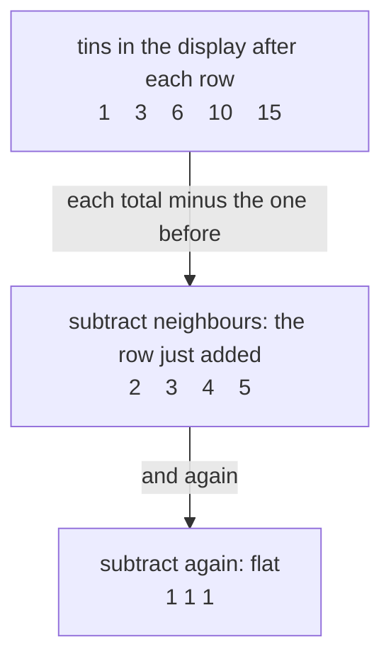

# Finite differences: the jump from one term to the next, and sums that collapse because consecutive terms cancel

Combinatorics and graphs → Recurrences → Differencing and telescoping → Finite differences

---

## General Overview

A supermarket builds a display of tins: one on the top row, two below it, three below that, on down. The running totals after each row are 1, 3, 6, 10, 15.

Subtract each total from the next: 2, 3, 4, 5, the row just added. Subtract again, and every answer is 1. That flat second row fixes the rule as degree 2, its largest power a square: for n rows the total is n(n+1)/2. Ten rows hold 55 tins.

The subtraction also runs backwards. Suppose each number in a list to be added is itself a jump between two terms of a second list. Adding them writes every middle term twice, once to add and once to take away, so the middles cancel and two numbers survive. The ninety-nine fractions 1/(k(k+1)), with the counter k running from 1 to 99, collapse to one subtraction: exactly 0.99.

**The difference is the jump from one term to the next, and a sum of jumps collapses to the far end minus the near end: any sum written as differences is done in one subtraction.**

**What kind of fact this is:** a method, resting on the difference (a definition) and one identity, proved on this card in Why it works.

### The picture: the difference triangle



Each arrow is one pass of subtraction: down the triangle to find a rule, back up it to add a list.

---

## The formula

A list is written a(1), a(2), a(3), … and a(n) is its n-th term, the way a recurrence names the terms it steps through ([recurrences-and-fibonacci](01-recurrences-and-fibonacci.md)). The Greek capital D, written Δ and read "delta", marks the subtraction that turns one list into a new one: its name is the **difference**.

$$\Delta a(n) = a(n+1) - a(n)$$

**Read it aloud:** the difference at step n is the next term minus this one, the jump.

$$\Delta a(1) + \Delta a(2) + \cdots + \Delta a(n) = a(n+1) - a(1)$$

**Read it aloud:** add every jump from the first to the n-th, and what survives is the term one past the end, minus the first.

| Symbol | Plain meaning | In our example | Push it up and the answer… |
| --- | --- | --- | --- |
| $a(n)$ | the n-th term of a list | a(5) = 15 tins | the display holds more tins |
| $\Delta a(n)$ | the jump from term n to term n+1 | 10 to 15 is a jump of 5 | the list climbs faster |
| $\Delta^2 a(n)$ | the jump of the jumps, Δ applied twice | 1 at every step | the climb steepens |
| $n$ | which term, and how many rows | 10 rows | 55 tins, by n(n+1)/2 |
| $k$ | the counter in a sum, stepping to its last term | k runs 1 to 99 | more fractions to add |
| $C(n, k)$ | "n choose k": ways to pick k from n | C(4, 2) = 6 | each layer counts in more often |
| $F(n)$ | the n-th Fibonacci number | F(11) = 89 | a longer hallway, more tilings |

One helper formula runs the other way: the triangle's top-left edge — first term, first jump, first jump of jumps — rebuilds the list.

$$a(n) = a(1) + \Delta a(1)\,C(n-1, 1) + \Delta^2 a(1)\,C(n-1, 2) + \cdots$$

Each layer counts in as often as there are ways to choose that many steps from the n − 1 taken: Isaac Newton's forward-difference formula. For the tins' edge 1, 2, 1 it reads a(n) = 1 + 2·C(n−1, 1) + C(n−1, 2).

### When it holds

- **No gaps, and exact differences.** Every term from the start to one past the end must exist, and each term added must be exactly a jump: a split wrong by a fixed amount leaves that amount behind once per term.
- **Finite sums only.** The collapse is exact at any length: ninety-nine terms give 99/100. Whether an endless sum settles anywhere is a limit question, for a later wing.
- **A flat row names the rule only if the list keeps to it.** Five numbers alone fit many rules; here row n holds n tins by construction, so the flat row holds past the fifth.

---

## Why it works

### Step 0: a sum of jumps is the whole trip

Adding every jump along a list is the same as travelling from its first term to its last. Each term in between is arrived at and left again, so it cannot change the total.

### Step 1: write the sum out and watch the middle cancel

Put the definition in, term by term:

$$(a(2) - a(1)) + (a(3) - a(2)) + (a(4) - a(3)) + \cdots + (a(n+1) - a(n))$$

Every term from a(2) to a(n) appears twice, once added and once taken away, so those pairs vanish. Only −a(1) and +a(n+1) survive: the identity above.

A pocket telescope closes into two rings with nothing between: such a sum is said to **telescope**, the term used from here on. For the tins, the jumps 2 + 3 + … + 10 add to 54, and 55 − 1 is 54.

### Step 2: to add a list, find the list it is the jumps of

The identity earns its keep backwards: given numbers to add, find the list whose jumps they are. For 1 + 2 + … + n that means Δa(n) = n, and since differencing drops a rule's degree by one, the list is degree 2. Try a(n) = n(n−1)/2:

$$\Delta a(n) = \frac{(n+1)n}{2} - \frac{n(n-1)}{2} = \frac{n\,[(n+1) - (n-1)]}{2} = n$$

That is the list, and a(1) = 0, so the sum is a(n+1) − a(1) = n(n+1)/2:

$$1 + 2 + 3 + \cdots + n = \frac{n(n+1)}{2}$$

At n = 10 that is 55, the total the slow way reaches row by row.

### Step 3: split a fraction until it is a difference

Now 1/(k(k+1)) for k from 1 to 99. Splitting the fraction into simpler pieces ([fractions](../../01-Foundations/01-Everyday%20Arithmetic/07-fractions.md)) turns each term into a jump:

$$\frac{1}{k} - \frac{1}{k+1} = \frac{(k+1) - k}{k(k+1)} = \frac{1}{k(k+1)}$$

The sum then reads (1/1 − 1/2) + (1/2 − 1/3) + … + (1/99 − 1/100), and every middle fraction meets its negative. What survives is 1/1 − 1/100: 99/100, or 0.99. At any length it gives 1 − 1/(n+1).

### Step 4: reading the rule off the flat row

Travel down the triangle instead. Differencing a degree-2 rule leaves a degree-1 rule, then a constant, then zeros. Newton's formula runs that back from the top edge: for the tins it gives (n^2 + n)/2, the n(n+1)/2 of Step 2 from the other side.

<details>
<summary>Detailed proof: why a flat k-th row means a degree-k rule</summary>

Let B(j, n) be the list whose n-th term is C(n−1, j). Pascal's rule, C(n, j) = C(n−1, j) + C(n−1, j−1), gives its difference:
$$\Delta B(j, n) = C(n, j) - C(n-1, j) = C(n-1, j-1) = B(j-1, n).$$
Differencing shifts each list one place down the family, and B(0, n), 1 everywhere, differences to zero. So for numbers c(0) … c(k) and a(n) = c(0)·B(0, n) + … + c(k)·B(k, n), differencing j times drops every piece j places, and at n = 1 only one survives: Δ^j a(1) = c(j), read straight off the edge — Newton's formula.

A flat k-th row makes the next row zero, so the edge stops at c(k). Since C(n−1, j) has degree j, the list has degree k, leading coefficient c(k) over 1 × 2 × … × k: for the tins, k = 2 and c(2) = 1 give the 1/2 in n(n+1)/2.

</details>

<details>
<summary>When the terms are a product of two lists</summary>

Δ(a(n)·b(n)) = a(n+1)·Δb(n) + b(n)·Δa(n): summing both sides and collapsing the left turns a sum of a·Δb into two ends minus a sum of b·Δa — summation by parts, taught with the analysis wing.

</details>

Induction reaches n(n+1)/2 too, but only once the answer is guessed; telescoping produces it. Multiplying a step rule by a chosen factor until it telescopes solves a loan in [first-order-recurrences-and-loans](03-first-order-recurrences-and-loans.md).

---

## Worked numbers, by hand

| Step | Arithmetic | Value |
| --- | --- | --- |
| the display, row by row | 1, 1+2, 3+3, 6+4, 10+5 | 1, 3, 6, 10, 15 |
| first differences | 3−1, 6−3, 10−6, 15−10 | 2, 3, 4, 5 |
| second differences | 3−2, 4−3, 5−4 | 1, 1, 1 |
| the rule from the edge 1, 2, 1 | 1 + 2·C(4, 1) + C(4, 2) = 1 + 8 + 6 | **15** at five rows |
| ten rows, added then collapsed | 1 + 2 + … + 10, then 10 × 11 / 2 | **55** |
| the fractions to k = 99 | 1/1 − 1/100 | **0.99** |
| the shelf's hallway | F(1) + … + F(9), against 89 − 1 | **88** |

Fifty-five tins fill a ten-row display; the fractions land a hundredth short of 1. The last row checks the shelf's house example: a 2 × 10 hallway takes 1 × 2 tiles in F(11) = 89 ways ([recurrences-and-fibonacci](01-recurrences-and-fibonacci.md)), and each Fibonacci number is the difference of the next two, so the first nine telescope to 88.

### What breaks if you drop a piece

| Mistake | Comes out at | What went wrong |
| --- | --- | --- |
| The flat 1 read as the rule n^2 | 25 at five rows, not 15 | the constant is twice the leading coefficient |
| The collapse stopped at a(n) | 45 for ten rows, not 55 | the last jump ends one term further on |
| The split written with a plus | 9.36, not 0.99 | nothing cancels; every middle term survives |

The code prints all three.

---

## Code, from first principles, and it actually runs

Nothing is imported. The tins are counted three ways sharing no arithmetic: row by row, from n(n+1)/2, and rebuilt from the triangle's edge. The fractions are added exactly, then collapsed. Fibonacci is the second case.

### Python

```python
# Finite differences and telescoping sums -- the check behind the card.  Nothing
# is imported.  A supermarket stacks tins in rows of 1, 2, 3, ...: the running
# totals are 1, 3, 6, 10, 15.  Every count is reached twice, once by adding term
# by term and once by a closed form or a telescope collapsed to its two ends.
ROWS, TERMS = 10, 99
def diffs(seq):                            # one pass of jumps: a(n+1) - a(n)
    return [seq[i + 1] - seq[i] for i in range(len(seq) - 1)]
def choose(n, k):                          # n choose k, multiplied out
    out = 1
    for i in range(k):
        out = out * (n - i) // (i + 1)
    return out
def gcd(a, b):
    while b: a, b = b, a % b
    return a
def add_fraction(n1, d1, n2, d2):          # exact addition, reduced every step
    n, d = n1 * d2 + n2 * d1, d1 * d2
    g = gcd(n, d)
    return n // g, d // g
def row(name, values):
    print(f"{name:<46}" + " ".join(str(v) for v in values))

totals, running = [], 0                    # road one: add the rows one at a time
for n in range(1, ROWS + 1):
    running += n
    totals.append(running)
first, second = diffs(totals), diffs(diffs(totals))
closed = [n * (n + 1) // 2 for n in range(1, ROWS + 1)]                    # road two
newton = [1 + 2 * choose(n - 1, 1) + choose(n - 1, 2) for n in range(1, ROWS + 1)]
exact, wrong = (0, 1), 0.0                 # road one to the fraction sum: add it up
for k in range(1, TERMS + 1):
    exact = add_fraction(exact[0], exact[1], 1, k * (k + 1))
    wrong += 1 / k + 1 / (k + 1)           # the same split, written with a plus
tele = (TERMS, TERMS + 1)                  # road two: 1 - 1/100, collapsed to two ends
fib = [1, 1]
while len(fib) < 11: fib.append(fib[-1] + fib[-2])
added = sum(fib[:9])
row("tins in rows 1 to 10", range(1, ROWS + 1))
row("running totals, added row by row", totals)
row("first differences", first)
row("second differences", second)
row("the same totals from n(n+1)/2", closed)
row("the same totals from Newton's formula", newton)
print(f"Newton at n = 5: 1 + 2*C(4,1) + C(4,2) = 1 + {2 * choose(4, 1)} + {choose(4, 2)} = {newton[4]}")
print(f"ten rows: {totals[-1]} tins by adding, {closed[-1]} from n(n+1)/2")
print(f"the jumps add to the trip: 2+3+...+{ROWS} = {sum(first)} = {totals[-1]} - {totals[0]}")
row("the first three terms as differences", [f"1/{k}-1/{k + 1}" for k in (1, 2, 3)])
print(f"1/(k(k+1)) added exactly to k = {TERMS}: {exact[0]}/{exact[1]} = {exact[0] / exact[1]:.2f}")
print(f"the same sum, telescoped: 1 - 1/{TERMS + 1} = {tele[0]}/{tele[1]} = {tele[0] / tele[1]:.2f}")
row("Fibonacci F(1) to F(11), the hallway count", fib)
print(f"F(1)+...+F(9) added: {added}; telescoped F(11) - F(2) = {fib[10]} - {fib[1]} = {fib[10] - fib[1]}")
print(f"mistake 1, second difference 1 read as the rule n^2: 5 rows -> {5 ** 2}, not {closed[4]}")
print(f"mistake 2, the collapse stopped at a(n): {ROWS * (ROWS - 1) // 2}, not {totals[-1]}")
print(f"mistake 3, the split written with a plus: {wrong:.2f}, not {exact[0] / exact[1]:.2f}")
assert first == list(range(2, ROWS + 1)) and second == [1] * (ROWS - 2)
assert totals == closed and closed == newton
assert sum(first) == totals[-1] - totals[0] and exact == tele
assert added == fib[10] - fib[1] and fib[10] == 89
print("ALL CHECKS PASS")
```

**Ran 2026-09-14 on macOS, Python 3.14.6, standard library only. All checks passed. Output, pasted from the run:**

```
tins in rows 1 to 10                          1 2 3 4 5 6 7 8 9 10
running totals, added row by row              1 3 6 10 15 21 28 36 45 55
first differences                             2 3 4 5 6 7 8 9 10
second differences                            1 1 1 1 1 1 1 1
the same totals from n(n+1)/2                 1 3 6 10 15 21 28 36 45 55
the same totals from Newton's formula         1 3 6 10 15 21 28 36 45 55
Newton at n = 5: 1 + 2*C(4,1) + C(4,2) = 1 + 8 + 6 = 15
ten rows: 55 tins by adding, 55 from n(n+1)/2
the jumps add to the trip: 2+3+...+10 = 54 = 55 - 1
the first three terms as differences          1/1-1/2 1/2-1/3 1/3-1/4
1/(k(k+1)) added exactly to k = 99: 99/100 = 0.99
the same sum, telescoped: 1 - 1/100 = 99/100 = 0.99
Fibonacci F(1) to F(11), the hallway count    1 1 2 3 5 8 13 21 34 55 89
F(1)+...+F(9) added: 88; telescoped F(11) - F(2) = 89 - 1 = 88
mistake 1, second difference 1 read as the rule n^2: 5 rows -> 25, not 15
mistake 2, the collapse stopped at a(n): 45, not 55
mistake 3, the split written with a plus: 9.36, not 0.99
ALL CHECKS PASS
```

### Rust

Same numbers, same labels, built with `rustc --edition 2021 -O`.

```rust
// Finite differences and telescoping sums -- the same check as the Python, in
// Rust.  No crates.  A supermarket stacks tins in rows of 1, 2, 3, ...: the
// running totals are 1, 3, 6, 10, 15.  Every count is reached twice, once by
// adding term by term and once by a closed form or a telescope collapsed to
// its two ends.
const ROWS: i64 = 10;
const TERMS: i64 = 99;

fn diffs(seq: &[i64]) -> Vec<i64> {                 // one pass of jumps: a(n+1) - a(n)
    (1..seq.len()).map(|i| seq[i] - seq[i - 1]).collect()
}

fn choose(n: i64, k: i64) -> i64 {                  // n choose k, multiplied out
    let mut out = 1;
    for i in 0..k { out = out * (n - i) / (i + 1) }
    out
}

fn gcd(mut a: i64, mut b: i64) -> i64 {
    while b != 0 { (a, b) = (b, a % b) }
    a
}

fn add_fraction(n1: i64, d1: i64, n2: i64, d2: i64) -> (i64, i64) {   // exact, reduced
    let (n, d) = (n1 * d2 + n2 * d1, d1 * d2);
    let g = gcd(n, d);
    (n / g, d / g)
}

fn row(name: &str, values: &[String]) { println!("{:<46}{}", name, values.join(" ")) }

fn strs(values: &[i64]) -> Vec<String> { values.iter().map(|v| v.to_string()).collect() }

fn main() {
    let (mut totals, mut running) = (Vec::new(), 0);  // road one: add the rows one at a time
    for n in 1..=ROWS { running += n; totals.push(running) }
    let (first, second) = (diffs(&totals), diffs(&diffs(&totals)));
    let closed: Vec<i64> = (1..=ROWS).map(|n| n * (n + 1) / 2).collect();          // road two
    let newton: Vec<i64> = (1..=ROWS).map(|n| 1 + 2 * choose(n - 1, 1) + choose(n - 1, 2)).collect();
    let (mut exact, mut wrong) = ((0i64, 1i64), 0.0f64);   // road one to the fraction sum
    for k in 1..=TERMS {
        exact = add_fraction(exact.0, exact.1, 1, k * (k + 1));
        wrong += 1.0 / k as f64 + 1.0 / (k + 1) as f64;    // the same split, with a plus
    }
    let tele = (TERMS, TERMS + 1);                 // road two: 1 - 1/100, collapsed to two ends
    let mut fib = vec![1i64, 1];
    while fib.len() < 11 { fib.push(fib[fib.len() - 1] + fib[fib.len() - 2]) }
    let added: i64 = fib[..9].iter().sum();
    let jumps: i64 = first.iter().sum();
    row("tins in rows 1 to 10", &strs(&(1..=ROWS).collect::<Vec<i64>>()));
    row("running totals, added row by row", &strs(&totals));
    row("first differences", &strs(&first));
    row("second differences", &strs(&second));
    row("the same totals from n(n+1)/2", &strs(&closed));
    row("the same totals from Newton's formula", &strs(&newton));
    println!("Newton at n = 5: 1 + 2*C(4,1) + C(4,2) = 1 + {} + {} = {}", 2 * choose(4, 1), choose(4, 2), newton[4]);
    println!("ten rows: {} tins by adding, {} from n(n+1)/2", totals[9], closed[9]);
    println!("the jumps add to the trip: 2+3+...+{} = {} = {} - {}", ROWS, jumps, totals[9], totals[0]);
    row("the first three terms as differences",
        &(1..4).map(|k| format!("1/{}-1/{}", k, k + 1)).collect::<Vec<String>>());
    println!("1/(k(k+1)) added exactly to k = {}: {}/{} = {:.2}",
             TERMS, exact.0, exact.1, exact.0 as f64 / exact.1 as f64);
    println!("the same sum, telescoped: 1 - 1/{} = {}/{} = {:.2}",
             TERMS + 1, tele.0, tele.1, tele.0 as f64 / tele.1 as f64);
    row("Fibonacci F(1) to F(11), the hallway count", &strs(&fib));
    println!("F(1)+...+F(9) added: {}; telescoped F(11) - F(2) = {} - {} = {}",
             added, fib[10], fib[1], fib[10] - fib[1]);
    println!("mistake 1, second difference 1 read as the rule n^2: 5 rows -> {}, not {}", 5 * 5, closed[4]);
    println!("mistake 2, the collapse stopped at a(n): {}, not {}", ROWS * (ROWS - 1) / 2, totals[9]);
    println!("mistake 3, the split written with a plus: {:.2}, not {:.2}",
             wrong, exact.0 as f64 / exact.1 as f64);
    assert!(first == (2..=ROWS).collect::<Vec<i64>>() && second == vec![1; (ROWS - 2) as usize]);
    assert!(totals == closed && closed == newton);
    assert!(jumps == totals[9] - totals[0] && exact == tele);
    assert!(added == fib[10] - fib[1] && fib[10] == 89);
    println!("ALL CHECKS PASS");
}
```

**Ran 2026-09-14 on macOS, rustc 1.98.1, no crates. All checks passed. Output, pasted from the run:**

```
tins in rows 1 to 10                          1 2 3 4 5 6 7 8 9 10
running totals, added row by row              1 3 6 10 15 21 28 36 45 55
first differences                             2 3 4 5 6 7 8 9 10
second differences                            1 1 1 1 1 1 1 1
the same totals from n(n+1)/2                 1 3 6 10 15 21 28 36 45 55
the same totals from Newton's formula         1 3 6 10 15 21 28 36 45 55
Newton at n = 5: 1 + 2*C(4,1) + C(4,2) = 1 + 8 + 6 = 15
ten rows: 55 tins by adding, 55 from n(n+1)/2
the jumps add to the trip: 2+3+...+10 = 54 = 55 - 1
the first three terms as differences          1/1-1/2 1/2-1/3 1/3-1/4
1/(k(k+1)) added exactly to k = 99: 99/100 = 0.99
the same sum, telescoped: 1 - 1/100 = 99/100 = 0.99
Fibonacci F(1) to F(11), the hallway count    1 1 2 3 5 8 13 21 34 55 89
F(1)+...+F(9) added: 88; telescoped F(11) - F(2) = 89 - 1 = 88
mistake 1, second difference 1 read as the rule n^2: 5 rows -> 25, not 15
mistake 2, the collapse stopped at a(n): 45, not 55
mistake 3, the split written with a plus: 9.36, not 0.99
ALL CHECKS PASS
```

The two outputs match line for line.

> [!TIP]
> **Try changing**
> Guess first, then run it. The asserts are pinned to the tins, so the last two below stop the program.
> - **Twenty rows.** Set `ROWS` to `20`: the totals reach 210, the second differences stay flat, every road agrees.
> - **Rows of 1, 3, 5, 7.** Replace `running += n` with `running += 2 * n - 1`: the totals become the squares 1, 4, 9, 16, the second differences flatten at 2, and the first assert stops it.
> - **Break the split.** Change `k * (k + 1)` in `add_fraction` to `k * (k + 2)`: the exact sum drifts off 99/100 and the third assert stops it.

---

## The usual mistake

> [!warning]
> **Treating a flat row in the triangle as proof of the rule.** Five totals fit endless rules that agree on those five and part company at the sixth. The flat row is safe here for a reason outside the table: row n holds n tins by construction.
>
> - **Stopping the collapse one term early.** a(n) − a(1) in place of a(n+1) − a(1): 45, not 55.
> - **Reading the constant as the leading coefficient.** A flat second difference of 1 does not make the rule n^2: 25 at five rows, not 15.
> - **Splitting with a plus.** 1/(k(k+1)) is not 1/k + 1/(k+1); nothing cancels: 9.36, not 0.99.

---

## Where you meet it in real life

- **Stock-taking and accounts.** Opening balance plus every movement equals closing balance: a telescoping sum, checked at its two ends. Differencing runs it back, turning levels into changes.
- **Babbage's Difference Engine.** The machine designed in the 1820s to print mathematical tables could only add. A polynomial rule has a flat row, so setting the edge once and adding along each row grinds out every term.

> **Say it back**
> The difference of a list is the jump from each term to the next; doing it twice gives the jumps of the jumps. A flat second row means a degree-2 rule, which the triangle's top edge rebuilds. Backwards, a sum of jumps collapses to the far end minus the near end. The tins add to 55 by n(n+1)/2; the fractions to 0.99, because each is 1/k − 1/(k+1).

---

## What this builds on

- [recurrences-and-fibonacci](01-recurrences-and-fibonacci.md): the a(n) naming, and the Fibonacci numbers used here.
- [polynomials](../../03-Algebra/02-Polynomials/01-polynomials.md): degree and leading coefficient, what a flat row pins down.
- [fractions](../../01-Foundations/01-Everyday%20Arithmetic/07-fractions.md): splitting 1/(k(k+1)) into 1/k − 1/(k+1).

## Where this goes next

- [divide-and-conquer-recurrences](07-divide-and-conquer-recurrences.md): the same collapse, run down the levels of a rule that halves its input.

Telescoping needs terms that are jumps of a list one can name, easy enough when a rule steps one place at a time; what to do when it halves the problem starts a later card.

---

## Sources

Verified 14 Sep 2026: every link below resolves to the publisher's page.

- Graham, Ronald L., Donald E. Knuth, and Oren Patashnik. *Concrete Mathematics*, 2nd ed. Addison-Wesley, 1994. [Publisher page](https://www.informit.com/store/concrete-mathematics-a-foundation-for-computer-science-9780201558029). Chapter 2 makes this a calculus of sums.
- Boole, George. *A Treatise on the Calculus of Finite Differences*. Macmillan, 1860. [Full text, Internet Archive](https://archive.org/details/treatiseoncalcul00booluoft). The treatment that fixed the notation.
- "The Babbage Engine." Computer History Museum. [Exhibition page](https://www.computerhistory.org/babbage/engines/). What a machine that can only add does with a flat row.
