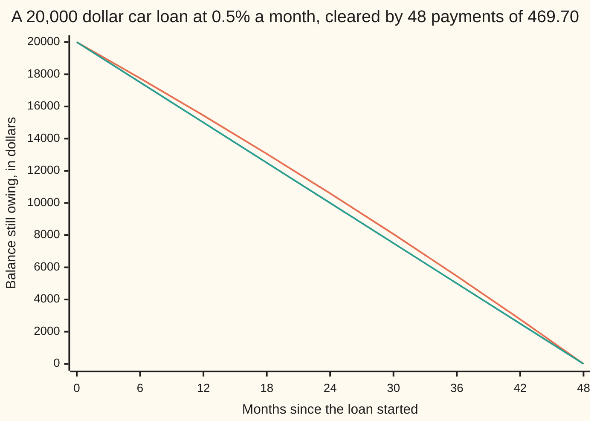

# First-order recurrences: multiply by a factor and add a constant, the fixed point is the anchor, and a loan is the model

[Syllabus](../../../SYLLABUS.md) → [Combinatorics and graphs](../README.md) → [Recurrences](../README.md#s05) → First-order recurrences

---

## General Overview

A bank lends $20,000 for a car at half a percent interest a month, over 48 months. Each month the debt grows by half a percent, then a payment comes off it.

Half a percent of $20,000.00 is $100.00, so a payment of $469.70 leaves $19,630.30. Month two charges $98.15 on the smaller balance, and the payment takes $371.55 off the debt.

Which payment clears the debt in exactly 48 months, and what is owed part-way? One observation answers both. There is a balance this rule would never move: the one whose monthly interest is exactly the payment, $93,940.12 here. Measure real balances from that stuck value and the payment drops out of the arithmetic: what is left multiplies by 1.005 a month.

**Subtract the one value a step leaves unchanged and the rule stops adding: what remains multiplies by the same factor once per step, so the answer is a power — and a loan's payment falls out of it.**

**What kind of fact this is:** a method; the closed form and payment formula it yields are derived on this card in Why it works.

### The picture: 48 months of a car loan



The bowed line is the balance; the straight line shares the debt evenly, $416.67 a month. Early payments put less against the debt, so the balance stays above.

---

## The formula

A recurrence builds each value from the ones before it, and $a(n)$ names the value at step n ([Recurrences](01-recurrences-and-fibonacci.md)). **First-order** means a step looks back exactly one step. The rule holds two fixed numbers: a factor, and an amount added after it.

$$a(n) = r\,a(n-1) + c$$

**Read it aloud:** each step multiplies the value before it by a fixed factor, then adds a fixed amount.

One value is special: the one a step hands back unchanged. Call it the **fixed point**, written $a^*$ and said "a-star". Demand that the rule return what it was given, gather terms on one side ([Rearranging a formula](../../03-Algebra/01-Letters%20and%20Equations/03-rearranging-formulas.md)), and the solution follows:

$$a^* = \frac{c}{1-r}, \qquad a(n) = r^n\left(a(0) - a^*\right) + a^*$$

**Read it aloud:** the fixed point never moves; the gap to it multiplies by the factor once per step.

A loan is that rule with the factor 1.005 and minus the payment added, starting from $B_0$ borrowed. Setting the balance to zero at month n and freeing the payment gives the first month's interest, multiplied by $r^n$ and divided by $r^n - 1$:

$$P = B_0\,\frac{(r-1)\,r^n}{r^n - 1}$$

| Symbol | Plain meaning | In our example | Push it up and the answer… |
| --- | --- | --- | --- |
| $a(n)$ | the value after n steps | the balance owing after n months | — |
| $r$ | the factor multiplying the last value | 1.005 | the payment rises |
| $c$ | the amount added each step | minus $469.70, the payment | less comes off, so the debt clears later |
| $n$ | steps taken | months elapsed, 0 to 48 | smaller payments, more interest |
| $a^*$ | the fixed point, left alone by a step | $93,940.12 | — |
| $B_0$ | the sum borrowed | $20,000.00 | the payment scales with it |
| $P$ | the level payment | $469.70 | fewer months needed |

### When it holds

- **The factor is not 1.** The fixed point divides by $1-r$, so a factor of 1 has none: that rule just adds, and draws a straight line — the territory of [Finite differences](02-finite-differences-and-telescoping-sums.md).
- **The factor and the amount hold still.** A rate that moves breaks the closed form; each change restarts from that day's balance.
- **One step is one interest period, and nothing is rounded part-way.** Half a percent a month is not six percent a year charged once. The formula's payment is $469.7006, billed as $469.70, the cents settled at the end.

---

## Why it works

### Step 0: find the value a step leaves alone

A step multiplies by $r$ and adds $c$. Which value comes back unchanged? It equals $r$ times itself plus $c$, so it is $c$ divided by $1-r$.

Here $c$ is minus $469.70 and $r$ is 1.005, giving $93,940.12: a debt growing by exactly $469.70 a month, which the payment cancels. It would sit there forever.

### Step 1: measure from the fixed point and the constant disappears

The fixed point obeys the rule too — that is what fixed means — so subtracting its line cancels $c$:

$$\left(r\,a(n-1) + c\right) - \left(r\,a^* + c\right) = r\left(a(n-1) - a^*\right)$$

The gap at step n is the factor times the gap at step n−1. Nothing is added.

### Step 2: a pure multiply is a power

Multiplying by $r$ n times is $r^n$ ([Compound interest](../../01-Foundations/04-Compound%20Growth%20and%20Discounting/03-compound-interest.md)), so the gap after n steps is $r^n$ times the starting gap. Add the fixed point back for the closed form.

This loan's gap starts negative: $20,000.00 minus $93,940.12 is minus $73,940.12. The balance sits below the fixed point and the gap stretches by 1.005 a month, further below by more each time. That accelerating fall is the chart's bow.

<details>
<summary>Detailed proof: unrolling the rule, and why the two forms agree</summary>

The closed form can be had without guessing a fixed point. Apply the rule to itself:

$$a(1) = r\,a(0) + c, \qquad a(2) = r^2 a(0) + c\,(r + 1), \qquad a(3) = r^3 a(0) + c\,(r^2 + r + 1)$$

and in general $a(n) = r^n a(0) + c\,(r^{n-1} + \dots + r + 1)$. Multiply that bracket by $r-1$: every middle term cancels against its neighbour, leaving $r^n - 1$. So the bracket is $(r^n - 1)/(r - 1)$ when $r$ is not 1, and

$$a(n) = r^n a(0) + c\,\frac{r^n - 1}{r - 1} = r^n a(0) + a^*\left(1 - r^n\right)$$

using $c = a^*(1-r)$: the fixed-point form, rearranged.

</details>

### Step 3: set the balance to zero and the payment falls out

Put zero into the closed form at month n:

$$0 = r^n\left(B_0 - a^*\right) + a^* \;\Longrightarrow\; a^*\left(r^n - 1\right) = B_0\,r^n \;\Longrightarrow\; a^* = B_0\,\frac{r^n}{r^n - 1}$$

The fixed point is the payment divided by the rate, so multiplying by $r-1$ frees the payment. Every later balance falls as the payment rises, so exactly one payment lands on zero: less leaves debt standing, more overshoots into credit. 1.005 multiplied in 48 times is 1.270489, and 20,000.00 × 0.005 × 1.270489 ÷ (1.270489 − 1) is $469.7006, billed as $469.70.

### Step 4: flip the sign and the same rule is a savings plan

Pay $469.70 a month into an account starting at zero, at half a percent. Its fixed point is minus $93,940.12, below zero, so the gap starts at plus $93,940.12 and stretches by 1.005.

After 48 months it holds $25,409.78, exactly what the debt would have grown to unpaid: 20,000.00 × 1.270489 is $25,409.78. The payment clearing a loan is the deposit matching the loan left alone — a road to the payment with no fixed point in it.

A third route divides the rule through by $r^n$, turning the left side into a difference that collapses when added up — telescoping, handled on [Finite differences](02-finite-differences-and-telescoping-sums.md).

---

## Worked numbers, by hand

$20,000.00 at half a percent a month, over 48 months.

| Step | Arithmetic | Value |
| --- | --- | --- |
| the term's growth | 1.005 multiplied in 48 times | 1.270489 |
| the payment | 20,000.00 × 0.005 × 1.270489 ÷ (1.270489 − 1) | **469.7006** |
| the fixed point | 469.7006 ÷ 0.005 | 93,940.12 |
| month 1 | interest 100.00, so 369.70 comes off | 19,630.30 |
| month 48 | the closed form at n = 48 | **0.00** |
| handed over in all | 48 × 469.7006 | 22,545.63 |
| of which interest | 22,545.63 − 20,000.00 | **2,545.63** |

Forty-eight payments clear the debt; $2,545.63 of the $22,545.63 was interest.

### What breaks if you drop a piece

| Mistake | Comes out at | What went wrong |
| --- | --- | --- |
| Sharing the debt evenly, $416.67 a month | $2,869.02 still owing | No allowance for interest |
| Reading 6% a year as 6% a month | a payment of $1,277.95 | Step and rate must match |
| Billing $469.00 instead of $469.70 | $37.90 still owing | Seventy cents a month, grown |

---

## How it moves: what is inside the payment

Nothing about this loan changes: half a percent a month, $469.70 a month. Yet its first payment and its last have little in common.

Interest is charged on the balance, and the balance falls, so the interest falls. What interest does not take is principal, the part that comes off the debt, so the balance falls faster still.

```
Interest inside each $469.70 payment. One block = $4 of interest; the rest is debt repaid.
month  1  █████████████████████████ interest $100.00, debt repaid $369.70
month 12  ████████████████████ interest $79.15, debt repaid $390.55
month 24  ██████████████ interest $55.06, debt repaid $414.64
month 36  ███████ interest $29.49, debt repaid $440.21
month 48  █ interest $2.34, debt repaid $467.36
```

The first payment hands over $100.00 of interest, the last $2.34. Only the balance underneath moved: that split is the chart's bow from inside.

---

## Code, from first principles, and it actually runs

Nothing is imported. Two roads sharing no arithmetic reach the balance: stepping the rule 48 times, and the closed form on the fixed point. Two more reach the payment: the Step 3 formula, and a hunt for the payment landing the stepped balance on zero.

### Python

```python
# First-order recurrences and loans -- the check behind the card.  Nothing is
# imported.  A $20,000 car loan at 0.5% a month over 48 months, with balance
# B(n) = 1.005 B(n-1) - P, reached twice: by stepping, and by the closed form.
B0, RATE, N = 20000.0, 0.005, 48
R = 1.0 + RATE                              # the monthly growth factor

def power(x, k):                            # x multiplied in k times
    out = 1.0
    for _ in range(k): out = out * x
    return out

def step(start, pay, months):               # road one: a month at a time
    path = [start]
    for _ in range(months): path.append(path[-1] * R - pay)
    return path

def closed(start, pay, n):                  # road two: shift to the fixed point
    anchor = -pay / (1.0 - R)               # c / (1 - r), here with c = -pay
    return power(R, n) * (start - anchor) + anchor

def level_payment(rate, n):                 # the closed-form level repayment
    g = power(1.0 + rate, n)
    return B0 * rate * g / (g - 1.0)

def bisect_payment(n):                      # road three: bisection on the stepping
    lo, hi = 0.0, 2000.0
    for _ in range(200):
        mid = (lo + hi) / 2.0
        lo, hi = (mid, hi) if step(B0, mid, n)[-1] > 0.0 else (lo, mid)
    return (lo + hi) / 2.0

def cash(v):                                # a residue under half a cent reads 0.00
    return f"{0.0 if abs(v) < 0.005 else v:.2f}"

P, guess = level_payment(RATE, N), bisect_payment(N)
path, anchor, marks = step(B0, P, N), P / RATE, list(range(0, N + 1, 6))
save = [0.0]
for _ in range(N): save.append(save[-1] * R + P)    # the same rule, payment added
split = [path[m - 1] * RATE for m in (1, 12, 24, 36, 48)]
print(f"loan {cash(B0)} at {RATE * 100:.1f}% a month over {N} months; growth factor {R}; {N} multiplies give {power(R, N):.6f}")
print(f"level payment: closed form {P:.4f}, bisection on the stepping {guess:.4f}")
print(f"the anchor, payment / rate: {cash(anchor)} -- the balance this payment holds still")
print("month        " + "".join(f"{m:>9}" for m in marks))
print("balance      " + "".join(f"{cash(path[m]):>9}" for m in marks))
print("closed form  " + "".join(f"{cash(closed(B0, P, m)):>9}" for m in marks))
print("straight line" + "".join(f"{cash(B0 * (1 - m / N)):>9}" for m in marks))
print(f"month 1: interest {cash(split[0])}, principal {cash(P - split[0])}, balance {cash(path[1])}")
print(f"month 2: interest {cash(path[1] * RATE)}, principal {cash(P - path[1] * RATE)}, balance {cash(path[2])}")
print("interest  inside the payment at months 1, 12, 24, 36, 48: " + ", ".join(cash(i) for i in split))
print("principal inside the payment at months 1, 12, 24, 36, 48: " + ", ".join(cash(P - i) for i in split))
print(f"paid in all {cash(N * P)}; interest {cash(N * P - B0)}; last balance {cash(path[N])}")
print(f"the same payment saved reaches {cash(save[N])}; the loan left unpaid grows to {cash(B0 * power(R, N))}")
print(f"mistake 1, {cash(B0 / N)} a month and no interest: {cash(step(B0, B0 / N, N)[-1])} still owing")
print(f"mistake 2, 6% a year read as 6% a month: payment {cash(level_payment(0.06, N))}")
print(f"mistake 3, payment rounded down to 469.00: {cash(step(B0, 469.0, N)[-1])} still owing")
assert max(abs(path[m] - closed(B0, P, m)) for m in range(N + 1)) < 1e-9   # stepping vs closed form
assert abs(guess - P) < 1e-6 and abs(path[N]) < 1e-6                       # root hunt vs formula
assert abs(save[N] - B0 * power(R, N)) < 1e-6                              # saved vs principal grown
assert round(P * 100) == 46970 and round(anchor * 100) == 9394012
print("ALL CHECKS PASS")
```

**Ran 2026-09-14 on macOS, Python 3.14.6, standard library only. All checks passed. Output, pasted from the run:**

```
loan 20000.00 at 0.5% a month over 48 months; growth factor 1.005; 48 multiplies give 1.270489
level payment: closed form 469.7006, bisection on the stepping 469.7006
the anchor, payment / rate: 93940.12 -- the balance this payment holds still
month                0        6       12       18       24       30       36       42       48
balance       20000.00 17753.88 15439.54 13054.88 10597.79  8066.06  5457.42  2769.54     0.00
closed form   20000.00 17753.88 15439.54 13054.88 10597.79  8066.06  5457.42  2769.54     0.00
straight line 20000.00 17500.00 15000.00 12500.00 10000.00  7500.00  5000.00  2500.00     0.00
month 1: interest 100.00, principal 369.70, balance 19630.30
month 2: interest 98.15, principal 371.55, balance 19258.75
interest  inside the payment at months 1, 12, 24, 36, 48: 100.00, 79.15, 55.06, 29.49, 2.34
principal inside the payment at months 1, 12, 24, 36, 48: 369.70, 390.55, 414.64, 440.21, 467.36
paid in all 22545.63; interest 2545.63; last balance 0.00
the same payment saved reaches 25409.78; the loan left unpaid grows to 25409.78
mistake 1, 416.67 a month and no interest: 2869.02 still owing
mistake 2, 6% a year read as 6% a month: payment 1277.95
mistake 3, payment rounded down to 469.00: 37.90 still owing
ALL CHECKS PASS
```

### Rust

Same numbers, same labels, built with `rustc --edition 2021 -O`.

```rust
// First-order recurrences and loans -- the same check as the Python, in Rust.
// No crates.  A $20,000 car loan at 0.5% a month over 48 months, with balance
// B(n) = 1.005 B(n-1) - P, reached twice: by stepping, and by the closed form.
const B0: f64 = 20000.0;
const RATE: f64 = 0.005;
const N: usize = 48;
const R: f64 = 1.0 + RATE;                  // the monthly growth factor

fn power(x: f64, k: usize) -> f64 {         // x multiplied in k times
    let mut out = 1.0;
    for _ in 0..k { out = out * x }
    out
}

fn step(start: f64, pay: f64, months: usize) -> Vec<f64> {   // road one: a month at a time
    let mut path = vec![start];
    for _ in 0..months { path.push(path[path.len() - 1] * R - pay) }
    path
}

fn closed(start: f64, pay: f64, n: usize) -> f64 {     // road two: shift to the fixed point
    let anchor = -pay / (1.0 - R);          // c / (1 - r), here with c = -pay
    power(R, n) * (start - anchor) + anchor
}

fn level_payment(rate: f64, n: usize) -> f64 {         // the closed-form level repayment
    let g = power(1.0 + rate, n);
    B0 * rate * g / (g - 1.0)
}

fn bisect_payment(n: usize) -> f64 {        // road three: bisection on the stepping
    let (mut lo, mut hi) = (0.0, 2000.0);
    for _ in 0..200 {
        let mid = (lo + hi) / 2.0;
        if step(B0, mid, n)[n] > 0.0 { lo = mid } else { hi = mid }
    }
    (lo + hi) / 2.0
}

fn cash(v: f64) -> String {                 // a residue under half a cent reads 0.00
    format!("{:.2}", if v.abs() < 0.005 { 0.0 } else { v })
}

fn row(name: &str, cells: Vec<String>) -> String {
    let mut line = String::from(name);
    for c in cells { line.push_str(&format!("{:>9}", c)) }
    line
}

fn main() {
    let (p, guess) = (level_payment(RATE, N), bisect_payment(N));
    let (path, anchor) = (step(B0, p, N), p / RATE);
    let marks: Vec<usize> = (0..=N).step_by(6).collect();
    let mut save = vec![0.0];
    for _ in 0..N { save.push(save[save.len() - 1] * R + p) }   // the same rule, payment added
    let split: Vec<f64> = [1, 12, 24, 36, 48].iter().map(|&m: &usize| path[m - 1] * RATE).collect();
    println!("loan {} at {:.1}% a month over {} months; growth factor {}; {} multiplies give {:.6}", cash(B0), RATE * 100.0, N, R, N, power(R, N));
    println!("level payment: closed form {:.4}, bisection on the stepping {:.4}", p, guess);
    println!("the anchor, payment / rate: {} -- the balance this payment holds still", cash(anchor));
    println!("{}", row("month        ", marks.iter().map(|m| m.to_string()).collect()));
    println!("{}", row("balance      ", marks.iter().map(|&m| cash(path[m])).collect()));
    println!("{}", row("closed form  ", marks.iter().map(|&m| cash(closed(B0, p, m))).collect()));
    println!("{}", row("straight line", marks.iter().map(|&m| cash(B0 * (1.0 - m as f64 / N as f64))).collect()));
    println!("month 1: interest {}, principal {}, balance {}", cash(split[0]), cash(p - split[0]), cash(path[1]));
    println!("month 2: interest {}, principal {}, balance {}", cash(path[1] * RATE), cash(p - path[1] * RATE), cash(path[2]));
    let join = |g: &dyn Fn(f64) -> f64| split.iter().map(|&i| cash(g(i))).collect::<Vec<String>>().join(", ");
    println!("interest  inside the payment at months 1, 12, 24, 36, 48: {}", join(&|i| i));
    println!("principal inside the payment at months 1, 12, 24, 36, 48: {}", join(&|i| p - i));
    println!("paid in all {}; interest {}; last balance {}", cash(N as f64 * p), cash(N as f64 * p - B0), cash(path[N]));
    println!("the same payment saved reaches {}; the loan left unpaid grows to {}", cash(save[N]), cash(B0 * power(R, N)));
    println!("mistake 1, {} a month and no interest: {} still owing", cash(B0 / N as f64), cash(step(B0, B0 / N as f64, N)[N]));
    println!("mistake 2, 6% a year read as 6% a month: payment {}", cash(level_payment(0.06, N)));
    println!("mistake 3, payment rounded down to 469.00: {} still owing", cash(step(B0, 469.0, N)[N]));
    let worst = (0..=N).map(|m| (path[m] - closed(B0, p, m)).abs()).fold(0.0f64, f64::max);
    assert!(worst < 1e-9);                                      // stepping vs closed form
    assert!((guess - p).abs() < 1e-6 && path[N].abs() < 1e-6);   // root hunt vs formula
    assert!((save[N] - B0 * power(R, N)).abs() < 1e-6);          // saved vs principal grown
    assert!((p * 100.0).round() as i64 == 46970 && (anchor * 100.0).round() as i64 == 9394012);
    println!("ALL CHECKS PASS");
}
```

**Ran 2026-09-14 on macOS, rustc 1.98.1, no crates. All checks passed. Output, pasted from the run:**

```
loan 20000.00 at 0.5% a month over 48 months; growth factor 1.005; 48 multiplies give 1.270489
level payment: closed form 469.7006, bisection on the stepping 469.7006
the anchor, payment / rate: 93940.12 -- the balance this payment holds still
month                0        6       12       18       24       30       36       42       48
balance       20000.00 17753.88 15439.54 13054.88 10597.79  8066.06  5457.42  2769.54     0.00
closed form   20000.00 17753.88 15439.54 13054.88 10597.79  8066.06  5457.42  2769.54     0.00
straight line 20000.00 17500.00 15000.00 12500.00 10000.00  7500.00  5000.00  2500.00     0.00
month 1: interest 100.00, principal 369.70, balance 19630.30
month 2: interest 98.15, principal 371.55, balance 19258.75
interest  inside the payment at months 1, 12, 24, 36, 48: 100.00, 79.15, 55.06, 29.49, 2.34
principal inside the payment at months 1, 12, 24, 36, 48: 369.70, 390.55, 414.64, 440.21, 467.36
paid in all 22545.63; interest 2545.63; last balance 0.00
the same payment saved reaches 25409.78; the loan left unpaid grows to 25409.78
mistake 1, 416.67 a month and no interest: 2869.02 still owing
mistake 2, 6% a year read as 6% a month: payment 1277.95
mistake 3, payment rounded down to 469.00: 37.90 still owing
ALL CHECKS PASS
```

The two outputs match line for line.

> [!TIP]
> **Try changing**
> Guess first, then run it. The asserts are pinned to this loan, so expect one to stop it.
> - **Pay the interest only.** Hand `step` a payment of `B0 * RATE`, $100.00. The balance never leaves $20,000.00: it sits on its own fixed point.
> - **Stop paying.** Hand `step` a payment of zero. The balance climbs to $25,409.78, the savings line's figure.
> - **Six years, not four.** Set `N` to 72. The payment drops by less than a third, and the last assert stops the run.

---

## The usual mistake

> [!warning]
> **Treating the whole payment as debt repaid.** $20,000 over 48 months looks like $416.67 a month. It is not: $100.00 of the first payment is rent on money owed. Pay $416.67 and $2,869.02 is still owing.
>
> - **A yearly rate on a monthly step.** 6% a year read as 6% a month gives $1,277.95, nearly three times the truth.
> - **Rounding part-way.** Billing $469.00 leaves $37.90 owing after four years.
> - **Expecting the balance to settle at the fixed point.** It settles there only when the factor is below 1; at 1.005 each step pushes it away, which is why the debt clears.

---

## Where you meet it in real life

- **Mortgages, car loans and student loans.** The schedule a lender prints is this rule stepped a month at a time, its payment is Step 3, and lending law fixes that arithmetic.
- **Regular saving.** Turn the payment's sign around and the rule is a savings plan; read from the other end it prices a stream of payments ([Discounting](../../01-Foundations/04-Compound%20Growth%20and%20Discounting/06-discounting-and-present-value.md)).
- **Anything topped up and drained by a fixed share.** A drug dose with a fixed fraction cleared between doses: same rule, and with the factor below 1 the level heads for its fixed point.

> **Say it back**
> A first-order recurrence multiplies the last value by a fixed factor and adds a fixed amount. One value comes back unchanged: the fixed point, the amount added divided by one minus the factor. Measure from there and the adding disappears, so the gap multiplies once per step and the answer is a power. Clearing $20,000 in 48 months at half a percent then forces the payment to $469.70.

---

## What this builds on

- [Recurrences](01-recurrences-and-fibonacci.md): what a recurrence is, and its step notation.
- [Compound interest](../../01-Foundations/04-Compound%20Growth%20and%20Discounting/03-compound-interest.md): one month is one multiply, 48 months that factor 48 times.
- [Discounting](../../01-Foundations/04-Compound%20Growth%20and%20Discounting/06-discounting-and-present-value.md): the payment formula read as a stream worth the sum borrowed.
- [Rearranging a formula](../../03-Algebra/01-Letters%20and%20Equations/03-rearranging-formulas.md): gathering the fixed point onto one side, and freeing the payment.

## Where this goes next

- [The characteristic equation](04-characteristic-equation-and-binet.md): rules looking back two steps, the factor solved for rather than read off.
- [Gambler's ruin](../../11-Stochastic%20processes%20and%20calculus/01-Random%20Walks%20and%20Filtrations/04-gamblers-ruin.md): the same machinery across a gambler's fortunes, giving the chance of ruin.
- [The z-transform](../../13-Engineering%20mathematics/02-Linear%20Systems%20and%20Transforms/08-z-transform-and-discrete-time-systems.md): the fixed point as a steady state, the factor deciding whether a system settles.

One factor was enough because a step looked back one month. When a step depends on the two before it, no single number subtracts the problem away and the factor must be found: [The characteristic equation](04-characteristic-equation-and-binet.md).

---

## Sources

Verified 14 Sep 2026: every link below resolves to the publisher's page.

- Graham, Ronald L., Donald E. Knuth and Oren Patashnik. *Concrete Mathematics*, 2nd ed. Addison-Wesley. [Publisher page](https://www.informit.com/store/concrete-mathematics-a-foundation-for-computer-science-9780201558029). Chapter 2, the summation-factor method.
- Levin, Oscar. *Discrete Mathematics: An Open Introduction*, 3rd ed. "Solving Recurrence Relations." [Free full text](https://discrete.openmathbooks.org/dmoi3/sec_recurrence.html). The closed form by unrolling.
- *Contemporary Mathematics*, section 6.11, "Buying or Leasing a Car." OpenStax, Rice University. [Textbook page](https://openstax.org/books/contemporary-mathematics/pages/6-11-buying-or-leasing-a-car). The level payment on a car loan.
- "Appendix J to Part 1026." Consumer Financial Protection Bureau, Regulation Z. [Regulation text](https://www.consumerfinance.gov/rules-policy/regulations/1026/j/). The actuarial method lenders must use.
