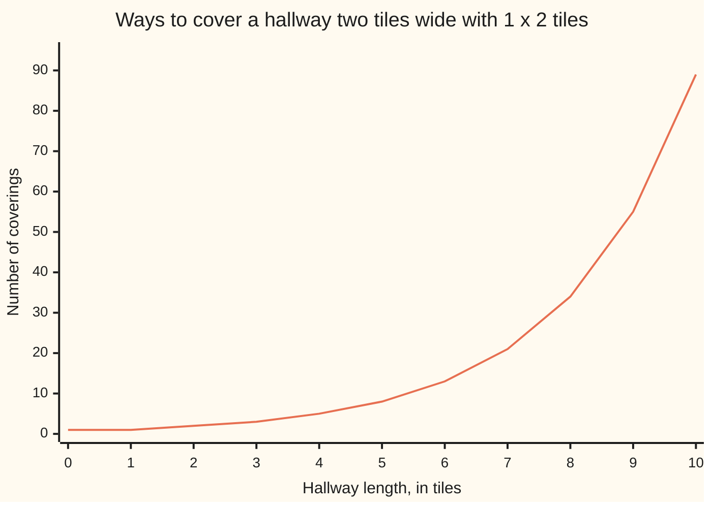
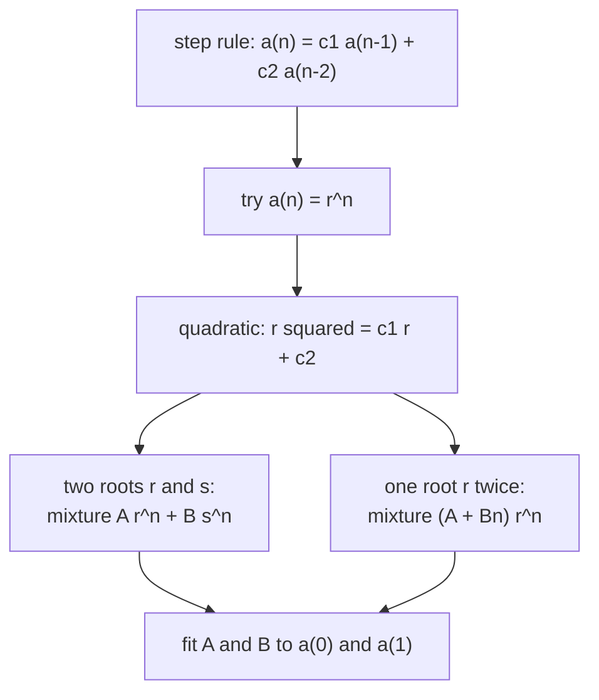

# The characteristic equation: try r^n, solve a quadratic, and any two-term step rule becomes a formula

[Syllabus](../../../SYLLABUS.md) → [Combinatorics and graphs](../README.md) → [Recurrences](../README.md#s05) → The characteristic equation

---

## General Overview

A hallway is two tiles wide and ten tiles long. The tiles are 1 × 2 rectangles, laid flat, no gaps and no overlaps. The floor can be covered 89 ways.

That count comes out of the far end: the last column is closed by one tile standing across it, leaving a hallway nine long, or by two lying lengthwise, leaving one eight long. So ten's count is nine's plus eight's — the step rule of [Recurrences](01-recurrences-and-fibonacci.md), whose counts are the Fibonacci numbers.

A step rule answers one question at a time: nothing in "add the last two" says the counts climb by a factor near 1.618. The formula comes from a guess: that the counts are a geometric sequence, each term a fixed multiple of the one before. Feed that in and a quadratic is left, whose roots are the only growth rates allowed.

Here that quadratic is r^2 = r + 1, roots 1.6180339887…, the golden ratio, and −0.6180339887…. Out of it falls Binet's formula, after Jacques Binet's paper of 1843.

**A two-term step rule with fixed weights is solved by asking which geometric sequences obey it: the weights fix a quadratic, its roots are the growth rates, and the two starting values fix the mixture.**

**What kind of fact this is:** a method, resting on a theorem proved in Why it works: a fitted mixture is the only sequence obeying the rule.

### The picture: the hallway counts, length by length



Each point is the two before it added together, and the climb steepens because every step multiplies by roughly 1.618.

---

## The formula

The term at step $n$ is written a(n), and a two-term step rule makes each term a fixed mix of the two behind it ([Recurrences](01-recurrences-and-fibonacci.md)):

$$a(n) = c_1\,a(n-1) + c_2\,a(n-2)$$

The weights c1 and c2 never change. Now the guess: let $r$ be a growth rate and try the sequence whose term at step $n$ is r^n, r multiplied in n times. The rule collapses to one equation, its **characteristic equation**:

$$r^2 = c_1 r + c_2$$

**Read it aloud:** a sequence multiplying by r each step obeys the rule exactly when r squared equals the first weight times r, plus the second.

By the quadratic formula ([The quadratic formula](../../03-Algebra/02-Polynomials/03-quadratic-formula.md)), if the roots $r$ and $s$ differ, every solution is

$$a(n) = A\,r^n + B\,s^n$$

and if the quadratic is one bracket squared, a single root $r$ standing twice, every solution is

$$a(n) = (A + Bn)\,r^n$$

$A$ and $B$ come from a(0) and a(1): two equations, two unknowns ([Two equations, two unknowns](../../03-Algebra/01-Letters%20and%20Equations/04-two-equations-two-unknowns.md)).

| Symbol | Plain meaning | In our example | Push it up and the answer… |
| --- | --- | --- | --- |
| $n$, in a(n) | the step, and its term | a hallway n tiles long | a bigger count |
| $c_1$, $c_2$ | fixed weights on the two behind | both 1 | faster growth |
| $r$, $s$, here $\varphi$ and $\psi$ (phi, psi) | growth rates: roots of the quadratic | 1.6180339887, −0.6180339887 | past 1, it climbs |
| $A$, $B$ | how much of each root sequence is mixed in | 1/√5, −1/√5 | scales that piece |
| $F$ | Fibonacci: F(0) = 0, F(1) = 1 | F(11) = 89 | — |

Fitted to the Fibonacci start, the mixture is **Binet's formula**:

$$F(n) = \frac{\varphi^n - \psi^n}{\sqrt{5}}, \qquad \varphi = \frac{1+\sqrt{5}}{2}, \qquad \psi = \frac{1-\sqrt{5}}{2}$$

A Fibonacci number is one geometric sequence minus another — one climbing by the golden ratio, one shrinking and flipping sign — over the square root of 5 ([Irrational numbers](../../01-Foundations/02-The%20Number%20Line/03-irrational-numbers.md)), which cancels from the answer.

### When it holds

- **Fixed weights, and a second weight that is not zero.** Weights moving with the step, as in a(n) = n·a(n−1), leave no quadratic behind; c2 = 0 makes the rule one-step, which is [First-order recurrences](03-first-order-recurrences-and-loans.md).
- **Nothing added on the right.** A cost paid afresh each step spoils the cancellation in Step 0; the repair is on [Recurrences with a driving term](05-nonhomogeneous-recurrences.md).
- **Real roots.** The part under the quadratic formula's square root, c1^2 + 4c2, is 5 here. Where it is negative the sequence swings instead of climbing.

---

## Why it works



Guess, reduce, split on the roots, fit the constants.

### Step 0: the trial turns the rule into a quadratic

The rule ties three consecutive terms with the same weights. A sequence multiplying by one number each step gives all three a common factor, and cancelling it turns an endless family of equations into one. Put a(n) = r^n in:

$$r^n = c_1 r^{n-1} + c_2 r^{n-2}$$

Every term holds r^(n−2); divide it out, since r = 0 only gives the all-zero sequence. What survives is r^2 = c1 r + c2. Both hallway weights are 1, so r^2 = r + 1, and the quadratic formula returns (1 ± √5)/2, the $\varphi$ and $\psi$ above.

### Step 1: mixtures of solutions are solutions

If the sequences u and v obey the rule, so does any mixture:

$$A\,u(n) + B\,v(n) = A\bigl(c_1 u(n-1) + c_2 u(n-2)\bigr) + B\bigl(c_1 v(n-1) + c_2 v(n-2)\bigr)$$

Regrouped by weight rather than by sequence, the right side is c1 times the mixture one step back plus c2 times it two back.

### Step 2: the starting values pin one mixture, and only one

A mixture has two free constants, a two-term rule two free starting values. Match them:

$$A + B = a(0), \qquad A\,r + B\,s = a(1)$$

Substituting the first into the second gives A(r − s) = a(1) − s·a(0), which fixes $A$ where the roots differ, and $B$ with it.

Fibonacci: A + B = 0 and A$\varphi$ + B$\psi$ = 1, so A($\varphi$ − $\psi$) = 1. Since $\varphi$ − $\psi$ = √5, A = 1/√5 and B = −1/√5 — Binet's formula.

A second rule in whole numbers: a(n) = 5a(n−1) − 6a(n−2) from 2 and 5. Its r^2 − 5r + 6 = 0 has roots 2 and 3, and the fit A + B = 2, 2A + 3B = 5 gives A = B = 1. So a(n) = 2^n + 3^n: 2, 5, 13, 35, 97, the list the rule builds.

<details>
<summary>Detailed proof: the fitted mixture is the only sequence obeying the rule</summary>

Two sequences obeying the rule and agreeing at steps 0 and 1 agree everywhere, by induction: agreeing at steps n−1 and n−2, they take step n from the same numbers and weights. The fit is forced either way — different roots by the line above, one root twice by A = a(0) and (A + B)r = a(1), with r ≠ 0 since c2 is not. The fitted mixture obeys the rule and matches the first two terms, hence all of them. ∎

</details>

### Step 3: a repeated root needs an extra n

A root standing twice means the quadratic is one bracket squared. Call that root r: then c1 = 2r and c2 = −r^2. It supplies r^n, and no second root supplies another; n·r^n fills the gap:

$$c_1 (n-1) r^{n-1} + c_2 (n-2) r^{n-2} = 2(n-1)r^{n} - (n-2)r^{n} = n\,r^n$$

Exactly what the rule demands. Worked: a(n) = 4a(n−1) − 4a(n−2) gives r^2 = 4r − 4, whose only root is 2, standing twice. From 1 and 6, A = 1 and (A + B) × 2 = 6, so B = 2, and (1 + 2n)·2^n runs 1, 6, 20, 56, 144, 352, 832, 1920; 2^n alone reaches 128 at step 7.

### Step 4: why rounding the big root is exact

$\psi$ = −0.6180339887… is under 1 in size, so its powers shrink; over √5 that piece starts at 0.4472135955 and only falls. It never reaches half a unit, so φ^n/√5 always rounds to F(n): at step 10 it is 55.0036361232, and 0.0036361232 is thrown away.

Two other roads reach this closed form: splitting a fraction, on [Solving a recurrence with a generating function](../07-Generating%20Functions/03-generating-functions-solve-recurrences.md), and a 2 by 2 matrix with these roots as eigenvalues, on [A recurrence is a matrix](06-recurrences-as-matrix-powers.md).

---

## Worked numbers, by hand

The hallway, two tiles wide and ten tiles long.

| Step | Arithmetic | Value |
| --- | --- | --- |
| the weights | last column closed one way or the other | c1 = 1, c2 = 1 |
| the characteristic equation | r^2 = r + 1 | roots 1.6180339887, −0.6180339887 |
| the starting counts | 0 long has 1 covering, 1 long has 1 | a(0) = a(1) = 1 |
| the two pieces at step 11 | φ^11/√5 = 88.9977527522, ψ^11/√5 = −0.0022472478 | difference **89** |
| by laying tiles instead | one tile placed at a time | **89** |

The hallway's rule is Fibonacci shifted one step, so ten tiles give F(11): 89 coverings, reached without adding anything up.

### What breaks if you drop a piece

| Mistake | Comes out at | What went wrong |
| --- | --- | --- |
| Signs carried straight across | a(4) = −553, not 97 | 5a(n−1) − 6a(n−2) means r^2 − 5r + 6 = 0, roots 2 and 3 |
| Constants fitted to the wrong start | a(4) = −33, not 97 | 3·2^n − 3^n obeys the same rule, but starts 2, 3 |
| No n at a repeated root | a(7) = 128, not 1920 | A·2^n has one constant where two must be met |

The code prints all three.

---

## Code, from first principles, and it actually runs

Nothing is imported: the square root of 5 is found here by repeated averaging, Newton's method, so no library holds the answer. Three roads reach the hallway count — tiles laid on the grid until it is full, the step rule in whole numbers, Binet's formula — and the rules 5, −6 and 4, −4 meet their closed forms too.

### Python

```python
# The characteristic equation and Binet -- the check behind the card.  Nothing is
# imported.  A hallway 2 tiles wide and n long is covered with 1 x 2 tiles, counted
# twice: by laying tiles on the grid one at a time, and by Binet's formula with the
# square root of 5 worked out here.  Two more step rules follow, 5, -6 and 4, -4.
def root(x):                                   # Newton's method, nothing imported
    g = x
    for _ in range(60): g = (g + x / g) / 2
    return g

def pw(x, k):                                  # powers by repeated multiplying
    out = 1.0
    for _ in range(k): out *= x
    return out

def tilings(n):                                # road one: lay tiles on the grid
    full = (1 << (2 * n)) - 1
    def lay(used):
        if used == full: return 1
        i = 0
        while used >> i & 1: i += 1
        r, c, ways = i // n, i % n, 0
        if c + 1 < n and not used >> (i + 1) & 1: ways += lay(used | 1 << i | 1 << (i + 1))
        if r == 0 and not used >> (i + n) & 1: ways += lay(used | 1 << i | 1 << (i + n))
        return ways
    return lay(0)

def run(c1, c2, a0, a1, N):                    # road two: the step rule, whole numbers
    a = [a0, a1]
    while len(a) <= N: a.append(c1 * a[-1] + c2 * a[-2])
    return a[:N + 1]
S5 = root(5.0)
PHI, PSI = (1 + S5) / 2, (1 - S5) / 2
def binet(n): return (pw(PHI, n) - pw(PSI, n)) / S5        # road three: the closed form
def row(name, xs): print(f"{name:<40}" + " ".join(str(x) for x in xs))

hall = [tilings(n) for n in range(11)]
F = run(1, 1, 0, 1, 20)
second, closed = run(5, -6, 2, 5, 8), [2 ** n + 3 ** n for n in range(9)]
rep, repclosed = run(4, -4, 1, 6, 7), [(1 + 2 * n) * 2 ** n for n in range(8)]
gaps = [abs(pw(PSI, n) / S5) for n in range(21)]
print(f"sqrt(5) = {S5:.10f}, phi = {PHI:.10f}, psi = {PSI:.10f}")
row("hallway 2 x n, tiles laid one by one:", hall)
row("F(0)..F(12) from the step rule:", F[:13])
row("F(0)..F(12) from Binet, rounded:", [round(binet(n)) for n in range(13)])
print(f"the 2 x 10 hallway: {hall[10]} coverings by laying tiles, F(11) = {F[11]} by the step rule")
print(f"phi^10/sqrt(5) = {pw(PHI, 10) / S5:.10f}, psi^10/sqrt(5) = {pw(PSI, 10) / S5:.10f}, Binet F(10) = {binet(10):.10f}")
print(f"phi^11/sqrt(5) = {pw(PHI, 11) / S5:.10f}, psi^11/sqrt(5) = {pw(PSI, 11) / S5:.10f}, Binet F(11) = {binet(11):.10f}")
print(f"largest small-root gap over n = 0..20: {max(gaps):.10f} at n = {gaps.index(max(gaps))}, under one half")
row("weights 5, -6 from seeds 2, 5:", second)
row("the same list from 2^n + 3^n:", closed)
row("weights 4, -4 from seeds 1, 6:", rep)
row("the same list from (1 + 2n) 2^n:", repclosed)
print(f"mistake 1, no n at the repeated root: a(7) = {2 ** 7}, not {rep[7]}")
print(f"mistake 2, signs carried straight across: a(4) = {11 * (-2) ** 4 - 9 * (-3) ** 4}, not {second[4]}")
print(f"mistake 3, constants fitted to seeds 2, 3: a(4) = {3 * 2 ** 4 - 3 ** 4}, not {second[4]}")
assert hall == F[1:12]                                  # laying tiles against the step rule
assert [round(binet(n)) for n in range(21)] == F        # Binet against the step rule
assert second == closed                                 # roots 2 and 3, fitted to the seeds
assert rep == repclosed                                 # the repeated root needs its n
print("ALL CHECKS PASS")
```

**Ran 2026-09-14 on macOS, Python 3.14.6, standard library only. All checks passed. Output, pasted from the run:**

```
sqrt(5) = 2.2360679775, phi = 1.6180339887, psi = -0.6180339887
hallway 2 x n, tiles laid one by one:   1 1 2 3 5 8 13 21 34 55 89
F(0)..F(12) from the step rule:         0 1 1 2 3 5 8 13 21 34 55 89 144
F(0)..F(12) from Binet, rounded:        0 1 1 2 3 5 8 13 21 34 55 89 144
the 2 x 10 hallway: 89 coverings by laying tiles, F(11) = 89 by the step rule
phi^10/sqrt(5) = 55.0036361232, psi^10/sqrt(5) = 0.0036361232, Binet F(10) = 55.0000000000
phi^11/sqrt(5) = 88.9977527522, psi^11/sqrt(5) = -0.0022472478, Binet F(11) = 89.0000000000
largest small-root gap over n = 0..20: 0.4472135955 at n = 0, under one half
weights 5, -6 from seeds 2, 5:          2 5 13 35 97 275 793 2315 6817
the same list from 2^n + 3^n:           2 5 13 35 97 275 793 2315 6817
weights 4, -4 from seeds 1, 6:          1 6 20 56 144 352 832 1920
the same list from (1 + 2n) 2^n:        1 6 20 56 144 352 832 1920
mistake 1, no n at the repeated root: a(7) = 128, not 1920
mistake 2, signs carried straight across: a(4) = -553, not 97
mistake 3, constants fitted to seeds 2, 3: a(4) = -33, not 97
ALL CHECKS PASS
```

### Rust

Same numbers, same labels, built with `rustc --edition 2021 -O`.

```rust
// The characteristic equation and Binet -- the same check as the Python, in Rust.
// No crates.  A hallway 2 tiles wide and n long is covered with 1 x 2 tiles, counted
// twice: by laying tiles on the grid one at a time, and by Binet's formula with the
// square root of 5 worked out here.  Two more step rules follow, 5, -6 and 4, -4.
fn root(x: f64) -> f64 {                        // Newton's method, no crates
    let mut g = x;
    for _ in 0..60 { g = (g + x / g) / 2.0 }
    g
}

fn pw(x: f64, k: u32) -> f64 {                  // powers by repeated multiplying
    let mut out = 1.0;
    for _ in 0..k { out *= x }
    out
}

fn lay(used: u32, full: u32, n: u32) -> i64 {   // road one: lay tiles on the grid
    if used == full { return 1 }
    let mut i = 0u32;
    while used >> i & 1 == 1 { i += 1 }
    let (r, c, mut ways) = (i / n, i % n, 0);
    if c + 1 < n && used >> (i + 1) & 1 == 0 { ways += lay(used | 1 << i | 1 << (i + 1), full, n) }
    if r == 0 && used >> (i + n) & 1 == 0 { ways += lay(used | 1 << i | 1 << (i + n), full, n) }
    ways
}

fn tilings(n: u32) -> i64 { lay(0, (1u32 << (2 * n)) - 1, n) }

fn run(c1: i64, c2: i64, a0: i64, a1: i64, big_n: usize) -> Vec<i64> {   // road two
    let mut a = vec![a0, a1];
    while a.len() <= big_n { let k = a.len(); a.push(c1 * a[k - 1] + c2 * a[k - 2]) }
    a.truncate(big_n + 1);
    a
}

fn row(name: &str, xs: &[i64]) {
    let parts: Vec<String> = xs.iter().map(|x| x.to_string()).collect();
    println!("{:<40}{}", name, parts.join(" "));
}

fn main() {
    let s5 = root(5.0);
    let (phi, psi) = ((1.0 + s5) / 2.0, (1.0 - s5) / 2.0);
    let binet = |n: u32| (pw(phi, n) - pw(psi, n)) / s5;   // road three: the closed form
    let hall: Vec<i64> = (0..11).map(tilings).collect();
    let f = run(1, 1, 0, 1, 20);
    let (second, closed) = (run(5, -6, 2, 5, 8), (0..9).map(|n| 2i64.pow(n) + 3i64.pow(n)).collect::<Vec<i64>>());
    let (rep, repclosed) = (run(4, -4, 1, 6, 7), (0..8).map(|n| (1 + 2 * n as i64) * 2i64.pow(n)).collect::<Vec<i64>>());
    let gaps: Vec<f64> = (0..21).map(|n| (pw(psi, n) / s5).abs()).collect();
    let best = gaps.iter().cloned().fold(0.0f64, f64::max);
    let at = gaps.iter().position(|g| *g == best).unwrap();
    let bin13: Vec<i64> = (0..13).map(|n| binet(n).round() as i64).collect();
    println!("sqrt(5) = {:.10}, phi = {:.10}, psi = {:.10}", s5, phi, psi);
    row("hallway 2 x n, tiles laid one by one:", &hall);
    row("F(0)..F(12) from the step rule:", &f[..13]);
    row("F(0)..F(12) from Binet, rounded:", &bin13);
    println!("the 2 x 10 hallway: {} coverings by laying tiles, F(11) = {} by the step rule", hall[10], f[11]);
    println!("phi^10/sqrt(5) = {:.10}, psi^10/sqrt(5) = {:.10}, Binet F(10) = {:.10}", pw(phi, 10) / s5, pw(psi, 10) / s5, binet(10));
    println!("phi^11/sqrt(5) = {:.10}, psi^11/sqrt(5) = {:.10}, Binet F(11) = {:.10}", pw(phi, 11) / s5, pw(psi, 11) / s5, binet(11));
    println!("largest small-root gap over n = 0..20: {:.10} at n = {}, under one half", best, at);
    row("weights 5, -6 from seeds 2, 5:", &second);
    row("the same list from 2^n + 3^n:", &closed);
    row("weights 4, -4 from seeds 1, 6:", &rep);
    row("the same list from (1 + 2n) 2^n:", &repclosed);
    println!("mistake 1, no n at the repeated root: a(7) = {}, not {}", 2i64.pow(7), rep[7]);
    println!("mistake 2, signs carried straight across: a(4) = {}, not {}", 11 * (-2i64).pow(4) - 9 * (-3i64).pow(4), second[4]);
    println!("mistake 3, constants fitted to seeds 2, 3: a(4) = {}, not {}", 3 * 2i64.pow(4) - 3i64.pow(4), second[4]);
    let bin20: Vec<i64> = (0..21).map(|n| binet(n).round() as i64).collect();
    assert!(hall == f[1..12].to_vec());          // laying tiles against the step rule
    assert!(bin20 == f);                         // Binet against the step rule
    assert!(second == closed);                   // roots 2 and 3, fitted to the seeds
    assert!(rep == repclosed);                   // the repeated root needs its n
    println!("ALL CHECKS PASS");
}
```

**Ran 2026-09-14 on macOS, rustc 1.98.1, no crates. All checks passed. Output, pasted from the run:**

```
sqrt(5) = 2.2360679775, phi = 1.6180339887, psi = -0.6180339887
hallway 2 x n, tiles laid one by one:   1 1 2 3 5 8 13 21 34 55 89
F(0)..F(12) from the step rule:         0 1 1 2 3 5 8 13 21 34 55 89 144
F(0)..F(12) from Binet, rounded:        0 1 1 2 3 5 8 13 21 34 55 89 144
the 2 x 10 hallway: 89 coverings by laying tiles, F(11) = 89 by the step rule
phi^10/sqrt(5) = 55.0036361232, psi^10/sqrt(5) = 0.0036361232, Binet F(10) = 55.0000000000
phi^11/sqrt(5) = 88.9977527522, psi^11/sqrt(5) = -0.0022472478, Binet F(11) = 89.0000000000
largest small-root gap over n = 0..20: 0.4472135955 at n = 0, under one half
weights 5, -6 from seeds 2, 5:          2 5 13 35 97 275 793 2315 6817
the same list from 2^n + 3^n:           2 5 13 35 97 275 793 2315 6817
weights 4, -4 from seeds 1, 6:          1 6 20 56 144 352 832 1920
the same list from (1 + 2n) 2^n:        1 6 20 56 144 352 832 1920
mistake 1, no n at the repeated root: a(7) = 128, not 1920
mistake 2, signs carried straight across: a(4) = -553, not 97
mistake 3, constants fitted to seeds 2, 3: a(4) = -33, not 97
ALL CHECKS PASS
```

The two outputs match line for line.

> [!TIP]
> **Try changing**
> Guess first, then run it. Each change below stops one assert.
> - **A longer hallway.** Change `range(11)` to `range(13)` in `hall`. Both roads agree still, but the first assert wants exactly eleven counts.
> - **A different start.** Change the seeds in `run(1, 1, 0, 1, 20)` to 2, 1. The roots do not move, but every constant on the card was fitted to 0 and 1: the first assert stops it.
> - **Drop the n at the repeated root.** Change `(1 + 2 * n) * 2 ** n` to `2 ** n`: the lists part at step 1 and the fourth assert stops it.

---

## The usual mistake

> [!warning]
> **Reading the roots straight off the rule's signs.** a(n) = 5a(n−1) − 6a(n−2) gives r^2 = 5r − 6, so r^2 − 5r + 6 = 0, roots 2 and 3. Copying the 5 and the −6 across as they stand gives −2 and −3, and −553 at step 4 instead of 97.
>
> - **Dropping the n at a repeated root.** Two copies of one root are one sequence, not two: 2^n alone reaches 128 at step 7, not 1920.
> - **Fitting the constants to the wrong start.** The roots choose the family, the start the member: 3·2^n − 3^n obeys the same rule from 2, 3 and gives −33 at step 4.
> - **Treating Binet's formula as an approximation.** It is exact at every step; the square roots of 5 cancel. Rounding only discards the small root.

---

## Where you meet it in real life

- **Counting coverings, paths and strings.** Anything built by closing off a last piece in a fixed number of ways obeys such a rule, whose larger root is the growth rate.
- **Digital filters**, the code that smooths a stream of measurements. Its output is a fixed mix of its last few outputs, and the roots decide its fate: all under 1 in size and the response dies away, one past 1 and it runs away. That test is stability.
- **Costs of recursive routines.** A routine calling itself twice on smaller inputs has a cost obeying a step rule; cutting the input by a factor needs the tools on [Divide-and-conquer recurrences](07-divide-and-conquer-recurrences.md).

> **Say it back**
> A two-term step rule with fixed weights is solved by guessing a geometric sequence. Feeding r^n into it cancels everything but a quadratic, whose roots are the only growth rates allowed. Root sequences mix freely, and the two starting values fix exactly one mixture: for Fibonacci, whose quadratic is r^2 = r + 1, that mixture is Binet's formula. Where the roots coincide, one serves twice and the second sequence is n times it.

---

## What this builds on

- [Recurrences](01-recurrences-and-fibonacci.md): the step rule and the Fibonacci numbers.
- [First-order recurrences](03-first-order-recurrences-and-loans.md): the one-step case, one growth rate.
- [The quadratic formula](../../03-Algebra/02-Polynomials/03-quadratic-formula.md): how the roots come out.
- [Two equations, two unknowns](../../03-Algebra/01-Letters%20and%20Equations/04-two-equations-two-unknowns.md): fitting A and B.
- [Irrational numbers](../../01-Foundations/02-The%20Number%20Line/03-irrational-numbers.md): what √5 is.

## Where this goes next

- [Recurrences with a driving term](05-nonhomogeneous-recurrences.md): a cost added at every step, spoiling the cancellation in Step 0.
- [A recurrence is a matrix](06-recurrences-as-matrix-powers.md): the same roots as eigenvalues, and huge steps by repeated squaring.
- [Solving a recurrence with a generating function](../07-Generating%20Functions/03-generating-functions-solve-recurrences.md): the same closed form by splitting a fraction.

Two weights and two starting values are settled; what a rule does when it looks back further, or pays a cost at every step, is the shelf's next question.

---

## Sources

Verified 14 Sep 2026: every link below resolves to the publisher's page.

- Levin, Oscar. *Discrete Mathematics: An Open Introduction*, 3rd ed. [Section 2.4, Solving Recurrence Relations](https://discrete.openmathbooks.org/dmoi3/sec_recurrence.html). Free; the characteristic-root method and the repeated-root case.
- Graham, Ronald L., Donald E. Knuth, and Oren Patashnik. *Concrete Mathematics*, 2nd ed. Addison-Wesley, 1994. [Publisher page](https://www.informit.com/store/concrete-mathematics-a-foundation-for-computer-science-9780201558029). Chapter 6, Fibonacci and the fixed-weight rule.
- *NIST Digital Library of Mathematical Functions*, [§26.11, Fibonacci numbers](https://dlmf.nist.gov/26.11). The reference statement of the step rule (26.11.5) and Binet's closed form (26.11.7).
- O'Connor, J. J., and E. F. Robertson. "Jacques Philippe Marie Binet." MacTutor Archive, University of St Andrews. [Biography](https://mathshistory.st-andrews.ac.uk/Biographies/Binet/). Dates the 1843 paper.
