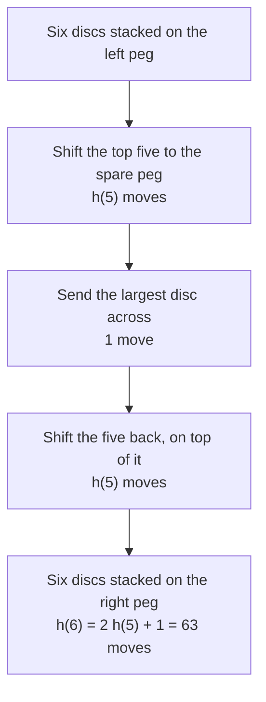

# Recurrences with a driving term: guess a particular solution of the same shape, add the homogeneous part, fit the seeds

Combinatorics and graphs → Recurrences → Undetermined coefficients → Recurrences with a driving term

---

## General Overview

Three pegs stand in a row. Six discs of different sizes sit stacked on the left peg, largest at the bottom. Move the stack to the right peg, one disc at a time, never a larger disc onto a smaller one.

It takes 63 moves, and no fewer. The count falls out without touching a disc: the largest disc cannot cross until the other five sit on the spare peg, so six discs cost five shifted, one move, and five shifted back. Five discs are paid for twice, plus one move.

h(6) = 2 h(5) + 1, with h(0) = 0, since no discs take no moves.

Earlier cards on this shelf built each term from earlier terms alone. The added 1 is new: it arrives from outside at every step. Such an amount is the **driving term**, written f(n). A rule carrying one is **nonhomogeneous**, a rule without one **homogeneous**.

A second case, in dollars: an account paying 1% a month takes a deposit at each month's end of 10n dollars — $10 in the first month, and $10 more every month after. Its balance follows s(n) = 1.01 s(n-1) + 10n, reaching $809.33 in a year.

**Solve the rule with the driving term deleted, add any one sequence obeying the whole rule, and let the starting value pick the single member of that family.**

**What kind of fact this is:** a method, resting on a theorem proved on this card in Why it works: every solution is one particular solution plus a homogeneous one.

### Why six discs cost twice five, plus one



---

## The formula

Writing a(n) means the n-th term, and a rule building each term from the one before it is a first-order recurrence:

$$a(n) = c\,a(n-1) + f(n)$$

**Read it aloud:** each term is the one before it times a fixed number, plus what the driving term adds at that step.

Call the same rule with the driving term deleted the **stripped rule**. Every solution then splits in two: one sequence obeying the full rule, plus a solution of the stripped rule:

$$a(n) = A\,c^n + p(n)$$

| Symbol | Plain meaning | In our example | Push it up and the answer… |
| --- | --- | --- | --- |
| $a(n)$ | the n-th term | h(6) = 63 moves | — |
| $c$ | the multiplier on the previous term | 2; 1.01 | climbs faster |
| $f(n)$ | the driving term, added at step n | 1 move; 10n dollars | rises by more |
| $p(n)$ | a particular solution: one sequence obeying the rule | −1 | — |
| $A$ | the unknown in $A c^n$, fixed by the starting value | 1; 101000 | raises every term, by c^n times the change |
| $B$, $C$ | the undetermined coefficients in the guess | −1 (discs); −1000, −101000 (account) | — |

The guess copies the driving term's shape, because the rule preserves it: multiply a constant by $c$, add a constant, and a constant comes back.

| Driving term f(n) | Guess for p(n) | When it fails |
| --- | --- | --- |
| a constant, like the discs' 1 | B | c = 1: use B n |
| a line in n, like 10n dollars | B n + C | c = 1: use B n^2 + C n |
| a geometric term, base r, like 3^n | B r^n | r = c: use B n r^n |

One rule covers that last column: when the guess already solves the stripped rule, multiply it by n.

### When it holds

- **The multiplier c is fixed.** If c moves with n, the homogeneous part is no longer a power of one number, and the guesses lose their footing.
- **The driving term is a constant, a polynomial in n, a geometric term, or a sum of those.** Something like 1/n has no guess of finite size; only growing each added amount separately and adding them up is left.
- **The guess does not already solve the stripped rule.** Where it does, matching coefficients gives 0 = 1.

---

## Why it works

### Step 0: subtracting two solutions deletes the driving term

Take two sequences that obey the rule and subtract them term by term. Both took in the same f(n) at every step, so the difference never sees it. What is left obeys the stripped rule, solved on [characteristic-equation-and-binet](04-characteristic-equation-and-binet.md).

### Step 1: so the family is one solution plus the homogeneous ones

Find any single sequence p(n) obeying the full rule — the particular solution. Every other solution differs from it by something obeying the stripped rule, namely A c^n. Every A works and nothing else does.

<details>
<summary>Detailed proof: the family is exactly $A c^n + p(n)$</summary>

Let p obey $p(n) = c\,p(n-1) + f(n)$ for every n ≥ 1, and let a be any other solution. Put d(n) = a(n) − p(n). Then

$$d(n) = \big(c\,a(n-1) + f(n)\big) - \big(c\,p(n-1) + f(n)\big) = c\,d(n-1).$$

The copies of f(n) cancel, so d obeys the stripped rule, and stepping down to 0 gives d(n) = d(0) c^n. With A = a(0) − p(0), a(n) = A c^n + p(n). The other way round, q(n) = A c^n + p(n) gives c q(n-1) + f(n) = q(n) for any A. So the solutions are exactly A c^n + p(n), and a(0) picks one.

</details>

### Step 2: guess a constant, then fit the seed

For the discs, f(n) is the constant 1 and c = 2. Guess a constant B: B = 2B + 1, so B = −1, and indeed 2 × (−1) + 1 = −1. That is a particular solution and a nonsense move count — one solution, not the wanted one. The letter B was left undetermined and the rule pinned it: hence **undetermined coefficients**.

The stripped rule is doubling, so its solutions are A 2^n. Adding the parts gives h(n) = A 2^n − 1, and h(0) = 0 forces A = 1. So h(n) = 2^n − 1, and six discs cost 2^6 − 1 = 63 moves, with every other count answered at the same time.

### Step 3: a straight-line driving term, in dollars

The account has c = 1.01 and f(n) = 10n. Guess a straight line back, p(n) = Bn + C:

$$Bn + C = 1.01\big(B(n-1) + C\big) + 10n.$$

Two straight lines agree at every n only if their n parts and constant parts agree separately ([linear-equations](../../03-Algebra/01-Letters%20and%20Equations/02-linear-equations.md)). The n parts give B = 1.01B + 10, so B = −1000; the constant parts give C = −1.01B + 1.01C, so C = −101000. An empty account, s(0) = 0, fixes A = 101000:

$$s(n) = 101000 \times 1.01^n - 1000n - 101000.$$

### Step 4: when the guess is already homogeneous

Try t(n) = 2 t(n-1) + 2^n with the guess B 2^n. It gives B 2^n = 2B 2^(n-1) + 2^n, whose first two terms are equal, leaving 0 = 2^n. No B saves it: B 2^n already solves the stripped rule, and the homogeneous part never produces the driving term. A factor of n breaks the tie: B n 2^n gives Bn = B(n-1) + 1, so B = 1, and t(0) = 0 leaves t(n) = n 2^n, matching the forward run 2, 8, 24, 64, 160.

One road avoids guessing: multiply each amount handed in by c once per remaining step and add them up — exact, and slow. That sum telescopes on [finite-differences-and-telescoping-sums](02-finite-differences-and-telescoping-sums.md); another road makes the step a matrix ([recurrences-as-matrix-powers](06-recurrences-as-matrix-powers.md)).

---

## Worked numbers, by hand

| Step | Arithmetic | Value |
| --- | --- | --- |
| strip the 1, guess a constant | B = 2B + 1 | B = −1 |
| add A 2^n, fit h(0) = 0 | A − 1 = 0 | A = 1 |
| six discs | 2^6 − 1 | **63 moves** |
| the account, n parts | B = 1.01B + 10 | B = −1000 |
| constant parts | C = −1.01B + 1.01C | C = −101000 |
| add A 1.01^n, fit s(0) = 0 | A − 101000 = 0 | A = 101000 |
| twelve months | 101000 × 1.01^12 − 1000 × 12 − 101000 | **$809.33** |

Six discs take 63 moves however cleverly they are shifted, and a year of rising deposits leaves $809.33: $780.00 handed in, $29.33 earned.

### What breaks if you drop a piece

| Mistake | Comes out at | What went wrong |
| --- | --- | --- |
| The particular part alone | −1 moves | Obeys the rule, but starts in the wrong place |
| Fitting A 2^n at one disc, no added 1 | 32 moves | The driving term is not homogeneous |
| A constant guess where c = 1 | B = B + 1 | Already homogeneous; a(n) = a(n-1) + 1 gives a(6) = 6 |
| A geometric guess at resonance | 0 at n = 5 | B 2^n cannot make 2^n; the truth is n 2^n, or 160 |

---

## Code, from first principles, and it actually runs

Nothing is imported. The discs are counted three ways: stepping the rule forward, evaluating 2^n − 1, and making the moves on three pegs, refusing any illegal one. The account is reached forward, from the closed form, and by growing each deposit on its own.

### Python

```python
# Recurrences with a driving term -- the check behind the card.  Nothing is
# imported.  Two rules that add an outside amount at every step: the Tower of
# Hanoi, h(n) = 2 h(n-1) + 1 with h(0) = 0, and a savings account at 1% a month
# taking a deposit of 10n dollars in month n.  Every answer is reached at least
# twice: forward from the seed, and from the closed form that undetermined
# coefficients builds.  The Hanoi moves are also actually made, on three pegs.
DISCS, MONTHS, RATE = 6, 12, 1.01
def moves(n, src=0, dst=2, spare=1):            # the recursion, written out as moves
    if n == 0: return []
    return moves(n - 1, src, spare, dst) + [(n, src, dst)] + moves(n - 1, spare, dst, src)
def rebuilt(n):                                 # make those moves on three real pegs
    pegs = [list(range(n, 0, -1)), [], []]
    for disc, src, dst in moves(n):
        if not pegs[src] or pegs[src][-1] != disc: return False
        if pegs[dst] and pegs[dst][-1] < disc: return False
        pegs[dst].append(pegs[src].pop())
    return pegs[2] == list(range(n, 0, -1))
def forward(c, drive, seed, last):              # a(n) = c a(n-1) + drive(n), stepped
    out, a = [], seed
    for n in range(1, last + 1):
        a = c * a + drive(n)
        out.append(a)
    return out
def row(name, vals, w=7): print(f"{name:<36}" + "".join(f"{v:>{w}}" for v in vals))
def cash(vals): return [f"{v:.2f}" for v in vals]
def yn(claim): return "yes" if claim else "no"
ns, ms = list(range(1, DISCS + 1)), list(range(1, MONTHS + 1))
fwd_h, closed_h = forward(2, lambda n: 1, 0, DISCS), [2 ** n - 1 for n in ns]
made = [len(moves(n)) for n in ns]
fwd_s = forward(RATE, lambda n: 10 * n, 0.0, MONTHS)
closed_s = [101000 * RATE ** n - 1000 * n - 101000 for n in ms]
grown = [sum(10 * k * RATE ** (n - k) for k in range(1, n + 1)) for n in ms]
flat = [5 * n * (n + 1) for n in ms]
geo_f, geo_c = forward(2, lambda n: 3 ** n, 0, 5), [3 ** (n + 1) - 3 * 2 ** n for n in range(1, 6)]
res_f, res_c = forward(2, lambda n: 2 ** n, 0, 5), [n * 2 ** n for n in range(1, 6)]
print("Tower of Hanoi, h(n) = 2 h(n-1) + 1, h(0) = 0; closed form 2^n - 1")
row("discs n", ns)
row("forward, one step at a time", fwd_h)
row("from the closed form", closed_h)
row("moves the recursion actually makes", made)
print(f"six discs: {closed_h[-1]} moves, every move legal and the tower rebuilt: {yn(rebuilt(DISCS))}")
print("Savings at 1% a month, s(n) = 1.01 s(n-1) + 10n, s(0) = 0; closed form 101000 x 1.01^n - 1000n - 101000")
row("month n", ms)
row("forward, month by month", cash(fwd_s))
row("from the closed form", cash(closed_s))
row("each deposit grown, added up", cash(grown))
row("at 0% instead, 5n(n+1)", cash(flat))
print(f"after twelve months {fwd_s[-1]:.2f}: deposits {flat[-1]:.2f} and interest {fwd_s[-1] - flat[-1]:.2f}")
print(f"t(n) = 2 t(n-1) + 3^n: forward {geo_f}, closed form 3^(n+1) - 3 x 2^n {geo_c}, same: {yn(geo_f == geo_c)}")
print(f"t(n) = 2 t(n-1) + 2^n: forward {res_f}, closed form n x 2^n {res_c}, same: {yn(res_f == res_c)}")
print(f"mistake 1, the particular part alone: {int(1 / (1 - 2))} moves for six discs, not {closed_h[-1]}")
print(f"mistake 2, the added 1 dropped: A x 2^n fitted at one disc gives {fwd_h[0] / 2 * 2 ** DISCS:.0f}, not {closed_h[-1]}")
print(f"mistake 3, a constant guess where c = 1: B = B + 1 has no solution, and a(6) = {forward(1, lambda n: 1, 0, DISCS)[-1]}")
print(f"mistake 4, resonance with a plain geometric guess: {forward(2, lambda n: 0, 0, 5)[-1]} at n = 5, not {res_c[-1]}")
assert made == fwd_h == closed_h
assert cash(fwd_s) == cash(closed_s) == cash(grown)
assert geo_f == geo_c and res_f == res_c
assert rebuilt(DISCS) and flat == [sum(10 * k for k in range(1, n + 1)) for n in ms]
print("ALL CHECKS PASS")
```

**Ran 2026-09-14 on macOS, Python 3.14.6, standard library only. All checks passed. Output, pasted from the run:**

```
Tower of Hanoi, h(n) = 2 h(n-1) + 1, h(0) = 0; closed form 2^n - 1
discs n                                   1      2      3      4      5      6
forward, one step at a time               1      3      7     15     31     63
from the closed form                      1      3      7     15     31     63
moves the recursion actually makes        1      3      7     15     31     63
six discs: 63 moves, every move legal and the tower rebuilt: yes
Savings at 1% a month, s(n) = 1.01 s(n-1) + 10n, s(0) = 0; closed form 101000 x 1.01^n - 1000n - 101000
month n                                   1      2      3      4      5      6      7      8      9     10     11     12
forward, month by month               10.00  30.10  60.40 101.01 152.02 213.54 285.67 368.53 462.21 566.83 682.50 809.33
from the closed form                  10.00  30.10  60.40 101.01 152.02 213.54 285.67 368.53 462.21 566.83 682.50 809.33
each deposit grown, added up          10.00  30.10  60.40 101.01 152.02 213.54 285.67 368.53 462.21 566.83 682.50 809.33
at 0% instead, 5n(n+1)                10.00  30.00  60.00 100.00 150.00 210.00 280.00 360.00 450.00 550.00 660.00 780.00
after twelve months 809.33: deposits 780.00 and interest 29.33
t(n) = 2 t(n-1) + 3^n: forward [3, 15, 57, 195, 633], closed form 3^(n+1) - 3 x 2^n [3, 15, 57, 195, 633], same: yes
t(n) = 2 t(n-1) + 2^n: forward [2, 8, 24, 64, 160], closed form n x 2^n [2, 8, 24, 64, 160], same: yes
mistake 1, the particular part alone: -1 moves for six discs, not 63
mistake 2, the added 1 dropped: A x 2^n fitted at one disc gives 32, not 63
mistake 3, a constant guess where c = 1: B = B + 1 has no solution, and a(6) = 6
mistake 4, resonance with a plain geometric guess: 0 at n = 5, not 160
ALL CHECKS PASS
```

### Rust

Same numbers, same labels, built with `rustc --edition 2021 -O`.

```rust
// Recurrences with a driving term -- the same check as the Python, in Rust.  No
// crates.  Two rules that add an outside amount at every step: the Tower of
// Hanoi, h(n) = 2 h(n-1) + 1 with h(0) = 0, and a savings account at 1% a month
// taking a deposit of 10n dollars in month n.  Every answer is reached at least
// twice: forward from the seed, and from the closed form that undetermined
// coefficients builds.  The Hanoi moves are also actually made, on three pegs.
const DISCS: i64 = 6;
const MONTHS: i64 = 12;
const RATE: f64 = 1.01;
fn moves(n: i64, src: usize, dst: usize, spare: usize) -> Vec<(i64, usize, usize)> {
    if n == 0 { return Vec::new() }                   // the recursion, written out as moves
    let mut out = moves(n - 1, src, spare, dst);
    out.push((n, src, dst)); out.extend(moves(n - 1, spare, dst, src));
    out
}
fn rebuilt(n: i64) -> bool {                          // make those moves on three real pegs
    let mut pegs: Vec<Vec<i64>> = vec![(1..=n).rev().collect(), Vec::new(), Vec::new()];
    for (disc, src, dst) in moves(n, 0, 2, 1) {
        if pegs[src].last() != Some(&disc) { return false }
        if let Some(&top) = pegs[dst].last() { if top < disc { return false } }
        let d = pegs[src].pop().unwrap(); pegs[dst].push(d)
    }
    pegs[2] == (1..=n).rev().collect::<Vec<i64>>()
}
fn forward_i(c: i64, drive: &dyn Fn(i64) -> i64, seed: i64, last: i64) -> Vec<i64> {
    let (mut out, mut a) = (Vec::new(), seed);        // a(n) = c a(n-1) + drive(n), stepped
    for n in 1..=last { a = c * a + drive(n); out.push(a) }
    out
}
fn forward_f(c: f64, drive: &dyn Fn(i64) -> f64, seed: f64, last: i64) -> Vec<f64> {
    let (mut out, mut a) = (Vec::new(), seed);
    for n in 1..=last { a = c * a + drive(n); out.push(a) }
    out
}
fn row(name: &str, vals: &[String]) {
    let mut line = format!("{:<36}", name);
    for v in vals { line.push_str(&format!("{:>7}", v)) }
    println!("{}", line);
}
fn cash(vals: &[f64]) -> Vec<String> { vals.iter().map(|v| format!("{:.2}", v)).collect() }
fn ints(vals: &[i64]) -> Vec<String> { vals.iter().map(|v| v.to_string()).collect() }
fn yn(claim: bool) -> &'static str { if claim { "yes" } else { "no" } }
fn main() {
    let (ns, ms): (Vec<i64>, Vec<i64>) = ((1..=DISCS).collect(), (1..=MONTHS).collect());
    let fwd_h = forward_i(2, &|_n| 1, 0, DISCS);
    let closed_h: Vec<i64> = ns.iter().map(|&n| 2i64.pow(n as u32) - 1).collect();
    let made: Vec<i64> = ns.iter().map(|&n| moves(n, 0, 2, 1).len() as i64).collect();
    let fwd_s = forward_f(RATE, &|n| 10.0 * n as f64, 0.0, MONTHS);
    let closed_s: Vec<f64> = ms.iter().map(|&n| 101000.0 * RATE.powf(n as f64) - 1000.0 * n as f64 - 101000.0).collect();
    let grown: Vec<f64> = ms.iter().map(|&n| (1..=n).map(|k| 10.0 * k as f64 * RATE.powf((n - k) as f64)).sum()).collect();
    let flat: Vec<i64> = ms.iter().map(|&n| 5 * n * (n + 1)).collect();
    let (geo_f, geo_c) = (forward_i(2, &|n| 3i64.pow(n as u32), 0, 5), (1i64..6).map(|n| 3i64.pow(n as u32 + 1) - 3 * 2i64.pow(n as u32)).collect::<Vec<i64>>());
    let (res_f, res_c) = (forward_i(2, &|n| 2i64.pow(n as u32), 0, 5), (1i64..6).map(|n| n * 2i64.pow(n as u32)).collect::<Vec<i64>>());
    println!("Tower of Hanoi, h(n) = 2 h(n-1) + 1, h(0) = 0; closed form 2^n - 1");
    row("discs n", &ints(&ns));
    row("forward, one step at a time", &ints(&fwd_h));
    row("from the closed form", &ints(&closed_h));
    row("moves the recursion actually makes", &ints(&made));
    println!("six discs: {} moves, every move legal and the tower rebuilt: {}", closed_h[5], yn(rebuilt(DISCS)));
    println!("Savings at 1% a month, s(n) = 1.01 s(n-1) + 10n, s(0) = 0; closed form 101000 x 1.01^n - 1000n - 101000");
    row("month n", &ints(&ms));
    row("forward, month by month", &cash(&fwd_s));
    row("from the closed form", &cash(&closed_s));
    row("each deposit grown, added up", &cash(&grown));
    row("at 0% instead, 5n(n+1)", &cash(&flat.iter().map(|&v| v as f64).collect::<Vec<f64>>()));
    println!("after twelve months {:.2}: deposits {:.2} and interest {:.2}", fwd_s[11], flat[11] as f64, fwd_s[11] - flat[11] as f64);
    println!("t(n) = 2 t(n-1) + 3^n: forward {:?}, closed form 3^(n+1) - 3 x 2^n {:?}, same: {}", geo_f, geo_c, yn(geo_f == geo_c));
    println!("t(n) = 2 t(n-1) + 2^n: forward {:?}, closed form n x 2^n {:?}, same: {}", res_f, res_c, yn(res_f == res_c));
    println!("mistake 1, the particular part alone: {} moves for six discs, not {}", (1.0 / (1.0 - 2.0)) as i64, closed_h[5]);
    println!("mistake 2, the added 1 dropped: A x 2^n fitted at one disc gives {:.0}, not {}", fwd_h[0] as f64 / 2.0 * 2f64.powf(DISCS as f64), closed_h[5]);
    println!("mistake 3, a constant guess where c = 1: B = B + 1 has no solution, and a(6) = {}", forward_i(1, &|_n| 1, 0, DISCS)[5]);
    println!("mistake 4, resonance with a plain geometric guess: {} at n = 5, not {}", forward_i(2, &|_n| 0, 0, 5)[4], res_c[4]);
    assert!(made == fwd_h && fwd_h == closed_h);
    assert!(cash(&fwd_s) == cash(&closed_s) && cash(&closed_s) == cash(&grown));
    assert!(geo_f == geo_c && res_f == res_c);
    assert!(rebuilt(DISCS) && flat == ms.iter().map(|&n| (1..=n).map(|k| 10 * k).sum::<i64>()).collect::<Vec<i64>>());
    println!("ALL CHECKS PASS");
}
```

**Ran 2026-09-14 on macOS, rustc 1.98.1, no crates. All checks passed. Output, pasted from the run:**

```
Tower of Hanoi, h(n) = 2 h(n-1) + 1, h(0) = 0; closed form 2^n - 1
discs n                                   1      2      3      4      5      6
forward, one step at a time               1      3      7     15     31     63
from the closed form                      1      3      7     15     31     63
moves the recursion actually makes        1      3      7     15     31     63
six discs: 63 moves, every move legal and the tower rebuilt: yes
Savings at 1% a month, s(n) = 1.01 s(n-1) + 10n, s(0) = 0; closed form 101000 x 1.01^n - 1000n - 101000
month n                                   1      2      3      4      5      6      7      8      9     10     11     12
forward, month by month               10.00  30.10  60.40 101.01 152.02 213.54 285.67 368.53 462.21 566.83 682.50 809.33
from the closed form                  10.00  30.10  60.40 101.01 152.02 213.54 285.67 368.53 462.21 566.83 682.50 809.33
each deposit grown, added up          10.00  30.10  60.40 101.01 152.02 213.54 285.67 368.53 462.21 566.83 682.50 809.33
at 0% instead, 5n(n+1)                10.00  30.00  60.00 100.00 150.00 210.00 280.00 360.00 450.00 550.00 660.00 780.00
after twelve months 809.33: deposits 780.00 and interest 29.33
t(n) = 2 t(n-1) + 3^n: forward [3, 15, 57, 195, 633], closed form 3^(n+1) - 3 x 2^n [3, 15, 57, 195, 633], same: yes
t(n) = 2 t(n-1) + 2^n: forward [2, 8, 24, 64, 160], closed form n x 2^n [2, 8, 24, 64, 160], same: yes
mistake 1, the particular part alone: -1 moves for six discs, not 63
mistake 2, the added 1 dropped: A x 2^n fitted at one disc gives 32, not 63
mistake 3, a constant guess where c = 1: B = B + 1 has no solution, and a(6) = 6
mistake 4, resonance with a plain geometric guess: 0 at n = 5, not 160
ALL CHECKS PASS
```

> [!TIP]
> **Try changing**
> Guess first, then run it. An assert stops the program when a number comes out wrong.
> - **Eight discs.** Set `DISCS` to `8`: all three roads still agree, at 255 moves, and nothing stops.
> - **Take the interest away.** Set `RATE` to `1.0`: the forward row lands on the 0% row at 780.00, and the second assert stops the run.
> - **A flat deposit.** Change `lambda n: 10 * n` to `lambda n: 10`: the particular part becomes 10 ÷ (1 − 1.01) = −1000, the closed form no longer fits, and the run stops.

---

## The usual mistake

> [!warning]
> **Answering with the particular solution.** The constant −1 genuinely obeys h(n) = 2 h(n-1) + 1, and as an answer it says six discs take −1 moves. The rule has a family of solutions and cannot choose between them; the starting value chooses.
>
> - **Dropping the driving term.** Fitting A 2^n at one disc gives A = 1/2 and 32 moves for six, short by 31.
> - **Forgetting the factor n at resonance.** For t(n) = 2 t(n-1) + 2^n the guess B 2^n dies, and the homogeneous part alone gives 0 instead of 160 at n = 5.
> - **Fitting the starting value before both parts are added.** That gives A = 0, and −1 moves for any number of discs.

---

## Where you meet it in real life

- **A loan with a fixed payment.** The balance grows by the monthly rate and drops by the payment: a constant driving term, negative this time, worked through on [first-order-recurrences-and-loans](03-first-order-recurrences-and-loans.md).
- **Backup rotation.** The puzzle's move order schedules the reuse of backup media, so older copies survive longer.
- **Recursive routines.** One that calls itself twice and then tidies up has this shape, the tidying being the driving term; halving the problem changes the method: [divide-and-conquer-recurrences](07-divide-and-conquer-recurrences.md).

> **Say it back**
> A recurrence with a driving term takes something from outside at every step: a disc moved, or a deposit paid in. Its solutions are one particular sequence obeying the whole rule, plus the general solution with the added term deleted. The particular one comes from guessing a shape matching the added term and letting the rule fix its coefficients. The starting value is used last, on both parts. Six discs come to 63 moves; a year of rising deposits to $809.33.

---

## What this builds on

- [characteristic-equation-and-binet](04-characteristic-equation-and-binet.md): solving the stripped rule, which supplies the A c^n half of every answer.
- [linear-equations](../../03-Algebra/01-Letters%20and%20Equations/02-linear-equations.md): matching like terms and solving for an unknown letter, which is what the guess needs.
- [recurrences-and-fibonacci](01-recurrences-and-fibonacci.md): where the notation a(n) = c a(n-1) and the idea of a seed come from.

## Where this goes next

- [recurrences-as-matrix-powers](06-recurrences-as-matrix-powers.md): the same step as a matrix, carrying the driving term along without a guess.
- [divide-and-conquer-recurrences](07-divide-and-conquer-recurrences.md): rules that halve the problem rather than shorten it, the work at each level again a driving term.

The table leaves out driving terms of other shapes; the machinery that produces the right guess rather than recognising it is the generating function.

---

## Sources

Verified 14 Sep 2026: every link below resolves to the publisher's page.

- Elaydi, Saber. *An Introduction to Difference Equations*, 3rd ed. Springer, 2005. [Publisher page](https://link.springer.com/book/10.1007/0-387-27602-5). The table of guesses and the rule for multiplying by n.
- Rosen, Kenneth H. *Discrete Mathematics and Its Applications*, 8th ed. McGraw Hill. [Publisher page](https://www.mheducation.com/highered/product/discrete-mathematics-applications-rosen/M9781259676512.html). The particular-plus-homogeneous theorem.
