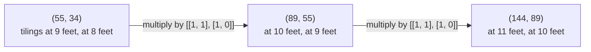
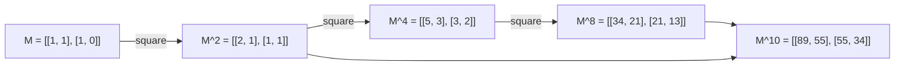

# A recurrence is a matrix: stack the last two terms, multiply by a fixed matrix, and matrix powers jump far ahead

[Syllabus](../../../SYLLABUS.md) → [Combinatorics and graphs](../README.md) → [Recurrences](../README.md#s05) → A recurrence is a matrix

---

## General Overview

A hallway is two feet wide and ten feet long. Tiles one foot by two feet cover it, standing upright across the width or lying flat along the length. Count the different finished floors: there are 89.

That 89 comes from a step rule. The leftmost foot takes either one upright tile, leaving nine feet, or two flat tiles stacked, leaving eight — so the ten-foot count is the nine-foot count plus the eight-foot count ([Recurrences](01-recurrences-and-fibonacci.md)). Nine additions carry 1, 1 up to 89.

Nine additions is nothing. A million is a nuisance, and the rule insists on visiting every foot. Hold both counts as a stacked pair instead. One step is then one multiplication by a fixed block of four numbers — a matrix — and ten steps are ten of those. A matrix power is reached by doubling rather than stepping ([Powers on the clock](../../02-Number%20theory/04-Powers%20on%20the%20Clock/01-modular-exponentiation.md)), so the millionth term costs 25 multiplications.

**Stack the terms a two-step rule remembers into a column: one step is multiplication by a fixed 2 × 2 matrix, n steps is that matrix to the n-th power, and powers are reached by squaring.**

**What kind of fact this is:** a method, resting on an identity proved on this card in Why it works.

### The picture: the stack moving one foot at a time



The same four numbers act at every foot, which is why steps collect into a power.

---

## The formula

Write $T(n)$ for the tilings of an n-foot hallway. A **stack** is a column of two numbers, newer on top; $v_n$ holds $T(n)$ over $T(n-1)$. A matrix in prose is written by rows in brackets: `[[1, 1], [1, 0]]` has top row 1, 1 and bottom row 1, 0 ([Matrix multiplication](../../03-Algebra/04-Matrices/03-matrix-multiplication.md)).

$$v_{n+1} = M v_n, \qquad M = \begin{pmatrix} 1 & 1 \\ 1 & 0 \end{pmatrix}$$

**Read it aloud:** the new top is the old top plus the old bottom; the new bottom is the old top slid down.

That matrix is the **companion matrix** of the rule, the term used from here on: top row the coefficients, bottom row nothing but memory. One power spells out three counts.

$$M^n = \begin{pmatrix} T(n) & T(n-1) \\ T(n-1) & T(n-2) \end{pmatrix} \qquad (n \ge 2)$$

At $n = 10$: 89, 55, 55 and 34, the ten-, nine- and eight-foot counts.

| Symbol | Plain meaning | In our example | Push it up and the answer… |
| --- | --- | --- | --- |
| $T(n)$ | tilings of an n-foot hallway | $T(10) = 89$ | a foot more, about 1.618 times as many |
| $v_n$ | the stack, $T(n)$ over $T(n-1)$ | (89, 55) | — |
| $M$ | the companion matrix | `[[1, 1], [1, 0]]` | another entry, another rule |
| $M^n$ | n copies of $M$ multiplied | `[[89, 55], [55, 34]]` | entries grow by the same 1.618 |
| $n$ | the length in feet, a whole number | 10 | more steps, bigger entries |
| $\lambda$ | an eigenvalue: a stretch along a direction $M$ does not turn | 1.618033988750 and −0.618033988750 | — |

### When it holds

- **Fixed coefficients.** The top row is the same at every foot. Multipliers drifting with n need a fresh matrix each step.
- **Depth fixes the size.** Two remembered terms, 2 × 2; three, 3 × 3.
- **Nothing added on the side.** A driving term needs its own extra row ([Recurrences with a driving term](05-nonhomogeneous-recurrences.md)).
- **Exact in whole numbers.** Integers in, integers out; the eigenvalue route brings in the square root of 5 and with it rounding ([The characteristic equation](04-characteristic-equation-and-binet.md)).

---

## Why it works

### Step 0: the rule needs two numbers, so move two numbers

A rule looking back two terms cannot be driven by one number: 89 alone does not say what comes next. Two do. Make the pair the thing that moves, and every step takes a pair to a pair by fixed multiples. A table of fixed multiples is a matrix.

### Step 1: read the matrix off the rule

The new top is $T(n) + T(n-1)$: one old top, one old bottom, so the top row is 1, 1. The new bottom is $T(n)$: one old top, none of the bottom, so the bottom row is 1, 0. That row adds nothing — it slides the old top down so the pair still holds the last two counts. On the stack (55, 34): top 89, bottom 55.

### Step 2: n steps is the n-th power

One step is $v_{n+1} = M v_n$. Two steps is $M(M v_n)$, which regroups to $(MM) v_n = M^2 v_n$, since matrix multiplication rebrackets freely. Repeating that collects any number of steps into one power.

<details>
<summary>Detailed proof: why the entries of $M^n$ are tiling counts</summary>

**Base.** $M^2 = MM$ has top-left 1×1 + 1×1 = 2, top-right 1×1 + 1×0 = 1, bottom-left 1, bottom-right 1 — that is $T(2)$, $T(1)$, $T(1)$, $T(0)$, the zero-foot count being 1: laying no tile.

**Step.** Suppose $M^k$ = `[[T(k), T(k−1)], [T(k−1), T(k−2)]]`. The top row of $M$ is 1, 1, so in $M M^k$ it adds the rows below: T(k) + T(k−1) = T(k+1), then T(k−1) + T(k−2) = T(k). The bottom row, 1, 0, copies $M^k$'s top row. The product is `[[T(k+1), T(k)], [T(k), T(k−1)]]` — the claim one foot on, so it holds at every length, and it is symmetric, which is why one power reports three counts, not four.

</details>


### Step 3: doubling instead of stepping

Ten copies of $M$ need not go in one at a time. Square $M$ for $M^2$, square that for $M^4$, square again for $M^8$, then multiply $M^8$ by $M^2$, since ten is eight plus two. Four multiplications against nine additions is no gain. At a million it is the whole point: 25 multiplications against 999,999 additions.



Every entry from $M^2$ on is itself a tiling count.

### Step 4: the eigenvalues are the characteristic roots

An **eigenvalue** is the stretch along a direction a matrix does not turn ([Eigenvalues and eigenvectors](../../03-Algebra/07-Eigenvalues%20and%20Symmetric%20Matrices/02-eigenvalues-and-eigenvectors.md)). For $M$ they solve $\lambda^2 - \lambda - 1 = 0$: the rule's own characteristic equation, with $T(n)$ replaced by $\lambda^n$ ([The characteristic equation](04-characteristic-equation-and-binet.md)). The roots are 1.618033988750 and −0.618033988750; squaring either and subtracting itself returns 1.000000000000, as that equation demands. Two cross-checks come free: the diagonal entries add to 1 — that sum is the **trace** — and so do the roots; the determinant, 1×0 − 1×1, is −1, which is also the two roots multiplied.

Closed form and matrix are one object seen twice: split a stack along the two unturned directions and $M^n$ becomes n-th powers of the roots — Binet's formula, by diagonalisation ([Diagonalisation](../../03-Algebra/07-Eigenvalues%20and%20Symmetric%20Matrices/03-diagonalisation-and-matrix-powers.md)). The hallway counts run one ahead of the Fibonacci numbers, so ten feet is the eleventh of those. Both roots to the eleventh, the second subtracted from the first, over the square root of 5: 89.000000000.

<details>
<summary>A free identity from the determinant</summary>

Determinants multiply, so the determinant of $M^n$ is (−1) taken n times. Read it off the ten-foot entries: 89 × 34 − 55 × 55 = 1, and (−1) ten times over is 1 — Cassini's identity, in one line, because the matrix carried it.

</details>

---

## Worked numbers, by hand

| Step | Arithmetic | Value |
| --- | --- | --- |
| the stack at nine feet | 55 on top, 34 below | (55, 34) |
| one multiply by $M$ | top 55 + 34, bottom 55 | **(89, 55)** |
| square $M$, then again, then again | $M$, $M^2$, $M^4$ each against itself | `[[2, 1], [1, 1]]`, `[[5, 3], [3, 2]]`, `[[34, 21], [21, 13]]` |
| finish the exponent | $M^8$ against $M^2$ | **`[[89, 55], [55, 34]]`** |
| what it cost | three squarings, one multiply | **4 matrix multiplications** |
| the same by stepping | 1, 1 added up to ten feet | 89, in 9 additions |

One power gives 89 floors for ten feet, 55 for nine and 34 for eight, without visiting the seventh.

### What breaks if you drop a piece

| Mistake | Comes out at | What went wrong |
| --- | --- | --- |
| The matrix written `[[1, 1], [0, 1]]` | `[[1, 10], [0, 1]]`, top-left 1 | The bottom row must slide the top down |
| Each entry raised to the tenth alone | `[[1, 1], [1, 0]]`, top-left 1 | Entrywise powers are not matrix powers |
| The stack (1, 1) carried through $M^{10}$ | 144 | It stands at one foot, so ten steps land at eleven |

The code prints all three.

---

## Code, from first principles, and it actually runs

Nothing is imported. Four roads share no arithmetic: slabs laid on a real grid and counted, the rule walked foot by foot, the matrix raised by squaring, and the eigenvalues from a square root the script writes itself. The millionth term is done twice, wrapped at 1,000,000,007.

### Python

```python
# A recurrence is a matrix -- the check behind the card.  Nothing is imported.
# A hallway 2 feet wide and n feet long is tiled with 1 x 2 tiles: T(n) ways.
# Four roads to the count: laying real tiles, stepping the rule, powers of the
# companion matrix M = [[1, 1], [1, 0]], and Binet from M's two eigenvalues.
N, MOD, FAR, M = 10, 1000000007, 1000000, [[1, 1], [1, 0]]

def tilings(n, used=0):                     # road one: lay real tiles, no formula
    if used == (1 << 2 * n) - 1: return 1
    k = 0
    while used >> k & 1: k += 1             # first empty cell, numbered row + 2 x column
    v = tilings(n, used | 3 << k) if k % 2 == 0 and not used >> (k + 1) & 1 else 0
    return v + (tilings(n, used | 5 << k) if k // 2 + 1 < n and not used >> (k + 2) & 1 else 0)

def mul(a, b, m=0):                         # 2 x 2 matrix product, wrapped if m > 0
    out = [[a[i][0] * b[0][j] + a[i][1] * b[1][j] for j in range(2)] for i in range(2)]
    return [[v % m for v in row] for row in out] if m else out

def power(a, n, m=0):                       # road two: square and multiply
    out, mults = [[1, 0], [0, 1]], -1       # the opening multiply by the identity is free
    while n:
        if n & 1: out, mults = mul(out, a, m), mults + 1
        n >>= 1
        if n: a, mults = mul(a, a, m), mults + 1
    return out, max(mults, 0)

def step(n, m=0):                           # road three: one foot at a time
    a, b, adds = 1, 1, 0                    # T(0) = 1 empty hallway, T(1) = 1
    for _ in range(n - 1): a, b, adds = b, (a + b) % m if m else a + b, adds + 1
    return b, adds

brute, (p10, mults), (stepped, adds) = tilings(N), power(M, N), step(N)
r5 = 2.0
for _ in range(40): r5 = (r5 + 5.0 / r5) / 2            # our own square root of 5, by Newton
phi, psi, fp, fq = (1 + r5) / 2, (1 - r5) / 2, 1.0, 1.0
for _ in range(N + 1): fp, fq = fp * phi, fq * psi      # the two roots to the 11th, by hand
binet = (fp - fq) / r5
det_m = M[0][0] * M[1][1] - M[0][1] * M[1][0]; det_pow = det_m ** N
cassini = p10[0][0] * p10[1][1] - p10[0][1] * p10[1][0]
(far_pow, far_mults), (far_step, far_adds) = power(M, FAR, MOD), step(FAR, MOD)
wrong, entry = power([[1, 1], [0, 1]], N)[0], [[v ** N for v in row] for row in M]
print(f"hallway 2 feet wide, {N} feet long, tiles 1 x 2: {brute} tilings, laid one by one")
print("the ladder: " + ", ".join(f"M^{e} = {power(M, e)[0]}" for e in (1, 2, 4, 8)))
print(f"M^{N} = " + " x ".join(f"M^{1 << i}" for i in reversed(range(N.bit_length())) if N >> i & 1)
      + f" = {p10}, reached in {mults} matrix multiplications")
print(f"the stacks: ({p10[0][1]}, {p10[1][1]}) -> ({p10[0][0]}, {p10[0][1]}) -> ({p10[0][0] + p10[0][1]}, {p10[0][0]})")
print(f"stepping the rule one foot at a time: {stepped} at {N} feet, in {adds} additions")
print(f"trace {M[0][0] + M[1][1]}, determinant {det_m}; eigenvalues {phi:.12f} and {psi:.12f}")
print(f"each eigenvalue squared, minus itself: {phi * phi - phi:.12f} and {psi * psi - psi:.12f}")
print(f"Binet from those roots at {N + 1}: {binet:.9f}, rounding to {round(binet)}")
print(f"Cassini: {p10[0][0]} x {p10[1][1]} - {p10[0][1]} x {p10[1][0]} = {cassini}, and ({det_m})^{N} = {det_pow}")
print(f"term {FAR} wrapped at {MOD}, by squaring: {far_pow[0][0]}, in {far_mults} matrix multiplications")
print(f"the same term, by {far_adds} additions: {far_step}")
print(f"mistake 1, the matrix written [[1, 1], [0, 1]]: {wrong}, top-left {wrong[0][0]}, not {brute}")
print(f"mistake 2, each entry raised to the {N}th on its own: {entry}, top-left {entry[0][0]}; "
      f"mistake 3, the stack (1, 1) carried through M^{N}: {p10[0][0] + p10[0][1]}, one foot too far")
assert brute == p10[0][0] == stepped == round(binet)      # four roads, one count
assert cassini == det_pow and far_pow[0][0] == far_step and far_mults == FAR.bit_count() + FAR.bit_length() - 2 < far_adds
assert abs(phi + psi - (M[0][0] + M[1][1])) < 1e-12 and abs(phi * psi - det_m) < 1e-12
assert mults == N.bit_count() + N.bit_length() - 2 < adds and abs(phi * phi - phi - 1) < 1e-12
print("ALL CHECKS PASS")
```

**Ran 2026-09-14 on macOS, Python 3.14.6, standard library only. All checks passed. Output, pasted from the run:**

```
hallway 2 feet wide, 10 feet long, tiles 1 x 2: 89 tilings, laid one by one
the ladder: M^1 = [[1, 1], [1, 0]], M^2 = [[2, 1], [1, 1]], M^4 = [[5, 3], [3, 2]], M^8 = [[34, 21], [21, 13]]
M^10 = M^8 x M^2 = [[89, 55], [55, 34]], reached in 4 matrix multiplications
the stacks: (55, 34) -> (89, 55) -> (144, 89)
stepping the rule one foot at a time: 89 at 10 feet, in 9 additions
trace 1, determinant -1; eigenvalues 1.618033988750 and -0.618033988750
each eigenvalue squared, minus itself: 1.000000000000 and 1.000000000000
Binet from those roots at 11: 89.000000000, rounding to 89
Cassini: 89 x 34 - 55 x 55 = 1, and (-1)^10 = 1
term 1000000 wrapped at 1000000007, by squaring: 534400663, in 25 matrix multiplications
the same term, by 999999 additions: 534400663
mistake 1, the matrix written [[1, 1], [0, 1]]: [[1, 10], [0, 1]], top-left 1, not 89
mistake 2, each entry raised to the 10th on its own: [[1, 1], [1, 0]], top-left 1; mistake 3, the stack (1, 1) carried through M^10: 144, one foot too far
ALL CHECKS PASS
```

### Rust

Same numbers, same labels, built with `rustc --edition 2021 -O`.

```rust
// A recurrence is a matrix -- the same check as the Python, in Rust.  No crates.
// A hallway 2 feet wide and n feet long is tiled with 1 x 2 tiles: T(n) ways.
// Four roads to the count: laying real tiles, stepping the rule, powers of the
// companion matrix M = [[1, 1], [1, 0]], and Binet from M's two eigenvalues.
const N: u32 = 10;
const MOD: i64 = 1000000007;
const FAR: u32 = 1000000;
type Mat = [[i64; 2]; 2];

fn tilings(n: u32, used: u32) -> i64 {          // road one: lay real tiles, no formula
    if used == (1u32 << (2 * n)) - 1 { return 1 }
    let mut k = 0;
    while used >> k & 1 == 1 { k += 1 }         // first empty cell, numbered row + 2 x column
    let v = if k % 2 == 0 && used >> (k + 1) & 1 == 0 { tilings(n, used | 3 << k) } else { 0 };
    v + if k / 2 + 1 < n && used >> (k + 2) & 1 == 0 { tilings(n, used | 5 << k) } else { 0 }
}

fn mul(a: Mat, b: Mat, m: i64) -> Mat {         // 2 x 2 matrix product, wrapped if m > 0
    let mut o = [[0i64; 2]; 2];
    for i in 0..2 { for j in 0..2 { o[i][j] = a[i][0] * b[0][j] + a[i][1] * b[1][j];
                                    if m > 0 { o[i][j] %= m } } }
    o
}

fn power(a: Mat, n: u32, m: i64) -> (Mat, i64) {        // road two: square and multiply
    let (mut a, mut n) = (a, n);
    let (mut out, mut mults) = ([[1i64, 0], [0, 1]], -1i64);  // opening identity multiply is free
    while n > 0 {
        if n & 1 == 1 { out = mul(out, a, m); mults += 1 }
        n >>= 1;
        if n > 0 { a = mul(a, a, m); mults += 1 }
    }
    (out, if mults > 0 { mults } else { 0 })
}

fn step(n: u32, m: i64) -> (i64, u32) {         // road three: one foot at a time
    let (mut a, mut b, mut adds) = (1i64, 1i64, 0u32);        // T(0) = 1 empty hallway, T(1) = 1
    for _ in 0..n - 1 { let s = if m > 0 { (a + b) % m } else { a + b }; a = b; b = s; adds += 1 }
    (b, adds)
}

fn main() {
    let m0: Mat = [[1, 1], [1, 0]];
    let (brute, (p10, mults), (stepped, adds)) = (tilings(N, 0), power(m0, N, 0), step(N, 0));
    let mut r5 = 2.0f64;
    for _ in 0..40 { r5 = (r5 + 5.0 / r5) / 2.0 }            // our own square root of 5, by Newton
    let (phi, psi) = ((1.0 + r5) / 2.0, (1.0 - r5) / 2.0);
    let (mut fp, mut fq) = (1.0f64, 1.0f64);
    for _ in 0..N + 1 { fp *= phi; fq *= psi }               // the two roots to the 11th, by hand
    let binet = (fp - fq) / r5;
    let det_m = m0[0][0] * m0[1][1] - m0[0][1] * m0[1][0];
    let det_pow = det_m.pow(N);
    let cassini = p10[0][0] * p10[1][1] - p10[0][1] * p10[1][0];
    let ((far_pow, far_mults), (far_step, far_adds)) = (power(m0, FAR, MOD), step(FAR, MOD));
    let wrong = power([[1, 1], [0, 1]], N, 0).0;
    let entry: Mat = [[m0[0][0].pow(N), m0[0][1].pow(N)], [m0[1][0].pow(N), m0[1][1].pow(N)]];
    let ladder: Vec<String> = [1u32, 2, 4, 8].iter().map(|&e| format!("M^{} = {:?}", e, power(m0, e, 0).0)).collect();
    println!("hallway 2 feet wide, {} feet long, tiles 1 x 2: {} tilings, laid one by one", N, brute);
    println!("the ladder: {}", ladder.join(", "));
    let split: Vec<String> = (0..32).rev().filter(|&i| N >> i & 1 == 1).map(|i| format!("M^{}", 1u32 << i)).collect();
    println!("M^{} = {} = {:?}, reached in {} matrix multiplications", N, split.join(" x "), p10, mults);
    println!("the stacks: ({}, {}) -> ({}, {}) -> ({}, {})",
             p10[0][1], p10[1][1], p10[0][0], p10[0][1], p10[0][0] + p10[0][1], p10[0][0]);
    println!("stepping the rule one foot at a time: {} at {} feet, in {} additions", stepped, N, adds);
    println!("trace {}, determinant {}; eigenvalues {:.12} and {:.12}", m0[0][0] + m0[1][1], det_m, phi, psi);
    println!("each eigenvalue squared, minus itself: {:.12} and {:.12}", phi * phi - phi, psi * psi - psi);
    println!("Binet from those roots at {}: {:.9}, rounding to {}", N + 1, binet, binet.round() as i64);
    println!("Cassini: {} x {} - {} x {} = {}, and ({})^{} = {}",
             p10[0][0], p10[1][1], p10[0][1], p10[1][0], cassini, det_m, N, det_pow);
    println!("term {} wrapped at {}, by squaring: {}, in {} matrix multiplications", FAR, MOD, far_pow[0][0], far_mults);
    println!("the same term, by {} additions: {}", far_adds, far_step);
    println!("mistake 1, the matrix written [[1, 1], [0, 1]]: {:?}, top-left {}, not {}", wrong, wrong[0][0], brute);
    println!("mistake 2, each entry raised to the {}th on its own: {:?}, top-left {}; mistake 3, the stack (1, 1) carried through M^{}: {}, one foot too far",
             N, entry, entry[0][0], N, p10[0][0] + p10[0][1]);
    assert!(brute == p10[0][0] && p10[0][0] == stepped && stepped == binet.round() as i64);
    assert!(cassini == det_pow && far_pow[0][0] == far_step && far_mults == (FAR.count_ones() + FAR.ilog2() - 1) as i64 && far_mults < far_adds as i64);
    assert!((phi + psi - (m0[0][0] + m0[1][1]) as f64).abs() < 1e-12 && (phi * psi - det_m as f64).abs() < 1e-12);
    assert!(mults == (N.count_ones() + N.ilog2() - 1) as i64 && mults < adds as i64 && (phi * phi - phi - 1.0).abs() < 1e-12);
    println!("ALL CHECKS PASS");
}
```

**Ran 2026-09-14 on macOS, rustc 1.98.1, no crates. All checks passed. Output, pasted from the run:**

```
hallway 2 feet wide, 10 feet long, tiles 1 x 2: 89 tilings, laid one by one
the ladder: M^1 = [[1, 1], [1, 0]], M^2 = [[2, 1], [1, 1]], M^4 = [[5, 3], [3, 2]], M^8 = [[34, 21], [21, 13]]
M^10 = M^8 x M^2 = [[89, 55], [55, 34]], reached in 4 matrix multiplications
the stacks: (55, 34) -> (89, 55) -> (144, 89)
stepping the rule one foot at a time: 89 at 10 feet, in 9 additions
trace 1, determinant -1; eigenvalues 1.618033988750 and -0.618033988750
each eigenvalue squared, minus itself: 1.000000000000 and 1.000000000000
Binet from those roots at 11: 89.000000000, rounding to 89
Cassini: 89 x 34 - 55 x 55 = 1, and (-1)^10 = 1
term 1000000 wrapped at 1000000007, by squaring: 534400663, in 25 matrix multiplications
the same term, by 999999 additions: 534400663
mistake 1, the matrix written [[1, 1], [0, 1]]: [[1, 10], [0, 1]], top-left 1, not 89
mistake 2, each entry raised to the 10th on its own: [[1, 1], [1, 0]], top-left 1; mistake 3, the stack (1, 1) carried through M^10: 144, one foot too far
ALL CHECKS PASS
```

The two outputs match line for line.

> [!TIP]
> **Try changing**
> Guess first, then run it.
> - **A twelve-foot hallway.** Set `N` to `12`: 233 tilings, still four matrix multiplications since 12 is 8 + 4, and every assert still passes — nothing is pinned to 89.
> - **Break the remembering row.** Set `M` to `[[1, 1], [0, 1]]`: the tenth power reads `[[1, 10], [0, 1]]`, top-left 1 where the tiles give 89, and the first assert stops the program.
> - **Shrink the modulus.** Set `MOD` to `1000`: the far term drops to three digits, and the two roads still agree.

---

## The usual mistake

> [!warning]
> **Raising each entry to the power on its own.** Ten copies of `[[1, 1], [1, 0]]` multiplied as matrices give `[[89, 55], [55, 34]]`. Taking the four entries to the tenth power separately gives `[[1, 1], [1, 0]]` straight back, reading the ten-foot count as 1: in a matrix power every entry mixes a whole row with a column.
>
> - **Dropping the remembering row.** Written `[[1, 1], [0, 1]]`, the matrix loses the slide that keeps the older count: the tenth power is `[[1, 10], [0, 1]]`, the answer 1.
> - **Off by one in the exponent.** The stack (1, 1) already stands at one foot, so ten more multiplications report 144, the eleven-foot count.
> - **Expecting a ladder where the coefficients move.** Multipliers changing with position give a different matrix each step, and that product is no power.

---

## Where you meet it in real life

- **Fast exact far terms.** Software returning the millionth term of a two-step rule without a million additions is squaring a companion matrix, entries wrapped at a modulus.
- **Population models.** Counts split by age class move by a fixed matrix each season; one power projects decades, and the largest eigenvalue gives the long-run growth.
- **Root finding.** Numerical libraries turn a polynomial into its companion matrix and take its roots as eigenvalues — Step 4 backwards.

> **Say it back**
> A rule looking back two terms needs two numbers to move, so carry both as a stacked pair. One step is then multiplication by one fixed 2 × 2 matrix: top row the coefficients, bottom row sliding the old top down. Matrix multiplication rebrackets freely, so n steps is that matrix to the n-th power, its four entries three consecutive counts, and squaring reaches a term a million out in 25 multiplications. Its eigenvalues are the roots of the characteristic equation, which is why matrix and closed form never disagree.

---

## What this builds on

- [The characteristic equation](04-characteristic-equation-and-binet.md): the equation $\lambda^2 - \lambda - 1 = 0$, whose roots return here as eigenvalues.
- [Matrix multiplication](../../03-Algebra/04-Matrices/03-matrix-multiplication.md): rows against columns, and the rebracketing behind the power.
- [Eigenvalues and eigenvectors](../../03-Algebra/07-Eigenvalues%20and%20Symmetric%20Matrices/02-eigenvalues-and-eigenvectors.md): what a stretch factor is, and how trace and determinant pin it down.
- [Diagonalisation](../../03-Algebra/07-Eigenvalues%20and%20Symmetric%20Matrices/03-diagonalisation-and-matrix-powers.md): from a matrix power to powers of eigenvalues.
- [Powers on the clock](../../02-Number%20theory/04-Powers%20on%20the%20Clock/01-modular-exponentiation.md): repeated squaring, and why a modulus keeps entries small.

## Where this goes next

The companion matrix is a tool the shelf hands over; the shelf's last card is [Divide-and-conquer recurrences](07-divide-and-conquer-recurrences.md).

The ladder needs a rule stepping back a fixed distance with fixed multipliers; what to do when a rule halves its input at every stage is the question that card answers.

---

## Sources

Verified 14 Sep 2026: every link below resolves to the publisher's page.

- Graham, Ronald L., Donald E. Knuth, and Oren Patashnik. *Concrete Mathematics*, 2nd ed. Addison-Wesley, 1994. [Publisher page](https://www.informit.com/store/concrete-mathematics-a-foundation-for-computer-science-9780201558029). Chapters 1 and 6: two-term rules, the tiling count, the identities.
- Horn, Roger A., and Charles R. Johnson. *Matrix Analysis*, 2nd ed. Cambridge University Press, 2012. [doi:10.1017/CBO9781139020411](https://doi.org/10.1017/CBO9781139020411). Defines a polynomial's companion matrix and proves its characteristic polynomial is that polynomial.
- Knuth, Donald E. *The Art of Computer Programming, Volume 2*, 3rd ed. Addison-Wesley, 1997. [Publisher page](https://www.informit.com/store/art-of-computer-programming-volume-2-seminumerical-9780201896848). Section 4.6.3, "Evaluation of Powers": the ladder and its cost.
- "A000045: Fibonacci numbers." The On-Line Encyclopedia of Integer Sequences, OEIS Foundation. [Sequence entry](https://oeis.org/A000045). The sequence, with Cassini's identity and sources.
