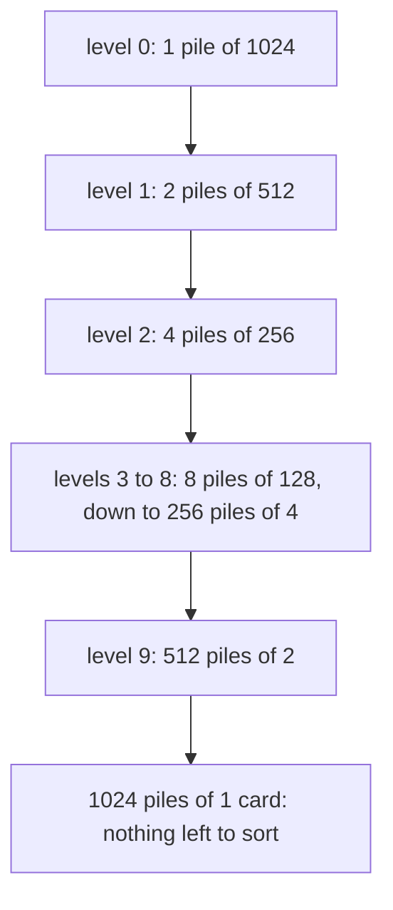

# Divide-and-conquer recurrences: split the job in half, and the master theorem reads off the total work

Combinatorics and graphs → Recurrences → Splitting the job → Divide-and-conquer recurrences

---

## General Overview

A shuffled deck of 1,024 cards has to come out in order. Deal it into two piles of 512. Put each pile in order the same way. Then merge them: repeatedly take whichever of the two top cards is lower.

Merging two piles holding 1,024 cards between them costs at most 1,024 comparisons: each comparison places one card. Ten halvings take 1,024 down to 1, so ten rounds and at most 10,240 comparisons. One real shuffled deck, sorted by the code below, took 8,946.

Finding a named card in the sorted deck is the same trick with one pile. Look at the middle card, throw away the half that cannot hold it, repeat. Ten halvings, ten looks.

Both are rules that mention themselves. Write T(n) for the cost on n cards. Merging obeys T(n) = 2 T(n/2) + n: two half-sized jobs, plus n comparisons to join them. Searching obeys T(n) = T(n/2) + 1. A rule of that shape is a **divide-and-conquer recurrence**, the name used from here on.

The master theorem reads the total off that shape, without unrolling anything: it asks only whether the work sits at the top of the splitting, at the bottom, or evenly down it.

**Add the work up one level of splitting at a time; whichever end holds most of it fixes the total, and the theorem's three cases are the three answers.**

**What kind of fact this is:** a theorem, proved on this card in Why it works for sizes that are exact powers of the split.

### The picture: ten levels, each holding all 1,024 cards



However finely the cards are cut up, a level still holds all 1,024.

---

## The formula

Three quantities, in words first. How many smaller jobs one call makes: two piles here. How much smaller each is: half, a shrink factor of 2. What the call costs on top of its children: n comparisons per merge. Call them $a$, $b$ and $f$.

$$T(n) = a\,T(n/b) + f(n)$$

**Read it aloud:** the cost on n items is the cost of a smaller copies of size n divided by b, plus the splitting and joining here.

Splitting stops after $k$ levels, $k$ being the number of divisions by b needed to reach 1 — the logarithm of n to base b ([logarithms](../../01-Foundations/03-Powers%2C%20Roots%20and%20Logarithms/05-logarithms.md)). By then the job is in $a^k$ pieces, which a log law rewrites as a power of n ([log-laws-and-log-scales](../../01-Foundations/03-Powers%2C%20Roots%20and%20Logarithms/06-log-laws-and-log-scales.md)):

$$a^{\log_b n} = n^{\log_b a}$$

That power counts the pieces at the bottom; $f(n)$ is the cost at the top. Write $f(n) = n^d$, so $d$ says how steeply joining costs grow: 1 merging, 0 looking. The theorem compares $d$ with $\log_b a$, nothing else.

| Comparison | Work sits | T(n) grows like |
| --- | --- | --- |
| $d < \log_b a$ | bottom | $n^{\log_b a}$ |
| $d = \log_b a$ | evenly | $n^{d}\log_b n$ |
| $d > \log_b a$ | top | $n^{d}$ |

| Symbol | Plain meaning | In our example | Push it up and the answer… |
| --- | --- | --- | --- |
| $T$ | cost of the job | 10,240 | — |
| $n$ | items to start | 1,024 cards | all cases rise |
| $a$ | jobs per call | 2 piles | bottom swells |
| $b$ | how much smaller each is | 2 | fewer levels |
| $f$ | joining cost per call | n per merge | top swells |
| $d$ | the power in $f(n) = n^d$ | 1 merging, 0 looking | top takes over |
| $k$ | levels, $\log_b n$ | 10 | one level more, twice the deck |
| $\log_b a$ | the watershed power | 1; 1.584963 on three pieces | bottom takes over |
| $r$ | level multiplier, $a/b^d$ | 1 merging, 3/2 on three | levels grow downwards |

### When it holds

- **n is an exact power of b**, so every piece is whole — the case proved below. Other sizes give pieces differing by one, and the same answers hold with rounding.
- **a and b are fixed.** If the number of pieces changes with n, there is no single a, and the count $a^k$ is wrong.
- **f is a power of n.** A joining cost between two powers — n times $\log_2 n$, where the watershed power is 1 — is in no case at all.
- **The answer is a growth class.** Fixed multiples and extras are dropped: ten halvings plus a last look at the survivor still counts as ten.

---

## Why it works

### Step 0: a rule that mentions itself draws a tree, and trees add up by levels

The splitting draws a tree: the deck at the top, single cards at the bottom. Branch by branch that is 1,024 paths; level by level, ten sums.

### Step 1: count the pieces and their sizes

Level 0 is one job of 1,024 cards, level 1 is 2 jobs of 512, level 2 is 4 of 256. Level j — the j-th row down, the top being row 0 — holds $a^j$ jobs of size $n/b^j$.

### Step 2: cost one level, and meet the number that decides everything

Level j costs $a^j$ copies of the joining cost on a piece of size $n/b^j$. With $f(n) = n^d$:

$$a^j\left(\frac{n}{b^j}\right)^d = n^d\left(\frac{a}{b^d}\right)^j$$

So each level costs $r = a/b^d$ times the one above, the same multiplier all the way down. Everything turns on a against $b^d$. Merging: both are 2, so every level costs 1,024. Three half-sized pieces: 3 against 2, each level half again as much as the last.

One █ is 1,000 comparisons, nearest thousand, for T(n) = 3 T(n/2) + n on 1,024 cards:

```
level 0  █                                         1,024
level 1  ██                                        1,536
level 2  ██                                        2,304
level 3  ███                                       3,456
level 4  █████                                     5,184
level 5  ████████                                  7,776
level 6  ████████████                             11,664
level 7  █████████████████                        17,496
level 8  ██████████████████████████               26,244
level 9  ███████████████████████████████████████  39,366
```

The bottom level alone does a third of the tree's work.

### Step 3: add the levels, which is a geometric sum

Level costs that are each a fixed multiple of the one before make a geometric sum, which collapses by telescoping ([finite-differences-and-telescoping-sums](02-finite-differences-and-telescoping-sums.md)). Multiplier 1: flat levels, total one level times the level count. Above 1: the last term swamps the rest, so the bottom is the answer. Below 1: the sum never passes a fixed multiple of its first term, so the top is. Three cases, and nothing else.

<details>
<summary>Detailed proof: the exact-power case</summary>

Take $n = b^k$ and $T(1) = 0$: one card needs no work. Unroll k times and apply Step 2 to each term, with r the level multiplier $a/b^d$:

$$T(n) = f(n) + a\,f(n/b) + \dots + a^{k-1} f(n/b^{k-1}) = n^d\left(1 + r + \dots + r^{k-1}\right)$$

Multiply the bracket by $r - 1$ and all cancels but two terms, so the bracket is $(r^k - 1)/(r - 1)$ when $r \ne 1$, and k when $r = 1$.

**r = 1**, that is $d = \log_b a$: the bracket is k, and $T(n) = n^d \log_b n$.

**r < 1**, that is $d > \log_b a$: the bracket is $(1 - r^k)/(1 - r)$, between 1 and $1/(1-r)$ for every k, since $r^k$ is between 0 and 1. So $T(n)$ is between $n^d$ and a multiple of $n^d$.

**r > 1**, that is $d < \log_b a$: the bracket is between $r^{k-1}$ and $r^k/(r-1)$, and $n^d r^k = n^d a^k/b^{dk} = a^k$, since $b^k = n$ makes $b^{dk} = n^d$. So $T(n)$ is between two multiples of $a^k$, which is $n^{\log_b a}$. ∎

</details>

### Step 4: three cases, one deck

| Rule on 1,024 cards | Level 0 | Level 9 | Total |
| --- | --- | --- | --- |
| T(n) = 2 T(n/2) + n | 1,024 | 1,024 | **10,240** |
| T(n) = 3 T(n/2) + n | 1,024 | 39,366 | **116,050** |
| T(n) = 2 T(n/2) + n^2 | 1,048,576 | 2,048 | **2,095,104** |

Flat, growing, shrinking: one deck, totals two hundred times apart. A second route reaches the same place — substituting $n = b^m$ turns a halving rule into one stepping down by one, which first-order methods solve outright ([first-order-recurrences-and-loans](03-first-order-recurrences-and-loans.md)), driving terms and all ([nonhomogeneous-recurrences](05-nonhomogeneous-recurrences.md)).

---

## Worked numbers, by hand

| Step | Arithmetic | Value |
| --- | --- | --- |
| one level of merging | $2^j$ piles × $1024/2^j$ cards | 1,024 |
| the ceiling | 10 × 1,024 | **10,240** |
| the deck merged | comparisons counted | **8,946** |
| the deck searched | one look × 10 levels | **10** |
| three pieces, not two | 2 × (3^10 − 2^10) | **116,050** |
| a quadratic join | 2 × 1,024 × 1,023 | **2,095,104** |

Ten thousand comparisons order 1,024 cards, and the 8,946 actually made sit under that ceiling, which is all a growth class promises.

### What breaks if you drop a piece

| Mistake | Comes out at | What went wrong |
| --- | --- | --- |
| Joining cost quoted as the answer | 1,024 | The top merge; nine levels unpaid |
| Every halving rule read as n log n | 10,240 for three pieces | With a = 3, levels grow: 116,050 |
| Bottom level times the level count | 590,490 | Only flat levels multiply: 116,050 |

The code prints all three.

---

## Code, from first principles, and it actually runs

Nothing is imported but a logarithm, for printing. Each rule is totalled twice by roads sharing no arithmetic: level by level from the piece counts and sizes, and by the closed form the proof gives. The deck is then actually sorted and searched, on a shuffle written out here so both languages deal the same cards. Each case is decided twice too: a against $b^d$, and the total against ten equal levels.

### Python

```python
# Divide-and-conquer recurrences -- the check behind the card.  A deck of 1,024
# cards is sorted by merging halves and searched by halving.  Each recurrence
# T(n) = a T(n/b) + f(n) is totalled twice: level by level, and by the closed
# form the proof gives.  The shuffle uses a generator written out here.
from math import log2                       # used for printing log_b a only
N, K = 1024, 10                             # 1024 cards, 10 halvings down to one
SHAPES = [(2, 1, "a=2 b=2 f(n)=n  "), (1, 0, "a=1 b=2 f(n)=1  "),
          (3, 1, "a=3 b=2 f(n)=n  "), (2, 2, "a=2 b=2 f(n)=n^2")]
def levels(a, d):                           # a^j jobs of size N/2^j, each costing size^d
    return [a ** j * (N // 2 ** j) ** d for j in range(K)]
def shuffled():                             # written out, so both languages agree
    deck, x = list(range(1, N + 1)), 20260914
    for i in range(N - 1, 0, -1):
        x = (1103515245 * x + 12345) % 2 ** 31
        j = x % (i + 1)
        deck[i], deck[j] = deck[j], deck[i]
    return deck
def merge_sort(cards, tally):               # road two: the comparisons actually made
    if len(cards) < 2: return cards
    h = len(cards) // 2
    a, b = merge_sort(cards[:h], tally), merge_sort(cards[h:], tally)
    out, i, j = [], 0, 0
    while i < len(a) and j < len(b):
        tally[0] += 1
        if a[i] <= b[j]: out.append(a[i]); i += 1
        else: out.append(b[j]); j += 1
    return out + a[i:] + b[j:]
def halvings(t, cards):                     # narrow the window until one card is left
    lo, hi, n = 0, len(cards) - 1, 0
    while lo < hi:
        mid, n = (lo + hi) // 2, n + 1
        lo, hi = (mid + 1, hi) if cards[mid] < t else (lo, mid)
    return n if cards[lo] == t else -1      # -1 would mark a search that missed
tally = [0]
deck = merge_sort(shuffled(), tally)
found = [halvings(t, deck) for t in deck]
tables = [levels(a, d) for a, d, _ in SHAPES]
totals = [sum(t) for t in tables]
closed = [K * N, K, 2 * (3 ** K - 2 ** K), 2 * N * (N - 1)]
names = {1: "case 1, the leaves win  ", 2: "case 2, every level ties", 3: "case 3, the top wins    "}
by_root = [1 if a > 2 ** d else 2 if a == 2 ** d else 3 for a, d, _ in SHAPES]
by_mass = [1 if s > K * t[0] else 2 if s == K * t[0] else 3 for s, t in zip(totals, tables)]
print(f"deck of {N} cards: {K} levels, piece sizes {[N // 2 ** j for j in range(K)]}, piles {[2 ** j for j in range(K)]}")
print(f"merge sort, road one, {K} levels of at most {N} comparisons: {K * N}")
print(f"merge sort, road two, {tally[0]} comparisons counted on the shuffled deck, which comes out in order: {'yes' if deck == list(range(1, N + 1)) else 'no'}")
print(f"binary search, road one, one probe per level: {totals[1]} probes")
print(f"binary search, road two, over all {N} targets: most {max(found)}, fewest {min(found)}")
for (a, d, tag), s, r in zip(SHAPES, totals, by_root):
    print(f"{tag}  log_b a = {log2(a):.6f}, f is n^{d:.6f}  ->  {names[r]}  total {s}")
print(f"level costs, a=3 b=2 f(n)=n:   {tables[2]}")
print(f"level costs, a=2 b=2 f(n)=n^2: {tables[3]}")
print(f"leaves alone 3^{K} = {3 ** K}; unrolled total {totals[2]} = 2 x (3^{K} - 2^{K})")
print(f"top level alone {tables[3][0]}; unrolled total {totals[3]} = 2 x {N} x {N - 1}")
print(f"mistake 1, quoting the top merge alone: {tables[0][0]}, not {totals[0]}")
print(f"mistake 2, a=3 read as n log n: {totals[0]}; mistake 3, leaves x levels: {3 ** K * K}")
assert totals == closed                     # level by level against the closed forms
assert deck == list(range(1, N + 1)) and tally[0] <= K * N
assert max(found) == K and min(found) == K  # measured halvings against the level count
assert by_root == by_mass and by_root == [2, 2, 1, 3]
print("ALL CHECKS PASS")
```

**Ran 2026-09-14 on macOS, Python 3.14.6, standard library only. All checks passed. Output, pasted from the run:**

```
deck of 1024 cards: 10 levels, piece sizes [1024, 512, 256, 128, 64, 32, 16, 8, 4, 2], piles [1, 2, 4, 8, 16, 32, 64, 128, 256, 512]
merge sort, road one, 10 levels of at most 1024 comparisons: 10240
merge sort, road two, 8946 comparisons counted on the shuffled deck, which comes out in order: yes
binary search, road one, one probe per level: 10 probes
binary search, road two, over all 1024 targets: most 10, fewest 10
a=2 b=2 f(n)=n    log_b a = 1.000000, f is n^1.000000  ->  case 2, every level ties  total 10240
a=1 b=2 f(n)=1    log_b a = 0.000000, f is n^0.000000  ->  case 2, every level ties  total 10
a=3 b=2 f(n)=n    log_b a = 1.584963, f is n^1.000000  ->  case 1, the leaves win    total 116050
a=2 b=2 f(n)=n^2  log_b a = 1.000000, f is n^2.000000  ->  case 3, the top wins      total 2095104
level costs, a=3 b=2 f(n)=n:   [1024, 1536, 2304, 3456, 5184, 7776, 11664, 17496, 26244, 39366]
level costs, a=2 b=2 f(n)=n^2: [1048576, 524288, 262144, 131072, 65536, 32768, 16384, 8192, 4096, 2048]
leaves alone 3^10 = 59049; unrolled total 116050 = 2 x (3^10 - 2^10)
top level alone 1048576; unrolled total 2095104 = 2 x 1024 x 1023
mistake 1, quoting the top merge alone: 1024, not 10240
mistake 2, a=3 read as n log n: 10240; mistake 3, leaves x levels: 590490
ALL CHECKS PASS
```

### Rust

Same numbers, same labels, built with `rustc --edition 2021 -O`.

```rust
// Divide-and-conquer recurrences -- the same check as the Python, in Rust.  No
// crates.  A deck of 1,024 cards is sorted by merging halves and searched by
// halving.  Each recurrence T(n) = a T(n/b) + f(n) is totalled twice: level by
// level, and by the closed form the proof gives.  The shuffle is written here.
const N: u64 = 1024;
const K: u32 = 10;                          // 1024 cards, 10 halvings down to one
fn levels(a: u64, d: u32) -> Vec<u64> {     // a^j jobs of size N/2^j, each costing size^d
    (0..K).map(|j| a.pow(j) * (N >> j).pow(d)).collect()
}
fn shuffled() -> Vec<u64> {                 // written out, so both languages agree
    let (mut deck, mut x): (Vec<u64>, u64) = ((1..=N).collect(), 20260914);
    for i in (1..N as usize).rev() {
        x = (1103515245 * x + 12345) % (1 << 31);
        let j = (x % (i as u64 + 1)) as usize;
        deck.swap(i, j);
    }
    deck
}
fn merge_sort(cards: &[u64], tally: &mut u64) -> Vec<u64> {   // road two: comparisons made
    if cards.len() < 2 { return cards.to_vec() }
    let h = cards.len() / 2;
    let (a, b) = (merge_sort(&cards[..h], tally), merge_sort(&cards[h..], tally));
    let (mut out, mut i, mut j) = (Vec::new(), 0, 0);
    while i < a.len() && j < b.len() {
        *tally += 1;
        if a[i] <= b[j] { out.push(a[i]); i += 1 } else { out.push(b[j]); j += 1 }
    }
    out.extend_from_slice(&a[i..]);
    out.extend_from_slice(&b[j..]);
    out
}
fn halvings(t: u64, cards: &[u64]) -> i64 { // narrow the window until one card is left
    let (mut lo, mut hi, mut n) = (0usize, cards.len() - 1, 0i64);
    while lo < hi {
        let mid = (lo + hi) / 2;
        n += 1;
        if cards[mid] < t { lo = mid + 1 } else { hi = mid }
    }
    if cards[lo] == t { n } else { -1 }     // -1 would mark a search that missed
}
fn main() {
    let shapes: [(u64, u32, &str); 4] = [(2, 1, "a=2 b=2 f(n)=n  "), (1, 0, "a=1 b=2 f(n)=1  "),
                                         (3, 1, "a=3 b=2 f(n)=n  "), (2, 2, "a=2 b=2 f(n)=n^2")];
    let names = ["case 1, the leaves win  ", "case 2, every level ties", "case 3, the top wins    "];
    let mut tally: u64 = 0;
    let deck = merge_sort(&shuffled(), &mut tally);
    let found: Vec<i64> = deck.iter().map(|&t| halvings(t, &deck)).collect();
    let tables: Vec<Vec<u64>> = shapes.iter().map(|&(a, d, _)| levels(a, d)).collect();
    let totals: Vec<u64> = tables.iter().map(|t| t.iter().sum()).collect();
    let closed: Vec<u64> = vec![K as u64 * N, K as u64, 2 * (3u64.pow(K) - 2u64.pow(K)), 2 * N * (N - 1)];
    let by_root: Vec<usize> = shapes.iter().map(|&(a, d, _)|
        if a > 2u64.pow(d) { 1 } else if a == 2u64.pow(d) { 2 } else { 3 }).collect();
    let by_mass: Vec<usize> = totals.iter().zip(&tables).map(|(&s, t)|
        if s > K as u64 * t[0] { 1 } else if s == K as u64 * t[0] { 2 } else { 3 }).collect();
    let in_order: Vec<u64> = (1..=N).collect();
    let (most, fewest) = (*found.iter().max().unwrap(), *found.iter().min().unwrap());
    println!("deck of {} cards: {} levels, piece sizes {:?}, piles {:?}", N, K,
             (0..K).map(|j| N >> j).collect::<Vec<u64>>(), (0..K).map(|j| 1u64 << j).collect::<Vec<u64>>());
    println!("merge sort, road one, {} levels of at most {} comparisons: {}", K, N, K as u64 * N);
    println!("merge sort, road two, {} comparisons counted on the shuffled deck, which comes out in order: {}",
             tally, if deck == in_order { "yes" } else { "no" });
    println!("binary search, road one, one probe per level: {} probes", totals[1]);
    println!("binary search, road two, over all {} targets: most {}, fewest {}", N, most, fewest);
    for (i, &(a, d, tag)) in shapes.iter().enumerate() {
        println!("{}  log_b a = {:.6}, f is n^{:.6}  ->  {}  total {}",
                 tag, (a as f64).log2(), d as f64, names[by_root[i] - 1], totals[i]);
    }
    println!("level costs, a=3 b=2 f(n)=n:   {:?}", tables[2]);
    println!("level costs, a=2 b=2 f(n)=n^2: {:?}", tables[3]);
    println!("leaves alone 3^{} = {}; unrolled total {} = 2 x (3^{} - 2^{})", K, 3u64.pow(K), totals[2], K, K);
    println!("top level alone {}; unrolled total {} = 2 x {} x {}", tables[3][0], totals[3], N, N - 1);
    println!("mistake 1, quoting the top merge alone: {}, not {}", tables[0][0], totals[0]);
    println!("mistake 2, a=3 read as n log n: {}; mistake 3, leaves x levels: {}", totals[0], 3u64.pow(K) * K as u64);
    assert!(totals == closed);              // level by level against the closed forms
    assert!(deck == in_order && tally <= K as u64 * N);
    assert!(most == K as i64 && fewest == K as i64);   // measured halvings against the level count
    assert!(by_root == by_mass && by_root == vec![2, 2, 1, 3]);
    println!("ALL CHECKS PASS");
}
```

**Ran 2026-09-14 on macOS, rustc 1.98.1, no crates. All checks passed. Output, pasted from the run:**

```
deck of 1024 cards: 10 levels, piece sizes [1024, 512, 256, 128, 64, 32, 16, 8, 4, 2], piles [1, 2, 4, 8, 16, 32, 64, 128, 256, 512]
merge sort, road one, 10 levels of at most 1024 comparisons: 10240
merge sort, road two, 8946 comparisons counted on the shuffled deck, which comes out in order: yes
binary search, road one, one probe per level: 10 probes
binary search, road two, over all 1024 targets: most 10, fewest 10
a=2 b=2 f(n)=n    log_b a = 1.000000, f is n^1.000000  ->  case 2, every level ties  total 10240
a=1 b=2 f(n)=1    log_b a = 0.000000, f is n^0.000000  ->  case 2, every level ties  total 10
a=3 b=2 f(n)=n    log_b a = 1.584963, f is n^1.000000  ->  case 1, the leaves win    total 116050
a=2 b=2 f(n)=n^2  log_b a = 1.000000, f is n^2.000000  ->  case 3, the top wins      total 2095104
level costs, a=3 b=2 f(n)=n:   [1024, 1536, 2304, 3456, 5184, 7776, 11664, 17496, 26244, 39366]
level costs, a=2 b=2 f(n)=n^2: [1048576, 524288, 262144, 131072, 65536, 32768, 16384, 8192, 4096, 2048]
leaves alone 3^10 = 59049; unrolled total 116050 = 2 x (3^10 - 2^10)
top level alone 1048576; unrolled total 2095104 = 2 x 1024 x 1023
mistake 1, quoting the top merge alone: 1024, not 10240
mistake 2, a=3 read as n log n: 10240; mistake 3, leaves x levels: 590490
ALL CHECKS PASS
```

The two outputs match line for line.

> [!TIP]
> **Try changing**
> Guess first, then run it.
> - **A bigger deck.** Set `N` to `4096` and `K` to `12`. Nothing breaks: the cases turn on a rule's shape, not its size.
> - **Four pieces, still halving.** Set the first `SHAPES` entry to `(4, 1, ...)`. Levels double downwards, the bottom takes over, and the last assert stops it.
> - **A quadratic join on three pieces.** Set the third entry to `(3, 2, ...)`. Three is below four, the top wins, the total is no longer 116,050, and the first assert stops it.

---

## The usual mistake

> [!warning]
> **Taking n log n to be what divide and conquer means.** It is what flat levels give, and only that. Merging splits in two and joins in n comparisons: ten equal levels, 10,240. Three half-sized pieces, and each level costs half again as much as the last: 116,050.
>
> - **The joining cost quoted as the answer.** The top merge is 1,024 comparisons; the nine levels beneath are the other 9,216.
> - **The bottom level multiplied by the level count.** 59,049 times 10 is 590,490, against a true 116,050. Only flat levels sum that way.
> - **Forcing a rule into a case it does not fit.** A joining cost between two powers is outside all three, and a guess is not an answer.

---

## Where you meet it in real life

- **Sorting.** Every library sort that merges runs on the flat case: double the rows and the work roughly doubles, where comparing every pair would quadruple it.
- **Multiplying long numbers.** Karatsuba's method uses three half-length multiplications where the schoolbook method uses four: T(n) = 3 T(n/2) + n. The bottom wins, at a watershed of 1.584963.
- **Signal processing.** The fast Fourier transform splits a sequence in two and combines in one pass: the flat case (the-fast-fourier-transform).

> **Say it back**
> A procedure calling itself on smaller copies obeys T(n) = a T(n/b) + f(n): a pieces, each b times smaller, plus cutting up and joining. Add the tree up level by level: each level costs a fixed multiple of the one above, so the levels are flat, growing downwards, or shrinking downwards. Flat means one level times the level count, growing means the bottom is the answer, shrinking means the top. On 1,024 cards: 10,240, 116,050, 2,095,104.

---

## What this builds on

- [recurrences-and-fibonacci](01-recurrences-and-fibonacci.md): rules that define a quantity from smaller ones.
- [finite-differences-and-telescoping-sums](02-finite-differences-and-telescoping-sums.md): the collapse turning ten level costs into a closed form.
- [logarithms](../../01-Foundations/03-Powers%2C%20Roots%20and%20Logarithms/05-logarithms.md): why ten halvings take 1,024 to 1.
- [log-laws-and-log-scales](../../01-Foundations/03-Powers%2C%20Roots%20and%20Logarithms/06-log-laws-and-log-scales.md): the law that rewrites the piece count as a power of n.

## Where this goes next

- recurrences-and-the-master-theorem: the working statement, rounding and shrinking-join condition included.
- the-fast-fourier-transform: the flat case carrying a workhorse of engineering.

The three cases cover the powers and nothing between them, so a joining cost of n times a logarithm has no answer here; supplying one is a later card's first job.

---

## Sources

Verified 14 Sep 2026: every link below resolves to the publisher's page.

- Bentley, Jon Louis, Dorothea Haken, and James B. Saxe. "A general method for solving divide-and-conquer recurrences." *ACM SIGACT News* 12, no. 3 (1980). [doi:10.1145/1008861.1008865](https://doi.org/10.1145/1008861.1008865). Packaged the cases as one lookup.
- Cormen, Thomas H., Charles E. Leiserson, Ronald L. Rivest, and Clifford Stein. *Introduction to Algorithms*, 4th ed. MIT Press, 2022. [Publisher page](https://mitpress.mit.edu/9780262046305/introduction-to-algorithms/). Chapter 4: the exact-power proof, then rounding.
- Akra, Mohamad, and Louay Bazzi. "On the solution of linear recurrence equations." *Computational Optimization and Applications* 10 (1998). [doi:10.1023/A:1018373005182](https://doi.org/10.1023/A:1018373005182). Unequal pieces and the refused joining costs.
- Graham, Ronald L., Donald E. Knuth, and Oren Patashnik. *Concrete Mathematics*, 2nd ed. Addison-Wesley, 1994. [Publisher page](https://www.informit.com/store/concrete-mathematics-a-foundation-for-computer-science-9780201558029). Sums, and the substitution behind the second route.
