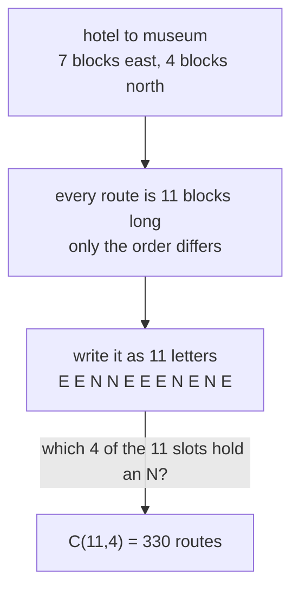

# Lattice paths: routes across a grid are choice counts, and Pascal's triangle is the map

[Syllabus](../../../SYLLABUS.md) → [Combinatorics and graphs](../../../SYLLABUS.md#w04) → [Lattice Paths and Catalan Numbers](../../../SYLLABUS.md#w04-s06) → Lattice paths

---

## General Overview

A hotel stands on a street corner. The museum is 7 blocks east and 4 blocks north. The streets run in a grid, and a walker never doubles back: every block goes east or north. How many routes are there?

Every route uses 7 blocks east and 4 north, 11 in all; only the order differs. Write one as a row of 11 letters, E for east and N for north: E E N N E E E N E N E. Read it back and the walk returns, corner by corner.

So a street question is a slot question: which 4 of the 11 positions hold an N? The count of those picks is C(11, 4), read "eleven choose four": 330.

A cafe sits 3 blocks east and 2 north. Of the 330 routes, 150 pass it and 180 miss it, and neither number needs a route drawn.

**A route that only steps east or north is nothing but the order of its steps, so the routes across a grid m blocks east and n blocks north number C(m+n, n).**

**What kind of fact this is:** a theorem, proved on this card in Why it works.

### The picture: a walk becomes a pick



---

## The formula

C(n, k), read "n choose k", counts the ways to take k things from n when order is not recorded; it is 0 when k is below 0 or above n ([Combinations, n choose k](../01-Counting%20Principles/05-n-choose-k.md)).

$$C(m+n,\ n) = \frac{(m+n)!}{m!\ n!}$$

**Read it aloud:** a route is a row of m plus n steps; count the ways of saying which n go north.

Naming the north steps names the east steps, so C(m+n, m) is the same 330. A named corner splits the walk. Write $a$ for its blocks east and $b$ for its blocks north, and pair every way of reaching it with every way of finishing:

$$C(a+b,\ b)\ \times\ C\big((m-a)+(n-b),\ n-b\big)$$

Routes clear of that corner are the rest: the total minus the product. The tall Σ in Step 4 means add: write the term to its right once for each value of the letter beneath it, from that first value up to the number above.

| Symbol | Plain meaning | In our example | Push it up and the answer… |
| --- | --- | --- | --- |
| $m$, $n$ | blocks east, blocks north to the museum | 7 and 4 | more steps to order, a larger count |
| $m+n$ | steps in one route, alike for all | 11 | — |
| $C(m+n,n)$ | routes in all | 330 | — |
| $a$, $b$ | a named corner: east, north | the cafe, 3 and 2 | moves the corner across the map |
| $C(a+b,b)$ | routes from the start to that corner | 10 | more routes pass the corner |
| $k$ | north steps in the first five blocks | 0 to 4 | picks one term of the sum |
| $\sum_{k=0}^{4}$ | add the term over every $k$ | 15 + 100 + 150 + 60 + 5 | — |

### When it holds

- **Steps go one way only.** East or north, never west or south. Allow a step back and the count stops being finite.
- **A clear rectangle of whole blocks.** A closed street or a park in the middle needs the through-and-subtract below.
- **Either side may be zero.** With nothing to go north, C(m+0, 0) = 1: the one route along the edge.

---

## Why it works

### Step 0: a route carries no information but the order of its steps

Stand at the hotel and walk. The only record worth keeping at each corner is which way the next block went.

So a route trades for a row of 11 letters with 7 Es and 4 Ns. Two routes that part at some block give rows differing in that slot, so no row is used twice; and every row gives a route back, since 11 east-or-north steps with 4 Ns land at the museum. Rows and routes are matched in pairs, none left over ([Bijections and double counting](../02-Repeats%2C%20Groups%20and%20Double%20Counting/05-bijection-and-double-counting.md)): counting rows counts routes.

### Step 1: choosing the route is choosing which steps go north

Naming which 4 of the 11 slots hold an N fixes the row; the rest are E. That is a pick of 4 from 11 with no order recorded: C(11, 4) = 330. Naming the 7 east slots gives the same rows.

### Step 2: write the count on every corner, and Pascal's rule appears

Now write on every corner the number of routes from the hotel to it. The bottom edge is all 1s: due east, one way reaches each corner, and the left edge is all 1s for the same reason. Every other corner is entered on its last step from the west or from the south, never both, and each group is counted by the corner that step came from. So a corner's number is the sum of its west and south neighbours — addition, no formula.

| routes to each corner | east 0 | east 1 | east 2 | east 3 | east 4 | east 5 | east 6 | east 7 |
| --- | --- | --- | --- | --- | --- | --- | --- | --- |
| **north 4** | 1 | 5 | 15 | 35 | 70 | 126 | 210 | **330** |
| **north 3** | 1 | 4 | 10 | 20 | 35 | 56 | 84 | 120 |
| **north 2** | 1 | 3 | 6 | 10 | 15 | 21 | 28 | 36 |
| **north 1** | 1 | 2 | 3 | 4 | 5 | 6 | 7 | 8 |
| **north 0** | 1 | 1 | 1 | 1 | 1 | 1 | 1 | 1 |

The museum's 330 is 210 from the west plus 120 from the south: Pascal's rule with streets under it ([Pascal's rule](../03-Binomial%20Coefficients%20and%20Identities/01-pascals-rule-and-the-triangle.md)), an entry's two parents being the corners one block back. Read the map along a slanting line instead and a row of Pascal's triangle appears — 1, 4, 6, 4, 1. The triangle is this map, read along its diagonals.

### Step 3: through a corner is a multiply, around it is a subtract

The cafe sits 3 east and 2 north. Reaching it takes 5 blocks of which 2 go north, C(5, 2) = 10 routes; going on to the museum takes 4 east and 2 north, C(6, 2) = 15. Any first half pairs with any second, so 10 × 15 = 150 routes touch the cafe and the other 180 never do. The halves multiply because they are choices made one after the other, not alternatives to each other.

### Step 4: cut every route at the same distance, and Vandermonde appears

After five blocks a walker has gone five blocks, whatever the route. So every route stands then on exactly one of the corners five blocks out: (5,0), (4,1), (3,2), (2,3) or (1,4), blocks east then north.

If $k$ of the first five steps went north, that corner is 5−k east and k north, reached C(5, k) ways, and the remaining 6 blocks need 4−k north steps, C(6, 4−k) ways. The five groups hold 15, 100, 150, 60 and 5 routes, adding to 330.

$$C(11,\ 4)\ =\ \sum_{k=0}^{4} C(5,\ k)\ C(6,\ 4-k)$$

That is Vandermonde's identity ([Vandermonde's identity](../03-Binomial%20Coefficients%20and%20Identities/03-vandermonde-identity.md)) drawn on streets, and the middle group is the cafe's 150: counting through a corner and proving Vandermonde are one piece of work.

Adding groups works along one cut only. Over all 40 corners the through-counts total 3,960, or 12 × 330, since each route stands on 12 corners. A second road reaches 330 with no formula at all: the map above, filled in by addition, and the code below walks it.

---

## Worked numbers, by hand

| Step | Arithmetic | Value |
| --- | --- | --- |
| blocks in any route | 7 east + 4 north | 11 |
| which four go north | (11 × 10 × 9 × 8) ÷ (4 × 3 × 2 × 1) | **330** |
| routes to the cafe | C(5, 2) | 10 |
| routes on to the museum | C(6, 2) | 15 |
| routes through the cafe | 10 × 15 | **150** |
| routes avoiding it | 330 − 150 | **180** |
| the last step into the museum | 210 from the west + 120 from the south | 330 |

A courier collecting an order at the cafe picks from 150 walks, all 11 blocks long.

### What breaks if you drop a piece

| Mistake | Comes out at | What went wrong |
| --- | --- | --- |
| Labelling the north steps first, second, third, fourth | 7,920 | each route counted 24 times, once per order of its four north steps |
| Adding the cafe's two halves | 25 | each of the 10 routes to the cafe carries on in all 15 ways, so the halves multiply |
| Adding through-counts over all 40 corners | 3,960 | each route stands on 12 corners; one cut at a time counts each route once |

The code prints all three.

---

## Code, from first principles, and it actually runs

Nothing is imported. The 330 is reached by three roads sharing no arithmetic: a choose formula from a running product, a listing of all 2,048 orders of 11 east-or-north steps keeping those with exactly 4 north, and the map of corner counts filled in by addition. The cafe's 150 and the five groups along the cut are counted twice over, by formula and by listing. A 5-by-5 grid follows.

### Python

```python
# Lattice paths -- the check behind the card.  Nothing is imported.  A museum stands 7
# blocks east and 4 blocks north of a hotel, and a walk steps east or north only.  The
# 330 routes are counted three ways that share no arithmetic: a choose formula, a listing
# of every order of the steps, and a map of corner counts built by addition alone.
EAST, NORTH, CAFE = 7, 4, (3, 2)
STEPS, CUT = EAST + NORTH, CAFE[0] + CAFE[1]   # CUT: blocks walked to the cafe

def choose(n, k):                     # C(n, k), built from a running product
    out = 1 if 0 <= k <= n else 0
    for i in range(max(k, 0)):
        out = out * (n - i) // (i + 1)
    return out
def every_walk(east, north):          # road two: every order of the steps, 1 = north
    orders = ([(c >> i) & 1 for i in range(east + north)] for c in range(2 ** (east + north)))
    return [w for w in orders if sum(w) == north]
def corners(walk):                    # the corners one route stands on, the start included
    return [(i - sum(walk[:i]), sum(walk[:i])) for i in range(len(walk) + 1)]
def by_addition(east, north):         # road three: west neighbour plus south neighbour
    g = [[1] * (east + 1) for _ in range(north + 1)]
    for b in range(1, north + 1):
        for a in range(1, east + 1):
            g[b][a] = g[b][a - 1] + g[b - 1][a]
    return g

routes = every_walk(EAST, NORTH)
listed, formula = len(routes), choose(STEPS, NORTH)
grid = by_addition(EAST, NORTH)
grid_f = [[choose(a + b, b) for a in range(EAST + 1)] for b in range(NORTH + 1)]
west_in, south_in = grid[NORTH][EAST - 1], grid[NORTH - 1][EAST]
to_cafe, from_cafe = choose(CUT, CAFE[1]), choose(STEPS - CUT, NORTH - CAFE[1])
product = to_cafe * from_cafe
through = sum(1 for w in routes if CAFE in corners(w))
avoid = sum(1 for w in routes if CAFE not in corners(w))
diag = [(CUT - b, b) for b in range(NORTH + 1)]
terms = [choose(CUT, b) * choose(STEPS - CUT, NORTH - b) for b in range(NORTH + 1)]
seen_diag = [sum(1 for w in routes if c in corners(w)) for c in diag]
whole_map = sum(choose(a + b, b) * choose(STEPS - a - b, NORTH - b) for b in range(NORTH + 1) for a in range(EAST + 1))
ordered = 1                                 # the north steps wrongly treated as labelled
for i in range(NORTH): ordered = ordered * (STEPS - i)
square, sq = every_walk(5, 5), choose(10, 5)
never = sum(1 for w in square if all(e >= n for e, n in corners(w)))
print(f"hotel to museum: {EAST} blocks east, {NORTH} north, {STEPS} steps in all")
print(f"routes: formula C({STEPS},{NORTH}) = {formula}; listing {listed} of {2 ** STEPS} step orders")
print("routes to each corner, by addition alone (east 0 at the left):")
for b in range(NORTH, -1, -1): print(f"n={b} |" + "".join(f"{v:>7}" for v in grid[b]))
print(f"the same map from the formula: {'yes' if grid == grid_f else 'no'}")
print(f"last step into the museum: {west_in} from the west + {south_in} from the south = {formula}")
print(f"the cafe at ({CAFE[0]},{CAFE[1]}): {to_cafe} routes to it x {from_cafe} on = {product}; by listing: {through}")
print(f"routes avoiding the cafe: {formula} - {product} = {formula - product}; by listing: {avoid}")
print(f"the diagonal {CUT} blocks out: " + ", ".join(f"({a},{b}) {t}" for (a, b), t in zip(diag, terms)))
print(f"those five add to {sum(terms)}; by listing: " + ", ".join(str(c) for c in seen_diag))
print(f"mistake 1, the north steps taken as ordered picks: {ordered}, not {formula}")
print(f"mistake 2, the cafe halves added: {to_cafe} + {from_cafe} = {to_cafe + from_cafe}, not {product}")
print(f"mistake 3, through-counts added over all {(EAST+1)*(NORTH+1)} corners: {whole_map} = {STEPS + 1} x {formula}")
print(f"a square grid, 5 by 5: C(10,5) = {sq}, by listing {len(square)}; {never} never cross the diagonal")
assert formula == listed and sq == len(square) and never == sq - choose(10, 4)   # listings vs formulas
assert grid == grid_f                               # addition against the formula
assert through == product and avoid == formula - product
assert seen_diag == terms and sum(terms) == listed  # Vandermonde, both roads
print("ALL CHECKS PASS")
```

**Ran 2026-09-14 on macOS, Python 3.14.6, standard library only. All checks passed. Output, pasted from the run:**

```
hotel to museum: 7 blocks east, 4 north, 11 steps in all
routes: formula C(11,4) = 330; listing 330 of 2048 step orders
routes to each corner, by addition alone (east 0 at the left):
n=4 |      1      5     15     35     70    126    210    330
n=3 |      1      4     10     20     35     56     84    120
n=2 |      1      3      6     10     15     21     28     36
n=1 |      1      2      3      4      5      6      7      8
n=0 |      1      1      1      1      1      1      1      1
the same map from the formula: yes
last step into the museum: 210 from the west + 120 from the south = 330
the cafe at (3,2): 10 routes to it x 15 on = 150; by listing: 150
routes avoiding the cafe: 330 - 150 = 180; by listing: 180
the diagonal 5 blocks out: (5,0) 15, (4,1) 100, (3,2) 150, (2,3) 60, (1,4) 5
those five add to 330; by listing: 15, 100, 150, 60, 5
mistake 1, the north steps taken as ordered picks: 7920, not 330
mistake 2, the cafe halves added: 10 + 15 = 25, not 150
mistake 3, through-counts added over all 40 corners: 3960 = 12 x 330
a square grid, 5 by 5: C(10,5) = 252, by listing 252; 42 never cross the diagonal
ALL CHECKS PASS
```

### Rust

Same numbers, same labels, built with `rustc --edition 2021 -O`.

```rust
// Lattice paths -- the same check as the Python, in Rust.  No crates.  A museum stands 7 blocks
// east and 4 blocks north of a hotel, and a walk steps east or north only.  The 330 routes are
// counted three ways that share no arithmetic: a choose formula, a listing of every order of the
// steps, and a map of corner counts built by addition alone.
const EAST: i64 = 7;
const NORTH: i64 = 4;
const CAFE: (i64, i64) = (3, 2);
const STEPS: i64 = EAST + NORTH;
const CUT: i64 = CAFE.0 + CAFE.1;           // CUT: blocks walked to the cafe
fn choose(n: i64, k: i64) -> i64 {          // C(n, k), built from a running product
    let mut out: i64 = if 0 <= k && k <= n { 1 } else { 0 };
    for i in 0..k.max(0) { out = out * (n - i) / (i + 1) }
    out
}
fn every_walk(east: i64, north: i64) -> Vec<Vec<i64>> {   // road two: every order of the steps
    let steps = east + north;                             // bit set = north, bit clear = east
    let mut out = Vec::new();
    for c in 0..(1i64 << steps) {
        let walk: Vec<i64> = (0..steps).map(|i| (c >> i) & 1).collect();
        if walk.iter().sum::<i64>() == north { out.push(walk) }
    }
    out
}
fn corners(walk: &[i64]) -> Vec<(i64, i64)> {   // the corners one route stands on
    let (mut e, mut n, mut out) = (0, 0, vec![(0, 0)]);
    for &s in walk { if s == 1 { n += 1 } else { e += 1 }; out.push((e, n)) }
    out
}
fn by_addition(east: i64, north: i64) -> Vec<Vec<i64>> {  // west neighbour plus south neighbour
    let mut g = vec![vec![1i64; (east + 1) as usize]; (north + 1) as usize];
    for b in 1..=north as usize {
        for a in 1..=east as usize { g[b][a] = g[b][a - 1] + g[b - 1][a] }
    }
    g
}
fn main() {
    let routes = every_walk(EAST, NORTH);
    let (listed, formula) = (routes.len() as i64, choose(STEPS, NORTH));
    let grid = by_addition(EAST, NORTH);
    let grid_f: Vec<Vec<i64>> = (0..=NORTH).map(|b| (0..=EAST).map(|a| choose(a + b, b)).collect()).collect();
    let (west_in, south_in) = (grid[NORTH as usize][(EAST - 1) as usize], grid[(NORTH - 1) as usize][EAST as usize]);
    let (to_cafe, from_cafe) = (choose(CUT, CAFE.1), choose(STEPS - CUT, NORTH - CAFE.1));
    let product = to_cafe * from_cafe;
    let through = routes.iter().filter(|w| corners(w).contains(&CAFE)).count() as i64;
    let avoid = routes.iter().filter(|w| !corners(w).contains(&CAFE)).count() as i64;
    let diag: Vec<(i64, i64)> = (0..=NORTH).map(|b| (CUT - b, b)).collect();
    let terms: Vec<i64> = (0..=NORTH).map(|b| choose(CUT, b) * choose(STEPS - CUT, NORTH - b)).collect();
    let seen_diag: Vec<i64> = diag.iter().map(|c| routes.iter().filter(|w| corners(w).contains(c)).count() as i64).collect();
    let whole_map: i64 = (0..=NORTH).map(|b| (0..=EAST)
        .map(|a| choose(a + b, b) * choose(STEPS - a - b, NORTH - b)).sum::<i64>()).sum();
    let ordered = { let mut p = 1i64; for i in 0..NORTH { p *= STEPS - i } p };   // north steps labelled
    let (square, sq) = (every_walk(5, 5), choose(10, 5));
    let never = square.iter().filter(|w| corners(w).iter().all(|&(e, n)| e >= n)).count() as i64;
    println!("hotel to museum: {} blocks east, {} north, {} steps in all", EAST, NORTH, STEPS);
    println!("routes: formula C({},{}) = {}; listing {} of {} step orders", STEPS, NORTH, formula, listed, 1i64 << STEPS);
    println!("routes to each corner, by addition alone (east 0 at the left):");
    for b in (0..=NORTH as usize).rev() {
        let mut line = format!("n={} |", b);
        for v in &grid[b] { line.push_str(&format!("{:>7}", v)) }
        println!("{}", line);
    }
    println!("the same map from the formula: {}", if grid == grid_f { "yes" } else { "no" });
    println!("last step into the museum: {} from the west + {} from the south = {}", west_in, south_in, formula);
    println!("the cafe at ({},{}): {} routes to it x {} on = {}; by listing: {}", CAFE.0, CAFE.1, to_cafe, from_cafe, product, through);
    println!("routes avoiding the cafe: {} - {} = {}; by listing: {}", formula, product, formula - product, avoid);
    let cells: Vec<String> = diag.iter().zip(&terms).map(|(&(a, b), t)| format!("({},{}) {}", a, b, t)).collect();
    println!("the diagonal {} blocks out: {}", CUT, cells.join(", "));
    let counted: Vec<String> = seen_diag.iter().map(|c| c.to_string()).collect();
    println!("those five add to {}; by listing: {}", terms.iter().sum::<i64>(), counted.join(", "));
    println!("mistake 1, the north steps taken as ordered picks: {}, not {}", ordered, formula);
    println!("mistake 2, the cafe halves added: {} + {} = {}, not {}", to_cafe, from_cafe, to_cafe + from_cafe, product);
    println!("mistake 3, through-counts added over all {} corners: {} = {} x {}", (EAST+1)*(NORTH+1), whole_map, STEPS + 1, formula);
    println!("a square grid, 5 by 5: C(10,5) = {}, by listing {}; {} never cross the diagonal", sq, square.len(), never);
    assert!(formula == listed && sq == square.len() as i64 && never == sq - choose(10, 4));   // listings vs formulas
    assert!(grid == grid_f);                                   // addition against the formula
    assert!(through == product && avoid == formula - product);
    assert!(seen_diag == terms && terms.iter().sum::<i64>() == listed);
    println!("ALL CHECKS PASS");
}
```

**Ran 2026-09-14 on macOS, rustc 1.98.1, no crates. All checks passed. Output, pasted from the run:**

```
hotel to museum: 7 blocks east, 4 north, 11 steps in all
routes: formula C(11,4) = 330; listing 330 of 2048 step orders
routes to each corner, by addition alone (east 0 at the left):
n=4 |      1      5     15     35     70    126    210    330
n=3 |      1      4     10     20     35     56     84    120
n=2 |      1      3      6     10     15     21     28     36
n=1 |      1      2      3      4      5      6      7      8
n=0 |      1      1      1      1      1      1      1      1
the same map from the formula: yes
last step into the museum: 210 from the west + 120 from the south = 330
the cafe at (3,2): 10 routes to it x 15 on = 150; by listing: 150
routes avoiding the cafe: 330 - 150 = 180; by listing: 180
the diagonal 5 blocks out: (5,0) 15, (4,1) 100, (3,2) 150, (2,3) 60, (1,4) 5
those five add to 330; by listing: 15, 100, 150, 60, 5
mistake 1, the north steps taken as ordered picks: 7920, not 330
mistake 2, the cafe halves added: 10 + 15 = 25, not 150
mistake 3, through-counts added over all 40 corners: 3960 = 12 x 330
a square grid, 5 by 5: C(10,5) = 252, by listing 252; 42 never cross the diagonal
ALL CHECKS PASS
```

The two outputs match line for line.

> [!TIP]
> **Try changing**
> Guess first, then run it; every count follows the settings.
> - **Move the museum one block south.** Set `NORTH` to `3`: the count drops to 120, one row down on the map.
> - **Move the cafe.** Set `CAFE` to `(4, 1)`: more routes through it, or fewer? 100, the second term of the cut, since that corner is five blocks out too.
> - **Square the grid.** Set `EAST` and `NORTH` to `5`: 252 routes, 42 of which never cross the diagonal.

---

## The usual mistake

> [!warning]
> **"Two ways at every corner, eleven steps, so 2 multiplied in 11 times — 2,048 routes."** All 2,048 orders of eleven steps are walks, and the code lists every one, but only the 330 with exactly four north steps finish at the museum. The rest overshoot. Routes are the step orders that land on the target, not all the step orders.
>
> - **Labelling the north steps.** 11 × 10 × 9 × 8 = 7,920 counts each route 24 times, once per order of its four interchangeable north blocks.
> - **Adding at the cafe.** 10 + 15 = 25 answers a question with no route in it; through-routes are 10 × 15 = 150.
> - **Adding through-counts across the map.** All 40 corners give 3,960, each route counted once per corner it stands on.
> - **Hunting for the shortest route.** All 330 are 11 blocks; order separates them, not length.

---

## Where you meet it in real life

- **Option pricing on a tree.** A share price ticking up or down each period traces one of these routes, and the count of routes reaching a node is where a tree price's weights come from ([Many steps](../../12-Financial%20mathematics/04-Binomial%20Trees/03-multi-step-trees-and-backward-induction.md)).
- **Coin runs.** Eleven tosses landing four heads can happen 330 ways, heads for north ([Counting coin-flip paths](05-random-walk-path-counts.md)).
- **Vote counting.** Ballots counted one at a time trace a route, and whether a candidate ever fell behind asks which side of a line the route stays on ([The reflection principle](02-reflection-principle-and-ballot-problem.md)).

> **Say it back**
> A route that only goes east or north is nothing but the order of its steps, so it trades for a row of letters and back. Naming which 4 of the 11 steps go north names the route: C(11, 4) = 330 names. Write the count on every corner and each entry is the sum of its west and south neighbours — Pascal's triangle, tilted onto streets. Routes through a corner multiply: 10 to the cafe times 15 onward is 150, leaving 180 that miss it. Cutting every route at one distance and adding the groups is Vandermonde's identity.

---

## What this builds on

- [Combinations, n choose k](../01-Counting%20Principles/05-n-choose-k.md): the count C(n, k), and why order inside a pick is divided out.
- [Pascal's rule](../03-Binomial%20Coefficients%20and%20Identities/01-pascals-rule-and-the-triangle.md): the rule the map's addition turns out to be, and the zero convention.
- [Vandermonde's identity](../03-Binomial%20Coefficients%20and%20Identities/03-vandermonde-identity.md): the identity Step 4's cut proves, stated and proved there.

## Where this goes next

- [The reflection principle](02-reflection-principle-and-ballot-problem.md): counting the routes that break a rule by mirroring them, turning a forbidden line into an ordinary choose count.
- [Many steps](../../12-Financial%20mathematics/04-Binomial%20Trees/03-multi-step-trees-and-backward-induction.md): the same routes carrying money, a payoff at the far corner and a price worked backwards.

Every route counted here was allowed. The next question is how many stay on one side of a line: of the 252 routes across a square 5-block grid, 42 never cross the diagonal, and the reflection principle explains that 42.

---

## Sources

Verified 14 Sep 2026: every link below resolves to the publisher's page.

- Stanley, Richard P. *Enumerative Combinatorics, Volume 1*, 2nd ed. Cambridge University Press, 2012. [doi:10.1017/CBO9781139058520](https://doi.org/10.1017/CBO9781139058520). The trade between routes, words and picks, set out as the basic counting move.
- Graham, Ronald L., Donald E. Knuth, and Oren Patashnik. *Concrete Mathematics*, 2nd ed. Addison-Wesley, 1994. [Publisher page](https://www.informit.com/store/concrete-mathematics-a-foundation-for-computer-science-9780201558029). Chapter 5, the working toolkit for Pascal's rule and Vandermonde's identity.
- Krattenthaler, Christian. "Lattice Path Enumeration." Chapter 10 of the *Handbook of Enumerative Combinatorics*, CRC Press, 2015. [arXiv:1503.05930](https://arxiv.org/abs/1503.05930). Surveys the field, from this rectangle to paths that must avoid a line.
