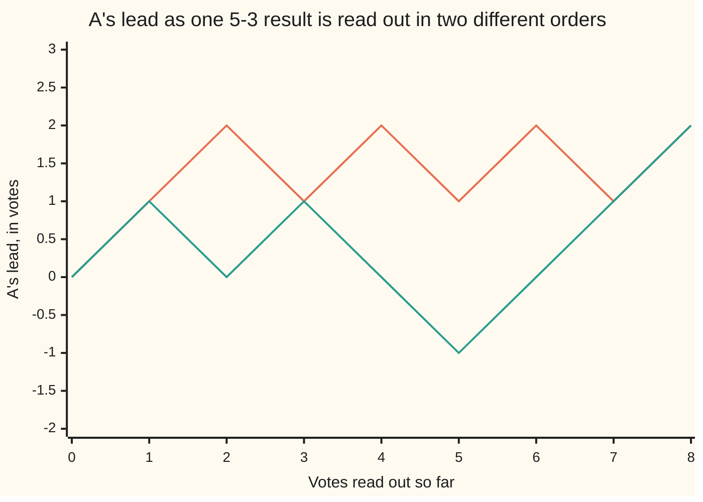

# The reflection principle: mirror the bad paths onto ones that are easy to count, and the ballot problem falls out

[Syllabus](../../../SYLLABUS.md) → [Combinatorics and graphs](../../../SYLLABUS.md#w04) → [Lattice Paths and Catalan Numbers](../../../SYLLABUS.md#w04-s06) → The reflection principle

---

## General Overview

A small election is over. Eight votes are in the box, five for A and three for B. The result is settled; the order the votes come out of the box, as the count is read aloud, is not.

There are 56 such orders. In some, A leads on the first vote and is never caught. In others B draws level halfway and A pulls clear at the end. Exactly 14 of the 56 keep A strictly ahead throughout.

Checking 56 orders by hand is dull but possible; checking thousands is not. The escape is to count the spoiled orders — where the score goes level or A falls behind — and subtract. They fall in two piles: orders opening with B, spoiled at once and easy to count, and orders opening with A that go level later.

A mirror folds the second pile onto the first: swap every A into a B and every B into an A, up to the moment the score was first level. That pairs the piles one for one, so they are the same size.

**Mirroring a count up to its first level score pairs the spoiled A-openers one for one with the orders opening with B, so the orders keeping A ahead are the winning margin over the total vote — 2 in 8 — of all 56.**

**What kind of fact this is:** a theorem, proved on this card in Why it works.

### The picture: two counting orders of the same election



The upper line is A A B A B A B A, above zero from the first vote on. The lower line is A B A B B A A A, level after vote 2 and behind after vote 5.

---

## The formula

Draw a count as a path: start at zero, a vote for A steps up one, a vote for B down one. The height after each vote is A's lead, A's votes so far minus B's ([Lattice paths](01-lattice-paths.md)). Ahead throughout means the line never touches zero again.

Write $a$ for the votes for A, $b$ for B, and $n$ for the total. The number of ways to choose which of the $n$ slots hold the A's is the binomial coefficient $C(n, a)$, read "n choose a".

$$\text{orders keeping A ahead} \;=\; \frac{a - b}{a + b} \times C(a + b,\; a)$$

**Read it aloud:** the share of orders keeping A in front all the way is the winning margin, $a - b$, over the total vote.

| Symbol | Plain meaning | In our example | Push it up and the answer… |
| --- | --- | --- | --- |
| $a$ | votes for the winner, A | 5 | more orders keep A ahead |
| $b$ | votes for the runner-up, B | 3 | fewer do; at $a = b$ none can |
| $n$ | every vote cast, $a + b$ | 8 | more orders, same share |
| $C(n, a)$ | ways to place $a$ A's in $n$ slots | $C(8, 5) = 56$ | more orders to sort |
| the lead | A's votes so far minus B's | 1, 2, 1, 2, 1, 2, 1, 2 | — |

The proof reaches the same count through a subtraction:

$$\text{orders keeping A ahead} \;=\; C(n - 1,\; a - 1) - C(n - 1,\; a)$$

**Read it aloud:** the orders opening with a vote for A, less the ones that open with A and go level later.

The second term does double duty: it counts the orders opening with B, and through the mirror the A-openers that go level later. Here $C(7, 4) - C(7, 5) = 35 - 21 = 14$, the same as $(2/8) \times 56$.

### When it holds

- **Strictly ahead, from the first vote on.** Counting a level score as "still ahead" gives 28 orders, not 14.
- **A wins, so $a$ is larger than $b$.** At $a = b$ the formula gives zero, rightly: the last vote levels the score. With $b$ larger it turns negative, though the count is zero.
- **One vote at a time.** In batches a lead can jump from 1 to −1 without landing on zero, and the argument breaks.
- **Orders, not chances.** These count orders; "one in four" is favourable over possible, nothing more.

---

## Why it works

### Step 0: a count is a path, and ahead means above zero

A running total that moves by one at each step is a path. Each of the 56 orders is a path from zero to a height of 2, and "A never loses the lead" becomes "the path never touches zero again".

### Step 1: the first vote splits 56 into 21 and 35

A first vote for B leaves A level or behind at once: spoiled, whatever follows. Those orders place five A's in the seven remaining slots, $C(7, 5) = 21$. The other 35 open with A, $C(7, 4) = 35$, and are spoiled only if the score goes level later.

### Step 2: mirror the part before the first level score

Take the spoiled order A B A B B A A A. Its lead runs 1, 0, 1, 0, −1, 0, 1, 2, so the score is first level after vote 2. Swap those two votes and leave the rest.

| Order | A's lead after each vote |
| --- | --- |
| the spoiled order, A B A B B A A A | 1, 0, 1, 0, −1, 0, 1, 2 |
| its mirror, B A A B B A A A | −1, 0, 1, 0, −1, 0, 1, 2 |

Before the tie the leads are equal and opposite: that piece is reflected in the line the count must not touch. After it the orders are identical. The swap is safe because the first two votes held one A and one B, as a level score forces, so the mirror is still a 5–3 count.

### Step 3: the mirror can be undone, so it counts

An order opening with B sits at −1 after one vote and 2 at the finish, and steps of one cannot cross zero without landing on it, so it has a first level score too; mirroring that piece returns a spoiled A-opener. Each map undoes the other, so the two piles are the same size ([Bijections and double counting](../02-Repeats%2C%20Groups%20and%20Double%20Counting/05-bijection-and-double-counting.md)): 21 B-openers, 21 spoiled A-openers. Nothing used 5 and 3: the argument runs on any $a$ larger than $b$.

### Step 4: subtract, then put letters where the numbers are

Of the 35 orders opening with A, 21 go level later, leaving 35 − 21 = 14 in which A leads from first vote to last. In letters the A-openers are $C(n - 1, a - 1)$ and the B-openers $C(n - 1, a)$, so the count is their difference.

<details>
<summary>The algebra behind this, if you want it</summary>

The factorial $n!$ is the product of the whole numbers from 1 up to $n$, and $C(n, a) = n! / (a!\,b!)$ when $b = n - a$. So $C(n-1, a-1) = (n-1)! / ((a-1)!\,b!)$ is $a$ times $(n-1)! / (a!\,b!)$, and $C(n-1, a) = (n-1)! / (a!\,(b-1)!)$ is $b$ times it. Their difference is $(a - b) \times (n-1)! / (a!\,b!)$; multiplying above and below by $n$ makes that $\frac{a-b}{n} \times C(n, a)$.

</details>

The other road to 14 is to list all 56 orders and test each, as the code does first. That settles this election only; the mirror does not care how large the count is.

---

## Worked numbers, by hand

| Step | Arithmetic | Value |
| --- | --- | --- |
| every counting order | $C(8, 5)$ | 56 |
| orders opening with B | five A's in seven slots, $C(7, 5)$ | 21 |
| orders opening with A | four A's in seven slots, $C(7, 4)$ | 35 |
| of those, the ones going level later | mirrored onto the B-openers | 21 |
| A ahead after every vote | 35 − 21 | **14** |
| the same by the share form | $(5 - 3) / (5 + 3) \times 56$ | **14** |
| ten-step paths, mirror one level lower | 252 − 210 | **42** |

Fourteen of the 56 orders keep A in front from first vote to last: favourable over possible, one in four. The last row drops the mirror a step, on the shelf's house example: of 252 ten-step paths back to the start, 42 never dip below it.

### What breaks if you drop a piece

| Mistake | Comes out at | What went wrong |
| --- | --- | --- |
| a level score counted as still ahead | 28 orders | "ahead" traded for "not behind" |
| only the mirrored orders subtracted | 35 | the 21 opening with B were never taken off |
| the margin divided by A's votes | 22.4 | a smaller divisor inflates the share, and a count cannot end in .4 |

The code prints all three.

---

## Code, from first principles, and it actually runs

Nothing is imported. Three roads reach 14: every order is listed and tested; the mirror is applied to each spoiled A-opener and matched against the B-openers; and the share form is worked from a binomial coefficient built in a loop.

### Python

```python
# The reflection principle and the ballot problem -- the check behind the card.
# Nothing is imported.  Eight votes are counted one at a time, 5 for A and 3
# for B.  Every order is listed and tested; the same count is then reached by
# the mirror argument and by the ballot formula.  The shelf's ten-step paths
# back to the start are counted the same two ways at the end.
A, B = 5, 3
N, GOOD, SPOILED = A + B, "AABABABA", "ABABBAAA"

def choose(n, k):                          # n choose k, built from a plain loop
    out = 1
    for i in range(k):
        out = out * (n - i) // (i + 1)
    return out

def orders(a, b):                          # every arrangement of a A's and b B's
    if a + b == 0:
        return [""]
    out = ["A" + tail for tail in orders(a - 1, b)] if a else []
    return out + (["B" + tail for tail in orders(a, b - 1)] if b else [])

def leads(order):                          # A's lead after each vote, from 0
    out = [0]
    for v in order:  out.append(out[-1] + (1 if v == "A" else -1))
    return out

def mirror(order):                         # swap A and B up to the first level score
    cut = leads(order).index(0, 1)
    return "".join("B" if v == "A" else "A" for v in order[:cut]) + order[cut:]

every = orders(A, B)                                              # road one: list them
ahead = [o for o in every if all(x > 0 for x in leads(o)[1:])]
b_open = sorted(o for o in every if o[0] == "B")
tied = [o for o in every if o[0] == "A" and 0 in leads(o)[1:]]
mirrored = sorted(mirror(o) for o in tied)                        # road two: mirror them
ballot = (A - B) * choose(N, A) // N                              # road three: the formula
level_ok = [o for o in every if all(x >= 0 for x in leads(o)[1:])]
dyck = orders(5, 5)
low_ok = [o for o in dyck if all(x >= 0 for x in leads(o))]

print(f"{N} votes counted one at a time, {A} for A and {B} for B: all orders C({N},{A}) = {choose(N, A)}")
print(f"by listing all {len(every)} orders: A strictly ahead after every vote in {len(ahead)} of them")
print(f"by the ballot formula: ({A} - {B}) / ({A} + {B}) x {choose(N, A)} = {ballot}")
print(f"{len(b_open)} orders open with a vote for B; {len(every) - len(b_open)} open with A, and {len(tied)} of those reach a tie later")
print(f"the mirror matches those {len(tied)} to the {len(b_open)} B-openers, one to one: {'yes' if mirrored == b_open else 'no'}")
print(f"so the count is C({N-1},{A-1}) - C({N-1},{A}) = {choose(N-1, A-1)} - {choose(N-1, A)} = {choose(N-1, A-1) - choose(N-1, A)}")
print(f"a good order, {' '.join(GOOD)}: A's lead after each vote {leads(GOOD)}")
print(f"a spoiled order, {' '.join(SPOILED)}: A's lead after each vote {leads(SPOILED)}")
print(f"its mirror, {' '.join(mirror(SPOILED))}: A's lead after each vote {leads(mirror(SPOILED))}")
print(f"the two agree from vote {leads(SPOILED).index(0, 1)} on: {'yes' if leads(mirror(SPOILED))[2:] == leads(SPOILED)[2:] else 'no'}")
print(f"mistake 1, counting a tie as still ahead: {len(level_ok)} orders, not {len(ahead)}")
print(f"mistake 2, forgetting the orders that open with B: {choose(N, A)} - {len(tied)} = {choose(N, A) - len(tied)}, not {len(ahead)}")
print(f"mistake 3, dividing by A's votes alone: ({A} - {B}) / {A} x {choose(N, A)} = {(A - B) * choose(N, A) / A:.1f}, not a whole count")
print(f"ten steps back to the start: C(10,5) = {len(dyck)} orders, {len(low_ok)} of them never dip below zero")
print(f"the same {len(low_ok)} by mirroring at one step below: {len(dyck)} - C(10,4) = {len(dyck)} - {choose(10, 4)} = {len(dyck) - choose(10, 4)}")
assert len(ahead) == ballot == 14                                 # listing against the formula
assert mirrored == b_open and len(every) - len(b_open) - len(tied) == len(ahead)
assert len(ahead) == choose(N - 1, A - 1) - choose(N - 1, A)      # listing against Pascal's split
assert len(low_ok) == len(dyck) - choose(10, 4) and len(low_ok) == choose(10, 5) // 6
print("ALL CHECKS PASS")
```

**Ran 2026-09-14 on macOS, Python 3.14.6, standard library only. All checks passed. Output, pasted from the run:**

```
8 votes counted one at a time, 5 for A and 3 for B: all orders C(8,5) = 56
by listing all 56 orders: A strictly ahead after every vote in 14 of them
by the ballot formula: (5 - 3) / (5 + 3) x 56 = 14
21 orders open with a vote for B; 35 open with A, and 21 of those reach a tie later
the mirror matches those 21 to the 21 B-openers, one to one: yes
so the count is C(7,4) - C(7,5) = 35 - 21 = 14
a good order, A A B A B A B A: A's lead after each vote [0, 1, 2, 1, 2, 1, 2, 1, 2]
a spoiled order, A B A B B A A A: A's lead after each vote [0, 1, 0, 1, 0, -1, 0, 1, 2]
its mirror, B A A B B A A A: A's lead after each vote [0, -1, 0, 1, 0, -1, 0, 1, 2]
the two agree from vote 2 on: yes
mistake 1, counting a tie as still ahead: 28 orders, not 14
mistake 2, forgetting the orders that open with B: 56 - 21 = 35, not 14
mistake 3, dividing by A's votes alone: (5 - 3) / 5 x 56 = 22.4, not a whole count
ten steps back to the start: C(10,5) = 252 orders, 42 of them never dip below zero
the same 42 by mirroring at one step below: 252 - C(10,4) = 252 - 210 = 42
ALL CHECKS PASS
```

### Rust

Same numbers, same labels, built with `rustc --edition 2021 -O`.

```rust
// The reflection principle and the ballot problem -- the same check as the
// Python, in Rust.  No crates.  Eight votes are counted one at a time, 5 for A
// and 3 for B.  Every order is listed and tested; the same count is then
// reached by the mirror argument and by the ballot formula.  The shelf's
// ten-step paths back to the start are counted the same two ways at the end.
const A: i64 = 5;   const B: i64 = 3;   const N: i64 = A + B;
const GOOD: &str = "AABABABA";   const SPOILED: &str = "ABABBAAA";

fn choose(n: i64, k: i64) -> i64 {                 // n choose k, built from a plain loop
    let mut out = 1;
    for i in 0..k { out = out * (n - i) / (i + 1) }
    out
}

fn orders(a: i64, b: i64) -> Vec<String> {         // every arrangement of a A's and b B's
    if a + b == 0 { return vec![String::new()] }
    let mut out: Vec<String> = Vec::new();
    if a > 0 { for tail in orders(a - 1, b) { out.push(format!("A{}", tail)) } }
    if b > 0 { for tail in orders(a, b - 1) { out.push(format!("B{}", tail)) } }
    out
}

fn leads(order: &str) -> Vec<i64> {                // A's lead after each vote, from 0
    let mut out = vec![0];
    for v in order.chars() { out.push(out[out.len() - 1] + if v == 'A' { 1 } else { -1 }) }
    out
}

fn cut_at(order: &str) -> usize {                  // the vote after which the score is level
    leads(order).iter().skip(1).position(|&x| x == 0).unwrap() + 1
}

fn mirror(order: &str) -> String {                 // swap A and B up to the first level score
    let cut = cut_at(order);
    order.chars().enumerate().map(|(i, v)| if i < cut { if v == 'A' { 'B' } else { 'A' } } else { v }).collect()
}

fn spaced(order: &str) -> String { order.chars().map(|v| v.to_string()).collect::<Vec<String>>().join(" ") }

fn keep(paths: &[String], floor: i64, from: usize) -> Vec<String> {
    paths.iter().filter(|o| leads(o)[from..].iter().all(|&x| x >= floor)).cloned().collect()
}

fn main() {
    let every = orders(A, B);                                       // road one: list them
    let ahead = keep(&every, 1, 1);
    let mut b_open: Vec<String> = every.iter().filter(|o| o.starts_with('B')).cloned().collect();
    b_open.sort();
    let tied: Vec<String> = every.iter().filter(|o| o.starts_with('A') && leads(o)[1..].contains(&0)).cloned().collect();
    let mut mirrored: Vec<String> = tied.iter().map(|o| mirror(o)).collect();   // road two
    mirrored.sort();
    let ballot = (A - B) * choose(N, A) / N;                        // road three: the formula
    let level_ok = keep(&every, 0, 1);
    let dyck = orders(5, 5);
    let low_ok = keep(&dyck, 0, 0);
    let (n_all, n_ahead, n_b, n_tied) = (every.len(), ahead.len(), b_open.len(), tied.len());
    let yn = |c: bool| if c { "yes" } else { "no" };
    println!("{} votes counted one at a time, {} for A and {} for B: all orders C({},{}) = {}", N, A, B, N, A, choose(N, A));
    println!("by listing all {} orders: A strictly ahead after every vote in {} of them", n_all, n_ahead);
    println!("by the ballot formula: ({} - {}) / ({} + {}) x {} = {}", A, B, A, B, choose(N, A), ballot);
    println!("{} orders open with a vote for B; {} open with A, and {} of those reach a tie later", n_b, n_all - n_b, n_tied);
    println!("the mirror matches those {} to the {} B-openers, one to one: {}", n_tied, n_b, yn(mirrored == b_open));
    println!("so the count is C({},{}) - C({},{}) = {} - {} = {}", N - 1, A - 1, N - 1, A, choose(N - 1, A - 1), choose(N - 1, A), choose(N - 1, A - 1) - choose(N - 1, A));
    println!("a good order, {}: A's lead after each vote {:?}", spaced(GOOD), leads(GOOD));
    println!("a spoiled order, {}: A's lead after each vote {:?}", spaced(SPOILED), leads(SPOILED));
    println!("its mirror, {}: A's lead after each vote {:?}", spaced(&mirror(SPOILED)), leads(&mirror(SPOILED)));
    println!("the two agree from vote {} on: {}", cut_at(SPOILED), yn(leads(&mirror(SPOILED))[2..] == leads(SPOILED)[2..]));
    println!("mistake 1, counting a tie as still ahead: {} orders, not {}", level_ok.len(), n_ahead);
    println!("mistake 2, forgetting the orders that open with B: {} - {} = {}, not {}", choose(N, A), n_tied, choose(N, A) - n_tied as i64, n_ahead);
    println!("mistake 3, dividing by A's votes alone: ({} - {}) / {} x {} = {:.1}, not a whole count", A, B, A, choose(N, A), (A - B) as f64 * choose(N, A) as f64 / A as f64);
    println!("ten steps back to the start: C(10,5) = {} orders, {} of them never dip below zero", dyck.len(), low_ok.len());
    println!("the same {} by mirroring at one step below: {} - C(10,4) = {} - {} = {}", low_ok.len(), dyck.len(), dyck.len(), choose(10, 4), dyck.len() as i64 - choose(10, 4));
    assert!(n_ahead as i64 == ballot && ballot == 14);              // listing against the formula
    assert!(mirrored == b_open && n_all - n_b - n_tied == n_ahead);
    assert!(n_ahead as i64 == choose(N - 1, A - 1) - choose(N - 1, A));   // listing against Pascal
    assert!(low_ok.len() as i64 == dyck.len() as i64 - choose(10, 4) && low_ok.len() as i64 == choose(10, 5) / 6);
    println!("ALL CHECKS PASS");
}
```

**Ran 2026-09-14 on macOS, rustc 1.98.1, no crates. All checks passed. Output, pasted from the run:**

```
8 votes counted one at a time, 5 for A and 3 for B: all orders C(8,5) = 56
by listing all 56 orders: A strictly ahead after every vote in 14 of them
by the ballot formula: (5 - 3) / (5 + 3) x 56 = 14
21 orders open with a vote for B; 35 open with A, and 21 of those reach a tie later
the mirror matches those 21 to the 21 B-openers, one to one: yes
so the count is C(7,4) - C(7,5) = 35 - 21 = 14
a good order, A A B A B A B A: A's lead after each vote [0, 1, 2, 1, 2, 1, 2, 1, 2]
a spoiled order, A B A B B A A A: A's lead after each vote [0, 1, 0, 1, 0, -1, 0, 1, 2]
its mirror, B A A B B A A A: A's lead after each vote [0, -1, 0, 1, 0, -1, 0, 1, 2]
the two agree from vote 2 on: yes
mistake 1, counting a tie as still ahead: 28 orders, not 14
mistake 2, forgetting the orders that open with B: 56 - 21 = 35, not 14
mistake 3, dividing by A's votes alone: (5 - 3) / 5 x 56 = 22.4, not a whole count
ten steps back to the start: C(10,5) = 252 orders, 42 of them never dip below zero
the same 42 by mirroring at one step below: 252 - C(10,4) = 252 - 210 = 42
ALL CHECKS PASS
```

The two outputs match line for line.

> [!TIP]
> **Try changing**
> Guess first, then run it. The asserts are pinned to this election, so expect one to stop the run.
> - **Let a tie count as ahead.** Change `x > 0` to `x >= 0` in the `ahead` line: the count becomes 28 and the first assert stops.
> - **Mirror the whole order.** Use the order's full length in place of `cut`: five A's become three, the mirrors belong to another election, and the second assert stops.
> - **Drop the floor.** Allow a lead of −1 in the `low_ok` line: 132 paths get through, not 42, and the fourth assert stops.

---

## The usual mistake

> [!warning]
> **Mirroring the whole path, not just the piece before the first level score.** Swapping every vote of a 5–3 count gives a 3–5 count: a different election, whose orders cannot be paired with these. Only the piece up to the first tie holds equal A's and B's.
>
> - **Reading "ahead" as "not behind".** Letting a level score pass gives 28 orders, twice the true 14.
> - **Standing the mirror on the wrong line.** It sits on the line the path must not touch. Let paths touch zero but not cross it and the mirror drops a step: that is the 42 of the last table row, not the 14.
> - **Votes read in batches.** Two at a time, a lead can jump from 1 to −1 without ever being level, and a path that skips the line cannot be caught by a mirror standing on it.

---

## Where you meet it in real life

- **Election night.** Joseph Bertrand asked exactly this in 1887: given the result, in how many counting orders was the winner ahead all the way. A lead reported mid-count is a counting order, not a result.
- **A queue at a ticket window.** Exact-fare customers and customers needing change: the orders in which the till never runs short are this mirror dropped one level ([Catalan numbers](03-catalan-numbers.md)).
- **Any tally that moves by one.** A season of wins and losses, a stock level, a gambler's purse: the same first-touch questions, the same mirror ([Reflection principle](../../11-Stochastic%20processes%20and%20calculus/01-Random%20Walks%20and%20Filtrations/05-reflection-principle-for-walks.md)).
- **Brackets and stacks.** An opening bracket is an A, a closer a B, and a string is correct when the closers never get ahead ([Catalan everywhere](04-catalan-bijections.md)).

> **Say it back**
> Draw a count as a path: up one for a vote for A, down one for a vote for B. An order is spoiled when the path touches zero. Swapping every vote up to the first level score turns a spoiled A-opener into a B-opener, and swapping back returns it, so the two piles match in size — and B-openers are easy to count. Of the 56 orders of a 5–3 result, 21 open with B and 21 go level later, leaving 14.

---

## What this builds on

- [Lattice paths](01-lattice-paths.md): paths as step sequences, and the binomial coefficient that counts them.
- [Bijections and double counting](../02-Repeats%2C%20Groups%20and%20Double%20Counting/05-bijection-and-double-counting.md): why a one-for-one matching lets one collection be counted in place of another.

## Where this goes next

- [Catalan numbers](03-catalan-numbers.md): the same subtraction with the mirror one step lower, and the sequence it throws off.
- [Reflection principle](../../11-Stochastic%20processes%20and%20calculus/01-Random%20Walks%20and%20Filtrations/05-reflection-principle-for-walks.md): the mirror moved to walks that run on, where it gives first-passage and maximum results.

The mirror here stands on the line the count must not touch. Drop it one step lower and 42 of the 252 ten-step paths survive — the sequence the next card names and counts.

---

## Sources

Verified 14 Sep 2026: every link below resolves to the publisher's page.

- Renault, Marc. "Four Proofs of the Ballot Theorem." *Mathematics Magazine* 80, no. 5 (2007): 345–352. [doi:10.1080/0025570X.2007.11953509](https://doi.org/10.1080/0025570X.2007.11953509). Four independent routes to this count; the mirror is the first.
- Renault, Marc. "Lost (and Found) in Translation: André's *Actual* Method and Its Application to the Generalized Ballot Problem." *The American Mathematical Monthly* 115, no. 4 (2008): 358–363. [doi:10.1080/00029890.2008.11920537](https://doi.org/10.1080/00029890.2008.11920537). André's own 1887 answer to Bertrand, which is not the mirror now named after him.
- Feller, William. *An Introduction to Probability Theory and Its Applications*, vol. 1, 3rd ed. Wiley. [Publisher page](https://www.wiley.com/en-us/An+Introduction+to+Probability+Theory+and+Its+Applications%2C+Volume+1%2C+3rd+Edition-p-9780471257080). Chapter III states the reflection lemma for walks.
