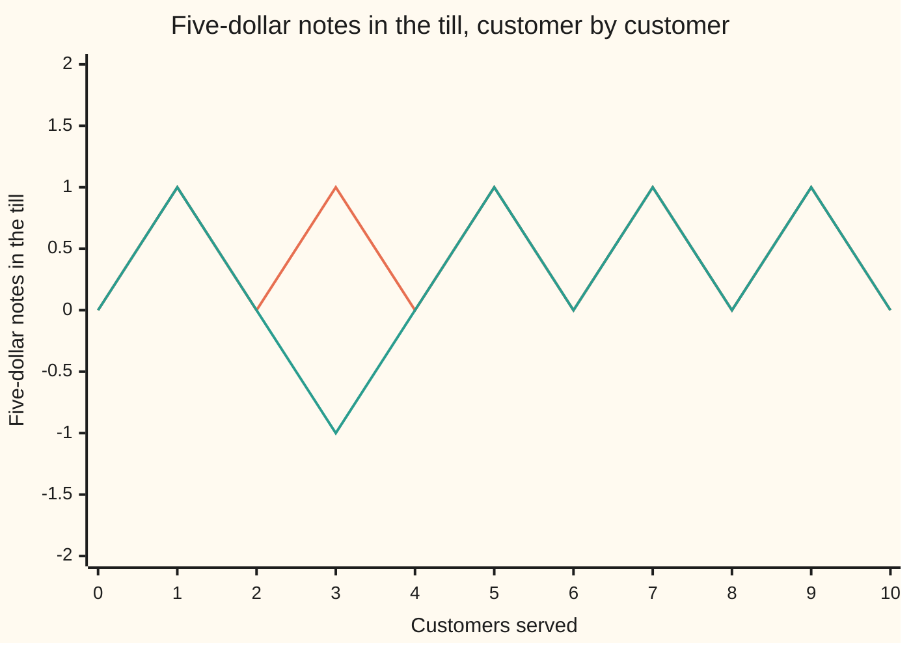
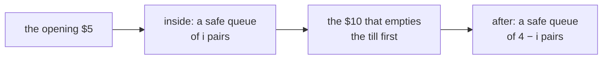

# Catalan numbers: paths that never dip below the start, balanced brackets, and the formula C(2n,n)/(n+1)

Combinatorics and graphs → Lattice Paths and Catalan Numbers → Balanced counts → Catalan numbers

---

## General Overview

A cinema charges $5 a ticket and the cashier's till starts empty. Ten people are in the queue. Five hold a $5 note. Five hold a $10 note and need a $5 back.

A $10 can only be changed out of a $5 already taken, so the order decides whether the line stalls. Five, ten, five, ten is fine. Five, ten, ten is not: the second $10 meets an empty till.

Only the pattern of notes matters, and choosing the five places for the $5 notes fixes it: C(10, 5) = 252 orders, by the choose-count of this wing ([n-choose-k](../01-Counting%20Principles/05-n-choose-k.md)). Of those, 42 never strand the cashier.

Three of each fits in a table: twenty orders, five safe, F for a $5 note and T for a $10. The second column is the same rule in costume, a bracket string where no close comes before its open.

| Safe order | The same rule as brackets |
| --- | --- |
| FFFTTT | ((())) |
| FFTFTT | (()()) |
| FFTTFT | (())() |
| FTFFTT | ()(()) |
| FTFTFT | ()()() |

From zero pairs upward the counts read 1, 1, 2, 5, 14, 42, 132, 429, 1430, 4862 — the **Catalan numbers**, the term used from here on.

**Of the C(2n, n) queues holding n notes of each kind, the ones that never strand the cashier number C(2n, n)/(n + 1): 42 of the 252 when n is 5.**

**What kind of fact this is:** a theorem, proved on this card in Why it works; the sequence of counts it names is a definition.

### The picture: the till, customer by customer



The upper line, F T F T F T F T F T, holds one note or none. The lower line, F T T F F T F T F T, falls to −1 at the third customer — the dip that separates the 42 from the other 210.

---

## The formula

Write Cat(n), read "Catalan of n", for the count of safe queues with n notes of each kind. The letter C is taken: this wing writes C(a, b) for the choose-count.

$$\mathrm{Cat}(n) = \frac{C(2n,\,n)}{n+1}$$

**Read it aloud:** count every order of the two kinds of note, then keep one in every n + 1 of them.

The same count as a subtraction, the form the proof produces:

$$\mathrm{Cat}(n) = C(2n,\,n) - C(2n,\,n+1)$$

**Read it aloud:** all the orders, less the failures, each failure counted in disguise as an order of n + 1 tens and n − 1 fives.

And as a recurrence, a rule reaching a term from earlier terms ([recurrences-and-fibonacci](../05-Recurrences/01-recurrences-and-fibonacci.md)). Sigma, the sign ∑, says add the term once for each whole number i from 0 to n ([binomial-theorem](../03-Binomial%20Coefficients%20and%20Identities/02-binomial-theorem.md)).

$$\mathrm{Cat}(n+1) = \sum_{i=0}^{n} \mathrm{Cat}(i)\,\mathrm{Cat}(n-i), \qquad \mathrm{Cat}(0) = 1$$

**Read it aloud:** split a safe queue at the first moment the till is empty again, then add every way of sharing the pairs between inside and after.

| Symbol | Plain meaning | In our example | Push it up and the answer… |
| --- | --- | --- | --- |
| $n$ | pairs of notes, one $5 and one $10 | 5 pairs, 10 customers | a far larger count |
| $i$ | pairs inside the first split | runs 0 to 4 | — |
| $\mathrm{Cat}(n)$ | safe orders with n of each note | Cat(5) = 42 | — |
| $C(2n,n)$ | every order, safe or not | C(10,5) = 252 | — |
| $C(2n,n+1)$ | orders with one extra ten | C(10,6) = 210 | fewer survive |
| $n+1$ | the divisor | 6 | fewer safe orders |
| $\mathrm{Cat}(0)$ | the empty queue, safe | 1 | — |

### When it holds

- **Equal numbers of the two notes.** Six fives against four tens is the ballot count of [reflection-principle-and-ballot-problem](02-reflection-principle-and-ballot-problem.md), not this one.
- **An empty till at the start.** One $5 already in the drawer rescues some of the 210, and the count is no longer Cat(5).
- **One note of change, exactly.** A customer owed two notes back could empty a till this count calls full.
- **Patterns of notes, not people.** Tell the customers apart and the 42 become 604,800. Cat(5) counts patterns.

---

## Why it works

### Step 0: one running number decides everything

The cashier's fate hangs on one number: the $5 notes in the till, fives taken minus tens served. A $5 customer raises it by one, a $10 lowers it by one, and the queue is safe exactly when it never falls below zero.

Nothing else about the cinema survives. What is left is ten steps, five up and five down, whose running total never dips below the start: the lattice path of this shelf ([lattice-paths](01-lattice-paths.md)), and the bracket strings of the table.

### Step 1: count every order, failures included

There are C(10, 5) = 252 orders in all. The 42 good ones are hard to count head-on: they are good for no single reason. The 210 failures each have a first bad moment, which makes them easy.

### Step 2: disguise each failure as an order of another shape

Take a stranded order and find the first customer the cashier cannot serve, the one where the running count reaches −1. Leave that customer and everyone before untouched; from the next customer on, swap every note, each $5 for a $10 and each $10 for a $5.

At the cut the count stands at −1, so the untouched stretch holds one more ten than fives, and the swap trades the two kinds in the rest. Whichever stranded order went in, six $10 notes and four $5 notes come out.

The move runs backwards. An order of six tens and four fives finishes at −2, and a count moving one step at a time cannot reach −2 without passing −1, so it has a first bad moment too: cut there, swap the tail back. Neither move touches the cut or anything before it, and swapping a tail twice restores it, so the two collections are matched one for one ([bijection-and-double-counting](../02-Repeats%2C%20Groups%20and%20Double%20Counting/05-bijection-and-double-counting.md)). There are C(10, 6) = 210 orders of six tens and four fives, so 210 stranded orders.

<details>
<summary>The same count for any n</summary>

With n notes of each kind the kept stretch still ends at −1, so it holds one more ten than fives. Whatever goes in, an order of n + 1 tens and n − 1 fives comes out, and placing the tens counts those C(2n, n+1) ways.

</details>

### Step 3: subtract, and the divisor appears

252 − 210 = 42. In letters, Cat(n) = C(2n, n) − C(2n, n+1).

That subtraction is a scaling. With factorials, C(2n, n+1) divided by C(2n, n) is n!·n! over (n+1)!·(n−1)!; all but two factors cancel, leaving n/(n + 1). The failures are n of every n + 1 orders, whatever n is:

$$\mathrm{Cat}(n) = C(2n,\,n)\left(1 - \frac{n}{n+1}\right) = \frac{C(2n,\,n)}{n+1}$$

At five pairs, 252 × (1 − 5/6) = 252/6 = 42. The divisor 6 is not fitted to the answer: it is one more than the number of pairs, every time.

### Step 4: a second road, splitting at the first empty till

A safe queue that is not empty starts with a $5 note; a $10 first has nothing to change. At some customer the till is empty for the first time, and that customer holds a $10. Those two notes are one pair of the five; i pairs sit between them, 4 − i follow.



Everything between the two notes is a safe queue of its own: the till never emptied inside, so that stretch never dipped below its own start. Everything after the $10 is another safe queue, from an empty till. In general a queue of n + 1 pairs splits into i inside and n − i after, exactly one way. Adding over i: 1×14 + 1×5 + 2×2 + 5×1 + 14×1 = 42.

A third road packs the whole sequence into one expression and reads the closed form off it in a step: [catalan-generating-function](../07-Generating%20Functions/05-catalan-generating-function.md).

---

## Worked numbers, by hand

The shelf's house example is this queue in path language: of the 252 ten-step paths with five steps up and five down, 42 never dip below the start.

| Step | Arithmetic | Value |
| --- | --- | --- |
| every order of the notes | C(10, 5) | 252 |
| the stranded ones, disguised | C(10, 6) | 210 |
| by subtraction | 252 − 210 | **42** |
| by the closed form | 252 ÷ 6 | **42** |
| by first return | 1×14 + 1×5 + 2×2 + 5×1 + 14×1 | **42** |
| by listing every order | count those that never dip | **42** |

One order in six lets the cashier serve all ten customers; the rest leave someone waiting for change.

### What breaks if you drop a piece

| Mistake | Comes out at | What went wrong |
| --- | --- | --- |
| Dividing by n instead of n + 1 | 50.4 | A count of queues has no decimal point |
| Dropping the never-dip rule | 252 | That counts every order, failures included |
| Reading n as the 10 customers | 16796 | Cat(10) counts a queue of twenty |
| Telling the ten customers apart | 604800 | Each pattern splits 120 × 120 ways |

The code prints all four.

---

## Code, from first principles, and it actually runs

Nothing is imported. Four roads reach the 42, sharing no arithmetic: listing all 252 orders and testing each running till; the closed form, on a choose-count built as a product; the reflection difference, with the swap applied to all 210 stranded orders; and the first-return recurrence, which uses no choose-count.

### Python

```python
# Catalan numbers -- the check behind the card.  Nothing is imported.  Ten people queue for a $5
# ticket, five holding a $5 note (F) and five a $10 note (T), the till empty to start.  The orders
# that never strand the cashier are counted four ways: by listing every order, by the closed form,
# by the reflection difference, and by the first-return recurrence.  A queue of 3 and 3 warms up.
PAIRS, SMALL, GOOD, BAD = 5, 3, "FTFTFTFTFT", "FTTFFTFTFT"
def choose(n, k):                            # C(n, k), from the product formula
    if k < 0 or k > n: return 0
    out = 1
    for i in range(k): out = out * (n - i) // (i + 1)
    return out
def orders(n):                               # every order of n fives and n tens
    words = ("".join("F" if (m >> i) & 1 else "T" for i in range(2 * n)) for m in range(1 << (2 * n)))
    return sorted(w for w in words if w.count("F") == n)
def till(w):                                 # $5 notes in the till after each customer
    out = [0]
    for c in w: out.append(out[-1] + (1 if c == "F" else -1))
    return out
def flip(w):                                 # reflection: swap the notes after the first failure
    cut = min(i for i, h in enumerate(till(w)) if h < 0)
    return w[:cut] + "".join("T" if c == "F" else "F" for c in w[cut:])
def catalan(upto):                           # first return: Cat(n+1) = sum Cat(i) Cat(n-i)
    cat = [1]
    for n in range(upto): cat.append(sum(cat[i] * cat[n - i] for i in range(n + 1)))
    return cat
def factorial(m):                            # 1 x 2 x ... x m
    out = 1
    for i in range(2, m + 1): out *= i
    return out
def row(label, values):
    print(f"{label:<52}" + "".join(f"{v:>3}" for v in values))
N, all5 = 2 * PAIRS, orders(PAIRS)
safe5, bad5 = [w for w in all5 if min(till(w)) >= 0], [w for w in all5 if min(till(w)) < 0]
flipped, safe3 = sorted({flip(w) for w in bad5}), [w for w in orders(SMALL) if min(till(w)) >= 0]
cat, listed = catalan(10), [len([w for w in orders(n) if min(till(w)) >= 0]) for n in range(7)]
closed, refl = choose(N, PAIRS) // (PAIRS + 1), choose(N, PAIRS) - choose(N, PAIRS + 1)
terms = " + ".join(f"{cat[i]}x{cat[PAIRS - 1 - i]}" for i in range(PAIRS))
print(f"{N} in the queue, {PAIRS} with a $5 note and {PAIRS} with a $10 note, ticket $5, till starts empty")
print(f"warm-up with {SMALL} of each: {choose(2 * SMALL, SMALL)} orders in all, {len(safe3)} of them safe")
print(f"the {len(safe3)} safe orders of {SMALL}: " + " ".join(safe3))
row("customers served", list(range(N + 1)))
row(f"safe     {' '.join(GOOD)}, $5 notes in the till", till(GOOD))
row(f"stranded {' '.join(BAD)}, $5 notes in the till", till(BAD))
print(f"road 1, listing every order of {PAIRS} and {PAIRS}: {len(all5)} orders, {len(safe5)} safe, {len(bad5)} stranded")
print(f"road 2, closed form: C({N},{PAIRS})/({PAIRS}+1) = {choose(N, PAIRS)}/{PAIRS + 1} = {closed}")
print(f"road 3, reflection: C({N},{PAIRS}) - C({N},{PAIRS + 1}) = {choose(N, PAIRS)} - {choose(N, PAIRS + 1)} = {refl}")
print(f"the flip turns the {len(bad5)} stranded orders into {len(flipped)} different orders with {PAIRS + 1} tens and {PAIRS - 1} fives, and C({N},{PAIRS + 1}) = {choose(N, PAIRS + 1)} counts those")
print(f"road 4, first return: {terms} = {cat[PAIRS]}")
print("Cat(0) to Cat(9): " + " ".join(str(c) for c in cat[:10]))
print("safe orders by listing, n = 0 to 6: " + " ".join(str(c) for c in listed))
print(f"mistake 1, dividing by n instead of n + 1: {choose(N, PAIRS)}/{PAIRS} = {choose(N, PAIRS) / PAIRS:.1f}, not a whole number")
print(f"mistake 2, dropping the never-negative rule: {len(all5)}")
print(f"mistake 3, n read as the {N} customers, not the {PAIRS} pairs: Cat({N}) = {cat[N]}")
print(f"mistake 4, the {N} customers told apart: {len(safe5)} x {factorial(PAIRS)} x {factorial(PAIRS)} = {len(safe5) * factorial(PAIRS) ** 2}")
assert len(safe5) == closed and closed == refl                      # listing, formula, reflection
assert len(bad5) == choose(N, PAIRS + 1) == len(flipped) and all(w.count("T") == PAIRS + 1 for w in flipped)
assert listed == cat[:7] and cat[PAIRS] == len(safe5)               # recurrence against listing
assert cat[:10] == [1, 1, 2, 5, 14, 42, 132, 429, 1430, 4862]       # the published sequence
print("ALL CHECKS PASS")
```

**Ran 2026-09-14 on macOS, Python 3.14.6, standard library only. All checks passed. Output, pasted from the run:**

```
10 in the queue, 5 with a $5 note and 5 with a $10 note, ticket $5, till starts empty
warm-up with 3 of each: 20 orders in all, 5 of them safe
the 5 safe orders of 3: FFFTTT FFTFTT FFTTFT FTFFTT FTFTFT
customers served                                      0  1  2  3  4  5  6  7  8  9 10
safe     F T F T F T F T F T, $5 notes in the till    0  1  0  1  0  1  0  1  0  1  0
stranded F T T F F T F T F T, $5 notes in the till    0  1  0 -1  0  1  0  1  0  1  0
road 1, listing every order of 5 and 5: 252 orders, 42 safe, 210 stranded
road 2, closed form: C(10,5)/(5+1) = 252/6 = 42
road 3, reflection: C(10,5) - C(10,6) = 252 - 210 = 42
the flip turns the 210 stranded orders into 210 different orders with 6 tens and 4 fives, and C(10,6) = 210 counts those
road 4, first return: 1x14 + 1x5 + 2x2 + 5x1 + 14x1 = 42
Cat(0) to Cat(9): 1 1 2 5 14 42 132 429 1430 4862
safe orders by listing, n = 0 to 6: 1 1 2 5 14 42 132
mistake 1, dividing by n instead of n + 1: 252/5 = 50.4, not a whole number
mistake 2, dropping the never-negative rule: 252
mistake 3, n read as the 10 customers, not the 5 pairs: Cat(10) = 16796
mistake 4, the 10 customers told apart: 42 x 120 x 120 = 604800
ALL CHECKS PASS
```

### Rust

Same numbers, same labels, built with `rustc --edition 2021 -O`.

```rust
// Catalan numbers -- the same check as the Python, in Rust.  No crates.  Ten people queue for a $5
// ticket, five holding a $5 note (F) and five a $10 note (T), the till empty to start.  The orders
// that never strand the cashier are counted four ways: by listing every order, by the closed form,
// by the reflection difference, and by the first-return recurrence.  A queue of 3 and 3 warms up.
const PAIRS: usize = 5; const SMALL: usize = 3; const GOOD: &str = "FTFTFTFTFT"; const BAD: &str = "FTTFFTFTFT";
fn choose(n: u64, k: i64) -> u64 {                 // C(n, k), from the product formula
    if k < 0 || k > n as i64 { return 0 }
    let mut out = 1u64;
    for i in 0..k as u64 { out = out * (n - i) / (i + 1) }
    out
}
fn orders(n: usize) -> Vec<String> {               // every order of n fives and n tens
    let mut out: Vec<String> = Vec::new();
    for m in 0..(1u32 << (2 * n)) {
        let w: String = (0..2 * n).map(|i| if (m >> i) & 1 == 1 { 'F' } else { 'T' }).collect();
        if w.chars().filter(|&c| c == 'F').count() == n { out.push(w) }
    }
    out.sort(); out
}
fn till(w: &str) -> Vec<i32> {                     // $5 notes in the till after each customer
    let mut out = vec![0];
    for c in w.chars() { out.push(out[out.len() - 1] + if c == 'F' { 1 } else { -1 }) }
    out
}
fn low(w: &str) -> i32 { *till(w).iter().min().unwrap() }
fn flip(w: &str) -> String {                       // reflection: swap the notes after the first failure
    let cut = till(w).iter().position(|&h| h < 0).unwrap();
    let (head, tail) = w.split_at(cut);
    head.to_string() + &tail.chars().map(|c| if c == 'F' { 'T' } else { 'F' }).collect::<String>()
}
fn catalan(upto: usize) -> Vec<u64> {              // first return: Cat(n+1) = sum Cat(i) Cat(n-i)
    let mut cat = vec![1u64];
    for n in 0..upto { cat.push((0..=n).map(|i| cat[i] * cat[n - i]).sum()) }
    cat
}
fn factorial(m: u64) -> u64 { (2..=m).fold(1u64, |o, i| o * i) }      // 1 x 2 x ... x m
fn spaced(w: &str) -> String { w.chars().map(|c| c.to_string()).collect::<Vec<String>>().join(" ") }
fn row(label: &str, values: &[i32]) {
    let mut line = format!("{:<52}", label);
    for v in values { line.push_str(&format!("{:>3}", v)) }
    println!("{}", line);
}
fn main() {
    let (n, all5) = (2 * PAIRS, orders(PAIRS));
    let safe5: Vec<&String> = all5.iter().filter(|w| low(w) >= 0).collect();
    let bad5: Vec<&String> = all5.iter().filter(|w| low(w) < 0).collect();
    let mut flipped: Vec<String> = bad5.iter().map(|w| flip(w)).collect();
    flipped.sort(); flipped.dedup();
    let safe3: Vec<String> = orders(SMALL).into_iter().filter(|w| low(w) >= 0).collect();
    let cat = catalan(10);
    let listed: Vec<u64> = (0..7).map(|k| orders(k).iter().filter(|w| low(w) >= 0).count() as u64).collect();
    let central = choose(n as u64, PAIRS as i64);
    let (closed, refl) = (central / (PAIRS as u64 + 1), central - choose(n as u64, PAIRS as i64 + 1));
    let terms: Vec<String> = (0..PAIRS).map(|i| format!("{}x{}", cat[i], cat[PAIRS - 1 - i])).collect();
    let steps: Vec<i32> = (0..=n as i32).collect();
    println!("{} in the queue, {} with a $5 note and {} with a $10 note, ticket $5, till starts empty", n, PAIRS, PAIRS);
    println!("warm-up with {} of each: {} orders in all, {} of them safe", SMALL, choose(2 * SMALL as u64, SMALL as i64), safe3.len());
    println!("the {} safe orders of {}: {}", safe3.len(), SMALL, safe3.join(" "));
    row("customers served", &steps);
    row(&format!("safe     {}, $5 notes in the till", spaced(GOOD)), &till(GOOD));
    row(&format!("stranded {}, $5 notes in the till", spaced(BAD)), &till(BAD));
    println!("road 1, listing every order of {} and {}: {} orders, {} safe, {} stranded", PAIRS, PAIRS, all5.len(), safe5.len(), bad5.len());
    println!("road 2, closed form: C({},{})/({}+1) = {}/{} = {}", n, PAIRS, PAIRS, central, PAIRS + 1, closed);
    println!("road 3, reflection: C({},{}) - C({},{}) = {} - {} = {}", n, PAIRS, n, PAIRS + 1, central, choose(n as u64, PAIRS as i64 + 1), refl);
    println!("the flip turns the {} stranded orders into {} different orders with {} tens and {} fives, and C({},{}) = {} counts those", bad5.len(), flipped.len(), PAIRS + 1, PAIRS - 1, n, PAIRS + 1, choose(n as u64, PAIRS as i64 + 1));
    println!("road 4, first return: {} = {}", terms.join(" + "), cat[PAIRS]);
    println!("Cat(0) to Cat(9): {}", cat[..10].iter().map(|c| c.to_string()).collect::<Vec<String>>().join(" "));
    println!("safe orders by listing, n = 0 to 6: {}", listed.iter().map(|c| c.to_string()).collect::<Vec<String>>().join(" "));
    println!("mistake 1, dividing by n instead of n + 1: {}/{} = {:.1}, not a whole number", central, PAIRS, central as f64 / PAIRS as f64);
    println!("mistake 2, dropping the never-negative rule: {}", all5.len());
    println!("mistake 3, n read as the {} customers, not the {} pairs: Cat({}) = {}", n, PAIRS, n, cat[n]);
    println!("mistake 4, the {} customers told apart: {} x {} x {} = {}", n, safe5.len(), factorial(PAIRS as u64), factorial(PAIRS as u64), safe5.len() as u64 * factorial(PAIRS as u64) * factorial(PAIRS as u64));
    assert!(safe5.len() as u64 == closed && closed == refl);          // listing, formula, reflection
    assert!(bad5.len() as u64 == choose(n as u64, PAIRS as i64 + 1) && bad5.len() == flipped.len()
            && flipped.iter().all(|w| w.chars().filter(|&c| c == 'T').count() == PAIRS + 1));
    assert!(listed == cat[..7].to_vec() && cat[PAIRS] == safe5.len() as u64);   // recurrence against listing
    assert!(cat[..10].to_vec() == vec![1, 1, 2, 5, 14, 42, 132, 429, 1430, 4862]);   // the published sequence
    println!("ALL CHECKS PASS");
}
```

**Ran 2026-09-14 on macOS, rustc 1.98.1, no crates. All checks passed. Output, pasted from the run:**

```
10 in the queue, 5 with a $5 note and 5 with a $10 note, ticket $5, till starts empty
warm-up with 3 of each: 20 orders in all, 5 of them safe
the 5 safe orders of 3: FFFTTT FFTFTT FFTTFT FTFFTT FTFTFT
customers served                                      0  1  2  3  4  5  6  7  8  9 10
safe     F T F T F T F T F T, $5 notes in the till    0  1  0  1  0  1  0  1  0  1  0
stranded F T T F F T F T F T, $5 notes in the till    0  1  0 -1  0  1  0  1  0  1  0
road 1, listing every order of 5 and 5: 252 orders, 42 safe, 210 stranded
road 2, closed form: C(10,5)/(5+1) = 252/6 = 42
road 3, reflection: C(10,5) - C(10,6) = 252 - 210 = 42
the flip turns the 210 stranded orders into 210 different orders with 6 tens and 4 fives, and C(10,6) = 210 counts those
road 4, first return: 1x14 + 1x5 + 2x2 + 5x1 + 14x1 = 42
Cat(0) to Cat(9): 1 1 2 5 14 42 132 429 1430 4862
safe orders by listing, n = 0 to 6: 1 1 2 5 14 42 132
mistake 1, dividing by n instead of n + 1: 252/5 = 50.4, not a whole number
mistake 2, dropping the never-negative rule: 252
mistake 3, n read as the 10 customers, not the 5 pairs: Cat(10) = 16796
mistake 4, the 10 customers told apart: 42 x 120 x 120 = 604800
ALL CHECKS PASS
```

The two outputs match line for line.

> [!TIP]
> **Try changing**
> Guess first, then run it. Each change breaks one road, and one assert stops the program.
> - **Start the till with a $5.** Change `min(till(w)) >= 0` to `>= -1`: more orders get through, and the first assert stops it.
> - **Cut at the wrong moment.** In `flip`, change `h < 0` to `h <= 0`: the cut lands at the start, the swapped orders no longer hold six tens, and the second assert stops it.
> - **Shorten the recurrence.** Change `range(n + 1)` to `range(n)` in `catalan`: later terms come out small, and the third assert stops it.

---

## The usual mistake

> [!warning]
> **Quoting C(2n, n) and forgetting the divisor.** 252 is every order of five fives and five tens, failures included. The safe orders are 42, one in six, and the gap widens with every extra pair.
>
> - **Treating the swapped orders as real queues.** All 210 hold six tens and four fives, so none stood in the cinema. They are a counting device, picked for being easy to count.
> - **Reading n as the number of customers.** Cat(10) = 16796 counts a queue of twenty.
> - **Mixing notes with people.** Count patterns, 42, or named customers, 604,800. Neither answers the other's question.

---

## Where you meet it in real life

- **Brackets, and the stacks that read them.** Five pairs of brackets nest 42 ways, no close before its open. Five pushes and five pops on a stack never popped empty come to the same 42: the till is a stack of $5 notes.
- **Tree shapes.** Branching structures where every fork splits in two are counted by the same sequence, matched to queues in [catalan-bijections](04-catalan-bijections.md).
- **Runs of luck.** A record of coin flips that never falls behind its start is this list of ups and downs, counted in [random-walk-path-counts](05-random-walk-path-counts.md).

> **Say it back**
> Ten people queue for a $5 ticket, five with a $5 note and five with a $10, the till empty. Of the 252 orders, 42 never leave the cashier without change. Every failing order has a first bad moment; swapping the notes after it gives one of the 210 orders holding six tens and four fives. That match runs both ways, so 252 − 210 = 42, which is also C(10, 5)/6.

---

## What this builds on

- [reflection-principle-and-ballot-problem](02-reflection-principle-and-ballot-problem.md): the swap after the first bad moment, and why it counts the failures exactly.

## Where this goes next

- [catalan-bijections](04-catalan-bijections.md): the same 42 counted as trees, triangulated shapes and handshakes.
- [random-walk-path-counts](05-random-walk-path-counts.md): the same steps read as coin flips.
- [catalan-generating-function](../07-Generating%20Functions/05-catalan-generating-function.md): the recurrence solved in one pass.

The recurrence reaches Cat(9) = 4862 only by grinding out every earlier term; turning a recurrence into a formula in one pass is [catalan-generating-function](../07-Generating%20Functions/05-catalan-generating-function.md).

---

## Sources

Verified 14 Sep 2026: every link below resolves to the publisher's page.

- "A000108: Catalan numbers." On-Line Encyclopedia of Integer Sequences. [Sequence page](https://oeis.org/A000108). The first ten counts, with the path and bracket readings.
- Stanley, Richard P. *Catalan Numbers*. Cambridge University Press, 2015. [doi:10.1017/CBO9781139871495](https://doi.org/10.1017/CBO9781139871495). Hundreds of collections counted by this sequence.
- Graham, Ronald L., Donald E. Knuth, and Oren Patashnik. *Concrete Mathematics*, 2nd ed. Addison-Wesley, 1994. [Publisher page](https://www.informit.com/store/concrete-mathematics-a-foundation-for-computer-science-9780201558029). Derives the closed form from the first-return recurrence.
- Brualdi, Richard A. *Introductory Combinatorics*, Classic Version, 5th ed. Pearson. [Publisher page](https://www.pearson.com/en-us/subject-catalog/p/introductory-combinatorics-classic-version/P200000006138/9780137981045). The reflection count in lattice-path language.
