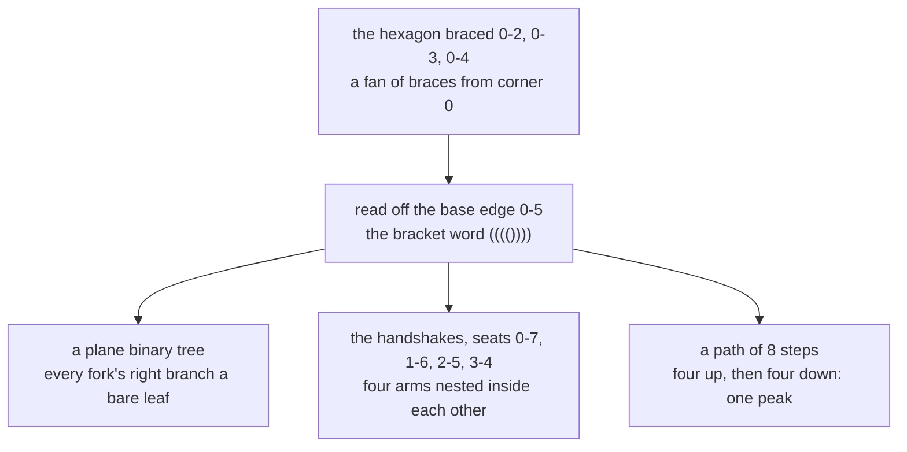

# Catalan everywhere: brackets, mountain ranges, binary trees, polygon triangulations and non-crossing handshakes are the same count

Combinatorics and graphs → Lattice Paths and Catalan Numbers → Structures in disguise → Catalan everywhere

---

## General Overview

A hexagonal tabletop rests on six corners, numbered 0 to 5 round the rim. To stiffen it a joiner runs three straight braces corner to corner, never letting two cross. They cut the hexagon into four triangles, and there are 14 ways to place them.

Eight people sit at that table. On a signal each takes one other person's hand, all at once, no two arms crossing. Again 14 ways.

Nothing about a tabletop resembles a handshake, and the shared 14 is not luck. Both are Cat(4), the Catalan number for four bracket pairs ([catalan-numbers](03-catalan-numbers.md)). This card writes the recipes that carry a bracing to a handshake pattern and back, and on to three more collections: those bracket words, the never-dipping paths of the last card, and branching shapes called plane binary trees.

**Five collections of unlike things carry one count because explicit recipes match them up one for one, so any structure that splits the way a bracket word splits is counted by Cat(n).**

**What kind of fact this is:** a theorem — the five counts are equal, proved on this card in Why it works; each recipe is a method, run on one object by hand.

### The picture: one object, five costumes



The bracket word is the common currency; every arrow reverses.

---

## The formula

Notation first, in words. Cat(n) is the Catalan number at size n, as on the previous card, and upright bars round a collection count its members. Four letters cover five families: words and paths are the same objects relabelled.

$$\lvert D_n\rvert = \lvert T_n\rvert = \lvert G_n\rvert = \lvert H_n\rvert = \mathrm{Cat}(n)$$

**Read it aloud:** at one size those four collections hold the same number of things, the Catalan number. The tabletop is size 4: 6 corners, 8 seats, all counts 14.

A word becomes a tree by cutting at the **first return**, where its opening bracket meets its partner: that bracket, a stretch P, the partner, then the rest Q.

$$\mathrm{tree}\big(\texttt{(}P\texttt{)}Q\big) = \big(\mathrm{tree}(P),\ \mathrm{tree}(Q)\big), \qquad \mathrm{tree}(\text{the empty word}) = \text{a bare leaf}$$

One fork, the inside hanging left, the rest hanging right.

A cut polygon becomes a word the same way. Corners $a$ and $b$ end the edge being read, and the triangle on it points at a third corner $c$ between them, its **apex**:

$$\mathrm{word}(a,b) = \texttt{(}\,\mathrm{word}(a,c)\,\texttt{)}\,\mathrm{word}(c,b), \qquad \mathrm{word}(a,\,a{+}1) = \text{the empty word}$$

One pair of brackets for that triangle, round the left piece's word, then the right piece's word; a plain side carries nothing.

The third recipe needs no formula: a seat opens when its partner sits further round, closes otherwise. Read from the base edge, the braces 0-2, 0-3, 0-4 and the handshakes 0-7, 1-6, 2-5, 3-4 both give (((()))).

| Symbol | Plain meaning | In our example | Push it up and the answer… |
| --- | --- | --- | --- |
| $n$ | the size: bracket pairs, forks, triangles | 4 | all counts climb |
| $\mathrm{Cat}(n)$ | the Catalan number of that size | 14 | — |
| $D_n$ | bracket words of n pairs, or paths of 2n steps that never dip | 14 | — |
| $T_n$ | plane binary trees with n forks | 14 | — |
| $G_n$ | cuttings of a polygon of n + 2 corners | 14 | — |
| $H_n$ | handshakes among 2n seats, none crossing | 14 | — |
| $P$, $Q$ | the word inside the first pair, and the word after it | ((())) and empty | — |
| $a$, $b$ | the ends of the edge being read | 0 and 5 | — |
| $c$ | the apex on that edge | 1, 2, 3 or 4 | — |

### When it holds

- **The sizes line up.** n pairs, n forks, n + 2 corners, 2n seats; a hexagon is size 4, not 6.
- **The polygon is convex.** A dent can hide the triangle the recipe reads.
- **The trees are plane:** left and right told apart. Swap a fork's branches freely and 14 shapes collapse to 3.
- **Each recipe runs both ways.** A one-way rule gives half an equality.

---

## Why it works

### Step 0: to prove two counts equal, match the things

Comparing two counts says nothing about why they agree. A recipe that turns each member of one into one member of the other and can be undone settles it: the members come in pairs. That is a bijection ([bijection-and-double-counting](../02-Repeats%2C%20Groups%20and%20Double%20Counting/05-bijection-and-double-counting.md)).

### Step 1: the first return cuts a word into a fork

Read each opening bracket as a step up and each closing as a step down: a word of 4 pairs is a path of 8 steps ending level, a mountain range, and never dipping is never closing a bracket that was not opened.

A non-empty word opens with a bracket whose partner is the first return. That splits the rest into the stretch inside the pair and the stretch after, both words themselves. Hang the inside left of a fork and the rest right: the word is a plane binary tree. The undo writes a fork back as an opening bracket, the left branch, a closing bracket, the right branch; each step is forced, so the two directions undo each other.

### Step 2: the base edge's triangle cuts a polygon in two

Take corner 0 to corner 5 as the base edge. Exactly one triangle stands on it; its third corner is the apex, and it splits the rest of the hexagon into two smaller polygons already cut by the remaining braces. The fan 0-2, 0-3, 0-4 takes apexes 4, 3, 2 and 1 in turn, and reads (((()))): four triangles nested one inside the next.

<details>
<summary>Detailed proof: the polygon recipe runs both ways</summary>

**Forward.** A piece runs from corner $a$ to corner $b$ along the rim. If $b$ is $a + 1$ its word is empty; otherwise the base triangle's apex $c$ splits it into two pieces with fewer corners, so the recipe ends. A piece of k corners gives k − 2 pairs, so the hexagon gives 4.

**Backward.** A word of 4 pairs splits at the first bracket's partner into an inside word of i pairs and one of 3 − i after. Put the apex at corner i + 1, draw the two braces where they are not already sides, repeat inside each piece. No brace crosses another, each lying inside a piece no earlier brace enters.

**They undo each other.** Both act on the base edge and its apex, so both cut at the same triangle: a two-sided inverse pairs the collections off exactly.

</details>

### Step 3: a handshake pattern read as opens and closes

Number the seats 0 to 7. A seat opens when its partner sits later, closes otherwise. Every close has its open before it, so the word never dips — true of any pairing, crossing or not.

Non-crossing is what makes it reversible: the partner of a close is then the most recent open still waiting, since an open between the two left unmatched would have to reach past the close and cross it. So the undo pairs off the most recent open at every close and hands back the chords the word came from. Let arms cross and two patterns can share one word: 105 pairings onto 14.

### Step 4: one splitting rule under all five

Every recipe is one sentence in a new accent: a pair, a fork, a base triangle, seat 0's chord, each holding two smaller copies of its kind. That is the Catalan recurrence of the previous card, and why a structure splitting this way is Catalan without further argument.

Sorting the 14 cuttings by their base triangle's apex shows the split at work: 5, 2, 2, 5, which is Cat(0)×Cat(3), Cat(1)×Cat(2), Cat(2)×Cat(1) and Cat(3)×Cat(0).

---

## Worked numbers, by hand

| Step | Arithmetic | Value |
| --- | --- | --- |
| brace the hexagon, shake hands | three non-crossing braces; four non-crossing chords | **14** |
| write every word, grow every tree | 8 marks, 4 opens, never dipping; 4 forks | **14** |
| the closed form | C(8, 4) = 70, divided by 4 + 1 | **14** |
| the fan 0-2, 0-3, 0-4, and the handshakes 0-7, 1-6, 2-5, 3-4 | read from the base edge 0-5 | (((()))) |
| split by the apex | 5 + 2 + 2 + 5 | **14** |
| the shelf's 10-step paths | of 252 level words, those that never dip | **42** |

Five unlike collections share one count, and the recipes say which member answers to which.

### What breaks if you drop a piece

| Mistake | Comes out at | What went wrong |
| --- | --- | --- |
| A hexagon read as size 6 | 132 | The size counts pairs; a hexagon is 4 + 2 corners |
| Arms allowed to cross | 105 | Every pairing of 8 people, crossings included |
| A fork's branches treated as alike | 3 | Plane trees tell left from right |
| Every word with four opens, dips included | 70 | The count before the never-dip rule |

The code prints all four.

---

## Code, from first principles, and it actually runs

Nothing is imported. Each family is built by its own rule, no formula: words filtered by a running height, then again by deleting `()` until nothing is left; trees grown fork by fork; cuttings from every subset of the hexagon's diagonals; handshakes from every pairing of the seats. The recipes are the second road, carrying cuttings and handshakes to words, and words to trees and back.

### Python

```python
# Catalan bijections -- the check behind the card.  Nothing is imported.  At size 4 five families are counted
# separately, each by its own rule: 8-step paths that never dip, bracket words that cancel away, plane binary
# trees, cuttings of a hexagon, handshakes among 8 with no arms crossing.  The recipes then carry each across.
dips = lambda w: min([0] + [2 * w[:i].count("(") - i for i in range(1, len(w) + 1)]) < 0
cancels = lambda w: cancels(w.replace("()", "")) if "()" in w else w == ""
cross = lambda p, q: p[0] < q[0] < p[1] < q[1] or q[0] < p[0] < q[1] < p[1]
untree = lambda t: "" if t is None else "(" + untree(t[0]) + ")" + untree(t[1])
fold = lambda t: "." if t is None else "(" + "".join(sorted([fold(t[0]), fold(t[1])])) + ")"
shakeword = lambda p, k: "".join("(" if i in {a for a, _ in p} else ")" for i in range(k))
fact = lambda j: 1 if j == 0 else j * fact(j - 1)
cat = lambda j: fact(2 * j) // fact(j) ** 2 // (j + 1)
yn = lambda c: "yes" if c else "no"
def grow(n):                                   # rule three: plane binary trees, grown as trees
    return [None] if n == 0 else [(l, r) for i in range(n) for l in grow(i) for r in grow(n - 1 - i)]
def tree(w):                                   # a bracket word -> a tree, cut at the first return
    if w == "": return None
    i = next(j for j in range(len(w)) if 2 * w[:j + 1].count("(") == j + 1)
    return tree(w[1:i]), tree(w[i + 1:])
def cuttings(m):                               # rule four: sets of m-3 diagonals, none crossing
    ds = [(a, b) for a in range(m) for b in range(a + 2, m) if (a, b) != (0, m - 1)]
    sub = ([ds[i] for i in range(len(ds)) if j >> i & 1] for j in range(1 << len(ds)))
    return [p for p in sub if len(p) == m - 3 and not any(cross(x, y) for x in p for y in p)]
def apex(cut, m, a, b):                        # the corner the triangle on edge a-b points at
    side = lambda p, q: q == p + 1 or (p, q) in cut or (p, q) == (0, m - 1)
    return next(c for c in range(a + 1, b) if side(a, c) and side(c, b))
def cutword(cut, m, a, b):                     # one piece of the cut polygon, read as brackets
    if b == a + 1: return ""
    c = apex(cut, m, a, b); return "(" + cutword(cut, m, a, c) + ")" + cutword(cut, m, c, b)
def pairings(s):                               # rule five: every pairing of the seats, crossings and all
    return [()] if not s else [((s[0], b),) + r for i, b in enumerate(s[1:]) for r in pairings(s[1:i + 1] + s[i + 2:])]
def census(n):                                 # the five families at size n, each on its own terms
    ws = ["".join("()"[j >> i & 1] for i in range(2 * n)) for j in range(1 << (2 * n))]
    level = [w for w in ws if w.count("(") == n]
    sh = [p for p in pairings(tuple(range(2 * n))) if not any(cross(x, y) for x in p for y in p)]
    return level, [w for w in level if not dips(w)], [w for w in ws if cancels(w)], grow(n), cuttings(n + 2), sh
level, dyck, brack, forest, cuts, shakes = census(4); l5, d5, b5, f5, c5, s5 = census(5)   # and the case at five pairs
fan, nest = [(0, 2), (0, 3), (0, 4)], [(0, 7), (1, 6), (2, 5), (3, 4)]   # one named cutting, one named handshake
cw, sw = sorted(cutword(c, 6, 0, 5) for c in cuts), sorted(shakeword(p, 8) for p in shakes)
back, ds, byapex = sorted(untree(t) for t in forest), sorted(dyck), [sum(1 for c in cuts if apex(c, 6, 0, 5) == j + 1) for j in range(4)]
print("size 4: a hexagon, corners 0 to 5, base edge 0-5, 3 diagonals, 4 triangles; 8 seats; 8 steps")
print(f"words of 8 marks with 4 opens: {len(level)}; of those, never dipping below the start: {len(dyck)}")
print(f"each family by its own rule -- paths {len(dyck)}, words that cancel away {len(brack)}, trees {len(forest)}, "
      f"cuttings {len(cuts)}, handshakes {len(shakes)}; and by the closed form, {len(level)} divided by 4 + 1 = {cat(4)}")
print(f"the {cat(4)} bracket words in order: {' '.join(ds)}")
print(f"word -> tree -> word returns every one of them: {yn(all(untree(tree(w)) == w for w in dyck))}; the {len(forest)} "
      f"grown trees give back those same {cat(4)} words: {yn(back == ds)}; the fan cut from corner 0, diagonals {fan}, "
      f"reads {cutword(fan, 6, 0, 5)}, and so do the nested handshakes {nest}: {yn(shakeword(nest, 8) == cutword(fan, 6, 0, 5))}")
print(f"every cutting's word, and every handshake's word, lands on all {cat(4)}, one apiece: {yn(cw == ds)} and {yn(sw == ds)}")
print(f"the {cat(4)} cuttings by the corner the base triangle points at (1, 2, 3, 4): {byapex}; Cat(i) x Cat(3-i): {[cat(i) * cat(3 - i) for i in range(4)]}")
print(f"at size 5, the shelf's 10-step paths: {len(l5)} words come back level, {len(d5)} never dip, and paths, "
      f"words, trees, cuttings of a 7-gon, handshakes among 10 count {len(d5)}, {len(b5)}, {len(f5)}, {len(c5)}, {len(s5)}")
print(f"mistake 1, a hexagon read as size 6: {cat(6)}, not {cat(4)}; mistake 2, arms allowed to cross: "
      f"{len(pairings(tuple(range(8))))} pairings of 8 people, not {len(shakes)}")
print(f"mistake 3, both branches of every fork swapped freely: {len({fold(t) for t in forest})} shapes, not "
      f"{len(forest)}; mistake 4, every word with 4 opens, dips included: {len(level)}, not {len(dyck)}")
assert len(dyck) == len(brack) == len(forest) == len(cuts) == len(shakes) == cat(4) and len(level) == fact(8) // fact(4) ** 2
assert cw == ds and sw == ds and back == ds and all(untree(tree(w)) == w for w in dyck)
assert fan in cuts and tuple(nest) in shakes and cutword(fan, 6, 0, 5) == shakeword(nest, 8) and all(shakeword(p, 8) in ds for p in pairings(tuple(range(8))))
assert byapex == [cat(i) * cat(3 - i) for i in range(4)] and len(d5) == len(b5) == len(f5) == len(c5) == len(s5) == cat(5)
print("ALL CHECKS PASS")
```

**Ran 2026-09-14 on macOS, Python 3.14.6, standard library only. All checks passed. Output, pasted from the run:**

```
size 4: a hexagon, corners 0 to 5, base edge 0-5, 3 diagonals, 4 triangles; 8 seats; 8 steps
words of 8 marks with 4 opens: 70; of those, never dipping below the start: 14
each family by its own rule -- paths 14, words that cancel away 14, trees 14, cuttings 14, handshakes 14; and by the closed form, 70 divided by 4 + 1 = 14
the 14 bracket words in order: (((()))) ((()())) ((())()) ((()))() (()(())) (()()()) (()())() (())(()) (())()() ()((())) ()(()()) ()(())() ()()(()) ()()()()
word -> tree -> word returns every one of them: yes; the 14 grown trees give back those same 14 words: yes; the fan cut from corner 0, diagonals [(0, 2), (0, 3), (0, 4)], reads (((()))), and so do the nested handshakes [(0, 7), (1, 6), (2, 5), (3, 4)]: yes
every cutting's word, and every handshake's word, lands on all 14, one apiece: yes and yes
the 14 cuttings by the corner the base triangle points at (1, 2, 3, 4): [5, 2, 2, 5]; Cat(i) x Cat(3-i): [5, 2, 2, 5]
at size 5, the shelf's 10-step paths: 252 words come back level, 42 never dip, and paths, words, trees, cuttings of a 7-gon, handshakes among 10 count 42, 42, 42, 42, 42
mistake 1, a hexagon read as size 6: 132, not 14; mistake 2, arms allowed to cross: 105 pairings of 8 people, not 14
mistake 3, both branches of every fork swapped freely: 3 shapes, not 14; mistake 4, every word with 4 opens, dips included: 70, not 14
ALL CHECKS PASS
```

### Rust

Same numbers, same labels, built with `rustc --edition 2021 -O`.

```rust
// Catalan bijections -- the same check as the Python, in Rust.  No crates.  At size 4 five families are counted
// separately, each by its own rule: 8-step paths that never dip, bracket words that cancel away, plane binary
// trees, cuttings of a hexagon, handshakes among 8 with no arms crossing.  The recipes then carry each across.
#[derive(Clone)] enum T { Leaf, Fork(Box<T>, Box<T>) }
type P = (usize, usize);
fn dips(w: &str) -> bool { let (mut h, mut lo) = (0i32, 0i32); for c in w.bytes() { h += if c == b'(' { 1 } else { -1 }; if h < lo { lo = h } } lo < 0 }
fn cancels(w: &str) -> bool { let mut w = w.to_string(); while let Some(i) = w.find("()") { w.replace_range(i..i + 2, "") } w.is_empty() }
fn cross(p: P, q: P) -> bool { (p.0 < q.0 && q.0 < p.1 && p.1 < q.1) || (q.0 < p.0 && p.0 < q.1 && q.1 < p.1) }
fn untree(t: &T) -> String { match t { T::Leaf => String::new(), T::Fork(l, r) => format!("({}){}", untree(l), untree(r)) } }
fn fold(t: &T) -> String { match t { T::Leaf => ".".to_string(), T::Fork(l, r) => { let (a, b) = (fold(l), fold(r)); if a <= b { format!("({}{})", a, b) } else { format!("({}{})", b, a) } } } }
fn shakeword(p: &[P], k: usize) -> String { (0..k).map(|i| if p.iter().any(|&(a, _)| a == i) { '(' } else { ')' }).collect() }
fn fact(j: u64) -> u64 { if j == 0 { 1 } else { j * fact(j - 1) } }
fn cat(j: u64) -> u64 { fact(2 * j) / (fact(j) * fact(j)) / (j + 1) }
fn yn(c: bool) -> &'static str { if c { "yes" } else { "no" } }
fn sorted(mut v: Vec<String>) -> Vec<String> { v.sort(); v }
fn grow(n: usize) -> Vec<T> {                  // rule three: plane binary trees, grown as trees
    if n == 0 { return vec![T::Leaf] }         // a fork for every split of n - 1 between the two branches
    let mut out = Vec::new();
    for i in 0..n { for l in grow(i) { for r in grow(n - 1 - i) { out.push(T::Fork(Box::new(l.clone()), Box::new(r))) } } } out
}
fn tree(w: &str) -> T {                        // a bracket word -> a tree, cut at the first return
    if w.is_empty() { return T::Leaf }         let (b, mut h, mut i) = (w.as_bytes(), 0i32, 0usize);
    for j in 0..b.len() { h += if b[j] == b'(' { 1 } else { -1 }; if h == 0 { i = j; break } }
    T::Fork(Box::new(tree(&w[1..i])), Box::new(tree(&w[i + 1..])))
}
fn cuttings(m: usize) -> Vec<Vec<P>> {         // rule four: sets of m-3 diagonals, none crossing
    let ds: Vec<P> = (0..m).flat_map(|a| (a + 2..m).map(move |b| (a, b))).filter(|&d| d != (0, m - 1)).collect();
    (0..(1u32 << ds.len())).map(|j| (0..ds.len()).filter(|i| j >> i & 1 == 1).map(|i| ds[i]).collect::<Vec<P>>())
        .filter(|p| p.len() == m - 3 && !p.iter().any(|&x| p.iter().any(|&y| cross(x, y)))).collect()
}
fn apex(cut: &[P], m: usize, a: usize, b: usize) -> usize {     // the corner the triangle on edge a-b points at
    let side = |p: usize, q: usize| q == p + 1 || cut.contains(&(p, q)) || (p, q) == (0, m - 1);
    (a + 1..b).find(|&c| side(a, c) && side(c, b)).unwrap()
}
fn cutword(cut: &[P], m: usize, a: usize, b: usize) -> String {  // one piece of the cut polygon, read as brackets
    if b == a + 1 { return String::new() }
    let c = apex(cut, m, a, b); format!("({}){}", cutword(cut, m, a, c), cutword(cut, m, c, b))
}
fn pairings(s: &[usize]) -> Vec<Vec<P>> {      // rule five: every pairing of the seats, crossings and all
    if s.is_empty() { return vec![Vec::new()] }  let mut out = Vec::new();   // the lowest free seat takes each partner
    for i in 1..s.len() { let mut rest = s[1..i].to_vec(); rest.extend_from_slice(&s[i + 1..]);
        for mut r in pairings(&rest) { r.insert(0, (s[0], s[i])); out.push(r) } }
    out
}
fn census(n: usize) -> (Vec<String>, Vec<String>, usize, Vec<T>, Vec<Vec<P>>, Vec<Vec<P>>) {
    let ws: Vec<String> = (0..(1u32 << (2 * n))).map(|j| (0..2 * n).map(|i| if j >> i & 1 == 1 { ')' } else { '(' }).collect()).collect();
    let level: Vec<String> = ws.iter().filter(|w| w.matches('(').count() == n).cloned().collect();
    let sh: Vec<Vec<P>> = pairings(&(0..2 * n).collect::<Vec<usize>>()).into_iter().filter(|p| !p.iter().any(|&x| p.iter().any(|&y| cross(x, y)))).collect();
    (level.clone(), level.iter().filter(|w| !dips(w)).cloned().collect(), ws.iter().filter(|w| cancels(w)).count(), grow(n), cuttings(n + 2), sh)
}
fn main() {
    let (level, dyck, brack, forest, cuts, shakes) = census(4);
    let (l5, d5, b5, f5, c5, s5) = census(5);  // the second worked case, at five pairs
    let (fan, nest): (Vec<P>, Vec<P>) = (vec![(0, 2), (0, 3), (0, 4)], vec![(0, 7), (1, 6), (2, 5), (3, 4)]);
    let (cw, sw) = (sorted(cuts.iter().map(|c| cutword(c, 6, 0, 5)).collect()), sorted(shakes.iter().map(|p| shakeword(p, 8)).collect()));
    let (back, ds) = (sorted(forest.iter().map(untree).collect()), sorted(dyck.clone()));
    let (byapex, prods): (Vec<u64>, Vec<u64>) = ((1..=4).map(|j| cuts.iter().filter(|c| apex(c, 6, 0, 5) == j).count() as u64).collect(), (0..4u64).map(|i| cat(i) * cat(3 - i)).collect());
    let mut shapes = sorted(forest.iter().map(fold).collect()); shapes.dedup();
    println!("size 4: a hexagon, corners 0 to 5, base edge 0-5, 3 diagonals, 4 triangles; 8 seats; 8 steps");
    println!("words of 8 marks with 4 opens: {}; of those, never dipping below the start: {}", level.len(), dyck.len());
    println!("each family by its own rule -- paths {}, words that cancel away {}, trees {}, cuttings {}, handshakes {}; \
and by the closed form, {} divided by 4 + 1 = {}", dyck.len(), brack, forest.len(), cuts.len(), shakes.len(), level.len(), cat(4));
    println!("the {} bracket words in order: {}", cat(4), ds.join(" "));
    println!("word -> tree -> word returns every one of them: {}; the {} grown trees give back those same {} words: {}; \
the fan cut from corner 0, diagonals {:?}, reads {}, and so do the nested handshakes {:?}: {}", yn(dyck.iter().all(|w| untree(&tree(w)) == *w)),
             forest.len(), cat(4), yn(back == ds), fan, cutword(&fan, 6, 0, 5), nest, yn(shakeword(&nest, 8) == cutword(&fan, 6, 0, 5)));
    println!("every cutting's word, and every handshake's word, lands on all {}, one apiece: {} and {}", cat(4), yn(cw == ds), yn(sw == ds));
    println!("the {} cuttings by the corner the base triangle points at (1, 2, 3, 4): {:?}; Cat(i) x Cat(3-i): {:?}", cat(4), byapex, prods);
    println!("at size 5, the shelf's 10-step paths: {} words come back level, {} never dip, and paths, words, trees, \
cuttings of a 7-gon, handshakes among 10 count {}, {}, {}, {}, {}", l5.len(), d5.len(), d5.len(), b5, f5.len(), c5.len(), s5.len());
    println!("mistake 1, a hexagon read as size 6: {}, not {}; mistake 2, arms allowed to cross: {} pairings of 8 people, not {}",
             cat(6), cat(4), pairings(&(0..8).collect::<Vec<usize>>()).len(), shakes.len());
    println!("mistake 3, both branches of every fork swapped freely: {} shapes, not {}; mistake 4, every word with 4 opens, \
dips included: {}, not {}", shapes.len(), forest.len(), level.len(), dyck.len());
    assert!(dyck.len() == brack && brack == forest.len() && forest.len() == cuts.len() && cuts.len() == shakes.len() && shakes.len() as u64 == cat(4) && level.len() as u64 == fact(8) / (fact(4) * fact(4)));
    assert!(cw == ds && sw == ds && back == ds && dyck.iter().all(|w| untree(&tree(w)) == *w));
    assert!(cuts.contains(&fan) && shakes.contains(&nest) && cutword(&fan, 6, 0, 5) == shakeword(&nest, 8) && pairings(&(0..8).collect::<Vec<usize>>()).iter().all(|p| ds.contains(&shakeword(p, 8))));
    assert!(byapex == prods && d5.len() == b5 && b5 == f5.len() && f5.len() == c5.len() && c5.len() == s5.len() && s5.len() as u64 == cat(5));
    println!("ALL CHECKS PASS");
}
```

**Ran 2026-09-14 on macOS, rustc 1.98.1, no crates. All checks passed. Output, pasted from the run:**

```
size 4: a hexagon, corners 0 to 5, base edge 0-5, 3 diagonals, 4 triangles; 8 seats; 8 steps
words of 8 marks with 4 opens: 70; of those, never dipping below the start: 14
each family by its own rule -- paths 14, words that cancel away 14, trees 14, cuttings 14, handshakes 14; and by the closed form, 70 divided by 4 + 1 = 14
the 14 bracket words in order: (((()))) ((()())) ((())()) ((()))() (()(())) (()()()) (()())() (())(()) (())()() ()((())) ()(()()) ()(())() ()()(()) ()()()()
word -> tree -> word returns every one of them: yes; the 14 grown trees give back those same 14 words: yes; the fan cut from corner 0, diagonals [(0, 2), (0, 3), (0, 4)], reads (((()))), and so do the nested handshakes [(0, 7), (1, 6), (2, 5), (3, 4)]: yes
every cutting's word, and every handshake's word, lands on all 14, one apiece: yes and yes
the 14 cuttings by the corner the base triangle points at (1, 2, 3, 4): [5, 2, 2, 5]; Cat(i) x Cat(3-i): [5, 2, 2, 5]
at size 5, the shelf's 10-step paths: 252 words come back level, 42 never dip, and paths, words, trees, cuttings of a 7-gon, handshakes among 10 count 42, 42, 42, 42, 42
mistake 1, a hexagon read as size 6: 132, not 14; mistake 2, arms allowed to cross: 105 pairings of 8 people, not 14
mistake 3, both branches of every fork swapped freely: 3 shapes, not 14; mistake 4, every word with 4 opens, dips included: 70, not 14
ALL CHECKS PASS
```

The two outputs match line for line.

> [!TIP]
> **Try changing**
> Guess first, then run it. The asserts are pinned to the hexagon and eight seats, so expect one to stop.
> - **Move up a size.** Put `census(6)` for `census(4)`, and `8, 0, 7` for every `6, 0, 5`: every family reaches 132.
> - **Allow the arms to cross.** Drop the crossing filter from the handshakes in `census`: the count jumps to 105.
> - **Forget left from right.** Replace `untree` with `fold`, which sorts a fork's branches: the 14 words collapse to 3.

---

## The usual mistake

> [!warning]
> **Admiring the shared count instead of writing down the recipe.** Equal sizes are a fact; a recipe carrying each brace pattern to one handshake pattern and back is a tool, and it works where neither count is known.
>
> - **Counting corners instead of pairs.** A hexagon is size 4, not 6; read as 6 it gives 132.
> - **Letting the arms cross.** Every way 8 people pair off numbers 105; only the 14 without crossings are Catalan.
> - **Expecting one recipe to cover every family.** Each pair of collections needs its own; only the splitting rule is shared.

---

## Where you meet it in real life

- **Compilers and calculators.** An expression parses into a tree by the first-return cut of Step 1, so one with n operations has Cat(n) shapes.
- **Molecular biology.** RNA folds by pairing bases; when every base pairs, the patterns with no two arcs crossing are the handshakes of Step 3.
- **The rest of this shelf.** A word is also a legal run of pushes and pops on a stack, its height the walk of [lattice-paths](01-lattice-paths.md). The mirror argument behind the count is [reflection-principle-and-ballot-problem](02-reflection-principle-and-ballot-problem.md); the same paths as coin flips, [random-walk-path-counts](05-random-walk-path-counts.md).

> **Say it back**
> A hexagon braced into triangles 14 ways, eight people shaking hands without crossing arms 14 ways, and 14 bracket words of four pairs are one fact, not three. A word splits at its first return, a tree into two branches, a cut polygon at its base triangle, a handshake at seat 0's chord. Each split is the same sentence, so a recipe carries any object to any other and back. The shared count is Cat(n): 14 at size 4, 42 at size 5.

---

## What this builds on

- [catalan-numbers](03-catalan-numbers.md): the count, its closed form, and the splitting recurrence every recipe here reproduces.

## Where this goes next

The recipes leave size open: five collections are proved equal without saying how fast the shared count grows, which packing the sequence into one expression settles ([catalan-generating-function](../07-Generating%20Functions/05-catalan-generating-function.md)).

---

## Sources

Verified 14 Sep 2026: every link below resolves to the publisher's page.

- Stanley, Richard P. *Catalan Numbers*. Cambridge University Press, 2015. [doi:10.1017/CBO9781139871495](https://doi.org/10.1017/CBO9781139871495). Two hundred and fourteen collections counted by these numbers, with recipes between many.
- Stanley, Richard P. *Enumerative Combinatorics*, Volume 2. Cambridge University Press, 1999. [doi:10.1017/CBO9780511609589](https://doi.org/10.1017/CBO9780511609589). Exercise 6.19 lists sixty-six of them.
- Olver, F. W. J., et al., eds. "Lattice Paths: Catalan Numbers." *NIST Digital Library of Mathematical Functions*, section 26.5. [dlmf.nist.gov/26.5](https://dlmf.nist.gov/26.5). Closed form, splitting recurrence, index convention.
- Sloane, N. J. A., et al. "A000108: Catalan numbers." *The On-Line Encyclopedia of Integer Sequences*. [oeis.org/A000108](https://oeis.org/A000108). The sequence and what it counts.
