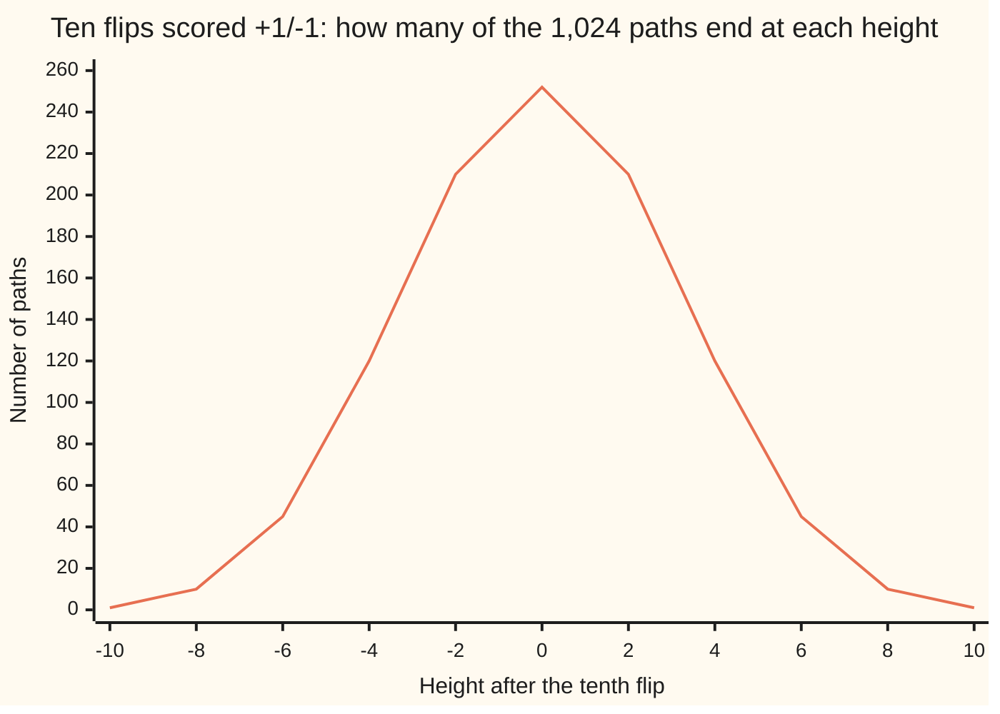

# Counting coin-flip paths: how many end at a given height, how many return to zero, how many never touch it

Combinatorics and graphs → Lattice Paths and Catalan Numbers → Heights, returns and excursions → Counting coin-flip paths

---

## General Overview

Flip a coin ten times and write the run down: H T T H H H T H T T. Score every head +1 and every tail −1, then keep a running total. It opens at zero, steps up or down by one at each flip, and after the tenth stands somewhere between −10 and +10. That run of totals is a **path**, the word used from here on.

Ten flips fall 1,024 ways. Four counts inside those 1,024 do most of the work. 252 paths end level, back at zero, and 210 end at +2. Of the 252 that end level, 42 never once dip below zero, and only 14 stay strictly above zero from the first flip to the ninth.

No coin has to be thrown to get those numbers. A path is fixed by which flips came up heads and by nothing else, so counting paths is counting sets of flips, and the ending height says how many heads there were.

**The ending height fixes the head count, so the paths finishing there number C(n, (n+h)/2); ruling out the paths that dip below zero divides that count down to a Catalan number.**

**What kind of fact this is:** a theorem, proved on this card in Why it works.

### The picture: where 1,024 paths finish



Odd heights are missing on purpose: ten flips cannot finish at an odd total.

---

## The formula

Notation first, in words. $n$ is the number of flips, $h$ the height the path ends at, $u$ how many flips came up heads. C(n, k) in brackets is the count of ways to choose k things from n, read "n choose k". A Catalan number keeps the shelf's notation, Cat(m) ([catalan-numbers](03-catalan-numbers.md)).

$$P(n, h) \;=\; C\!\left(n,\ \frac{n + h}{2}\right)$$

**Read it aloud:** count the paths ending at a height by choosing which flips were heads, and the height fixes how many heads that is.

Set the height to zero with an even flip count $n = 2m$, and the path is back where it started:

$$P(2m,\ 0) \;=\; C(2m,\ m)$$

Of those returns, the ones that never drop below zero and the ones that stay strictly above zero in between are two neighbouring Catalan numbers:

$$\text{never below zero} = \mathrm{Cat}(m) = \frac{C(2m,\ m)}{m+1}, \qquad \text{strictly above zero} = \mathrm{Cat}(m-1)$$

| Symbol | Plain meaning | In our example | Push it up and the answer… |
| --- | --- | --- | --- |
| $n$ | flips in the path, one step each | 10 | more paths, spread wider |
| $h$ | the height the path ends at | 0, or +2 | falls away from zero |
| $u$ | flips that came up heads | 5 to end level, 6 for +2 | the ending height rises |
| $m$ | half the flips, when the flip count is even | 5 | — |
| $P(n,h)$ | paths of $n$ flips ending at $h$ | 252 at zero, 210 at +2 | — |
| $C(n,k)$ | ways to choose k things from n | C(10, 5) = 252 | — |
| $\mathrm{Cat}(m)$ | the m-th Catalan number | Cat(5) = 42, Cat(4) = 14 | grows, but slower |

### When it holds

- **Every flip moves the total by one, up or down.** A step of any other size breaks the link between head count and height, and the count comes out too low.
- **Flip count and ending height share parity.** Ten flips cannot end at +1: the formula asks for five and a half heads, and the count is 0.
- **The height cannot outrun the flips.** Outside −n to n, (n + h)/2 leaves the range 0 to n and the count is 0 again.
- **The Catalan counts assume a level ending.** Paths that stay above zero and finish elsewhere are the ballot numbers of [reflection-principle-and-ballot-problem](02-reflection-principle-and-ballot-problem.md).

---

## Why it works

### Step 0: a path is nothing but its set of heads

H T T H H H T H T T is the set of head positions 1, 4, 5, 6, 8. Hand back that set and the run comes back with it: every position left out was a tail. Different sets give different runs, and every set is some run. Counting paths is counting subsets of the ten positions.

### Step 1: the ending height fixes the head count

With u heads the tails number n − u. Each head adds one, each tail takes one away:

$$h = u - (n - u) = 2u - n, \qquad u = \frac{n + h}{2}$$

No slack in that. A ten-flip path ending at +2 had exactly six heads, so those paths are the subsets of size six: C(10, 6) = 210. Ending at zero needs five: C(10, 5) = 252. When flip count and height disagree in parity, (n + h)/2 is not whole and the count is zero — not small, none.

### Step 2: ending level is the middle of the row

Put h = 0 into Step 1: the head count is n/2, which needs n even. Write n = 2m and the count is C(2m, m), the middle entry of row 2m ([central-binomial-and-bounds](../03-Binomial%20Coefficients%20and%20Identities/07-central-binomial-and-bounds.md)). With m of 5 that is 252.

### Step 3: never dipping below zero is a Catalan count

Of the 252 level enders, some sink below zero and some never do. The ones staying at or above zero throughout are the shelf's Dyck paths ([lattice-paths](01-lattice-paths.md)), counted by the Catalan number Cat(m) — the middle entry shared among m + 1 equal parts:

$$\mathrm{Cat}(m) = \frac{C(2m,\ m)}{m+1} \quad\longrightarrow\quad \frac{252}{6} = 42$$

The divisor is proved on [catalan-numbers](03-catalan-numbers.md). The reflection principle reaches the same 42 without it: every dipping path matches one for one with a path ending at −2 ([reflection-principle-and-ballot-problem](02-reflection-principle-and-ballot-problem.md)), and those number C(10, 4) = 210, leaving 252 − 210 = 42.

### Step 4: staying strictly above zero costs two flips

Demand more: the total stays above zero at every step from the first to the ninth, touching zero only at the two ends. Such a path is an **excursion**.

Two flips are then forced. The first must be a head, or the total is −1 at once. The tenth must be a tail, since the ninth total is at least +1 and the path has to finish at zero. Between them, eight flips carry the total from +1 back to +1 without touching zero. Subtract 1 from each of those eight totals and the stretch is a Dyck path of eight flips: it opens and closes at zero and never goes negative. Add the 1 back, glue the head and tail on again, and the excursion returns, so the two collections match one for one.

Nothing in that argument used the number ten. Excursions of 2m flips are counted by the Dyck paths of 2m − 2, one Catalan number back:

$$\mathrm{Cat}(m-1) = \frac{C(2m - 2,\ m - 1)}{m} \quad\longrightarrow\quad \frac{70}{5} = 14$$

---

## Worked numbers, by hand

Ten flips, a head worth +1 and a tail worth −1. The shelf's house example is the sixth row: of the 252 paths that return to zero, 42 never dip below it.

| Step | Arithmetic | Value |
| --- | --- | --- |
| all runs of ten flips | 2 multiplied by itself ten times | 1,024 |
| heads to end level | (10 + 0)/2 | 5 |
| paths ending level | C(10, 5) | **252** |
| heads to end at +2 | (10 + 2)/2 | 6 |
| paths ending at +2 | C(10, 6) | **210** |
| of those 252, never below zero | 252 shared among 6 | **42** |
| of those 252, strictly above zero | C(8, 4)/5 = 70/5 | **14** |

Of those 252, one in six never goes under zero, and one in eighteen keeps clear of it the whole way.

### What breaks if you drop a piece

| Mistake | Comes out at | What went wrong |
| --- | --- | --- |
| A height of +1 in ten flips | 0 | 10 + 1 is odd, so no head count gives it |
| The height put into the choice count | 45 | C(10, 2) reads the height; the slot wants 6 |
| 252 shared among 5 instead of 6 | 50.4 | The divisor is m + 1; a count comes out whole |
| The never-below count used for excursions | 42 | Two flips are forced, leaving a shorter Dyck count: 14 |

The code prints all four.

---

## Code, from first principles, and it actually runs

Nothing is imported, and every count is reached twice. One road walks all 1,024 runs a flip at a time, tracking the running total, its lowest point, and its lowest point before the end; it knows no formula. The other builds C(n, (n+h)/2) from a product written out in the script and divides the middle entry down; it looks at no path. A four-flip run is the second worked case.

### Python

```python
# Counting coin-flip paths -- the check behind the card.  Nothing is imported.
# Ten fair flips scored +1 for heads and -1 for tails; the path is the running
# total.  Every count is reached twice: once by walking all 2^n sequences step
# by step, once from a closed form built out of a product written out here.
N, M = 10, 4                              # ten flips, and a four-flip warm-up

def choose(n, k):                         # C(n, k), built here, nothing imported
    top, bot = 1, 1
    for i in range(k):
        top, bot = top * (n - i), bot * (i + 1)
    return top // bot if 0 <= k <= n else 0

def catalan(m):                           # the m-th Catalan number
    return choose(2 * m, m) // (m + 1)

def walk(n):                              # road one: every +1/-1 sequence, one at a time
    ends = [0] * (2 * n + 1)              # ends[h + n] counts paths finishing at height h
    dyck = high = 0                       # never below zero; strictly above zero between
    for code in range(2 ** n):
        s, low, inner = 0, 0, n           # height, lowest height, lowest before the end
        for k in range(1, n + 1):
            s += 1 if (code >> (k - 1)) & 1 else -1
            low = min(low, s)
            inner = min(inner, s) if k < n else inner
        ends[s + n] += 1
        dyck += 1 if s == 0 and low >= 0 else 0
        high += 1 if s == 0 and inner > 0 else 0
    return ends, dyck, high

def formula(n):                           # road two: the closed forms, nothing listed
    ends = [choose(n, (n + h) // 2) if (n + h) % 2 == 0 else 0 for h in range(-n, n + 1)]
    return ends, catalan(n // 2), catalan(n // 2 - 1)

def row(name, values):
    print(f"{name:<24}" + "".join(f"{v:>5}" for v in values))

seen, dyck, high = walk(N)
calc, dyck_c, high_c = formula(N)
small, small_dyck, small_high = walk(M)
evens = list(range(-N, N + 1, 2))
print(f"{N} flips scored +1/-1: 2^{N} = {2 ** N} sequences, {sum(seen)} paths listed")
row("ending height", evens)
row("paths, by listing", [seen[h + N] for h in evens])
row("paths, by C(n, (n+h)/2)", [calc[h + N] for h in evens])
print(f"end level, height 0: listed {seen[N]}, C({N}, {N // 2}) = {calc[N]}")
print(f"end at +2:           listed {seen[N + 2]}, C({N}, {(N + 2) // 2}) = {calc[N + 2]}")
print(f"never below zero:    listed {dyck}, C({N}, {N // 2})/{N // 2 + 1} = {dyck_c}")
print(f"strictly above zero: listed {high}, C({N - 2}, {N // 2 - 1})/{N // 2} = {high_c}")
print(f"{M} flips: {2 ** M} sequences, {small[M]} end level, {small_dyck} never below zero, "
      f"{small_high} strictly above")
print(f"mistake 1, ending at +1 in {N} flips: {N} + 1 is odd, so {calc[N + 1]} paths")
print(f"mistake 2, C({N}, 2) from the height, not the head count: {choose(N, 2)}, not {calc[N + 2]}")
print(f"mistake 3, {calc[N]} shared among {N // 2} instead of {N // 2 + 1}: "
      f"{calc[N] / (N // 2):.1f}, not a whole number")
print(f"mistake 4, the never-below count used for the strictly-above one: {dyck}, not {high}")
assert seen == calc                                      # two roads, one distribution
assert sum(calc) == 2 ** N and seen[N] == 252            # the whole row sums to 2^n
assert (dyck, high) == (42, 14) == (dyck_c, high_c)      # listing against closed form
assert small == [1, 0, 4, 0, 6, 0, 4, 0, 1] and (small_dyck, small_high) == (2, 1)
print("ALL CHECKS PASS")
```

**Ran 2026-09-14 on macOS, Python 3.14.6, standard library only. All checks passed. Output, pasted from the run:**

```
10 flips scored +1/-1: 2^10 = 1024 sequences, 1024 paths listed
ending height             -10   -8   -6   -4   -2    0    2    4    6    8   10
paths, by listing           1   10   45  120  210  252  210  120   45   10    1
paths, by C(n, (n+h)/2)     1   10   45  120  210  252  210  120   45   10    1
end level, height 0: listed 252, C(10, 5) = 252
end at +2:           listed 210, C(10, 6) = 210
never below zero:    listed 42, C(10, 5)/6 = 42
strictly above zero: listed 14, C(8, 4)/5 = 14
4 flips: 16 sequences, 6 end level, 2 never below zero, 1 strictly above
mistake 1, ending at +1 in 10 flips: 10 + 1 is odd, so 0 paths
mistake 2, C(10, 2) from the height, not the head count: 45, not 210
mistake 3, 252 shared among 5 instead of 6: 50.4, not a whole number
mistake 4, the never-below count used for the strictly-above one: 42, not 14
ALL CHECKS PASS
```

### Rust

Same numbers, same labels, built with `rustc --edition 2021 -O`.

```rust
// Counting coin-flip paths -- the same check as the Python, in Rust.  No crates.
// Ten fair flips scored +1 for heads and -1 for tails; the path is the running
// total.  Every count is reached twice: once by walking all 2^n sequences step
// by step, once from a closed form built out of a product written out here.
const N: i64 = 10;                            // ten flips
const M: i64 = 4;                             // and a four-flip warm-up

fn choose(n: i64, k: i64) -> i64 {            // C(n, k), built here, no crates
    if k < 0 || k > n { return 0 }
    let (mut top, mut bot) = (1i64, 1i64);
    for i in 0..k { top *= n - i; bot *= i + 1 }
    top / bot
}

fn catalan(m: i64) -> i64 {                   // the m-th Catalan number
    choose(2 * m, m) / (m + 1)
}

fn walk(n: i64) -> (Vec<i64>, i64, i64) {     // road one: every +1/-1 sequence, one at a time
    let mut ends = vec![0i64; (2 * n + 1) as usize];  // ends[h + n]: paths finishing at h
    let (mut dyck, mut high) = (0i64, 0i64);  // never below zero; strictly above zero between
    for code in 0..(1i64 << n) {
        let (mut s, mut low, mut inner) = (0i64, 0i64, n);  // height, lowest, lowest before the end
        for k in 1..=n {
            s += if (code >> (k - 1)) & 1 == 1 { 1 } else { -1 };
            if s < low { low = s }
            if k < n && s < inner { inner = s }
        }
        ends[(s + n) as usize] += 1;
        if s == 0 && low >= 0 { dyck += 1 }
        if s == 0 && inner > 0 { high += 1 }
    }
    (ends, dyck, high)
}

fn formula(n: i64) -> (Vec<i64>, i64, i64) {  // road two: the closed forms, nothing listed
    let ends = (-n..=n)
        .map(|h| if (n + h) % 2 == 0 { choose(n, (n + h) / 2) } else { 0 })
        .collect();
    (ends, catalan(n / 2), catalan(n / 2 - 1))
}

fn row(name: &str, values: &[i64]) {
    let mut line = format!("{:<24}", name);
    for v in values { line.push_str(&format!("{:>5}", v)) }
    println!("{}", line);
}

fn main() {
    let (seen, dyck, high) = walk(N);
    let (calc, dyck_c, high_c) = formula(N);
    let (small, small_dyck, small_high) = walk(M);
    let evens: Vec<i64> = (-N..=N).step_by(2).collect();
    let at = |v: &Vec<i64>, h: i64| v[(h + N) as usize];
    let total: i64 = seen.iter().sum();
    println!("{} flips scored +1/-1: 2^{} = {} sequences, {} paths listed", N, N, 1i64 << N, total);
    row("ending height", &evens);
    row("paths, by listing", &evens.iter().map(|&h| at(&seen, h)).collect::<Vec<i64>>());
    row("paths, by C(n, (n+h)/2)", &evens.iter().map(|&h| at(&calc, h)).collect::<Vec<i64>>());
    println!("end level, height 0: listed {}, C({}, {}) = {}", at(&seen, 0), N, N / 2, at(&calc, 0));
    println!("end at +2:           listed {}, C({}, {}) = {}", at(&seen, 2), N, (N + 2) / 2, at(&calc, 2));
    println!("never below zero:    listed {}, C({}, {})/{} = {}", dyck, N, N / 2, N / 2 + 1, dyck_c);
    println!("strictly above zero: listed {}, C({}, {})/{} = {}", high, N - 2, N / 2 - 1, N / 2, high_c);
    println!("{} flips: {} sequences, {} end level, {} never below zero, {} strictly above",
             M, 1i64 << M, small[M as usize], small_dyck, small_high);
    println!("mistake 1, ending at +1 in {} flips: {} + 1 is odd, so {} paths", N, N, at(&calc, 1));
    println!("mistake 2, C({}, 2) from the height, not the head count: {}, not {}",
             N, choose(N, 2), at(&calc, 2));
    println!("mistake 3, {} shared among {} instead of {}: {:.1}, not a whole number",
             at(&calc, 0), N / 2, N / 2 + 1, at(&calc, 0) as f64 / (N / 2) as f64);
    println!("mistake 4, the never-below count used for the strictly-above one: {}, not {}", dyck, high);
    assert!(seen == calc);                                      // two roads, one distribution
    assert!(calc.iter().sum::<i64>() == 1i64 << N && at(&seen, 0) == 252);  // the row sums to 2^n
    assert!((dyck, high) == (42, 14) && (dyck_c, high_c) == (42, 14));  // listing against closed form
    assert!(small == vec![1, 0, 4, 0, 6, 0, 4, 0, 1] && (small_dyck, small_high) == (2, 1));
    println!("ALL CHECKS PASS");
}
```

**Ran 2026-09-14 on macOS, rustc 1.98.1, no crates. All checks passed. Output, pasted from the run:**

```
10 flips scored +1/-1: 2^10 = 1024 sequences, 1024 paths listed
ending height             -10   -8   -6   -4   -2    0    2    4    6    8   10
paths, by listing           1   10   45  120  210  252  210  120   45   10    1
paths, by C(n, (n+h)/2)     1   10   45  120  210  252  210  120   45   10    1
end level, height 0: listed 252, C(10, 5) = 252
end at +2:           listed 210, C(10, 6) = 210
never below zero:    listed 42, C(10, 5)/6 = 42
strictly above zero: listed 14, C(8, 4)/5 = 14
4 flips: 16 sequences, 6 end level, 2 never below zero, 1 strictly above
mistake 1, ending at +1 in 10 flips: 10 + 1 is odd, so 0 paths
mistake 2, C(10, 2) from the height, not the head count: 45, not 210
mistake 3, 252 shared among 5 instead of 6: 50.4, not a whole number
mistake 4, the never-below count used for the strictly-above one: 42, not 14
ALL CHECKS PASS
```

The two outputs match line for line.

> [!TIP]
> **Try changing**
> Guess first, then run it. The asserts are pinned to the ten-flip numbers, so expect one to stop the program.
> - **Twelve flips.** Set `N` to `12`: 4,096 runs, 924 ending level, 132 never below zero, 42 excursions. The second assert stops it, since 924 is not 252.
> - **Allow a touch at zero.** Change `inner > 0` to `inner >= 0`: the listed strictly-above count climbs from 14 to 42 while the closed form still says 14, and the third assert stops it.
> - **Share among m instead of m + 1.** Change `// (m + 1)` to `// m` in `catalan`: the closed form returns 50 where the listing counts 42, and the third assert stops it.

---

## The usual mistake

> [!warning]
> **Treating "ends level" as the ordinary outcome.** Zero is the single most crowded finish and still takes only 252 of the 1,024 runs, under a quarter. The gap widens with every flip: the row doubles, its middle entry does not.
>
> - **Reading the height into the choice count.** C(10, 2) for a finish at +2 gives 45. The lower slot takes the head count, 6: C(10, 6) = 210.
> - **Forgetting parity.** Ten flips ending at +1 is not a rare path; it is no path. The count is 0.
> - **Sharing the middle entry among the wrong number.** 252 divided by 5 is 50.4, which cannot count anything. The divisor is 6.
> - **Running "never below zero" and "always above zero" together.** Different demands, different counts: 42 and 14.

---

## Where you meet it in real life

- **Vote counting.** A tally that must never let the trailing candidate lead is a path that must never dip below zero — see [reflection-principle-and-ballot-problem](02-reflection-principle-and-ballot-problem.md).
- **Balanced brackets.** Read a head as an opening bracket and a tail as a closing one: the paths that never dip below zero are the strings that never close what was not opened, 42 of them on ten symbols ([catalan-bijections](04-catalan-bijections.md)).
- **Grids.** Turn each head into a step east and each tail into a step north and the path becomes a route across a grid ([lattice-paths](01-lattice-paths.md)).

> **Say it back**
> A run of coin flips scored +1 and −1 draws a path, and the path is fixed by which flips were heads. The ending height fixes the head count, (n + h)/2, so the paths ending there number C(n, (n+h)/2): 210 endings at +2 and 252 at zero, out of 1,024 runs. Of those 252, the ones that never dip below zero number 42, the middle entry shared among six. The ones staying strictly above zero number 14, two flips forced and a shorter count left.

---

## What this builds on

- [catalan-numbers](03-catalan-numbers.md): why the paths that never dip below zero are the middle entry shared among m + 1, and the sequence 1, 1, 2, 5, 14, 42 this card lands on twice.
- [central-binomial-and-bounds](../03-Binomial%20Coefficients%20and%20Identities/07-central-binomial-and-bounds.md): C(2m, m) as the biggest entry of an even row, and how large it is.

## Where this goes next

- [bernoulli-and-binomial](../../09-Probability%20and%20statistics/03-Discrete%20Distributions/01-bernoulli-and-binomial.md): the same row of counts divided by 1,024, read as chances.
- [simple-random-walk](../../11-Stochastic%20processes%20and%20calculus/01-Random%20Walks%20and%20Filtrations/02-simple-random-walk.md): the walk as a process in time, with its long-run behaviour.
- **Probability and statistics.** Divide each count here by 1,024 and it becomes a chance, because a fair coin makes the 1,024 runs equally likely. The shape of the row, high in the middle and thin at the edges, is the bell curve before anyone takes a limit.
- **Stochastic processes.** Shrink the step and speed up the flips and the staircase becomes a continuous wandering line, with these counts surviving in another form.

This card counts and stops there: turning 252 out of 1,024 into a chance is the first thing the probability wing does with these numbers.

---

## Sources

Verified 14 Sep 2026: every link below resolves to the publisher's page.

- Feller, William. *An Introduction to Probability Theory and Its Applications*, Volume 1, 3rd ed. Wiley. [Publisher page](https://www.wiley.com/en-us/An+Introduction+to+Probability+Theory+and+Its+Applications%2C+Volume+1%2C+3rd+Edition-p-9780471257080). Chapter III works these path counts out in full.
- Stanley, Richard P. *Catalan Numbers*. Cambridge University Press, 2015. [Publisher page](https://www.cambridge.org/core/books/catalan-numbers/5441FB5B09E9C01185834D9CBB9DFAD9). The Dyck-path reading of the Catalan numbers.
- Renault, Marc. "Lost (and Found) in Translation: André's Actual Method and Its Application to the Generalized Ballot Problem." *The American Mathematical Monthly* 115, no. 4 (2008). [doi:10.1080/00029890.2008.11920537](https://doi.org/10.1080/00029890.2008.11920537). What André's 1887 method actually was, and how the mirror argument came to carry his name.
- "A000108: Catalan numbers." The On-Line Encyclopedia of Integer Sequences. [Sequence page](https://oeis.org/A000108). The sequence 1, 1, 2, 5, 14, 42, 132 and its path readings.
