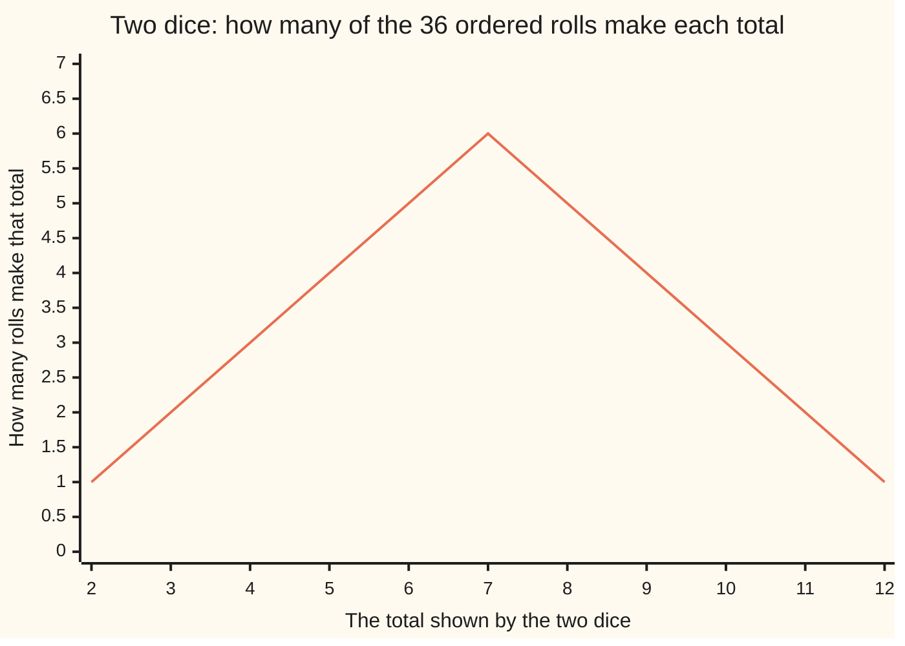

# Generating functions: hang a sequence on powers of x, and adding or multiplying series does the counting

Combinatorics and graphs → Generating Functions → A list stored in the exponents → Generating functions

---

## General Overview

Two ordinary dice, one red and one blue, rolled once: 36 ordered outcomes, red 2 with blue 5 apart from red 5 with blue 2. A total of 7 happens six ways, a total of 12 only one. For the totals 2 through 12 the counts run 1, 2, 3, 4, 5, 6, 5, 4, 3, 2, 1.

Working that list out means pairing a red face with a blue face for every total. Hang each count on a power of a placeholder letter: one die becomes x + x^2 + x^3 + x^4 + x^5 + x^6, the power recording the face and the number in front how many ways it happens. Multiply that by itself. Powers of x multiply by adding exponents — what two dice do to their faces — so collecting terms gathers the rolls by total, and the number in front of x^7 comes out 6.

An expression holding a list that way is a **generating function**, the term used from here on. Two facts earn it, both proved below: what a product of series counts, and that the series of all 1s is the inverse of 1 − x.

**Write a list of counts along the powers of a placeholder and it becomes one object, whose sum means "these cases or those" and whose product means "one piece and then another", so counting turns into algebra.**

**What kind of fact this is:** a definition; the two facts it earns are theorems, proved on this card in Why it works.

### The picture: two dice, eleven totals



Each height is the number in front of that power of x in the die series squared. The peak is the 6 on x^7; all eleven add to 36.

---

## The formula

A sequence is a list of numbers, one slot per whole-number size. Its **ordinary generating function** hangs the size-$n$ count on the $n$-th power of $x$. The sigma sign, met on [binomial-theorem](../03-Binomial%20Coefficients%20and%20Identities/02-binomial-theorem.md), is shorthand for adding what follows over every size under it.

$$A(x) = a_0 + a_1 x + a_2 x^2 + a_3 x^3 + \cdots = \sum_{n \ge 0} a_n x^n$$

**Read it aloud:** the count for size n rides on the n-th power of x, and the series is the whole list at once.

$[x^n]A(x)$ means the number hanging on that power, read "the coefficient of x to the n in A". Two series are equal when every coefficient agrees, size by size. Nothing is ever substituted for $x$: a series read as bookkeeping only is a **formal power series**.

$$\frac{1}{1-x} = 1 + x + x^2 + x^3 + \cdots$$

**Read it aloud:** the series carrying a 1 on every power is what multiplies 1 − x to give plain 1.

$$A(x)\,B(x) = \sum_{n \ge 0} c_n x^n, \qquad c_n = \sum_{k=0}^{n} a_k\, b_{n-k}$$

**Read it aloud:** the coefficient at size n in the product runs over every split of n into a first piece of size k and a second of size n minus k, multiplying the two counts and adding.

That sum over splits is the lists' **convolution**, the word used from here on.

| Symbol | Plain meaning | In our example | Push it up and the answer… |
| --- | --- | --- | --- |
| $a_n$, $a_k$ | count at size $n$, first list | one die: 1 at 1 to 6 | more ways there |
| $b_n$ | second list, $b_{n-k}$ its count at the leftover size | the other die's 1s | — |
| $c_n$ | count at size $n$ in the product | 6 at total 7 | — |
| $n$, $k$ | a size; a split's first piece | totals 2 to 12 | bigger $n$, more splits: $n + 1$ of them |
| $x$ | placeholder, its exponent the size | never a number | — |
| $A(x)$, $B(x)$, $[x^n]A(x)$ | the series, and a count in one | 6 on x^7 | — |

### When it holds

- **The sizes must add.** Two pieces side by side make a thing of their combined size, one way only; the dice qualify, the faces adding to the total. Size $n$ has only $n + 1$ splits, so each coefficient is a finite sum.
- **No labels reshuffled.** Pieces carrying labels dealt out among them need a binomial coefficient in the product instead: [exponential-generating-functions](04-exponential-generating-functions.md).
- **A nonzero constant term, to invert.** 1 − x carries a 1 on the zeroth power, so something multiplies it to 1; one die's series starts at x, and nothing does.

---

## Why it works

### Step 0: powers of x multiply by adding their exponents

x^3 times x^4 is x^7: three copies of x beside four makes seven. So when the exponent records a size, multiplying two terms sets two pieces side by side, and the result's exponent records their total size.

### Step 1: multiplying two series convolves the two lists

Multiply out the way two polynomials do, every term of the first against every term of the second ([polynomials](../../03-Algebra/02-Polynomials/01-polynomials.md)). Each pair contributes its counts multiplied, on the power got by adding the exponents. Gather what landed on $x^n$: if the first exponent is $k$ the second is $n$ minus $k$, and adding those products gives $c_n$. For the dice at total 7 the first exponent runs 1 through 6, its partner always in range, each product 1 times 1: six splits, so 6. At 13 nothing works, and the series stops at the twelfth power.

Read the same line as counting. A split with a size-$k$ first piece has $a_k$ times $b_{n-k}$ pairs, by the product rule; the splits are separate cases covering everything, so the sum rule adds them. Multiplying series is those two rules applied to every size at once, in advance.

### Step 2: the series of ones is the inverse of 1 − x

Multiply the series of ones by 1 − x. The coefficients of 1 − x are 1, then −1, then 0 forever, so above the constant term only two products land on each power: the 1 there against that 1, and the 1 below against that −1. Every $a_n$ here is 1.

$$c_n = a_n \cdot 1 + a_{n-1} \cdot (-1) = 1 - 1 = 0 \quad \text{for } n \ge 1, \qquad c_0 = 1$$

They cancel, and the constant term stays 1. So the product is plain 1, which is what the name 1/(1 − x) records: not a division, but what multiplies 1 − x to 1.

Nothing else does. Read the same convolution for an unknown series with $(1-x)A(x) = 1$: its constant term must be 1, and above that each coefficient must equal the one before, so all are 1. No finite piece will do either: cut the ones off and everything cancels except the top term, left with no partner, so 1 − x times 1 + x + … + x^8 is 1 − x^9.

### Step 3: ones against ones, and the grand total

Squaring the ones is the smallest convolution worth doing: every split of $n$ gives 1 times 1, and there are $n + 1$ splits, so the coefficients run 1, 2, 3, 4, … — the count of ordered pairs of whole numbers adding to $n$.

The dice cross-check a total instead of one coefficient: the eleven coefficients add to 36, and 6 faces times 6 faces is the same 36. Every pair of faces sits in one split, so the roads must agree.

A different route reaches the ones from the other end: the list obeys a(n) = a(n−1) with a(0) = 1, and turning such a rule into an equation is the work of [generating-functions-solve-recurrences](03-generating-functions-solve-recurrences.md).

---

## Worked numbers, by hand

The two dice, step by step.

| Step | Arithmetic | Value |
| --- | --- | --- |
| one die as a series | one way per face | x + x^2 + … + x^6 |
| the splits of 7 | 1+6, 2+5, 3+4, 4+3, 5+2, 6+1 | 6 splits |
| coefficient of x^7 | 1 × 1 over those splits | **6** |
| all eleven coefficients | totals 2 through 12 | 1, 2, 3, 4, 5, 6, 5, 4, 3, 2, 1 |
| their sum, and the other road | 6 faces × 6 faces | **36** and **36** |

Six of the 36 ordered rolls total 7, more than any other total, which is why dice games are built around it.

### What breaks if you drop a piece

| Mistake | Comes out at | What went wrong |
| --- | --- | --- |
| Lists multiplied slot by slot | 6 rolls, not 36 | A coefficient sums over splits |
| Faces numbered 0 to 5 | 4 ways to make 7 | Exponents stop matching faces |
| Series added, not multiplied | 0 ways to make 7 | A sum is "this case or that" |
| The ones cut off at x^5 | 1 − x^6, not 1 | The top term loses its partner |

The code prints all four.

---

## Code, from first principles, and it actually runs

Nothing is imported. The dice counts come out three times by roads sharing no arithmetic: the series multiplied over every pair of terms, all 36 rolls listed and tallied, and the splits of each total counted. The squared ones is set against $n + 1$, 1 − x times the ones shows the leftover at the top, and the four wrong numbers are printed too.

### Python

```python
# Generating functions -- the check behind the card.  Nothing is imported.  A
# series is a list of coefficients: the entry at index n is the count hanging on
# x^n.  Two dice are x + x^2 + ... + x^6 twice over; their product is built by
# adding exponents, then checked against a listing of all 36 ordered rolls.
FACES = range(1, 7)                       # the six faces of one die
DIE = [0] + [1] * 6                       # one way to show each of 1 to 6
N = 8                                     # how far the series of ones is written

def poly_mul(a, b):                       # road one: every pair, exponents added
    out = [0] * (len(a) + len(b) - 1)
    for i, ai in enumerate(a):
        for j, bj in enumerate(b):
            out[i + j] += ai * bj
    return out

def tally_rolls(faces):                   # road two: list the rolls, count totals
    counts = {}
    for u in faces:
        for v in faces:
            counts[u + v] = counts.get(u + v, 0) + 1
    return [counts[t] for t in range(min(counts), max(counts) + 1)]

def splits(n, faces):                     # the ways to split n across two dice
    return [(k, n - k) for k in faces if n - k in faces]

def yn(claim):
    return "yes" if claim else "no"

two = poly_mul(DIE, DIE)                  # the product series, index = the total
totals = two[2:]                          # nothing lands below x^2
listed = tally_rolls(FACES)
ones = [1] * (N + 1)
ones_squared = poly_mul(ones, ones)[: N + 1]
by_formula = [n + 1 for n in range(N + 1)]
inverse = poly_mul([1, -1], ones)         # (1 - x) times the ones, degree by degree
termwise = [u * v for u, v in zip(DIE[1:], DIE[1:])]
zero_to_five = poly_mul([1] * 6, [1] * 6)
added = [2 * c for c in DIE] + [0] * 6
cut = poly_mul([1, -1], [1] * 6)

print(f"one die as a series: the counts on x^1 to x^6 = {DIE[1:]}")
print(f"two dice, series multiplied: totals 2 to 12 -> {totals}")
print(f"the same counts, by listing all 36 ordered rolls: {listed}")
print(f"two roads agree: {yn(totals == listed)}")
print(f"coefficient of x^7 = {two[7]}, from the splits {splits(7, FACES)}")
print(f"the eleven counts sum to {sum(totals)}; 6 faces x 6 faces = {6 * 6}")
print(f"the ones squared, n = 0 to {N}: {ones_squared}")
print(f"the same list, by the count n + 1: {by_formula}")
print(f"(1 - x) times the ones through x^{N}: {inverse}")
print(f"1 stands alone, the only leftover -1 on x^{N + 1}: {yn(inverse == [1] + [0] * N + [-1])}")
print(f"mistake 1, the two face lists multiplied term by term: {termwise}, {len(termwise)} counts summing to {sum(termwise)}, not 36")
print(f"mistake 2, faces numbered 0 to 5: coefficient of x^7 = {zero_to_five[7]}, not 6")
print(f"mistake 3, the two series added, not multiplied: coefficient of x^7 = {added[7]}, all counts summing to {sum(added)}")
print(f"mistake 4, the ones cut off at x^5: (1 - x) times it = {cut}, a leftover -1 on x^6")
assert totals == listed                                    # series algebra vs 36 listed rolls
assert totals == [len(splits(t, FACES)) for t in range(2, 13)] and sum(totals) == 36  # third road
assert ones_squared == by_formula                          # multiplied out vs the closed count
assert inverse == [1] + [0] * N + [-1]                     # the inverse, degree by degree
print("ALL CHECKS PASS")
```

**Ran 2026-09-19 on macOS, Python 3.14.6, standard library only. All checks passed. Output, pasted from the run:**

```
one die as a series: the counts on x^1 to x^6 = [1, 1, 1, 1, 1, 1]
two dice, series multiplied: totals 2 to 12 -> [1, 2, 3, 4, 5, 6, 5, 4, 3, 2, 1]
the same counts, by listing all 36 ordered rolls: [1, 2, 3, 4, 5, 6, 5, 4, 3, 2, 1]
two roads agree: yes
coefficient of x^7 = 6, from the splits [(1, 6), (2, 5), (3, 4), (4, 3), (5, 2), (6, 1)]
the eleven counts sum to 36; 6 faces x 6 faces = 36
the ones squared, n = 0 to 8: [1, 2, 3, 4, 5, 6, 7, 8, 9]
the same list, by the count n + 1: [1, 2, 3, 4, 5, 6, 7, 8, 9]
(1 - x) times the ones through x^8: [1, 0, 0, 0, 0, 0, 0, 0, 0, -1]
1 stands alone, the only leftover -1 on x^9: yes
mistake 1, the two face lists multiplied term by term: [1, 1, 1, 1, 1, 1], 6 counts summing to 6, not 36
mistake 2, faces numbered 0 to 5: coefficient of x^7 = 4, not 6
mistake 3, the two series added, not multiplied: coefficient of x^7 = 0, all counts summing to 12
mistake 4, the ones cut off at x^5: (1 - x) times it = [1, 0, 0, 0, 0, 0, -1], a leftover -1 on x^6
ALL CHECKS PASS
```

### Rust

Same numbers, same labels, built with `rustc --edition 2021 -O`.

```rust
// Generating functions -- the same check as the Python, in Rust.  No crates.  A
// series is a vector of coefficients: the entry at index n is the count hanging
// on x^n.  Two dice are x + x^2 + ... + x^6 twice over; their product is built
// by adding exponents, then checked against a listing of all 36 ordered rolls.
const N: usize = 8;                              // how far the ones series is written

fn poly_mul(a: &[i64], b: &[i64]) -> Vec<i64> {  // road one: every pair, exponents added
    let mut out = vec![0i64; a.len() + b.len() - 1];
    for (i, ai) in a.iter().enumerate() {
        for (j, bj) in b.iter().enumerate() {
            out[i + j] += ai * bj;
        }
    }
    out
}

fn tally_rolls(faces: &[i64]) -> Vec<i64> {      // road two: list the rolls, count totals
    let lo = 2 * faces[0];
    let hi = 2 * faces[faces.len() - 1];
    let mut counts = vec![0i64; (hi - lo + 1) as usize];
    for &u in faces {
        for &v in faces {
            counts[(u + v - lo) as usize] += 1;
        }
    }
    counts
}

fn splits(n: i64, faces: &[i64]) -> Vec<(i64, i64)> {   // the ways to split n across two dice
    faces.iter().filter(|&&k| faces.contains(&(n - k))).map(|&k| (k, n - k)).collect()
}

fn yn(claim: bool) -> &'static str { if claim { "yes" } else { "no" } }

fn main() {
    let faces: Vec<i64> = (1..7).collect();            // the six faces of one die
    let mut die = vec![0i64];                          // one way to show each of 1 to 6
    die.extend(vec![1i64; 6]);
    let two = poly_mul(&die, &die);                    // the product series, index = the total
    let totals: Vec<i64> = two[2..].to_vec();          // nothing lands below x^2
    let listed = tally_rolls(&faces);
    let ones = vec![1i64; N + 1];
    let ones_squared: Vec<i64> = poly_mul(&ones, &ones)[..N + 1].to_vec();
    let by_formula: Vec<i64> = (0..=N as i64).map(|n| n + 1).collect();
    let inverse = poly_mul(&[1, -1], &ones);           // (1 - x) times the ones, degree by degree
    let termwise: Vec<i64> = die[1..].iter().map(|&u| u * u).collect();
    let zero_to_five = poly_mul(&vec![1i64; 6], &vec![1i64; 6]);
    let mut added: Vec<i64> = die.iter().map(|&c| 2 * c).collect();
    added.extend(vec![0i64; 6]);
    let cut = poly_mul(&[1, -1], &vec![1i64; 6]);
    let mut want = vec![1i64];
    want.extend(vec![0i64; N]);
    want.push(-1);
    let sum_totals: i64 = totals.iter().sum();
    println!("one die as a series: the counts on x^1 to x^6 = {:?}", &die[1..]);
    println!("two dice, series multiplied: totals 2 to 12 -> {:?}", totals);
    println!("the same counts, by listing all 36 ordered rolls: {:?}", listed);
    println!("two roads agree: {}", yn(totals == listed));
    println!("coefficient of x^7 = {}, from the splits {:?}", two[7], splits(7, &faces));
    println!("the eleven counts sum to {}; 6 faces x 6 faces = {}", sum_totals, 6 * 6);
    println!("the ones squared, n = 0 to {}: {:?}", N, ones_squared);
    println!("the same list, by the count n + 1: {:?}", by_formula);
    println!("(1 - x) times the ones through x^{}: {:?}", N, inverse);
    println!("1 stands alone, the only leftover -1 on x^{}: {}", N + 1, yn(inverse == want));
    println!("mistake 1, the two face lists multiplied term by term: {:?}, {} counts summing to {}, not 36",
             termwise, termwise.len(), termwise.iter().sum::<i64>());
    println!("mistake 2, faces numbered 0 to 5: coefficient of x^7 = {}, not 6", zero_to_five[7]);
    println!("mistake 3, the two series added, not multiplied: coefficient of x^7 = {}, all counts summing to {}",
             added[7], added.iter().sum::<i64>());
    println!("mistake 4, the ones cut off at x^5: (1 - x) times it = {:?}, a leftover -1 on x^6", cut);
    assert!(totals == listed);                                 // series algebra vs 36 listed rolls
    assert!(totals == (2..13).map(|t| splits(t, &faces).len() as i64).collect::<Vec<i64>>()
            && sum_totals == 36);                              // third road, and the grand total
    assert!(ones_squared == by_formula);                       // multiplied out vs the closed count
    assert!(inverse == want);                                  // the inverse, degree by degree
    println!("ALL CHECKS PASS");
}
```

**Ran 2026-09-19 on macOS, rustc 1.98.1, no crates. All checks passed. Output, pasted from the run:**

```
one die as a series: the counts on x^1 to x^6 = [1, 1, 1, 1, 1, 1]
two dice, series multiplied: totals 2 to 12 -> [1, 2, 3, 4, 5, 6, 5, 4, 3, 2, 1]
the same counts, by listing all 36 ordered rolls: [1, 2, 3, 4, 5, 6, 5, 4, 3, 2, 1]
two roads agree: yes
coefficient of x^7 = 6, from the splits [(1, 6), (2, 5), (3, 4), (4, 3), (5, 2), (6, 1)]
the eleven counts sum to 36; 6 faces x 6 faces = 36
the ones squared, n = 0 to 8: [1, 2, 3, 4, 5, 6, 7, 8, 9]
the same list, by the count n + 1: [1, 2, 3, 4, 5, 6, 7, 8, 9]
(1 - x) times the ones through x^8: [1, 0, 0, 0, 0, 0, 0, 0, 0, -1]
1 stands alone, the only leftover -1 on x^9: yes
mistake 1, the two face lists multiplied term by term: [1, 1, 1, 1, 1, 1], 6 counts summing to 6, not 36
mistake 2, faces numbered 0 to 5: coefficient of x^7 = 4, not 6
mistake 3, the two series added, not multiplied: coefficient of x^7 = 0, all counts summing to 12
mistake 4, the ones cut off at x^5: (1 - x) times it = [1, 0, 0, 0, 0, 0, -1], a leftover -1 on x^6
ALL CHECKS PASS
```

The two outputs match line for line.

> [!TIP]
> **Try changing**
> Guess first, then run it. Each of these stops the program at an assert.
> - **Eight-sided dice.** Set `FACES` to `range(1, 9)` and `DIE` to `[0] + [1] * 8`: the commonest total moves to 9 with eight ways, the rolls number 64, and the second assert stops it.
> - **Stop the exponents adding.** Change `out[i + j] += ai * bj` to `out[i] += ai * bj`: everything piles onto one die's powers, and the first assert stops it.
> - **Guess the closed count wrong.** Change `n + 1` to `n + 2`: multiplying out still gives 1, 2, 3, 4, …, so the third assert stops it.

---

## The usual mistake

> [!warning]
> **Multiplying the two coefficient lists slot by slot.** Six ones against six ones gives six ones: 6 rolls where the truth is 36, and no count for a total of 7. The exponents add, so a coefficient sums over every split.
>
> - **Substituting a number for x.** The placeholder holds the sizes apart; 1/(1 − x) is an algebraic fact, not a claim that 1 + 1 + 1 + … is a number.
> - **Adding where the counting pairs things up.** That gives 0 ways to make 7 and 12 rolls in all; a sum is "this case or that case".
> - **Starting the sizes in the wrong place.** Faces numbered 0 to 5 leave only 4 ways to reach 7; the constant term is a real count, of things of size 0.

---

## Where you meet it in real life

- **Making change.** How many ways to pay 50 cents in pennies, nickels, dimes and quarters is one coefficient of a product of four series, one per coin: [counting-with-generating-functions](02-counting-with-generating-functions.md).
- **Signal processing and error-correcting codes.** Multiplying two polynomials is the arithmetic of convolving two sequences, which is how a filter combines a signal with its response.
- **Structures built from copies of themselves.** A tree of smaller trees gets an equation for its series rather than a formula: [catalan-generating-function](05-catalan-generating-function.md).

> **Say it back**
> A list of counts can be written along the powers of a placeholder, one count per power; that object is the list's generating function. Adding two of them adds counts of the same size. Multiplying them adds up every way of splitting a size in two — "one piece and then another", in counting. The series of all 1s multiplies 1 − x to give 1, so it is written 1/(1 − x). Two dice are one series squared: a 6 on the seventh power, 36 in all.

---

## What this builds on

- [binomial-theorem](../03-Binomial%20Coefficients%20and%20Identities/02-binomial-theorem.md): (1 + x)^m is already one of these series, with a row of Pascal's triangle as its coefficients; also where sigma notation starts.
- [recurrences-and-fibonacci](../05-Recurrences/01-recurrences-and-fibonacci.md): sequences fixed by a rule reaching back over earlier terms — what this shelf packs into series.
- [polynomials](../../03-Algebra/02-Polynomials/01-polynomials.md): collecting every pair of terms, this card's rule with the series cut short.

## Where this goes next

- [counting-with-generating-functions](02-counting-with-generating-functions.md): one factor per choice, the answer read off one coefficient.
- [generating-functions-solve-recurrences](03-generating-functions-solve-recurrences.md): a recurrence turned into one equation for the series, then solved.
- [exponential-generating-functions](04-exponential-generating-functions.md): the labelled version, a factorial under each count.
- [catalan-generating-function](05-catalan-generating-function.md): a series pinned down by an equation in itself.

Every count here came off a product written down by hand for two dice; the next card supplies the recipe for choosing the factors, so that paying 50 cents becomes one multiplication.

---

## Sources

Verified 19 Sep 2026: every link below resolves to the publisher's page.

- Wilf, Herbert S. *generatingfunctionology*, 2nd ed. Academic Press, 1994. [Download page](https://www2.math.upenn.edu/~wilf/DownldGF.html), [full PDF](https://www2.math.upenn.edu/~wilf/gfology2.pdf). Free and complete; chapters 1 and 2 give the powers-of-x idea and the product rule.
- Flajolet, Philippe, and Robert Sedgewick. *Analytic Combinatorics*. Cambridge University Press, 2009. [Publisher page](https://doi.org/10.1017/CBO9780511801655), [authors' PDF](https://algo.inria.fr/flajolet/Publications/book.pdf). Part A, chapter I: pairing two kinds of object is multiplying their series.
- Olver, F. W. J., et al., eds. *NIST Digital Library of Mathematical Functions*, §26.3. [dlmf.nist.gov/26.3](https://dlmf.nist.gov/26.3). Free; equation 26.3.4 gives the coefficients of 1/(1 − x) raised to a power, the squared ones being its $n = 1$ case.
