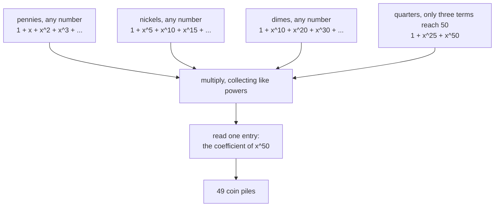

# Counting by multiplying series: each constraint is a factor, and the answer is one coefficient

Combinatorics and graphs → Generating Functions → One factor per kind → Counting by multiplying series

---

## General Overview

A till holds pennies (1 cent), nickels (5), dimes (10) and quarters (25), plenty of each. A charge of 50 cents must be paid in exact coins. How many piles pay it? Only the counts matter: three pennies and a nickel is one pile, in any order.

The rule of product looks like the tool ([rules-of-sum-and-product](../01-Counting%20Principles/01-rules-of-sum-and-product.md)): nickels 0 to 10, dimes 0 to 5, quarters 0, 1 or 2, pennies filling the rest. Eleven times six times three is 198 — badly wrong, since most of those combinations spend past 50 cents. The choices are tied together: they must reach one fixed total.

Here is the move that handles the total. Give each kind of coin a menu of what it could contribute: pennies 0, 1, 2, 3 cents and on up, quarters 0, 25 or 50. Write each menu as a row of powers of a placeholder, one power per amount, and multiply the four rows. Powers multiply by adding their exponents, so the entry landing on the power for 50 counts the piles worth 50 cents. Such a menu is a **factor**, the word used from here on; the product of the four is this count's generating function.

The number of piles is 49.

**Each restriction becomes one factor, the factors are multiplied, and the count is the single coefficient sitting on the power that records the total.**

**What kind of fact this is:** a method; the one fact it rests on, that multiplying series adds exponents, is proved on this card in Why it works.

### The picture: four menus, one product, one coefficient



No pile is chosen along the way: the multiplication chooses, and the reading happens once.

---

## The formula

A series here is a bookkeeping row: the number on $x^{n}$ is the count for a total of $n$, with $x$ a placeholder, never a quantity. "The coefficient of $x^{n}$" names that number ([ordinary-generating-functions](01-ordinary-generating-functions.md)).

A kind of coin worth $v$ cents, in unlimited supply, can contribute 0, $v$, $2v$, $3v$ cents and on up, one pile per amount:

$$1 + x^{v} + x^{2v} + x^{3v} + \cdots \;=\; \frac{1}{1 - x^{v}}$$

**Read it aloud:** one term for every size of pile one kind can make; the fraction on the right is shorthand for the endless list.

With $k$ kinds, the count for a total of $n$ is one coefficient of one product:

$$\text{ways to make } n \;=\; \text{the coefficient of } x^{n} \text{ in } F_1(x) \times F_2(x) \times \cdots \times F_k(x)$$

Each factor belongs to one kind and lists what it may contribute. The till has four:

$$\frac{1}{(1-x)(1-x^{5})(1-x^{10})(1-x^{25})}$$

**Read it aloud:** pennies times nickels times dimes times quarters, and the coefficient of $x^{50}$ is 49.

| Symbol | Plain meaning | In our example | Push it up and the answer… |
| --- | --- | --- | --- |
| $x$ | a placeholder; its power records a total | $x^{50}$ is 50 cents | — |
| $n$ | the total to pay, in cents | 50 | climbs fast: 13 piles at 25 cents, 49 at 50 |
| $v$ | one kind's coin value | 1, 5, 10 and 25 | coarser coins, fewer piles |
| $k$ | how many kinds of coin | 4 | one more factor |
| $F_1$, $F_2$, $F_3$, $F_4$ | the factors, one per kind | quarters: $1 + x^{25} + x^{50}$ | — |
| $a$, $b$, $c$, $d$ | pennies, nickels, dimes, quarters in one pile | 0, 1, 2, 1 pays 50 | — |
| $C(7, 2)$ | a choose count, read "7 choose 2": ways to pick 2 of 7 | 21 | — |

### When it holds

- **Order must not matter.** The product counts piles, not the order they are handed over in; count orders and each pile is counted many times.
- **Only the total ties the kinds together.** A factor speaks for its own kind and nothing else. A rule like "no dimes once a quarter is used" spans two kinds, so no factor carries it and the product counts forbidden piles.
- **Each allowed amount appears once in its factor.** The 1 on $x^{25}$ says the quarters have one way to bring 25 cents; put 2 there and every pile using one quarter is counted twice.

---

## Why it works

### Step 0: multiplying two series adds the exponents

$x^{5}$ times $x^{45}$ is $x^{50}$: powers of one placeholder add. Multiplying two factors means taking one term from each, adding the exponents, and collecting what lands on one power.

Pennies and nickels alone, at $x^{50}$: no nickel with fifty pennies, one with forty-five, on to ten nickels with none — eleven terms, so the coefficient is 11, the count by hand too. The multiplication did the splitting, for every power at once.

### Step 1: one kind of coin is one list, endless or short

A pile of nickels is worth 0, 5, 10, 15 cents and on up, one pile per amount, since nickels are identical: coefficient 1 on those powers, 0 elsewhere. The short form is one cancellation:

$$(1 - x^{5})(1 + x^{5} + x^{10} + x^{15} + \cdots) = 1$$

Multiplying out gives the list minus the same list shifted up by $x^{5}$, so every term after the 1 dies against its neighbour. List and fraction are two spellings of one row.

A limit only cuts the list short. A die shows 1 to 6 and must show something, so one die's factor is

$$x + x^{2} + x^{3} + x^{4} + x^{5} + x^{6}$$

no constant term, since 0 is not a face, and nothing above $x^{6}$. Two dice square it. The code checks both numbers that square gives ([ordinary-generating-functions](01-ordinary-generating-functions.md)): 6 on $x^{7}$, and 36 once every coefficient is added. At most two quarters is the same cut: $1 + x^{25} + x^{50}$.

### Step 2: the coefficient keeps only what adds up

Now all four. A term of the product takes one term from each factor: $x^{a}$ from the pennies, $x^{5b}$ from the nickels, $x^{10c}$ from the dimes, $x^{25d}$ from the quarters, where $a$, $b$, $c$ and $d$ count coins. Exponents add, so the term lands on

$$x^{\,a + 5b + 10c + 25d}$$

which is $x^{50}$ exactly when $a + 5b + 10c + 25d = 50$ — the equation for "these coins pay 50 cents". Each paying pile puts 1 on $x^{50}$, and no two piles give the same term, so the coefficient is the count: 49.

That is where 198 failed: each choice here pushes the exponent up by what it spends, so only terms reaching 50 are counted.

### Step 3: stars and bars is the case where every factor is the same

Let each of $k$ kinds contribute any whole number of single items. Every factor is then the all-ones list $1 + x + x^{2} + \cdots$ and the product is $1/(1-x)^{k}$. Its coefficient of $x^{n}$ collects exponents adding to $n$ — every way to share $n$ identical items among $k$ labelled kinds, the choose count $C(n + k - 1, k - 1)$ ([stars-and-bars](../02-Repeats%2C%20Groups%20and%20Double%20Counting/02-stars-and-bars.md)).

Three kinds, total 5: three all-ones lists put 21 on $x^{5}$, and $C(7, 2)$ is 21, that card's count. Stars and bars is the flat case, every value 1; coin values make the till harder.

<details>
<summary>Detailed proof: the same coefficient by algebra alone</summary>

Induction on the number of factors, with no bars and no stars. One factor: $1/(1-x)$ carries 1 on every power, and $C(n, 0) = 1$. Suppose the claim holds for $k$ factors. A further all-ones list contributes 1 whatever is left for it, so the coefficient of $x^{n}$ in $1/(1-x)^{k+1}$ adds the $k$-factor coefficients from 0 to $n$:

$$C(k - 1, k - 1) + C(k, k - 1) + \cdots + C(n + k - 1, k - 1)$$

The hockey-stick identity adds such a run into one coefficient further along ([hockey-stick-identity](../03-Binomial%20Coefficients%20and%20Identities/04-hockey-stick-identity.md)): the sum is $C(n + k, k)$, the claim for one factor more.

</details>

A second route skips series: fix the quarters, then the dimes, then the nickels, letting pennies take the rest. Split on the quarters — 36 piles with none, 12 with one, 1 with two — total 49. That route answers one charge; the product answers them all.

---

## Worked numbers, by hand

Multiply the kinds in one at a time and watch the coefficient of $x^{50}$ grow. Each row counts piles worth 50 cents from the kinds so far.

| Step | Arithmetic | Value |
| --- | --- | --- |
| pennies alone | fifty pennies, nothing to decide | 1 |
| in with the nickels | 0 to 10 nickels, pennies filling the rest | 11 |
| in with the dimes | each nickel count again for 0 to 5 dimes | 36 |
| in with the quarters | 36 with none, 12 with one, 1 with two | **49** |

The 36 appears twice on purpose: the piles using no quarter are those the first three factors already counted. The same product answers every other charge, since every power carries a coefficient: 13 piles pay 25 cents, 4 pay 10.

### What breaks if you drop a piece

| Mistake | Comes out at | What went wrong |
| --- | --- | --- |
| The pile counts multiplied, 11 × 6 × 3 | 198 | Most combinations overspend |
| The factors added, not multiplied | 4 | Adding keeps the kinds apart: one way per kind to pay 50 alone |
| Every factor started at its own coin | 2 | Every pile is forced to hold all four coins |
| Stars and bars on four kinds and 50 | 23426 | That shares 50 single items, not 50 cents |

The code prints all four.

---

## Code, from first principles, and it actually runs

Nothing is imported. Road one multiplies the four factors, collecting like powers, and reads the coefficient of $x^{50}$. Road two counts piles directly, with no series: quarters, dimes and nickels run through every count and pennies take the remainder. The roads are compared at every fifth total up to 50; the dice and all-ones cases follow.

### Python

```python
# Counting by multiplying series -- the check behind the card.  Nothing is
# imported.  Making 50 cents from pennies, nickels, dimes and quarters is the
# coefficient of x^50 in 1/((1-x)(1-x^5)(1-x^10)(1-x^25)).  Road one multiplies
# the four series and collects like powers; road two counts coin piles instead.
N, COINS = 50, (1, 5, 10, 25)
def mul(a, b, top):                       # collect a_i * b_j onto degree i + j
    out = [0] * (top + 1)
    for i, ai in enumerate(a):
        for j, bj in enumerate(b):
            if ai and bj and i + j <= top:
                out[i + j] += ai * bj
    return out
def factor(v, top, least=0):              # one kind of coin: x^(least*v) + ...
    f = [0] * (top + 1)
    for m in range(least, top // v + 1):
        f[m * v] = 1
    return f
def product(coins, top=N, least=0):       # road one: multiply the factors
    out = [1] + [0] * top
    for v in coins:
        out = mul(out, factor(v, top, least), top)
    return out
def piles(target, coins):                 # road two: count coin piles, no series
    if not coins:
        return 1 if target == 0 else 0
    v = coins[0]
    return sum(piles(target - m * v, coins[1:]) for m in range(target // v + 1))
def choose(m, r):                         # Pascal's rule, written out here
    row = [1]
    for _ in range(m):
        row = [1] + [row[i] + row[i + 1] for i in range(len(row) - 1)] + [1]
    return row[r]
def yn(claim): return "yes" if claim else "no"
ways = product(COINS)
row = [ways[n] for n in range(0, N + 1, 5)]
growing = [product(COINS[:i + 1])[N] for i in range(len(COINS))]
quartered = [piles(N - 25 * d, COINS[:3]) for d in range(3)]   # 0, 1 or 2 quarters
dice = mul(factor(1, 6, 1), factor(1, 6, 1), 12)     # one die: x^1 + ... + x^6
threefold = product((1, 1, 1), top=5)
blind = product((1, 1, 1, 1))[N]
spread = (N // 5 + 1) * (N // 10 + 1) * (N // 25 + 1)   # nickels x dimes x quarters
print(f"making {N} cents from pennies (1), nickels (5), dimes (10), quarters (25)")
print(f"road one, the coefficient of x^{N} in the product of four series: {ways[N]}")
print(f"road two, counting the coin piles, no series named: {piles(N, COINS)}")
print(f"one kind added at a time, the count at {N} cents: {', '.join(str(g) for g in growing)}")
print(f"ways to make 0, 5, 10 ... {N} cents: {row}")
print(f"the same eleven counts by counting piles: {yn(row == [piles(n, COINS) for n in range(0, N + 1, 5)])}")
print(f"by hand, split on the quarters: {' + '.join(str(q) for q in quartered)} = {sum(quartered)}")
print(f"two dice, (x + x^2 + ... + x^6) squared: coefficient of x^7 = {dice[7]}")
print(f"the same pairs listed by hand: {sum(1 for d in range(1, 7) if 1 <= 7 - d <= 6)}; every coefficient added: {sum(dice)}")
print(f"three unlimited kinds, total 5: series {threefold[5]}, stars and bars C(7, 2) = {choose(7, 2)}")
print(f"mistake 1, the {N // 5 + 1} x {N // 10 + 1} x {N // 25 + 1} pile counts multiplied as if free: {spread}, not {ways[N]}")
print(f"mistake 2, the four series added instead of multiplied: {sum(factor(v, N)[N] for v in COINS)}")
print(f"mistake 3, every factor started at its own coin: {product(COINS, least=1)[N]}")
print(f"mistake 4, coin values ignored, stars and bars alone: C(53, 3) = {blind}")
assert ways[N] == piles(N, COINS) and row == [piles(n, COINS) for n in range(0, N + 1, 5)]
assert ways[N] == 49 and growing == [1, 11, 36, 49] and sum(quartered) == 49
assert threefold[5] == choose(7, 2) and blind == choose(N + 3, 3)
assert dice[7] == sum(1 for d in range(1, 7) if 1 <= 7 - d <= 6) and sum(dice) == 36
print("ALL CHECKS PASS")
```

**Ran 2026-09-19 on macOS, Python 3.14.6, standard library only. All checks passed. Output, pasted from the run:**

```
making 50 cents from pennies (1), nickels (5), dimes (10), quarters (25)
road one, the coefficient of x^50 in the product of four series: 49
road two, counting the coin piles, no series named: 49
one kind added at a time, the count at 50 cents: 1, 11, 36, 49
ways to make 0, 5, 10 ... 50 cents: [1, 2, 4, 6, 9, 13, 18, 24, 31, 39, 49]
the same eleven counts by counting piles: yes
by hand, split on the quarters: 36 + 12 + 1 = 49
two dice, (x + x^2 + ... + x^6) squared: coefficient of x^7 = 6
the same pairs listed by hand: 6; every coefficient added: 36
three unlimited kinds, total 5: series 21, stars and bars C(7, 2) = 21
mistake 1, the 11 x 6 x 3 pile counts multiplied as if free: 198, not 49
mistake 2, the four series added instead of multiplied: 4
mistake 3, every factor started at its own coin: 2
mistake 4, coin values ignored, stars and bars alone: C(53, 3) = 23426
ALL CHECKS PASS
```

### Rust

Same numbers, same labels, built with `rustc --edition 2021 -O`.

```rust
// Counting by multiplying series -- the same check as the Python, in Rust.  No
// crates.  Making 50 cents from pennies, nickels, dimes and quarters is the
// coefficient of x^50 in 1/((1-x)(1-x^5)(1-x^10)(1-x^25)).  Road one multiplies
// the four series and collects like powers; road two counts coin piles instead.
const N: usize = 50;
const COINS: [usize; 4] = [1, 5, 10, 25];
fn mul(a: &[i64], b: &[i64], top: usize) -> Vec<i64> {   // a_i * b_j onto degree i + j
    let mut out = vec![0i64; top + 1];
    for (i, &ai) in a.iter().enumerate() {
        for (j, &bj) in b.iter().enumerate() {
            if ai != 0 && bj != 0 && i + j <= top { out[i + j] += ai * bj }
        }
    }
    out
}
fn factor(v: usize, top: usize, least: usize) -> Vec<i64> {   // one kind of coin
    let mut f = vec![0i64; top + 1];
    let mut m = least;
    while m * v <= top { f[m * v] = 1; m += 1 }
    f
}
fn product(coins: &[usize], top: usize, least: usize) -> Vec<i64> {   // road one
    let mut out = vec![0i64; top + 1];
    out[0] = 1;
    for &v in coins { out = mul(&out, &factor(v, top, least), top) }
    out
}
fn piles(target: i64, coins: &[usize]) -> i64 {   // road two: no series named
    if coins.is_empty() { return if target == 0 { 1 } else { 0 } }
    let v = coins[0] as i64;
    (0..=target / v).map(|m| piles(target - m * v, &coins[1..])).sum()
}
fn choose(m: usize, r: usize) -> i64 {            // Pascal's rule, written out here
    let mut row = vec![1i64];
    for _ in 0..m {
        let mut next = vec![1i64];
        for i in 0..row.len() - 1 { next.push(row[i] + row[i + 1]) }
        next.push(1);
        row = next;
    }
    row[r]
}
fn yn(claim: bool) -> &'static str { if claim { "yes" } else { "no" } }
fn join(v: &[i64], sep: &str) -> String { v.iter().map(|x| x.to_string()).collect::<Vec<String>>().join(sep) }

fn main() {
    let ways = product(&COINS, N, 0);
    let row: Vec<i64> = (0..=N).step_by(5).map(|n| ways[n]).collect();
    let by_piles: Vec<i64> = (0..=N).step_by(5).map(|n| piles(n as i64, &COINS)).collect();
    let growing: Vec<i64> = (1..=COINS.len()).map(|i| product(&COINS[..i], N, 0)[N]).collect();
    let quartered: Vec<i64> = (0..3).map(|d| piles(N as i64 - 25 * d, &COINS[..3])).collect();
    let die = factor(1, 6, 1);                    // one die: x^1 + ... + x^6
    let dice = mul(&die, &die, 12);
    let pairs = (1..7).filter(|d| (1..7).contains(&(7 - d))).count() as i64;
    let threefold = product(&[1, 1, 1], 5, 0);
    let blind = product(&[1, 1, 1, 1], N, 0)[N];
    let spread = (N / 5 + 1) * (N / 10 + 1) * (N / 25 + 1);   // nickels x dimes x quarters
    let added: i64 = COINS.iter().map(|&v| factor(v, N, 0)[N]).sum();
    println!("making {} cents from pennies (1), nickels (5), dimes (10), quarters (25)", N);
    println!("road one, the coefficient of x^{} in the product of four series: {}", N, ways[N]);
    println!("road two, counting the coin piles, no series named: {}", piles(N as i64, &COINS));
    println!("one kind added at a time, the count at {} cents: {}", N, join(&growing, ", "));
    println!("ways to make 0, 5, 10 ... {} cents: {:?}", N, row);
    println!("the same eleven counts by counting piles: {}", yn(row == by_piles));
    println!("by hand, split on the quarters: {} = {}", join(&quartered, " + "), quartered.iter().sum::<i64>());
    println!("two dice, (x + x^2 + ... + x^6) squared: coefficient of x^7 = {}", dice[7]);
    println!("the same pairs listed by hand: {}; every coefficient added: {}", pairs, dice.iter().sum::<i64>());
    println!("three unlimited kinds, total 5: series {}, stars and bars C(7, 2) = {}", threefold[5], choose(7, 2));
    println!("mistake 1, the {} x {} x {} pile counts multiplied as if free: {}, not {}",
             N / 5 + 1, N / 10 + 1, N / 25 + 1, spread, ways[N]);
    println!("mistake 2, the four series added instead of multiplied: {}", added);
    println!("mistake 3, every factor started at its own coin: {}", product(&COINS, N, 1)[N]);
    println!("mistake 4, coin values ignored, stars and bars alone: C(53, 3) = {}", blind);
    assert!(ways[N] == piles(N as i64, &COINS) && row == by_piles);
    assert!(ways[N] == 49 && growing == vec![1, 11, 36, 49] && quartered.iter().sum::<i64>() == 49);
    assert!(threefold[5] == choose(7, 2) && blind == choose(N + 3, 3));
    assert!(dice[7] == pairs && dice.iter().sum::<i64>() == 36);
    println!("ALL CHECKS PASS");
}
```

**Ran 2026-09-19 on macOS, rustc 1.98.1, no crates. All checks passed. Output, pasted from the run:**

```
making 50 cents from pennies (1), nickels (5), dimes (10), quarters (25)
road one, the coefficient of x^50 in the product of four series: 49
road two, counting the coin piles, no series named: 49
one kind added at a time, the count at 50 cents: 1, 11, 36, 49
ways to make 0, 5, 10 ... 50 cents: [1, 2, 4, 6, 9, 13, 18, 24, 31, 39, 49]
the same eleven counts by counting piles: yes
by hand, split on the quarters: 36 + 12 + 1 = 49
two dice, (x + x^2 + ... + x^6) squared: coefficient of x^7 = 6
the same pairs listed by hand: 6; every coefficient added: 36
three unlimited kinds, total 5: series 21, stars and bars C(7, 2) = 21
mistake 1, the 11 x 6 x 3 pile counts multiplied as if free: 198, not 49
mistake 2, the four series added instead of multiplied: 4
mistake 3, every factor started at its own coin: 2
mistake 4, coin values ignored, stars and bars alone: C(53, 3) = 23426
ALL CHECKS PASS
```

The two outputs match line for line.

> [!TIP]
> **Try changing**
> Guess first, then run it. The asserts are pinned to the till's four coins, so expect one to stop the run.
> - **Add a half dollar.** Put `50` in `COINS`: 50 piles pay.
> - **Ask for a dollar.** Set `N` to `100`: the count climbs to 242.
> - **Ration the coins.** In `factor`, change `top // v + 1` to `min(top // v, 3) + 1`, capping each coin at three: the series road falls to 3 piles while the pile-counting road, blind to the cap, still reports 49.

---

## The usual mistake

> [!warning]
> **Multiplying each kind's count as though the kinds were free of one another.** 11 × 6 × 3 = 198 counts combinations that spend past 50 cents, which no pennies rescue. The coefficient of $x^{50}$ keeps only the ones reaching it: 49.
>
> - **Dropping the "none of this kind" term.** The 1 opening each factor stands for taking none of that coin; start each factor at its own coin and the answer falls to 2.
> - **Adding the factors instead of multiplying them.** Addition keeps the kinds apart, so it counts only the four single-kind piles: 4.
> - **Reaching for stars and bars because the coins look identical.** Fifty cents among four kinds is not fifty items among four boxes: that count is $C(53, 3) = 23426$. Values live in the exponents.

---

## Where you meet it in real life

- **Change machines and till software.** Whether a price can be paid from a float, and in how many ways, is one coefficient in this product. The counts for 1, 5, 10 and 25 cents are sequence A001299.
- **Dice and scoring.** Two dice are one die's factor squared, three dice cube it; unusual faces only change the terms.
- **Splitting a number into allowed parts.** Packing units into boxes of 1, 5, 10 and 25 is the same product renamed — the road to [partitions-generating-function](../08-Partitions/02-partitions-generating-function.md).

> **Say it back**
> Each kind of coin gets a factor: the amounts it could contribute, one term each, on powers of a placeholder. Multiplying the factors adds the exponents, so every term lands on the power recording one pile's total, and that coefficient counts the piles. For 50 cents from pennies, nickels, dimes and quarters it is 49, not the 198 the rule of product suggests. A limit shortens a factor; all-ones factors give back stars and bars.

---

## What this builds on

- [ordinary-generating-functions](01-ordinary-generating-functions.md): what a series of counts is, and where the count for $n$ sits in it.
- [stars-and-bars](../02-Repeats%2C%20Groups%20and%20Double%20Counting/02-stars-and-bars.md): the count Step 3 re-derives, and the 21 the code agrees with.

## Where this goes next

- [partitions-generating-function](../08-Partitions/02-partitions-generating-function.md): one factor for every part size, and what their endless product counts.

These four factors were chosen by hand; what happens when the kinds are every whole number at once is a later card's product.

---

## Sources

Verified 19 Sep 2026: every link below resolves to the publisher's page.

- Wilf, Herbert S. *generatingfunctionology*. 2nd ed. Academic Press, 1994. [Author's download page, full text free](https://www2.math.upenn.edu/~wilf/DownldGF.html). Chapters 1 and 2, the product rule.
- Graham, Ronald L., Donald E. Knuth and Oren Patashnik. *Concrete Mathematics*. 2nd ed. Addison-Wesley, 1994. [Authors' page](https://www-cs-faculty.stanford.edu/~knuth/gkp.html). Chapter 7, generating functions, works this change-making product.
- Olver, F. W. J., et al., eds. *NIST Digital Library of Mathematical Functions*, §26.3(ii). [Equation 26.3.4](https://dlmf.nist.gov/26.3.E4). The identity behind Step 3.
- *The On-Line Encyclopedia of Integer Sequences*, sequence A001299, ways of making change for n cents from 1, 5, 10 and 25. [oeis.org/A001299](https://oeis.org/A001299). An outside check: entry 49 at 50.
