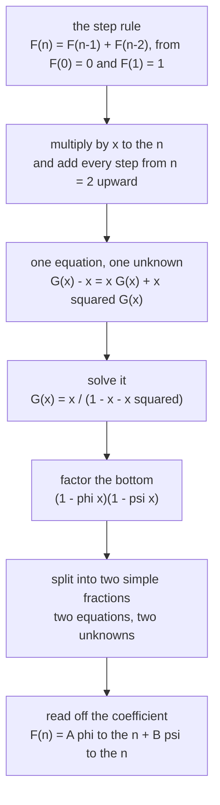

# Solving a recurrence with a generating function: the step rule becomes an equation for the series, and a ratio of polynomials falls out

[Syllabus](../../../SYLLABUS.md) → [Combinatorics and graphs](../README.md) → [Generating Functions](../README.md#s07) → Solving a recurrence with a generating function

---

## General Overview

A drum machine holds a bar of 12 beats. Every note is worth one beat or two, and the bar fills exactly. There are 233 ways.

Nobody counts those by hand. The first note takes one beat, leaving an 11-beat bar, or two, leaving a 10-beat bar. Nothing else can happen, so 12's count is 11's plus 10's — the Fibonacci rule.

A step rule answers one step at a time: asked for position 12 it wants 11 and 10, and those want more. Hang the counts on powers of one letter instead — a generating function ([Generating functions](01-ordinary-generating-functions.md)) — and the rule becomes one equation whose only unknown is the series. Solving it gives x / (1 − x − x^2), the Fibonacci series, which holds every count at once: the 12-beat bar's 233 sits on x^13, since Fibonacci opens with a 0 that counts no bar.

**Multiply a fixed-weight step rule by the letter raised to the step number, add over every step, and the series solves out as one polynomial over another; splitting that fraction reads off a formula for any term.**

**What kind of fact this is:** a method, resting on one theorem proved below in Why it works: such a rule always gives a ratio of polynomials whose coefficients are the sequence.

### The picture: six steps of ordinary algebra



Only the first arrow is new.

---

## The formula

One reminder first. A **generating function** hangs the number at position n on x raised to the power n and adds the lot ([Generating functions](01-ordinary-generating-functions.md)); the letter takes no value, and "the coefficient of x^n" is the number sitting there. Write the Fibonacci series as $G(x)$, keeping $F$ for its numbers:

$$G(x) = F(0) + F(1)x + F(2)x^2 + \cdots = \sum_{n\ge 0} F(n)\,x^n$$

The sigma sign means "add what follows over every n from 0 upward" (this wing's binomial-theorem card).

Any rule reaching two terms back with unchanging weights, $a(n) = c_1 a(n-1) + c_2 a(n-2)$ from n = 2, gives one polynomial over another:

$$\sum_{n\ge 0} a(n)\,x^n = \frac{a(0) + \bigl(a(1) - c_1\,a(0)\bigr)x}{1 - c_1 x - c_2 x^2}$$

**Read it aloud:** underneath, 1 minus each weight on its power of x; on top, the first value, then the second less the first weight times the first.

The drum bar's weights are both 1, and Fibonacci's F(0) = 0, F(1) = 1 collapse the top to x:

$$G(x) = \frac{x}{1 - x - x^2}$$

| Symbol | Plain meaning | In our example | Push it up and the answer… |
| --- | --- | --- | --- |
| $x$ | the bookkeeping letter | labels a position | — |
| $n$ | the position, the step | 13 | a larger count |
| $G$, as $G(x)$ | the Fibonacci series | x/(1 − x − x^2) | — |
| $F$, as $F(n)$, $a$, as $a(n)$ | a term | F(13) = 233, a(4) = 97 | — |
| $c_1$, $c_2$ | the fixed weights | both 1 | faster growth |
| $\varphi$, $\psi$ | phi, psi: the growth rates | 1.6180339887, −0.6180339887 | past 1, it climbs |
| $A$, $B$ | how much of each piece | 0.4472135955, −0.4472135955 | scales it |

The bottom factors, and the fraction then splits:

$$1 - x - x^2 = (1 - \varphi x)(1 - \psi x), \qquad \varphi = \frac{1 + \sqrt{5}}{2}, \qquad \psi = \frac{1 - \sqrt{5}}{2}$$

$$\frac{x}{(1 - \varphi x)(1 - \psi x)} = \frac{A}{1 - \varphi x} + \frac{B}{1 - \psi x}$$

The two amounts come from matching coefficients: two equations, two unknowns ([Two equations, two unknowns](../../03-Algebra/01-Letters%20and%20Equations/04-two-equations-two-unknowns.md)).

### When it holds

- **Fixed weights, nothing added.** In a(n) = n × a(n−1) the weight changes with the step, so no single equation in the series comes out. Something added each step brings its own series, and the answer stays a ratio only if that series is one.
- **A bottom starting at 1.** That division never stalls ([Polynomial long division](../../03-Algebra/02-Polynomials/04-polynomial-division.md)); a constant term of 0 divides by zero at once.
- **Two different brackets.** 1 − 4x + 4x^2 is one bracket squared, and needs a piece carrying that square: wing 06's work.

---

## Why it works

### Step 0: delaying a sequence multiplies its series by the letter

The rule is an endless family of equations: F(2) = F(1) + F(0), then F(3) = F(2) + F(1), with no last one. One observation collapses them. If a series carries F(n) on x^n, then x times it carries F(n−1) there. Delaying a step is multiplying by x; two steps, by x^2.

### Step 1: multiply by the letter and add every step

The rule holds from n = 2 upward. Multiply both sides by x^n and add over all those n. On the left is every term but the first two; on the right, the series delayed one step and two:

$$G(x) - F(0) - F(1)x = x\,G(x) + x^2 G(x)$$

Behind the single x sits the series without F(0), and F(0) is 0, so that side is x G(x); behind x^2 sits all of it. On the left, F(0) = 0 and F(1) = 1 leave G(x) − x.

### Step 2: collect and divide

$$G(x)\bigl(1 - x - x^2\bigr) = x$$

Dividing x by 1 − x − x^2 one coefficient at a time hands back 0, 1, 1, 2, 3, 5, 8 and on to 233 at x^13.

<details>
<summary>Detailed proof: the fraction's coefficients are the sequence, at every position</summary>

Take a(n) = c1·a(n−1) + c2·a(n−2) from n = 2, bottom D = 1 − c1·x − c2·x^2, top N = a(0) + (a(1) − c1·a(0))x. Since D starts at 1, the division fixes the quotient's coefficients b(0), b(1), … one at a time: b(n) is N's coefficient on x^n plus c1·b(n−1) plus c2·b(n−2), absent terms read as 0.

So b(0) = a(0) and b(1) = a(1), and from position 2 on, N contributes nothing and b(n) = c1·b(n−1) + c2·b(n−2) — the rule itself. Two sequences obeying one rule and agreeing at positions 0 and 1 agree everywhere, by induction; factoring and splitting only rewrite the fraction. ∎

</details>

### Step 3: factor the bottom

Guess the bottom is (1 − phi·x)(1 − psi·x). Multiplying out gives 1 − (phi + psi)x + (phi × psi)x^2, so the guess needs phi + psi = 1 and phi × psi = −1. A pair with a known sum and product are the roots of r^2 − r − 1 = 0, the same rule's characteristic equation ([The characteristic equation](../05-Recurrences/04-characteristic-equation-and-binet.md)): the golden ratio 1.6180339887, and −0.6180339887.

### Step 4: split the fraction

Over the shared bottom, the right-hand side's top is A(1 − psi·x) + B(1 − phi·x), which must equal x. Constant terms: A + B = 0. Terms in x: −A·psi − B·phi = 1. So B = −A and A(phi − psi) = 1; since phi − psi = √5, A = 1/√5 and B = −1/√5, which the code reaches from those same two equations.

### Step 5: read off the coefficient

Each piece is a geometric series: for any number c,

$$\frac{1}{1 - cx} = 1 + cx + c^2x^2 + c^3x^3 + \cdots$$

Multiply the right-hand side by 1 − cx: every term is cancelled by the next, leaving 1. So its coefficient of x^n is c multiplied in n times, and the split gives every Fibonacci number:

$$F(n) = A\,\varphi^n + B\,\psi^n = \frac{\varphi^n - \psi^n}{\sqrt{5}}$$

Binet's formula, which [The characteristic equation](../05-Recurrences/04-characteristic-equation-and-binet.md) also reaches by guessing geometric sequences. The fraction earns its keep when a rule adds something at each step, or when a sequence arrives as a product of series ([Counting by multiplying series](02-counting-with-generating-functions.md)).

---

## Worked numbers, by hand

A 4-beat bar has five patterns, each note written as its worth in beats: 1111, 112, 121, 211, 22.

| Step | Arithmetic | Value |
| --- | --- | --- |
| the step rule | first note worth one or two beats | F(n) = F(n−1) + F(n−2) |
| multiply, add, solve | G(x)(1 − x − x^2) = x | G(x) = x/(1 − x − x^2) |
| factor and split it | A + B = 0, −A·psi − B·phi = 1 | A = 0.4472135955, B = −0.4472135955 |
| the coefficient of x^13 | (phi^13 − psi^13)/√5 = 232.9991416277 − (−0.0008583723) | **233** |
| the same count by listing | every pattern of a 12-beat bar | **233** |

233 is how many ways a 12-beat bar fills with one- and two-beat notes, and the fraction reached it from the step rule alone.

**A whole-number case.** a(n) = 5·a(n−1) − 6·a(n−2) from a(0) = 2, a(1) = 5 has bottom 1 − 5x + 6x^2 and top 2 − 5x. The code finds the growth rates 2 and 3 by search, then multiplies (1 − 2x)(1 − 3x) back out to confirm them. The two amounts come out 1 and 1, so a(n) = 2^n + 3^n: 2, 5, 13, 35, 97, 275, 793, 2315, 6817.

### What breaks if you drop a piece

| Mistake | Comes out at | What went wrong |
| --- | --- | --- |
| Top taken as 1, not x | x^12 reads 233, not 144 | the list slid one place |
| Rule's signs copied down | a(4) = 1297, not 97 | 1 − 5x − 6x^2 for 1 − 5x + 6x^2 |
| Split fitted to the constant | a(4) = 32, not 97 | A = 2, B = 0 matches x^0 only |

The code prints all three.

---

## Code, from first principles, and it actually runs

Nothing is imported: the square root of 5 comes from repeated averaging, Newton's method. Three roads reach the drum-bar counts — patterns built one by one, the fraction divided out coefficient by coefficient, and the split's two geometric pieces.

### Python

```python
# Solving a recurrence with a generating function -- the check behind the card.
# Nothing is imported.  A bar of n beats is filled with one-beat and two-beat
# notes and counted three ways: by listing every pattern, by dividing the series
# x by 1 - x - x^2, and by the two geometric pieces that fraction splits into.
# The whole-number case 2^n + 3^n out of (2 - 5x) / (1 - 5x + 6x^2) follows.
def rhythms(n):                                   # road one: list every pattern
    if n == 0: return [""]
    return [str(s) + w for s in (1, 2) if s <= n for w in rhythms(n - s)]
def times(p, q):                                  # multiply two polynomials
    return [sum(p[i] * q[k - i] for i in range(len(p)) if 0 <= k - i < len(q))
            for k in range(len(p) + len(q) - 1)]
def series(num, den, N):                          # road two: coefficients of num / den
    out = []
    for j in range(N + 1):
        c = num[j] if j < len(num) else 0
        for k in range(1, min(j, len(den) - 1) + 1): c -= den[k] * out[j - k]
        out.append(c)
    return out
def solve2(p1, q1, r1, p2, q2, r2):               # two equations, two unknowns
    d = p1 * q2 - p2 * q1
    return (r1 * q2 - r2 * q1) / d, (p1 * r2 - p2 * r1) / d
def sqrt(x):                                      # Newton's method, nothing imported
    g = x
    for _ in range(60): g = (g + x / g) / 2
    return g
def pw(x, k):                                     # powers by repeated multiplying
    return 1.0 if k == 0 else x * pw(x, k - 1)
def row(name, xs): print(f"{name:<40}" + " ".join(str(x) for x in xs))
S5 = sqrt(5.0)
PHI, PSI = (1 + S5) / 2, (1 - S5) / 2
FIB = series([0, 1], [1, -1, -1], 13)             # x / (1 - x - x^2)
LIST = [len(rhythms(n)) for n in range(13)]
A, B = solve2(1, 1, 0, -PSI, -PHI, 1)             # A + B = 0 and -A psi - B phi = 1
def binet(n): return A * pw(PHI, n) + B * pw(PSI, n)          # road three
NUM2, DEN2 = [2, -5], [1, -5, 6]
rates = [r for r in range(1, 10) if r * r + DEN2[1] * r + DEN2[2] == 0]
C, D = solve2(1, 1, NUM2[0], -rates[1], -rates[0], NUM2[1])
SECOND = series(NUM2, DEN2, 8)
CLOSED = [round(C) * rates[0] ** n + round(D) * rates[1] ** n for n in range(9)]
print(f"sqrt(5) = {S5:.10f}, phi = {PHI:.10f}, psi = {PSI:.10f}")
row("bars of n beats, patterns listed:", LIST)
row("the same, coefficients of x/(1-x-x^2):", FIB)
print("a 4-beat bar, every pattern: " + " ".join(rhythms(4)))
print(f"a 12-beat bar: {LIST[12]} patterns listed, coefficient of x^13 = {FIB[13]}")
print(f"phi + psi = {PHI + PSI:.10f}, phi x psi = {PHI * PSI:.10f}, so (1 - phi x)(1 - psi x) = 1 - x - x^2")
print(f"the split: A = {A:.10f}, B = {B:.10f}; 1/sqrt(5) = {1 / S5:.10f}")
print(f"phi^13/sqrt(5) = {pw(PHI, 13) / S5:.10f}, psi^13/sqrt(5) = {pw(PSI, 13) / S5:.10f}, F(13) = {binet(13):.10f}")
row("F(0)..F(13) from the split, rounded:", [round(binet(n)) for n in range(14)])
row("coefficients of (2-5x)/(1-5x+6x^2):", SECOND)
print(f"growth rates by search: {rates}, and (1 - {rates[0]}x)(1 - {rates[1]}x) = {times([1, -rates[0]], [1, -rates[1]])}")
row(f"the same list from {round(C)} x 2^n + {round(D)} x 3^n:", CLOSED)
print(f"mistake 1, numerator 1 not x: coefficient of x^12 = {series([1], [1, -1, -1], 13)[12]}, not {FIB[12]}")
print(f"mistake 2, denominator signs copied across: a(4) = {series(NUM2, [1, -5, -6], 8)[4]}, not {SECOND[4]}")
print(f"mistake 3, split fitted to the constant only: a(4) = {2 * rates[0] ** 4}, not {SECOND[4]}")
assert LIST == FIB[1:]                                        # listing against the divided series
assert [round(binet(n)) for n in range(14)] == FIB            # the geometric pieces against it
assert SECOND == CLOSED                                       # rates and weights against it
assert abs(A - 1 / S5) < 1e-12 and abs(B + 1 / S5) < 1e-12    # the solve against 1/sqrt(5)
assert times([1, -rates[0]], [1, -rates[1]]) == DEN2          # the factoring, multiplied out
print("ALL CHECKS PASS")
```

**Ran 2026-09-19 on macOS, Python 3.14.6, standard library only. All checks passed. Output, pasted from the run:**

```
sqrt(5) = 2.2360679775, phi = 1.6180339887, psi = -0.6180339887
bars of n beats, patterns listed:       1 1 2 3 5 8 13 21 34 55 89 144 233
the same, coefficients of x/(1-x-x^2):  0 1 1 2 3 5 8 13 21 34 55 89 144 233
a 4-beat bar, every pattern: 1111 112 121 211 22
a 12-beat bar: 233 patterns listed, coefficient of x^13 = 233
phi + psi = 1.0000000000, phi x psi = -1.0000000000, so (1 - phi x)(1 - psi x) = 1 - x - x^2
the split: A = 0.4472135955, B = -0.4472135955; 1/sqrt(5) = 0.4472135955
phi^13/sqrt(5) = 232.9991416277, psi^13/sqrt(5) = -0.0008583723, F(13) = 233.0000000000
F(0)..F(13) from the split, rounded:    0 1 1 2 3 5 8 13 21 34 55 89 144 233
coefficients of (2-5x)/(1-5x+6x^2):     2 5 13 35 97 275 793 2315 6817
growth rates by search: [2, 3], and (1 - 2x)(1 - 3x) = [1, -5, 6]
the same list from 1 x 2^n + 1 x 3^n:   2 5 13 35 97 275 793 2315 6817
mistake 1, numerator 1 not x: coefficient of x^12 = 233, not 144
mistake 2, denominator signs copied across: a(4) = 1297, not 97
mistake 3, split fitted to the constant only: a(4) = 32, not 97
ALL CHECKS PASS
```

### Rust

Same numbers, same labels, built with `rustc --edition 2021 -O`.

```rust
// Solving a recurrence with a generating function -- the same check as the Python,
// in Rust.  No crates.  A bar of n beats is filled with one-beat and two-beat
// notes and counted three ways: by listing every pattern, by dividing the series
// x by 1 - x - x^2, and by the two geometric pieces that fraction splits into.
// The whole-number case 2^n + 3^n out of (2 - 5x) / (1 - 5x + 6x^2) follows.
fn rhythms(n: usize) -> Vec<String> {              // road one: list every pattern
    if n == 0 { return vec![String::new()] }
    let mut out = Vec::new();
    for s in 1..=2usize { if s <= n { for w in rhythms(n - s) { out.push(format!("{}{}", s, w)) } } }
    out
}
fn times(p: &[i64], q: &[i64]) -> Vec<i64> {       // multiply two polynomials
    (0..p.len() + q.len() - 1).map(|k| (0..p.len())
        .filter(|&i| k >= i && k - i < q.len()).map(|i| p[i] * q[k - i]).sum()).collect()
}
fn series(num: &[i64], den: &[i64], n: usize) -> Vec<i64> {   // road two: num / den
    let mut out: Vec<i64> = Vec::new();
    for j in 0..=n {
        let mut c = if j < num.len() { num[j] } else { 0 };
        for k in 1..=std::cmp::min(j, den.len() - 1) { c -= den[k] * out[j - k] }
        out.push(c)
    }
    out
}
fn solve2(p1: f64, q1: f64, r1: f64, p2: f64, q2: f64, r2: f64) -> (f64, f64) {
    let d = p1 * q2 - p2 * q1;                     // two equations, two unknowns
    ((r1 * q2 - r2 * q1) / d, (p1 * r2 - p2 * r1) / d)
}
fn sqrt(x: f64) -> f64 {                           // Newton's method, no crates
    let mut g = x;
    for _ in 0..60 { g = (g + x / g) / 2.0 }
    g
}
fn pw(x: f64, k: u32) -> f64 {                     // powers by repeated multiplying
    if k == 0 { 1.0 } else { x * pw(x, k - 1) }
}
fn row(name: &str, xs: &[i64]) {
    let parts: Vec<String> = xs.iter().map(|v| v.to_string()).collect();
    println!("{:<40}{}", name, parts.join(" "))
}
fn main() {
    let s5 = sqrt(5.0);
    let (phi, psi) = ((1.0 + s5) / 2.0, (1.0 - s5) / 2.0);
    let fib = series(&[0, 1], &[1, -1, -1], 13);   // x / (1 - x - x^2)
    let list: Vec<i64> = (0..13).map(|n| rhythms(n).len() as i64).collect();
    let (a, b) = solve2(1.0, 1.0, 0.0, -psi, -phi, 1.0);   // A + B = 0, -A psi - B phi = 1
    let binet = |n: u32| a * pw(phi, n) + b * pw(psi, n);  // road three
    let (num2, den2) = ([2i64, -5], [1i64, -5, 6]);
    let rates: Vec<i64> = (1..10).filter(|r| r * r + den2[1] * r + den2[2] == 0).collect();
    let (c, d) = solve2(1.0, 1.0, num2[0] as f64, -(rates[1] as f64), -(rates[0] as f64), num2[1] as f64);
    let second = series(&num2, &den2, 8);
    let closed: Vec<i64> = (0..9u32)
        .map(|n| c.round() as i64 * rates[0].pow(n) + d.round() as i64 * rates[1].pow(n)).collect();
    let rounded: Vec<i64> = (0..14).map(|n| binet(n).round() as i64).collect();
    println!("sqrt(5) = {:.10}, phi = {:.10}, psi = {:.10}", s5, phi, psi);
    row("bars of n beats, patterns listed:", &list);
    row("the same, coefficients of x/(1-x-x^2):", &fib);
    println!("a 4-beat bar, every pattern: {}", rhythms(4).join(" "));
    println!("a 12-beat bar: {} patterns listed, coefficient of x^13 = {}", list[12], fib[13]);
    println!("phi + psi = {:.10}, phi x psi = {:.10}, so (1 - phi x)(1 - psi x) = 1 - x - x^2", phi + psi, phi * psi);
    println!("the split: A = {:.10}, B = {:.10}; 1/sqrt(5) = {:.10}", a, b, 1.0 / s5);
    println!("phi^13/sqrt(5) = {:.10}, psi^13/sqrt(5) = {:.10}, F(13) = {:.10}",
             pw(phi, 13) / s5, pw(psi, 13) / s5, binet(13));
    row("F(0)..F(13) from the split, rounded:", &rounded);
    row("coefficients of (2-5x)/(1-5x+6x^2):", &second);
    println!("growth rates by search: {:?}, and (1 - {}x)(1 - {}x) = {:?}",
             rates, rates[0], rates[1], times(&[1, -rates[0]], &[1, -rates[1]]));
    row(&format!("the same list from {} x 2^n + {} x 3^n:", c.round() as i64, d.round() as i64), &closed);
    println!("mistake 1, numerator 1 not x: coefficient of x^12 = {}, not {}",
             series(&[1], &[1, -1, -1], 13)[12], fib[12]);
    println!("mistake 2, denominator signs copied across: a(4) = {}, not {}",
             series(&num2, &[1, -5, -6], 8)[4], second[4]);
    println!("mistake 3, split fitted to the constant only: a(4) = {}, not {}", 2 * rates[0].pow(4), second[4]);
    assert!(list == fib[1..].to_vec());                     // listing against the divided series
    assert!(rounded == fib);                                // the geometric pieces against it
    assert!(second == closed);                              // rates and weights against it
    assert!((a - 1.0 / s5).abs() < 1e-12 && (b + 1.0 / s5).abs() < 1e-12);
    assert!(times(&[1, -rates[0]], &[1, -rates[1]]) == den2.to_vec());  // the factoring, multiplied out
    println!("ALL CHECKS PASS");
}
```

**Ran 2026-09-19 on macOS, rustc 1.98.1, no crates. All checks passed. Output, pasted from the run:**

```
sqrt(5) = 2.2360679775, phi = 1.6180339887, psi = -0.6180339887
bars of n beats, patterns listed:       1 1 2 3 5 8 13 21 34 55 89 144 233
the same, coefficients of x/(1-x-x^2):  0 1 1 2 3 5 8 13 21 34 55 89 144 233
a 4-beat bar, every pattern: 1111 112 121 211 22
a 12-beat bar: 233 patterns listed, coefficient of x^13 = 233
phi + psi = 1.0000000000, phi x psi = -1.0000000000, so (1 - phi x)(1 - psi x) = 1 - x - x^2
the split: A = 0.4472135955, B = -0.4472135955; 1/sqrt(5) = 0.4472135955
phi^13/sqrt(5) = 232.9991416277, psi^13/sqrt(5) = -0.0008583723, F(13) = 233.0000000000
F(0)..F(13) from the split, rounded:    0 1 1 2 3 5 8 13 21 34 55 89 144 233
coefficients of (2-5x)/(1-5x+6x^2):     2 5 13 35 97 275 793 2315 6817
growth rates by search: [2, 3], and (1 - 2x)(1 - 3x) = [1, -5, 6]
the same list from 1 x 2^n + 1 x 3^n:   2 5 13 35 97 275 793 2315 6817
mistake 1, numerator 1 not x: coefficient of x^12 = 233, not 144
mistake 2, denominator signs copied across: a(4) = 1297, not 97
mistake 3, split fitted to the constant only: a(4) = 32, not 97
ALL CHECKS PASS
```

The two outputs match line for line.

> [!TIP]
> **Try changing**
> Guess first, then run it.
> - **Three-beat notes too.** Change `(1, 2)` in `rhythms` to `(1, 2, 3)`: the listed counts outrun the divided series and the first assert stops it.
> - **Lose the starting values.** Change `series([0, 1], ...)` to `series([1], ...)`: every coefficient slides one place, the x^12 entry reads 233 not 144, and that assert stops it.
> - **A repeated bracket.** Change `DEN2` to `[1, -4, 4]`: the search finds one rate, so `rates[1]` is missing and the run stops before any assert.

---

## The usual mistake

> [!warning]
> **Copying the rule's weights downstairs with their own signs.** The bottom is 1 *minus* each weight: a(n) = 5·a(n−1) − 6·a(n−2) has bottom 1 − 5x + 6x^2, and 1 − 5x − 6x^2 gives 1297 at position 4, not 97.
>
> - **Dropping the starting values from the top.** Taking 1/(1 − x − x^2) slides the whole list one place.
> - **Fitting the split to one coefficient.** A + B = 2 alone allows A = 2, B = 0 — 32 at position 4, not 97.
> - **Giving the letter a value.** At x = 1 the bottom reads 1 − 1 − 1 and the fraction turns negative — no count of patterns.

---

## Where you meet it in real life

- **Tiling and stairs.** A 1-by-12 strip laid with single and double tiles, or a 12-step stair climbed one or two steps at a time, is the drum bar relabelled: 233 each time.
- **Digital filters.** Code that smooths measurements makes each output a fixed mix of earlier ones. Engineers write it as this same ratio, whose brackets decide whether the response dies away or runs off.
- **Sequence catalogues.** The On-Line Encyclopedia of Integer Sequences files this ratio in a sequence's entry, because it pins every term at once.

> **Say it back**
> Hang a sequence on powers of a letter and the list becomes one series. Multiplying by the letter delays it one step, so a fixed-weight step rule turns into one equation in the series. Solving it gives one polynomial over another: underneath, 1 minus each weight; on top, a short line in x built from the starting values. Factor the bottom, split the fraction, and each piece is a geometric series read straight off — for the drum bar, Binet's formula.

---

## What this builds on

- [Generating functions](01-ordinary-generating-functions.md): what such a series is, and what its coefficients mean.
- [The characteristic equation](../05-Recurrences/04-characteristic-equation-and-binet.md): the same closed form from geometric guesses; its roots are the bracketed rates.
- [Polynomial long division](../../03-Algebra/02-Polynomials/04-polynomial-division.md): why dividing by a polynomial starting at 1 never stalls.
- [Two equations, two unknowns](../../03-Algebra/01-Letters%20and%20Equations/04-two-equations-two-unknowns.md): finding the split's two amounts.

## Where this goes next

The shelf carries on:

- [Exponential generating functions](04-exponential-generating-functions.md): the same bookkeeping with each term over a factorial, as arrangements need.
- [The Catalan generating function](05-catalan-generating-function.md): a rule fed by every earlier term, so its equation is quadratic and no such ratio answers it.

Every rule here reached a fixed number of steps back; one that feeds on every earlier term breaks that shape, and the Catalan card answers it.

---

## Sources

Verified 19 Sep 2026: every link below resolves to the publisher's page.

- Wilf, Herbert S. *generatingfunctionology*, 2nd ed. Free at the author's Pennsylvania page: [download](https://www2.math.upenn.edu/~wilf/DownldGF.html), [PDF](https://www2.math.upenn.edu/~wilf/gfology2.pdf). Chapter 1 works this method on two-term recurrences, Fibonacci among them.
- Graham, Ronald L., Donald E. Knuth, and Oren Patashnik. *Concrete Mathematics*, 2nd ed. Addison-Wesley, 1994. [Publisher page](https://www.informit.com/store/concrete-mathematics-a-foundation-for-computer-science-9780201558029). Chapter 7: the split into simple fractions, in general.
- Flajolet, Philippe, and Robert Sedgewick. *Analytic Combinatorics*. Cambridge University Press, 2009. [doi:10.1017/CBO9780511801655](https://doi.org/10.1017/CBO9780511801655); authors' [free page](https://algo.inria.fr/flajolet/Publications/AnaCombi/anacombi.html). Fixed-weight rules against rational series.
- *NIST Digital Library of Mathematical Functions*, [§26.11, Compositions](https://dlmf.nist.gov/26.11). Compositions are ordered sums, the drum bar's notes among them; 26.11.5 fixes F(0) = 0, F(1) = 1 and 26.11.7 is Binet.
