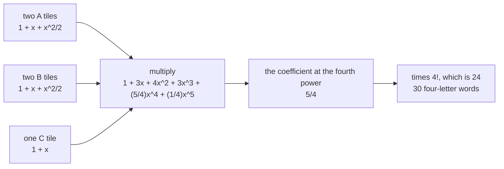

# Exponential generating functions: divide each count by n! and the series multiplies labelled objects correctly

[Syllabus](../../../SYLLABUS.md) → [Combinatorics and graphs](../../../SYLLABUS.md#w04) → [Generating Functions](../../../SYLLABUS.md#w04-s07) → Exponential generating functions

---

## General Overview

A Scrabble rack holds five tiles: two A's, two B's and one C. Lay four of them in a row and read off the letters: a four-letter word, dictionary or not. How many different words can that rack show?

Five different letters would give 5 × 4 × 3 × 2 = 120 rows. These are not five different letters. Each word comes from four of those rows — two ways to supply its A's, two its B's — so 120 rows are 30 words.

All five tiles down is the easy case: 5! / (2! × 2!) = 30, one division per pair ([Arranging with repeats](../02-Repeats%2C%20Groups%20and%20Double%20Counting/01-multiset-permutations.md)). Four out of five is not one division, because which four to lay down is itself a choice: AABB, AABC or ABBC, giving 6, 12 and 12 words. Three cases here, thousands on a real rack.

The shelf's earlier cards hang a count on a power of a placeholder, so one polynomial holds every size at once ([Generating functions](01-ordinary-generating-functions.md)). Here that machine answers 3 at the fourth power: it counts which letters to take, not their order. One change fixes that.

**Divide each count by the factorial of its size and hang it on that power; multiplying two such series shares the places out between the parts, so the factorial of the row length times the coefficient counts the arrangements.**

**What kind of fact this is:** a definition — where the counts are hung is a choice; the product rule that follows is a theorem, proved on this card in Why it works.

### The picture: one series per letter, one coefficient out



Each factor is one letter's count list, hung on the factorials.

---

## The formula

Three reminders. The factorial $n!$ is $n$ × ($n$ − 1) × … × 1, the orderings of $n$ distinct things, with 0! = 1. The binomial coefficient $C(n, k)$, "n choose k", counts ways of picking k of n places. A coefficient is the number in front of a power once a product is multiplied out ([Generating functions](01-ordinary-generating-functions.md)).

Count what one part of the row — one letter, say — can do on 0 places, 1 place, 2 places, and so on. Its **exponential generating function** $A(x)$ hangs each count on a power of $x$ over a factorial:

$$A(x) \;=\; a_0 \;+\; a_1\frac{x}{1!} \;+\; a_2\frac{x^2}{2!} \;+\; a_3\frac{x^3}{3!} \;+\; \cdots$$

**Read it aloud:** the count for n places rides on x to the n, divided by the orderings of n things.

Nothing is put in place of $x$; it is a peg keeping the sizes apart. A count comes back out as $n!$ times the coefficient of $x^n$. The factorial under each power is the **hanger**, and it is the only difference from the ordinary series.

What the hanger buys is the product. Take a second part, counts $b_n$ and series $B(x)$; let $c_n$ count the ways the two together fill $n$ places, each place to one part. Then $A(x)$ times $B(x)$ is the series of the $c_n$:

$$c_n \;=\; C(n,0)\,a_0 b_n \;+\; C(n,1)\,a_1 b_{n-1} \;+\; \cdots \;+\; C(n,n)\,a_n b_0$$

**Read it aloud:** choose the first part's places, count what each part does with its share, and add over the size of that share.

That sum is called binomial convolution: the two shares add to $n$, and a binomial coefficient picks the places. The rack takes one factor per letter: two A tiles cover no place, one or two, one way each, so their factor is 1 + x + x^2/2!. The B tiles match; the C tile stops after one place:

$$\Big(1 + x + \frac{x^2}{2!}\Big)^2\,\big(1 + x\big) \;=\; 1 + 3x + 4x^2 + 3x^3 + \tfrac{5}{4}x^4 + \tfrac{1}{4}x^5$$

Four-letter words: 4! times the coefficient of the fourth power, 24 × 5/4 = 30.

One split of the rack runs the table: the A and B tiles are the first part, the C tile the second.

| Symbol | Plain meaning | In our example | Push it up and the answer… |
| --- | --- | --- | --- |
| $x$ | the peg; its power records the size | never given a value | — |
| $n$ | places in the row | 4 | climbs, till the tiles run out |
| $n!$ | orderings of $n$ things; the hanger | 4! = 24 | — |
| $a_n$ | the first part's ways on $n$ places | A and B tiles: 1, 2, 4, 6, 6 | more words at every size |
| $b_n$ | the second part's ways on $n$ places | C tile: 1, 1, none | more words again |
| $c_n$ | both parts' ways on $n$ places | 30 at $n$ = 4 | — |
| $A(x)$, $B(x)$ | the parts' series | (1 + x + x^2/2)^2, and 1 + x | — |
| $C(n, k)$, $k$ | choices of the first part's $k$ places | C(4, 3) = 4 | — |

### When it holds

- **The places are distinguishable, the copies inside a part are not.** Number the tiles and the answer goes back to 120.
- **A part's count depends on how many places it gets, not which.** A ban on two A's side by side breaks that, and the product rule with it.
- **Each factor stops where its tiles run out.** Two A tiles give no $x^3$ term; leaving one in would count words the rack cannot spell.

---

## Why it works

### Step 0: what gets handed out is places

The four places are distinguishable — first, second, third, fourth — and the tiles of one letter are not. So a letter's share is a set of places, not an order: which places it gets is the whole story.

### Step 1: one letter's own series

Two A tiles, given named places, cover none, one or two of them, one way each: an A in each place given. Three cannot be covered, so the counts are 1, 1, 1, then nothing. Hung on the factorials, that list is 1 + x + x^2/2. The 2 underneath counts nothing; it is the hanger Step 2 needs.

### Step 2: multiply, and the choosing appears by itself

Take one term from each of two series:

$$a_i\frac{x^i}{i!} \times b_j\frac{x^j}{j!} \;=\; a_i b_j\,\frac{x^{i+j}}{i!\,j!}$$

Only pairs with i + j = n land on the n-th power. Writing k for i, the coefficient there sums $a_k b_{n-k} / (k!\,(n-k)!)$ over k from 0 to n. Multiply by $n!$ and every term picks up

$$\frac{n!}{k!\,(n-k)!} \;=\; C(n, k).$$

Nothing but the hangers produced that; on plain powers the sizes merely add.

### Step 3: the same number by handing the places out

Count directly, no series in sight. To fill n places: pick the k places for the first part, $C(n, k)$ ways; it fills them in its own count for k places; the second fills the other n − k in its count. Add over k. That is Step 2's sum, so the product *is* the handing out.

At n = 4, take the A and B tiles as the first part, the C tile as the second. One C tile covers one place or none, so the first part takes three or four places. On three it spells AAB or ABB, 3 rows each; on four, 4! / (2! × 2!). Both come to 6:

| first part's places | its ways | choices of those places | words |
| --- | --- | --- | --- |
| 3 | 6 | C(4, 3) = 4 | 24 |
| 4 | 6 | C(4, 4) = 1 | 6 |

Nothing else contributes, and 24 + 6 = 30.

### Step 4: the whole rack in one product

Three letters, three factors, one multiplication. The fourth power carries 5/4 and 4! × 5/4 = 30; the fifth carries 1/4 and 5! × 1/4 = 30, the whole rack down, where the division rule agrees. With m factors Step 2's algebra leaves a multinomial coefficient in front instead of a binomial ([Arranging with repeats](../02-Repeats%2C%20Groups%20and%20Double%20Counting/01-multiset-permutations.md)); every letter's count being 1, the product counts the words.

A second road skips series: split by which letters are taken, count each case by the division rule of [Arranging with repeats](../02-Repeats%2C%20Groups%20and%20Double%20Counting/01-multiset-permutations.md), add — 6 + 12 + 12 = 30. Multiplying does that split for free, and cases grow fast while a polynomial multiply does not.

---

## Worked numbers, by hand

| Step | Arithmetic | Value |
| --- | --- | --- |
| the A tiles alone | each 1, over 0!, 1!, 2! | 1, 1, 1/2 |
| the B tiles in | times 1 + x + x^2/2 | 1, 2, 2, 1, 1/4 |
| the C tile in | times 1 + x | 1, 3, 4, 3, 5/4, 1/4 |
| four-letter words | 24 × 5/4 | **30** |
| the same by listing | 6 + 12 + 12 | **30** |
| all five tiles down | 120 × 1/4 | **30** |

Six of the thirty use both A's and both B's; the other two selections give twelve each.

### What breaks if you drop a piece

| Mistake | Comes out at | What went wrong |
| --- | --- | --- |
| Counts hung on plain powers | 3 | Counts which letters to take, not the words |
| The coefficient read as the answer | 5/4 | It is the count over 4! |
| 1 + x + x^2 for a pair, still × 4! | 72 | No hanger inside the factor |
| All five tiles taken as different | 120 | Each word counted 4 times over |

The code prints all four.

---

## Code, from first principles, and it actually runs

Nothing is imported. Three roads sharing no arithmetic reach the counts. One multiplies the letter series exactly, whole-number numerators over one shared denominator, then multiplies by the factorial. One never divides a count, handing the places out with binomial coefficients. One lists every word the rack spells.

### Python

```python
# Exponential generating functions -- the check behind the card.  Nothing is
# imported.  A Scrabble rack holds five tiles: A, A, B, B, C.  How many words of
# each length it can spell is found three ways: by multiplying one series per
# letter and reading n! times the coefficient of x^n, by choosing which places
# each letter fills, and by listing every word.  Lengths n = 0 up to 5.
RACK, TOP = [("A", 2), ("B", 2), ("C", 1)], 5
def gcd(a, b): return a if b == 0 else gcd(b, a % b)
def fact(n): return 1 if n < 2 else n * fact(n - 1)
def choose(n, k): return fact(n) // (fact(k) * fact(n - k))       # C(n, k)
def frac(a, b):                                                  # lowest terms
    g = gcd(a, b) or 1
    return f"{a // g}" if b // g == 1 else f"{a // g}/{b // g}"
def row(num, den): return ", ".join(frac(c, den) for c in num)
def conv(p, q):                                                  # plain product
    return [sum(p[i] * q[n - i] for i in range(n + 1) if i < len(p) and n - i < len(q))
            for n in range(len(p) + len(q) - 1)]
def bconv(u, v):                                                 # split the places
    return [sum(choose(n, k) * u[k] * v[n - k] for k in range(n + 1))
            for n in range(min(len(u), len(v)))]
def digits(code, base, n): return [code // base ** i % base for i in range(n)]
def words(n):                                                    # list them all
    return [w for w in (digits(c, len(RACK), n) for c in range(len(RACK) ** n))
            if all(w.count(i) <= RACK[i][1] for i in range(len(RACK)))]
def shape(w): return "".join(RACK[i][0] for i in sorted(w))
num, den, shown = [1], 1, []                     # road one: one series per letter
for letter, copies in RACK:
    num = conv(num, [fact(copies) // fact(j) for j in range(copies + 1)])
    den *= fact(copies)
    shown.append(row(num, den))
egf = [fact(n) * num[n] // den for n in range(TOP + 1)]
acc, parts = [1] + [0] * TOP, []                 # road two: whole numbers only
for _, copies in RACK:
    acc = bconv(acc, [1] * (copies + 1) + [0] * (TOP - copies))
    parts.append(acc)
ab, listed = parts[1], [len(words(n)) for n in range(TOP + 1)]
kinds = [(s, sum(1 for w in words(4) if shape(w) == s)) for s in sorted({shape(w) for w in words(4)})]
osel = [1]                                       # the ordinary series, no factorials
for _, copies in RACK: osel = conv(osel, [1] * (copies + 1))
tiles = sum(1 for c in range(5 ** 4) if len(set(digits(c, 5, 4))) == 4)
s3, s4, mp = choose(4, 3) * ab[3], ab[4], fact(5) // (fact(2) * fact(2))
print("rack: " + ", ".join(f"{L} x {c}" for L, c in RACK) + "; one series per letter")
print(f"coefficients of x^0 up, after the A tile: {shown[0]}")
print(f"after the B tile as well: {shown[1]}")
print(f"after the C tile, the whole rack: {shown[2]}")
print(f"road one, n! times the coefficient of x^n: {egf}")
print(f"road two, choosing which places each letter fills: {acc}")
print(f"road three, listing every word: {listed}")
print(f"the split at n = 4: C(4,3) x {ab[3]} = {s3}, C(4,4) x {ab[4]} = {s4}, total {s3 + s4}")
print(f"four-letter words: 4! x {frac(num[4], den)} = {fact(4)} x {frac(num[4], den)} = {egf[4]}")
print(f"five-letter words: 5! x {frac(num[5], den)} = {fact(5)} x {frac(num[5], den)} = {egf[5]}, and 5!/(2! 2!) = {mp}")
print("the four-letter words by selection: " + ", ".join(f"{s} {c}" for s, c in kinds))
print(f"mistake 1, the ordinary series read ordinarily: {osel[4]} selections, not {egf[4]} words")
print(f"mistake 2, the coefficient of x^4 left as it stands: {frac(num[4], den)}, not a count")
print(f"mistake 3, all five tiles taken as distinct: {tiles}, each word {tiles // egf[4]} times over")
print(f"mistake 4, no division by 2! but still times 4!: {fact(4)} x {osel[4]} = {fact(4) * osel[4]}")
assert egf == listed                             # the series road against the listing
assert acc == listed                             # the choosing road against the listing
assert listed[5] == mp and tiles == listed[4] * fact(2) * fact(2)
assert osel[4] == len(kinds)                     # selections, two ways
print("ALL CHECKS PASS")
```

**Ran 2026-09-19 on macOS, Python 3.14.6, standard library only. All checks passed. Output, pasted from the run:**

```
rack: A x 2, B x 2, C x 1; one series per letter
coefficients of x^0 up, after the A tile: 1, 1, 1/2
after the B tile as well: 1, 2, 2, 1, 1/4
after the C tile, the whole rack: 1, 3, 4, 3, 5/4, 1/4
road one, n! times the coefficient of x^n: [1, 3, 8, 18, 30, 30]
road two, choosing which places each letter fills: [1, 3, 8, 18, 30, 30]
road three, listing every word: [1, 3, 8, 18, 30, 30]
the split at n = 4: C(4,3) x 6 = 24, C(4,4) x 6 = 6, total 30
four-letter words: 4! x 5/4 = 24 x 5/4 = 30
five-letter words: 5! x 1/4 = 120 x 1/4 = 30, and 5!/(2! 2!) = 30
the four-letter words by selection: AABB 6, AABC 12, ABBC 12
mistake 1, the ordinary series read ordinarily: 3 selections, not 30 words
mistake 2, the coefficient of x^4 left as it stands: 5/4, not a count
mistake 3, all five tiles taken as distinct: 120, each word 4 times over
mistake 4, no division by 2! but still times 4!: 24 x 3 = 72
ALL CHECKS PASS
```

### Rust

Same numbers, same labels, built with `rustc --edition 2021 -O`.

```rust
// Exponential generating functions -- the same check as the Python, in Rust.  No
// crates.  A Scrabble rack holds five tiles: A, A, B, B, C.  How many words of each
// length it can spell is found three ways: by multiplying one series per letter and
// reading n! times the coefficient of x^n, by choosing which places each letter
// fills, and by listing every word.  Lengths n = 0 up to 5.
const RACK: [(char, i64); 3] = [('A', 2), ('B', 2), ('C', 1)];
const TOP: usize = 5;
fn gcd(a: i64, b: i64) -> i64 { if b == 0 { a } else { gcd(b, a % b) } }
fn fact(n: i64) -> i64 { if n < 2 { 1 } else { n * fact(n - 1) } }
fn choose(n: i64, k: i64) -> i64 { fact(n) / (fact(k) * fact(n - k)) }   // C(n, k)
fn frac(a: i64, b: i64) -> String {                                    // lowest terms
    let g = if gcd(a, b) == 0 { 1 } else { gcd(a, b) };
    if b / g == 1 { format!("{}", a / g) } else { format!("{}/{}", a / g, b / g) }
}
fn row(num: &[i64], den: i64) -> String {
    num.iter().map(|&c| frac(c, den)).collect::<Vec<String>>().join(", ")
}
fn conv(p: &[i64], q: &[i64]) -> Vec<i64> {                            // plain product
    (0..p.len() + q.len() - 1).map(|n| (0..=n).filter(|&i| i < p.len() && n - i < q.len())
        .map(|i| p[i] * q[n - i]).sum()).collect()
}
fn bconv(u: &[i64], v: &[i64]) -> Vec<i64> {                           // split the places
    (0..u.len().min(v.len())).map(|n| (0..=n).map(|k| choose(n as i64, k as i64) * u[k] * v[n - k]).sum()).collect()
}
fn digits(code: usize, base: usize, n: usize) -> Vec<usize> {
    (0..n).map(|i| code / base.pow(i as u32) % base).collect()
}
fn words(n: usize) -> Vec<Vec<usize>> {                                // list them all
    (0..RACK.len().pow(n as u32)).map(|c| digits(c, RACK.len(), n))
        .filter(|w| (0..RACK.len()).all(|i| w.iter().filter(|&&x| x == i).count() as i64 <= RACK[i].1)).collect()
}
fn shape(w: &[usize]) -> String {                                      // the word's letters, sorted
    let mut s = w.to_vec(); s.sort();
    s.iter().map(|&i| RACK[i].0).collect()
}
fn main() {
    let (mut num, mut den, mut shown) = (vec![1i64], 1i64, Vec::new());  // road one
    for &(_, copies) in RACK.iter() {
        num = conv(&num, &(0..=copies).map(|j| fact(copies) / fact(j)).collect::<Vec<i64>>());
        den *= fact(copies);
        shown.push(row(&num, den));
    }
    let egf: Vec<i64> = (0..=TOP).map(|n| fact(n as i64) * num[n] / den).collect();
    let (mut acc, mut parts) = (vec![0i64; TOP + 1], Vec::new());        // road two
    acc[0] = 1;
    for &(_, copies) in RACK.iter() {
        acc = bconv(&acc, &(0..=TOP).map(|j| if j <= copies as usize { 1 } else { 0 }).collect::<Vec<i64>>());
        parts.push(acc.clone());
    }
    let ab = &parts[1];
    let listed: Vec<i64> = (0..=TOP).map(|n| words(n).len() as i64).collect();
    let mut keys: Vec<String> = words(4).iter().map(|w| shape(w)).collect();
    keys.sort();
    let mut kinds: Vec<(String, i64)> = Vec::new();
    for s in keys { match kinds.last_mut() { Some(k) if k.0 == s => k.1 += 1, _ => kinds.push((s, 1)) } }
    let mut osel = vec![1i64];                                  // the ordinary series
    for &(_, copies) in RACK.iter() { osel = conv(&osel, &vec![1i64; copies as usize + 1]) }
    let tiles = (0..5usize.pow(4)).filter(|&c| { let mut d = digits(c, 5, 4); d.sort(); d.dedup(); d.len() == 4 }).count() as i64;
    let (s3, s4, mp) = (choose(4, 3) * ab[3], ab[4], fact(5) / (fact(2) * fact(2)));
    println!("rack: {}; one series per letter", RACK.iter().map(|&(l, c)| format!("{} x {}", l, c)).collect::<Vec<String>>().join(", "));
    println!("coefficients of x^0 up, after the A tile: {}", shown[0]);
    println!("after the B tile as well: {}", shown[1]);
    println!("after the C tile, the whole rack: {}", shown[2]);
    println!("road one, n! times the coefficient of x^n: {:?}", egf);
    println!("road two, choosing which places each letter fills: {:?}", acc);
    println!("road three, listing every word: {:?}", listed);
    println!("the split at n = 4: C(4,3) x {} = {}, C(4,4) x {} = {}, total {}", ab[3], s3, ab[4], s4, s3 + s4);
    println!("four-letter words: 4! x {} = {} x {} = {}", frac(num[4], den), fact(4), frac(num[4], den), egf[4]);
    println!("five-letter words: 5! x {} = {} x {} = {}, and 5!/(2! 2!) = {}", frac(num[5], den), fact(5), frac(num[5], den), egf[5], mp);
    println!("the four-letter words by selection: {}", kinds.iter().map(|(s, c)| format!("{} {}", s, c)).collect::<Vec<String>>().join(", "));
    println!("mistake 1, the ordinary series read ordinarily: {} selections, not {} words", osel[4], egf[4]);
    println!("mistake 2, the coefficient of x^4 left as it stands: {}, not a count", frac(num[4], den));
    println!("mistake 3, all five tiles taken as distinct: {}, each word {} times over", tiles, tiles / egf[4]);
    println!("mistake 4, no division by 2! but still times 4!: {} x {} = {}", fact(4), osel[4], fact(4) * osel[4]);
    assert!(egf == listed);                          // the series road against the listing
    assert!(acc == listed);                          // the choosing road against the listing
    assert!(listed[5] == mp && tiles == listed[4] * fact(2) * fact(2));
    assert!(osel[4] == kinds.len() as i64);          // selections, two ways
    println!("ALL CHECKS PASS");
}
```

**Ran 2026-09-19 on macOS, rustc 1.98.1, no crates. All checks passed. Output, pasted from the run:**

```
rack: A x 2, B x 2, C x 1; one series per letter
coefficients of x^0 up, after the A tile: 1, 1, 1/2
after the B tile as well: 1, 2, 2, 1, 1/4
after the C tile, the whole rack: 1, 3, 4, 3, 5/4, 1/4
road one, n! times the coefficient of x^n: [1, 3, 8, 18, 30, 30]
road two, choosing which places each letter fills: [1, 3, 8, 18, 30, 30]
road three, listing every word: [1, 3, 8, 18, 30, 30]
the split at n = 4: C(4,3) x 6 = 24, C(4,4) x 6 = 6, total 30
four-letter words: 4! x 5/4 = 24 x 5/4 = 30
five-letter words: 5! x 1/4 = 120 x 1/4 = 30, and 5!/(2! 2!) = 30
the four-letter words by selection: AABB 6, AABC 12, ABBC 12
mistake 1, the ordinary series read ordinarily: 3 selections, not 30 words
mistake 2, the coefficient of x^4 left as it stands: 5/4, not a count
mistake 3, all five tiles taken as distinct: 120, each word 4 times over
mistake 4, no division by 2! but still times 4!: 24 x 3 = 72
ALL CHECKS PASS
```

The two outputs match line for line.

> [!TIP]
> **Try changing**
> Guess first, then run it. The asserts are pinned to this rack, so expect one to stop the program.
> - **Take the factorials out.** Use `[1] * (copies + 1)` for each letter, drop the line multiplying `den`. The count reads 72; the first assert stops it.
> - **Stop the second road choosing.** Put `1` for `choose(n, k)` in `bconv`. That road reports 3, selections rather than words; the second assert stops it.
> - **Give every tile its own letter.** Set `RACK` to five entries of one copy each. The count climbs to 120; the third assert stops it.

---

## The usual mistake

> [!warning]
> **Combining the counts with no binomial coefficient.** An ordinary product adds sizes and nothing else. This one also hands the places out, and that handing out *is* the C(n, k) in the sum. On this rack the difference is 3 against 30: selections against words.
>
> - **Reading the coefficient as a count.** The fourth power carries 5/4, which counts nothing. The count is 4! times it, 30.
> - **Losing the hanger inside a factor.** A pair of tiles gives 1 + x + x^2/2. Writing 1 + x + x^2 and still multiplying by 4! gives 72.
> - **Reading a series without knowing its hanger.** One polynomial names two count lists, on plain powers or on powers over factorials. Which it is travels with the series, not inside it.

---

## Where you meet it in real life

- **Word games.** A rack's whole profile falls out of one product: this one spells 1, 3, 8, 18, 30 and 30 words in rows of length nought to five.
- **Codes with a supply limit.** Eight-character codes using no character twice: a factor of 1 + x per character, read at the eighth power. Code positions are distinguishable, so the factorials belong.
- **Labelled structures.** Partitions of a numbered set, permutations by cycle type, trees on numbered points: each built from these series. A part with no supply limit has count 1 at every size, so its series never stops: 1 + x + x^2/2! + x^3/3! + …, written e^x and built in wing 06, calculus and analysis.

> **Say it back**
> Places in a row are distinguishable; the copies inside one part are not. Hang each part's count for n places on the n-th power of a peg over the factorial of n. Multiplying two such series hands the places out, each term carrying the binomial coefficient that chooses the first part's places. A count comes back as the factorial of the row length times the coefficient: for A, A, B, B, C the fourth power carries 5/4, and 4! × 5/4 = 30 words.

---

## What this builds on

- [Generating functions](01-ordinary-generating-functions.md): the same peg with no factorial under it, counting selections — the 3 this card turns into 30.
- [Arranging with repeats](../02-Repeats%2C%20Groups%20and%20Double%20Counting/01-multiset-permutations.md): the division giving 30 with all five tiles down, and the 6, 12 and 12 in the selections.

## Where this goes next

- [The Catalan generating function](05-catalan-generating-function.md): a series that never stops, handled by a closed form instead of a finite multiplication.

Every factor here stops, because a tile runs out. A part with no limit gives a series that never stops, and reading a count off one needs a closed form — the shelf's last card makes that move.

---

## Sources

Verified 19 Sep 2026: every link below resolves to the publisher's page.

- Wilf, Herbert S. *generatingfunctionology*, 2nd ed. Academic Press, 1994. [Author's free edition](https://www2.math.upenn.edu/~wilf/DownldGF.html). Chapter 2 proves the product rule.
- Flajolet, Philippe, and Robert Sedgewick. *Analytic Combinatorics*. Cambridge University Press, 2009. [Authors' free PDF](https://algo.inria.fr/flajolet/Publications/book.pdf). Chapter II is the labelled product, Step 3 here.
- Stanley, Richard P. *Enumerative Combinatorics*, Volume 1, 2nd ed. Cambridge University Press, 2012. [doi:10.1017/CBO9781139058520](https://doi.org/10.1017/CBO9781139058520). Section 1.1 for the count as factorial times coefficient.
