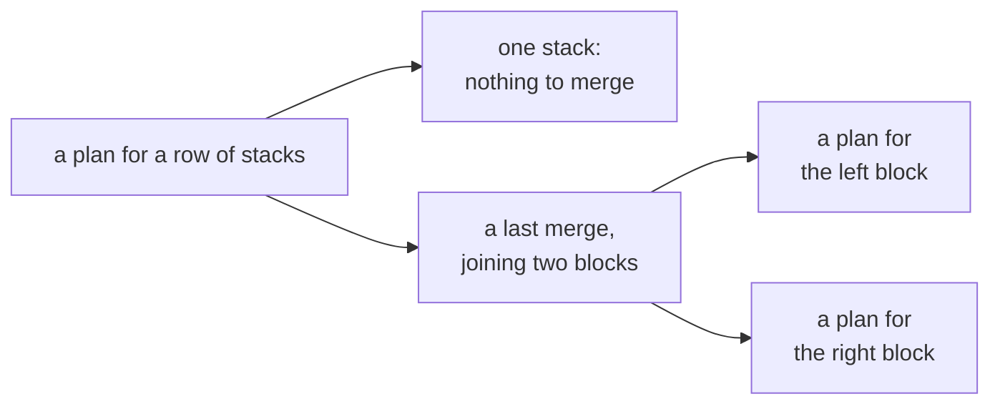

# The Catalan generating function: the first-return recurrence becomes C = 1 + x C^2, solved by iteration

Combinatorics and graphs → Generating Functions → An equation for a series → The Catalan generating function

---

## General Overview

A mailroom bench holds six sorted stacks of envelopes in a row. A machine merges two stacks standing side by side into one. Five merges leave a single stack.

The finished stack is always the same; the work is not. What varies is the plan: which neighbours go in first. Brackets record it. Four stacks A, B, C and D allow five plans: (((AB)C)D), ((A(BC))D), ((AB)(CD)), (A((BC)D)) and (A(B(CD))). One stack allows one plan, the do-nothing plan.

The counts from one stack to six are 1, 1, 2, 5, 14, 42 — the Catalan numbers ([catalan-numbers](../06-Lattice%20Paths%20and%20Catalan%20Numbers/03-catalan-numbers.md)), reached there one at a time. The list goes on one line here instead, as coefficients of a series in a marker x.

**Hang the counts on powers of x and the split "a last merge joins a left plan to a right plan" becomes C = 1 + x C^2: iterating that equation settles one coefficient a round, and the quadratic formula turns it into (1 - sqrt(1 - 4x))/(2x).**

**What kind of fact this is:** a method; the equation and the closed form are both derived here, and one step waits for wing 06 — reading the coefficient of x^n off the square root.

### The picture: where a plan can come from



The single stack is the 1, the last merge the x, the blocks the two copies of C. Every plan lies on one branch, never both: the cases add, the blocks multiply.

---

## The formula

Notation first, in words. This shelf holds a sequence of counts as one series: the count for size $n$ hangs on $x$ to the power $n$, and "the coefficient of x^n" names it ([ordinary-generating-functions](01-ordinary-generating-functions.md)). Here $C_n$ counts plans using $n$ merges, a row of $n$ + 1 stacks; $x$ is a place-marker, not a quantity, carrying one factor per merge.

$$C(x) = 1 + x\,C(x)^2$$

**Read it aloud:** a plan is either the do-nothing plan for one stack, or a last merge — one x — with a plan for the left block and a plan for the right.

Coefficient by coefficient, that line is the convolution recurrence proved on [catalan-numbers](../06-Lattice%20Paths%20and%20Catalan%20Numbers/03-catalan-numbers.md): a sum of products of two earlier counts, one product per split of the merges. Treated instead as a quadratic in $C$ and solved, it names the list in one expression:

$$C(x) = \frac{1 - \sqrt{1 - 4x}}{2x}$$

| Symbol | Plain meaning | In our example | Push it up and the answer… |
| --- | --- | --- | --- |
| $x$ | the marker, one factor per merge | x^5 carries the six-stack count | — |
| $C(x)$ | the counts as one series | 1 + x + 2x^2 + 5x^3 + 14x^4 + 42x^5 + … | — |
| $C_n$ | the coefficient of x^n: plans using n merges | 42 at n = 5 | — |
| $C_0$ | the do-nothing plan | 1 | later counts scale with it |
| $n$ | merges in a plan | 5 for six stacks | far larger counts |
| $\sqrt{1 - 4x}$ | the root in the closed form | 0.774596669241 at x = 0.1 | — |

### When it holds

- **Exactly one last merge.** Removing it leaves one plan each side; a plan coming apart two ways would be counted twice.
- **The one-stack plan counts.** $C_0 = 1$ is what the rounds grow from; drop it and every coefficient comes out 0.
- **The marker sits in front of the square.** That is why a round settles one more coefficient; without it nothing does.
- **A number in place of x is a spot-check only.** The square root needs 1 - 4x at zero or above, so x at most one quarter: 0.6 at x = 0.1. At x = 0 the fraction reads 0 over 0, while the equal form 2/(1 + sqrt(1 - 4x)) below reads 1.

---

## Why it works

### Step 0: one series carries the whole list

Six counts are six separate facts. Hung on powers of x they become one object, $C(x)$, about which a single statement can be made, the powers keeping each count in its own column.

### Step 1: the split reads off as an equation

Take a row whose plan has at least one merge. One of those merges is last, and it joins two blocks: everything left of it, by then one stack, and everything right. Each block is a shorter row with its own plan, and the plan comes apart this way exactly once.

Two rules make that algebra ([counting-with-generating-functions](02-counting-with-generating-functions.md)): cases add their series, and two independent pieces multiply theirs, the coefficient of x^n in a product summing over every split of n. So the single stack gives 1, the other case one x times $C(x)$ twice, once per block.

### Step 2: iterate, and each round settles one more count

One count is given outright: $C_0 = 1$. Put C = 1 into the right-hand side and keep putting the result back; the table below has the first rounds' arithmetic. The code prints six rounds, and each column stops moving: x^3 settles at 5 in round 3, x^4 at 14 in round 4, x^5 at 42 in round 5; round 6 repeats round 5.

The x in front of the square is the reason: the coefficient of x^n on the right is built only from coefficients below x^n on the left, so a round correct up to some power hands back one more, and the settled part never moves. Entries above that line — the 6s in round 3, the 26 in round 4 — are working residue.

### Step 3: the quadratic formula names the whole series

Rearranged, the equation is $x\,C(x)^2 - C(x) + 1 = 0$. Treat $C(x)$ as the unknown and x as a constant, and the quadratic formula applies ([quadratic-formula](../../03-Algebra/02-Polynomials/03-quadratic-formula.md)):

$$C(x) = \frac{1 \pm \sqrt{1 - 4x}}{2x}$$

Two roots, one counting series, so the sign has to be chosen: minus. With the plus sign the top heads for 2 while the bottom shrinks to nothing as x shrinks, so the value runs away; a list of counts reads 1 there. At x = 0.1 the minus root is 1.127016653793, the plus root 8.872983346207.

<details>
<summary>Detailed proof: the two roots, the choice of sign, and the numerical check</summary>

Write C for $C(x)$. In $x\,C^2 - C + 1 = 0$ the coefficients are a = x, b = -1 and c = 1, so b^2 - 4ac = 1 - 4x and -b = 1, giving the two roots above.

Multiply the minus root above and below by 1 + sqrt(1 - 4x): the top becomes 1 - (1 - 4x) = 4x, which cancels the 2x.

$$\frac{1 - \sqrt{1 - 4x}}{2x} = \frac{2}{1 + \sqrt{1 - 4x}}$$

At x = 0 that reads 2 over 1 + 1, which is 1: the do-nothing plan, $C_0$. The plus root is 2 over a vanishing 2x, past every bound. Both roots return themselves through 1 + x C^2, so that test cannot separate them; the code separates them by adding up the counts at x = 0.1, landing on the minus root, 1.127016653793.

</details>

One step is left undone: reading the coefficient of x^n off the square root needs sqrt(1 - 4x) expanded in powers of x, which waits for wing 06. The code closes the circle from the other side, pushing the closed count C(2n, n)/(n + 1) through 1 + x C^2 - C and leaving 0 out to x^10.

---

## Worked numbers, by hand

Each round squares the series so far, shifts it up one power of x, and adds 1.

| Step | Arithmetic | Value |
| --- | --- | --- |
| round 1 | 1 + x(1)^2 | 1 + x |
| round 2 | 1 + x(1 + x)^2 | 1 + x + 2x^2 + x^3 |
| round 3 | square, shift, add 1 | coefficients 1 1 2 5 6 6 |
| round 4 | again | 1 1 2 5 14 26 |
| round 5 | again | 1 1 2 5 14 **42** |
| by listing | every merge order simulated, distinct nestings kept | **42** |
| by the closed count | C(2n, n)/(n + 1) at n = 5 | **42** |
| the closed form | (1 - 0.774596669241)/0.2 at x = 0.1 | **1.127016653793** |

Six stacks merge in 42 nestings, and the rounds gave up the counts for one to five on the way. The code also tests its series multiply on the shelf's two dice: 6 at x^7, 36 in all.

### What breaks if you drop a piece

| Mistake | Comes out at | What went wrong |
| --- | --- | --- |
| Taking the plus root | 8.872983346207 at x = 0.1 | It runs away where the counts read 1 |
| Dropping the leading 1 | 0 0 0 0 0 0 | Without the one-stack plan nothing can start |
| Coefficient times coefficient | 1 1 1 4 25 196 | A product of series convolves, split by split |
| Merge orders, not plans | 120 for six stacks | Those 120 orders build only 42 nestings |

The code prints all four.

---

## Code, from first principles, and it actually runs

Nothing is imported. Three roads reach the same six counts and share no arithmetic: iterating C <- 1 + x C^2 on series cut above x^5; simulating every merge order of one to six stacks and keeping the distinct nestings; and the closed count C(2n, n)/(n + 1), also pushed through 1 + x C^2 - C out to x^10. The square root is the script's own, by Heron's method.

### Python

```python
# The Catalan generating function -- the check behind the card.  Nothing is imported.  Six sorted
# stacks of envelopes stand in a row; each step merges two neighbouring stacks, so five merges finish
# the row, and a plan is the nesting of those merges.  The plans are counted three ways: by iterating
# C <- 1 + x C^2 on truncated series, by simulating every merge order and keeping the distinct
# nestings, and by the closed count C(2n, n)/(n + 1).  The closed form is then checked at x = 0.1.
DEG, DEEP, X = 5, 10, 0.1
def mul(a, b, deg):                      # series product, powers above x^deg dropped
    out = [0] * (deg + 1)
    for i, ai in enumerate(a):
        for j, bj in enumerate(b[:deg + 1 - i]): out[i + j] += ai * bj
    return out
def rnd(c, deg, lead=1):                 # one round of C <- lead + x C^2
    return [lead] + mul(c, c, deg)[:deg]
def plans(k):                            # every merge order of k stacks, simulated on strings
    rows = [tuple(chr(65 + i) for i in range(k))]
    for _ in range(k - 1):
        rows = [r[:i] + ("(" + r[i] + r[i + 1] + ")",) + r[i + 2:] for r in rows for i in range(len(r) - 1)]
    return [r[0] for r in rows]
def choose(n, k):                        # C(n, k), from the product formula
    out = 1
    for i in range(k): out = out * (n - i) // (i + 1)
    return out
def cat(upto): return [choose(2 * n, n) // (n + 1) for n in range(upto + 1)]   # the closed count
def heron(v):                            # square root, by Heron's own method
    g = 1.0
    for _ in range(60): g = (g + v / g) / 2
    return g
def row(label, values): print(f"{label:<46}" + "".join(f"{v:>4}" for v in values))
rounds = [[1] + [0] * DEG]                                    # road one: iterate the equation
for _ in range(DEG + 1): rounds.append(rnd(rounds[-1], DEG))
listed = [len(set(plans(k))) for k in range(1, DEG + 2)]      # road two: simulate every order
closed, deep = cat(DEG), cat(DEEP)                            # road three: the closed count
resid = [a - b for a, b in zip(rnd(deep, DEEP), deep)]        # does the closed count solve it?
dice = mul([0] + [1] * 6, [0] + [1] * 6, 12)                  # the shelf's two dice, as a check
root = heron(1 - 4 * X)
minus, plus = (1 - root) / (2 * X), (1 + root) / (2 * X)
back = 1 + X * minus * minus
total, p = 0.0, 1.0
for c in cat(30): total, p = total + c * p, p * X
dropped = [1] + [0] * DEG
for _ in range(DEG + 1): dropped = rnd(dropped, DEG, 0)
term = [1] + [c * c for c in rounds[DEG]][:DEG]
print(f"six sorted stacks in a row, five merges to finish: plans for 1 to {DEG + 1} stacks")
for k in range(1, DEG + 2): row(f"round {k} of C <- 1 + x C^2", rounds[k])
row("distinct nestings, by listing merge orders", listed)
row("the closed count C(2n,n)/(n+1)", closed)
print("the 5 plans for 4 stacks: " + " ".join(sorted(set(plans(4)))))
print(f"1 + x C^2 - C on the closed counts, x^0 to x^{DEEP}: " + " ".join(str(v) for v in resid))
print(f"the shelf's two dice, the square of x + ... + x^6: {dice[7]} at x^7, {sum(dice)} in all")
print(f"closed form at x = {X}: 1 - 4x = {1 - 4 * X:.1f}, its square root {root:.12f}, (1 - {root:.12f})/{2 * X:.1f} = {minus:.12f}")
print(f"that number back through 1 + x C^2: {back:.12f}; the counts summed at x = {X}, n = 0 to 30: {total:.12f}")
print(f"mistake 1, the plus root: (1 + {root:.12f})/{2 * X:.1f} = {plus:.12f}")
row("mistake 2, dropping the leading 1", dropped)
row("mistake 3, squaring coefficient by coefficient", term)
print(f"mistake 4, merge orders counted as plans, {DEG + 1} stacks: {len(plans(DEG + 1))}, not {listed[DEG]}")
assert rounds[DEG] == listed and listed == closed and rounds[DEG] == rounds[DEG + 1]   # three roads
assert resid == [0] * (DEEP + 1) and deep[DEG] == 42                  # the counts solve the equation
assert abs(back - minus) < 1e-12 and abs(total - minus) < 1e-12       # the closed form, as a number
assert dice[7] == 6 and sum(dice) == 36 and len(plans(DEG + 1)) > listed[DEG]
print("ALL CHECKS PASS")
```

**Ran 2026-09-19 on macOS, Python 3.14.6, standard library only. All checks passed. Output, pasted from the run:**

```
six sorted stacks in a row, five merges to finish: plans for 1 to 6 stacks
round 1 of C <- 1 + x C^2                        1   1   0   0   0   0
round 2 of C <- 1 + x C^2                        1   1   2   1   0   0
round 3 of C <- 1 + x C^2                        1   1   2   5   6   6
round 4 of C <- 1 + x C^2                        1   1   2   5  14  26
round 5 of C <- 1 + x C^2                        1   1   2   5  14  42
round 6 of C <- 1 + x C^2                        1   1   2   5  14  42
distinct nestings, by listing merge orders       1   1   2   5  14  42
the closed count C(2n,n)/(n+1)                   1   1   2   5  14  42
the 5 plans for 4 stacks: (((AB)C)D) ((A(BC))D) ((AB)(CD)) (A((BC)D)) (A(B(CD)))
1 + x C^2 - C on the closed counts, x^0 to x^10: 0 0 0 0 0 0 0 0 0 0 0
the shelf's two dice, the square of x + ... + x^6: 6 at x^7, 36 in all
closed form at x = 0.1: 1 - 4x = 0.6, its square root 0.774596669241, (1 - 0.774596669241)/0.2 = 1.127016653793
that number back through 1 + x C^2: 1.127016653793; the counts summed at x = 0.1, n = 0 to 30: 1.127016653793
mistake 1, the plus root: (1 + 0.774596669241)/0.2 = 8.872983346207
mistake 2, dropping the leading 1                0   0   0   0   0   0
mistake 3, squaring coefficient by coefficient   1   1   1   4  25 196
mistake 4, merge orders counted as plans, 6 stacks: 120, not 42
ALL CHECKS PASS
```

### Rust

Same numbers, same labels, built with `rustc --edition 2021 -O`.

```rust
// The Catalan generating function -- the same check as the Python, in Rust.  No crates.  Six sorted
// stacks of envelopes stand in a row; each step merges two neighbouring stacks, so five merges finish
// the row, and a plan is the nesting of those merges.  The plans are counted three ways: by iterating
// C <- 1 + x C^2 on truncated series, by simulating every merge order and keeping the distinct
// nestings, and by the closed count C(2n, n)/(n + 1).  The closed form is then checked at x = 0.1.
const DEG: usize = 5; const DEEP: usize = 10; const X: f64 = 0.1;
fn mul(a: &[i64], b: &[i64], deg: usize) -> Vec<i64> {   // series product, powers above x^deg dropped
    let mut out = vec![0i64; deg + 1];
    for (i, ai) in a.iter().enumerate() { for (j, bj) in b.iter().take((deg + 1).saturating_sub(i)).enumerate() { out[i + j] += ai * bj } }
    out
}
fn rnd(c: &[i64], deg: usize, lead: i64) -> Vec<i64> {   // one round of C <- lead + x C^2
    let mut out = vec![lead]; out.extend_from_slice(&mul(c, c, deg)[..deg]); out
}
fn plans(k: usize) -> Vec<String> {                      // every merge order of k stacks, on strings
    let mut rows: Vec<Vec<String>> = vec![(0..k).map(|i| ((b'A' + i as u8) as char).to_string()).collect()];
    for _ in 1..k {
        let mut next: Vec<Vec<String>> = Vec::new();
        for r in &rows { for i in 0..r.len() - 1 {
            let mut s = r.clone();
            s[i] = format!("({}{})", r[i], r[i + 1]); s.remove(i + 1); next.push(s);
        } }
        rows = next;
    }
    rows.iter().map(|r| r[0].clone()).collect()
}
fn nestings(k: usize) -> Vec<String> { let mut v = plans(k); v.sort(); v.dedup(); v }
fn choose(n: i64, k: i64) -> i64 {                       // C(n, k), from the product formula
    let mut out = 1i64; for i in 0..k { out = out * (n - i) / (i + 1) } out
}
fn cat(upto: i64) -> Vec<i64> { (0..=upto).map(|n| choose(2 * n, n) / (n + 1)).collect() }
fn heron(v: f64) -> f64 {                                // square root, by Heron's own method
    let mut g = 1.0; for _ in 0..60 { g = (g + v / g) / 2.0 } g
}
fn row(label: &str, values: &[i64]) {
    let mut line = format!("{:<46}", label); for v in values { line.push_str(&format!("{:>4}", v)) } println!("{}", line);
}
fn one(deg: usize) -> Vec<i64> { let mut c = vec![0i64; deg + 1]; c[0] = 1; c }   // the series C = 1
fn joined(values: &[i64]) -> String { values.iter().map(|v| v.to_string()).collect::<Vec<String>>().join(" ") }
fn main() {
    let mut rounds: Vec<Vec<i64>> = vec![one(DEG)];               // road one: iterate it
    for _ in 0..=DEG { rounds.push(rnd(&rounds[rounds.len() - 1], DEG, 1)) }
    let listed: Vec<i64> = (1..=DEG + 1).map(|k| nestings(k).len() as i64).collect();   // road two
    let (closed, deep) = (cat(DEG as i64), cat(DEEP as i64));                           // road three
    let resid: Vec<i64> = rnd(&deep, DEEP, 1).iter().zip(deep.iter()).map(|(a, b)| a - b).collect();
    let die = [0i64, 1, 1, 1, 1, 1, 1];                  // the shelf's two dice, as a check
    let dice = mul(&die, &die, 12);
    let root = heron(1.0 - 4.0 * X);
    let (minus, plus) = ((1.0 - root) / (2.0 * X), (1.0 + root) / (2.0 * X));
    let back = 1.0 + X * minus * minus;
    let (mut total, mut p) = (0.0, 1.0);
    for c in cat(30) { total += c as f64 * p; p *= X }
    let mut dropped = one(DEG);
    for _ in 0..=DEG { dropped = rnd(&dropped, DEG, 0) }
    let mut term = vec![1i64];
    term.extend(rounds[DEG].iter().take(DEG).map(|c| c * c));
    println!("six sorted stacks in a row, five merges to finish: plans for 1 to {} stacks", DEG + 1);
    for k in 1..=DEG + 1 { row(&format!("round {} of C <- 1 + x C^2", k), &rounds[k]) }
    row("distinct nestings, by listing merge orders", &listed);
    row("the closed count C(2n,n)/(n+1)", &closed);
    println!("the 5 plans for 4 stacks: {}", nestings(4).join(" "));
    println!("1 + x C^2 - C on the closed counts, x^0 to x^{}: {}", DEEP, joined(&resid));
    println!("the shelf's two dice, the square of x + ... + x^6: {} at x^7, {} in all", dice[7], dice.iter().sum::<i64>());
    println!("closed form at x = {}: 1 - 4x = {:.1}, its square root {:.12}, (1 - {:.12})/{:.1} = {:.12}", X, 1.0 - 4.0 * X, root, root, 2.0 * X, minus);
    println!("that number back through 1 + x C^2: {:.12}; the counts summed at x = {}, n = 0 to 30: {:.12}", back, X, total);
    println!("mistake 1, the plus root: (1 + {:.12})/{:.1} = {:.12}", root, 2.0 * X, plus);
    row("mistake 2, dropping the leading 1", &dropped);
    row("mistake 3, squaring coefficient by coefficient", &term);
    println!("mistake 4, merge orders counted as plans, {} stacks: {}, not {}", DEG + 1, plans(DEG + 1).len(), listed[DEG]);
    assert!(rounds[DEG] == listed && listed == closed && rounds[DEG] == rounds[DEG + 1]);  // three roads
    assert!(resid == vec![0i64; DEEP + 1] && deep[DEG] == 42);          // the counts solve the equation
    assert!((back - minus).abs() < 1e-12 && (total - minus).abs() < 1e-12);   // the closed form, as a number
    assert!(dice[7] == 6 && dice.iter().sum::<i64>() == 36 && plans(DEG + 1).len() as i64 > listed[DEG]);
    println!("ALL CHECKS PASS");
}
```

**Ran 2026-09-19 on macOS, rustc 1.98.1, no crates. All checks passed. Output, pasted from the run:**

```
six sorted stacks in a row, five merges to finish: plans for 1 to 6 stacks
round 1 of C <- 1 + x C^2                        1   1   0   0   0   0
round 2 of C <- 1 + x C^2                        1   1   2   1   0   0
round 3 of C <- 1 + x C^2                        1   1   2   5   6   6
round 4 of C <- 1 + x C^2                        1   1   2   5  14  26
round 5 of C <- 1 + x C^2                        1   1   2   5  14  42
round 6 of C <- 1 + x C^2                        1   1   2   5  14  42
distinct nestings, by listing merge orders       1   1   2   5  14  42
the closed count C(2n,n)/(n+1)                   1   1   2   5  14  42
the 5 plans for 4 stacks: (((AB)C)D) ((A(BC))D) ((AB)(CD)) (A((BC)D)) (A(B(CD)))
1 + x C^2 - C on the closed counts, x^0 to x^10: 0 0 0 0 0 0 0 0 0 0 0
the shelf's two dice, the square of x + ... + x^6: 6 at x^7, 36 in all
closed form at x = 0.1: 1 - 4x = 0.6, its square root 0.774596669241, (1 - 0.774596669241)/0.2 = 1.127016653793
that number back through 1 + x C^2: 1.127016653793; the counts summed at x = 0.1, n = 0 to 30: 1.127016653793
mistake 1, the plus root: (1 + 0.774596669241)/0.2 = 8.872983346207
mistake 2, dropping the leading 1                0   0   0   0   0   0
mistake 3, squaring coefficient by coefficient   1   1   1   4  25 196
mistake 4, merge orders counted as plans, 6 stacks: 120, not 42
ALL CHECKS PASS
```

The two outputs match line for line.

> [!TIP]
> **Try changing**
> Guess first, then run it; the asserts are pinned to six stacks, so expect one to stop the program.
> - **Start from C = 0.** Zero the first entry of `rounds`: every count arrives a round late, so round 5 ends in 26 instead of 42, and the first assert stops it.
> - **Take the plus root.** Where `minus` is defined, change `1 - root` to `1 + root`: the number becomes 8.872983346207, the summed counts stay at 1.127016653793, and the third assert fails.
> - **Seven stacks.** Set `DEG` to 6: the roads agree, ending in 132, but the second assert is pinned to 42 and stops it.

---

## The usual mistake

> [!warning]
> **Reading C = 1 + x C^2 as a statement about numbers.** It is a statement about coefficients: on the left the plans with n merges, on the right that count built from smaller ones. The x holds places, not a value.
>
> - **Taking the plus root.** At x = 0.1 it gives 8.872983346207, and grows without bound as x shrinks.
> - **Dropping the leading 1.** Without the one-stack plan the rounds produce 0 0 0 0 0 0.
> - **Counting orders instead of plans.** Five merges can be done in 120 orders, but many build the same nesting; the nestings number 42.

---

## Where you meet it in real life

- **Merging sorted runs.** A database engine merging sorted runs of records faces this row of stacks, and the plan sets how much data is copied.
- **Expression trees.** Bracketing a chain of six values is the same nesting, so a compiler choosing an order of operations picks among these 42.
- **One equation for a whole class.** Any class where an object is either a leaf or two smaller objects turns straight into an equation like this one; the shelf aims the same tool at products of series ([counting-with-generating-functions](02-counting-with-generating-functions.md)), at recurrences ([generating-functions-solve-recurrences](03-generating-functions-solve-recurrences.md)) and at labelled arrangements ([exponential-generating-functions](04-exponential-generating-functions.md)).

> **Say it back**
> Six sorted stacks in a row merge in 42 nestings; the counts from one stack to six are 1, 1, 2, 5, 14, 42. Hang them on powers of a marker x and the list is one series, C, satisfying C = 1 + x C^2: a plan is one stack, or a last merge joining a left plan to a right plan. Feeding the series back into that equation from C = 1 settles one more coefficient a round, so 42 arrives in round 5. Solving it as a quadratic gives (1 - sqrt(1 - 4x))/(2x), minus because the plus root runs away where the counts read 1.

---

## What this builds on

- [catalan-numbers](../06-Lattice%20Paths%20and%20Catalan%20Numbers/03-catalan-numbers.md): the counts, the split this equation encodes, and the closed count the code checks.
- [ordinary-generating-functions](01-ordinary-generating-functions.md): hanging counts on powers of x, and the phrase "the coefficient of x^n".
- [quadratic-formula](../../03-Algebra/02-Polynomials/03-quadratic-formula.md): the roots of aC^2 + bC + c = 0, used here with x as a constant.

## Where this goes next

- [binomial-series-and-e](../../06-Calculus%20and%20analysis/06-Series/06-binomial-series-and-e.md): Newton's series for a fractional power, the step that turns the closed form into C(2n, n)/(n + 1).
- Expanding the square root in powers of x is Newton's binomial series for a fractional power, a wing 06 matter; that step turns this closed form into C(2n, n)/(n + 1).

The equation holds every count, but the rounds give them up one at a time; whether a line of algebra can name the coefficient of x^n outright is what that expansion settles.

---

## Sources

Verified 19 Sep 2026: every link below resolves to the publisher's page.

- Olver, F. W. J., et al., eds. *NIST Digital Library of Mathematical Functions*, §26.5, "Lattice Paths: Catalan Numbers." [dlmf.nist.gov/26.5](https://dlmf.nist.gov/26.5). Free; generating function, convolution and closed count together.
- Flajolet, Philippe, and Robert Sedgewick. *Analytic Combinatorics*. Cambridge University Press, 2009. [doi:10.1017/CBO9780511801655](https://doi.org/10.1017/CBO9780511801655), free copy at [algo.inria.fr](https://algo.inria.fr/flajolet/Publications/book.pdf). Chapter I makes such an equation the primary object.
- Graham, Ronald L., Donald E. Knuth, and Oren Patashnik. *Concrete Mathematics*, 2nd ed. Addison-Wesley, 1994. [Publisher page](https://www.informit.com/store/concrete-mathematics-a-foundation-for-computer-science-9780201558029). Section 7.5 solves this quadratic, sign and all.
- "A000108: Catalan numbers." On-Line Encyclopedia of Integer Sequences. [Sequence page](https://oeis.org/A000108). The published counts.
