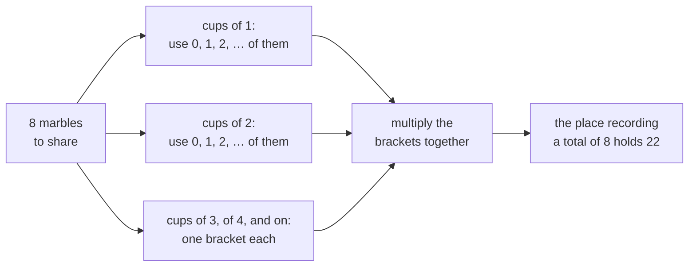

# Euler's product: one geometric factor per part size, and the coefficients count partitions

[Syllabus](../../../SYLLABUS.md) → [Combinatorics and graphs](../../../SYLLABUS.md#w04) → [Partitions](../../../SYLLABUS.md#w04-s08) → Euler's product

---

## General Overview

Eight identical marbles go into unmarked cups, no cup left empty. The marbles are alike and the cups have no names, so only the list of cup sizes — the **parts** — survives: five, two, one is the same sharing as one, two, five. The number of cups is free too: one cup of eight, or eight of one.

There are 22 ways. Listing them is a chore at eight marbles and hopeless at fifty, where the count is 204,226.

Euler's move trades the listing for a multiplication. Write one bracket per cup size — cups of one, cups of two, cups of three — each offering any number of cups of that size, and multiply. The count for any total then sits at the place recording that total.

Cancelling brackets against each other answers harder questions. Eight marbles go into cups with no two alike in 6 ways, and into cups all holding an odd number in 6 ways — the two counts agree at every total, not only at eight.

**One endless bracket per part size, multiplied together, carries the partition counts as its coefficients; cancelling the even brackets against the odd ones turns "no size twice" into "every size odd".**

**What kind of fact this is:** a theorem, proved below in Why it works; the product itself is a definition, read one coefficient at a time.

### The picture: one bracket per cup size, not one per cup



Cups larger than eight cannot help make eight, so their brackets leave that place alone.

---

## The formula

Three pieces of notation, in words first. A power of x is a tally mark for a total, never a number to plug in: x^8 means "this filling uses eight marbles", and the **coefficient of x^n** is the number standing at the x^n place ([Counting by multiplying series](../07-Generating%20Functions/02-counting-with-generating-functions.md)). The sign ∏ is sigma's twin for multiplying: where ∑ adds one term per whole number in a range, ∏ multiplies in one factor per whole number, here k = 1, then 2, and on without stopping. And 1/(1 − x^k) is shorthand for a list, not a division: the endless 1 + x^k + x^{2k} + … , whose product with 1 − x^k is 1 and nothing else. Each term of it is the one before times x^k, which is what **geometric** means.

$$\sum_{n \ge 0} p(n)\,x^n \;=\; \prod_{k \ge 1} \frac{1}{1 - x^k}$$

**Read it aloud:** one endless bracket per part size, each offering any number of parts of that size; the number at the x^n place counts the partitions of n.

The second statement trims every bracket to two terms:

$$\prod_{k \ge 1}\left(1 + x^k\right) \;=\; \prod_{k \ge 1}\frac{1}{1 - x^{2k-1}}$$

**Read it aloud:** each size at most once, or odd sizes freely, come to the same count at every total.

| Symbol | Plain meaning | In our example | Push it up and the answer… |
| --- | --- | --- | --- |
| $n$ | the total shared out | 8 marbles | 204,226 ways at 50 |
| $p(n)$ | partitions of n: cup sizes, order ignored | p(8) = 22 | — |
| $k$ | one cup size, one bracket | 1, 2, … 8 | more brackets |
| $m_k$ | cups holding k marbles | 3+3+2 has two cups of three | each adds k to the total |
| $x$ | a tally mark, never a number | x^8 marks a total of 8 | — |
| $d(n)$, $o(n)$ | no size twice; odd sizes only | d(8) = o(8) = 6 | always equal |

### When it holds

- **x is a mark, not a number.** The identity is an agreement between coefficients; nothing converges, and setting x to 2 says nothing.
- **Every coefficient finishes after finitely many brackets.** A cup larger than n cannot appear in a sharing of n, so its bracket adds only its leading 1 there. Stop early and the count is short: sizes 1 to 4 give 15 of the 22.
- **Cups are non-empty and unordered.** Empty cups make every count endless; counting the order gives 128 writings of eight, not 22.
- **The pentagonal recurrence is borrowed, not proved here.** That the coefficients of (1 − x)(1 − x^2)(1 − x^3)… run 1, −1, −1, 0, 0, 1 and on is Euler's separate theorem; the code uses it only as a third road.

---

## Why it works

### Step 0: a sharing is a tally of sizes

Take 3 + 3 + 2. Nothing of it survives but a tally: no cups of one, one of two, two of three, none above. So a sharing of n is a choice, for every size k, of a count $m_k$ — how many cups hold k marbles — with one times the ones, plus two times the twos, and so on, adding to n. Sizes constrain each other only through that total, and independent choices under one total are what a product does.

### Step 1: one bracket per size, and multiplying out does the bookkeeping

The bracket for size k is 1 + x^k + x^{2k} + … , one term per count of cups of that size: x^{km} says "use m of them, spending km marbles".

Multiplying brackets takes one term from each and adds the exponents ([Counting by multiplying series](../07-Generating%20Functions/02-counting-with-generating-functions.md)). One term from every bracket is a choice of every count, and the exponents add to the marbles spent. So each sharing of n puts 1 into the x^n place and nothing else does: the coefficient there is p(n). At eight marbles x^8 is reached 22 ways; one takes x^2 from the twos bracket, x^6 from the threes, the leading 1 from the rest — the sharing 3 + 3 + 2.

### Step 2: why an endless product has a definite coefficient

Every bracket begins with 1 and its next term is x^k, so a bracket for a size above n contributes only its 1 at the x^n place. Multiply the first n brackets and the number there has stopped moving; that settled value is what the endless product's coefficient means, and since no sharing of n uses a part above n, it is p(n). Leading 1s alone would not do it — in (1 + x)(1 + x)(1 + x)… the coefficient of x never settles — but bracket k first moves at x^k, further out every time.

### Step 3: the product run as arithmetic

Multiplying the brackets one at a time, keeping only the places up to n, is short work: start with 1 at x^0 and 0 elsewhere, then multiply in size 1, size 2, and on. After size m the x^8 place holds the sharings of eight using no cup above m:

1, 5, 10, 15, 18, 20, 21, 22.

It reaches 22 at size 8 and cannot move after. Carried to fifty places the same run gives p(50) = 204,226.

### Step 4: cancel the even brackets, and "no size twice" becomes "every size odd"

Trim each bracket to two terms. Then 1 + x^k offers a cup of size k once or not at all, and the trimmed product counts the sharings with no size repeated, d(n) — 6 at eight marbles.

Since 1 − x^k times 1 + x^k is 1 − x^{2k}, that bracket is the list 1 − x^{2k} over 1 − x^k. Multiply over the sizes: the numerators 1 − x^2, 1 − x^4, 1 − x^6, … are exactly the even denominators, each cancelling its twin below and leaving the odd ones alone:

$$\prod_{k \ge 1}\left(1 + x^k\right) \;=\; \prod_{k \ge 1}\frac{1 - x^{2k}}{1 - x^k} \;=\; \prod_{k \ge 1}\frac{1}{1 - x^{2k-1}}$$

The right side is Step 1's product with the even sizes struck out, so its coefficient of x^n counts the sharings into odd sizes, o(n). One list of coefficients, so d(n) = o(n) always; the code lists both families at eight marbles, 6 each.

<details>
<summary>Detailed proof: the cancellation, with only finitely many brackets</summary>

Cancelling endlessly many factors needs care, so work one place at a time. Fix n and keep only the brackets for sizes 1 to n; by Step 2 nothing up to x^n can move after that.

Let A be (1 + x)…(1 + x^n), and D be (1 − x)…(1 − x^n) split into odd-size factors D₁ and even-size factors D₂. Multiplying A by D pairs each 1 + x^k with 1 − x^k, giving (1 − x^2)(1 − x^4)…(1 − x^{2n}), whose factors of exponent above n first move beyond x^n: through x^n that is D₂.

So A·D₁·D₂ agrees with D₂ there, and a list starting with 1 has one inverse only, so D₂ cancels: A·D₁ = 1 through x^n. The inverse of D₁ is the geometric brackets over the odd sizes, so A agrees with them through x^n — and n was any total.

</details>

---

## Worked numbers, by hand

Eight marbles, reading the x^8 place as each cup size goes in.

| Step | Arithmetic | Value |
| --- | --- | --- |
| cups of 1, then cups of 2 | eight ones; then 0, 1, 2, 3 or 4 twos | 1, 5 |
| add cups of 3, then 4, then 5 | one size at a time | 10, 15, 18 |
| add cups of 6, then 7, then 8 | one size at a time | 20, 21, **22** |
| the same, by the pentagonal recurrence | 15 + 11 − 3 − 1 | **22** |
| fifty marbles, sizes 1 to 50 | the x^50 place | **204,226** |

Eight marbles fill cups 22 ways, fifty 204,226 ways, and the product names no sharing on the way.

### What breaks if you drop a piece

| Mistake | Comes out at | What went wrong |
| --- | --- | --- |
| Counting the order of the cups | 128 | All six orders of 5+2+1 count |
| Stopping the brackets at size 4 | 15 | Cups of five or more ruled out |
| Trimming every bracket to 1 + x^k | 6 | The all-different count |
| Pentagonal signs all plus | 46 | The signs run plus, plus, minus, minus |

The code prints all four.

---

## Code, from first principles, and it actually runs

Nothing is imported. Eight marbles are counted three ways sharing no arithmetic: every sharing listed, the brackets multiplied as coefficient lists, and the pentagonal recurrence, which mentions no bracket. All-different and all-odd come from listing and from their own two products.

### Python

```python
# Euler's product -- the check behind the card.  Nothing is imported.  Eight identical marbles go
# into unmarked cups, none empty: 22 ways.  The count is reached twice, by listing every split and
# by multiplying one geometric bracket per cup size, and a third time at n = 50 by Euler's
# pentagonal recurrence.  All-different and all-odd splits are counted by listing and by products.
N, MARBLES = 50, 8
def splits(total, largest):                  # every non-increasing list of parts summing to total
    if total == 0: return [()]
    return [(k,) + rest for k in range(min(largest, total), 0, -1) for rest in splits(total - k, k)]
def times(a, b):                             # multiply two coefficient lists, degrees over N dropped
    return [sum(a[i] * b[d - i] for i in range(d + 1)) for d in range(N + 1)]
def product(factors):                        # multiply a run of brackets, starting from 1
    out = [1] + [0] * N
    for f in factors: out = times(out, f)
    return out
def any_number_of(k):                        # 1 + x^k + x^(2k) + ... : any number of cups of size k
    return [1 if d % k == 0 else 0 for d in range(N + 1)]
def at_most_one(k):                          # 1 + x^k : size k used once or not at all
    return [1 if d in (0, k) else 0 for d in range(N + 1)]
def pentagonal(upto, paired=True):           # p(n) = p(n-1) + p(n-2) - p(n-5) - p(n-7) + ...
    p = [1] + [0] * upto
    for n in range(1, upto + 1):
        total, j = 0, 1
        while j * (3 * j - 1) // 2 <= n:
            s = -1 if paired and j % 2 == 0 else 1
            total += sum(s * p[n - w] for w in (j * (3 * j - 1) // 2, j * (3 * j + 1) // 2) if w <= n)
            j += 1
        p[n] = total
    return p
def grid(name, values): print(f"{name:<40}" + "".join(f"{v:>6}" for v in values))
def show(rows): return "; ".join("+".join(str(k) for k in r) for r in rows)
euler, pent = product(any_number_of(k) for k in range(1, N + 1)), pentagonal(N)
listed, all8 = [len(splits(n, n)) for n in range(11)], splits(MARBLES, MARBLES)
distinct, odd = product(at_most_one(k) for k in range(1, N + 1)), product(any_number_of(k) for k in range(1, N + 1, 2))
diff8, odd8 = [s for s in all8 if len(set(s)) == len(s)], [s for s in all8 if all(k % 2 for k in s)]
running = [product(any_number_of(k) for k in range(1, m + 1))[MARBLES] for m in range(1, MARBLES + 1)]
comps = [1] + [0] * MARBLES
for n in range(1, MARBLES + 1): comps[n] = sum(comps[n - k] for k in range(1, n + 1))
print(f"{MARBLES} identical marbles into unmarked cups, none empty; cup sizes 1 to {MARBLES}")
grid("marbles to share, n", list(range(11)))
grid("splits listed one by one", listed)
grid("coefficient of x^n in the product", euler[:11])
grid("the same, by the pentagonal recurrence", pent[:11])
grid("all cups different, from 1+x^k", distinct[:11])
grid("all cups odd, from odd sizes only", odd[:11])
print(f"the x^{MARBLES} coefficient as sizes 1 to {MARBLES} are added: {running}")
print(f"the {len(diff8)} all-different splits of {MARBLES}: {show(diff8)}")
print(f"the {len(odd8)} all-odd splits of {MARBLES}: {show(odd8)}")
print(f"p({N}) from the product: {euler[N]}")
print(f"p({N}) from the pentagonal recurrence: {pent[N]}")
print(f"mistake 1, order counted: {comps[MARBLES]} ordered writings of {MARBLES}, not {euler[MARBLES]}")
print(f"mistake 2, sizes stopped at 4: {running[3]}, not {euler[MARBLES]}")
print(f"mistake 3, every size at most once: {distinct[MARBLES]}, not {euler[MARBLES]}")
print(f"mistake 4, pentagonal signs all plus: {pentagonal(MARBLES, False)[MARBLES]}, not {euler[MARBLES]}")
assert listed == euler[:11] and euler[:11] == pent[:11]              # listing, product, recurrence
assert euler[MARBLES] == 22 and euler[N] == 204226                   # the published partition numbers
assert distinct == odd and distinct[MARBLES] == len(diff8) == len(odd8) == 6
assert running == [1, 5, 10, 15, 18, 20, 21, 22] and comps[MARBLES] == 2 ** (MARBLES - 1)
print("ALL CHECKS PASS")
```

**Ran 2026-09-19 on macOS, Python 3.14.6, standard library only. All checks passed. Output, pasted from the run:**

```
8 identical marbles into unmarked cups, none empty; cup sizes 1 to 8
marbles to share, n                          0     1     2     3     4     5     6     7     8     9    10
splits listed one by one                     1     1     2     3     5     7    11    15    22    30    42
coefficient of x^n in the product            1     1     2     3     5     7    11    15    22    30    42
the same, by the pentagonal recurrence       1     1     2     3     5     7    11    15    22    30    42
all cups different, from 1+x^k               1     1     1     2     2     3     4     5     6     8    10
all cups odd, from odd sizes only            1     1     1     2     2     3     4     5     6     8    10
the x^8 coefficient as sizes 1 to 8 are added: [1, 5, 10, 15, 18, 20, 21, 22]
the 6 all-different splits of 8: 8; 7+1; 6+2; 5+3; 5+2+1; 4+3+1
the 6 all-odd splits of 8: 7+1; 5+3; 5+1+1+1; 3+3+1+1; 3+1+1+1+1+1; 1+1+1+1+1+1+1+1
p(50) from the product: 204226
p(50) from the pentagonal recurrence: 204226
mistake 1, order counted: 128 ordered writings of 8, not 22
mistake 2, sizes stopped at 4: 15, not 22
mistake 3, every size at most once: 6, not 22
mistake 4, pentagonal signs all plus: 46, not 22
ALL CHECKS PASS
```

### Rust

Same numbers, same labels, built with `rustc --edition 2021 -O`.

```rust
// Euler's product -- the same check as the Python, in Rust.  No crates.  Eight identical marbles go
// into unmarked cups, none empty: 22 ways.  The count is reached twice, by listing every split and
// by multiplying one geometric bracket per cup size, and a third time at n = 50 by Euler's
// pentagonal recurrence.  All-different and all-odd splits are counted by listing and by products.
const N: usize = 50; const MARBLES: usize = 8;
fn splits(total: usize, largest: usize) -> Vec<Vec<usize>> {   // non-increasing lists summing to total
    if total == 0 { return vec![vec![]] }
    (1..=largest.min(total)).rev().flat_map(|k| splits(total - k, k).into_iter()
        .map(move |rest| { let mut s = vec![k]; s.extend(rest); s })).collect()
}
fn times(a: &[i128], b: &[i128]) -> Vec<i128> {                // coefficient lists, degrees over N dropped
    (0..=N).map(|d| (0..=d).map(|i| a[i] * b[d - i]).sum()).collect()
}
fn product(factors: Vec<Vec<i128>>) -> Vec<i128> {             // multiply a run of brackets, from 1
    let mut out = vec![0i128; N + 1]; out[0] = 1;
    for f in factors { out = times(&out, &f) }
    out
}
fn any_number_of(k: usize) -> Vec<i128> { (0..=N).map(|d| i128::from(d % k == 0)).collect() }
fn at_most_one(k: usize) -> Vec<i128> { (0..=N).map(|d| i128::from(d == 0 || d == k)).collect() }
fn pentagonal(upto: usize, paired: bool) -> Vec<i128> {        // p(n) = p(n-1) + p(n-2) - p(n-5) - ...
    let mut p = vec![0i128; upto + 1]; p[0] = 1;
    for n in 1..=upto {
        let (mut total, mut j) = (0i128, 1usize);
        while j * (3 * j - 1) / 2 <= n {
            let s: i128 = if paired && j % 2 == 0 { -1 } else { 1 };
            total += [j * (3 * j - 1) / 2, j * (3 * j + 1) / 2].iter()
                .filter(|&&w| w <= n).map(|&w| s * p[n - w]).sum::<i128>();
            j += 1;
        }
        p[n] = total;
    }
    p
}
fn grid(name: &str, values: &[i128]) {
    println!("{:<40}{}", name, values.iter().map(|v| format!("{:>6}", v)).collect::<String>());
}
fn show(rows: &[Vec<usize>]) -> String {
    rows.iter().map(|r| r.iter().map(|k| k.to_string()).collect::<Vec<String>>().join("+"))
        .collect::<Vec<String>>().join("; ")
}
fn main() {
    let euler = product((1..=N).map(any_number_of).collect());
    let pent = pentagonal(N, true);
    let listed: Vec<i128> = (0..11).map(|n| splits(n, n).len() as i128).collect();
    let distinct = product((1..=N).map(at_most_one).collect());
    let odd = product((1..=N).step_by(2).map(any_number_of).collect());
    let all8 = splits(MARBLES, MARBLES);
    let diff8: Vec<Vec<usize>> = all8.iter().filter(|s| s.windows(2).all(|w| w[0] != w[1])).cloned().collect();
    let odd8: Vec<Vec<usize>> = all8.iter().filter(|s| s.iter().all(|k| k % 2 == 1)).cloned().collect();
    let running: Vec<i128> = (1..=MARBLES).map(|m| product((1..=m).map(any_number_of).collect())[MARBLES]).collect();
    let mut comps = vec![0i128; MARBLES + 1]; comps[0] = 1;
    for n in 1..=MARBLES { comps[n] = (1..=n).map(|k| comps[n - k]).sum() }
    println!("{} identical marbles into unmarked cups, none empty; cup sizes 1 to {}", MARBLES, MARBLES);
    grid("marbles to share, n", &(0..11).collect::<Vec<i128>>());
    grid("splits listed one by one", &listed);
    grid("coefficient of x^n in the product", &euler[..11]);
    grid("the same, by the pentagonal recurrence", &pent[..11]);
    grid("all cups different, from 1+x^k", &distinct[..11]);
    grid("all cups odd, from odd sizes only", &odd[..11]);
    println!("the x^{} coefficient as sizes 1 to {} are added: {:?}", MARBLES, MARBLES, running);
    println!("the {} all-different splits of {}: {}", diff8.len(), MARBLES, show(&diff8));
    println!("the {} all-odd splits of {}: {}", odd8.len(), MARBLES, show(&odd8));
    println!("p({}) from the product: {}", N, euler[N]);
    println!("p({}) from the pentagonal recurrence: {}", N, pent[N]);
    println!("mistake 1, order counted: {} ordered writings of {}, not {}", comps[MARBLES], MARBLES, euler[MARBLES]);
    println!("mistake 2, sizes stopped at 4: {}, not {}", running[3], euler[MARBLES]);
    println!("mistake 3, every size at most once: {}, not {}", distinct[MARBLES], euler[MARBLES]);
    println!("mistake 4, pentagonal signs all plus: {}, not {}", pentagonal(MARBLES, false)[MARBLES], euler[MARBLES]);
    assert!(listed == euler[..11].to_vec() && euler[..11] == pent[..11]);   // listing, product, recurrence
    assert!(euler[MARBLES] == 22 && euler[N] == 204226);                   // the published partition numbers
    assert!(distinct == odd && distinct[MARBLES] == diff8.len() as i128 && diff8.len() == odd8.len() && odd8.len() == 6);
    assert!(running == vec![1, 5, 10, 15, 18, 20, 21, 22] && comps[MARBLES] == 1i128 << (MARBLES - 1));
    println!("ALL CHECKS PASS");
}
```

**Ran 2026-09-19 on macOS, rustc 1.98.1, no crates. All checks passed. Output, pasted from the run:**

```
8 identical marbles into unmarked cups, none empty; cup sizes 1 to 8
marbles to share, n                          0     1     2     3     4     5     6     7     8     9    10
splits listed one by one                     1     1     2     3     5     7    11    15    22    30    42
coefficient of x^n in the product            1     1     2     3     5     7    11    15    22    30    42
the same, by the pentagonal recurrence       1     1     2     3     5     7    11    15    22    30    42
all cups different, from 1+x^k               1     1     1     2     2     3     4     5     6     8    10
all cups odd, from odd sizes only            1     1     1     2     2     3     4     5     6     8    10
the x^8 coefficient as sizes 1 to 8 are added: [1, 5, 10, 15, 18, 20, 21, 22]
the 6 all-different splits of 8: 8; 7+1; 6+2; 5+3; 5+2+1; 4+3+1
the 6 all-odd splits of 8: 7+1; 5+3; 5+1+1+1; 3+3+1+1; 3+1+1+1+1+1; 1+1+1+1+1+1+1+1
p(50) from the product: 204226
p(50) from the pentagonal recurrence: 204226
mistake 1, order counted: 128 ordered writings of 8, not 22
mistake 2, sizes stopped at 4: 15, not 22
mistake 3, every size at most once: 6, not 22
mistake 4, pentagonal signs all plus: 46, not 22
ALL CHECKS PASS
```

The two outputs match line for line.

> [!TIP]
> **Try changing**
> Guess first, then run it. Each change breaks a road and an assert stops the program.
> - **Every size at most once.** Make `any_number_of` return what `at_most_one` returns: the product drops to 6 while listing holds at 22.
> - **Flatten the signs.** Call `pentagonal(N, False)`: the eight-marble count runs up to 46.
> - **Odd sizes read as every third.** Set the step in `range(1, N + 1, 2)` to 3: all-odd stops matching all-different.

---

## The usual mistake

> [!warning]
> **One bracket per cup size, not one bracket per cup.** The number of cups is not fixed and has no ceiling, so a bracket-per-cup has nothing to run over. Each bracket belongs to a size and answers one question: how many cups of this size?
>
> - **Counting the order.** 5 + 2 + 1 and 1 + 2 + 5 are one sharing; counting writings gives 128.
> - **Stopping the brackets early.** Brackets past the eighth are safe to ignore at x^8, nowhere earlier; sizes 1 to 4 give 15.
> - **Trimming the brackets to two terms.** 1 + x^k allows a size once only, counting 6.
> - **Flattening the pentagonal signs.** They come in pairs; all-plus gives 46.

---

## Where you meet it in real life

- **Making change.** Coin denominations are the allowed sizes, one bracket per denomination, and the ways to pay a total are one coefficient — worked in pennies to quarters on [Counting by multiplying series](../07-Generating%20Functions/02-counting-with-generating-functions.md).
- **Statistical physics.** A system whose energy comes in whole steps, with any number of units at each step, has p(n) states of total energy n; this product counts them.
- **Published tables.** Both counts here are catalogued: [A000041](https://oeis.org/A000041) and [A000009](https://oeis.org/A000009).

> **Say it back**
> Eight identical marbles go into unmarked cups 22 ways, counting only the cup sizes. One endless bracket per cup size, each offering any number of cups of that size, multiplied together, holds 22 at the place recording a total of eight; each place settles early because bracket k first moves at x^k. Trimmed to "once or not at all" the brackets count the all-different sharings, and rewriting 1 + x^k as 1 − x^{2k} over 1 − x^k cancels the even brackets, so all-different and all-odd agree everywhere.

---

## What this builds on

- [Integer partitions](01-integer-partitions.md): what p(n) counts, and the listing road this product replaces.
- [Counting by multiplying series](../07-Generating%20Functions/02-counting-with-generating-functions.md): what "the coefficient of x^n" means, and why multiplying brackets adds exponents and so counts choices.

## Where this goes next

The shelf carries on where the things shared have names — [Set partitions and Bell numbers](03-set-partitions-and-bell-numbers.md) and [Stirling numbers of the second kind](04-stirling-numbers-second-kind.md) — and closes with [The twelvefold way](06-twelvefold-way.md).

The product reaches p(50) = 204,226 only by grinding out every count below it, and says nothing about how fast p(n) grows; a formula aimed straight at one p(n) exists, and its tools sit above this wing.

---

## Sources

Verified 19 Sep 2026: every link below resolves to the publisher's page.

- Olver, F. W. J., et al., eds. *NIST Digital Library of Mathematical Functions*, §27.14. [dlmf.nist.gov/27.14](https://dlmf.nist.gov/27.14). The product, 27.14.2–3, and the pentagonal recurrence, 27.14.6.
- Andrews, George E. *The Theory of Partitions*. Cambridge University Press, 1984. [doi:10.1017/CBO9780511608650](https://doi.org/10.1017/CBO9780511608650). Chapter 1 derives both identities.
- "A000041: the number of partitions of n." On-Line Encyclopedia of Integer Sequences. [Sequence page](https://oeis.org/A000041). Every free count quoted here, p(50) included.
- "A000009: partitions of n into distinct parts." Same encyclopedia. [Sequence page](https://oeis.org/A000009). The all-different counts, 6 at a total of 8, listed also as odd-part counts.
