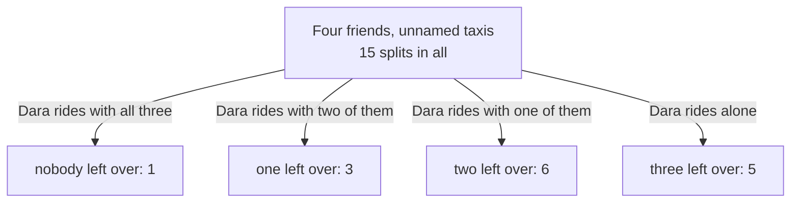

# Set partitions and Bell numbers: splitting distinct people into unnamed teams of any sizes

Combinatorics and graphs → Partitions → Unnamed groups → Set partitions and Bell numbers

---

## General Overview

Four friends leave a restaurant at midnight: Ada, Ben, Cleo and Dara. They share taxis home: any number of cars, and nobody walks. The cars carry no numbers, so the only thing the evening settles is who rides with whom.

Fifteen ways. Ada and Ben in one car with Cleo and Dara in the other is one; swapping the two cars changes nothing, since neither is "the first". Ada and Cleo together, Ben and Dara together, is a different way: the friends have names even though the cars do not. All four in one car counts, and so does four cars, one each.

Add a fifth friend and fifteen becomes fifty-two; add a sixth and it is 203. The counts are named after Eric Temple Bell, who wrote about them in 1934.

A cut like this is a **set partition**, and its groups are its **blocks**. Every person is in one block, no block is empty, and how many blocks there are is not fixed.

**Write B(n) for the number of ways to cut n named people into unnamed non-empty groups; each count is built from the smaller ones by asking who shares a group with the newest person.**

**What kind of fact this is:** a theorem, proved on this card in Why it works; the set partition it counts is a definition.

### The picture: fifteen splits, sorted by Dara's company



Dara has one taxi, so every split lands in exactly one branch: 1 + 3 + 6 + 5 = 15.

---

## The formula

Two pieces of notation carry the card, both written as functions rather than with subscripts. $B(n)$, read "B of n", is the number of splits of n named people: the Bell number. $C(n, k)$, read "n choose k", counts the ways to pick k of n, order ignored ([pascals-rule-and-the-triangle](../03-Binomial%20Coefficients%20and%20Identities/01-pascals-rule-and-the-triangle.md)).

$$B(n+1) = C(n,0)\,B(0) + C(n,1)\,B(1) + \cdots + C(n,n)\,B(n)$$

**Read it aloud:** choose who is left out of the newest person's group, split those left out any way at all, and add over how many are left out.

A formula that builds each count out of the smaller ones, as this one does, is a **recurrence**.

The sum stands on a floor:

$$B(0) = 1$$

An empty crowd splits exactly one way: into no groups at all.

| Symbol | Plain meaning | In our example | Push it up and the answer… |
| --- | --- | --- | --- |
| $n$ | people already there, before the newest joins | 3: Ada, Ben and Cleo | climbs faster than doubling |
| $B(n)$ | splits of $n$ named people into unnamed groups | B(4) = 15, B(5) = 52 | — |
| $k$ | people left out of the newest person's group | 0, 1, 2 or 3 | — |
| $C(n,k)$ | ways to pick $k$ of $n$, order ignored | C(3,2) = 3 | more ways to leave people out |
| $B(0)$ | the one split of an empty crowd: no groups | 1 | every later count scales with it |

### When it holds

- **People told apart, groups not.** Two unnamed cars take the four friends 7 ways; number the cars and it is 14.
- **No empty block.** An empty car is not a group; allow one and no count exists, since another can always be added.
- **Any number of blocks.** Fix it at two and the answer drops to 7, not 15.

---

## Why it works

### Step 0: one person's company splits the count

Each of the fifteen splits answers "who rides with Dara?" once and only once. A count breaks apart along any such question and the pieces add (as [pascals-rule-and-the-triangle](../03-Binomial%20Coefficients%20and%20Identities/01-pascals-rule-and-the-triangle.md) does with one item in or out).

### Step 1: describe the branch by who is left over

Take n + 1 people and single out one, the last to join: Dara, among the four friends. Her taxi is fixed once it is known which of the other n ride with her — equivalently, which do **not**. Call those the leftover, and write k for how many there are: the leftover is what still has to be split.

### Step 2: two free choices, and nothing else

Inside the branch "the leftover holds k people", two choices build the split.

- **Which k people are left over.** Picked from the other n, order ignored: C(n, k) ways.
- **How the leftover splits.** Whatever they do among themselves is a split of k people: B(k) ways.

The rest is forced: everyone else rides with Dara, and that car is the last block. Read backwards, Dara's car names the leftover and the other cars are its split: nothing is built twice or missed. The branch holds C(n, k) × B(k) splits.

### Step 3: add the branches

The leftover can be anyone from nobody to everybody, so k runs from 0 to n, and the branches cover every split once:

$$B(n+1) = C(n,0)\,B(0) + C(n,1)\,B(1) + \cdots + C(n,n)\,B(n).$$

For the four friends, n + 1 = 4, so n = 3, and the branches are 1 × 1, 3 × 1, 3 × 2 and 1 × 5: that is 1 + 3 + 6 + 5 = 15.

### Step 4: the floor, and then everything

With B(0) = 1 nothing else is needed: B(1) = 1, B(2) = 1 + 1 = 2, B(3) = 1 + 2 + 2 = 5, then 15, 52, 203, 877, 4140 — and the run below builds all 4,140 splits of eight people to check that last one.

<details>
<summary>Detailed proof: the branch is a one-for-one match</summary>

Number the people 1 to n + 1, the newest last. Let P be a split, D the block holding n + 1, and L the members of 1 to n outside D — the leftover. Deleting D from P leaves non-empty, non-overlapping blocks holding exactly L: a split of L. So P gives a pair, the set L and a split of it.

Backwards: take any k-member L and any split Q of it, build D from n + 1 together with everything outside L, and set D beside Q's blocks. Every person appears once, and D meets no block of Q, since those hold only members of L. The result is a split of all n + 1 people with leftover L and other blocks Q.

The two constructions undo each other, so splits with a leftover of size k match those pairs one for one: C(n, k) choices of L, B(k) splits of each. Every split holds n + 1 in one block, so it sits in one branch only, and k never passes n. Adding over k = 0 to n gives the recurrence.

</details>

A second route reaches the same numbers by addition alone. Each row starts with the last entry of the row above; every further entry is the entry to its left plus the entry above that. The rows run 1 / 1 2 / 2 3 5 / 5 7 10 15 / 15 20 27 37 52, each starting on one Bell number and ending on the next — A. C. Aitken's triangle of 1933. Why it must always agree is not proved here; the run checks it to 4,140.

---

## Worked numbers, by hand

The four friends, one branch at a time.

| Step | Arithmetic | Value |
| --- | --- | --- |
| the fifteen listed, sorted by taxis used | 1 + 7 + 6 + 1 | **15** |
| Dara rides with all three | 1 way to leave nobody out, times B(0) = 1 | 1 |
| Dara rides with two of them | 3 ways to leave one out, times B(1) = 1 | 3 |
| Dara rides with one of them | 3 ways to leave two out, times B(2) = 2 | 6 |
| Dara rides alone | 1 way to leave all three out, times B(3) = 5 | 5 |
| the four branches added | 1 + 3 + 6 + 5 | **15** |
| a fifth friend joins | 1 × 1 + 4 × 1 + 6 × 2 + 4 × 5 + 1 × 15 | **52** |

Fifteen possible ends to the evening for four friends, fifty-two for five.

### What breaks if you drop a piece

| Mistake | Comes out at | What went wrong |
| --- | --- | --- |
| Two taxis given numbers | 14, not 7 | Each split is counted once per numbering |
| Only the group sizes kept | 5, not 15 | Who rides with whom is discarded |
| B(0) taken as 0 | 0, not 15 | The recurrence has nothing to stand on |
| The recurrence run at n = 4 for B(4) | 52, not 15 | Row n builds B(n + 1), so B(4) needs n = 3 |

The code prints all four.

---

## Code, from first principles, and it actually runs

Nothing is imported. The count is reached three ways that share no arithmetic: listing every split by walking the people in one at a time, running the recurrence with C(n, k) built from Pascal's rule, and filling Aitken's triangle by addition. The wrong answers are computed too.

### Python

```python
# Set partitions and Bell numbers -- the check behind the card.  Nothing is imported.  Four
# friends -- Ada, Ben, Cleo, Dara -- share taxis home; the taxis have no names, so a split
# records only who rides with whom.  Three roads share no arithmetic: every split listed,
# the recurrence on the newest friend's taxi-mates, and the addition-only Bell triangle.
NAMES, TOP = "ABCD", 8
def splits(n):                             # road one: list every split, friend by friend
    if n == 0: return [()]
    out = []
    for rest in splits(n - 1):
        out.append(rest + ((n - 1,),))     # the newest friend takes a taxi alone
        for i in range(len(rest)): out.append(rest[:i] + (rest[i] + (n - 1,),) + rest[i + 1:])
    return out
def choose(n, k):                          # Pascal's rule written out, nothing imported
    row = [1]
    for _ in range(n): row = [1] + [row[j - 1] + row[j] for j in range(1, len(row))] + [1]
    return row[k] if 0 <= k <= n else 0
def by_recurrence(top, floor):             # road two: B(n+1) = C(n,0)B(0) + ... + C(n,n)B(n)
    B = [floor]
    for n in range(top): B.append(sum(choose(n, k) * B[k] for k in range(n + 1)))
    return B
def triangle(top):                         # road three: addition alone
    rows = [[1]]
    for _ in range(top):
        row = [rows[-1][-1]]
        for x in rows[-1]: row.append(row[-1] + x)
        rows.append(row)
    return rows
def show(s):                               # one split written out, smallest taxi first
    return "|".join("".join(NAMES[i] for i in b) for b in sorted(s, key=lambda b: (len(b), b)))
def yn(claim): return "yes" if claim else "no"
listed = [len(splits(n)) for n in range(TOP + 1)]
B = by_recurrence(TOP, 1)
dead = by_recurrence(4, 0)                 # the same recurrence with the floor set to 0
rows = triangle(TOP)
four = splits(4)
by_taxis = [sum(1 for s in four if len(s) == k) for k in range(5)]
mates = [sum(1 for s in four if 4 - len(next(b for b in s if 3 in b)) == k) for k in range(4)]
formula = [choose(3, k) * B[k] for k in range(4)]
patterns = {tuple(sorted(len(b) for b in s)) for s in four}
two_named = 2 ** 4 - 2                     # every yes-or-no labelling but the two that empty a taxi
print("four friends -- Ada, Ben, Cleo, Dara -- share taxis home; the taxis have no names")
for k, word in ((1, "one taxi   "), (2, "two taxis  "), (3, "three taxis"), (4, "four taxis ")):
    print(f"  {word} ({by_taxis[k]}): " + "  ".join(sorted(show(s) for s in four if len(s) == k)))
print(f"listed one at a time: {listed[4]} splits of four friends and {listed[5]} of five")
print(f"Dara's taxi-mates: all three -> 1 x B(0) = {formula[0]}; two of the three -> 3 x B(1) = "
      f"{formula[1]}; one of the three -> 3 x B(2) = {formula[2]}; nobody -> 1 x B(3) = {formula[3]}")
print(f"recurrence: B(4) = 1x1 + 3x1 + 3x2 + 1x5 = {B[4]};  B(5) = 1x1 + 4x1 + 6x2 + 4x5 + 1x15 = {B[5]}")
print(f"B(0) to B({TOP}) by recurrence: {B}")
print(f"the same numbers by listing every split: {yn(listed == B)}; "
      f"from the Bell triangle: {yn([r[0] for r in rows] == B)}")
print("Bell triangle, rows 0 to 4: " + " / ".join(" ".join(str(x) for x in r) for r in rows[:5]))
print(f"mistake, taxis numbered: four friends into two named taxis, neither empty = {two_named} ways, not {by_taxis[2]}")
print(f"mistake, only the group sizes kept: {len(patterns)} size patterns, not {B[4]}")
print(f"mistake, B(0) taken as 0: the recurrence gives B(1) to B(4) = {dead[1:]}, not {B[4]}")
print(f"mistake, index slipped: C(4,0)B(0) + ... + C(4,4)B(4) = {B[5]}, which is B(5), not B(4)")
assert listed == B                                    # every split listed, against the recurrence
assert [r[0] for r in rows] == B                      # addition alone, against the recurrence
assert mates == formula and by_taxis == [0, 1, 7, 6, 1]
assert two_named == 2 * by_taxis[2]                   # labellings, against the listed two-taxi splits
print("ALL CHECKS PASS")
```

**Ran 2026-09-19 on macOS, Python 3.14.6, standard library only. All checks passed. Output, pasted from the run:**

```
four friends -- Ada, Ben, Cleo, Dara -- share taxis home; the taxis have no names
  one taxi    (1): ABCD
  two taxis   (7): AB|CD  AC|BD  AD|BC  A|BCD  B|ACD  C|ABD  D|ABC
  three taxis (6): A|B|CD  A|C|BD  A|D|BC  B|C|AD  B|D|AC  C|D|AB
  four taxis  (1): A|B|C|D
listed one at a time: 15 splits of four friends and 52 of five
Dara's taxi-mates: all three -> 1 x B(0) = 1; two of the three -> 3 x B(1) = 3; one of the three -> 3 x B(2) = 6; nobody -> 1 x B(3) = 5
recurrence: B(4) = 1x1 + 3x1 + 3x2 + 1x5 = 15;  B(5) = 1x1 + 4x1 + 6x2 + 4x5 + 1x15 = 52
B(0) to B(8) by recurrence: [1, 1, 2, 5, 15, 52, 203, 877, 4140]
the same numbers by listing every split: yes; from the Bell triangle: yes
Bell triangle, rows 0 to 4: 1 / 1 2 / 2 3 5 / 5 7 10 15 / 15 20 27 37 52
mistake, taxis numbered: four friends into two named taxis, neither empty = 14 ways, not 7
mistake, only the group sizes kept: 5 size patterns, not 15
mistake, B(0) taken as 0: the recurrence gives B(1) to B(4) = [0, 0, 0, 0], not 15
mistake, index slipped: C(4,0)B(0) + ... + C(4,4)B(4) = 52, which is B(5), not B(4)
ALL CHECKS PASS
```

### Rust

Same numbers, same labels, built with `rustc --edition 2021 -O`.

```rust
// Set partitions and Bell numbers -- the same check as the Python, in Rust.  No crates.  Four
// friends -- Ada, Ben, Cleo, Dara -- share taxis home; the taxis have no names, so a split
// records only who rides with whom.  Three roads share no arithmetic: every split listed,
// the recurrence on the newest friend's taxi-mates, and the addition-only Bell triangle.
const NAMES: [char; 4] = ['A', 'B', 'C', 'D'];
const TOP: usize = 8;
fn splits(n: usize) -> Vec<Vec<Vec<usize>>> {    // road one: list every split, friend by friend
    if n == 0 { return vec![Vec::new()] }
    let mut out: Vec<Vec<Vec<usize>>> = Vec::new();
    for rest in splits(n - 1) {
        let mut alone = rest.clone(); alone.push(vec![n - 1]); out.push(alone);   // a taxi alone
        for i in 0..rest.len() {                 // or one of the taxis already going
            let mut joined = rest.clone(); joined[i].push(n - 1); out.push(joined);
        }
    }
    out
}
fn choose(n: usize, k: usize) -> u64 {           // Pascal's rule written out, nothing imported
    let mut row: Vec<u64> = vec![1];
    for _ in 0..n {
        let mut next: Vec<u64> = vec![1];
        for j in 1..row.len() { next.push(row[j - 1] + row[j]) }
        next.push(1); row = next;
    }
    if k <= n { row[k] } else { 0 }
}
fn by_recurrence(top: usize, floor: u64) -> Vec<u64> {  // road two: B(n+1) = C(n,0)B(0) + ...
    let mut b = vec![floor];
    for n in 0..top { let next: u64 = (0..=n).map(|k| choose(n, k) * b[k]).sum(); b.push(next) }
    b
}
fn triangle(top: usize) -> Vec<Vec<u64>> {       // road three: addition alone
    let mut rows: Vec<Vec<u64>> = vec![vec![1]];
    for _ in 0..top {
        let prev = rows[rows.len() - 1].clone(); let mut row = vec![prev[prev.len() - 1]];
        for x in &prev { row.push(row[row.len() - 1] + x) }
        rows.push(row)
    }
    rows
}
fn show(s: &Vec<Vec<usize>>) -> String {         // one split written out, smallest taxi first
    let mut blocks = s.clone();
    blocks.sort_by_key(|b| (b.len(), b.clone()));
    blocks.iter().map(|b| b.iter().map(|&i| NAMES[i]).collect::<String>()).collect::<Vec<String>>().join("|")
}
fn yn(claim: bool) -> &'static str { if claim { "yes" } else { "no" } }
fn main() {
    let listed: Vec<u64> = (0..=TOP).map(|n| splits(n).len() as u64).collect();
    let (b, dead) = (by_recurrence(TOP, 1), by_recurrence(4, 0));   // dead: the floor set to 0
    let (rows, four) = (triangle(TOP), splits(4));
    let by_taxis: Vec<u64> = (0..5).map(|k| four.iter().filter(|s| s.len() == k).count() as u64).collect();
    let mates: Vec<u64> = (0..4).map(|k| four.iter()
        .filter(|s| 4 - s.iter().find(|t| t.contains(&3)).unwrap().len() == k).count() as u64).collect();
    let formula: Vec<u64> = (0..4).map(|k| choose(3, k) * b[k]).collect();
    let patterns: std::collections::BTreeSet<Vec<usize>> = four.iter()
        .map(|s| { let mut v: Vec<usize> = s.iter().map(|t| t.len()).collect(); v.sort(); v }).collect();
    let (two_named, tri_left) = (2u64.pow(4) - 2, rows.iter().map(|r| r[0]).collect::<Vec<u64>>());
    println!("four friends -- Ada, Ben, Cleo, Dara -- share taxis home; the taxis have no names");
    for (k, word) in [(1usize, "one taxi   "), (2, "two taxis  "), (3, "three taxis"), (4, "four taxis ")] {
        let mut cells: Vec<String> = four.iter().filter(|s| s.len() == k).map(show).collect(); cells.sort();
        println!("  {} ({}): {}", word, by_taxis[k], cells.join("  "));
    }
    println!("listed one at a time: {} splits of four friends and {} of five", listed[4], listed[5]);
    println!("Dara's taxi-mates: all three -> 1 x B(0) = {}; two of the three -> 3 x B(1) = {}; \
one of the three -> 3 x B(2) = {}; nobody -> 1 x B(3) = {}", formula[0], formula[1], formula[2], formula[3]);
    println!("recurrence: B(4) = 1x1 + 3x1 + 3x2 + 1x5 = {};  B(5) = 1x1 + 4x1 + 6x2 + 4x5 + 1x15 = {}", b[4], b[5]);
    println!("B(0) to B({}) by recurrence: {:?}", TOP, b);
    println!("the same numbers by listing every split: {}; from the Bell triangle: {}", yn(listed == b), yn(tri_left == b));
    println!("Bell triangle, rows 0 to 4: {}", rows[..5].iter()
        .map(|r| r.iter().map(|x| x.to_string()).collect::<Vec<String>>().join(" ")).collect::<Vec<String>>().join(" / "));
    println!("mistake, taxis numbered: four friends into two named taxis, neither empty = {} ways, not {}", two_named, by_taxis[2]);
    println!("mistake, only the group sizes kept: {} size patterns, not {}", patterns.len(), b[4]);
    println!("mistake, B(0) taken as 0: the recurrence gives B(1) to B(4) = {:?}, not {}", &dead[1..], b[4]);
    println!("mistake, index slipped: C(4,0)B(0) + ... + C(4,4)B(4) = {}, which is B(5), not B(4)", b[5]);
    assert!(listed == b);                        // every split listed, against the recurrence
    assert!(tri_left == b);                      // addition alone, against the recurrence
    assert!(mates == formula && by_taxis == vec![0, 1, 7, 6, 1]);
    assert!(two_named == 2 * by_taxis[2]);       // labellings, against the listed two-taxi splits
    println!("ALL CHECKS PASS");
}
```

**Ran 2026-09-19 on macOS, rustc 1.98.1, no crates. All checks passed. Output, pasted from the run:**

```
four friends -- Ada, Ben, Cleo, Dara -- share taxis home; the taxis have no names
  one taxi    (1): ABCD
  two taxis   (7): AB|CD  AC|BD  AD|BC  A|BCD  B|ACD  C|ABD  D|ABC
  three taxis (6): A|B|CD  A|C|BD  A|D|BC  B|C|AD  B|D|AC  C|D|AB
  four taxis  (1): A|B|C|D
listed one at a time: 15 splits of four friends and 52 of five
Dara's taxi-mates: all three -> 1 x B(0) = 1; two of the three -> 3 x B(1) = 3; one of the three -> 3 x B(2) = 6; nobody -> 1 x B(3) = 5
recurrence: B(4) = 1x1 + 3x1 + 3x2 + 1x5 = 15;  B(5) = 1x1 + 4x1 + 6x2 + 4x5 + 1x15 = 52
B(0) to B(8) by recurrence: [1, 1, 2, 5, 15, 52, 203, 877, 4140]
the same numbers by listing every split: yes; from the Bell triangle: yes
Bell triangle, rows 0 to 4: 1 / 1 2 / 2 3 5 / 5 7 10 15 / 15 20 27 37 52
mistake, taxis numbered: four friends into two named taxis, neither empty = 14 ways, not 7
mistake, only the group sizes kept: 5 size patterns, not 15
mistake, B(0) taken as 0: the recurrence gives B(1) to B(4) = [0, 0, 0, 0], not 15
mistake, index slipped: C(4,0)B(0) + ... + C(4,4)B(4) = 52, which is B(5), not B(4)
ALL CHECKS PASS
```

The two outputs match line for line.

> [!TIP]
> **Try changing**
> Guess first, then run it. The asserts hold the three roads against each other, so a change to one road stops the program.
> - **Move the floor.** In `by_recurrence(TOP, 1)`, make the 1 a 2. Every Bell number doubles while the listing stays put, and the first assert stops it.
> - **Never let the newest friend ride alone.** Delete the line that gives them a taxi of their own: the listing then finds no split of even one person.
> - **Nudge the triangle.** Add 1 inside its addition. Its left-hand column drifts off the Bell numbers and the second assert stops it, while the other two roads still agree.

---

## The usual mistake

> [!warning]
> **Treating the groups as places rather than as company.** A block is known only by who is in it, so a split and every rearrangement of its blocks are one split. Two numbered cars take the four friends 14 ways, two unnamed cars 7: labelled containers never give a smaller answer, sorted out in [twelvefold-way](06-twelvefold-way.md).
>
> - **Reading the recurrence off by one.** C(4,0)B(0) + … + C(4,4)B(4) is 52, which is B(5), not B(4).
> - **Dropping the empty split.** B(0) = 1, not 0; set it to 0 and every Bell number is 0.
> - **Keeping the sizes and losing the names.** Four friends then give 5 size patterns, not 15 splits: the count on [integer-partitions](01-integer-partitions.md).

---

## Where you meet it in real life

- **Clustering.** Sorting readings or customers into groups, with no fixed number of groups. The Bell number is the size of the search: eight items already allow 4,140 groupings, so every clustering method is a shortcut, not a survey.
- **Rhyme schemes.** A four-line stanza's scheme splits its lines into rhyming groups — AABB, ABAB, ABBA, AAAA and the rest. Fifteen schemes, the same fifteen: the rhymes have no names and the lines do.
- **Saying which things count as the same.** Declaring an equivalence and cutting a set into blocks are one act ([equivalence-relations-and-partitions](../../01-Foundations/08-Relations%20and%20Functions/06-equivalence-relations-and-partitions.md)), so B(n) counts those declarations too.

> **Say it back**
> A set partition cuts named people into non-empty groups that have no names, and the number of groups is free. The Bell number B(n) counts them: 1, 1, 2, 5, 15, 52, 203 from n = 0 up. To add one more person, choose who is left out of that person's group, in C(n, k) ways, and split those left out in B(k) ways. Adding over the leftover's size gives B(n + 1), on the floor B(0) = 1. Four friends get home 15 ways; five do it 52 ways.

---

## What this builds on

- [pascals-rule-and-the-triangle](../03-Binomial%20Coefficients%20and%20Identities/01-pascals-rule-and-the-triangle.md): C(n, k) itself, and the habit of breaking a count apart by singling out one item.
- [equivalence-relations-and-partitions](../../01-Foundations/08-Relations%20and%20Functions/06-equivalence-relations-and-partitions.md): what a partition is, and why its blocks cover everything without overlapping.

## Where this goes next

- [stirling-numbers-second-kind](04-stirling-numbers-second-kind.md): the same splits counted with the number of groups held fixed.

Sorted by how many taxis they use, the fifteen splits fall 1, 7, 6, 1 — and this card never says why, which is the question [stirling-numbers-second-kind](04-stirling-numbers-second-kind.md) answers.

---

## Sources

Verified 19 Sep 2026: every link below resolves to the publisher's page.

- Olver, F. W. J., et al., eds. "§26.7 Set Partitions: Bell Numbers." *NIST Digital Library of Mathematical Functions*. [dlmf.nist.gov/26.7](https://dlmf.nist.gov/26.7). Free; equation [26.7.6](https://dlmf.nist.gov/26.7.E6) is this card's recurrence, in DLMF's B(n) notation.
- "A000110: Bell or exponential numbers." On-Line Encyclopedia of Integer Sequences. [Sequence page](https://oeis.org/A000110). Its first nine terms are the run's nine numbers.
- Aitken, A. C. "A Problem in Combinations." *Mathematical Notes* (Edinburgh Mathematical Society) 28 (1933): xviii–xxiii. [doi:10.1017/S1757748900002334](https://doi.org/10.1017/S1757748900002334). The addition-only triangle.
- O'Connor, J. J., and E. F. Robertson. "Eric Temple Bell." MacTutor Archive, University of St Andrews. [Biography](https://mathshistory.st-andrews.ac.uk/Biographies/Bell/). Dates *Exponential Numbers*, the 1934 paper behind the name.
