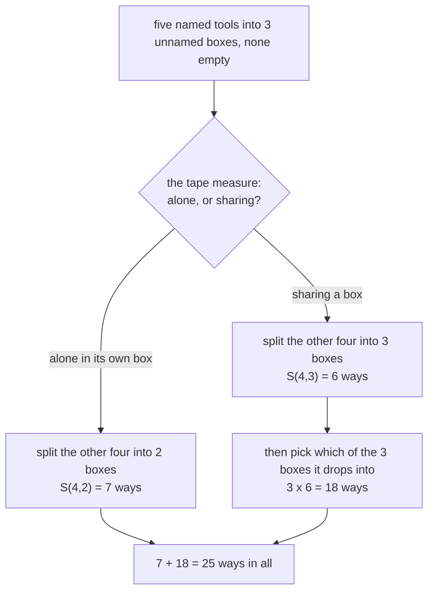

# Stirling numbers of the second kind: distinct items into exactly k unnamed non-empty groups

Combinatorics and graphs → Partitions → A fixed number of groups → Stirling numbers of the second kind

---

## General Overview

Five tools come out of a drawer: a hammer, pliers, a chisel, a file and a tape measure. They go into toolboxes that carry no labels. None is left empty, and each tool goes in one box. Into two boxes there are 15 ways. Into three, 25.

The tools are told apart; the boxes are not. Hammer and pliers together, the other three together, is one arrangement however the boxes are stacked. Paint names on the boxes and the count climbs. Neither 15 nor 25 has to be listed out; each comes from two smaller counts.

**S(n, k) counts the splits of n named items into exactly k unnamed non-empty groups; pull out the last item — alone, or sharing — and those two cases add to S(n, k) = k S(n−1, k) + S(n−1, k−1).**

**What kind of fact this is:** the count is a definition; the recurrence and the k factorial rule for named groups are theorems, proved in Why it works.

### The picture: where the tape measure goes



The left branch loses a box with the tool; the right keeps all three and charges 3 for the choice.

---

## The formula

S(n, k) — the **Stirling numbers of the second kind**, tabulated by James Stirling in 1730 — counts splits of n named items into exactly k unnamed non-empty groups. Some books print them in braces, $\left\{ n \atop k \right\}$. Reminders: n! is n × (n−1) × … × 1; C(n, k), "n choose k", picks k of n items, order ignored.

$$S(n,k) = k\,S(n-1,k) + S(n-1,k-1)$$

**Read it aloud:** the last item either joins one of the k groups standing — k choices on top of a split of the rest into k — or stands alone, the rest filling k−1.

The recurrence runs from n = 1, k = 1 outward; the edges start the table: S(0, 0) = 1, the empty set split into no groups; S(n, 0) = 0 once there is an item to place; S(n, 1) = 1 and S(n, n) = 1, all together or each alone; S(n, k) = 0 when k > n.

| Symbol | Plain meaning | In our example | Push it up and the answer… |
| --- | --- | --- | --- |
| $n$ | how many named items | 5 tools | bigger numbers in the row |
| $k$ | how many groups, none empty | 2 or 3 boxes | rises, peaks, back to 1 |
| $S(n,k)$ | splits into exactly k unnamed non-empty groups | S(5, 3) = 25 | — |
| $B(n)$ | the row's total: any number of groups | B(5) = 52 | — |
| $k!$ | ways to hang k name tags on k groups | 3! = 6 | named groups cost more |
| $C(n,k)$ | ways to choose k of n items | C(5, 3) = 10 | — |

### When it holds

- **Items told apart, groups not.** Name the boxes and every split wears 3! = 6 sets of tags: 150, not 25.
- **No group empty.** With the boxes named, allowing an empty one counts every rule into three boxes: 3^5 = 243, not 150.
- **Exactly k groups, not at most k.** An unnamed empty box shows nothing, so the honest question becomes at most three boxes: 1 + 15 + 25 = 41.
- **Whole numbers, k between 0 and n.** Outside that the count is 0.

---

## Why it works

### Step 0: single out the last item and ask where it sat

The tools have names, so one can be watched: the tape measure. Every split of the five has it alone in a box or sharing — never both, never neither. Heaps that do not overlap are counted by adding them.

### Step 1: the tape measure alone, and a box leaves with it

Its box holds nothing else. Lift it away and a split of the other four into one box fewer is left. Backwards: add a box holding the tape measure to a split of the four into k−1 boxes. The two undo each other, so the heap holds S(n−1, k−1) splits — for three boxes, S(4, 2) = 7.

### Step 2: the tape measure sharing, and the box stays

Now its box holds something else too. Take the tape measure out and leave the rest standing: the box still holds a tool, so no box vanishes. What is left is a split of the other four into k boxes, k as before.

Backwards takes two choices: a split of the four into k boxes, then which of those k boxes the tape measure joins. Different choices give different splits, and every sharing split arises once. That is k S(n−1, k), or 3 × 6 = 18 here. The boxes need no names; their contents tell them apart.

### Step 3: add the two heaps, and the top of the table does the rest

Together the heaps are every split of n items into k groups, so S(n, k) = k S(n−1, k) + S(n−1, k−1), here 7 + 18 = 25. Each row uses only the row above, and row 0 is known outright, so induction fills every later row, settling what the numbers count.

### Step 4: name the groups and the same splits count onto maps

Naming the boxes asks for more: a rule sending each tool to a named box. A split into k groups can wear the k name tags in k! ways, each a different rule, and stripping the names returns the split. So the rules leaving no box empty number k! S(n, k) — here 6 × 25 = 150, the onto maps of [counting-surjections](../04-Inclusion-Exclusion%20and%20Pigeonhole/03-counting-surjections.md).

<details>
<summary>Detailed proof: every split wears exactly k factorial sets of name tags</summary>

Collecting the items that share each name gives k non-empty collections, overlapping nowhere, covering everything: the rule's split. Matching that split's groups to the k names, one each, is a rearrangement of k things — k! matchings, each a different rule, and every rule with that split comes from its own matching.

The edges agree: the empty rule on no items misses nothing, matching S(0, 0) = 1; with fewer items than boxes no rule fills every box, matching S(n, k) = 0.

</details>

### Step 5: add the whole row and every split is counted once

Every split of the five tools has one number of groups and one only, so filing splits by that number puts each in one column and the whole row counts every split: 1 + 15 + 25 + 10 + 1 = 52, the Bell number B(5), reached from the other side on [set-partitions-and-bell-numbers](03-set-partitions-and-bell-numbers.md).

<details>
<summary>The other road: count the named-box rules, then sieve</summary>

There are 3^5 = 243 rules sending five tools to three named boxes, empty ones allowed. Each of the 3 boxes is avoided by 2^5 = 32 rules, so subtract 3 × 32 = 96; the 3 rules piling everything into one box came off twice, so add them back: 243 − 96 + 3 = 150 fill every box. Divide by 3! = 6 for 25 splits. The general alternating count is on [counting-surjections](../04-Inclusion-Exclusion%20and%20Pigeonhole/03-counting-surjections.md).

</details>

The sieve never mentions the recurrence: two roads, one answer, 25.

---

## Worked numbers, by hand

The row for the four tools without the tape measure reads 1, 7, 6, 1, across one to four boxes. The tape measure turns it into the row for five tools.

| Step | Arithmetic | Value |
| --- | --- | --- |
| two boxes: alone, or one of two | S(4, 1) + 2 × S(4, 2) = 1 + 14 | **15** |
| three boxes: alone, or one of three | S(4, 2) + 3 × S(4, 3) = 7 + 18 | **25** |
| the same 15, by shape | 5 splits of sizes 4+1 (pick the lone tool), 10 of sizes 3+2 (pick the pair) | **15** |
| three boxes with names painted on | 3! × 25 = 6 × 25 | **150** |
| every split of the five tools | 1 + 15 + 25 + 10 + 1 | **52** |

Fifteen ways to fill two unnamed toolboxes, twenty-five to fill three.

### What breaks if you drop a piece

| Mistake | Comes out at | What went wrong |
| --- | --- | --- |
| Adding the cells above, no multiplier | 6 + 7 = 13 | The k counts which group the item joins |
| Letting a named box stay empty | 243 | All 3^5 rules count, not just the 150 onto ones |
| Reading C(5, 3) = 10 as the answer | 10 | Three chosen tools name one group; 10 is S(5, 4) |

The code prints all three.

---

## Code, from first principles, and it actually runs

Nothing is imported. Two roads share no arithmetic: the triangle from the recurrence, and a listing that tags each tool one of five ways, drops the tags and counts the distinct results by their number of groups. A third sieves the named-box rules; the onto maps are also counted one by one.

### Python

```python
# Stirling numbers of the second kind -- the check behind the card.  Nothing is
# imported.  Five named tools, H P C F T, go into unnamed toolboxes, none left
# empty.  Every count is reached twice: by the recurrence S(n,k) = k S(n-1,k)
# + S(n-1,k-1), and by listing the splits, which never mentions the recurrence.
TOOLS, N = "HPCFT", 5

def triangle(nmax):                       # road one: one multiply, one add per cell
    T = [[0] * (nmax + 1) for _ in range(nmax + 1)]
    T[0][0] = 1
    for n in range(1, nmax + 1):
        for k in range(1, n + 1): T[n][k] = k * T[n - 1][k] + T[n - 1][k - 1]
    return T

def labellings(items, tags):              # every way to hand each tool one tag
    out = [()]
    for _ in range(items): out = [f + (j,) for f in out for j in range(tags)]
    return out

def split_of(f):                          # the groups a labelling makes, tags dropped
    groups = {}
    for i, tag in enumerate(f): groups[tag] = groups.get(tag, "") + TOOLS[i]
    return tuple(sorted(groups.values()))

def fact(k):
    out = 1
    for j in range(2, k + 1): out *= j
    return out

def choose(n, k):
    return fact(n) // (fact(k) * fact(n - k))

T = triangle(N)
splits = sorted({split_of(f) for f in labellings(N, N)})        # road two: list them
row = [sum(1 for s in splits if len(s) == k) for k in range(N + 1)]
sieve = sum((-1) ** (3 - j) * choose(3, j) * j ** N for j in range(4)) // fact(3)
onto = [f for f in labellings(N, 3) if len(set(f)) == 3]
shape = [sum(1 for s in splits if sorted(len(g) for g in s) == list(sz)) for sz in ((1, 4), (2, 3))]
print(f"five tools {' '.join(TOOLS)}; triangle S(n,k) by the recurrence, rows n = 0 to {N}")
print("  n\\k" + "".join(f"{k:6d}" for k in range(N + 1)))
for n in range(N + 1):
    print(f"{n:5d}" + "".join(f"{T[n][k]:6d}" for k in range(n + 1)))
for k in (2, 3):
    print(f"S(5,{k}): tape alone {T[N - 1][k - 1]}, tape joins one of the {k} groups "
          f"{k} x {T[N - 1][k]} = {k * T[N - 1][k]}, total {T[N][k]}; by listing: {row[k]}")
print(f"S(5,2) by shape: {shape[0]} splits of sizes 4+1, {shape[1]} of sizes 3+2, total {sum(shape)}")
print(f"S(5,3) by inclusion-exclusion: ({3 ** N} - 3 x {2 ** N} + 3) / 3! = ({3 ** N} - {3 * 2 ** N} + 3) / {fact(3)} = {sieve}")
print(f"Bell B(5) = {' + '.join(str(T[N][k]) for k in range(1, N + 1))} = {sum(T[N])}; "
      f"at most three groups: {sum(T[N][:4])}; every split listed: {len(splits)}")
print(f"onto maps, five tools to 3 named boxes, listed one by one: {len(onto)}; "
      f"3! x S(5,3) = {fact(3)} x {T[N][3]} = {fact(3) * T[N][3]}")
print(f"mistake 1, adding the two rows Pascal-style: {T[N - 1][3]} + {T[N - 1][2]} = "
      f"{T[N - 1][3] + T[N - 1][2]}, not {T[N][3]}")
print(f"mistake 2, naming the three boxes: {fact(3) * T[N][3]}, not {T[N][3]}")
print(f"mistake 3, letting a box stay empty: 3^5 = {3 ** N} labellings, not {len(onto)} onto maps")
print(f"mistake 4, reading C(5,3) as S(5,3): {choose(5, 3)}, which is S(5,4) = {T[N][4]}")
assert row == [T[N][k] for k in range(N + 1)]        # listed splits against the recurrence
assert len(splits) == sum(T[N]) == 52                # every split against the row sum
assert len(onto) == fact(3) * T[N][3]                # listed onto maps against 3! S(5,3)
assert sieve == T[N][3] and sum(shape) == T[N][2]    # the sieve, and the shapes, against the table
print("ALL CHECKS PASS")
```

**Ran 2026-09-19 on macOS, Python 3.14.6, standard library only. All checks passed. Output, pasted from the run:**

```
five tools H P C F T; triangle S(n,k) by the recurrence, rows n = 0 to 5
  n\k     0     1     2     3     4     5
    0     1
    1     0     1
    2     0     1     1
    3     0     1     3     1
    4     0     1     7     6     1
    5     0     1    15    25    10     1
S(5,2): tape alone 1, tape joins one of the 2 groups 2 x 7 = 14, total 15; by listing: 15
S(5,3): tape alone 7, tape joins one of the 3 groups 3 x 6 = 18, total 25; by listing: 25
S(5,2) by shape: 5 splits of sizes 4+1, 10 of sizes 3+2, total 15
S(5,3) by inclusion-exclusion: (243 - 3 x 32 + 3) / 3! = (243 - 96 + 3) / 6 = 25
Bell B(5) = 1 + 15 + 25 + 10 + 1 = 52; at most three groups: 41; every split listed: 52
onto maps, five tools to 3 named boxes, listed one by one: 150; 3! x S(5,3) = 6 x 25 = 150
mistake 1, adding the two rows Pascal-style: 6 + 7 = 13, not 25
mistake 2, naming the three boxes: 150, not 25
mistake 3, letting a box stay empty: 3^5 = 243 labellings, not 150 onto maps
mistake 4, reading C(5,3) as S(5,3): 10, which is S(5,4) = 10
ALL CHECKS PASS
```

### Rust

Same numbers, same labels, built with `rustc --edition 2021 -O`.

```rust
// Stirling numbers of the second kind -- the same check as the Python, in Rust.
// No crates.  Five named tools, H P C F T, go into unnamed toolboxes, none left
// empty.  Every count is reached twice: by the recurrence S(n,k) = k S(n-1,k)
// + S(n-1,k-1), and by listing the splits, which never mentions the recurrence.
use std::collections::{BTreeMap, BTreeSet};
const TOOLS: &str = "HPCFT";
const N: usize = 5;
fn triangle(nmax: usize) -> Vec<Vec<i64>> {      // road one: one multiply, one add per cell
    let mut t = vec![vec![0i64; nmax + 1]; nmax + 1];
    t[0][0] = 1;
    for n in 1..=nmax {
        for k in 1..=n { t[n][k] = k as i64 * t[n - 1][k] + t[n - 1][k - 1] }
    }
    t
}
fn labellings(items: usize, tags: usize) -> Vec<Vec<usize>> {   // each tool handed one tag
    let mut out: Vec<Vec<usize>> = vec![vec![]];
    for _ in 0..items {
        let mut next: Vec<Vec<usize>> = Vec::new();
        for f in &out { for j in 0..tags { let mut g = f.clone(); g.push(j); next.push(g) } }
        out = next;
    }
    out
}
fn split_of(f: &[usize]) -> Vec<String> {        // the groups a labelling makes, tags dropped
    let mut groups: BTreeMap<usize, String> = BTreeMap::new();
    for (i, tag) in f.iter().enumerate() { groups.entry(*tag).or_default().push(TOOLS.as_bytes()[i] as char) }
    let mut out: Vec<String> = groups.into_values().collect();
    out.sort();
    out
}
fn fact(k: usize) -> i64 { (2..=k as i64).product() }
fn choose(n: usize, k: usize) -> i64 { fact(n) / (fact(k) * fact(n - k)) }
fn main() {
    let t = triangle(N);
    let splits: BTreeSet<Vec<String>> =                          // road two: list them
        labellings(N, N).iter().map(|f| split_of(f)).collect();
    let row: Vec<i64> = (0..=N).map(|k| splits.iter().filter(|s| s.len() == k).count() as i64).collect();
    let sieve: i64 = (0..4).map(|j| (-1i64).pow((3 - j) as u32) * choose(3, j as usize)
                                    * (j as i64).pow(N as u32)).sum::<i64>() / fact(3);
    let onto = labellings(N, 3).iter()
        .filter(|f| f.iter().collect::<BTreeSet<_>>().len() == 3).count() as i64;
    let shape: Vec<i64> = [[1, 4], [2, 3]].iter().map(|sz| splits.iter()
        .filter(|s| { let mut v: Vec<usize> = s.iter().map(|g| g.len()).collect(); v.sort(); v == *sz })
        .count() as i64).collect();
    let spaced: Vec<String> = TOOLS.chars().map(|c| c.to_string()).collect();
    println!("five tools {}; triangle S(n,k) by the recurrence, rows n = 0 to {}", spaced.join(" "), N);
    let mut head = String::from("  n\\k");
    for k in 0..=N { head.push_str(&format!("{:6}", k)) }
    println!("{}", head);
    for n in 0..=N {
        let mut line = format!("{:5}", n);
        for k in 0..=n { line.push_str(&format!("{:6}", t[n][k])) }
        println!("{}", line);
    }
    for k in [2usize, 3] {
        println!("S(5,{}): tape alone {}, tape joins one of the {} groups {} x {} = {}, total {}; by listing: {}",
                 k, t[N - 1][k - 1], k, k, t[N - 1][k], k as i64 * t[N - 1][k], t[N][k], row[k]);
    }
    println!("S(5,2) by shape: {} splits of sizes 4+1, {} of sizes 3+2, total {}",
             shape[0], shape[1], shape[0] + shape[1]);
    println!("S(5,3) by inclusion-exclusion: ({} - 3 x {} + 3) / 3! = ({} - {} + 3) / {} = {}", 3i64.pow(5), 2i64.pow(5), 3i64.pow(5), 3 * 2i64.pow(5), fact(3), sieve);
    let bell: i64 = t[N].iter().sum();
    let terms: Vec<String> = (1..=N).map(|k| t[N][k].to_string()).collect();
    println!("Bell B(5) = {} = {}; at most three groups: {}; every split listed: {}",
             terms.join(" + "), bell, t[N][..4].iter().sum::<i64>(), splits.len());
    println!("onto maps, five tools to 3 named boxes, listed one by one: {}; 3! x S(5,3) = {} x {} = {}",
             onto, fact(3), t[N][3], fact(3) * t[N][3]);
    println!("mistake 1, adding the two rows Pascal-style: {} + {} = {}, not {}",
             t[N - 1][3], t[N - 1][2], t[N - 1][3] + t[N - 1][2], t[N][3]);
    println!("mistake 2, naming the three boxes: {}, not {}", fact(3) * t[N][3], t[N][3]);
    println!("mistake 3, letting a box stay empty: 3^5 = {} labellings, not {} onto maps", 3i64.pow(5), onto);
    println!("mistake 4, reading C(5,3) as S(5,3): {}, which is S(5,4) = {}", choose(5, 3), t[N][4]);
    assert!(row == t[N]);                                 // listed splits against the recurrence
    assert!(splits.len() as i64 == bell && bell == 52);   // every split against the row sum
    assert!(onto == fact(3) * t[N][3]);                   // listed onto maps against 3! S(5,3)
    assert!(sieve == t[N][3] && shape[0] + shape[1] == t[N][2]);   // sieve and shapes against the table
    println!("ALL CHECKS PASS");
}
```

**Ran 2026-09-19 on macOS, rustc 1.98.1, no crates. All checks passed. Output, pasted from the run:**

```
five tools H P C F T; triangle S(n,k) by the recurrence, rows n = 0 to 5
  n\k     0     1     2     3     4     5
    0     1
    1     0     1
    2     0     1     1
    3     0     1     3     1
    4     0     1     7     6     1
    5     0     1    15    25    10     1
S(5,2): tape alone 1, tape joins one of the 2 groups 2 x 7 = 14, total 15; by listing: 15
S(5,3): tape alone 7, tape joins one of the 3 groups 3 x 6 = 18, total 25; by listing: 25
S(5,2) by shape: 5 splits of sizes 4+1, 10 of sizes 3+2, total 15
S(5,3) by inclusion-exclusion: (243 - 3 x 32 + 3) / 3! = (243 - 96 + 3) / 6 = 25
Bell B(5) = 1 + 15 + 25 + 10 + 1 = 52; at most three groups: 41; every split listed: 52
onto maps, five tools to 3 named boxes, listed one by one: 150; 3! x S(5,3) = 6 x 25 = 150
mistake 1, adding the two rows Pascal-style: 6 + 7 = 13, not 25
mistake 2, naming the three boxes: 150, not 25
mistake 3, letting a box stay empty: 3^5 = 243 labellings, not 150 onto maps
mistake 4, reading C(5,3) as S(5,3): 10, which is S(5,4) = 10
ALL CHECKS PASS
```

The two outputs match line for line.

> [!TIP]
> **Try changing**
> Guess first, then run it. The asserts are pinned to the five tools, so expect a stop.
> - **Drop the multiplier.** Change `k * T[n - 1][k]` to `T[n - 1][k]`: the triangle turns into Pascal's, the listing does not move, and the first assert stops it.
> - **Add a sixth tool.** Set `TOOLS, N` to `"HPCFTS", 6`: triangle and listing both grow, so the second assert, pinned to 52, stops it.
> - **Let a box stay empty.** Drop the `len(set(f)) == 3` test: 243 counts instead of 150, and the third assert stops it.

---

## The usual mistake

> [!warning]
> **Counting the boxes as though they had names.** A split records nothing about which box is which. Count as if it did and the answer is 150, or 3! × 25: three *named* boxes, none empty.
>
> - **Adding the cells above, Pascal-style.** 6 + 7 = 13, not 25. The multiplier k is the choice of which standing group the last item joins.
> - **Letting a named box stay empty.** The count becomes every rule into three boxes, 3^5 = 243, not the 150 onto ones.
> - **Reaching for C(5, 3) = 10.** Three chosen tools name one group and leave two unsorted. 10 is a Stirling number here, but S(5, 4).
> - **Mixing up the two kinds.** The first kind counts shuffles by their loops: a different triangle, on [permutations-by-cycles](05-permutations-by-cycles.md).

---

## Where you meet it in real life

- **Clustering.** Sorting labelled records into exactly k unnamed clusters: S(n, k) counts the clusterings — 25 for five items into three, and climbing fast, so software searches rather than lists.
- **Work onto machines.** Where the boxes have names and none may idle, the count is k! S(n, k): 150 for five jobs onto three named machines — [counting-surjections](../04-Inclusion-Exclusion%20and%20Pigeonhole/03-counting-surjections.md).
- **Equivalence relations.** A split is an equivalence relation, its groups the classes, so S(n, k) counts the relations with exactly k classes.
- **Occupancy tables.** Named items into unnamed boxes, none empty, is one question of twelve — [twelvefold-way](06-twelvefold-way.md). Take the names off the items too and it is [integer-partitions](01-integer-partitions.md).

> **Say it back**
> S(n, k) counts the splits of n named items into exactly k unnamed non-empty groups. Watch the last item: alone, leaving k−1 groups for the rest, or joining one of k standing groups. So S(n, k) = k S(n−1, k) + S(n−1, k−1), built from S(0, 0) = 1. Five tools fill two unnamed boxes 15 ways and three boxes 25; the row adds to 52. Name the groups, k! ways each, and the same splits count onto maps: 150.

---

## What this builds on

- [set-partitions-and-bell-numbers](03-set-partitions-and-bell-numbers.md): what a split of a set is, and the total 52 this row adds up to.
- [counting-surjections](../04-Inclusion-Exclusion%20and%20Pigeonhole/03-counting-surjections.md): the sieve for rules that fill every box, which 6 × 25 = 150 has to match.

## Where this goes next

- [twelvefold-way](06-twelvefold-way.md): this count as one cell of a table, beside the eleven other ways of naming or not naming items and boxes.

Three rules are fixed here: items named, boxes not, none empty. Change one and the count changes — the twelvefold way settles all of them in one table.

---

## Sources

Verified 19 Sep 2026: every link below resolves to the publisher's page.

- Olver, F. W. J., et al., eds. *NIST Digital Library of Mathematical Functions*, §26.8. [dlmf.nist.gov/26.8](https://dlmf.nist.gov/26.8). Free: the definition, the recurrence at [26.8.22](https://dlmf.nist.gov/26.8.E22), the sieve at 26.8.6, the edges at 26.8.4 and 26.8.17.
- Sloane, N. J. A., et al. "A008277: Triangle of Stirling numbers of the second kind." *On-Line Encyclopedia of Integer Sequences*. [oeis.org/A008277](https://oeis.org/A008277). Free. The five-item row reads 1, 15, 25, 10, 1; row sums are the Bell numbers, [A000110](https://oeis.org/A000110).
- Graham, Ronald L., Donald E. Knuth, and Oren Patashnik. *Concrete Mathematics*, 2nd ed. Addison-Wesley, 1994. [Author page, free errata](https://www-cs-faculty.stanford.edu/~knuth/gkp.html). Section 6.1 holds both kinds, and the braces.
- Stanley, Richard P. *Enumerative Combinatorics*, Volume 1, 2nd ed. Cambridge University Press, 2012. [doi:10.1017/CBO9781139058520](https://doi.org/10.1017/CBO9781139058520). Paid. Section 1.9 proves the onto-map identity.
