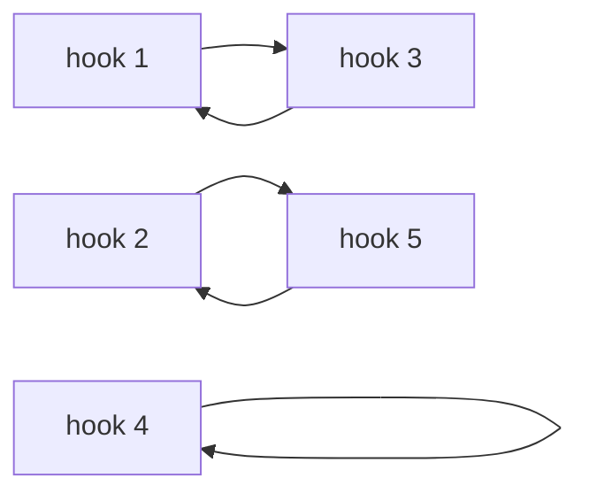

# Counting shuffles by their loops: Stirling numbers of the first kind, and derangements are the no-short-loop case

Combinatorics and graphs → Partitions → Cycle shape → Counting shuffles by their loops

---

## General Overview

A caretaker keeps five keys, one per door, on five hooks labelled 1 to 5 to match. On Friday the keys go back in whatever order they come to hand.

Take one rehang. Hook 1's key ends on hook 3, and hook 3's key on hook 1: those two have traded, and the trade closes. Hooks 2 and 5 have traded too, and hook 4 kept its own key — a trail that closes at once. Three closed trails, none sharing a hook. Call one a **loop**, the word used from here on.

Five keys go back 120 ways. Sorted by how many loops the trace finds: 24 with one loop through all five hooks, 50 with two, 35 with three, 10 with four, 1 with five, where nobody moved.

**Every rehang splits into loops that share no hook, and one short recurrence counts the rehangs making any given number of loops: the last key slips into a rehang of the others, or hangs on its own.**

**What kind of fact this is:** the loop count is a definition; the recurrence counting them is a theorem, proved below in Why it works.

### The picture: one rehang, traced



Each arrow runs from a hook to where its key went. Three loops, of lengths 2, 2 and 1.

---

## The formula

Notation first, in words. A rehang is a **destination list**: under each hook in order, the hook its key went to, so the rehang above is `3 5 1 4 2`. Its loops go in brackets, hooks in trace order: (1 3)(2 5)(4) — cycle notation, met on [permutations-and-the-symmetric-group](../../03-Algebra/08-Groups/03-permutations-and-the-symmetric-group.md), where a loop is a cycle.

Write $c(n,k)$, said "c of n, k", for the rehangs of $n$ keys whose trace makes exactly $k$ loops, so $c(5,3) = 35$. These are the **unsigned Stirling numbers of the first kind**.

$$c(n,k) = (n-1)\,c(n-1,k) + c(n-1,k-1), \qquad c(1,1) = 1$$

**Read it aloud:** the last key either slips into a rehang of the other n − 1, in any of n − 1 places, or hangs on its own beside a rehang making one loop fewer.

| Symbol | Plain meaning | In our example | Push it up and the answer… |
| --- | --- | --- | --- |
| $n$ | keys rehung, one per hook | 5 | rows grow far larger |
| $k$ | loops in the trace | 1 up to 5 | counts fall away past two |
| $c(n,k)$ | rehangs of n keys, k loops | 35 at k = 3 | — |
| $n!$ | all the rehangs, "n factorial" | 120 | — |
| $j$ | a loop's length | 2, 2 and 1 | fewer loops fit |
| $a_j$ | loops that long | two of 2, one of 1 | more repeats to divide out |

A rehang makes one number of loops, so a row holds all of them ([factorial](../01-Counting%20Principles/03-factorial.md)):

$$c(n,1) + c(n,2) + \cdots + c(n,n) = n!$$

A rehang's **cycle type** is its loop lengths, largest first: `3 5 1 4 2` has type 2 + 2 + 1. Rehangs of one type are counted from $n!$: write $a_j$ for how many loops have length $j$, then divide by $j$ raised to $a_j$ and by $a_j$ factorial. For type 2 + 2 + 1:

$$\frac{5!}{2^2 \times 2! \times 1^1 \times 1!} = 15$$

### When it holds

- **Keys and hooks are told apart.** Five identical keys give one rehang, not 120, and nothing to trace.
- **Every hook ends holding one key.** Two on a hook leaves another empty, and the trace reaches one place twice.
- **A hook keeping its own key is a loop, of length 1.** Leave those out and counts scatter: the traced rehang files under two loops, the 20 of type 3 + 1 + 1 under one.
- **These counts carry no sign.** Many tables print a signed version instead, negative whenever n − k is odd; every count here is positive.

---

## Why it works

### Step 0: a rehang is its loops, and nothing else

Follow the keys from any hook. The trail cannot run for ever, nor rejoin itself part way along, since each hook receives one key: the first hook reached twice is the one it began at, so the trail closes. Start again at an untouched hook and that loop cannot meet the first, by the same rule. The loops carve the hooks into groups with nothing in common, their lengths adding to 5 — which is why this sits on the Partitions shelf ([integer-partitions](01-integer-partitions.md)).

### Step 1: ask what the last key does

Two cases, and no rehang is in both.

**Hook 5 keeps its own key.** That loop of one is complete, and taking hook 5 off the board leaves a rehang of four keys with one loop fewer: $c(4,k-1)$ of them.

**Hook 5's key goes elsewhere.** Then hook 5 lies in a loop of two or more. Cut it out: the hook that fed hook 5 now sends its key straight to hook 5's target. The loop is a hook shorter, still a loop, so the count holds — a rehang of four keys with k loops. Backwards, hook 5 splices in after any of the four hooks: 4 × $c(4,k)$.

So c(5,k) = 4 c(4,k) + c(4,k−1), and at three loops 4 × 6 + 11 = 35. The multiplier is four, the hooks already there — not three, the loops.

<details>
<summary>Detailed proof: the splice is reversible</summary>

Inserting 5 after any of the four hooks lengthens that hook's loop and makes or loses none, so k holds, and the four results differ: a different hook sends its key to hook 5 in each. Deleting 5 undoes the insertion, so the two sides stand one to four: the term (n − 1) c(n − 1, k). Seeds: c(1,1) = 1, and c(n,k) = 0 for k above n or below 1.

</details>

### Step 2: each row adds to every rehang

Every rehang makes one number of loops, so a row counts each once: 24 + 50 + 35 + 10 + 1 = 120 = 5 × 4 × 3 × 2 × 1, peaking at two loops.

### Step 3: the corners, by hand

- **One loop, c(5,1) = 24.** Write the loop from hook 1 and the other four follow in any order: 4! = 24. Always starting at hook 1 stops one loop being counted five times over.
- **Five loops, c(5,5) = 1.** Every loop one hook long.
- **Four loops, c(5,4) = 10.** One loop of two, three of one: a single trade, and choosing its two hooks gives C(5,2) = 10 ([n-choose-k](../01-Counting%20Principles/05-n-choose-k.md)).

### Step 4: a second road, counting each cycle type

Five breaks into parts seven ways, one cycle type each: 5; 4 + 1; 3 + 2; 3 + 1 + 1; 2 + 2 + 1; 2 + 1 + 1 + 1; 1 + 1 + 1 + 1 + 1. Write the hooks in a row — 120 orders — chop it into runs of one type's lengths, and read each run as a loop. Every rehang of that type turns up repeatedly: a loop of $j$ hooks starts at any of its $j$, and $a_j$ loops of equal length can be listed $a_j!$ ways. Dividing the repeats out gives 24, 30, 20, 20, 15, 10, 1.

By number of parts: 24; 30 + 20 = 50; 20 + 15 = 35; 10; 1 — the recurrence's row, from unrelated arithmetic.

### Step 5: derangements are the types with no part equal to 1

A rehang leaving no key on its own hook is one with no loop of length 1. Of the seven types only 5 and 3 + 2 qualify, holding 24 + 20 = 44 rehangs — the 44 the sieve reaches on [derangements](../04-Inclusion-Exclusion%20and%20Pigeonhole/02-derangements.md) by quite different arithmetic. They fill no column of the row, though: 24 make a single loop, 20 make two. A loop of length one bars a rehang; it never sets the loop count.

---

## Worked numbers, by hand

Row four, 6, 11, 6, 1, comes from row three the same way; row five follows one entry at a time.

| Step | Arithmetic | Value |
| --- | --- | --- |
| one loop | 4 × 6 | **24** |
| two loops | 4 × 11 + 6 | **50** |
| three loops | 4 × 6 + 11 | **35** |
| four loops, then five | 4 × 1 + 6, then 1 | **10**, **1** |
| the row adds up | 24 + 50 + 35 + 10 + 1 | **120** |
| all rehangs, directly | 5 × 4 × 3 × 2 × 1 | **120** |
| no loop of length 1 | 24 of type 5, 20 of type 3 + 2 | **44** |

So of the 120 rehangs, 35 close into three loops and 44 leave no key on its own hook.

### What breaks if you drop a piece

| Mistake | Comes out at | What went wrong |
| --- | --- | --- |
| Multiplying by the loop count | 3 × 6 + 11 = 29 | the last key has n − 1 places to go |
| Single hooks not counted as loops | 2 loops, not 3 | the traced rehang files under two |
| Counting blocks, groups with no order, not loops | 25, not 35 | a loop of three runs two ways round |

The code prints all three.

---

## Code, from first principles, and it actually runs

Nothing is imported. Three roads sharing no arithmetic reach the row 24, 50, 35, 10, 1: listing all 120 rehangs and tracing each, the recurrence, and the cycle types. The no-loop-of-one count comes twice over, and a second triangle supplies the 25.

### Python

```python
# Counting shuffles by their loops -- the check behind the card.  Nothing is
# imported.  Five keys come off a keyring onto five labelled hooks, and a rehang
# is a destination list: entry i names the hook the key from hook i goes to.
# Three roads sharing no arithmetic count the rehangs with exactly k loops:
# listing all 120 and tracing each, the recurrence c(n,k) = (n-1) c(n-1,k) +
# c(n-1,k-1), and the cycle-type count n! / (product of j^a_j times a_j!).
N = 5

def rehangs(n):                          # every destination list, no hook used twice
    out = [()]
    for _ in range(n): out = [p + (d,) for p in out for d in range(1, n + 1) if d not in p]
    return out
def loops(p):                            # follow a hook until the key comes back
    seen, out = set(), []
    for start in range(1, len(p) + 1):
        cyc = []
        while start not in seen: cyc.append(start); seen.add(start); start = p[start - 1]
        if cyc: out.append(cyc)
    return out
def factorial(n): return 1 if n < 2 else n * factorial(n - 1)
def splits(n, most):                     # the ways n breaks into parts, largest first
    if n == 0: return [()]
    return [(j,) + r for j in range(min(n, most), 0, -1) for r in splits(n - j, j)]
def size(q):                             # n! / (product of j^a_j times a_j!)
    out = factorial(sum(q))
    for i, j in enumerate(q): out //= j * q[:i + 1].count(j)
    return out
def at(row, k): return row[k - 1] if 1 <= k <= len(row) else 0
def flat(row): return " ".join(str(v) for v in row)
def name(p): return "".join("(" + flat(c) + ")" for c in loops(p))
def lengths(p): return ", ".join(str(len(c)) for c in loops(p))

deck, parts, three, whole = rehangs(N), splits(N, N), (3, 5, 1, 4, 2), (2, 3, 4, 5, 1)
listed = [sum(1 for p in deck if len(loops(p)) == k) for k in range(1, N + 1)]
typed = [sum(size(q) for q in parts if len(q) == k) for k in range(1, N + 1)]
tri, sec = [[1]], [[1]]                  # first kind, and second kind for contrast
for n in range(2, N + 1):
    tri.append([(n - 1) * at(tri[-1], k) + at(tri[-1], k - 1) for k in range(1, n + 1)])
    sec.append([k * at(sec[-1], k) + at(sec[-1], k - 1) for k in range(1, n + 1)])
deranged = sum(1 for p in deck if all(p[i] != i + 1 for i in range(N)))
no_ones = sum(size(q) for q in parts if min(q) >= 2)
print(f"five keys on five hooks: {len(deck)} rehangs in all")
print(f"rehang {flat(three)} traced: {name(three)}, {len(loops(three))} loops of lengths {lengths(three)}")
print(f"rehang {flat(whole)} traced: {name(whole)}, {len(loops(whole))} loop of length {lengths(whole)}")
print("the triangle by the recurrence:   " + "   ".join(f"n={n + 1}: {flat(tri[n])}" for n in range(N)))
print(f"row 5 by listing all {len(deck)} rehangs: {flat(listed)}; from the cycle types: {flat(typed)}")
print(f"row sum {' + '.join(str(v) for v in listed)} = {sum(listed)}, and 5! = {factorial(N)}; "
      f"corners c(5,1) = 4! = {tri[4][0]}, c(5,5) = {tri[4][4]}, c(5,4) = C(5,2) = {tri[4][3]}")
print(f"the recurrence at c(5,3): 4 x c(4,3) + c(4,2) = 4 x {tri[3][2]} + {tri[3][1]} = {tri[4][2]}")
print("cycle types: " + ", ".join("+".join(str(j) for j in q) + f" -> {size(q)}" for q in parts))
print(f"no loop of length 1, by listing {deranged}; from the cycle types "
      + " + ".join(str(size(q)) for q in parts if min(q) >= 2) + f" = {no_ones}")
print(f"blocks are not loops: S(5,3) = {sec[4][2]} against c(5,3) = {tri[4][2]}")
print(f"mistakes: the multiplier read as k, 3 x {tri[3][2]} + {tri[3][1]} = {3 * tri[3][2] + tri[3][1]}; "
      f"the single hook left out, {sum(1 for c in loops(three) if len(c) > 1)} loops not {len(loops(three))}")
assert listed == tri[N - 1]                        # listing against the recurrence
assert listed == typed                             # listing against the cycle types
assert deranged == no_ones                         # two roads to the no-single-hook count
assert sum(listed) == factorial(N) == len(deck)    # the row sum, three ways
print("ALL CHECKS PASS")
```

**Ran 2026-09-19 on macOS, Python 3.14.6, standard library only. All checks passed. Output, pasted from the run:**

```
five keys on five hooks: 120 rehangs in all
rehang 3 5 1 4 2 traced: (1 3)(2 5)(4), 3 loops of lengths 2, 2, 1
rehang 2 3 4 5 1 traced: (1 2 3 4 5), 1 loop of length 5
the triangle by the recurrence:   n=1: 1   n=2: 1 1   n=3: 2 3 1   n=4: 6 11 6 1   n=5: 24 50 35 10 1
row 5 by listing all 120 rehangs: 24 50 35 10 1; from the cycle types: 24 50 35 10 1
row sum 24 + 50 + 35 + 10 + 1 = 120, and 5! = 120; corners c(5,1) = 4! = 24, c(5,5) = 1, c(5,4) = C(5,2) = 10
the recurrence at c(5,3): 4 x c(4,3) + c(4,2) = 4 x 6 + 11 = 35
cycle types: 5 -> 24, 4+1 -> 30, 3+2 -> 20, 3+1+1 -> 20, 2+2+1 -> 15, 2+1+1+1 -> 10, 1+1+1+1+1 -> 1
no loop of length 1, by listing 44; from the cycle types 24 + 20 = 44
blocks are not loops: S(5,3) = 25 against c(5,3) = 35
mistakes: the multiplier read as k, 3 x 6 + 11 = 29; the single hook left out, 2 loops not 3
ALL CHECKS PASS
```

### Rust

Same rows and labels, built with `rustc --edition 2021 -O`.

```rust
// Counting shuffles by their loops -- the same check as the Python, in Rust.  No
// crates.  Five keys come off a keyring onto five labelled hooks, and a rehang is
// a destination list: entry i names the hook the key from hook i goes to.  Three
// roads sharing no arithmetic count the rehangs with exactly k loops: listing all
// 120 and tracing each, the recurrence c(n,k) = (n-1) c(n-1,k) + c(n-1,k-1), and
// the cycle-type count n! / (product of j^a_j times a_j!).
const N: usize = 5;
fn rehangs(n: usize) -> Vec<Vec<usize>> {          // every destination list, no hook twice
    let mut out: Vec<Vec<usize>> = vec![vec![]];
    for _ in 0..n {
        let mut next: Vec<Vec<usize>> = Vec::new();
        for p in &out { for d in 1..=n { if !p.contains(&d) { let mut q = p.clone(); q.push(d); next.push(q) } } }
        out = next;
    }
    out
}
fn loops(p: &[usize]) -> Vec<Vec<usize>> {         // follow a hook until the key comes back
    let (mut seen, mut out) = (vec![false; p.len() + 1], Vec::new());
    for start in 1..=p.len() {
        let (mut cyc, mut j) = (Vec::new(), start);
        while !seen[j] { cyc.push(j); seen[j] = true; j = p[j - 1] }
        if !cyc.is_empty() { out.push(cyc) }
    }
    out
}
fn factorial(n: usize) -> i64 { if n < 2 { 1 } else { n as i64 * factorial(n - 1) } }
fn splits(n: usize, most: usize) -> Vec<Vec<usize>> {     // n into parts, largest first
    if n == 0 { return vec![vec![]] }
    let mut out: Vec<Vec<usize>> = Vec::new();
    for j in (1..=n.min(most)).rev() { for r in splits(n - j, j) { let mut q = vec![j]; q.extend(r); out.push(q) } }
    out
}
fn size(q: &[usize]) -> i64 {                      // n! / (product of j^a_j times a_j!)
    let mut out = factorial(q.iter().sum());
    for (i, &j) in q.iter().enumerate() { out /= j as i64 * q[..=i].iter().filter(|&&x| x == j).count() as i64 }
    out
}
fn at(row: &[i64], k: i64) -> i64 { if k >= 1 && k <= row.len() as i64 { row[k as usize - 1] } else { 0 } }
fn join(bits: Vec<String>, gap: &str) -> String { bits.join(gap) }
fn glue(row: &[i64], gap: &str) -> String { join(row.iter().map(|v| v.to_string()).collect(), gap) }
fn flat(row: &[usize]) -> String { join(row.iter().map(|v| v.to_string()).collect(), " ") }
fn name(p: &[usize]) -> String { join(loops(p).iter().map(|c| format!("({})", flat(c))).collect(), "") }
fn lengths(p: &[usize]) -> String { join(loops(p).iter().map(|c| c.len().to_string()).collect(), ", ") }
fn main() {
    let (deck, parts) = (rehangs(N), splits(N, N));
    let (three, whole) = (vec![3, 5, 1, 4, 2], vec![2, 3, 4, 5, 1]);
    let listed: Vec<i64> = (1..=N).map(|k| deck.iter().filter(|p| loops(p).len() == k).count() as i64).collect();
    let typed: Vec<i64> = (1..=N).map(|k| parts.iter().filter(|q| q.len() == k).map(|q| size(q)).sum()).collect();
    let (mut tri, mut sec) = (vec![vec![1i64]], vec![vec![1i64]]);    // first kind, then second
    for n in 2..=N as i64 {
        let (pt, ps) = (tri[tri.len() - 1].clone(), sec[sec.len() - 1].clone());
        tri.push((1..=n).map(|k| (n - 1) * at(&pt, k) + at(&pt, k - 1)).collect());
        sec.push((1..=n).map(|k| k * at(&ps, k) + at(&ps, k - 1)).collect());
    }
    let deranged = deck.iter().filter(|p| (0..N).all(|i| p[i] != i + 1)).count() as i64;
    let keep = |q: &&Vec<usize>| *q.iter().min().unwrap() >= 2;
    let no_ones: i64 = parts.iter().filter(keep).map(|q| size(q)).sum();
    println!("five keys on five hooks: {} rehangs in all", deck.len());
    println!("rehang {} traced: {}, {} loops of lengths {}", flat(&three), name(&three), loops(&three).len(), lengths(&three));
    println!("rehang {} traced: {}, {} loop of length {}", flat(&whole), name(&whole), loops(&whole).len(), lengths(&whole));
    println!("the triangle by the recurrence:   {}", join((0..N).map(|n| format!("n={}: {}", n + 1, glue(&tri[n], " "))).collect(), "   "));
    println!("row 5 by listing all {} rehangs: {}; from the cycle types: {}", deck.len(), glue(&listed, " "), glue(&typed, " "));
    println!("row sum {} = {}, and 5! = {}; corners c(5,1) = 4! = {}, c(5,5) = {}, c(5,4) = C(5,2) = {}",
             glue(&listed, " + "), listed.iter().sum::<i64>(), factorial(N), tri[4][0], tri[4][4], tri[4][3]);
    println!("the recurrence at c(5,3): 4 x c(4,3) + c(4,2) = 4 x {} + {} = {}", tri[3][2], tri[3][1], tri[4][2]);
    println!("cycle types: {}", join(parts.iter().map(|q| format!("{} -> {}",
             join(q.iter().map(|j| j.to_string()).collect(), "+"), size(q))).collect(), ", "));
    println!("no loop of length 1, by listing {}; from the cycle types {} = {}", deranged,
             join(parts.iter().filter(keep).map(|q| size(q).to_string()).collect(), " + "), no_ones);
    println!("blocks are not loops: S(5,3) = {} against c(5,3) = {}", sec[4][2], tri[4][2]);
    println!("mistakes: the multiplier read as k, 3 x {} + {} = {}; the single hook left out, {} loops not {}",
             tri[3][2], tri[3][1], 3 * tri[3][2] + tri[3][1],
             loops(&three).iter().filter(|c| c.len() > 1).count(), loops(&three).len());
    assert!(listed == tri[N - 1]);                     // listing against the recurrence
    assert!(listed == typed);                          // listing against the cycle types
    assert!(deranged == no_ones);                      // two roads to the no-single-hook count
    assert!(listed.iter().sum::<i64>() == factorial(N) && factorial(N) == deck.len() as i64);
    println!("ALL CHECKS PASS");
}
```

**Ran 2026-09-19 on macOS, rustc 1.98.1, no crates. All checks passed. Output, pasted from the run:**

```
five keys on five hooks: 120 rehangs in all
rehang 3 5 1 4 2 traced: (1 3)(2 5)(4), 3 loops of lengths 2, 2, 1
rehang 2 3 4 5 1 traced: (1 2 3 4 5), 1 loop of length 5
the triangle by the recurrence:   n=1: 1   n=2: 1 1   n=3: 2 3 1   n=4: 6 11 6 1   n=5: 24 50 35 10 1
row 5 by listing all 120 rehangs: 24 50 35 10 1; from the cycle types: 24 50 35 10 1
row sum 24 + 50 + 35 + 10 + 1 = 120, and 5! = 120; corners c(5,1) = 4! = 24, c(5,5) = 1, c(5,4) = C(5,2) = 10
the recurrence at c(5,3): 4 x c(4,3) + c(4,2) = 4 x 6 + 11 = 35
cycle types: 5 -> 24, 4+1 -> 30, 3+2 -> 20, 3+1+1 -> 20, 2+2+1 -> 15, 2+1+1+1 -> 10, 1+1+1+1+1 -> 1
no loop of length 1, by listing 44; from the cycle types 24 + 20 = 44
blocks are not loops: S(5,3) = 25 against c(5,3) = 35
mistakes: the multiplier read as k, 3 x 6 + 11 = 29; the single hook left out, 2 loops not 3
ALL CHECKS PASS
```

The two outputs match line for line.

> [!TIP]
> **Try changing**
> Guess first, then run it. The four asserts are pinned to the five keys.
> - **Swap the multiplier.** In the `tri` line use `k *` for `(n - 1) *`, the second-kind recurrence: row five reads 1, 15, 25, 10, 1 while listing still says 24, 50, 35, 10, 1, and the first assert stops it.
> - **Forget the repeats.** In `size`, divide by `j` alone: equal-length loops count as different, the cycle-type row runs high, second assert.
> - **Bar loops of two too.** Make `min(q) >= 2` read `min(q) >= 3`: type 3 + 2 drops out, the count falls to 24 against the listed 44, third assert.

---

## The usual mistake

> [!warning]
> **Multiplying by the number of loops.** The last key goes in after some hook already on the board, and there are n − 1 of those, not k: read as the loop count the recurrence gives 3 × 6 + 11 = 29 where the answer is 35.
>
> - **Dropping loops of length one.** They are loops. The traced rehang has three; calling it two moves it from the 35 into the 50.
> - **Reading this triangle as the second-kind one.** Three loops on five hooks number 35; three blocks number 25 ([stirling-numbers-second-kind](04-stirling-numbers-second-kind.md)). A loop of three runs two ways round; a block has no direction.

---

## Where you meet it in real life

- **Rotas and gift draws.** A rearrangement leaving nobody their own item is the no-loop-of-one case: 44 of the 120 ways five items come back ([derangements](../04-Inclusion-Exclusion%20and%20Pigeonhole/02-derangements.md)).
- **Sorting work.** The fewest swaps a rearrangement needs is places minus loops ([permutations-and-the-symmetric-group](../../03-Algebra/08-Groups/03-permutations-and-the-symmetric-group.md)): 5 − 3 = 2 here, 5 − 1 = 4 for one long loop. A routine reordering a list in place walks one loop at a time.
- **Shuffles that come back.** How many rounds of a shuffle return a deck to its first order is set by its loop lengths ([perfect-shuffles](../../02-Number%20theory/05-Check%20Digits%2C%20Calendars%20and%20Cycles/05-perfect-shuffles.md)): there the lengths do the work, here only how many there are.

> **Say it back**
> Trace each key from its hook to where it went and a rehang closes into loops sharing no hook. The 120 rehangs of five keys hold 24 with one loop, 50 with two, 35 with three, 10 with four, 1 with five. The last key slips into a rehang of the others, in any of n − 1 places, or hangs on its own and adds a loop: that recurrence builds every row. Cycle types give the same row, making the derangements the types with no loop of length one, 44 of them.

---

## What this builds on

- [derangements](../04-Inclusion-Exclusion%20and%20Pigeonhole/02-derangements.md): the 44, by the sieve rather than cycle types.
- [factorial](../01-Counting%20Principles/03-factorial.md): the 120 a row adds to, and 4! = 24.
- [permutations-and-the-symmetric-group](../../03-Algebra/08-Groups/03-permutations-and-the-symmetric-group.md): rehangs as permutations, loops as cycles, swaps against loop count.
- [perfect-shuffles](../../02-Number%20theory/05-Check%20Digits%2C%20Calendars%20and%20Cycles/05-perfect-shuffles.md): loop lengths deciding when a repeated shuffle comes home.

## Where this goes next

- [twelvefold-way](06-twelvefold-way.md): the table sorting this family of questions — labelled or unlabelled things into labelled or unlabelled boxes — and placing loops and blocks in it.

Beside it, [stirling-numbers-second-kind](04-stirling-numbers-second-kind.md) counts the same keys into blocks, and [set-partitions-and-bell-numbers](03-set-partitions-and-bell-numbers.md) adds those counts along a row.

Loops and blocks are now counted apart; which standard question each answers, and what the other ten are, is the twelvefold way.

---

## Sources

Verified 19 Sep 2026: every link below resolves to the publisher's page.

- NIST *Digital Library of Mathematical Functions*, 26.8, "Set Partitions: Stirling Numbers". [dlmf.nist.gov/26.8](https://dlmf.nist.gov/26.8). Defines the first-kind numbers as permutations counted by cycles; 26.8.18 is this recurrence in its signed form, and Table 26.8.1 carries the signs.
- Sloane, N. J. A., ed. Sequence A132393, "Triangle of unsigned Stirling numbers of the first kind". *OEIS*. [oeis.org/A132393](https://oeis.org/A132393). Row five: 24, 50, 35, 10, 1.
- Stanley, Richard P. *Enumerative Combinatorics*, vol. 1, 2nd ed. Cambridge University Press, 2011. [Cambridge Core](https://www.cambridge.org/core/books/enumerative-combinatorics/3155CDE1D973D49F873BDE2EAF8D7651), [doi:10.1017/CBO9781139058520](https://doi.org/10.1017/CBO9781139058520). Chapter 1 proves the cycle-type count; paid.
