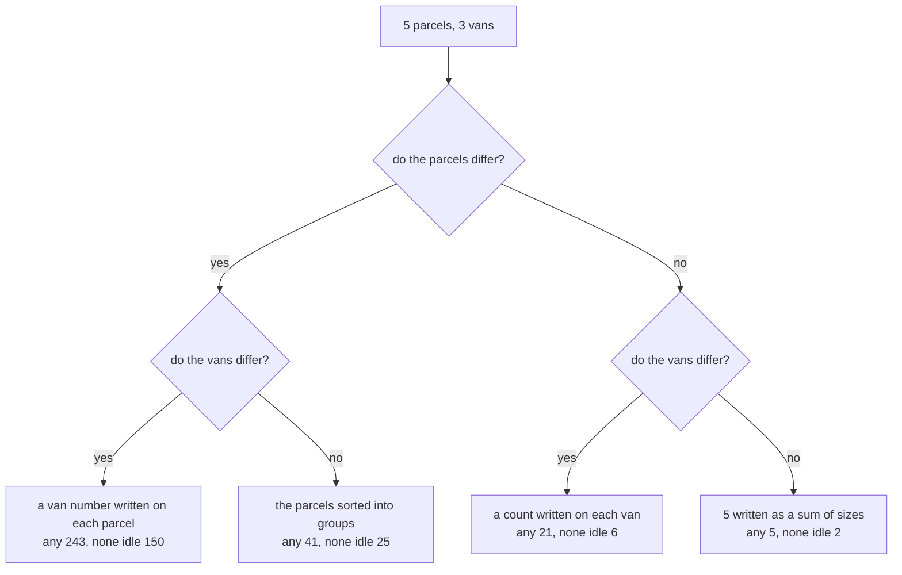

# The twelvefold way: every 'put n things into k boxes' question in one table

[Syllabus](../../../SYLLABUS.md) → [Combinatorics and graphs](../README.md) → [Partitions](../README.md#s08) → The twelvefold way

---

## General Overview

A courier depot has five parcels to send out on Monday and three vans in the yard. How many ways are there to load them?

The question has no answer yet: three things are unsettled.

**Do the parcels differ?** A wedding cake and a washing machine do; five identical sacks of gravel do not, since all that can be recorded is how many. **Do the vans differ?** Vans named on a manifest do; three unnumbered hired vans do not. **What must a van hold?** Anything, including nothing; or at most one parcel; or at least one.

Two by two by three: twelve questions inside one sentence. Eight of the counts here are 243, 150, 41, 25, 21, 6, 5 and 2; the other four are 0, since three vans cannot take five parcels one apiece. Gian-Carlo Rota set the twelve out in lectures and Joel Spencer supplied the name **twelvefold way**, the term used from here on.

**Every "put n things into k boxes" question is settled by three answers — do the things differ, do the boxes differ, what must a box hold — and the twelve combinations carry twelve counts.**

**What kind of fact this is:** a method, a way of naming which count a question asks for. The twelve formulas are theorems, proved on the cards this one draws together.

### The picture: the labels pick a row



The holding rule picks a column; the middle one is impossible here.

---

## The formula

Write $n$ for the things and $k$ for the boxes: here n = 5, k = 3. Three shorthands come from earlier cards: $C(m, r)$, "m choose r", the ways of picking r things out of m with order ignored ([Combinations, n choose k](../01-Counting%20Principles/05-n-choose-k.md)); $k!$, "k factorial", k × (k − 1) × … × 1 ([Factorials](../01-Counting%20Principles/03-factorial.md)); and $S(n, k)$, the splits of n different things into k unnamed groups, none empty ([Stirling numbers of the second kind](04-stirling-numbers-second-kind.md)).

The fourth is new, in words first: $p_k(n)$ counts the ways of writing n as a sum of exactly k positive parts, order ignored, and $p_{\le k}(n)$ allows fewer, written $R_k(n)$ on the partitions card; 5 = 3 + 1 + 1 is one of the two counted by $p_3(5)$ ([Integer partitions](01-integer-partitions.md)).

| Parcels, vans | Any number | At most one each | At least one each |
| --- | --- | --- | --- |
| differ, differ | $k^n$ → 243 | $k(k-1)\cdots(k-n+1)$ → 0 | $k!\,S(n, k)$ → 150 |
| differ, alike | $S(n, 1) + \cdots + S(n, k)$ → 41 | 1 when $n \le k$ → 0 | $S(n, k)$ → 25 |
| alike, differ | $C(n + k - 1,\; k - 1)$ → 21 | $C(k, n)$ → 0 | $C(n - 1,\; k - 1)$ → 6 |
| alike, alike | $p_{\le k}(n)$ → 5 | 1 when $n \le k$ → 0 | $p_k(n)$ → 2 |

**Read it aloud:** the labels pick a row, the holding rule picks a column, and their cell holds the formula.

| Symbol | Plain meaning | In our example | Push it up… |
| --- | --- | --- | --- |
| $n$ | things to be placed | 5 parcels | every cell rises |
| $k$ | boxes for them | 3 vans | "at least one" rises, then hits 0 past n |
| $C(m, r)$ | ways of picking r out of m, order ignored | C(7, 2) = 21 | — |
| $k!$ | the orders k things stand in | 3! = 6 | — |
| $k(k-1)\cdots(k-n+1)$ | k counted down for n factors, one per thing | 3 × 2 × 1 × 0 × (−1) = 0 | — |
| $S(n, k)$ | n things in exactly k groups, none empty, unnamed | S(5, 3) = 25 | — |
| $p_k(n)$ | n as a sum of exactly k parts; $p_{\le k}(n)$ allows fewer | 2 ways, and 5 ways | — |

The count-down in full:

$$k(k-1)(k-2)\cdots(k-n+1)$$

**In words:** the first thing has k boxes free, the next k − 1, and so on for n things; past k things a factor is 0.

### When it holds

- **The label questions are about the answer, not the metal.** The same vans differ when the manifest names them and are alike when it does not.
- **Three holding rules, no others.** A cap of two parcels a van is none of the twelve, and no cell counts it.
- **Nothing is ordered inside a box.** Stack each van in a fixed order and every count in the grid is too small.

---

## Why it works

### Step 0: a loading is a note written on every parcel

Number the parcels 1 to 5, the vans 1 to 3, and write each parcel's van number on it. A loading becomes a list of five numbers from 1 to 3, such as (2, 1, 1, 3, 2). Every loading writes one list and every list reads back as one, so counting loadings is counting lists: 3 × 3 × 3 × 3 × 3 = 243 ([Strings with repetition](../01-Counting%20Principles/02-strings-and-powers.md)).

The holding rule is a condition on the list: no number repeats, or all three show up. That is the top row — 243 in all, 0 with no repeat, 150 using all three ([Onto functions](../04-Inclusion-Exclusion%20and%20Pigeonhole/03-counting-surjections.md)).

### Step 1: taking the names off the vans, and when dividing is allowed

Rub the plates off and a loading is a sorting into groups: (1, 1, 2, 3, 3) and (2, 2, 3, 1, 1) are the same three groups.

With no van empty the names come off by dividing. Three vans can be named in 3! = 6 orders, each naming of a grouping giving a different list, so the 150 lists fall into blocks of six: 150 ÷ 6 = 25.

Allow empty vans and dividing breaks: 243 ÷ 6 = 40.5 counts nothing, and the answer is 41. All five parcels in van one keeps its list when the two empty vans swap, so its block is short. The repair is a sum, not a division: count the groupings by how many groups they use, 1 + 15 + 25 = 41.

<details>
<summary>Detailed proof: when the names come off by dividing</summary>

Take the loadings of $n$ things into $k$ boxes with no box empty. Two are the same grouping exactly when one of the $k!$ renamings of the boxes carries one to the other, so the loadings fall into blocks, one per grouping; dividing needs every block to hold $k!$ of them.

A block is short only if some renaming leaves a loading unchanged, putting each box's contents where another box's were. With no box empty those contents differ, so only the renaming that moves nothing qualifies. Every block is full: 150 ÷ 6 = 25.

</details>

### Step 2: taking the labels off the parcels, then off both

Plates back on, and the parcels become identical sacks of gravel. A loading is three counts adding to five, such as (2, 0, 3). Five sacks and two dividers in a row of seven places give C(7, 2) = 21; with no van empty, dividers go in the four gaps between sacks, C(4, 2) = 6 ([Stars and bars](../02-Repeats%2C%20Groups%20and%20Double%20Counting/02-stars-and-bars.md)).

Strip the van names too and only the sizes survive, biggest first: 5, 4 + 1, 3 + 2, 3 + 1 + 1, 2 + 2 + 1 — five ways, two with exactly three parts. A list, a grouping, a list of sizes: each step drops what the question ignores.

### Step 3: the column of zeros, and where it comes alive

At most one parcel a van needs a van per parcel, so the column reads 0 here. Send two parcels and it wakes up: 6, 1, 3, 1.

With both labels on, the first parcel picks one of three vans and the second one of the two left, 3 × 2 = 6 ([Ordered picks](../01-Counting%20Principles/04-ordered-picks.md)). Sacks into named vans: which two are used, C(3, 2) = 3. Unnamed vans give 1 either way, nothing telling two such loadings apart.

Two more routes cross-check the grid. A loading that leaves vans empty fills fewer, so each "any" cell is its row's "at least one" cell added over how many vans are used, times the choice of which when they are named: 243 = 3 + 90 + 150, 41 = 1 + 15 + 25, 21 = 3 + 12 + 6, 5 = 1 + 2 + 2. And the alike-van rows grow one thing at a time, by $S(n, k) = k\,S(n-1, k) + S(n-1, k-1)$ and $p_k(n) = p_{k-1}(n-1) + p_k(n-k)$, both run by the code.

---

## Worked numbers, by hand

| Step | Arithmetic | Value |
| --- | --- | --- |
| each parcel picks a van | 3 × 3 × 3 × 3 × 3 | **243** |
| no van idle, vans named | 6 namings × 25 groupings | **150** |
| vans alike, no van idle | 150 ÷ 6 | **25** |
| vans alike, empties allowed | 1 + 15 + 25 | **41** |
| sacks of gravel, vans named, then no van idle | 2 dividers in 7 places, then in 4 gaps | **21**, then **6** |
| nothing named, then no van idle | 5, 4+1, 3+2, 3+1+1, 2+2+1 | **5**, then **2** |

So the depot's question has twelve answers: eight numbers and four zeros.

### What breaks if you drop a piece

| Mistake | Comes out at | What went wrong |
| --- | --- | --- |
| Unnaming the vans by dividing 243 by 3! | 40.5 | loadings leaving a van empty do not come six to a grouping |
| "At least one each" read as "at most one" | 0, not 150 | three vans cannot take five parcels one apiece |
| Sacks counted as different parcels | 243, not 21 | the count separates loads the question calls one |

Both checks print every number in that table.

---

## Code, from first principles, and it actually runs

Nothing is imported. All twelve counts are reached twice by roads sharing no arithmetic: one lists the 243 loadings and throws away what the question ignores, keeping one entry per answer; the other applies each cell's formula, with the choose count, factorial, groups rule and parts rule written out. The grid runs again on two parcels into three vans.

### Python

```python
# The twelvefold way -- the check behind the card.  Nothing is imported.  Five parcels into
# three vans, then two parcels into three vans.  Each of the twelve counts is reached twice:
# by listing every loading and stripping the labels the question ignores, and by its formula.
WAYS = (("differ", "differ"), ("differ", "alike"), ("alike", "differ"), ("alike", "alike"))
RULES = ("any", "at most one", "at least one")
def choose(m, r):                            # C(m, r), one factor at a time; 0 when r > m
    out = 0 if r < 0 or r > m else 1
    for i in range(r): out = out * (m - i) // (i + 1)
    return out
def falling(k, n):                           # count down from k for n steps: k x (k-1) x ...
    out = 1
    for i in range(n): out *= k - i
    return out
def blocks(n, k):                            # S(n, k) = k x S(n-1, k) + S(n-1, k-1)
    row = [1] + [0] * k
    for _ in range(n): row = [0] + [j * row[j] + row[j - 1] for j in range(1, k + 1)]
    return row[k]
def parts(n, k):                             # n as a sum of exactly k positive parts
    if n == k: return 1
    return 0 if k == 0 or n < k else parts(n - 1, k - 1) + parts(n - k, k)
def listing(n, k):                           # road one: every loading, the labels stripped
    loads = [()]
    for _ in range(n): loads = [f + (v,) for f in loads for v in range(k)]
    def keyset(things, vans, rule):
        keys = set()
        for f in loads:
            c = [f.count(v) for v in range(k)]
            if rule == "at most one" and max(c) > 1: continue
            if rule == "at least one" and min(c) < 1: continue
            if vans == "differ": keys.add(f if things == "differ" else tuple(c))
            elif things == "alike": keys.add(tuple(sorted([x for x in c if x], reverse=True)))
            else: keys.add(tuple(b for b in sorted(tuple(i for i in range(n) if f[i] == v) for v in range(k)) if b))
        return keys
    return [[keyset(t, v, r) for r in RULES] for t, v in WAYS]
def formulas(n, k):                          # road two: the twelve closed forms, same order
    b = [blocks(n, j) for j in range(1, k + 1)]
    p = [parts(n, j) for j in range(1, k + 1)]
    one = 1 if n <= k else 0
    return [[k ** n, falling(k, n), falling(k, k) * b[k - 1]], [sum(b), one, b[k - 1]],
            [choose(n + k - 1, k - 1), choose(k, n), choose(n - 1, k - 1)], [sum(p), one, p[k - 1]]]
L, F = listing(5, 3), formulas(5, 3)
M, G = listing(2, 3), formulas(2, 3)
for n, k, A, B in ((5, 3, L, F), (2, 3, M, G)):
    print(f"{n} parcels into {k} vans, each cell listed then by formula")
    for i, (things, vans) in enumerate(WAYS):
        print(f"  parcels {things:<6} vans {vans:<6}" + "".join(
              f"   {RULES[j]}: {len(A[i][j]):>3} {B[i][j]:>3}" for j in range(3)))
used = [[choose(3, j) * falling(j, j) * blocks(5, j) for j in (1, 2, 3)], [blocks(5, j) for j in (1, 2, 3)],
        [choose(3, j) * choose(4, j - 1) for j in (1, 2, 3)], [parts(5, j) for j in (1, 2, 3)]]
print("5 as a sum of at most 3 parts: " + ", ".join("+".join(str(x) for x in q) for q in sorted(L[3][0], reverse=True)))
print(f"no van left empty, two roads: listed {len(L[0][2])}, 3! x S(5,3) = {falling(3, 3)} x {blocks(5, 3)}")
print("each 'any' cell split by vans used: " + "; ".join(f"{' + '.join(str(x) for x in u)} = {sum(u)}" for u in used))
print(f"unlabelling the vans by dividing: 243 / 3! = 243 / {falling(3, 3)} = {243 / falling(3, 3):.1f}, not {F[1][0]}")
assert [[len(x) for x in r] for r in L] == F and [[len(x) for x in r] for r in M] == G
assert [F[i][0] for i in range(4)] == [243, 41, 21, 5] and [F[i][2] for i in range(4)] == [150, 25, 6, 2]
assert [sum(u) for u in used] == [len(L[i][0]) for i in range(4)] and len(L[0][2]) == falling(3, 3) * len(L[1][2])
assert [len(x) for x in M[0]] == [9, 6, 0] and [G[i][1] for i in range(4)] == [6, 1, 3, 1]
print("ALL CHECKS PASS")
```

**Ran 2026-09-19 on macOS, Python 3.14.6, standard library only. All checks passed. Output, pasted from the run:**

```
5 parcels into 3 vans, each cell listed then by formula
  parcels differ vans differ   any: 243 243   at most one:   0   0   at least one: 150 150
  parcels differ vans alike    any:  41  41   at most one:   0   0   at least one:  25  25
  parcels alike  vans differ   any:  21  21   at most one:   0   0   at least one:   6   6
  parcels alike  vans alike    any:   5   5   at most one:   0   0   at least one:   2   2
2 parcels into 3 vans, each cell listed then by formula
  parcels differ vans differ   any:   9   9   at most one:   6   6   at least one:   0   0
  parcels differ vans alike    any:   2   2   at most one:   1   1   at least one:   0   0
  parcels alike  vans differ   any:   6   6   at most one:   3   3   at least one:   0   0
  parcels alike  vans alike    any:   2   2   at most one:   1   1   at least one:   0   0
5 as a sum of at most 3 parts: 5, 4+1, 3+2, 3+1+1, 2+2+1
no van left empty, two roads: listed 150, 3! x S(5,3) = 6 x 25
each 'any' cell split by vans used: 3 + 90 + 150 = 243; 1 + 15 + 25 = 41; 3 + 12 + 6 = 21; 1 + 2 + 2 = 5
unlabelling the vans by dividing: 243 / 3! = 243 / 6 = 40.5, not 41
ALL CHECKS PASS
```

### Rust

Same numbers, same labels, built with `rustc --edition 2021 -O`.

```rust
// The twelvefold way -- the same check as the Python, in Rust.  No crates.  Five parcels into
// three vans, then two parcels into three vans.  Each of the twelve counts is reached twice:
// by listing every loading and stripping the labels the question ignores, and by its formula.
use std::collections::BTreeSet;
const WAYS: [(&str, &str); 4] = [("differ", "differ"), ("differ", "alike"), ("alike", "differ"), ("alike", "alike")];
const RULES: [&str; 3] = ["any", "at most one", "at least one"];
fn choose(m: i64, r: i64) -> i64 {               // C(m, r), one factor at a time; 0 when r > m
    let mut out = if r < 0 || r > m { 0 } else { 1 };
    for i in 0..r { out = out * (m - i) / (i + 1) } out
}
fn falling(k: i64, n: i64) -> i64 {              // count down from k for n steps: k x (k-1) x ...
    let mut out = 1;
    for i in 0..n { out *= k - i } out
}
fn blocks(n: i64, k: usize) -> i64 {             // S(n, k) = k x S(n-1, k) + S(n-1, k-1)
    let mut row = vec![0i64; k + 1]; row[0] = 1;
    for _ in 0..n { let p = row.clone(); row = (0..=k).map(|j| if j == 0 { 0 } else { j as i64 * p[j] + p[j - 1] }).collect() }
    row[k]
}
fn parts(n: i64, k: i64) -> i64 {                // n as a sum of exactly k positive parts
    if n == k { 1 } else if k == 0 || n < k { 0 } else { parts(n - 1, k - 1) + parts(n - k, k) }
}
fn joined(v: &[i64], sep: &str) -> String { v.iter().map(|x| x.to_string()).collect::<Vec<String>>().join(sep) }
fn listing(n: usize, k: usize) -> Vec<Vec<BTreeSet<Vec<i64>>>> {   // road one: every loading, labels stripped
    let mut loads: Vec<Vec<usize>> = vec![Vec::new()];
    for _ in 0..n { let mut next: Vec<Vec<usize>> = Vec::new();
        for f in &loads { for v in 0..k { let mut g = f.clone(); g.push(v); next.push(g) } } loads = next }
    let keyset = |things: &str, vans: &str, rule: &str| -> BTreeSet<Vec<i64>> {
        let mut keys: BTreeSet<Vec<i64>> = BTreeSet::new();
        for f in &loads {
            let c: Vec<i64> = (0..k).map(|v| f.iter().filter(|&&x| x == v).count() as i64).collect();
            if rule == "at most one" && *c.iter().max().unwrap() > 1 { continue }
            if rule == "at least one" && *c.iter().min().unwrap() < 1 { continue }
            let mut sizes: Vec<i64> = c.iter().copied().filter(|&x| x > 0).collect(); sizes.sort(); sizes.reverse();
            let mut bl: Vec<Vec<i64>> = (0..k).map(|v| (0..n).filter(|&i| f[i] == v).map(|i| i as i64).collect()).collect();
            bl.sort();                             // the blocks in a fixed order, empties dropped below
            let mut enc: Vec<i64> = Vec::new();
            for b in bl.iter().filter(|b| !b.is_empty()) { enc.push(-1); enc.extend(b) }
            keys.insert(match (things, vans) { ("differ", "differ") => f.iter().map(|&x| x as i64).collect(),
                ("alike", "differ") => c.clone(), ("differ", _) => enc, _ => sizes });
        }
        keys
    };
    WAYS.iter().map(|(t, v)| RULES.iter().map(|r| keyset(t, v, r)).collect()).collect()
}
fn formulas(n: i64, k: i64) -> Vec<Vec<i64>> {   // road two: the twelve closed forms, same order
    let b: Vec<i64> = (1..=k).map(|j| blocks(n, j as usize)).collect();
    let p: Vec<i64> = (1..=k).map(|j| parts(n, j)).collect();
    let (one, last) = (if n <= k { 1 } else { 0 }, (k - 1) as usize);
    vec![vec![k.pow(n as u32), falling(k, n), falling(k, k) * b[last]], vec![b.iter().sum(), one, b[last]],
         vec![choose(n + k - 1, k - 1), choose(k, n), choose(n - 1, k - 1)], vec![p.iter().sum(), one, p[last]]]
}
fn main() {
    let (l, f) = (listing(5, 3), formulas(5, 3));
    let (m, g) = (listing(2, 3), formulas(2, 3));
    for (n, k, a, b) in [(5, 3, &l, &f), (2, 3, &m, &g)] {
        println!("{} parcels into {} vans, each cell listed then by formula", n, k);
        for (i, (things, vans)) in WAYS.iter().enumerate() {
            println!("  parcels {:<6} vans {:<6}{}", things, vans, (0..3).map(|j|
                format!("   {}: {:>3} {:>3}", RULES[j], a[i][j].len(), b[i][j])).collect::<Vec<String>>().concat());
        }
    }
    let used: Vec<Vec<i64>> = vec![(1..=3).map(|j| choose(3, j) * falling(j, j) * blocks(5, j as usize)).collect(),
        (1..=3).map(|j| blocks(5, j as usize)).collect(), (1..=3).map(|j| choose(3, j) * choose(4, j - 1)).collect(),
        (1..=3).map(|j| parts(5, j)).collect()];
    let mut ps: Vec<Vec<i64>> = l[3][0].iter().cloned().collect(); ps.sort(); ps.reverse();
    println!("5 as a sum of at most 3 parts: {}", ps.iter().map(|q| joined(q, "+")).collect::<Vec<String>>().join(", "));
    println!("no van left empty, two roads: listed {}, 3! x S(5,3) = {} x {}", l[0][2].len(), falling(3, 3), blocks(5, 3));
    println!("each 'any' cell split by vans used: {}", used.iter().map(|u| format!("{} = {}", joined(u, " + "),
             u.iter().sum::<i64>())).collect::<Vec<String>>().join("; "));
    println!("unlabelling the vans by dividing: 243 / 3! = 243 / {} = {:.1}, not {}", falling(3, 3), 243.0 / falling(3, 3) as f64, f[1][0]);
    let counts = |t: &Vec<Vec<BTreeSet<Vec<i64>>>>| -> Vec<Vec<i64>> { t.iter().map(|r| r.iter().map(|s| s.len() as i64).collect()).collect() };
    let col = |t: &Vec<Vec<i64>>, j: usize| -> Vec<i64> { (0..4).map(|i| t[i][j]).collect() };
    assert!(counts(&l) == f && counts(&m) == g);
    assert!(col(&f, 0) == vec![243, 41, 21, 5] && col(&f, 2) == vec![150, 25, 6, 2]);
    assert!(used.iter().map(|u| u.iter().sum::<i64>()).collect::<Vec<i64>>() == col(&counts(&l), 0)
            && l[0][2].len() as i64 == falling(3, 3) * l[1][2].len() as i64);
    assert!(counts(&m)[0] == vec![9, 6, 0] && col(&g, 1) == vec![6, 1, 3, 1]);
    println!("ALL CHECKS PASS");
}
```

**Ran 2026-09-19 on macOS, rustc 1.98.1, no crates. All checks passed. Output, pasted from the run:**

```
5 parcels into 3 vans, each cell listed then by formula
  parcels differ vans differ   any: 243 243   at most one:   0   0   at least one: 150 150
  parcels differ vans alike    any:  41  41   at most one:   0   0   at least one:  25  25
  parcels alike  vans differ   any:  21  21   at most one:   0   0   at least one:   6   6
  parcels alike  vans alike    any:   5   5   at most one:   0   0   at least one:   2   2
2 parcels into 3 vans, each cell listed then by formula
  parcels differ vans differ   any:   9   9   at most one:   6   6   at least one:   0   0
  parcels differ vans alike    any:   2   2   at most one:   1   1   at least one:   0   0
  parcels alike  vans differ   any:   6   6   at most one:   3   3   at least one:   0   0
  parcels alike  vans alike    any:   2   2   at most one:   1   1   at least one:   0   0
5 as a sum of at most 3 parts: 5, 4+1, 3+2, 3+1+1, 2+2+1
no van left empty, two roads: listed 150, 3! x S(5,3) = 6 x 25
each 'any' cell split by vans used: 3 + 90 + 150 = 243; 1 + 15 + 25 = 41; 3 + 12 + 6 = 21; 1 + 2 + 2 = 5
unlabelling the vans by dividing: 243 / 3! = 243 / 6 = 40.5, not 41
ALL CHECKS PASS
```

The two outputs match line for line.

> [!TIP]
> **Try changing**
> Guess first, then run it. The asserts are pinned to the depot, so expect one to fire.
> - **A sixth parcel.** Change both `(5, 3)` calls to `(6, 3)`. Does the none-idle count into named vans double? It goes 150 to 540, the both-alike cell 2 to 3.
> - **A van for every parcel.** Use `(5, 5)`. The middle column stops being 0 and matches the right-hand one: with a van per parcel, the two "each" rules ask for the same loadings.
> - **Break the stripping.** In `listing`, change the identical-parcels key `tuple(c)` to `f`. That row stops ignoring which sack is which: the listing reports 243, the formula 21, and an assert fires.

---

## The usual mistake

> [!warning]
> **Counting before the question is settled.** "How many ways can five parcels go into three vans" is twelve questions in one coat: both 243 and 5 answer it correctly.
>
> - **Dividing to unname the boxes.** It works only where no box is empty: 243 ÷ 3! = 40.5, against the true 41.
> - **Swapping the two "each" rules.** At least one a van is 150 here; at most one a van is 0.
> - **Reading the labels off the objects.** Vans are physically distinct and still count as alike when only the grouping is recorded.

---

## Where you meet it in real life

- **Loading and rostering.** Parcels into vans, jobs onto machines, students into teams: the three answers name the count the planner needs.
- **Hash tables.** Distinct keys into named buckets is the first cell; the middle cell counts the ways with no bucket used twice, and the middle over the first is the chance of no collision, favourable over possible.
- **Identical particles.** Filling energy levels: distinguishable particles use the top row, identical ones the third, and those that will not share a level the "at most one" column.

> **Say it back**
> "Put five parcels into three vans" is twelve questions: do the parcels differ, do the vans differ, and must a van hold anything, at most one, or at least one. The labels pick a row, the holding rule a column, and their cell holds the formula. Here the answers are 243, 150, 41, 25, 21, 6, 5, 2 and a column of zeros. Divide by 3! to unname the boxes only where no box is empty.

---

## What this builds on

- [Strings with repetition](../01-Counting%20Principles/02-strings-and-powers.md): the 243 lists.
- [Ordered picks](../01-Counting%20Principles/04-ordered-picks.md): counting down from k for n steps.
- [Stars and bars](../02-Repeats%2C%20Groups%20and%20Double%20Counting/02-stars-and-bars.md): the identical-parcels row, 21 and 6.
- [Stirling numbers of the second kind](04-stirling-numbers-second-kind.md): S(5, 3) = 25 and the groups rule.
- [Integer partitions](01-integer-partitions.md): 5 written as a sum of sizes.

## Where this goes next

This card closes the Partitions shelf, beside [Set partitions and Bell numbers](03-set-partitions-and-bell-numbers.md), [Euler's product](02-partitions-generating-function.md) and [Counting shuffles by their loops](05-permutations-by-cycles.md).

- [Colouring](../12-Planarity%20and%20Colouring/03-vertex-colouring-and-chromatic-number.md): colouring a graph sorts its points into colour groups, and the label questions decide when two colourings are one answer.

Only three holding rules: a van that may take at most two parcels is none of the twelve, which is the job of the product built in [Counting by multiplying series](../07-Generating%20Functions/02-counting-with-generating-functions.md).

---

## Sources

Verified 19 Sep 2026: every link below resolves to the publisher's page.

- Stanley, Richard P. *Enumerative Combinatorics, Volume 1*, 2nd ed. Cambridge, 2011. [Author's full text](https://math.mit.edu/~rstan/ec/ec1.pdf). Section 1.9 tabulates the twelve; its Notes credit Rota for the idea, Spencer for the name.
- Bogart, Kenneth P. *Combinatorics Through Guided Discovery*. Free: [book page](https://bogart.openmathbooks.org/). Its chapter "Distribution Problems" builds the grid.
- Graham, Ronald L., Donald E. Knuth, and Oren Patashnik. *Concrete Mathematics*, 2nd ed. Addison-Wesley, 1994. [Publisher page](https://www.informit.com/store/concrete-mathematics-a-foundation-for-computer-science-9780201558029). Chapter 6 sets out S(n, k) and its recurrence.
