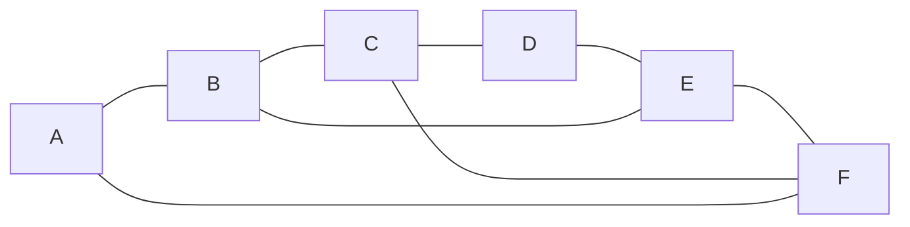
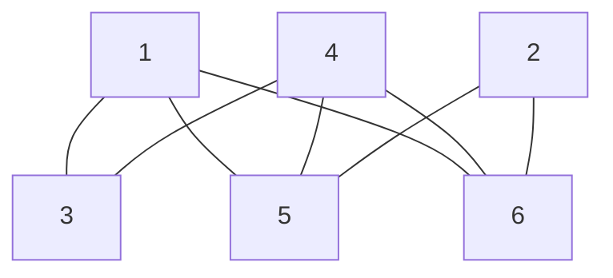

# Graphs: dots joined by lines, the named families, and when two drawings are the same graph

[Syllabus](../../../SYLLABUS.md) → [Combinatorics and graphs](../README.md) → [Graphs - Dots and Lines](../README.md#s09) → Graphs

---

## General Overview

A city runs six stations, A to F, and eight stretches of track. Each stretch joins two stations: A-B, B-C, C-D, D-E, E-F, F-A, and two crossings through the middle, B-E and C-F.

A passenger needs two things from that map: which stations exist, and which pairs are joined. Not the distance in metres, not the bend of the tunnel, not which way is north. A network stripped to those lists is a **graph**.

Friendships, web links, chemical bonds and metro track strip down to the same object, so one set of results covers them all. The cost: one graph can be drawn in ways that look nothing alike. A tourist leaflet numbering the stations 1 to 6 carries the ring diagram's eight lines, and neither drawing says so.

**A graph is a list of dots and a list of joined pairs; position and length are decoration, and two drawings are one graph when the dots of either can be renamed to give the other's pair list.**

**What kind of fact this is:** a definition, plus names for the recurring families; its counting claims are proved in Why it works.

### The picture: the ring map, six stations and eight lines



The ring A-B-C-D-E-F-A carries six lines; B-E and C-F are the crossings.

---

## The formula

Notation first, in words. The dots are **vertices** — one is a vertex — collected as $V$; the lines are **edges**, collected as $E$. Two stations a line joins are **adjacent**, each the other's neighbour. An edge has no order: A-B and B-A name one line. A graph is the two lists:

$$G = (V, E)$$

**Read it aloud:** a graph is a set of stations, plus the station pairs a line joins.

Here $V$ is A to F, $E$ the eight pairs above, and $n$ the number of vertices, six; bars count members, so $\lvert E\rvert$ is 8. One row per station naming its neighbours holds the same map — the **adjacency list**, which the code prints.

An edge is an unordered pair of different stations, so the pairs available are the two-element subsets of $V$, counted by C(6, 2), read "six choose two" ([Combinations, n choose k](../01-Counting%20Principles/05-n-choose-k.md)):

$$\lvert E\rvert \;\le\; C(n, 2) \;=\; \frac{n(n-1)}{2}$$

**Read it aloud:** the lines can never outnumber the pairs of stations, so 15 are possible and the city runs 8.

A renaming $f$ matches the stations of one map one-to-one onto those of the other ([Relations](../../01-Foundations/08-Relations%20and%20Functions/01-relations.md)). It makes them **isomorphic** — "the same graph, differently named" — when

$$u\text{-}v \text{ is an edge of the first} \quad\text{exactly when}\quad f(u)\text{-}f(v) \text{ is an edge of the second}$$

**Read it aloud:** a line must stand in the second map exactly where one stood in the first.

| Symbol | Plain meaning | In our example | Push it up and the answer… |
| --- | --- | --- | --- |
| $G$ | one graph, dots and pairs only | the ring map | — |
| $V$ | the vertices: the dots, here stations | A to F | — |
| $E$ | the edges: the joined pairs | the eight lines | a fuller map |
| $\lvert E\rvert$ | how many lines | 8 | — |
| $n$ | how many vertices | 6 | the ceiling climbs with n squared |
| $C(n, 2)$ | n choose 2: the pairs available | C(6, 2) = 15 | — |
| $u$, $v$ | two stations | A and B | — |
| $f$ | the renaming, station by station | 3 is A, 1 is B, 5 is C, 2 is D, 6 is E, 4 is F | — |

### When it holds

- **Simple: one line per pair, none from a station to itself.** Two tracks from B to C make a **multigraph**, a line from B to B a **loop**; the ceiling of fifteen assumes neither.
- **No direction, and no numbers on the lines.** A line joins A and B both ways and is present or absent: one-way track needs arrows ([Directed graphs](06-directed-graphs-and-topological-order.md)), and adding a cost changes shortest-route answers.
- **Finitely many stations, each named once.** Two names for one station merge its lines and drop the count.

---

## Why it works

### Step 0: sameness has to be a renaming, because names are all there is

A graph carries no geometry: the only data is which pairs are joined, written with the names. So sameness means swapping one name list for the other and finding the pair lists agree, line for line and gap for gap.

### Step 1: how many lines six stations can carry

By listing: A pairs with five others, B with four not yet counted, then three, two, one — fifteen. By formula: six stations each face five others, each pair counted from both ends: 6 × 5 / 2 = 15, which is C(6, 2) = n(n−1)/2. All fifteen joined is the **complete graph** K(6).

### Step 2: the families worth learning by name

- **K(n), complete:** every pair joined, C(n, 2) edges. K(6) has 15.
- **C(n), the cycle:** n vertices in a closed ring, n edges — one number in the brackets, not the two of C(n, 2). C(6), 6.
- **P(n), the path:** n in a row, ends loose, n − 1 edges. P(6), 5.
- **K(m, n), complete bipartite:** two groups, every cross pair joined, none inside a group, m × n edges. K(3, 3), 9.
- **Q(3), the 3-cube:** the 8 corners of a cube, joined when they differ in one coordinate. Each corner has 3 coordinates to flip and each line has two ends: 8 × 3 / 2 = 12 lines, 4 per direction.

A graph whose vertices all meet the same number of lines is **regular**, as Q(3) is; the ring map is not, its tally being 2, 2, 3, 3, 3, 3 ([Degrees and the handshaking lemma](02-degree-and-handshaking.md) counts them properly).

Now place the ring map. Split the stations into A, C, E and B, D, F: all eight lines cross between the groups, none inside either. K(3, 3) holds nine such crossings, so the map is K(3, 3) less one line — the pair left out is A-D.

### Step 3: keeping part of a graph

Throw the two crossings away and 6 lines remain, the ring C(6): keeping some vertices and some edges between them gives a **subgraph**. Now keep B, C, E, F and *every* line between them — B-C, C-F, F-E, E-B, 4 lines, the cycle C(4). The vertices chosen, the edges are forced: the **induced subgraph**.

### Step 4: the tourist leaflet is the same map

The leaflet numbers the stations 1 to 6 and prints 1-3, 1-5, 1-6, 2-5, 2-6, 3-4, 4-5, 4-6.



Stations 1 and 4 both reach 3, 5 and 6; no ring is visible.

One renaming settles it: read 1 as B, 2 as D, 3 as A, 4 as F, 5 as C, 6 as E. The leaflet's lines then read B-A, B-C, B-E, D-C, D-E, A-F, F-C, F-E — the ring map's eight exactly. The search reports 8 of 720 renamings doing it.

<details>
<summary>Detailed proof: exactly eight renamings work, and no others</summary>

Both maps are K(3, 3) less one line, the ring map with groups A, C, E and B, D, F, missing A-D. Each map is in one piece, so the split into two groups with no line inside either can be made only one way: a renaming matches group to group or swaps them. A and D are the only stations on two lines, one per group, and a renaming cannot change how many lines a station meets, so they take the leaflet's two-line stations, 3 and 2. C, E then fill 5, 6 either way, B, F fill 1, 4 either way: four renamings keep the groups, four swap them. Eight.

</details>

### Step 5: a fingerprint says no, never yes

Some counts survive every renaming: the vertices, the edges, the sorted tally of lines per station, the triangles — three stations with all three lines present. Two drawings of one graph agree on all four.

That is a cheap test and a trap. A third map, A-B, A-C, B-C, B-E, C-F, D-E, D-F, E-F, matches the ring map on the first three: 8 lines, the tally 2, 2, 3, 3, 3, 3. But it holds 2 triangles, A-B-C and D-E-F, where the ring map holds 0, and the search over all 720 returns zero. Fingerprints rule a difference out; never sameness in.

A second route stores the graph as a square table of yes-and-no entries and reorders its rows and columns: the adjacency matrix, on [The adjacency matrix](07-adjacency-matrix-and-walk-counting.md).

---

## Worked numbers, by hand

| Step | Arithmetic | Value |
| --- | --- | --- |
| stations, then lines | A to F; A-B B-C C-D D-E E-F F-A B-E C-F | 6 and 8 |
| pairs available, and those with no line | 6 × 5 / 2, then 15 − 8 | 15, and 7 |
| the two groups, and K(3, 3)'s crossings | A, C, E against B, D, F; 3 × 3 | 9, so **A-D** missing |
| drop the crossings; keep B, C, E, F entire | 8 − 2; B-C C-F F-E E-B | 6 = C(6); 4 = C(4) |
| renamings tried, leaflet then third map | all 720, twice | **8**, then **0** |

The leaflet and the ring diagram are one graph; the third map, matching on stations, lines and tally, is not.

### What breaks if you drop a piece

| Mistake | Comes out at | What went wrong |
| --- | --- | --- |
| Same tally read as the same graph | 0 of 720 renamings work | 2 triangles against 0 settles it |
| Assuming every pair is joined | 15 lines, K(6) | The map runs 8 |
| Taking the ring for the map | 6 lines | B-E and C-F are lines too |

The code prints all three.

---

## Code, from first principles, and it actually runs

Nothing is imported. The three maps are plain pair lists. Sameness is answered by two roads sharing no arithmetic: all 720 renamings applied to the pair list, and a fingerprint of lines, tally and triangles. The pairs available come by listing and by formula, the cube's lines by flipping a coordinate and by 8 × 3 / 2.

### Python

```python
# Graphs -- the check behind the card.  Nothing is imported.  Map 1 is the metro
# ring: stations A to F, lines A-B B-C C-D D-E E-F F-A and the crossings B-E and
# C-F.  Map 2 is the tourist map, stations 1 to 6.  Map 3 is a decoy carrying the
# same station count, line count and station-by-station tally as map 1.
NAMES = "ABCDEF"
RING = [(0, 1), (1, 2), (2, 3), (3, 4), (4, 5), (5, 0), (1, 4), (2, 5)]
TOURIST = [(0, 2), (0, 4), (0, 5), (1, 4), (1, 5), (2, 3), (3, 4), (3, 5)]
DECOY = [(0, 1), (0, 2), (1, 2), (1, 4), (2, 5), (3, 4), (3, 5), (4, 5)]
def lines(pairs):                        # each line written once, low end first
    return frozenset(tuple(sorted(p)) for p in pairs)
def perms(items):                        # every renaming, generated here
    if not items:
        yield ()
    for i, x in enumerate(items):
        for rest in perms(items[:i] + items[i + 1:]):
            yield (x,) + rest
def fingerprint(pairs, n=6):             # road two: counts no renaming can change
    E = lines(pairs)
    tally = sorted(sum(v in e for e in E) for v in range(n))
    tri = sum(1 for a in range(n) for b in range(a + 1, n) for c in range(b + 1, n)
              if (a, b) in E and (a, c) in E and (b, c) in E)
    return (len(E), tally, tri)
def renamings(src, dst, n=6):            # road one: try all n! renamings
    target, E = lines(dst), lines(src)
    return sum(1 for p in perms(tuple(range(n)))
               if lines((p[a], p[b]) for a, b in E) == target)

pairs6 = [(a, b) for a in range(6) for b in range(a + 1, 6)]     # listed, not counted
k33 = lines((a, b) for a in (0, 2, 4) for b in (1, 3, 5))        # A C E against B D F
cube = [(u, v) for u in range(8) for v in range(8) if u < v and bin(u ^ v).count("1") == 1]
per_dir = [sum(1 for u, v in cube if u ^ v == 1 << b) for b in range(3)]
ring, inner = lines(RING), {1, 2, 4, 5}
ring_only = ring - {(1, 4), (2, 5)}
induced = frozenset(e for e in ring if e[0] in inner and e[1] in inner)
gap = sorted(k33 - ring)[0]
orders = sum(1 for _ in perms(tuple(range(6))))
f1, f2, f3 = fingerprint(RING), fingerprint(TOURIST), fingerprint(DECOY)
print(f"map 1, the ring: 6 stations, {len(ring)} lines; the adjacency list")
for v in range(6):
    print(f"  {NAMES[v]}: " + " ".join(NAMES[w] for e in sorted(ring) if v in e for w in e if w != v))
print(f"all pairs of 6 stations, listed: {len(pairs6)}; by formula 6 x 5 / 2 = "
      f"{6 * 5 // 2}; map 1 runs {len(ring)}, so {len(pairs6) - len(ring)} pairs have no line")
print(f"named families on 6 stations: K(6) {len(pairs6)} lines, "
      f"C(6) {len(lines((i, (i + 1) % 6) for i in range(6)))}, "
      f"P(6) {len(lines((i, i + 1) for i in range(5)))}, K(3,3) {len(k33)}")
print(f"map 1 is K(3,3) less one line: {len(k33)} - 1 = {len(ring)}; "
      f"the missing pair is {NAMES[gap[0]]}-{NAMES[gap[1]]}")
print(f"the 3-cube Q(3): 8 corners, {len(cube)} lines by flipping one coordinate; by formula 8 x 3 / 2 = {8 * 3 // 2}; {per_dir} in the three directions")
print(f"drop the crossings B-E and C-F: {len(ring_only)} lines left, the ring C(6)")
print(f"keep B C E F and every line between them: {len(induced)} lines, the 4-cycle B-C-F-E-B")
print(f"map 2 onto map 1: {renamings(TOURIST, RING)} of the {orders} renamings work")
print(f"map 3 onto map 1: {renamings(DECOY, RING)} of the {orders} renamings work")
print(f"lines and tally: map 1 {f1[0]} {f1[1]}, map 2 {f2[0]} {f2[1]}, map 3 {f3[0]} {f3[1]}")
print(f"triangles: map 1 {f1[2]}, map 2 {f2[2]}, map 3 {f3[2]}")
assert len(pairs6) == 6 * 5 // 2 and len(cube) == 8 * 3 // 2 and per_dir == [4, 4, 4]
assert ring == k33 - {(0, 3)} and ring_only == lines((i, (i + 1) % 6) for i in range(6))
assert induced == frozenset({(1, 2), (1, 4), (2, 5), (4, 5)}) and renamings(TOURIST, RING) == 8
assert f2 == f1 and f3 != f1 and renamings(DECOY, RING) == 0
print("ALL CHECKS PASS")
```

**Ran 2026-09-19 on macOS, Python 3.14.6, standard library only. All checks passed. Output, pasted from the run:**

```
map 1, the ring: 6 stations, 8 lines; the adjacency list
  A: B F
  B: A C E
  C: B D F
  D: C E
  E: B D F
  F: A C E
all pairs of 6 stations, listed: 15; by formula 6 x 5 / 2 = 15; map 1 runs 8, so 7 pairs have no line
named families on 6 stations: K(6) 15 lines, C(6) 6, P(6) 5, K(3,3) 9
map 1 is K(3,3) less one line: 9 - 1 = 8; the missing pair is A-D
the 3-cube Q(3): 8 corners, 12 lines by flipping one coordinate; by formula 8 x 3 / 2 = 12; [4, 4, 4] in the three directions
drop the crossings B-E and C-F: 6 lines left, the ring C(6)
keep B C E F and every line between them: 4 lines, the 4-cycle B-C-F-E-B
map 2 onto map 1: 8 of the 720 renamings work
map 3 onto map 1: 0 of the 720 renamings work
lines and tally: map 1 8 [2, 2, 3, 3, 3, 3], map 2 8 [2, 2, 3, 3, 3, 3], map 3 8 [2, 2, 3, 3, 3, 3]
triangles: map 1 0, map 2 0, map 3 2
ALL CHECKS PASS
```

### Rust

Same numbers, same labels, built with `rustc --edition 2021 -O`.

```rust
// Graphs -- the same check as the Python, in Rust.  No crates.  Map 1 is the metro
// ring: stations A to F, lines A-B B-C C-D D-E E-F F-A and the crossings B-E and
// C-F.  Map 2 is the tourist map, stations 1 to 6.  Map 3 is a decoy carrying the
// same station count, line count and station-by-station tally as map 1.
const NAMES: [char; 6] = ['A', 'B', 'C', 'D', 'E', 'F'];
const RING: [(usize, usize); 8] = [(0, 1), (1, 2), (2, 3), (3, 4), (4, 5), (5, 0), (1, 4), (2, 5)];
const TOURIST: [(usize, usize); 8] = [(0, 2), (0, 4), (0, 5), (1, 4), (1, 5), (2, 3), (3, 4), (3, 5)];
const DECOY: [(usize, usize); 8] = [(0, 1), (0, 2), (1, 2), (1, 4), (2, 5), (3, 4), (3, 5), (4, 5)];
fn lines(pairs: &[(usize, usize)]) -> Vec<(usize, usize)> {   // each line once, low end first
    let mut out: Vec<(usize, usize)> = pairs.iter().map(|&(a, b)| if a < b { (a, b) } else { (b, a) }).collect();
    out.sort(); out.dedup(); out
}
fn perms(items: &[usize]) -> Vec<Vec<usize>> {                // every renaming, generated here
    if items.is_empty() { return vec![Vec::new()] }
    let mut out: Vec<Vec<usize>> = Vec::new();
    for (i, &x) in items.iter().enumerate() {
        let mut rest = items.to_vec(); rest.remove(i);
        for mut p in perms(&rest) { p.insert(0, x); out.push(p) }
    }
    out
}
fn fingerprint(pairs: &[(usize, usize)], n: usize) -> (usize, Vec<usize>, usize) {
    let e = lines(pairs);                        // road two: counts no renaming can change
    let mut tally: Vec<usize> = (0..n).map(|v| e.iter().filter(|&&(a, b)| a == v || b == v).count()).collect();
    tally.sort();
    let mut tri = 0;
    for a in 0..n { for b in a + 1..n { for c in b + 1..n {
        if e.contains(&(a, b)) && e.contains(&(a, c)) && e.contains(&(b, c)) { tri += 1 }
    }}}
    (e.len(), tally, tri)
}
fn renamings(src: &[(usize, usize)], dst: &[(usize, usize)], n: usize) -> usize {
    let (target, e) = (lines(dst), lines(src));  // road one: try all n! renamings
    perms(&(0..n).collect::<Vec<usize>>()).iter()
        .filter(|p| lines(&e.iter().map(|&(a, b)| (p[a], p[b])).collect::<Vec<_>>()) == target)
        .count()
}
fn main() {
    let pairs6: Vec<(usize, usize)> = (0..6).flat_map(|a| (a + 1..6).map(move |b| (a, b))).collect();
    let k33 = lines(&[0usize, 2, 4].iter()                    // A C E against B D F
        .flat_map(|&a| [1usize, 3, 5].iter().map(move |&b| (a, b))).collect::<Vec<_>>());
    let cube: Vec<(usize, usize)> = (0..8usize).flat_map(|u| (u + 1..8).map(move |v| (u, v)))
        .filter(|&(u, v)| (u ^ v).count_ones() == 1).collect();
    let per_dir: Vec<usize> = (0..3).map(|b| cube.iter().filter(|&&(u, v)| u ^ v == 1 << b).count()).collect();
    let (ring, inner) = (lines(&RING), [1usize, 2, 4, 5]);
    let cycle6 = lines(&(0..6).map(|i| (i, (i + 1) % 6)).collect::<Vec<_>>());
    let path6 = lines(&(0..5).map(|i| (i, i + 1)).collect::<Vec<_>>());
    let ring_only: Vec<(usize, usize)> = ring.iter().copied().filter(|&e| e != (1, 4) && e != (2, 5)).collect();
    let induced: Vec<(usize, usize)> = ring.iter().copied().filter(|&(a, b)| inner.contains(&a) && inner.contains(&b)).collect();
    let gap = *k33.iter().find(|e| !ring.contains(e)).unwrap();
    let orders = perms(&(0..6).collect::<Vec<usize>>()).len();
    let (f1, f2, f3) = (fingerprint(&RING, 6), fingerprint(&TOURIST, 6), fingerprint(&DECOY, 6));
    println!("map 1, the ring: 6 stations, {} lines; the adjacency list", ring.len());
    for v in 0..6 {
        let nb: Vec<String> = ring.iter().filter(|&&(a, b)| a == v || b == v)
            .map(|&(a, b)| NAMES[if a == v { b } else { a }].to_string()).collect();
        println!("  {}: {}", NAMES[v], nb.join(" "));
    }
    println!("all pairs of 6 stations, listed: {}; by formula 6 x 5 / 2 = {}; map 1 runs {}, so {} pairs have no line",
             pairs6.len(), 6 * 5 / 2, ring.len(), pairs6.len() - ring.len());
    println!("named families on 6 stations: K(6) {} lines, C(6) {}, P(6) {}, K(3,3) {}",
             pairs6.len(), cycle6.len(), path6.len(), k33.len());
    println!("map 1 is K(3,3) less one line: {} - 1 = {}; the missing pair is {}-{}",
             k33.len(), ring.len(), NAMES[gap.0], NAMES[gap.1]);
    println!("the 3-cube Q(3): 8 corners, {} lines by flipping one coordinate; by formula 8 x 3 / 2 = {}; {:?} in the three directions", cube.len(), 8 * 3 / 2, per_dir);
    println!("drop the crossings B-E and C-F: {} lines left, the ring C(6)", ring_only.len());
    println!("keep B C E F and every line between them: {} lines, the 4-cycle B-C-F-E-B", induced.len());
    println!("map 2 onto map 1: {} of the {} renamings work", renamings(&TOURIST, &RING, 6), orders);
    println!("map 3 onto map 1: {} of the {} renamings work", renamings(&DECOY, &RING, 6), orders);
    println!("lines and tally: map 1 {} {:?}, map 2 {} {:?}, map 3 {} {:?}",
             f1.0, f1.1, f2.0, f2.1, f3.0, f3.1);
    println!("triangles: map 1 {}, map 2 {}, map 3 {}", f1.2, f2.2, f3.2);
    assert!(pairs6.len() == 6 * 5 / 2 && cube.len() == 8 * 3 / 2 && per_dir == vec![4, 4, 4]);
    assert!(ring == k33.iter().copied().filter(|&e| e != (0, 3)).collect::<Vec<_>>() && ring_only == cycle6);
    assert!(induced == vec![(1, 2), (1, 4), (2, 5), (4, 5)] && renamings(&TOURIST, &RING, 6) == 8);
    assert!(f2 == f1 && f3 != f1 && renamings(&DECOY, &RING, 6) == 0);
    println!("ALL CHECKS PASS");
}
```

**Ran 2026-09-19 on macOS, rustc 1.98.1, no crates. All checks passed. Output, pasted from the run:**

```
map 1, the ring: 6 stations, 8 lines; the adjacency list
  A: B F
  B: A C E
  C: B D F
  D: C E
  E: B D F
  F: A C E
all pairs of 6 stations, listed: 15; by formula 6 x 5 / 2 = 15; map 1 runs 8, so 7 pairs have no line
named families on 6 stations: K(6) 15 lines, C(6) 6, P(6) 5, K(3,3) 9
map 1 is K(3,3) less one line: 9 - 1 = 8; the missing pair is A-D
the 3-cube Q(3): 8 corners, 12 lines by flipping one coordinate; by formula 8 x 3 / 2 = 12; [4, 4, 4] in the three directions
drop the crossings B-E and C-F: 6 lines left, the ring C(6)
keep B C E F and every line between them: 4 lines, the 4-cycle B-C-F-E-B
map 2 onto map 1: 8 of the 720 renamings work
map 3 onto map 1: 0 of the 720 renamings work
lines and tally: map 1 8 [2, 2, 3, 3, 3, 3], map 2 8 [2, 2, 3, 3, 3, 3], map 3 8 [2, 2, 3, 3, 3, 3]
triangles: map 1 0, map 2 0, map 3 2
ALL CHECKS PASS
```

The two outputs match line for line.

> [!TIP]
> **Try changing**
> Guess first, then run it. The asserts are pinned to these three maps, so expect one to stop the program.
> - **Cut a crossing.** Delete `(1, 4)` from `RING`: seven lines, K(3, 3) less two; the second assert stops it.
> - **Break the leaflet.** Change `(0, 2)` to `(0, 3)` in `TOURIST`: a different graph, and the count falls from 8 to 0.
> - **Give the decoy a chance.** Set `DECOY` to `TOURIST`: 8 renamings work and the fingerprints agree.

---

## The usual mistake

> [!warning]
> **Reading the same station-by-station tally as the same graph.** The third map carries the ring map's 8 lines and its tally 2, 2, 3, 3, 3, 3, and is a different graph: 2 triangles against 0, and 0 of 720 renamings work. A tally narrows the field; only a renaming decides.
>
> - **Treating a drawing as the graph.** The ring diagram and the leaflet look unrelated and are one graph; crossings on paper are no property of it.
> - **Assuming a graph joins every pair.** That is K(6), 15 lines; the city runs 8.
> - **Calling every kept-vertex picture induced.** B, C, E, F with only B-C and E-F is a subgraph; induced keeps all 4 lines between them.

---

## Where you meet it in real life

- **Timetables and routing.** A rail network is stored as the adjacency list this card prints ([Walks, paths and cycles](03-walks-paths-and-cycles.md)).
- **Chemistry.** Molecules with one formula but different bonding are different graphs on the same atoms, so database search is isomorphism testing.
- **Chip layout.** Checking a layout against its schematic is an isomorphism test. Tasks as vertices and clashes as edges asks how few groups dodge them all ([Colouring](../12-Planarity%20and%20Colouring/03-vertex-colouring-and-chromatic-number.md)).

> **Say it back**
> A graph is two lists: the vertices, the dots, and the edges, the pairs joined by a line. Six stations carry at most C(6, 2) = 15 lines; the metro map runs 8 and is K(3, 3) less one line. Keep some stations and some lines for a subgraph, every line between them for the induced one. Two drawings are one graph when renaming either's stations gives the other's line list — 8 of 720 renamings do it here.

---

## What this builds on

- [Combinations, n choose k](../01-Counting%20Principles/05-n-choose-k.md): the count C(6, 2) = 15 of available pairs.
- [Relations](../../01-Foundations/08-Relations%20and%20Functions/01-relations.md): joined pairs form a relation; a renaming is a function one-to-one and onto.
- [Ordered pairs and the Cartesian product](../../01-Foundations/07-Sets/05-ordered-pairs-and-cartesian-product.md): why an edge is an unordered pair.

## Where this goes next

- [Degrees and the handshaking lemma](02-degree-and-handshaking.md): the tally sums to twice the line count.
- [Walks, paths and cycles](03-walks-paths-and-cycles.md): travelling the lines, not listing them.
- [Colouring](../12-Planarity%20and%20Colouring/03-vertex-colouring-and-chromatic-number.md): how few groups leave no line inside a group.
- [Friends and strangers](../14-Ramsey%20and%20Extremal%2C%20in%20Outline/01-friends-and-strangers.md): six vertices force three all joined or three all unjoined.
- [Random graphs](../../09-Probability%20and%20statistics/14-Random%20Graphs%20and%20the%20Probabilistic%20Method/01-random-graphs-erdos-renyi.md): which pairs get a line, chosen at random.
- Small worlds and hubs: the tallies real networks show.
- Vietoris-Rips, Cech and alpha complexes: joining nearby data points, then filling triangles.
- Graph isomorphism: how hard sameness is when renamings cannot all be tried.

Every renaming was tried here; a real network has far too many, and cutting that search down is what this shelf opens.

---

## Sources

Verified 19 Sep 2026: every link below resolves to the publisher's page.

- Diestel, Reinhard. *Graph Theory*, 6th ed. Springer GTM 173, 2025. [Book site, main text free to read online](https://diestel-graph-theory.com/). Chapter 1: vertices, edges, subgraphs, isomorphism.
- Euler, Leonhard. "Solutio problematis ad geometriam situs pertinentis." *Commentarii academiae scientiarum Petropolitanae* 8 (1741). [Euler Archive](https://scholarlycommons.pacific.edu/euler-works/53/). The Königsberg bridges: a map first stripped to its connections.
- Babai, László. "Graph Isomorphism in Quasipolynomial Time." 2015. [arXiv:1512.03547](https://arxiv.org/abs/1512.03547). The best known bound on deciding sameness.
- *Contemporary Mathematics*, section 12.1, "Graph Basics." OpenStax. [Textbook page](https://openstax.org/books/contemporary-mathematics/pages/12-1-graph-basics). A free treatment of the vocabulary.
