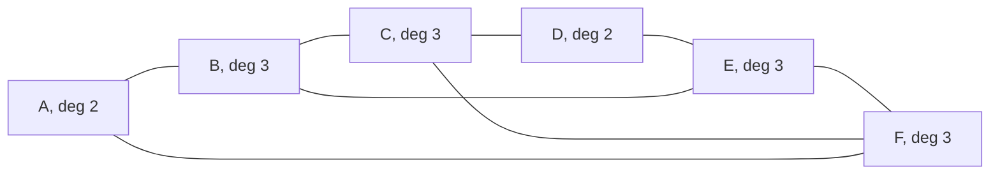

# Degrees and the handshaking lemma: the degrees add to twice the edges, so the odd-degree vertices come in pairs

[Syllabus](../../../SYLLABUS.md) → [Combinatorics and graphs](../../../SYLLABUS.md#w04) → [Graphs - Dots and Lines](../../../SYLLABUS.md#w04-s09) → Degrees and the handshaking lemma

---

## General Overview

Nine people leave a party. Each is asked how many of the others they shook hands with, and each says three. At least one answer is wrong: add them and 9 × 3 = 27. Every handshake was reported twice, so the answers total twice the handshakes. Twice anything is even. 27 is odd.

Parties are incidental. In any network of dots joined by lines — vertices and edges, in the standard words ([Graphs](01-graphs-vertices-and-edges.md)) — the count of line-ends meeting a dot is its **degree**, and the degrees add to twice the line count, each line counted at both ends. This shelf's standing example is a six-station metro map: A to F, eight lines, degrees 2, 3, 3, 2, 3, 3, adding to 16 = 2 × 8.

The leftover earns its keep: odd-degree dots cannot themselves be odd in number, so no network has exactly three. The metro has four.

**The degrees add to twice the line count, because each line is counted at both ends, so the odd-degree dots come in pairs.**

**What kind of fact this is:** a theorem, proved on this card in Why it works; the degree and the degree sequence are definitions.

### The picture: the metro, station by station



A and D sit on the ring only; B, C, E and F each carry a crossing too.

---

## The formula

Notation first. The degree of a vertex $v$ is written $\deg(v)$, read "the degree of v". A **loop**, a line from a station back to itself, lays both ends there, adding two. The degrees largest first are the **degree sequence**, here 3, 3, 3, 3, 2, 2. Bars count a set's members, so $\lvert E\rvert$ is the line count, 8. A capital sigma says "add one term per item listed underneath", here every vertex $v$.

$$\deg(A) + \deg(B) + \cdots + \deg(F) \;=\; 2\lvert E\rvert, \qquad\text{that is}\qquad \sum_{v \in V} \deg(v) \;=\; 2\lvert E\rvert$$

**Read it aloud:** add up how many line-ends meet each vertex, and the total is two for every line.

| Symbol | Plain meaning | In our example | Push it up and the answer… |
| --- | --- | --- | --- |
| $V$ | the dots, stations here | A to F | more terms |
| $E$ | the lines, as pairs | eight | — |
| $\lvert E\rvert$ | how many lines | 8 | total up by 2 |
| $v$ | one vertex of $V$ | B | — |
| $\deg(v)$ | line-ends at $v$; loop 2 | deg(B) = 3 | bigger total |
| $\sum_{v \in V}$ | one term per vertex | six terms | — |
| $n$ | how many dots | 6 | average falls |

Shared out, that total is the average degree, $2\lvert E\rvert$ over $n$: 16 / 6 = 2.67 per station, a figure none has.

### When it holds

- **Finitely many dots and lines.** Both sides are counts; with infinitely many, nothing to compare.
- **A loop adds two, and parallel lines count separately.** Either shortcut breaks the count: scored as one end, a loop at A makes the metro read 17 for nine lines, odd.
- **No arrows.** Tails add to the arrow count and heads add to it separately: two identities, not this one ([Directed graphs](06-directed-graphs-and-topological-order.md)).

---

## Why it works

### Step 0: count one pile two ways

Every line has exactly two ends. Lay a token on each: the metro's eight lines put sixteen tokens on the map, no more and no fewer. The proof gathers that one pile twice, grouping it differently each time — double counting ([Bijections and double counting](../02-Repeats%2C%20Groups%20and%20Double%20Counting/05-bijection-and-double-counting.md)).

### Step 1: gather the tokens station by station

Sweep up the tokens at A: two, from A-B and F-A. At B, three; at C, three; at D, two; at E and F, three each. Grouped this way the pile is the sum of the degrees. Sixteen.

### Step 2: gather the tokens line by line

Sweep by line instead. Each line surrenders two tokens, one per end, a loop both at one station. Eight lines, sixteen tokens, so the pile is 2 times $\lvert E\rvert$ — and one pile means the two expressions are equal. As a grid, one object read twice:

```
          A-B  B-C  C-D  D-E  E-F  F-A  B-E  C-F    ends
  A         1    0    0    0    0    1    0    0       2
  B         1    1    0    0    0    0    1    0       3
  C         0    1    1    0    0    0    0    1       3
  D         0    0    1    1    0    0    0    0       2
  E         0    0    0    1    1    0    1    0       3
  F         0    0    0    0    1    1    0    1       3
  ends      2    2    2    2    2    2    2    2      16
```

A 1 marks a line ending there. Row totals are the degrees, read across; every column total is 2, read down.

### Step 3: the odd-degree stations come in pairs

Split the vertices by parity of degree. The even degrees add to an even number and the whole total is even, so the odd degrees add to an even number too. But odd numbers add to an even result only for an even count of them ([Even and odd](../../02-Number%20theory/01-Divisibility%20and%20Primes/02-even-and-odd.md)). So the odd-degree vertices number 0, 2, 4, never 1, 3 or 5.

<details>
<summary>Detailed proof, written out</summary>

Let $V$ and $E$ be finite, and form one collection: every pair of a vertex and an end of an edge lying at it, a loop contributing two. Grouped by vertex, the group at $v$ holds $\deg(v)$ members, so the size is $\sum_{v \in V} \deg(v)$; grouped by edge, each group holds two, so the size is $2\lvert E\rvert$, and two counts of one collection are equal. The odd-degree vertices, set apart, have degrees adding to $2\lvert E\rvert$ less the even degrees, both even; a sum of odd numbers is even only for an even count of them. No step used connectedness or any drawing.

</details>

### Step 4: what the identity refuses

Read backwards it is a veto. Nine people each shaking three hands need a degree total of 27, not twice any whole number, so no such network exists — and no arrangement helps, since none was assumed. Four hands each gives 36, twice 18: possible, with 18 handshakes. When every degree is the same — a **regular** network — that degree times the vertex count must be even: none has five stations each meeting three lines.

All 64 networks on four named stations satisfy the identity: 8 with no odd station, 48 with two, 8 with four.

<details>
<summary>Havel-Hakimi: when a wished-for degree list can be built</summary>

An even total is required and is not enough. Those 64 networks show only 11 degree sequences between them, and 3, 3, 3, 1 — total 10 — is not one. A list some network does realise is **graphic**, the word the code prints.

The test, from Havel and Hakimi, serves the hungriest dot first and never returns to it. Sort the wish largest first; if every entry is 0 it is built. Otherwise zero the largest entry and subtract 1 from that many of the next entries — the hungriest dot joining the next hungriest. Run out, or hit an entry already at 0, and no network exists. On 3, 3, 3, 1 the first dot joins the other three, leaving 2, 2, 0; the next wants two partners and only one dot is still hungry, so it fails. No census is needed, at any size.

</details>

A second route adds the lines one at a time: with none the total is 0, and each new line raises two degrees by one, or one by two for a loop. It is Step 2 in other clothes, a new line a new column.

---

## Worked numbers, by hand

| Step | Arithmetic | Value |
| --- | --- | --- |
| the degrees | read off the map | 2, 3, 3, 2, 3, 3 |
| the degree sequence | the same six, sorted | 3, 3, 3, 3, 2, 2 |
| road one, the degrees added | 2 + 3 + 3 + 2 + 3 + 3 | **16** |
| road two, two ends a line | 2 × 8 | **16** |
| average per station | 16 / 6 | 2.67 |
| the odd-degree stations | B, C, E, F | **4**, even |
| nine people, three hands | 9 × 3 | **27**, odd: impossible |
| nine people, four hands | 9 × 4, halved | **18** handshakes |

Sixteen line-ends, eight lines: the metro's numbers are the identity itself. The party's is a refusal, since no whole number doubles to 27.

### What breaks if you drop a piece

| Mistake | Comes out at | What went wrong |
| --- | --- | --- |
| A line counted once, not at both ends | 8, not 16 | A line ends at two stations |
| A loop at A scored as one end | 17 for nine lines, odd | Both ends are at A; truth 18 |
| A second B-C track merged in | 16 for nine lines | Each track has two ends; truth 18 |

The code prints all three.

---

## Code, from first principles, and it actually runs

Nothing is imported. The degree total is reached twice by roads sharing no arithmetic: one walks the line list raising a counter at each end, the other adds the station-by-line grid down its columns. A census then tests the identity on all 64 networks on four named stations and collects the degree sequences they show, settling 3, 3, 3, 1 without Havel-Hakimi. Havel-Hakimi builds or refuses four wished-for lists, the first road recomputing the degrees of whatever it builds.

### Python

```python
# Degrees and the handshaking lemma -- the check behind the card.  Nothing is imported.
# The metro map is stations A to F, lines A-B B-C C-D D-E E-F F-A and the crossings B-E
# and C-F.  The degree total is reached twice: the ends tallied station by station, and
# the station-by-line table added down its columns.  A census of all 64 graphs on four
# named stations tests parity and lists their degree sequences; then Havel-Hakimi runs.
NAMES = "ABCDEF"
METRO = [(0, 1), (1, 2), (2, 3), (3, 4), (4, 5), (5, 0), (1, 4), (2, 5)]
WISHES = [[3, 3, 3, 3, 2, 2], [3, 3, 3, 1], [3, 3, 3], [4] * 9]
LOOPED, DOUBLED = METRO + [(0, 0)], METRO + [(1, 2)]
def degrees(n, edges):                   # road one: the ends met at each station
    deg = [0] * n
    for u, v in edges:                   # a loop has u == v, so it adds two ends
        deg[u] += 1
        deg[v] += 1
    return deg
def havel_hakimi(wish):                  # build a graph for the list, or give up
    left, built = [[d, i] for i, d in enumerate(wish)], []
    while True:
        left.sort(key=lambda p: (-p[0], p[1]))
        if left[0][0] == 0:
            return built
        d, v = left[0]
        left[0][0] = 0                   # the greediest station is now served
        if d >= len(left) or any(p[0] == 0 for p in left[1:d + 1]):
            return None
        for p in left[1:d + 1]:
            p[0] -= 1
            built.append((v, p[1]))
def yn(claim): return "yes" if claim else "no"
deg = degrees(6, METRO)
t = [[(u == s) + (v == s) for u, v in METRO] for s in range(6)]   # road two: the table
rows, cols = [sum(r) for r in t], [sum(c) for c in zip(*t)]
odd = [NAMES[i] for i, d in enumerate(deg) if d % 2]
pairs4, dist, census, seqs = [(a, b) for a in range(4) for b in range(a + 1, 4)], [0] * 5, True, set()
for mask in range(1 << len(pairs4)):     # every graph on four named stations, all 64 of them
    dg = degrees(4, [p for i, p in enumerate(pairs4) if mask >> i & 1])
    census = census and sum(dg) == 2 * bin(mask).count("1")
    dist[sum(d % 2 for d in dg)] += 1; seqs.add(tuple(sorted(dg, reverse=True)))
hh = [havel_hakimi(w) for w in WISHES]
graphic = [b is not None and sorted(degrees(len(w), b), reverse=True) == w for w, b in zip(WISHES, hh)]
looped, doubled = degrees(6, LOOPED), degrees(6, DOUBLED)
print(f"the metro: 6 stations, {len(METRO)} lines\n  " + "   ".join(f"{NAMES[i]} deg {d}" for i, d in enumerate(deg)))
print(f"degree sequence, largest first: {sorted(deg, reverse=True)}")
print(f"road 1, the ends tallied at each station and added: {sum(deg)}; average per station {sum(deg)} / 6 = {sum(deg) / 6:.2f}")
print("road 2, the station-by-line table, a 1 where a line ends at a station: " + "  ".join(NAMES[s] + " " + "".join(str(x) for x in t[s]) for s in range(6)) + f"; columns add to {cols} = {sum(cols)}; rows add to the degrees: {yn(rows == deg)}")
print(f"odd-degree stations: {' '.join(odd)}, {len(odd)} of them; an even count: {yn(len(odd) % 2 == 0)}")
print(f"all {1 << len(pairs4)} graphs on four named stations: degree total = 2 x lines every time: {yn(census)}; {len(seqs)} degree sequences appear, (3, 3, 2, 2) among them and (3, 3, 3, 1) not: {yn((3, 3, 2, 2) in seqs and (3, 3, 3, 1) not in seqs)}")
print("odd-station counts, and how many graphs each: " + ", ".join(f"{k} -> {c}" for k, c in enumerate(dist) if c) + f"; never 1 or 3: {yn(dist[1] == 0 and dist[3] == 0)}")
print(f"party of 9 each shaking 3 hands: 9 x 3 = {9 * 3}, odd, so no such party\nparty of 9 each shaking 4 hands: 9 x 4 = {9 * 4} = 2 x {9 * 4 // 2} handshakes, so possible")
print("Havel-Hakimi on wished-for degree lists:")
for w, b, g in zip(WISHES, hh, graphic):
    print(f"  {w} sum {sum(w)} even {yn(sum(w) % 2 == 0)}  graphic {yn(g)}" + (f"  built {len(b)} lines" if g else ""))
print(f"mistake 1, each line counted once, not at both ends: {len(METRO)}, not {sum(deg)}")
print(f"mistake 2, a loop at A counted as one end: {sum(looped) - 1} for {len(LOOPED)} lines, odd; the truth is {sum(looped)}\nmistake 3, the second B-C track merged away: {sum(deg)} for {len(DOUBLED)} lines; the truth is {sum(doubled)}")
assert rows == deg and cols == [2] * len(METRO) and sum(cols) == sum(deg)
assert sorted(deg, reverse=True) == [3, 3, 3, 3, 2, 2] and odd == ["B", "C", "E", "F"]
assert census and dist == [8, 0, 48, 0, 8] and len(seqs) == 11 and (3, 3, 2, 2) in seqs and (3, 3, 3, 1) not in seqs
assert graphic == [True, False, False, True] and sum(looped) == 2 * len(LOOPED) and sum(doubled) == 2 * len(DOUBLED)
print("ALL CHECKS PASS")
```

**Ran 2026-09-19 on macOS, Python 3.14.6, standard library only. All checks passed. Output, pasted from the run:**

```
the metro: 6 stations, 8 lines
  A deg 2   B deg 3   C deg 3   D deg 2   E deg 3   F deg 3
degree sequence, largest first: [3, 3, 3, 3, 2, 2]
road 1, the ends tallied at each station and added: 16; average per station 16 / 6 = 2.67
road 2, the station-by-line table, a 1 where a line ends at a station: A 10000100  B 11000010  C 01100001  D 00110000  E 00011010  F 00001101; columns add to [2, 2, 2, 2, 2, 2, 2, 2] = 16; rows add to the degrees: yes
odd-degree stations: B C E F, 4 of them; an even count: yes
all 64 graphs on four named stations: degree total = 2 x lines every time: yes; 11 degree sequences appear, (3, 3, 2, 2) among them and (3, 3, 3, 1) not: yes
odd-station counts, and how many graphs each: 0 -> 8, 2 -> 48, 4 -> 8; never 1 or 3: yes
party of 9 each shaking 3 hands: 9 x 3 = 27, odd, so no such party
party of 9 each shaking 4 hands: 9 x 4 = 36 = 2 x 18 handshakes, so possible
Havel-Hakimi on wished-for degree lists:
  [3, 3, 3, 3, 2, 2] sum 16 even yes  graphic yes  built 8 lines
  [3, 3, 3, 1] sum 10 even yes  graphic no
  [3, 3, 3] sum 9 even no  graphic no
  [4, 4, 4, 4, 4, 4, 4, 4, 4] sum 36 even yes  graphic yes  built 18 lines
mistake 1, each line counted once, not at both ends: 8, not 16
mistake 2, a loop at A counted as one end: 17 for 9 lines, odd; the truth is 18
mistake 3, the second B-C track merged away: 16 for 9 lines; the truth is 18
ALL CHECKS PASS
```

### Rust

Same numbers, same labels, built with `rustc --edition 2021 -O`.

```rust
// Degrees and the handshaking lemma -- the same check as the Python, in Rust.  No crates.
// The metro map is stations A to F, lines A-B B-C C-D D-E E-F F-A and the crossings B-E
// and C-F.  The degree total is reached twice: the ends tallied station by station, and
// the station-by-line table added down its columns.  A census of all 64 graphs on four
// named stations tests parity and lists their degree sequences; then Havel-Hakimi runs.
const NAMES: [char; 6] = ['A', 'B', 'C', 'D', 'E', 'F'];
const METRO: [(usize, usize); 8] = [(0, 1), (1, 2), (2, 3), (3, 4), (4, 5), (5, 0), (1, 4), (2, 5)];
fn degrees(n: usize, edges: &[(usize, usize)]) -> Vec<i64> {   // road one: ends per station
    let mut deg = vec![0i64; n];
    for &(u, v) in edges { deg[u] += 1; deg[v] += 1 }           // a loop has u == v: two ends
    deg
}
fn desc(deg: &[i64]) -> Vec<i64> { let mut s = deg.to_vec(); s.sort_by(|a, b| b.cmp(a)); s }
fn havel_hakimi(wish: &[i64]) -> Option<Vec<(usize, usize)>> {  // a graph, or give up
    let mut left: Vec<(i64, usize)> = wish.iter().enumerate().map(|(i, &d)| (d, i)).collect();
    let mut built: Vec<(usize, usize)> = Vec::new();
    loop {
        left.sort_by_key(|&(d, i)| (-d, i));
        if left[0].0 == 0 { return Some(built) }
        let (d, v) = (left[0].0 as usize, left[0].1);
        left[0].0 = 0;                                          // the greediest is now served
        if d >= left.len() || left[1..=d].iter().any(|p| p.0 == 0) { return None }
        for p in left[1..=d].iter_mut() { p.0 -= 1; built.push((v, p.1)) }
    }
}
fn yn(claim: bool) -> &'static str { if claim { "yes" } else { "no" } }
fn main() {
    let wishes: Vec<Vec<i64>> = vec![vec![3, 3, 3, 3, 2, 2], vec![3, 3, 3, 1], vec![3, 3, 3], vec![4; 9]];
    let looped_e: Vec<(usize, usize)> = METRO.iter().copied().chain([(0, 0)]).collect();
    let doubled_e: Vec<(usize, usize)> = METRO.iter().copied().chain([(1, 2)]).collect();
    let deg = degrees(6, &METRO);
    let t: Vec<Vec<i64>> = (0..6).map(|s| METRO.iter()             // road two: the table
        .map(|&(u, v)| (u == s) as i64 + (v == s) as i64).collect()).collect();
    let rows: Vec<i64> = t.iter().map(|r| r.iter().sum()).collect();
    let cols: Vec<i64> = (0..METRO.len()).map(|j| t.iter().map(|r| r[j]).sum()).collect();
    let odd: Vec<String> = (0..6).filter(|&i| deg[i] % 2 == 1).map(|i| NAMES[i].to_string()).collect();
    let pairs4: Vec<(usize, usize)> = (0..4).flat_map(|a| (a + 1..4).map(move |b| (a, b))).collect();
    let (mut dist, mut census, mut seqs) = ([0usize; 5], true, Vec::<Vec<i64>>::new());
    for mask in 0..(1u32 << pairs4.len()) {   // every graph on four named stations, all 64 of them
        let es: Vec<(usize, usize)> = (0..pairs4.len()).filter(|i| mask >> i & 1 == 1).map(|i| pairs4[i]).collect();
        let dg = degrees(4, &es);
        census = census && dg.iter().sum::<i64>() == 2 * mask.count_ones() as i64;
        dist[dg.iter().filter(|d| *d % 2 == 1).count()] += 1; if !seqs.contains(&desc(&dg)) { seqs.push(desc(&dg)) }
    }
    let hh: Vec<Option<Vec<(usize, usize)>>> = wishes.iter().map(|w| havel_hakimi(w)).collect();
    let graphic: Vec<bool> = wishes.iter().zip(&hh)
        .map(|(w, b)| b.as_ref().map_or(false, |e| desc(&degrees(w.len(), e)) == *w)).collect();
    let (looped, doubled) = (degrees(6, &looped_e), degrees(6, &doubled_e));
    let total: i64 = deg.iter().sum();
    println!("the metro: 6 stations, {} lines\n  {}", METRO.len(),
             (0..6).map(|i| format!("{} deg {}", NAMES[i], deg[i])).collect::<Vec<_>>().join("   "));
    println!("degree sequence, largest first: {:?}", desc(&deg));
    println!("road 1, the ends tallied at each station and added: {}; average per station {} / 6 = {:.2}", total, total, total as f64 / 6.0);
    println!("road 2, the station-by-line table, a 1 where a line ends at a station: {}; columns add to {:?} = {}; rows add to the degrees: {}",
             (0..6).map(|s| format!("{} {}", NAMES[s], t[s].iter().map(|x| x.to_string()).collect::<String>())).collect::<Vec<_>>().join("  "),
             cols, cols.iter().sum::<i64>(), yn(rows == deg));
    println!("odd-degree stations: {}, {} of them; an even count: {}", odd.join(" "), odd.len(), yn(odd.len() % 2 == 0));
    println!("all {} graphs on four named stations: degree total = 2 x lines every time: {}; {} degree sequences appear, (3, 3, 2, 2) among them and (3, 3, 3, 1) not: {}", 1 << pairs4.len(), yn(census), seqs.len(), yn(seqs.contains(&vec![3, 3, 2, 2]) && !seqs.contains(&vec![3, 3, 3, 1])));
    println!("odd-station counts, and how many graphs each: {}; never 1 or 3: {}",
             (0..5).filter(|&k| dist[k] > 0).map(|k| format!("{} -> {}", k, dist[k])).collect::<Vec<_>>().join(", "),
             yn(dist[1] == 0 && dist[3] == 0));
    println!("party of 9 each shaking 3 hands: 9 x 3 = {}, odd, so no such party\nparty of 9 each shaking 4 hands: 9 x 4 = {} = 2 x {} handshakes, so possible", 9 * 3, 9 * 4, 9 * 4 / 2);
    println!("Havel-Hakimi on wished-for degree lists:");
    for ((w, b), &g) in wishes.iter().zip(&hh).zip(&graphic) {
        let built = if g { format!("  built {} lines", b.as_ref().unwrap().len()) } else { String::new() };
        println!("  {:?} sum {} even {}  graphic {}{}", w, w.iter().sum::<i64>(), yn(w.iter().sum::<i64>() % 2 == 0), yn(g), built);
    }
    println!("mistake 1, each line counted once, not at both ends: {}, not {}", METRO.len(), total);
    println!("mistake 2, a loop at A counted as one end: {} for {} lines, odd; the truth is {}\nmistake 3, the second B-C track merged away: {} for {} lines; the truth is {}",
             looped.iter().sum::<i64>() - 1, looped_e.len(), looped.iter().sum::<i64>(), total, doubled_e.len(), doubled.iter().sum::<i64>());
    assert!(rows == deg && cols == vec![2i64; METRO.len()] && cols.iter().sum::<i64>() == total);
    assert!(desc(&deg) == vec![3, 3, 3, 3, 2, 2] && odd == vec!["B", "C", "E", "F"]);
    assert!(census && dist == [8, 0, 48, 0, 8] && seqs.len() == 11 && seqs.contains(&vec![3, 3, 2, 2]) && !seqs.contains(&vec![3, 3, 3, 1]));
    assert!(graphic == vec![true, false, false, true]
            && looped.iter().sum::<i64>() == 2 * looped_e.len() as i64
            && doubled.iter().sum::<i64>() == 2 * doubled_e.len() as i64);
    println!("ALL CHECKS PASS");
}
```

**Ran 2026-09-19 on macOS, rustc 1.98.1, no crates. All checks passed. Output, pasted from the run:**

```
the metro: 6 stations, 8 lines
  A deg 2   B deg 3   C deg 3   D deg 2   E deg 3   F deg 3
degree sequence, largest first: [3, 3, 3, 3, 2, 2]
road 1, the ends tallied at each station and added: 16; average per station 16 / 6 = 2.67
road 2, the station-by-line table, a 1 where a line ends at a station: A 10000100  B 11000010  C 01100001  D 00110000  E 00011010  F 00001101; columns add to [2, 2, 2, 2, 2, 2, 2, 2] = 16; rows add to the degrees: yes
odd-degree stations: B C E F, 4 of them; an even count: yes
all 64 graphs on four named stations: degree total = 2 x lines every time: yes; 11 degree sequences appear, (3, 3, 2, 2) among them and (3, 3, 3, 1) not: yes
odd-station counts, and how many graphs each: 0 -> 8, 2 -> 48, 4 -> 8; never 1 or 3: yes
party of 9 each shaking 3 hands: 9 x 3 = 27, odd, so no such party
party of 9 each shaking 4 hands: 9 x 4 = 36 = 2 x 18 handshakes, so possible
Havel-Hakimi on wished-for degree lists:
  [3, 3, 3, 3, 2, 2] sum 16 even yes  graphic yes  built 8 lines
  [3, 3, 3, 1] sum 10 even yes  graphic no
  [3, 3, 3] sum 9 even no  graphic no
  [4, 4, 4, 4, 4, 4, 4, 4, 4] sum 36 even yes  graphic yes  built 18 lines
mistake 1, each line counted once, not at both ends: 8, not 16
mistake 2, a loop at A counted as one end: 17 for 9 lines, odd; the truth is 18
mistake 3, the second B-C track merged away: 16 for 9 lines; the truth is 18
ALL CHECKS PASS
```

The two outputs match line for line.

> [!TIP]
> **Try changing**
> Guess first, then run it. The asserts are pinned to the metro map and the four wishes, so expect one to stop the program.
> - **Cut a crossing.** Delete `(1, 4)` from `METRO`: seven lines, total 14, B and E now even, two odd stations left.
> - **Make the map regular.** Add `(0, 3)`, the A-D line: nine lines, every degree 3, total 18, all six odd.
> - **Wish for the impossible.** Set the last wish to `[5] * 9`: total 45, odd, so Havel-Hakimi refuses and the fourth assert stops it.

---

## The usual mistake

> [!warning]
> **Reading the degree total as the number of lines.** The metro's degrees add to 16 and the map has 8 lines: every line was counted twice, so the line count is the degree total halved. Quoting 16 lines, or 8 for the degree total, is one error in two directions.
>
> - **Degree read as the number of neighbours.** A second B-C track raises the degree at each end without adding a neighbour.
> - **Taking an even total as permission to build.** The wish 3, 3, 3, 1 totals 10, and none of the 64 networks on four named stations has those degrees; Havel-Hakimi decides without a census.
> - **Expecting one odd-degree dot, or three.** Across all 64 networks on four named stations the odd count is 0, 2 or 4 — 8, 48 and 8 of them — never anything else.

---

## Where you meet it in real life

- **Street sweeping and postal rounds.** A route covering every line once and returning to its start needs every degree even; with the map in one piece, two odd dots allow an open route, and more than two allow neither. The metro's four odd stations are why its map cannot be swept in one closed trip ([Euler circuits](../11-Tours%20-%20Euler%20and%20Hamilton/01-euler-circuits.md)).
- **Fixtures, rotas and valences.** A round-robin of nine teams each playing three others is the impossible party again ([Edge colouring](../12-Planarity%20and%20Colouring/06-edge-colouring-and-round-robin.md)). Atoms behave the same, degree fixed by valence — carbon 4, hydrogen 1: a formula whose valences total an odd number describes nothing.
- **Network measurement.** A large network's headline figure is its average degree, 16 / 6 = 2.67 here, and random models are matched to it ([Random graphs](../../09-Probability%20and%20statistics/14-Random%20Graphs%20and%20the%20Probabilistic%20Method/01-random-graphs-erdos-renyi.md)); the stored table of joined pairs gives the degrees as its row totals ([The adjacency matrix](07-adjacency-matrix-and-walk-counting.md)).

> **Say it back**
> A vertex's degree is how many line-ends meet it, a loop counting two. Every line has two ends, so counting the ends by vertex and by line counts one pile twice: the degrees add to twice the line count. The metro's add to 16 = 2 × 8. Twice anything is even, so the odd-degree vertices come in pairs, never 1 or 3. Nine people shaking three hands each would need 27 ends, so that party cannot happen.

---

## What this builds on

- [Graphs](01-graphs-vertices-and-edges.md): the dots and joined pairs, the metro map, and what a loop or parallel line is.
- [Bijections and double counting](../02-Repeats%2C%20Groups%20and%20Double%20Counting/05-bijection-and-double-counting.md): why two groupings of one collection give one number, which is the whole proof.
- [Even and odd](../../02-Number%20theory/01-Divisibility%20and%20Primes/02-even-and-odd.md): why a sum of odd numbers is even only when there is an even count of them.

## Where this goes next

- [Euler circuits](../11-Tours%20-%20Euler%20and%20Hamilton/01-euler-circuits.md): degree parity turned into a test for a route using every line once.
- [Edge colouring](../12-Planarity%20and%20Colouring/06-edge-colouring-and-round-robin.md): how few rounds a fixture list needs, bounded by the largest degree.
- [Mantel and Turan](../14-Ramsey%20and%20Extremal%2C%20in%20Outline/05-mantel-and-turan.md): the most lines a network carries with no triangle, argued through degrees.
- [Random graphs](../../09-Probability%20and%20statistics/14-Random%20Graphs%20and%20the%20Probabilistic%20Method/01-random-graphs-erdos-renyi.md): joining pairs at random, and what the degrees then look like.

The lemma allows the metro's four odd stations and says nothing further: what 0, 2 or 4 of them decides about walking the whole map in one trip is [Euler circuits](../11-Tours%20-%20Euler%20and%20Hamilton/01-euler-circuits.md).

---

## Sources

Verified 19 Sep 2026: every link below resolves to the publisher's page.

- Bondy, J. A., and U. S. R. Murty. *Graph Theory*. Springer, 2008. [Publisher page](https://link.springer.com/book/9781846289699). Theorem 1.1 is the degree-sum identity.
- Diestel, Reinhard. *Graph Theory*, 6th ed. Springer GTM 173, 2025. [Book site, with the main text free to read online](https://diestel-graph-theory.com/). Chapter 1: degree, degree sequence, average degree, parity.
- Hakimi, S. L. "On Realizability of a Set of Integers as Degrees of the Vertices of a Linear Graph. I." *Journal of the Society for Industrial and Applied Mathematics* 10, no. 3 (1962): 496–506. [doi:10.1137/0110037](https://doi.org/10.1137/0110037). The test of the folded callout, and when a degree list is graphic.
- Euler, Leonhard. "Solutio problematis ad geometriam situs pertinentis." *Commentarii academiae scientiarum Petropolitanae* 8 (1741): 128–140, written 1735. [Euler Archive](https://scholarlycommons.pacific.edu/euler-works/53/). Königsberg, where counting the lines at each land first decided what a route could do.
