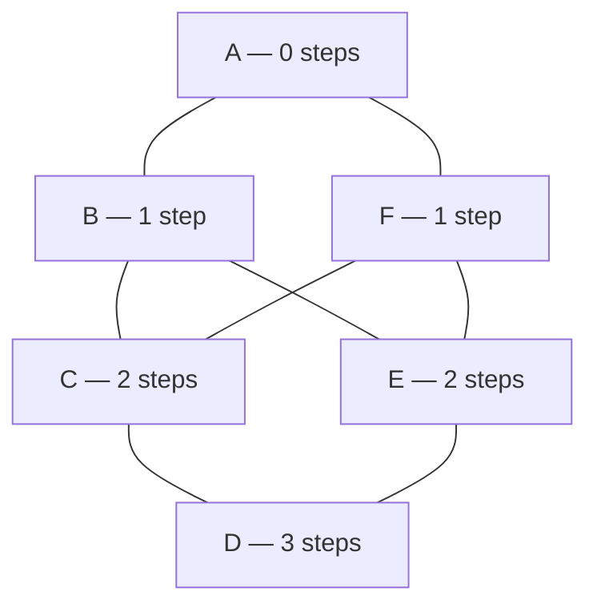
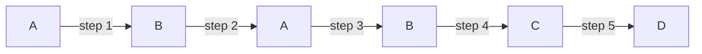

# Walks, paths and cycles: a wander, a route with no repeats, and a closed loop, with distance measured in steps

[Syllabus](../../../SYLLABUS.md) → [Combinatorics and graphs](../README.md) → [Graphs - Dots and Lines](../README.md#s09) → Walks, paths and cycles

---

## General Overview

The city's six stations are A to F, and eight lines join them: A-B, B-C, C-D, D-E, E-F, F-A, and the crossings B-E and C-F ([Graphs](01-graphs-vertices-and-edges.md)). A passenger at A wants D: A-B, then B-C, then C-D, three steps. No two-step route exists; four take three.

A journey along the lines is a **walk**: a list of stations, each joined by a line to the one before. Its **length** is the step count, one less than the stations listed. A walk may double back — A-B-A-B-C-D is five steps. Three tidier journeys have names: a **trail** repeats no line, a **path** no station, a **cycle** nothing but its start. B-A-F-C-B-E is a trail and not a path: it passes B twice, but no line twice.

Cutting a repeat out of a walk never lengthens it and never moves its ends, so the fewest steps between two stations is reached by a repeat-free route: that count is the **distance**.

**Strip the repeats out of any journey and a repeat-free route with the same ends is left, no longer than before — which is what makes "the fewest steps" a real number.**

**What kind of fact this is:** definitions — walk, trail, path, cycle, distance, eccentricity, diameter, girth — resting on one theorem proved below: every walk contains a path with the same ends.

### The picture: the whole map, arranged by distance from A



All eight lines are drawn, each joining one row to the next: the previous card's map, sorted by distance from A. The four shortest routes to D are the ways down.

---

## The formula

Notation first, in words. Distance takes a lower-case d and two stations in brackets: $d(u,v)$ is the fewest steps from station $u$ to station $v$, so $d(A,D) = 3$. Three names use brackets the same way: ecc for **eccentricity**, diam for **diameter**, rad for **radius**. Below, min means the smallest of the numbers listed, max the largest, and the letter underneath runs through every station.

$$d(u,v) \;=\; \min\{\,\text{length of a walk from } u \text{ to } v\,\}$$

**Read it aloud:** the distance is the step count of the thriftiest journey there is.

$$\mathrm{ecc}(v) \;=\; \max_{u} \; d(v,u), \qquad \mathrm{diam}(G) \;=\; \max_{v} \; \mathrm{ecc}(v), \qquad \mathrm{rad}(G) \;=\; \min_{v} \; \mathrm{ecc}(v)$$

**Read it aloud:** a station's eccentricity is its distance to the furthest station; the diameter is the worst of those, the radius the best.

The **girth** $g(G)$ is the fewest stations in a cycle. A cycle's stations and steps come to the same count, its last step returning to the start, so it reads either way: 4 here, the loop A-B-C-F-A.

| Symbol | Plain meaning | In our example | Push it up and the answer… |
| --- | --- | --- | --- |
| $G$ | the graph: stations and lines | the metro map | — |
| $u$, $v$, $w$ | stations in general | A, D, B | — |
| $d(u,v)$ | steps on the best route | $d(A,D) = 3$ | — |
| $\mathrm{ecc}(v)$ | distance to the furthest station | 3 from A, 2 from B | — |
| $\mathrm{diam}(G)$ | the largest eccentricity | 3 | — |
| $\mathrm{rad}(G)$ | the smallest eccentricity | 2 | — |
| $g(G)$ | stations on the shortest cycle | 4 | — |

### When it holds

- **Steps are counted, nothing else.** Put fares on the lines and the cheapest route can stop being the shortest.
- **Every station reachable.** Otherwise two stations have no distance, and the map no diameter: [Connected or not](04-connectivity-and-breadth-first-search.md).
- **Lines run both ways,** which makes $d(u,v)$ and $d(v,u)$ agree; one-way track breaks it ([Directed graphs](06-directed-graphs-and-topological-order.md)).
- **A cycle needs three different stations.** Out and back repeats a line, so it is a walk; a map with no loop has no girth ([Trees](../10-Trees%20and%20Cheapest%20Routes/01-trees.md)).

---

## Why it works

### Step 0: a shortest journey exists because a walk can always be tidied

Walks from A to D come in every odd length from three upward: double back along any line and two more steps are added at will. Picking the smallest of an endless supply sounds risky, but step counts are whole numbers, so a smallest one exists; the work is showing it belongs to a repeat-free route.

### Step 1: cut out the repeat, and a path is left

Take A-B-A-B-C-D, five steps. B appears twice, and what lies between the two appearances leaves B and returns, so it can go: keep the journey to the first B, continue from the second. A-B-C-D is left, three steps, same ends, every pair still a line.



Steps 2 and 3 are the detour: drop both.

The move works on any repeat and shortens the walk each time, so the cutting stops — and only at a path. The fewest steps over all walks is therefore the fewest over all paths: distance is well defined.

<details>
<summary>Detailed proof: every walk from u to v contains a path from u to v</summary>

Write the walk as $x_0, x_1, \ldots, x_k$, with $x_0 = u$ and $x_k = v$, and induct on the step count. If no station repeats it is already a path. Otherwise one station sits at two positions, $x_i = x_j$ with the first earlier; delete the entries after the first up to and including the second. The result, $x_0, \ldots, x_i, x_{j+1}, \ldots, x_k$, is again a walk — the join holds because the deleted copy was joined to $x_{j+1}$ — and it is shorter, so induction finishes it.

Nothing was added, so no shortest walk repeats a station; and a path visits each station at most once, so on six stations it takes at most 5 steps.

</details>

### Step 2: sweeping outward measures the distance

Listing every route to find one distance is wasteful. Sweep instead: mark A with 0, its neighbours B and F with 1, the unmarked stations they reach, C and E, with 2, then D with 3. The picture above is that sweep.

The marks are the distances. A marked station is reached in that many steps, so its distance is at most its mark; nor can it be less, since a shorter route would have marked it earlier. Each round looks only at the lines of the stations just marked ([Degrees and the handshaking lemma](02-degree-and-handshaking.md)).

### Step 3: distance behaves like distance

Lines run both ways, so reversing a walk gives one of the same length back: $d(u,v) = d(v,u)$. And journeys join: glue a shortest A-to-B walk to a shortest B-to-D walk, tidy by Step 1, and

$$d(u,w) \;\le\; d(u,v) + d(v,w)$$

for any three stations — going by way of somewhere else never saves a step. The check tests all 216 triples.

Sweep from every station and the rows make a table of distances. Each row's largest entry is that station's eccentricity: 3 for A, 2 for B. The largest of the six is the diameter, 3, the smallest the radius, 2. Stations at the radius form the **centre** — B, C, E, F — those at the diameter the **periphery**, A and D.

$$\mathrm{rad}(G) \;\le\; \mathrm{diam}(G) \;\le\; 2 \times \mathrm{rad}(G)$$

The left half is automatic: the smallest of six numbers cannot beat the largest. The right half is the rule above: route A and D through a centre station, say B, and the trip takes at most $d(A,B) + d(B,D)$ steps, each at most B's eccentricity — the radius. Here radius 2, diameter 3, twice the radius 4.

### Step 4: the shortest loop

Girth takes the same two roads. Listing: a cycle through a line is a repeat-free route between that line's ends plus the line itself, so enumerate those and keep the shortest. Sweeping: remove a line, measure the distance between the stations it joined, add 1, take the smallest over the eight. Both give 4.

Four, not three: no three stations here form a triangle. The map has no odd loop at all — every line joins one row of the picture to the next, so a loop comes down as often as it goes up — the subject of [Bipartite graphs](05-bipartite-graphs-and-odd-cycles.md).

A third road counts walks instead of shortening them, by multiplying a square table of noughts and ones by itself ([The adjacency matrix](07-adjacency-matrix-and-walk-counting.md)).

---

## Worked numbers, by hand

| Step | Arithmetic | Value |
| --- | --- | --- |
| mark A, then what its lines reach | A-B, A-F | B, F at 1 |
| mark what those reach, skipping the marked | B, F: C, E | C, E at 2 |
| once more | C: D; E: D | **D at 3 steps** |
| routes that do it | two choices, twice | **4** |
| worst case from A, from B | largest in the row | 3 and 2 |
| diameter, radius | largest and smallest of 3, 2, 2, 3, 2, 2 | **3 and 2** |
| shortest loop | A-B, B-C, C-F, F-A | **4 stations** |

Nobody here is more than three stops from anywhere, and from B, C, E or F more than two: the four places for a depot.

### What breaks if you drop a piece

| Mistake | Comes out at | What went wrong |
| --- | --- | --- |
| Stations counted instead of steps | A to D reads 4 | Four stations, three lines |
| Longest repeat-free route read as the diameter | 5 steps, A-B-C-D-E-F | The diameter is the worst of the *shortest* routes |
| A loop allowed to double back | B-C-B closes in 2 steps | A cycle needs three different stations |

The code prints all three.

---

## Code, from first principles, and it actually runs

Nothing is imported. The distance table is built twice, by roads sharing no arithmetic: listing every repeat-free route and keeping the shortest per pair, and sweeping outward from each station. The girth takes the same two roads, and the three wrong answers are printed.

### Python

```python
# Walks, paths and cycles -- the check behind the card.  Nothing is imported.  The
# graph is the metro map: stations A to F, the lines A-B B-C C-D D-E E-F F-A and the
# crossings B-E and C-F.  Distance and the shortest loop are each found twice, by
# roads sharing no arithmetic: listing every repeat-free route, and sweeping outward.
NAMES, INF = "ABCDEF", 99
EDGES = [(0, 1), (1, 2), (2, 3), (3, 4), (4, 5), (5, 0), (1, 4), (2, 5)]
def nbrs(edges):                           # the stations one line away from each station
    return {v: sorted(w for e in edges for w in e if v in e and w != v) for v in range(6)}
def routes(nb, u, v, seen=()):             # road one: every route u to v repeating no station
    seen = seen + (u,)
    if u == v:
        return [seen]
    return [r for w in nb[u] if w not in seen for r in routes(nb, w, v, seen)]
def sweep(nb, s):                          # road two: what lies 0, 1, 2 ... steps from s
    dist, front, step = {s: 0}, [s], 0
    while front:
        step += 1
        front = sorted({w for u in front for w in nb[u] if w not in dist})
        dist.update({w: step for w in front})
    return [dist.get(v, INF) for v in range(6)]
def name(p): return "-".join(NAMES[v] for v in p)
NB = nbrs(EDGES)
allr = [p for u in range(6) for v in range(6) for p in routes(NB, u, v)]
listed = [[min(len(p) - 1 for p in allr if (p[0], p[-1]) == (u, v)) for v in range(6)] for u in range(6)]
swept = [sweep(NB, u) for u in range(6)]
ecc = [max(r) for r in swept]
diam, rad = max(ecc), min(ecc)
centre = " ".join(NAMES[v] for v in range(6) if ecc[v] == rad)
rim = " and ".join(NAMES[v] for v in range(6) if ecc[v] == diam)
best = sorted(name(p) for p in allr if (p[0], p[-1]) == (0, 3) and len(p) - 1 == swept[0][3])
longest = max(len(p) - 1 for p in allr)
long_name = sorted(name(p) for p in allr if len(p) - 1 == longest)[0]
walk = (0, 1, 0, 1, 2, 3)                  # A-B-A-B-C-D, a walk that doubles back
cut = walk[:1] + walk[3:]                  # drop the stretch between the two B's
cut_ok = all(frozenset(p) in [frozenset(e) for e in EDGES] for p in zip(cut, cut[1:]))
tri_ok = all(swept[u][w] <= swept[u][v] + swept[v][w] for u in range(6) for v in range(6) for w in range(6))
loops = [p for u, v in EDGES + [(v, u) for u, v in EDGES] for p in routes(NB, u, v) if len(p) >= 3]
girth = min(len(p) for p in loops)
loop_name = sorted(name(p + p[:1]) for p in loops if len(p) == girth)[0]
girth_cut = min(1 + sweep(nbrs([f for f in EDGES if f != e]), e[0])[e[1]] for e in EDGES)
print(f"metro: 6 stations, {len(EDGES)} lines; steps from station to station, worst case at the end")
print("     " + "".join(f"{NAMES[v]:>3}" for v in range(6)) + f"{'worst':>8}")
for u in range(6):
    print(f"{NAMES[u]:>4} " + "".join(f"{d:>3}" for d in swept[u]) + f"{ecc[u]:>8}")
print(f"radius {rad} at {centre}; diameter {diam}, reached only by {rim}")
print(f"the same table by listing every repeat-free route: {'yes' if listed == swept else 'no'}")
print(f"{len(best)} shortest A to D routes, {swept[0][3]} steps each: {', '.join(best)}")
print(f"the walk {name(walk)} takes {len(walk) - 1} steps; cut the stretch between the two B's and "
      f"{name(cut)} is left, {len(cut) - 1} steps, every pair a line: {'yes' if cut_ok else 'no'}")
print(f"triangle rule over all {6 ** 3} ordered triples: {'holds' if tri_ok else 'fails'}; "
      f"and radius {rad} <= diameter {diam} <= 2 x radius = {2 * rad}")
print(f"shortest loop {girth} stations, {loop_name}; by cutting each line and re-measuring its ends: {girth_cut}")
print(f"mistake 1, stations counted instead of steps: A to D reads {swept[0][3] + 1}, not {swept[0][3]}")
print(f"mistake 2, longest repeat-free route read as the diameter: {longest} steps, {long_name}, not {diam}")
print(f"mistake 3, a doubling-back loop allowed: B-C-B closes in {2 * swept[1][2]} steps, not {girth}")
assert listed == swept
assert ecc == [3, 2, 2, 3, 2, 2] and diam == 3 and rad == 2 and centre == "B C E F"
assert tri_ok and cut_ok and len(cut) - 1 == swept[0][3] and rad <= diam <= 2 * rad
assert girth == girth_cut == 4 and longest == 5 and len(best) == 4
print("ALL CHECKS PASS")
```

**Ran 2026-09-19 on macOS, Python 3.14.6, standard library only. All checks passed. Output, pasted from the run:**

```
metro: 6 stations, 8 lines; steps from station to station, worst case at the end
       A  B  C  D  E  F   worst
   A   0  1  2  3  2  1       3
   B   1  0  1  2  1  2       2
   C   2  1  0  1  2  1       2
   D   3  2  1  0  1  2       3
   E   2  1  2  1  0  1       2
   F   1  2  1  2  1  0       2
radius 2 at B C E F; diameter 3, reached only by A and D
the same table by listing every repeat-free route: yes
4 shortest A to D routes, 3 steps each: A-B-C-D, A-B-E-D, A-F-C-D, A-F-E-D
the walk A-B-A-B-C-D takes 5 steps; cut the stretch between the two B's and A-B-C-D is left, 3 steps, every pair a line: yes
triangle rule over all 216 ordered triples: holds; and radius 2 <= diameter 3 <= 2 x radius = 4
shortest loop 4 stations, A-B-C-F-A; by cutting each line and re-measuring its ends: 4
mistake 1, stations counted instead of steps: A to D reads 4, not 3
mistake 2, longest repeat-free route read as the diameter: 5 steps, A-B-C-D-E-F, not 3
mistake 3, a doubling-back loop allowed: B-C-B closes in 2 steps, not 4
ALL CHECKS PASS
```

### Rust

Same numbers, same labels, built with `rustc --edition 2021 -O`.

```rust
// Walks, paths and cycles -- the same check as the Python, in Rust.  No crates.  The
// graph is the metro map: stations A to F, the lines A-B B-C C-D D-E E-F F-A and the
// crossings B-E and C-F.  Distance and the shortest loop are each found twice, by
// roads sharing no arithmetic: listing every repeat-free route, and sweeping outward.
const NAMES: [char; 6] = ['A', 'B', 'C', 'D', 'E', 'F'];
const EDGES: [(usize, usize); 8] = [(0, 1), (1, 2), (2, 3), (3, 4), (4, 5), (5, 0), (1, 4), (2, 5)];
const INF: usize = 99;
fn nbrs(edges: &[(usize, usize)]) -> Vec<Vec<usize>> {    // the stations one line from each station
    let mut nb = vec![Vec::new(); 6];
    for &(a, b) in edges { nb[a].push(b); nb[b].push(a) }
    for l in nb.iter_mut() { l.sort() } nb
}
fn routes(nb: &[Vec<usize>], u: usize, v: usize, seen: &mut Vec<usize>) -> Vec<Vec<usize>> {
    seen.push(u);                        // road one: every route u to v repeating no station
    let mut out = Vec::new();
    if u == v { out.push(seen.clone()) } else {
        for &w in &nb[u] { if !seen.contains(&w) { out.extend(routes(nb, w, v, seen)) } } }
    seen.pop(); out
}
fn sweep(nb: &[Vec<usize>], s: usize) -> Vec<usize> {     // road two: what lies 0, 1, 2 ... steps from s
    let (mut dist, mut front, mut step) = (vec![INF; 6], vec![s], 0);
    dist[s] = 0;
    while !front.is_empty() {
        let mut next: Vec<usize> = Vec::new();
        step += 1;
        for &u in &front { for &w in &nb[u] { if dist[w] == INF && !next.contains(&w) { next.push(w) } } }
        next.sort();
        for &w in &next { dist[w] = step }
        front = next;
    }
    dist
}
fn name(p: &[usize]) -> String { p.iter().map(|&v| NAMES[v].to_string()).collect::<Vec<_>>().join("-") }
fn sorted_names(ps: Vec<Vec<usize>>) -> Vec<String> {
    let mut out: Vec<String> = ps.iter().map(|p| name(p)).collect(); out.sort(); out
}
fn main() {
    let nb = nbrs(&EDGES);
    let mut allr: Vec<Vec<usize>> = Vec::new();
    for u in 0..6 { for v in 0..6 { allr.extend(routes(&nb, u, v, &mut Vec::new())) } }
    let ends = |p: &Vec<usize>, u: usize, v: usize| p[0] == u && *p.last().unwrap() == v;
    let listed: Vec<Vec<usize>> = (0..6).map(|u| (0..6).map(|v| allr.iter().filter(|p| ends(p, u, v)).map(|p| p.len() - 1).min().unwrap_or(INF)).collect()).collect();
    let swept: Vec<Vec<usize>> = (0..6).map(|u| sweep(&nb, u)).collect();
    let ecc: Vec<usize> = swept.iter().map(|r| *r.iter().max().unwrap()).collect();
    let (diam, rad) = (*ecc.iter().max().unwrap(), *ecc.iter().min().unwrap());
    let pick = |e: usize, join: &str| (0..6).filter(|&v| ecc[v] == e).map(|v| NAMES[v].to_string()).collect::<Vec<_>>().join(join);
    let (centre, rim) = (pick(rad, " "), pick(diam, " and "));
    let best = sorted_names(allr.iter().filter(|p| ends(p, 0, 3) && p.len() - 1 == swept[0][3]).cloned().collect());
    let longest = allr.iter().map(|p| p.len() - 1).max().unwrap();
    let longs = sorted_names(allr.iter().filter(|p| p.len() - 1 == longest).cloned().collect());
    let walk = vec![0usize, 1, 0, 1, 2, 3];               // A-B-A-B-C-D, a walk that doubles back
    let cut = vec![walk[0], walk[3], walk[4], walk[5]];   // drop the stretch between the two B's
    let cut_ok = cut.windows(2).all(|p| EDGES.iter().any(|&(a, b)| (a, b) == (p[0], p[1]) || (b, a) == (p[0], p[1])));
    let tri_ok = (0..6).all(|u| (0..6).all(|v| (0..6).all(|w| swept[u][w] <= swept[u][v] + swept[v][w])));
    let mut loops: Vec<Vec<usize>> = Vec::new();
    for &(u, v) in EDGES.iter() { for (a, b) in [(u, v), (v, u)] {
        loops.extend(routes(&nb, a, b, &mut Vec::new()).into_iter().filter(|p| p.len() >= 3)) } }
    let girth = loops.iter().map(|p| p.len()).min().unwrap();
    let loop_names = sorted_names(loops.iter().filter(|p| p.len() == girth).map(|p| { let mut q = p.clone(); q.push(p[0]); q }).collect());
    let girth_cut = EDGES.iter().map(|&e| 1 + sweep(&nbrs(&EDGES.iter().copied().filter(|&f| f != e).collect::<Vec<_>>()), e.0)[e.1]).min().unwrap();
    println!("metro: 6 stations, {} lines; steps from station to station, worst case at the end", EDGES.len());
    println!("     {}{:>8}", (0..6).map(|v| format!("{:>3}", NAMES[v])).collect::<String>(), "worst");
    for u in 0..6 { println!("{:>4} {}{:>8}", NAMES[u], swept[u].iter().map(|d| format!("{:>3}", d)).collect::<String>(), ecc[u]) }
    println!("radius {} at {}; diameter {}, reached only by {}", rad, centre, diam, rim);
    println!("the same table by listing every repeat-free route: {}", if listed == swept { "yes" } else { "no" });
    println!("{} shortest A to D routes, {} steps each: {}", best.len(), swept[0][3], best.join(", "));
    println!("the walk {} takes {} steps; cut the stretch between the two B's and {} is left, {} steps, \
every pair a line: {}", name(&walk), walk.len() - 1, name(&cut), cut.len() - 1, if cut_ok { "yes" } else { "no" });
    println!("triangle rule over all {} ordered triples: {}; and radius {} <= diameter {} <= 2 x radius = {}", 6usize.pow(3), if tri_ok { "holds" } else { "fails" }, rad, diam, 2 * rad);
    println!("shortest loop {} stations, {}; by cutting each line and re-measuring its ends: {}", girth, loop_names[0], girth_cut);
    println!("mistake 1, stations counted instead of steps: A to D reads {}, not {}", swept[0][3] + 1, swept[0][3]);
    println!("mistake 2, longest repeat-free route read as the diameter: {} steps, {}, not {}", longest, longs[0], diam);
    println!("mistake 3, a doubling-back loop allowed: B-C-B closes in {} steps, not {}", 2 * swept[1][2], girth);
    assert!(listed == swept);
    assert!(ecc == vec![3, 2, 2, 3, 2, 2] && diam == 3 && rad == 2 && centre == "B C E F");
    assert!(tri_ok && cut_ok && cut.len() - 1 == swept[0][3] && rad <= diam && diam <= 2 * rad);
    assert!(girth == girth_cut && girth == 4 && longest == 5 && best.len() == 4);
    println!("ALL CHECKS PASS");
}
```

**Ran 2026-09-19 on macOS, rustc 1.98.1, no crates. All checks passed. Output, pasted from the run:**

```
metro: 6 stations, 8 lines; steps from station to station, worst case at the end
       A  B  C  D  E  F   worst
   A   0  1  2  3  2  1       3
   B   1  0  1  2  1  2       2
   C   2  1  0  1  2  1       2
   D   3  2  1  0  1  2       3
   E   2  1  2  1  0  1       2
   F   1  2  1  2  1  0       2
radius 2 at B C E F; diameter 3, reached only by A and D
the same table by listing every repeat-free route: yes
4 shortest A to D routes, 3 steps each: A-B-C-D, A-B-E-D, A-F-C-D, A-F-E-D
the walk A-B-A-B-C-D takes 5 steps; cut the stretch between the two B's and A-B-C-D is left, 3 steps, every pair a line: yes
triangle rule over all 216 ordered triples: holds; and radius 2 <= diameter 3 <= 2 x radius = 4
shortest loop 4 stations, A-B-C-F-A; by cutting each line and re-measuring its ends: 4
mistake 1, stations counted instead of steps: A to D reads 4, not 3
mistake 2, longest repeat-free route read as the diameter: 5 steps, A-B-C-D-E-F, not 3
mistake 3, a doubling-back loop allowed: B-C-B closes in 2 steps, not 4
ALL CHECKS PASS
```

The two outputs match line for line.

> [!TIP]
> **Try changing**
> Guess first, then run it. The asserts are pinned to this map, so expect one to stop it.
> - **Cut a crossing.** Delete `(1, 4)` from `EDGES`, closing B-E. Does the diameter grow? No, still 3 — but only C and F stay at 2, and A, B, D, E are all at 3.
> - **Open the missing line.** Add `(0, 3)`, joining A and D. Every worst case falls to 2, and the shortest loop is still 4 stations.
> - **Allow repeats.** Delete `if w not in seen` from `routes`: nothing prints, the enumeration circling the ring until Python halts it with a recursion error.

---

## The usual mistake

> [!warning]
> **Reading the diameter as the longest route on the map.** The metro has a repeat-free route of 5 steps, A-B-C-D-E-F; the diameter is 3. It is the worst of the *best* routes: measure every pair by its shortest, then take the worst.
>
> - **Counting stations instead of steps.** A-B-C-D lists four stations and crosses three lines: the distance is 3.
> - **Halving the diameter to get the radius.** Here the diameter is 3, the radius 2; the rule only puts the diameter between the radius and twice it.
> - **Calling any closed walk a cycle.** B-C-B returns to B in 2 steps on one line; a cycle needs three different stations, which is why the girth is 4.
> - **Assuming the shortest route is unique.** A to D has four.

---

## Where you meet it in real life

- **Route planners.** Any "fewest changes" or "fewest hops" search is the sweep of Step 2, run as the procedure of [Connected or not](04-connectivity-and-breadth-first-search.md).
- **Network engineering.** Routing protocols count hops, a network's diameter is its worst-case hop count, and the centre is where the cache goes.
- **Social networks.** The small-world claim is about distance in a graph of acquaintances: the diameter is far smaller than the head count suggests, as Travers and Milgram measured with posted letters.
- **Molecules.** The girth of a bond graph is its smallest ring, the first thing a chemist reads off a structure.

> **Say it back**
> A walk is any journey along the lines, repeats allowed; a trail repeats no line, a path no station, a cycle nothing but its start. Tidy a walk and a path with the same ends is left, never longer, so the fewest steps between two stations is a real number: the distance. Eccentricity is a station's worst distance, the diameter the largest of those — 3 here, against a radius of 2. The girth, the shortest loop, is 4.

---

## What this builds on

- [Graphs](01-graphs-vertices-and-edges.md): the stations and lines this card travels, and the metro map itself.

## Where this goes next

- [Connected or not](04-connectivity-and-breadth-first-search.md): the sweep as a named procedure, and distance when no route exists.
- [The adjacency matrix](07-adjacency-matrix-and-walk-counting.md): walks counted rather than shortened, by multiplying a table of noughts and ones.
- [Trees](../10-Trees%20and%20Cheapest%20Routes/01-trees.md): maps with no cycle, where every pair has exactly one route.
- [Planar graphs](../12-Planarity%20and%20Colouring/01-planar-graphs-and-eulers-formula.md): why the girth limits how many lines a map drawn without crossings can carry.

Every distance here assumed every station could be reached; running the sweep as a procedure, and saying what happens when one is cut off, is the next card.

---

## Sources

Verified 19 Sep 2026: every link below resolves to the publisher's page.

- Diestel, Reinhard. *Graph Theory*, 6th ed., 2025. Springer GTM 173. [Book site, with the main text free online](https://diestel-graph-theory.com/). Section 1.3: walk, path, cycle, distance, diameter, girth, and the radius-diameter rule.
- Bondy, J. A., and U. S. R. Murty. *Graph Theory*. Springer GTM 244, 2008. [Publisher page](https://link.springer.com/book/9781846289699). Walks and connection, distance, and the sweep as breadth-first search.
- *Contemporary Mathematics*, section 12.4, "Navigating Graphs." OpenStax, Rice University. [Textbook page](https://openstax.org/books/contemporary-mathematics/pages/12-4-navigating-graphs). The vocabulary, free.
- Travers, Jeffrey, and Stanley Milgram. "An Experimental Study of the Small World Problem." *Sociometry* 32, no. 4 (1969): 425–443. [doi:10.2307/2786545](https://doi.org/10.2307/2786545). Distance in a social graph.
