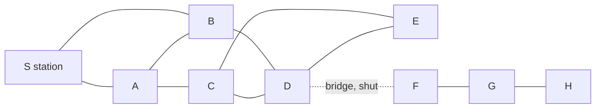
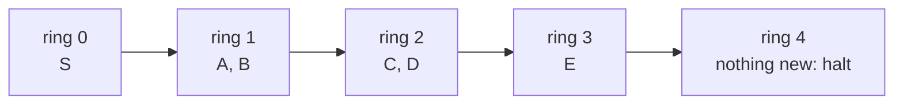

# Connected or not: breadth-first search explores ring by ring, finds the pieces, and gives shortest routes when every step costs the same

[Syllabus](../../../SYLLABUS.md) → [Combinatorics and graphs](../../../SYLLABUS.md#w04) → [Graphs - Dots and Lines](../../../SYLLABUS.md#w04-s09) → Connected or not

---

## General Overview

A town has nine junctions joined by cycle paths: the station S and eight more, A to H. Eleven paths ran between them until this morning, when the river bridge — the path from D to F — shut. Ten remain.

Two questions follow: which junctions can a rider still reach, and how many paths to each? One procedure answers both. Mark the station; mark everything one path from a marked junction; repeat until a round adds nothing.

It halts with six marked: S, A, B, C, D, E. The shut bridge was the only link to F, G and H. Start again at F and it marks those three: two pieces, of six and three. The marks arrive in rings, and a ring number is the fewest paths to that junction. The spreading is called **breadth-first search**, the name used from here on.

**Flooding a map one step at a time from a junction marks exactly the junctions some route joins to it, numbering each with its fewest steps; restarting wherever it did not reach counts the map's pieces.**

**What kind of fact this is:** a method. Connectedness and the pieces are definitions; that the ring numbers are fewest steps is a theorem, proved on this card in Why it works.

### The picture: nine junctions, ten paths, one shut bridge



Solid lines are the ten open paths; dotted is the shut bridge.

---

## The formula

Notation first, in words. A graph is two lists, its junctions and its joined pairs: $V$ for the junctions, $E$ for the paths, $n$ and $m$ for how many of each ([Graphs](01-graphs-vertices-and-edges.md)). A path here is one track; a **route** is a string of them — the walk of [Walks, paths and cycles](03-walks-paths-and-cycles.md). Write $u \sim v$ when some route joins them, and $d(v)$ for the fewest paths a route from the start $S$ to $v$ can use.

$$u \sim v \quad\text{exactly when}\quad \text{some route in } G \text{ runs from } u \text{ to } v$$

**Read it aloud:** two junctions reach each other when a rider can get from one to the other, however long the way round.

Reaching splits the junctions into blocks with no path between them: the **components**. Write $c(G)$ for how many.

$$G \text{ is connected} \quad\text{exactly when}\quad c(G) = 1$$

The flood is not told $d(v)$; it hands out its own number, $r(v)$, by one rule applied until it runs out of work.

$$r(S) = 0, \qquad r(w) = r(v) + 1 \text{ for the junction } v \text{ that first reaches } w$$

**Read it aloud:** each junction is numbered one more than the neighbour that reached it first. "First" is the whole method, and a queue delivers it; Step 3 proves the two numbers agree.

| Symbol | Plain meaning | In our example | Push it up and the answer… |
| --- | --- | --- | --- |
| $G$, $V$, $E$ | the map, its junctions, its paths | the town | — |
| $n$, $m$ | junctions and paths, counted | 9 and 10 | more junctions, more pieces; more paths, fewer |
| $S$, $v$, $w$ | start; junction reached; neighbour | station; D; E | — |
| $u \sim v$ | a route joins the two | S reaches E, not H | — |
| $d(v)$ | fewest paths from the start | d(E) = 3 | it sits further out |
| $r(v)$ | the flood's ring number | r(E) = 3 | — |
| $c(G)$ | pieces the map is in | 2 | more of the map cut off |

### When it holds

- **Every step costs the same.** The rings count paths, not miles: with lengths on them a three-path route can be the shorter ride, and the map becomes [Dijkstra's algorithm](../10-Trees%20and%20Cheapest%20Routes/05-dijkstra.md)'s.
- **Paths run both ways.** That symmetry makes the pieces blocks; one-way paths let a rider reach a junction that cannot reach back ([Directed graphs](06-directed-graphs-and-topological-order.md)).
- **Finitely many junctions.** Each joins the queue once at most, so it empties and the flood halts.

---

## Why it works

### Step 0: reaching spreads, so the reached set closes up

A rider who reaches D reaches every neighbour of D: ride to D, take one more path. So the reachable set holds every neighbour of everything in it — read backwards, the flood's stopping rule. And a set holding the station and all its members' neighbours holds everything a route from the station reaches: a step out would land on a neighbour, already inside. So the flood halting with six marked means no path runs from them to F, G or H. Not "none was found": none exists.

### Step 1: reaching cuts the junctions into blocks

Reaching holds between a junction and itself (a route of no paths), runs both ways (ride it backwards) and carries through (two routes end to end make one). That makes it an equivalence relation, which cuts a set into non-overlapping classes ([Equivalence relations and partitions](../../01-Foundations/08-Relations%20and%20Functions/06-equivalence-relations-and-partitions.md)) — the components. No path runs between two components: a path is a one-step route, and would have put its ends in one class.

### Step 2: a queue turns the marks into rings

Mark the station and put it in a queue, served first in, first out. Take the front junction, hand every unmarked neighbour its number plus one, and add them to the back. Junctions are served in the order they were marked, and each number is one more than its marker's. So the numbers leaving the queue never go down: everything numbered 1 before anything numbered 2. Hence rings.



Each ring stands one path further out; ring four is empty.

### Step 3: the ring number is the fewest steps, not one route's length

Two halves. The number is achieved: the markers lead back to the station one path at a time, so E at 3 has the route S-A-C-E. And it cannot be beaten: a shorter route's last neighbour would carry a smaller ring number, so it would have been served earlier and numbered E lower.

<details>
<summary>Detailed proof: the ring number is the fewest steps</summary>

Write r(v) for the flood's ring number, d(v) for the fewest paths in any route from the station to v.

**d(v) ≤ r(v):** each mark records the junction that made it, so the records followed back from v give a route of r(v) paths.

**r(v) ≤ d(v),** by induction on d(v). Both are 0 at the station. Let d(v) = k + 1; a shortest route arrives through a neighbour u with d(u) = k, so r(u) = k. When the queue serves u, v is unmarked, taking r(u) + 1, or marked earlier and numbered no higher.

</details>

### Step 4: a fresh start counts the pieces

Whatever the flood misses lies in another component, by Step 0, so pick an unmarked junction and flood again: it marks that component exactly. Repeat until nothing is unmarked, and the number of floods is c(G) — two here, sized 6 and 3.

One path decides it. With D-F open a single flood covers all nine, H standing 5 steps out; shut, the count rises to 2 and H has no route at all. A path whose loss raises the count is a **bridge**.

### Step 5: the other search dives instead of spreading

Swap the queue for a stack — last in, first out — and the search dives, following one neighbour as far as it goes before trying the next. Alphabetically: S to A, A to B, B to D, D to C, C to E, backing up only where nothing unmarked remains. This is **depth-first search**. Steps 0 and 1 said nothing about order, so it finds the same six junctions, but its chain to E runs five paths, S-A-B-D-C-E, against a fewest of three. The dive answers whether a route exists, the flood how far.

<details>
<summary>A third road to the pieces, with no searching at all</summary>

Every junction starts in its own group; merge the groups at each path's two ends, and the groups left are the components. The bookkeeping that makes merging fast is a later card.

</details>

The code reaches the same numbers without flooding: it lists every route out of the station that repeats no junction and reads off the shortest. Eight reach E, the shortest three paths.

---

## Worked numbers, by hand

| Step | Arithmetic | Value |
| --- | --- | --- |
| rings 0 to 4 | station, then unmarked neighbours | S; A B; C D; E; **none** |
| the station's piece | 1 + 2 + 2 + 1 junctions, 10 − 2 paths | **6 junctions, 8 paths** |
| a fresh start at F | F, G, H | **3 junctions, 2 paths** |
| the pieces | 6 + 3 = 9 | **2, not connected** |
| fewest paths to E | ring 3, by S-A-C-E | **3** |
| the same, by listing | all 8 routes to E | **3** |
| bridge reopened | 11 paths, one flood | **H at 5** |

Six of the nine are still rideable, the farthest three paths off; the rest need the bridge back.

### What breaks if you drop a piece

| Mistake | Comes out at | What went wrong |
| --- | --- | --- |
| One flood taken for the map | 1 piece of 6, not 2 of 6 and 3 | A flood reports its own piece only |
| A dive's depth read as distance | E at 5, not 3 | It numbers by when met, not how near |
| The shut bridge left on the map | H at 5, not none | D-F back drops the count to 1 |

The code prints all three.

---

## Code, from first principles, and it actually runs

Nothing is imported. Every step count comes by two roads sharing no arithmetic: the flood, and every route listed out. The pieces are checked the same way; the dive and the reopened bridge run on the same neighbour lists.

### Python

```python
# Connected or not -- the check behind the card.  Nothing is imported.  A town's cycle paths: nine
# junctions, S the station and A to H the rest; the river bridge D-F is shut, leaving ten paths.  Steps
# and pieces are found twice, by roads sharing no arithmetic: a flood ring by ring, and every route listed.
NAMES = "SABCDEFGH"
OPEN = [("S", "A"), ("S", "B"), ("A", "B"), ("A", "C"), ("B", "D"), ("C", "D"),
        ("C", "E"), ("D", "E"), ("D", "F"), ("F", "G"), ("G", "H")]
SHUT = [e for e in OPEN if e != ("D", "F")]           # the bridge shuts
def adj(edges):                                       # neighbours, both ways, sorted
    out = {v: [] for v in NAMES}
    for u, v in edges: out[u].append(v); out[v].append(u)
    return {v: sorted(ns) for v, ns in out.items()}
def flood(edges, start):                              # road one: a queue, ring by ring
    nb, queue, joins, dist = adj(edges), [start], 1, {v: 0 if v == start else -1 for v in NAMES}
    while queue:
        v = queue.pop(0)
        for w in nb[v]:
            if dist[w] < 0: dist[w] = dist[v] + 1; queue.append(w); joins += 1
    return dist, joins
def routes(edges, here, goal, seen=()):               # road two: every route, listed out
    seen = seen + (here,)
    if here == goal: yield seen; return
    for w in adj(edges)[here]:
        if w not in seen: yield from routes(edges, w, goal, seen)
def dive(edges, v, depth, deep, order):               # depth-first: dive and backtrack
    deep[v] = depth; order.append(v)
    for w in adj(edges)[v]:
        if w not in deep: dive(edges, w, depth + 1, deep, order)
def blocks(edges):                                    # a fresh flood at each unreached junction
    out, seen = [], set()
    for v in NAMES:
        if v in seen: continue
        d = flood(edges, v)[0]; r = [w for w in NAMES if d[w] >= 0]; out.append(r); seen |= set(r)
    return out
def show(d): return ", ".join(f"{v} {d[v] if d[v] >= 0 else 'none'}" for v in NAMES)

near, joins = flood(SHUT, "S")
parts, open_d = blocks(SHUT), flood(OPEN, "S")[0]
listed = {v: min((len(r) - 1 for r in routes(SHUT, "S", v)), default=-1) for v in NAMES}
deep, order = {}, []; dive(SHUT, "S", 0, deep, order)
to_e = sorted(routes(SHUT, "S", "E"), key=len)
inside = [e for e in SHUT if e[0] in parts[0] and e[1] in parts[0]]
print(f"town after the bridge D-F shuts: {len(NAMES)} junctions, {len(SHUT)} paths")
for k in range(5): print(f"  ring {k} from S: {' '.join(sorted(v for v in NAMES if near[v] == k)) or '(nothing new: it halts)'}")
print(f"steps from S, flooded:        {show(near)}")
print(f"the same, every route listed: {show(listed)}")
print(f"S to E: {len(to_e)} routes exist, the shortest is {'-'.join(to_e[0])} at {len(to_e[0]) - 1} steps")
print(f"pieces, a fresh flood at each unreached junction: {' | '.join(' '.join(p) for p in parts)}, "
      f"sizes {len(parts[0])} and {len(parts[1])}")
print(f"the station's piece holds {len(inside)} of the {len(SHUT)} paths, the other {len(SHUT) - len(inside)} "
      f"joining F G H; work: {joins} queue places, {len(inside)} paths seen twice = {2 * len(inside)}")
print(f"depth-first from S: order {' '.join(order)}, the same {len(order)} junctions, E at depth {deep['E']}, where the flood says {near['E']}")
print(f"bridge open again: {len(OPEN)} paths, {len(blocks(OPEN))} piece, steps to F G H = "
      f"{open_d['F']} {open_d['G']} {open_d['H']}, so H is {open_d['H']} steps off, not none")
print(f"one flood only, no fresh start: 1 piece of {len(parts[0])}, not {len(parts)} pieces sized {len(parts[0])} and {len(parts[1])}")
assert near == listed                                          # two roads, every step count
assert [len(p) for p in parts] == [6, 3] and set(parts[0]) == {v for v in NAMES if listed[v] >= 0}
assert order == list("SABDCE") and deep["E"] == 5 and near["E"] == 3
assert open_d == {"S": 0, "A": 1, "B": 1, "C": 2, "D": 2, "E": 3, "F": 3, "G": 4, "H": 5} and joins == 6
print("ALL CHECKS PASS")
```

**Ran 2026-09-19 on macOS, Python 3.14.6, standard library only. All checks passed. Output, pasted from the run:**

```
town after the bridge D-F shuts: 9 junctions, 10 paths
  ring 0 from S: S
  ring 1 from S: A B
  ring 2 from S: C D
  ring 3 from S: E
  ring 4 from S: (nothing new: it halts)
steps from S, flooded:        S 0, A 1, B 1, C 2, D 2, E 3, F none, G none, H none
the same, every route listed: S 0, A 1, B 1, C 2, D 2, E 3, F none, G none, H none
S to E: 8 routes exist, the shortest is S-A-C-E at 3 steps
pieces, a fresh flood at each unreached junction: S A B C D E | F G H, sizes 6 and 3
the station's piece holds 8 of the 10 paths, the other 2 joining F G H; work: 6 queue places, 8 paths seen twice = 16
depth-first from S: order S A B D C E, the same 6 junctions, E at depth 5, where the flood says 3
bridge open again: 11 paths, 1 piece, steps to F G H = 3 4 5, so H is 5 steps off, not none
one flood only, no fresh start: 1 piece of 6, not 2 pieces sized 6 and 3
ALL CHECKS PASS
```

### Rust

Same numbers, same labels, built with `rustc --edition 2021 -O`.

```rust
// Connected or not -- the same check as the Python, in Rust.  No crates.  A town's cycle paths: nine
// junctions, S the station and A to H the rest; the river bridge D-F is shut, leaving ten paths.  Steps
// and pieces are found twice, by roads sharing no arithmetic: a flood ring by ring, and every route listed.
const NAMES: [char; 9] = ['S', 'A', 'B', 'C', 'D', 'E', 'F', 'G', 'H'];
const OPEN: [(usize, usize); 11] = [(0, 1), (0, 2), (1, 2), (1, 3), (2, 4), (3, 4),
                                    (3, 5), (4, 5), (4, 6), (6, 7), (7, 8)];
type Paths = [(usize, usize)];
fn adj(edges: &Paths) -> Vec<Vec<usize>> {            // neighbours, both ways, sorted
    let mut out = vec![Vec::new(); 9]; for &(u, v) in edges { out[u].push(v); out[v].push(u) }
    out.iter_mut().for_each(|ns| ns.sort()); out
}
fn flood(edges: &Paths, start: usize) -> (Vec<i64>, usize) {   // road one: a queue, ring by ring
    let (nb, mut dist): (Vec<Vec<usize>>, Vec<i64>) = (adj(edges), (0..9).map(|v| if v == start { 0 } else { -1 }).collect());
    let (mut queue, mut joins, mut head) = (vec![start], 1, 0);
    while head < queue.len() {
        let v = queue[head]; head += 1;
        for &w in &nb[v] { if dist[w] < 0 { dist[w] = dist[v] + 1; queue.push(w); joins += 1 } }
    }
    (dist, joins)
}
fn routes(edges: &Paths, here: usize, goal: usize, seen: &mut Vec<usize>, out: &mut Vec<Vec<usize>>) {
    seen.push(here);                                  // road two: every route, listed out
    if here == goal { out.push(seen.clone()) } else {
        for &w in &adj(edges)[here] { if !seen.contains(&w) { routes(edges, w, goal, seen, out) } }
    }
    seen.pop();
}
fn shortest(edges: &Paths, goal: usize) -> i64 {      // fewest steps, read off the list of routes
    let (mut seen, mut out) = (Vec::new(), Vec::new());
    routes(edges, 0, goal, &mut seen, &mut out);
    out.iter().map(|r| r.len() as i64 - 1).min().unwrap_or(-1)
}
fn dive(edges: &Paths, v: usize, depth: i64, deep: &mut Vec<i64>, order: &mut Vec<usize>) {
    deep[v] = depth; order.push(v);                   // depth-first: dive and backtrack
    for &w in &adj(edges)[v] { if deep[w] < 0 { dive(edges, w, depth + 1, deep, order) } }
}
fn blocks(edges: &Paths) -> Vec<Vec<usize>> {         // a fresh flood at each unreached junction
    let (mut out, mut seen) = (Vec::new(), vec![false; 9]);
    for v in 0..9 {
        if seen[v] { continue }
        let d = flood(edges, v).0; let r: Vec<usize> = (0..9).filter(|&w| d[w] >= 0).collect();
        for &w in &r { seen[w] = true } out.push(r)
    }
    out
}
fn show(d: &[i64]) -> String {
    (0..9).map(|v| format!("{} {}", NAMES[v], if d[v] < 0 { "none".to_string() } else { d[v].to_string() })).collect::<Vec<String>>().join(", ")
}
fn names(vs: &[usize], sep: &str) -> String { vs.iter().map(|&v| NAMES[v].to_string()).collect::<Vec<String>>().join(sep) }
fn main() {
    let shut: Vec<(usize, usize)> = OPEN.iter().copied().filter(|&e| e != (4, 6)).collect();
    let (near, joins) = flood(&shut, 0);
    let (parts, open_d) = (blocks(&shut), flood(&OPEN, 0).0);
    let listed: Vec<i64> = (0..9).map(|g| shortest(&shut, g)).collect();
    let (mut deep, mut order) = (vec![-1i64; 9], Vec::new());
    dive(&shut, 0, 0, &mut deep, &mut order);
    let (mut seen, mut to_e) = (Vec::new(), Vec::new());
    routes(&shut, 0, 5, &mut seen, &mut to_e); to_e.sort_by_key(|r| r.len());
    let inside: Vec<(usize, usize)> = shut.iter().copied().filter(|&(a, b)| parts[0].contains(&a) && parts[0].contains(&b)).collect();
    println!("town after the bridge D-F shuts: {} junctions, {} paths", NAMES.len(), shut.len());
    for k in 0..5 { let r = names(&(0..9).filter(|&v| near[v] == k).collect::<Vec<usize>>(), " ");
        println!("  ring {} from S: {}", k, if r.is_empty() { "(nothing new: it halts)".to_string() } else { r }) }
    println!("steps from S, flooded:        {}", show(&near));
    println!("the same, every route listed: {}", show(&listed));
    println!("S to E: {} routes exist, the shortest is {} at {} steps", to_e.len(), names(&to_e[0], "-"), to_e[0].len() - 1);
    println!("pieces, a fresh flood at each unreached junction: {}, sizes {} and {}",
             parts.iter().map(|p| names(p, " ")).collect::<Vec<String>>().join(" | "), parts[0].len(), parts[1].len());
    println!("the station's piece holds {} of the {} paths, the other {} joining F G H; work: {} queue places, {} paths seen twice = {}",
             inside.len(), shut.len(), shut.len() - inside.len(), joins, inside.len(), 2 * inside.len());
    println!("depth-first from S: order {}, the same {} junctions, E at depth {}, where the flood says {}", names(&order, " "), order.len(), deep[5], near[5]);
    println!("bridge open again: {} paths, {} piece, steps to F G H = {} {} {}, so H is {} steps off, not none",
             OPEN.len(), blocks(&OPEN).len(), open_d[6], open_d[7], open_d[8], open_d[8]);
    println!("one flood only, no fresh start: 1 piece of {}, not {} pieces sized {} and {}", parts[0].len(), parts.len(), parts[0].len(), parts[1].len());
    assert!(near == listed);                                       // two roads, every step count
    assert!(parts.iter().map(|p| p.len()).collect::<Vec<usize>>() == vec![6, 3]
            && parts[0] == (0..9).filter(|&v| listed[v] >= 0).collect::<Vec<usize>>());
    assert!(order == vec![0, 1, 2, 4, 3, 5] && deep[5] == 5 && near[5] == 3);
    assert!(open_d == vec![0, 1, 1, 2, 2, 3, 3, 4, 5] && joins == 6);
    println!("ALL CHECKS PASS");
}
```

**Ran 2026-09-19 on macOS, rustc 1.98.1, no crates. All checks passed. Output, pasted from the run:**

```
town after the bridge D-F shuts: 9 junctions, 10 paths
  ring 0 from S: S
  ring 1 from S: A B
  ring 2 from S: C D
  ring 3 from S: E
  ring 4 from S: (nothing new: it halts)
steps from S, flooded:        S 0, A 1, B 1, C 2, D 2, E 3, F none, G none, H none
the same, every route listed: S 0, A 1, B 1, C 2, D 2, E 3, F none, G none, H none
S to E: 8 routes exist, the shortest is S-A-C-E at 3 steps
pieces, a fresh flood at each unreached junction: S A B C D E | F G H, sizes 6 and 3
the station's piece holds 8 of the 10 paths, the other 2 joining F G H; work: 6 queue places, 8 paths seen twice = 16
depth-first from S: order S A B D C E, the same 6 junctions, E at depth 5, where the flood says 3
bridge open again: 11 paths, 1 piece, steps to F G H = 3 4 5, so H is 5 steps off, not none
one flood only, no fresh start: 1 piece of 6, not 2 pieces sized 6 and 3
ALL CHECKS PASS
```

The two outputs match line for line.

> [!TIP]
> **Try changing**
> Guess first, then run it. The asserts are pinned to this town, so expect one to stop it.
> - **Reopen the bridge.** Set `SHUT = list(OPEN)`: one piece of nine, H five steps out, and the run stops printing a second piece's size.
> - **Cut the path between A and B.** Delete `("A", "B")` from `OPEN`: every ring number holds, but routes to E fall from 8 to 4 and the dive's order becomes S A C D B E.
> - **Start on the far bank.** Flood from `"H"`: three junctions, G one off, F two, the station out of reach.

---

## The usual mistake

> [!warning]
> **Reading the ring numbers as distances when the paths are not alike.** The flood counts paths ridden, nothing else: where one path is a short hop and another crosses the county, a two-path route can be the longer ride. Lengths make it [Dijkstra's algorithm](../10-Trees%20and%20Cheapest%20Routes/05-dijkstra.md)'s problem.
>
> - **Taking one flood for the whole map.** It marks 6 junctions and halts; the map holds 9 in 2 pieces.
> - **A path at every junction read as connectedness.** F, G and H each still have one, and still sit in their own piece.
> - **Reading a dive's depth as a distance.** E lands five paths down its chain, against a fewest of three.
> - **Marking a junction as it leaves the queue, not as it joins.** It then joins once per neighbour that spots it, and can be numbered a second time, too high.

---

## Where you meet it in real life

- **Fewest hops, fewest moves.** A message crossing a network of equal links, the "degrees of separation" between two people, and the shortest solution to a scrambled cube are ring numbers: the junctions are positions, the paths single steps.
- **Single points of failure.** The bridge is one path whose closure lifts the count from 1 to 2, which is what utilities and railways hunt for.

> **Say it back**
> Two junctions belong to one piece when some route joins them, and that relation cuts a map into components; connected means there is one. Breadth-first search marks a junction, then its neighbours, then their unmarked neighbours; the queue keeps the marks in ring order, so a ring number is the fewest paths any route needs — three for E. Starting again at any unmarked junction counts the rest: pieces of 6 and 3 once the bridge shut. A stack dives instead, reaching the same piece but putting E at 5, and rings are fewest steps only while steps cost alike.

---

## What this builds on

- [Walks, paths and cycles](03-walks-paths-and-cycles.md): routes, and why one that repeats a junction trims to one that does not — so "some route" and "some route with no repeats" mean the same here.

## Where this goes next

- [Bipartite graphs](05-bipartite-graphs-and-odd-cycles.md): ring numbers as two colours.
- [Directed graphs](06-directed-graphs-and-topological-order.md): reaching when paths run one way.
- [Trees](../10-Trees%20and%20Cheapest%20Routes/01-trees.md): the markers one flood leaves behind span its piece.
- [Dijkstra's algorithm](../10-Trees%20and%20Cheapest%20Routes/05-dijkstra.md): the flood rebuilt for paths with lengths.
- [Euler circuits](../11-Tours%20-%20Euler%20and%20Hamilton/01-euler-circuits.md): connectedness before any touring question.
- [Flows](../13-Matchings%20and%20Flows/05-flow-networks-and-ford-fulkerson.md): floods over routes with room left.
- [The giant component](../../09-Probability%20and%20statistics/14-Random%20Graphs%20and%20the%20Probabilistic%20Method/02-the-giant-component.md): piece sizes when paths fall at random.
- Mapper and Reeb graphs: components of a map built from measurements.

Every path here counted the same, which let the rings come out in order; the repair when one runs longer — serve the nearest junction, not the earliest — is [Dijkstra's algorithm](../10-Trees%20and%20Cheapest%20Routes/05-dijkstra.md).

---

## Sources

Verified 19 Sep 2026: every link below resolves to the publisher's page.

- Diestel, Reinhard. *Graph Theory*, 6th ed. Springer GTM 173, 2025. [Book site, main text free online](https://diestel-graph-theory.com/). Chapter 1: connectedness and components.
- Cormen, Thomas H., Charles E. Leiserson, Ronald L. Rivest and Clifford Stein. *Introduction to Algorithms*, 4th ed. MIT Press. [Publisher page](https://mitpress.mit.edu/9780262046305/introduction-to-algorithms/). Both searches, and the ring-number proof.
- Tarjan, Robert. "Depth-First Search and Linear Graph Algorithms." *SIAM Journal on Computing* 1, no. 2 (1972): 146–160. [doi:10.1137/0201010](https://doi.org/10.1137/0201010). What the dive is good for.
