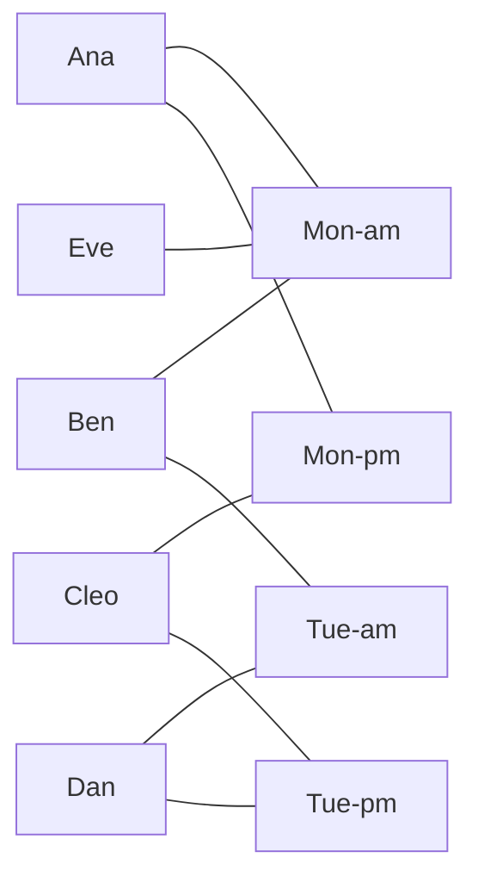
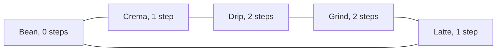

# Bipartite graphs: two sides with no edges inside a side, exactly when there is no odd cycle

Combinatorics and graphs → Graphs - Dots and Lines → Two sides and one obstruction → Bipartite graphs

---

## General Overview

A catering firm has five staff — Ana, Ben, Cleo, Dan, Eve — and four shifts this week: Mon-am, Mon-pm, Tue-am, Tue-pm. Each has claimed the shifts they can work: nine claims.

Draw a dot per person, a dot per shift, a line per claim. Every line runs from a person to a shift, never between two people or two shifts. So the nine dots fall into two heaps, all nine lines crossing between them. A graph like that is **bipartite**.

Five cafes round a small square give the other half of the story: Bean, Crema, Drip, Grind and Latte, each competing with the two next door, so the five rivalries close a ring. Splitting them over two tasting nights, no two rivals sharing a night, asks for the same two heaps. It cannot be had: colour round the ring and the colours alternate, until the fifth line closes it on two cafes of one colour. Five is odd, and that is the obstruction.

**A graph's dots split into two sides with every line crossing exactly when the graph holds no closed route of odd length.**

**What kind of fact this is:** a theorem, proved both ways in Why it works; "bipartite" and "odd cycle" are definitions.

### The picture: nine dots, two heaps, nine lines



Staff left, shifts right. Every line crosses the gap.

---

## The formula

Notation first, in words. A graph $G$ is two lists: the dots, collected as $V$, and the joined pairs, the lines, collected as $E$ ([graphs-vertices-and-edges](01-graphs-vertices-and-edges.md)). A **bipartition** names two heaps, $X$ and $Y$.

$$V = X \cup Y, \qquad X \cap Y = \{\,\}, \qquad \text{every line joins a dot of } X \text{ to a dot of } Y$$

**Read it aloud:** every dot sits in $X$ or in $Y$, none in both, and each line runs from one heap to the other.

A graph with such a cut is **bipartite**. A **cycle** is a closed route repeating no dot, its length its number of lines ([walks-paths-and-cycles](03-walks-paths-and-cycles.md)); a length is odd when halving it leaves one over ([even-and-odd](../../02-Number%20theory/01-Divisibility%20and%20Primes/02-even-and-odd.md)). The theorem is one line:

$$G \text{ is bipartite} \qquad\Longleftrightarrow\qquad G \text{ has no cycle of odd length}$$

**Read it aloud:** the two heaps exist exactly when no closed route uses an odd number of lines.

Finding the heaps means counting steps. Pick a starting dot, the **root**, and let $d(v)$ be the fewest lines from the root to the dot $v$ ([connectivity-and-breadth-first-search](04-connectivity-and-breadth-first-search.md)). Colour $v$ by whether that count is even or odd, its remainder after division by two:

$$c(v) = d(v) \bmod 2$$

| Symbol | Plain meaning | In our example | Push it up and the answer… |
| --- | --- | --- | --- |
| $G$ | one graph: dots and joined pairs | the roster | — |
| $V$, $E$ | the dots; the lines | 9 dots; 9 lines | more lines, a clash grows likelier |
| $X$, $Y$ | the two heaps, no line inside either | 5 staff; 4 shifts | — |
| $d(v)$ | steps from the root, by the shortest route | Dan is 4 from Ana | more layers, same rule |
| $c(v)$ | 0 if $d(v)$ is even, 1 if odd | Dan 0, Tue-am 1 | — |
| $u$, $v$, $w$ | a line's ends; where their routes last met | Drip, Grind, Bean | — |

### When it holds

- **Plain lines.** No arrows, one line per pair at most, none from a dot to itself: that last is a closed route of length one, odd, and kills every cut.
- **Every piece of the sheet.** A graph in two pieces cuts only if both pieces do: roster and cafes on one sheet give 0 working cuts of 16384.
- **Two sides, not two equal sides.** Five staff face four shifts; only a graph with no lines at all can leave a heap empty.

---

## Why it works

### Step 0: along any route the side alternates

Suppose the two heaps exist. One line changes side; two return to the starting side. So a dot's side is fixed by the parity of the steps used to reach it, and by nothing else. Step 1 runs that forwards, Step 2 backwards.

### Step 1: a cut forbids odd cycles

Each line of a cycle flips the side, so an odd number of lines ends on the far side. A cycle ends where it began, so its length is even.

The pentagon fails on sight. Name the nights A and B: Bean A, Crema B, Drip A, Grind B, Latte A — and the fifth line joins Latte back to Bean, both on A.

### Step 2: no odd cycle forces a cut

The other direction builds the cut from distances: colour every dot by the parity of $d(v)$. Every dot gets a colour: the search covers the root's whole piece, and any dot left over becomes a new root. What remains is to check that no line joins two dots of one colour.

Suppose the line from $u$ to $v$ did. Each dot records the one dot it was reached from, so each has a single route back to the root, and that route is a shortest one. Let $w$ be the last dot the two routes share; past $w$ they have parted for good. Shortest routes make the stretch from $w$ to $u$ count $d(u) - d(w)$ lines. That stretch, the line, and the stretch from $v$ back to $w$ close a loop of

$$(d(u) - d(w)) + 1 + (d(v) - d(w)) \text{ lines}$$

Equal parities make $d(u)$ and $d(v)$ add to an even number; taking off twice $d(w)$ keeps it even; the extra line makes the count odd. That is an odd cycle, which the assumption forbids, so the colours are the heaps.

In the pentagon the search from Bean puts Crema and Latte one step out, Drip and Grind two. The line between those two joins dots at equal distance: 2 + 1 + 2 = 5 lines, the ring itself.

### The picture: the pentagon, and where the colours clash



Steps out from Bean, the 2 and 2 the check prints for the clash.

<details>
<summary>Detailed proof: the two stretches really are a cycle</summary>

Both stretches are pieces of shortest routes, so neither repeats a dot; past $w$ they share none, each dot having one recorded route; and each meets the line only at its end. So the figure really is a cycle, of odd length by the count above. Disconnected graphs need nothing extra: heaps are named piece by piece and pooled.

</details>

### Step 3: the odd cycle is a certificate

"This graph has no cut" reads like a claim about every pair of heaps. The clash line makes it checkable: that line plus the routes back to the meeting dot is a short list of dots, and three cheap tests settle it — no dot twice, at least three dots, every neighbouring pair joined. The check prints Drip Crema Bean Latte Grind, runs all three, and pins the count at 5, odd.

The second road drops parity and tries every cut of the dots into two heaps: 2 of 512 work for the roster, 0 of 32 for the pentagon. Exhaustion dies past thirty-odd dots; the layers read each line once. The recorded routes form a tree spanning the piece, and the same proof runs from any spanning tree.

---

## Worked numbers, by hand

| Step | Arithmetic | Value |
| --- | --- | --- |
| dots and lines | 5 staff + 4 shifts; the claims | 9 dots, 9 of the 20 pairs |
| lines at each dot | 2 2 2 2 1, then 3 2 2 2 | 9 and 9 |
| the search from Ana | 0 Ana; 1 Mon-am Mon-pm; 2 Ben Cleo Eve; 3 Tue-am Tue-pm; 4 Dan | **5 staff \| 4 shifts** |
| roster cuts tried | all 512 | **2**: the cut and its mirror |
| pentagon cuts tried | all 32 | **0** |
| the clash, and its loop | both ends 2 steps out; 2 + 1 + 2 | **5 lines, odd** |
| the shelf's metro map | 8 lines, 64 cuts | **A C E \| B D F**, 2 work |

The even layers are the staff, the odd ones the shifts, and both tallies come to 9, each line counted once from each side ([degree-and-handshaking](02-degree-and-handshaking.md)). The pentagon has no heaps, and its five-line loop is the proof.

### What breaks if you drop a piece

| Mistake | Comes out at | What went wrong |
| --- | --- | --- |
| "No triangle" read as "cuts in two" | cafes: triangles 0, cuts 0 of 32 | A triangle is the shortest odd cycle, not the only one |
| A line inside a side: Ana covers Ben | 0 of 512 cuts; a 3-line loop, Ben Ana Mon-am | It closes an odd cycle through Mon-am |
| Only the piece reached first coloured | roster and cafes on a sheet: 0 of 16384 | Every piece must cut, not the first alone |

The code prints all three.

---

## Code, from first principles, and it actually runs

Nothing is imported. Five graphs run: the roster, the cafes, this shelf's metro map, the roster with a line inside a side, and the roster and cafes as one graph. Two roads share no arithmetic: one colours dots by the parity of their distance from a root, the other tries every cut into two heaps and keeps those with no line inside a heap. Where the colours clash, a third step builds the loop and checks it is a real cycle.

### Python

```python
# Bipartite graphs -- the check behind the card.  Nothing is imported.  The roster joins 5
# workers to the 4 shifts they can cover; the cafes are 5 rivals in a ring.  "Does it split
# in two?" is answered twice: BFS layers by parity of steps, and trying every cut of the dots.
ROSTER = ("Ana Ben Cleo Dan Eve Mon-am Mon-pm Tue-am Tue-pm".split(),
          [(0, 5), (0, 6), (1, 5), (1, 7), (2, 6), (2, 8), (3, 7), (3, 8), (4, 5)])
CAFES = ("Bean Crema Drip Grind Latte".split(), [(0, 1), (1, 2), (2, 3), (3, 4), (4, 0)])
METRO = (list("ABCDEF"), [(0, 1), (1, 2), (2, 3), (3, 4), (4, 5), (5, 0), (1, 4), (2, 5)])
COVER = (ROSTER[0], ROSTER[1] + [(0, 1)])          # Ana covers Ben: a line inside a side
BOTH = (ROSTER[0] + CAFES[0], ROSTER[1] + [(u + 9, v + 9) for u, v in CAFES[1]])
def adj(names, edges):                             # who is joined to whom
    a = [[] for _ in names]
    for u, v in edges: a[u].append(v); a[v].append(u)
    return a
def layers(names, edges):                          # road one: BFS, colour = parity of steps out
    a, dist, parent = adj(names, edges), [-1] * len(names), [-1] * len(names)
    for root in range(len(names)):                 # every component gets its own root
        if dist[root] >= 0: continue
        dist[root], queue = 0, [root]
        while queue:
            v = queue.pop(0)
            for w in [w for w in a[v] if dist[w] < 0]: dist[w], parent[w] = dist[v] + 1, v; queue.append(w)
    clash = next(((u, v) for u, v in edges if dist[u] % 2 == dist[v] % 2), None)
    return dist, parent, clash
def odd_loop(parent, clash):                       # the clash line, plus both routes to the root
    def route(x, out=()):
        return route(parent[x], out + (x,)) if x >= 0 else list(out)
    ru, rv = route(clash[0]), route(clash[1])
    meet = next(x for x in ru if x in rv)          # the last dot the two routes share
    return ru[:ru.index(meet) + 1] + rv[:rv.index(meet)][::-1]
real = lambda a, c: len(set(c)) == len(c) >= 3 and all(c[(i + 1) % len(c)] in a[c[i]] for i in range(len(c)))
def cuts(names, edges):                            # road two: try every cut of the dots in two
    ok = [m for m in range(1 << len(names)) if all((m >> u & 1) != (m >> v & 1) for u, v in edges)]
    return len(ok), (ok[0] if ok else 0)
show = lambda names, keep: " ".join(n for i, n in enumerate(names) if keep(i))
CASES, kept = [("roster", ROSTER), ("cafes", CAFES), ("metro map", METRO),
               ("roster, Ana covers Ben", COVER), ("roster and cafes at once", BOTH)], {}
for label, (names, edges) in CASES:
    a, (good, first) = adj(names, edges), cuts(names, edges)
    dist, parent, clash = layers(names, edges)
    loop = odd_loop(parent, clash) if clash else []
    kept[label] = (good, first, dist, loop, clash)
    tri = sum(1 for u in range(len(names)) for v in a[u] for w in a[v] if u < v < w and u in a[w])
    clash_s = "none" if not clash else f"{names[clash[0]]}-{names[clash[1]]}, steps out {dist[clash[0]]} and {dist[clash[1]]}"
    tail = (f"heaps {show(names, lambda i: first >> i & 1)} | {show(names, lambda i: not first >> i & 1)}" if good
            else f"odd loop {' '.join(names[i] for i in loop)}, {len(loop)} lines, real cycle {'yes' if real(a, loop) else 'no'}")
    print(f"{label}: {len(names)} dots, {len(edges)} lines; working cuts {good} of {1 << len(names)}; "
          f"triangles {tri}; clash {clash_s}; {tail}")
names, deg, (_, first_r, dist_r, _, _) = ROSTER[0], [len(r) for r in adj(*ROSTER)], kept["roster"]
even, odd = show(names, lambda i: dist_r[i] % 2 == 0), show(names, lambda i: dist_r[i] % 2 == 1)
cut_a, cut_b = show(names, lambda i: first_r >> i & 1), show(names, lambda i: not first_r >> i & 1)
print(f"roster: 5 workers, 4 shifts, {len(ROSTER[1])} of the {5 * 4} possible pairs; lines per worker "
      f"{' '.join(map(str, deg[:5]))} = {sum(deg[:5])}, per shift {' '.join(map(str, deg[5:]))} = {sum(deg[5:])}")
print("BFS from Ana: " + " | ".join(f"{d} " + show(names, lambda i: dist_r[i] == d) for d in range(max(dist_r) + 1)))
print(f"even steps out {even}; odd steps out {odd}; the same two heaps as the first working cut of "
      f"{1 << len(names)}: {'yes' if {even, odd} == {cut_a, cut_b} else 'no'}")
assert {even, odd} == {cut_a, cut_b}                                       # two roads, one cut
assert real(adj(*CAFES), kept["cafes"][3]) and len(kept["cafes"][3]) == 5  # the certificate holds
assert sum(deg[:5]) == sum(deg[5:]) == len(ROSTER[1])                      # each side counts every line
assert all((v[4] is None) == (v[0] > 0) for v in kept.values())            # the roads agree, 5 graphs
print("ALL CHECKS PASS")
```

**Ran 2026-09-19 on macOS, Python 3.14.6, standard library only. All checks passed. Output, pasted from the run:**

```
roster: 9 dots, 9 lines; working cuts 2 of 512; triangles 0; clash none; heaps Ana Ben Cleo Dan Eve | Mon-am Mon-pm Tue-am Tue-pm
cafes: 5 dots, 5 lines; working cuts 0 of 32; triangles 0; clash Drip-Grind, steps out 2 and 2; odd loop Drip Crema Bean Latte Grind, 5 lines, real cycle yes
metro map: 6 dots, 8 lines; working cuts 2 of 64; triangles 0; clash none; heaps A C E | B D F
roster, Ana covers Ben: 9 dots, 10 lines; working cuts 0 of 512; triangles 1; clash Ben-Mon-am, steps out 1 and 1; odd loop Ben Ana Mon-am, 3 lines, real cycle yes
roster and cafes at once: 14 dots, 14 lines; working cuts 0 of 16384; triangles 0; clash Drip-Grind, steps out 2 and 2; odd loop Drip Crema Bean Latte Grind, 5 lines, real cycle yes
roster: 5 workers, 4 shifts, 9 of the 20 possible pairs; lines per worker 2 2 2 2 1 = 9, per shift 3 2 2 2 = 9
BFS from Ana: 0 Ana | 1 Mon-am Mon-pm | 2 Ben Cleo Eve | 3 Tue-am Tue-pm | 4 Dan
even steps out Ana Ben Cleo Dan Eve; odd steps out Mon-am Mon-pm Tue-am Tue-pm; the same two heaps as the first working cut of 512: yes
ALL CHECKS PASS
```

### Rust

Same numbers, same labels, built with `rustc --edition 2021 -O`.

```rust
// Bipartite graphs -- the same check as the Python, in Rust.  No crates.  The roster joins 5 workers
// to the 4 shifts they can cover, the cafes are 5 rivals in a ring; both roads run on every graph.
fn adj(n: usize, edges: &[(usize, usize)]) -> Vec<Vec<usize>> {    // who is joined to whom
    let mut a = vec![Vec::new(); n]; for &(u, v) in edges { a[u].push(v); a[v].push(u) } a
}
fn layers(n: usize, edges: &[(usize, usize)]) -> (Vec<i64>, Vec<i64>, Option<(usize, usize)>) {
    let (a, mut dist, mut parent) = (adj(n, edges), vec![-1i64; n], vec![-1i64; n]);
    for root in 0..n {                             // every component gets its own root
        if dist[root] >= 0 { continue }
        dist[root] = 0; let (mut queue, mut head) = (vec![root], 0);
        while head < queue.len() {
            let v = queue[head]; head += 1;
            for w in a[v].clone() { if dist[w] < 0 { dist[w] = dist[v] + 1; parent[w] = v as i64; queue.push(w) } }
        }
    }
    (dist.clone(), parent, edges.iter().copied().find(|&(u, v)| dist[u] % 2 == dist[v] % 2))
}
fn odd_loop(parent: &[i64], clash: (usize, usize)) -> Vec<usize> {   // the clash line, plus both routes
    let route = |mut x: i64| { let mut o = Vec::new(); while x >= 0 { o.push(x as usize); x = parent[x as usize] } o };
    let (ru, rv) = (route(clash.0 as i64), route(clash.1 as i64));
    let meet = *ru.iter().find(|x| rv.contains(x)).unwrap();         // the last dot the two routes share
    let (iu, iv) = (ru.iter().position(|&x| x == meet).unwrap(), rv.iter().position(|&x| x == meet).unwrap());
    [&ru[..=iu], &rv[..iv].iter().rev().copied().collect::<Vec<usize>>()[..]].concat()
}
fn real(a: &[Vec<usize>], c: &[usize]) -> bool {   // dots all different, every step a line
    let mut s = c.to_vec(); s.sort(); s.dedup();
    s.len() == c.len() && c.len() >= 3 && (0..c.len()).all(|i| a[c[i]].contains(&c[(i + 1) % c.len()]))
}
fn cuts(n: usize, edges: &[(usize, usize)]) -> (usize, usize) {     // road two: try every cut
    let ok: Vec<usize> = (0..1usize << n).filter(|m| edges.iter().all(|&(u, v)| (m >> u & 1) != (m >> v & 1))).collect();
    (ok.len(), if ok.is_empty() { 0 } else { ok[0] })
}
fn show(names: &[&str], keep: impl Fn(usize) -> bool) -> String {   // the dots named, in index order
    names.iter().enumerate().filter(|&(i, _)| keep(i)).map(|(_, n)| *n).collect::<Vec<&str>>().join(" ")
}
fn main() {
    let rnames: Vec<&str> = "Ana Ben Cleo Dan Eve Mon-am Mon-pm Tue-am Tue-pm".split(' ').collect();
    let redges = vec![(0, 5), (0, 6), (1, 5), (1, 7), (2, 6), (2, 8), (3, 7), (3, 8), (4, 5)];
    let cnames: Vec<&str> = "Bean Crema Drip Grind Latte".split(' ').collect();
    let cedges = vec![(0, 1), (1, 2), (2, 3), (3, 4), (4, 0)];
    let mnames: Vec<&str> = "A B C D E F".split(' ').collect();
    let medges = vec![(0, 1), (1, 2), (2, 3), (3, 4), (4, 5), (5, 0), (1, 4), (2, 5)];
    let cover = [redges.clone(), vec![(0, 1)]].concat();            // Ana covers Ben: a line inside a side
    let bnames: Vec<&str> = rnames.iter().chain(cnames.iter()).copied().collect();
    let bedges = [redges.clone(), cedges.iter().map(|&(u, v)| (u + 9, v + 9)).collect()].concat();
    let cases = vec![("roster", &rnames, &redges), ("cafes", &cnames, &cedges), ("metro map", &mnames, &medges),
                     ("roster, Ana covers Ben", &rnames, &cover), ("roster and cafes at once", &bnames, &bedges)];
    let mut kept = Vec::new();
    for (label, names, edges) in &cases {
        let (n, a, (good, first)) = (names.len(), adj(names.len(), edges), cuts(names.len(), edges));
        let (dist, parent, clash) = layers(n, edges);
        let cycle = match clash { Some(c) => odd_loop(&parent, c), None => Vec::new() };
        let mut tri = 0; for u in 0..n { for &v in &a[u] { for &w in &a[v] { if u < v && v < w && a[w].contains(&u) { tri += 1 } } } }
        let clash_s = match clash { Some((u, v)) => format!("{}-{}, steps out {} and {}", names[u], names[v], dist[u], dist[v]), None => "none".to_string() };
        let tail = if good > 0 { format!("heaps {} | {}", show(names, |i| first >> i & 1 == 1), show(names, |i| first >> i & 1 == 0)) }
            else { format!("odd loop {}, {} lines, real cycle {}", cycle.iter().map(|&i| names[i]).collect::<Vec<&str>>().join(" "), cycle.len(), if real(&a, &cycle) { "yes" } else { "no" }) };
        println!("{}: {} dots, {} lines; working cuts {} of {}; triangles {}; clash {}; {}",
                 label, n, edges.len(), good, 1usize << n, tri, clash_s, tail);
        kept.push((good, first, dist, cycle, clash));
    }
    let (first_r, dist_r) = (kept[0].1, kept[0].2.clone());
    let deg: Vec<usize> = adj(rnames.len(), &redges).iter().map(|r| r.len()).collect();
    let (wsum, ssum) = (deg[..5].iter().sum::<usize>(), deg[5..].iter().sum::<usize>());
    let jn = |d: &[usize]| d.iter().map(|x| x.to_string()).collect::<Vec<String>>().join(" ");
    let (even, odd) = (show(&rnames, |i| dist_r[i] % 2 == 0), show(&rnames, |i| dist_r[i] % 2 == 1));
    let (ca, cb) = (show(&rnames, |i| first_r >> i & 1 == 1), show(&rnames, |i| first_r >> i & 1 == 0));
    let agree = (even == ca && odd == cb) || (even == cb && odd == ca);
    println!("roster: 5 workers, 4 shifts, {} of the {} possible pairs; lines per worker {} = {}, per shift {} = {}",
             redges.len(), 5 * 4, jn(&deg[..5]), wsum, jn(&deg[5..]), ssum);
    println!("BFS from Ana: {}", (0..=*dist_r.iter().max().unwrap())
             .map(|d| format!("{} {}", d, show(&rnames, |i| dist_r[i] == d))).collect::<Vec<String>>().join(" | "));
    println!("even steps out {}; odd steps out {}; the same two heaps as the first working cut of {}: {}",
             even, odd, 1usize << rnames.len(), if agree { "yes" } else { "no" });
    assert!(agree);                                                       // two roads, one cut
    assert!(real(&adj(5, &cedges), &kept[1].3) && kept[1].3.len() == 5);  // the certificate holds
    assert!(wsum == ssum && ssum == redges.len());                        // each side counts every line
    assert!(kept.iter().all(|k| k.4.is_none() == (k.0 > 0)));             // the roads agree, 5 graphs
    println!("ALL CHECKS PASS");
}
```

**Ran 2026-09-19 on macOS, rustc 1.98.1, no crates. All checks passed. Output, pasted from the run:**

```
roster: 9 dots, 9 lines; working cuts 2 of 512; triangles 0; clash none; heaps Ana Ben Cleo Dan Eve | Mon-am Mon-pm Tue-am Tue-pm
cafes: 5 dots, 5 lines; working cuts 0 of 32; triangles 0; clash Drip-Grind, steps out 2 and 2; odd loop Drip Crema Bean Latte Grind, 5 lines, real cycle yes
metro map: 6 dots, 8 lines; working cuts 2 of 64; triangles 0; clash none; heaps A C E | B D F
roster, Ana covers Ben: 9 dots, 10 lines; working cuts 0 of 512; triangles 1; clash Ben-Mon-am, steps out 1 and 1; odd loop Ben Ana Mon-am, 3 lines, real cycle yes
roster and cafes at once: 14 dots, 14 lines; working cuts 0 of 16384; triangles 0; clash Drip-Grind, steps out 2 and 2; odd loop Drip Crema Bean Latte Grind, 5 lines, real cycle yes
roster: 5 workers, 4 shifts, 9 of the 20 possible pairs; lines per worker 2 2 2 2 1 = 9, per shift 3 2 2 2 = 9
BFS from Ana: 0 Ana | 1 Mon-am Mon-pm | 2 Ben Cleo Eve | 3 Tue-am Tue-pm | 4 Dan
even steps out Ana Ben Cleo Dan Eve; odd steps out Mon-am Mon-pm Tue-am Tue-pm; the same two heaps as the first working cut of 512: yes
ALL CHECKS PASS
```

The two outputs match line for line.

> [!TIP]
> **Try changing**
> Guess first, then run it.
> - **Give Eve a second shift.** Add `(4, 8)`: 10 lines, working cuts still 2 of 512, nothing inside a side.
> - **Make the ring even.** Give the cafes a sixth rival and a six-line ring: the clash vanishes and 2 of 64 cuts work, the heaps Bean Drip Latte against the rest. Even rings cut, odd rings never do; the certificate assert then stops the run.
> - **Spoil the metro map.** Add `(0, 2)`, joining A and C, which share a heap: working cuts fall from 2 to 0, and the clash on B-C rebuilds the 3-line loop B A C.

---

## The usual mistake

> [!warning]
> **Taking "no triangle" for "cuts in two".** The five cafes hold no triangle — the check prints triangles 0 — and not one of the 32 cuts works. The ring of five is the obstruction, and any odd length would do.
>
> - **Stopping at the piece the search started in.** From Ana it colours the roster and never sees the cafes.
> - **Reading the clash line as the cycle.** The clash is one line; the cycle is that line plus both routes back to where they last met: 5 lines for the cafes.
> - **Calling a crossed drawing unsplittable.** Crossings on paper are not lines inside a side: K(3, 3), three dots each joined to three others, needs crossings and cuts in two ([edge-bound-and-kuratowski](../12-Planarity%20and%20Colouring/02-edge-bound-and-kuratowski.md)).

---

## Where you meet it in real life

- **Rosters and assignment.** Staff to shifts, lorries to depots, exams to rooms: a dot per item, a line per allowed pairing; who takes which is [matchings-and-augmenting-paths](../13-Matchings%20and%20Flows/01-matchings-and-augmenting-paths.md).
- **Purchase data.** Customers one side, products the other, a line per purchase — the structure community-detection hunts in messier networks.
- **Splitting a group in two.** Incompatible chemicals, players who must not share a team: a line per conflict, and [vertex-colouring-and-chromatic-number](../12-Planarity%20and%20Colouring/03-vertex-colouring-and-chromatic-number.md) for how many groups suffice.
- **Chessboards and dominoes.** Squares are dots, a line joins squares sharing an edge, light against dark is the cut. A domino covers one light and one dark square, so a board whose counts differ cannot be tiled.

> **Say it back**
> A graph is bipartite when its dots fall into two heaps with every line crossing between them, as staff and shifts do. Walking a line changes heap, so every closed route uses an even number of lines. It runs backwards too: colour each dot by the parity of its distance from a starting dot, and the colours are the heaps unless some line joins two of one colour. That line, plus the routes back to where they last met, is a closed route of odd length. Five cafes in a ring are the smallest case.

---

## What this builds on

- [connectivity-and-breadth-first-search](04-connectivity-and-breadth-first-search.md): the search in layers, the distance $d(v)$, and the record of where each dot was reached from.
- [even-and-odd](../../02-Number%20theory/01-Divisibility%20and%20Primes/02-even-and-odd.md): why a parity, once fixed, settles the question.

## Where this goes next

- [edge-bound-and-kuratowski](../12-Planarity%20and%20Colouring/02-edge-bound-and-kuratowski.md): no odd cycle means every loop is even, which tightens the ceiling on lines a flat drawing allows.
- [vertex-colouring-and-chromatic-number](../12-Planarity%20and%20Colouring/03-vertex-colouring-and-chromatic-number.md): three colours or more, where no clean test survives.
- [matchings-and-augmenting-paths](../13-Matchings%20and%20Flows/01-matchings-and-augmenting-paths.md): pairing the sides one to one.
- [mantel-and-turan](../14-Ramsey%20and%20Extremal%2C%20in%20Outline/05-mantel-and-turan.md): how many lines a triangle-free graph carries, its record holders bipartite.
- community-detection: groups in a network where no split is clean.

This card decides whether two heaps exist; who works which shift, one each, is the matching card's question.

---

## Sources

Verified 19 Sep 2026: every link below resolves to the publisher's page.

- König, Dénes. "Über Graphen und ihre Anwendung auf Determinantentheorie und Mengenlehre." *Mathematische Annalen* 77 (1916): 453–465. [doi:10.1007/BF01456961](https://doi.org/10.1007/BF01456961). Credited with the characterisation.
- Diestel, Reinhard. *Graph Theory*, 5th ed. Springer GTM 173, 2017. [doi:10.1007/978-3-662-53622-3](https://doi.org/10.1007/978-3-662-53622-3). Section 1.6 states and proves the characterisation.
- Bondy, J. A., and U. S. R. Murty. *Graph Theory*. Springer, 2008. [doi:10.1007/978-1-84628-970-5](https://doi.org/10.1007/978-1-84628-970-5). The spanning-tree route of Step 3.
- Levin, Oscar. *Discrete Mathematics: An Open Introduction*, 3rd ed. [Colouring section, free and complete](https://discrete.openmathbooks.org/dmoi3/sec_coloring.html). The colouring side, with exercises.
