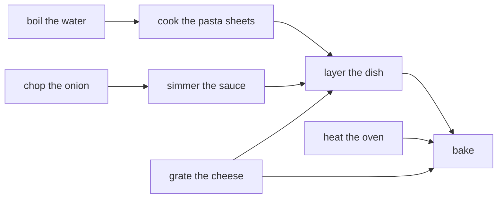

# Directed graphs: arrows instead of lines, and a graph with no way back can be lined up so every arrow points forward

[Syllabus](../../../SYLLABUS.md) → [Combinatorics and graphs](../../../SYLLABUS.md#w04) → [Graphs - Dots and Lines](../../../SYLLABUS.md#w04-s09) → Directed graphs

---

## General Overview

A lasagne recipe lists eight prep steps in alphabetical order, so the page hints at no cooking order: bake, boil the water, chop the onion, cook the pasta sheets, grate the cheese, heat the oven, layer the dish, simmer the sauce.

Eight rules hold steps up: water before pasta, onion before sauce, pasta and cheese and sauce before layering, and the layered dish, a hot oven and grated cheese before baking.

Each rule is an arrow, read "must come before": onion → sauce is not sauce → onion. Dots joined by arrows make a **directed graph**, the term from here on.

The cook wants one list, nothing placed before what it waits on. Of the 40,320 ways to list eight things, 210 work. A. B. Kahn's 1962 method finds one by peeling: write down anything nothing points at, cross its arrows out, repeat.

One more rule kills it: grate the cheese only *after* layering. Layering then waits on grating, grating on layering, and neither can be first.

**A directed graph lines up with every arrow forward exactly when it has no way back; peeling off whatever nothing points at either empties the graph, and that order is the line-up, or jams on a loop.**

**What kind of fact this is:** a theorem, proved on this card in Why it works; the directed graph, the directed cycle and the strongly connected piece are definitions.

### The picture: eight steps, eight arrows



Four steps have nothing pointing at them; only baking has nothing pointing out.

---

## The formula

Notation first, in words. A directed graph is written $D = (V, A)$: $V$ collects the dots, still **vertices**, $A$ the arrows, called **arcs** ([Graphs](01-graphs-vertices-and-edges.md)). An edge is unordered; an arc is an *ordered* pair, written $u \to v$. Write $n$ for the vertex count.

One degree becomes two: the **in-degree** $\mathrm{in}(v)$ counts arrows pointing at a vertex, the **out-degree** $\mathrm{out}(v)$ those leaving. Each arc has one tail, where it starts, and one head, where the arrowhead lands, so both tallies come to the arc count. Bars count members, so $\lvert A\rvert$ is that count:

$$\mathrm{in}(v)\text{ added over every } v \;=\; \lvert A\rvert \;=\; \mathrm{out}(v)\text{ added over every } v$$

Both come to 8 for the recipe, not 16: 16 is the undirected handshake, counting each edge at both ends ([Degrees and the handshaking lemma](02-degree-and-handshaking.md)).

A **topological order** lists all $n$ vertices, each once, with every arrow's tail earlier than its head. A **directed cycle** is a run of arrows back to its own start — the shortest, an arrow from a vertex to itself. A graph with none is a **DAG**, directed acyclic graph.

$$D \text{ has a topological order} \quad\Longleftrightarrow\quad D \text{ is a DAG}$$

**Read it aloud:** the steps line up with every arrow forward exactly when no run of arrows returns to its start.

| Symbol | Plain meaning | In our example | Push it up and the answer… |
| --- | --- | --- | --- |
| $D$ | one directed graph | the recipe's eight steps | — |
| $V$ | the vertices: the dots, prep steps here | bake to simmer the sauce | more room to reshuffle |
| $A$ | the arcs: the arrows, ordered pairs | eight "before" rules | fewer orders survive |
| $\lvert A\rvert$ | how many arcs | 8 | more rules to respect |
| $u \to v$ | one arc: tail before head | grating → layering | — |
| $n$ | how many vertices | 8, so 40,320 listings | they grow as $n$ factorial |
| $\mathrm{in}(v)$, $\mathrm{out}(v)$ | in-degree, out-degree: arrows in, arrows out | 3 in, 1 out at layering | it waits on, or holds up, more |

In-degree 0 makes a vertex a **source**, out-degree 0 a **sink**: four sources, one sink, baking.

### When it holds

- **Finitely many vertices.** An infinite DAG can have no source: an endless chain of prerequisites never repeats a vertex.
- **Directed cycles are the only obstruction.** Rub out the arrowheads and this recipe has a loop; its 210 orders stand.
- **Existence, not uniqueness.** One order is promised, not which — and arrows must read "before" throughout, or it comes out reversed.
- **Connectedness is not needed.** Peeling scans every leftover, so separate clusters line up side by side.

---

## Why it works

### Step 0: a loop of arrows refuses every listing

Round a loop, each arrow demands the next vertex stand later, so the start must stand later than itself. One directed cycle rules out every listing: exhibiting one is a complete refusal.

### Step 1: a finite DAG has a first step

Suppose every vertex had an arrow pointing at it. A walk *backwards* along incoming arrows could then always carry on, and with only $n$ vertices it must revisit one, closing a loop. So where there is no loop, some vertex has nothing pointing at it: the recipe has four such sources.

### Step 2: peel a source, the leftover is still a DAG

Write a source down and delete it with its outgoing arrows. Deleting makes no new loop, so the leftover is a smaller DAG with a source of its own, and peeling repeats until nothing is left. That is Kahn's algorithm, and its listing puts every arc forward: an arc leaves the head's in-degree tally only when the tail is written, so the head waits.

Peeling the lowest-numbered source writes boil the water, chop the onion, cook the pasta sheets, grate the cheese, heat the oven, simmer the sauce, layer the dish, bake — all 8 arrows forward.

<details>
<summary>Detailed proof: both directions</summary>

**A directed cycle means no order.** Number each vertex by its place in the listing. Every arc puts its tail's number below its head's, so round the cycle the numbers climb and the start ends below itself, which no number does.

**No directed cycle means an order exists,** by induction on $n$. One vertex is its own order. Otherwise delete a source: a cycle in the remainder would be one of $D$, so the remainder is a DAG with an order by induction. Put the source in front; its in-degree was 0, so every arc touching it leaves it and runs forward.

**Kahn's peeling is that induction run rather than argued.** Write all $n$ and the listing is an order; stop early and every unwritten vertex is still pointed at, so Step 1 on the leftover yields a cycle.

</details>

### Step 3: a jam traps the loop

Add layer the dish → grate the cheese to the eight arrows. Kahn writes 5 steps — boil, chop, cook the pasta, heat the oven, simmer — then stops. Three are left, each still pointed at by another leftover, and Step 1 on those three gives the loop grate → layer → grate. All 40,320 listings agree: 0 valid.

### Step 4: the order is not unique

Two neighbours in a valid order with no arrow between them can be swapped: no arc joined them, and every other arc keeps its ends on the same sides. Cook the pasta sheets and grate the cheese are such a pair above.

So an order is unique exactly when every neighbouring pair in it is joined by an arrow, leaving no swap. Reachability decides some pairs, and the 210 valid listings are the ways of deciding the rest ([Orders](../../01-Foundations/08-Relations%20and%20Functions/07-partial-and-total-orders.md)).

### Step 5: a way back makes a strongly connected piece

Two vertices are **mutually reachable** when arrows lead from each to the other. A vertex together with everything mutually reachable with it is a **strongly connected piece**; a vertex on no loop forms a piece by itself.

With the extra rule the recipe has 7 pieces: grating and layering together, six singles. Squash each to a dot, keep the 6 distinct arrows between pieces, and no loop survives — a loop through two pieces would make them one. So Kahn lines up all 7: an order of pieces exists even where an order of vertices does not.

One other route is standard: a depth-first walk, listing each vertex when its exploration finishes, latest first, which is a topological order too. Tarjan's 1972 paper reads the pieces off one such walk in linear time; this card follows arrows instead.

---

## Worked numbers, by hand

Steps numbered alphabetically, 0 bake to 7 simmer.

| Step | Arithmetic | Value |
| --- | --- | --- |
| the arrows | the eight rules, as drawn above | 8 |
| arrows in, then out, steps 0 to 7 | 3, 0, 0, 1, 0, 0, 3, 1 and 0, 1, 1, 1, 2, 1, 1, 1 | both **8** |
| sources, then sinks | in-degree 0, then out-degree 0 | 4 and 1 |
| Kahn, lowest source first | the order written out above | 8 of 8 forward |
| listings, then valid ones | 8 factorial, then every arrow forward | 40,320 and **210** |
| add layer → grate, peel again | jams after boil, chop, cook, heat, simmer | 5 written, **3 left**, **0** valid |
| pieces, mutually reachable | grating with layering; six singles | **7**, 6 arrows between |

Two hundred and ten orders respect the recipe; one rule about the cheese leaves none.

The shelf's metro map tests the refusal. Make its eight lines one-way round the ring A→B→C→D→E→F→A, with B→E and C→F: the in-degrees still add to 8, but none is 0. Nothing gets peeled, all 720 listings fail, and the six stations form one piece — a one-way ring has no first station.

### What breaks if you drop a piece

| Mistake | Comes out at | What went wrong |
| --- | --- | --- |
| Hunting a loop with the arrowheads rubbed out | the 210 orders stand | an undirected loop, not a directed one |
| Peeling sinks, written left to right | 0 of 8 arrows forward | the order comes out backwards |
| Adding in-degrees to out-degrees | 2 × 8 = 16, not 8 | each arc is one head and one tail |

The code prints all three.

---

## Code, from first principles, and it actually runs

Nothing is imported. The recipe is a list of ordered pairs, and three roads share no arithmetic: Kahn's peeling on a running in-degree tally; all 40,320 listings tested arrow by arrow; and arrows followed to a standstill, which finds the loops and the pieces with no degrees at all.

### Python

```python
# Directed graphs and topological order -- the check behind the card.  Nothing is
# imported.  A recipe's 8 prep steps, numbered alphabetically: 0 bake, 1 boil the
# water, 2 chop the onion, 3 cook the pasta sheets, 4 grate the cheese, 5 heat the
# oven, 6 layer the dish, 7 simmer the sauce.  An arrow u -> v means u before v.
NAMES = ["bake", "boil the water", "chop the onion", "cook the pasta sheets",
         "grate the cheese", "heat the oven", "layer the dish", "simmer the sauce"]
RECIPE = [(1, 3), (2, 7), (3, 6), (4, 6), (7, 6), (4, 0), (5, 0), (6, 0)]
BACK = RECIPE + [(6, 4)]                      # one back-arrow: layer -> grate
METRO = [(0, 1), (1, 2), (2, 3), (3, 4), (4, 5), (5, 0), (1, 4), (2, 5)]
def degs(n, arcs):                            # arrows in, then arrows out, step by step
    return ([sum(v == w for _, v in arcs) for w in range(n)], [sum(u == w for u, _ in arcs) for w in range(n)])
def kahn(n, arcs):                            # road one: peel the lowest-numbered source
    ins, left, order = degs(n, arcs)[0], list(range(n)), []
    while any(ins[x] == 0 for x in left):
        w = min(x for x in left if ins[x] == 0); left.remove(w); order.append(w)
        ins = [d - ((w, x) in arcs) for x, d in enumerate(ins)]
    return order, left
def forward(arcs, order):                     # arrows running left to right in a listing
    pos = {w: i for i, w in enumerate(order)}; return sum(pos[u] < pos[v] for u, v in arcs)
def listings(items):                          # every listing there is, generated here
    if not items: yield ()
    for i, x in enumerate(items):
        for rest in listings(items[:i] + items[i + 1:]): yield (x,) + rest
def valid(n, arcs):                           # road two: try every listing
    return [p for p in listings(tuple(range(n))) if forward(arcs, p) == len(arcs)]
def pieces(n, arcs):                          # road three: follow arrows to a standstill
    R = [{v for u, v in arcs if u == w} for w in range(n)]
    for _ in range(n): R = [r | {x for v in r for x in R[v]} for r in R]
    both = [sorted({w} | {v for v in R[w] if w in R[v]}) for w in range(n)]
    return ([w for w in range(n) if w in R[w]], [p for i, p in enumerate(both) if p not in both[:i]])
ins, outs = degs(8, RECIPE); order, left = kahn(8, RECIPE); ok = valid(8, RECIPE)
src = [w for w in range(8) if ins[w] == 0]; snk = [w for w in range(8) if outs[w] == 0]
tried = len(list(listings(tuple(range(8))))); sinks_first = kahn(8, [(v, u) for u, v in RECIPE])[0]
b_order, b_left = kahn(8, BACK); loops, parts = pieces(8, BACK)
where = {w: i for i, p in enumerate(parts) for w in p}
between = sorted({(where[u], where[v]) for u, v in BACK if where[u] != where[v]})
lined = len(kahn(len(parts), between)[0]) == len(parts); m_ins = degs(6, METRO)[0]
m_src = [w for w in range(6) if m_ins[w] == 0]; m_parts = pieces(6, METRO)[1]
print(f"recipe: 8 steps, {len(RECIPE)} arrows; alphabetical numbering, 0 {NAMES[0]} to 7 {NAMES[7]}")
print(f"arrows in,  step 0 to 7: {ins}  total {sum(ins)}")
print(f"arrows out, step 0 to 7: {outs}  total {sum(outs)}")
print(f"nothing pointing in (sources): {src}; nothing pointing out (sinks): {snk}")
print(f"Kahn, peeling the lowest-numbered source: {order}")
print("in words: " + ", ".join(NAMES[w] for w in order))
print(f"arrows running forward in that listing: {forward(RECIPE, order)} of {len(RECIPE)}")
print(f"second road, all {tried} listings tried: {len(ok)} valid; first {list(ok[0])}, last {list(ok[-1])}")
print(f"peeling sinks instead, written left to right: {sinks_first}; arrows forward: {forward(RECIPE, sinks_first)} of 8")
print(f"arrows read as an undirected degree sum: 2 x {len(RECIPE)} = {2 * len(RECIPE)}, not {len(RECIPE)}")
print(f"add one back-arrow, {NAMES[6]} -> {NAMES[4]}: {len(BACK)} arrows")
print(f"Kahn writes {len(b_order)} of 8 steps and jams: {b_order}; left {sorted(b_left)}, still pointed at")
print(f"all {tried} listings tried: {len(valid(8, BACK))} valid")
print(f"steps reachable from themselves: {loops}; pieces: {len(parts)}, sizes {sorted(len(p) for p in parts)}")
print(f"squash each piece to a dot: {len(between)} arrows between pieces, all {len(parts)} lined up: {'yes' if lined else 'no'}")
print(f"cross-check, the metro map with every line one-way: 6 stations, {len(METRO)} arrows, sources {m_src}")
print(f"all 720 listings tried: {len(valid(6, METRO))} valid; pieces: {len(m_parts)}, sizes {sorted(len(p) for p in m_parts)}")
assert ins == [3, 0, 0, 1, 0, 0, 3, 1] and outs == [0, 1, 1, 1, 2, 1, 1, 1] and sum(ins) == len(RECIPE) == sum(outs)
assert len(ok) == 210 and tuple(order) == ok[0] and left == [] and forward(RECIPE, order) == 8 and forward(RECIPE, sinks_first) == 0
assert valid(8, BACK) == [] and len(b_order) == 5 and loops == [4, 6] and lined and parts == [[0], [1], [2], [3], [4, 6], [5], [7]]
assert valid(6, METRO) == [] and m_parts == [[0, 1, 2, 3, 4, 5]] and m_src == []
print("ALL CHECKS PASS")
```

**Ran 2026-09-19 on macOS, Python 3.14.6, standard library only. All checks passed. Output, pasted from the run:**

```
recipe: 8 steps, 8 arrows; alphabetical numbering, 0 bake to 7 simmer the sauce
arrows in,  step 0 to 7: [3, 0, 0, 1, 0, 0, 3, 1]  total 8
arrows out, step 0 to 7: [0, 1, 1, 1, 2, 1, 1, 1]  total 8
nothing pointing in (sources): [1, 2, 4, 5]; nothing pointing out (sinks): [0]
Kahn, peeling the lowest-numbered source: [1, 2, 3, 4, 5, 7, 6, 0]
in words: boil the water, chop the onion, cook the pasta sheets, grate the cheese, heat the oven, simmer the sauce, layer the dish, bake
arrows running forward in that listing: 8 of 8
second road, all 40320 listings tried: 210 valid; first [1, 2, 3, 4, 5, 7, 6, 0], last [5, 4, 2, 7, 1, 3, 6, 0]
peeling sinks instead, written left to right: [0, 5, 6, 3, 1, 4, 7, 2]; arrows forward: 0 of 8
arrows read as an undirected degree sum: 2 x 8 = 16, not 8
add one back-arrow, layer the dish -> grate the cheese: 9 arrows
Kahn writes 5 of 8 steps and jams: [1, 2, 3, 5, 7]; left [0, 4, 6], still pointed at
all 40320 listings tried: 0 valid
steps reachable from themselves: [4, 6]; pieces: 7, sizes [1, 1, 1, 1, 1, 1, 2]
squash each piece to a dot: 6 arrows between pieces, all 7 lined up: yes
cross-check, the metro map with every line one-way: 6 stations, 8 arrows, sources []
all 720 listings tried: 0 valid; pieces: 1, sizes [6]
ALL CHECKS PASS
```

### Rust

Same numbers, same labels, built with `rustc --edition 2021 -O`.

```rust
// Directed graphs and topological order -- the same check as the Python, in Rust.  No
// crates.  A recipe's 8 prep steps, numbered alphabetically: 0 bake, 1 boil the water,
// 2 chop the onion, 3 cook the pasta sheets, 4 grate the cheese, 5 heat the oven,
// 6 layer the dish, 7 simmer the sauce.  An arrow u -> v means u before v.
const NAMES: [&str; 8] = ["bake", "boil the water", "chop the onion", "cook the pasta sheets",
                          "grate the cheese", "heat the oven", "layer the dish", "simmer the sauce"];
const RECIPE: [(usize, usize); 8] = [(1, 3), (2, 7), (3, 6), (4, 6), (7, 6), (4, 0), (5, 0), (6, 0)];
const METRO: [(usize, usize); 8] = [(0, 1), (1, 2), (2, 3), (3, 4), (4, 5), (5, 0), (1, 4), (2, 5)];
fn degs(n: usize, arcs: &[(usize, usize)]) -> (Vec<usize>, Vec<usize>) {   // arrows in, then out
    ((0..n).map(|w| arcs.iter().filter(|&&(_, v)| v == w).count()).collect(),
     (0..n).map(|w| arcs.iter().filter(|&&(u, _)| u == w).count()).collect())
}
fn kahn(n: usize, arcs: &[(usize, usize)]) -> (Vec<usize>, Vec<usize>) {   // road one: peel a source
    let mut ins = degs(n, arcs).0;
    let (mut left, mut order): (Vec<usize>, Vec<usize>) = ((0..n).collect(), Vec::new());
    while let Some(&w) = left.iter().filter(|&&x| ins[x] == 0).min() {
        left.retain(|&x| x != w); order.push(w);
        for x in 0..n { if arcs.contains(&(w, x)) { ins[x] -= 1 } } }
    (order, left)
}
fn forward(arcs: &[(usize, usize)], order: &[usize]) -> usize {   // arrows running left to right
    let mut pos = vec![0usize; order.len()];
    for (i, &w) in order.iter().enumerate() { pos[w] = i }
    arcs.iter().filter(|&&(u, v)| pos[u] < pos[v]).count() }
fn scan(n: usize, arcs: &[(usize, usize)]) -> (usize, Vec<Vec<usize>>) {   // road two: every listing
    fn go(it: &mut Vec<usize>, cur: &mut Vec<usize>, a: &[(usize, usize)], t: &mut usize, ok: &mut Vec<Vec<usize>>) {
        if it.is_empty() { *t += 1; if forward(a, cur) == a.len() { ok.push(cur.clone()) } }
        for i in 0..it.len() {
            let x = it.remove(i); cur.push(x); go(it, cur, a, t, ok); cur.pop(); it.insert(i, x); }
    }
    let (mut t, mut ok) = (0usize, Vec::new());
    go(&mut (0..n).collect(), &mut Vec::new(), arcs, &mut t, &mut ok);
    (t, ok)
}
fn pieces(n: usize, arcs: &[(usize, usize)]) -> (Vec<usize>, Vec<Vec<usize>>) {   // road three: follow arrows
    let mut r: Vec<Vec<bool>> = (0..n).map(|w| (0..n).map(|v| arcs.contains(&(w, v))).collect()).collect();
    for _ in 0..n { let old = r.clone();
        for w in 0..n { for v in 0..n { for x in 0..n { if old[w][v] && old[v][x] { r[w][x] = true } } } } }
    let both: Vec<Vec<usize>> = (0..n).map(|w| (0..n).filter(|&v| v == w || (r[w][v] && r[v][w])).collect()).collect();
    let mut out: Vec<Vec<usize>> = Vec::new();
    for p in both { if !out.contains(&p) { out.push(p) } }
    ((0..n).filter(|&w| r[w][w]).collect(), out)
}
fn sizes(parts: &[Vec<usize>]) -> Vec<usize> { let mut s: Vec<usize> = parts.iter().map(|p| p.len()).collect(); s.sort(); s }
fn main() {
    let back: Vec<(usize, usize)> = RECIPE.iter().copied().chain([(6usize, 4usize)]).collect();
    let (ins, outs) = degs(8, &RECIPE); let (order, left) = kahn(8, &RECIPE); let (tried, ok) = scan(8, &RECIPE);
    let src: Vec<usize> = (0..8).filter(|&w| ins[w] == 0).collect(); let snk: Vec<usize> = (0..8).filter(|&w| outs[w] == 0).collect();
    let sinks_first = kahn(8, &RECIPE.iter().map(|&(u, v)| (v, u)).collect::<Vec<_>>()).0;
    let (b_order, b_left) = kahn(8, &back); let (loops, parts) = pieces(8, &back); let mut whose = vec![0usize; 8];
    for (i, p) in parts.iter().enumerate() { for &w in p { whose[w] = i } }
    let mut between: Vec<(usize, usize)> = Vec::new();
    for &(u, v) in back.iter() { let e = (whose[u], whose[v]); if e.0 != e.1 && !between.contains(&e) { between.push(e) } }
    between.sort();
    let lined = kahn(parts.len(), &between).0.len() == parts.len();
    let m_parts = pieces(6, &METRO).1; let m_src: Vec<usize> = (0..6).filter(|&w| degs(6, &METRO).0[w] == 0).collect();
    println!("recipe: 8 steps, {} arrows; alphabetical numbering, 0 {} to 7 {}", RECIPE.len(), NAMES[0], NAMES[7]);
    println!("arrows in,  step 0 to 7: {:?}  total {}", ins, ins.iter().sum::<usize>());
    println!("arrows out, step 0 to 7: {:?}  total {}", outs, outs.iter().sum::<usize>());
    println!("nothing pointing in (sources): {:?}; nothing pointing out (sinks): {:?}", src, snk);
    println!("Kahn, peeling the lowest-numbered source: {:?}", order);
    println!("in words: {}", order.iter().map(|&w| NAMES[w]).collect::<Vec<&str>>().join(", "));
    println!("arrows running forward in that listing: {} of {}", forward(&RECIPE, &order), RECIPE.len());
    println!("second road, all {} listings tried: {} valid; first {:?}, last {:?}", tried, ok.len(), ok[0], ok[ok.len() - 1]);
    println!("peeling sinks instead, written left to right: {:?}; arrows forward: {} of 8", sinks_first, forward(&RECIPE, &sinks_first));
    println!("arrows read as an undirected degree sum: 2 x {} = {}, not {}", RECIPE.len(), 2 * RECIPE.len(), RECIPE.len());
    println!("add one back-arrow, {} -> {}: {} arrows", NAMES[6], NAMES[4], back.len());
    println!("Kahn writes {} of 8 steps and jams: {:?}; left {:?}, still pointed at", b_order.len(), b_order, b_left);
    println!("all {} listings tried: {} valid", tried, scan(8, &back).1.len());
    println!("steps reachable from themselves: {:?}; pieces: {}, sizes {:?}", loops, parts.len(), sizes(&parts));
    println!("squash each piece to a dot: {} arrows between pieces, all {} lined up: {}", between.len(), parts.len(),
             if lined { "yes" } else { "no" });
    println!("cross-check, the metro map with every line one-way: 6 stations, {} arrows, sources {:?}", METRO.len(), m_src);
    println!("all 720 listings tried: {} valid; pieces: {}, sizes {:?}", scan(6, &METRO).1.len(), m_parts.len(), sizes(&m_parts));
    assert!(ins == vec![3, 0, 0, 1, 0, 0, 3, 1] && outs == vec![0, 1, 1, 1, 2, 1, 1, 1] && ins.iter().sum::<usize>() == RECIPE.len() && outs.iter().sum::<usize>() == RECIPE.len());
    assert!(ok.len() == 210 && order == ok[0] && left.is_empty() && forward(&RECIPE, &order) == 8 && forward(&RECIPE, &sinks_first) == 0);
    assert!(scan(8, &back).1.is_empty() && b_order.len() == 5 && loops == vec![4, 6] && lined && parts == vec![vec![0], vec![1], vec![2], vec![3], vec![4, 6], vec![5], vec![7]]);
    assert!(scan(6, &METRO).1.is_empty() && m_parts == vec![vec![0, 1, 2, 3, 4, 5]] && m_src.is_empty());
    println!("ALL CHECKS PASS");
}
```

**Ran 2026-09-19 on macOS, rustc 1.98.1, no crates. All checks passed. Output, pasted from the run:**

```
recipe: 8 steps, 8 arrows; alphabetical numbering, 0 bake to 7 simmer the sauce
arrows in,  step 0 to 7: [3, 0, 0, 1, 0, 0, 3, 1]  total 8
arrows out, step 0 to 7: [0, 1, 1, 1, 2, 1, 1, 1]  total 8
nothing pointing in (sources): [1, 2, 4, 5]; nothing pointing out (sinks): [0]
Kahn, peeling the lowest-numbered source: [1, 2, 3, 4, 5, 7, 6, 0]
in words: boil the water, chop the onion, cook the pasta sheets, grate the cheese, heat the oven, simmer the sauce, layer the dish, bake
arrows running forward in that listing: 8 of 8
second road, all 40320 listings tried: 210 valid; first [1, 2, 3, 4, 5, 7, 6, 0], last [5, 4, 2, 7, 1, 3, 6, 0]
peeling sinks instead, written left to right: [0, 5, 6, 3, 1, 4, 7, 2]; arrows forward: 0 of 8
arrows read as an undirected degree sum: 2 x 8 = 16, not 8
add one back-arrow, layer the dish -> grate the cheese: 9 arrows
Kahn writes 5 of 8 steps and jams: [1, 2, 3, 5, 7]; left [0, 4, 6], still pointed at
all 40320 listings tried: 0 valid
steps reachable from themselves: [4, 6]; pieces: 7, sizes [1, 1, 1, 1, 1, 1, 2]
squash each piece to a dot: 6 arrows between pieces, all 7 lined up: yes
cross-check, the metro map with every line one-way: 6 stations, 8 arrows, sources []
all 720 listings tried: 0 valid; pieces: 1, sizes [6]
ALL CHECKS PASS
```

The two outputs match line for line.

> [!TIP]
> **Try changing**
> Guess first, then run it; the asserts are pinned to this recipe, so expect one to stop.
> - **Loosen the cheese.** Delete `(4, 6)` from `RECIPE`: the valid listings rise from 210 to 252, and the first assert stops it.
> - **Peel the other way.** Change `min` to `max` in `kahn`: another of the 210 orders comes out, the last of them rather than the first.
> - **Drop the back-arrow.** Set `BACK` to `list(RECIPE)`: the jam goes, Kahn writes 8 of 8, and the third assert stops it.

---

## The usual mistake

> [!warning]
> **Testing for a loop with the arrowheads rubbed out.** Forget direction and grating, layering and baking close a loop. Along the arrows there is no way back, and all 210 orders stand.
>
> - **Reading Kahn's answer as *the* answer.** It is one of 210; four steps could go first.
> - **Peeling sinks and writing them left to right.** That lists the recipe backwards: 0 of 8 arrows forward.
> - **Reading "strongly connected piece" as "loop".** Six of the seven pieces here are single steps.

---

## Where you meet it in real life

- **Build tools.** `make` and `cargo` peel a graph of "must be built first"; a circular dependency is that jam.
- **Spreadsheets.** A formula points at the cells it reads, so recalculation walks a topological order and a circular reference is the refused loop.
- **Task planning.** Prerequisites give a DAG whose orders are the legal plans (Scheduling); a commit history is a DAG in the same way.

> **Say it back**
> A directed graph joins dots by arrows, so a dot has two counts: arrows in and arrows out, each tally adding to the arrow count. A topological order lists every dot once with every arrow forward, and exists exactly when no run of arrows returns to its start. Kahn's method writes down anything nothing points at, deletes its arrows and repeats, either writing them all or jamming on a leftover that holds a loop. Eight prep steps allow 210 orders; one rule about the cheese, none.

---

## What this builds on

- [Connected or not](04-connectivity-and-breadth-first-search.md): getting between vertices along the lines, which becomes reachability once they run one way.
- [Orders](../../01-Foundations/08-Relations%20and%20Functions/07-partial-and-total-orders.md): an order leaving pairs undecided, and what extending it to decide every pair means.

## Where this goes next

- [De Bruijn sequences](../11-Tours%20-%20Euler%20and%20Hamilton/05-de-bruijn-sequences.md): a directed graph whose arcs, not vertices, are toured.
- [Flows](../13-Matchings%20and%20Flows/05-flow-networks-and-ford-fulkerson.md): arcs with a capacity, and how much can be pushed along them.
- [Classifying states](../../11-Stochastic%20processes%20and%20calculus/03-Markov%20Chains/03-classifying-states.md): arrows weighted by how often they are taken, the pieces fixing which states are kept.
- Scheduling: durations on the steps, so one of the 210 orders becomes the schedule to beat.

Nothing here separates those 210 orders; give each step a duration and one sweep along a topological order finds the longest chain of arrows, fixing the earliest dinner — which is what scheduling asks.

---

## Sources

Verified 19 Sep 2026: every link below resolves to the publisher's page.

- Kahn, A. B. "Topological sorting of large networks." *Communications of the ACM* 5, no. 11 (1962). [doi:10.1145/368996.369025](https://doi.org/10.1145/368996.369025). The peeling algorithm.
- Tarjan, Robert. "Depth-First Search and Linear Graph Algorithms." *SIAM Journal on Computing* 1, no. 2 (1972). [doi:10.1137/0201010](https://doi.org/10.1137/0201010). The other route, and the pieces.
- Cormen, Thomas H., Charles E. Leiserson, Ronald L. Rivest, and Clifford Stein. *Introduction to Algorithms*, 4th ed. MIT Press, 2022. [Publisher page](https://mitpress.mit.edu/9780262046305/introduction-to-algorithms/). Topological sort and cycle detection.
- Bang-Jensen, Jørgen, and Gregory Gutin. *Digraphs*, 2nd ed. Springer, 2009. [Publisher page](https://link.springer.com/book/10.1007/978-1-84800-998-1). Arcs, in- and out-degree, acyclic orderings.
