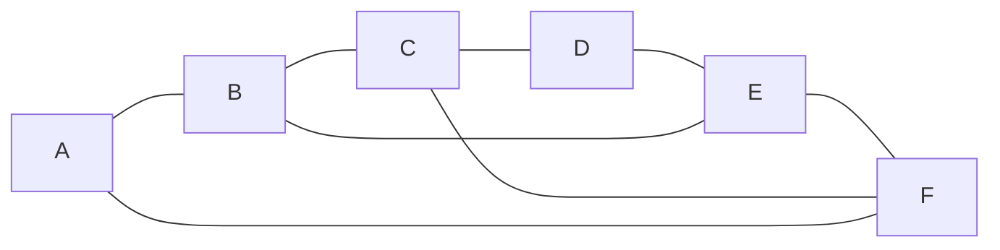

# The adjacency matrix: a grid of ones and zeros, and its powers count walks of each length

[Syllabus](../../../SYLLABUS.md) → [Combinatorics and graphs](../README.md) → [Graphs - Dots and Lines](../README.md#s09) → The adjacency matrix

---

## General Overview

A city metro runs six stations, A to F, joined by eight lines: A-B, B-C, C-D, D-E, E-F, F-A, and the crossings B-E and C-F. Starting at A and riding exactly three lines, how many ways end at F? Doubling back counts: a train may come straight back to a station it left.

Three lines is short enough to list, and the answer is six: A-B-A-F, A-B-C-F, A-B-E-F, A-F-A-F, A-F-C-F, A-F-E-F. Ask for nine lines, or ask on four hundred stations, and listing stops being possible.

So stop drawing and start tabulating. Lay the stations out as the rows of a square grid and again as its columns, with a 1 where a line joins two of them. Multiply that grid by itself and the cells count two-line routes; multiply again, three-line routes. Matrix multiplication ([Matrix multiplication](../../03-Algebra/04-Matrices/03-matrix-multiplication.md)) is the bookkeeping route counting needs.

**Write the map as a square table of ones and zeros; multiply it into itself k times and each cell counts the routes of exactly k lines between its two stations.**

**What kind of fact this is:** a theorem, proved on this card in Why it works; the table itself is a definition.

### The picture: the metro, six stations and eight lines



---

## The formula

Notation first, in words. Fix an order for the stations and keep it: A is station 1, F is station 6. The **adjacency matrix** $A$ is the square table with a row and a column per station, and its cell in row $i$, column $j$ — written $A_{ij}$ — holds 1 when a line joins those stations.

$$A_{ij} \;=\; 1 \text{ when a line joins } i \text{ and } j, \text{ otherwise } 0$$

**Read it aloud:** one row and one column per station, and a 1 wherever a line lands.

Row A reads 0 1 0 0 0 1: lines to B and to F, nothing else. A line joins A and B both ways, so tipping the table over changes nothing: $A$ equals its transpose $A^{T}$ ([Matrices](../../03-Algebra/04-Matrices/01-matrices-and-the-matrix-zoo.md)). Each row adds up to its station's **degree** ([Degrees and the handshaking lemma](02-degree-and-handshaking.md)): 2, 3, 3, 2, 3, 3.

A **walk** of length $k$ is a ride along $k$ lines in turn, stations and lines free to repeat ([Walks, paths and cycles](03-walks-paths-and-cycles.md)). The result the card exists for:

$$\bigl(A^{k}\bigr)_{ij} \;=\; \text{walks of length } k \text{ from } i \text{ to } j$$

**Read it aloud:** multiply the table into itself k times and every cell counts the k-line routes from its row's station to its column's.

The **trace** is the sum of a square table's diagonal. The **incidence matrix** $M$ is the same map line-by-station: eight rows, six columns, a 1 where a line touches a station — the grid of ends on [Degrees and the handshaking lemma](02-degree-and-handshaking.md), tipped over.

| Symbol | Plain meaning | In our example | Push it up and the answer… |
| --- | --- | --- | --- |
| $A$, $A^{T}$ | the map as a square table of ones and zeros; $A^{T}$ is it tipped over | 6 by 6; row A is 0 1 0 0 0 1 | — |
| $A_{ij}$ | the cell in row $i$, column $j$ | row 1, column 6 is 1: A-F is a line | — |
| $i$, $j$ | the row's and the column's station | A is 1, F is 6 | — |
| $k$ | lines the route rides | 3 | counts climb steeply, the work does not |
| $A^{k}$ | the table multiplied into itself $k$ times | $A^{3}$, the three-line counts | one more multiply per line added |
| $D$ | the degrees down a diagonal, 0 elsewhere | 2, 3, 3, 2, 3, 3 | — |
| $M$ | a row per line, a column per station | 8 by 6, two ones a row | — |

### When it holds

- **No loops.** Two tracks from B to C are no trouble: write 2 in that cell and the counts hold. A line from B to itself is trouble: degrees want 2 in that diagonal cell, walk counting wants 1, and the two readings part company.
- **One station order, kept.** Reordering moves rows and columns together and changes no count; mixing two orders reports the wrong pairs in silence.
- **Walks, not routes that never repeat.** Of the six three-line rides A to F, only two avoid a repeat.
- **Counts, not distances.** A 0 means "no route of that exact length", not "unreachable"; the first length whose entry is positive is the distance.

---

## Why it works

### Step 0: a route is built one line at a time, and length 1 is free

Every ride of three lines from A to F is a ride of two lines from A to somewhere, then one line on to F. Nothing else. So the three-line counts follow from the two-line counts, one station at a time — and that step is matrix multiplication.

Length 1 needs no work: joined stations have one one-line ride, unjoined ones none, which is what the table already holds.

### Step 1: one more line is one more multiply, and induction does the rest

Sort the walks of length k+1 from i to j by the station u they stand at before the final line. A walk in u's pile is a walk of length k from i to u, then the line u-j, so u's pile holds the k-line count from i to u times row u, column j of $A$ — 1 if that line exists, 0 if not. Adding over every u:

$$\bigl(A^{k+1}\bigr)_{ij} \;=\; \sum_{u} \bigl(A^{k}\bigr)_{iu} \, A_{uj}$$

The Greek capital sigma says "add this up as u runs over all six stations". The right-hand side is, symbol for symbol, row i, column j of a matrix product. Every walk of length k+1 lands in exactly one pile, so no walk is counted twice or missed. That carries "right at length k" to length k+1, so by induction the count table for length k is $A^{k}$.

<details>
<summary>The same count on one-way lines</summary>

No step used the fact that a line runs both ways: read $A_{ij}$ as "an arc leads from i to j" and the induction is unchanged, so powers of a one-way table count one-way routes ([Directed graphs](06-directed-graphs-and-topological-order.md)).

</details>

### Step 2: the diagonal counts what comes home

A walk that finishes where it began lands on the diagonal. At length 2 such a ride is "take a line, take it back", so the squared diagonal reads 2 3 3 2 3 3 — the degrees — and its trace is 16, twice the eight lines. Off the diagonal the square counts shared neighbours: the 2 at row A, column C counts B and F, each joined to both.

With no loops, three lines can only come home by visiting three different stations, which is a triangle, and each triangle supplies six closed rides: three starting points, two directions. So the cubed trace is six times the triangles. Here it is 0, so the map holds none, agreeing with the count on [Graphs](01-graphs-vertices-and-edges.md). Add the line A-C and two triangles appear, A-B-C and A-C-F: that map's cubed trace reads 12, and 12 over 6 is 2.

### Step 3: the line-by-station table gives the same map back

Each row of the incidence matrix holds two ones, one per end: 16 ones in all, and each column adds to a degree. Tip it over and multiply: row u, column v of $M^{T}M$ counts the lines touching both u and v — 1 when a line joins two stations, the degree when v is u, 0 otherwise. So $M^{T}M$ equals $A + D$: a third road to the same map, checked cell by cell in the code.

---

## Worked numbers, by hand

| Step | Arithmetic | Value |
| --- | --- | --- |
| row A, then the row sums | 1 under B and under F; count each row | 0 1 0 0 0 1; 2 3 3 2 3 3 |
| row A squared, then cubed | add rows B and F of the table, then of the square | 2 0 2 0 2 0; 0 6 0 4 0 6 |
| the squared diagonal, and its trace | 2 + 3 + 3 + 2 + 3 + 3 | 16 = 2 × 8 lines |
| three-line routes A to F | A-B-A-F, A-B-C-F, A-B-E-F, A-F-A-F, A-F-C-F, A-F-E-F | **6** |
| the cubed trace, then triangles | 0 over 6; with A-C added, 12 over 6 | **0, then 2** |

Two never repeat a station; the other four double back along one line.

```
Routes of exactly three lines out of A, one block per route

A                     0
B  ██████             6
C                     0
D  ████               4
E                     0
F  ██████             6
```

A, C and E stay blank: every line crosses between the groups A, C, E and B, D, F ([Bipartite graphs](05-bipartite-graphs-and-odd-cycles.md)), so odd lengths finish across the split.

### What breaks if you drop a piece

| Mistake | Comes out at | What went wrong |
| --- | --- | --- |
| Reading the cubed count as repeat-free routes | 6, not 2 | Walks double back |
| Reading the 0 at row A, column F as "unreachable" | 0 | Parity, not distance |
| Squaring cell by cell | 1, where the square holds 0 | Cells paired, not rows with columns |
| A 1 on the diagonal, letting a train wait | 9, not 6 | The one-line ride A-F returns once per waiting place: 3 + 6 |

The code prints all four.

---

## Code, from first principles, and it actually runs

Nothing is imported. The walk counts come twice over by roads sharing no arithmetic: a written-out row-against-column loop, and a walk along the neighbour lists that builds each route as a string, forming no matrix. The two are compared cell by cell at lengths 1, 2 and 3. A third road runs the line-by-station table into the adjacency matrix plus the degrees, and the triangle rule is tried on the metro plus the line A-C, which has two.

### Python

```python
# The adjacency matrix -- the check behind the card.  Nothing is imported.  The
# metro: stations A to F, lines A-B B-C C-D D-E E-F F-A and the crossings B-E
# and C-F.  Walk counts come twice over: from multiplying the table of ones and
# zeros out, and from stepping along the neighbour lists, which forms no matrix.
NAMES, N = "ABCDEF", 6
EDGES = [(0, 1), (1, 2), (2, 3), (3, 4), (4, 5), (5, 0), (1, 4), (2, 5)]
A = [[0] * N for _ in range(N)]
for u, v in EDGES:
    A[u][v] = A[v][u] = 1
nbr = [[v for v in range(N) if A[u][v]] for u in range(N)]
deg = [len(nbr[u]) for u in range(N)]
def mul(P, Q):                       # road one: each row against each column
    return [[sum(P[i][h] * Q[h][j] for h in range(N)) for j in range(N)] for i in range(N)]
def tris(G):                         # triangles by listing, on any map
    return sum(1 for a in range(N) for b in range(a + 1, N) for c in range(b + 1, N) if G[a][b] and G[a][c] and G[b][c])
def routes(i, j, k):                 # road two: every k-line route, written out
    if k == 0:
        return [NAMES[i]] if i == j else []
    return [NAMES[i] + "-" + t for h in nbr[i] for t in routes(h, j, k - 1)]
def nofix(i, j, k, seen):            # the same, refusing a station twice
    if k == 0:
        return int(i == j)
    return sum(nofix(h, j, k - 1, seen | {h}) for h in nbr[i] if h not in seen)
def row(v): return " ".join(str(x) for x in v)
A2 = mul(A, A)
A3 = mul(A2, A)
diag2 = [A2[u][u] for u in range(N)]
plus = [[int(A[u][v] or {u, v} == {0, 2}) for v in range(N)] for u in range(N)]   # the metro plus a line A-C
p3 = mul(mul(plus, plus), plus)
tr2, tr3, tri, trp, trip = sum(diag2), sum(A3[u][u] for u in range(N)), tris(A), sum(p3[u][u] for u in range(N)), tris(plus)
inc = [[int(v in e) for v in range(N)] for e in EDGES]       # one row per line
gram = [[sum(r[u] * r[v] for r in inc) for v in range(N)] for u in range(N)]
plusdeg = [[A[u][v] + deg[u] * int(u == v) for v in range(N)] for u in range(N)]
wait = [[A[u][v] + int(u == v) for v in range(N)] for u in range(N)]
wait3 = mul(mul(wait, wait), wait)
three = routes(0, 5, 3)
agree = all(len(routes(i, j, k)) == (A, A2, A3)[k - 1][i][j]
            for k in (1, 2, 3) for i in range(N) for j in range(N))
print(f"metro: {N} stations, {len(EDGES)} lines; the table A, rows and columns A to F, row sum at the right")
for u in range(N):
    print(f"  {NAMES[u]}  {row(A[u])}   sum {deg[u]}")
print(f"A^2 diagonal: {row(diag2)}, the degrees; trace {tr2} = 2 x {len(EDGES)} lines")
print(f"A^2 row A: {row(A2[0])} -- the 0 under F is parity, not distance, since A-F is a line")
print(f"A^3 row A: {row(A3[0])}")
print(f"three-line routes A to F: {A3[0][5]} from the table, {len(three)} from the list; "
      f"the two roads agree for k = 1, 2, 3: {'yes' if agree else 'no'}")
print("the six: " + " ".join(three))
print(f"never repeating a station: {nofix(0, 5, 3, {0})}, namely A-B-C-F and A-B-E-F")
print(f"trace A^3 = {tr3}, triangles = trace / 6 = {tr3 // 6}, by listing {tri}; plus a line A-C: trace {trp}, triangles {trp // 6}, by listing {trip}")
print(f"line-by-station table M: {len(EDGES)} rows x {N} columns, {sum(sum(r) for r in inc)} ones, "
      f"column sums {row([sum(r[v] for r in inc) for v in range(N)])}")
print(f"M transposed times M equals A plus the degrees down the diagonal: {'yes' if gram == plusdeg else 'no'}")
print(f"mistake, squaring cell by cell: (A, F) reads {A[0][5] * A[0][5]}, not {A2[0][5]}")
print(f"mistake, a 1 down the diagonal to allow waiting: three-line A to F reads {wait3[0][5]}, not {A3[0][5]}")
assert agree
assert diag2 == deg and tr2 == 2 * len(EDGES)
assert gram == plusdeg and tr3 == 6 * tri and trp == 6 * trip
assert len(three) == 6 and nofix(0, 5, 3, {0}) == 2 and A2[0][5] == 0 and A[0][5] == 1
print("ALL CHECKS PASS")
```

**Ran 2026-09-19 on macOS, Python 3.14.6, standard library only. All checks passed. Output, pasted from the run:**

```
metro: 6 stations, 8 lines; the table A, rows and columns A to F, row sum at the right
  A  0 1 0 0 0 1   sum 2
  B  1 0 1 0 1 0   sum 3
  C  0 1 0 1 0 1   sum 3
  D  0 0 1 0 1 0   sum 2
  E  0 1 0 1 0 1   sum 3
  F  1 0 1 0 1 0   sum 3
A^2 diagonal: 2 3 3 2 3 3, the degrees; trace 16 = 2 x 8 lines
A^2 row A: 2 0 2 0 2 0 -- the 0 under F is parity, not distance, since A-F is a line
A^3 row A: 0 6 0 4 0 6
three-line routes A to F: 6 from the table, 6 from the list; the two roads agree for k = 1, 2, 3: yes
the six: A-B-A-F A-B-C-F A-B-E-F A-F-A-F A-F-C-F A-F-E-F
never repeating a station: 2, namely A-B-C-F and A-B-E-F
trace A^3 = 0, triangles = trace / 6 = 0, by listing 0; plus a line A-C: trace 12, triangles 2, by listing 2
line-by-station table M: 8 rows x 6 columns, 16 ones, column sums 2 3 3 2 3 3
M transposed times M equals A plus the degrees down the diagonal: yes
mistake, squaring cell by cell: (A, F) reads 1, not 0
mistake, a 1 down the diagonal to allow waiting: three-line A to F reads 9, not 6
ALL CHECKS PASS
```

### Rust

Same numbers, same labels, built with `rustc --edition 2021 -O`.

```rust
// The adjacency matrix -- the same check as the Python, in Rust.  No crates.  The
// metro: stations A to F, lines A-B B-C C-D D-E E-F F-A and the crossings B-E
// and C-F.  Walk counts come twice over: from multiplying the table of ones and
// zeros out, and from stepping along the neighbour lists, which forms no matrix.
const NAMES: [char; 6] = ['A', 'B', 'C', 'D', 'E', 'F'];
const N: usize = 6;
const EDGES: [(usize, usize); 8] = [(0, 1), (1, 2), (2, 3), (3, 4), (4, 5), (5, 0), (1, 4), (2, 5)];
type Grid = Vec<Vec<i64>>;
fn mul(p: &Grid, q: &Grid) -> Grid {     // road one: each row against each column
    (0..N).map(|i| (0..N).map(|j| (0..N).map(|h| p[i][h] * q[h][j]).sum()).collect()).collect()
}
fn tris(g: &Grid) -> i64 {               // triangles by listing, on any map
    (0..N).map(|a| (a + 1..N).map(|b| (b + 1..N).filter(|&c| g[a][b] == 1 && g[a][c] == 1 && g[b][c] == 1).count() as i64).sum::<i64>()).sum() }
fn routes(i: usize, j: usize, k: usize, nbr: &Vec<Vec<usize>>) -> Vec<String> {
    if k == 0 {                          // road two: every k-line route, written out
        return if i == j { vec![NAMES[i].to_string()] } else { Vec::new() };
    }
    let mut out: Vec<String> = Vec::new();
    for &h in &nbr[i] {
        for t in routes(h, j, k - 1, nbr) { out.push(format!("{}-{}", NAMES[i], t)) }
    }
    out
}
fn nofix(i: usize, j: usize, k: usize, seen: &Vec<usize>, nbr: &Vec<Vec<usize>>) -> i64 {
    if k == 0 { return (i == j) as i64 }         // the same, refusing a station twice
    let mut total = 0;
    for &h in &nbr[i] {
        if !seen.contains(&h) {
            let mut s = seen.clone();
            s.push(h);
            total += nofix(h, j, k - 1, &s, nbr);
        }
    }
    total
}
fn row(v: &[i64]) -> String { v.iter().map(|x| x.to_string()).collect::<Vec<String>>().join(" ") }
fn yn(claim: bool) -> &'static str { if claim { "yes" } else { "no" } }
fn main() {
    let mut a: Grid = vec![vec![0; N]; N];
    for &(u, v) in EDGES.iter() { a[u][v] = 1; a[v][u] = 1 }
    let nbr: Vec<Vec<usize>> = (0..N).map(|u| (0..N).filter(|&v| a[u][v] == 1).collect()).collect();
    let deg: Vec<i64> = (0..N).map(|u| nbr[u].len() as i64).collect();
    let a2 = mul(&a, &a);
    let a3 = mul(&a2, &a);
    let diag2: Vec<i64> = (0..N).map(|u| a2[u][u]).collect();
    let plus: Grid = (0..N).map(|u| (0..N).map(|v| (a[u][v] == 1 || (u.min(v), u.max(v)) == (0, 2)) as i64).collect()).collect();   // plus a line A-C
    let p3 = mul(&mul(&plus, &plus), &plus);
    let (tr2, tr3, tri, trp, trip): (i64, i64, i64, i64, i64) = (diag2.iter().sum(), (0..N).map(|u| a3[u][u]).sum(), tris(&a), (0..N).map(|u| p3[u][u]).sum(), tris(&plus));
    let inc: Vec<Vec<i64>> = EDGES.iter()                       // one row per line
        .map(|&(p, q)| (0..N).map(|v| (v == p || v == q) as i64).collect()).collect();
    let gram: Grid = (0..N).map(|u| (0..N).map(|v| inc.iter().map(|r| r[u] * r[v]).sum()).collect()).collect();
    let plusdeg: Grid = (0..N).map(|u| (0..N).map(|v| a[u][v] + deg[u] * (u == v) as i64).collect()).collect();
    let wait: Grid = (0..N).map(|u| (0..N).map(|v| a[u][v] + (u == v) as i64).collect()).collect();
    let wait3 = mul(&mul(&wait, &wait), &wait);
    let three = routes(0, 5, 3, &nbr);
    let agree = (1..4).all(|k| (0..N).all(|i| (0..N).all(|j|
        routes(i, j, k, &nbr).len() as i64 == [&a, &a2, &a3][k - 1][i][j])));
    println!("metro: {} stations, {} lines; the table A, rows and columns A to F, row sum at the right", N, EDGES.len());
    for u in 0..N { println!("  {}  {}   sum {}", NAMES[u], row(&a[u]), deg[u]) }
    println!("A^2 diagonal: {}, the degrees; trace {} = 2 x {} lines", row(&diag2), tr2, EDGES.len());
    println!("A^2 row A: {} -- the 0 under F is parity, not distance, since A-F is a line", row(&a2[0]));
    println!("A^3 row A: {}", row(&a3[0]));
    println!("three-line routes A to F: {} from the table, {} from the list; the two roads agree for k = 1, 2, 3: {}",
             a3[0][5], three.len(), yn(agree));
    println!("the six: {}", three.join(" "));
    println!("never repeating a station: {}, namely A-B-C-F and A-B-E-F", nofix(0, 5, 3, &vec![0], &nbr));
    println!("trace A^3 = {}, triangles = trace / 6 = {}, by listing {}; plus a line A-C: trace {}, triangles {}, by listing {}",
             tr3, tr3 / 6, tri, trp, trp / 6, trip);
    println!("line-by-station table M: {} rows x {} columns, {} ones, column sums {}",
             EDGES.len(), N, inc.iter().map(|r| r.iter().sum::<i64>()).sum::<i64>(),
             row(&(0..N).map(|v| inc.iter().map(|r| r[v]).sum()).collect::<Vec<i64>>()));
    println!("M transposed times M equals A plus the degrees down the diagonal: {}", yn(gram == plusdeg));
    println!("mistake, squaring cell by cell: (A, F) reads {}, not {}", a[0][5] * a[0][5], a2[0][5]);
    println!("mistake, a 1 down the diagonal to allow waiting: three-line A to F reads {}, not {}", wait3[0][5], a3[0][5]);
    assert!(agree);
    assert!(diag2 == deg && tr2 == 2 * EDGES.len() as i64);
    assert!(gram == plusdeg && tr3 == 6 * tri && trp == 6 * trip);
    assert!(three.len() == 6 && nofix(0, 5, 3, &vec![0], &nbr) == 2 && a2[0][5] == 0 && a[0][5] == 1);
    println!("ALL CHECKS PASS");
}
```

**Ran 2026-09-19 on macOS, rustc 1.98.1, no crates. All checks passed. Output, pasted from the run:**

```
metro: 6 stations, 8 lines; the table A, rows and columns A to F, row sum at the right
  A  0 1 0 0 0 1   sum 2
  B  1 0 1 0 1 0   sum 3
  C  0 1 0 1 0 1   sum 3
  D  0 0 1 0 1 0   sum 2
  E  0 1 0 1 0 1   sum 3
  F  1 0 1 0 1 0   sum 3
A^2 diagonal: 2 3 3 2 3 3, the degrees; trace 16 = 2 x 8 lines
A^2 row A: 2 0 2 0 2 0 -- the 0 under F is parity, not distance, since A-F is a line
A^3 row A: 0 6 0 4 0 6
three-line routes A to F: 6 from the table, 6 from the list; the two roads agree for k = 1, 2, 3: yes
the six: A-B-A-F A-B-C-F A-B-E-F A-F-A-F A-F-C-F A-F-E-F
never repeating a station: 2, namely A-B-C-F and A-B-E-F
trace A^3 = 0, triangles = trace / 6 = 0, by listing 0; plus a line A-C: trace 12, triangles 2, by listing 2
line-by-station table M: 8 rows x 6 columns, 16 ones, column sums 2 3 3 2 3 3
M transposed times M equals A plus the degrees down the diagonal: yes
mistake, squaring cell by cell: (A, F) reads 1, not 0
mistake, a 1 down the diagonal to allow waiting: three-line A to F reads 9, not 6
ALL CHECKS PASS
```

The two outputs match line for line.

> [!TIP]
> **Try changing**
> Guess first, then run it. The asserts are pinned to this map, so expect one to stop the program.
> - **Ask for four lines.** Change `routes(0, 5, 3)` to `routes(0, 5, 4)`. The list comes back empty: four is even, and F sits across the split.
> - **Cut a crossing.** Delete `(1, 4)` from `EDGES`. The count A to F falls to 5; the row sums read 2 2 3 2 2 3.
> - **Break the multiply.** Change `P[i][h] * Q[h][j]` to `P[i][h] + Q[h][j]`. The neighbour-list road is untouched, so the two disagree and the first assert fires.

---

## The usual mistake

> [!warning]
> **Reading an entry of the cubed table as a count of routes that never repeat a station.** Row A, column F reads 6, and only 2 of the six avoid a repeat: A-B-C-F and A-B-E-F. The rest bounce. Nothing in the multiplication knows where the train has been.
>
> - **Reading a 0 as "no route at all".** Row A, column F of the square is 0, yet A-F is a line; cubed, it reads 6.
> - **Squaring cell by cell.** Each entry times itself leaves every 1 a 1, giving 1 where the square holds 0.
> - **A 1 on the diagonal to let a train wait.** That counts three moves, not three lines, and the one-line ride A-F comes back once per stop where the train waits: 3 + 6 = 9, not 6.

---

## Where you meet it in real life

- **Route planning.** A network is held as neighbour lists; routes of a given length come from powers, shortest routes from a sweep outward ([Connected or not](04-connectivity-and-breadth-first-search.md)).
- **Ranking web pages.** Links are one-way, so the table is not symmetric; divide each row by its links out and multiplying repeatedly spreads weight until it settles (Centrality).
- **Citation networks.** The cubed trace over six counts triangles, a measure of how tightly a field cites itself.

> **Say it back**
> Write the map as a square table: 1 where a line joins two stations, 0 where none does, so each row adds to that station's degree. Multiply the table into itself k times and each cell counts the routes of exactly k lines between its two stations. The reason: a route of k+1 lines is a route of k lines plus one more, and a matrix product adds exactly that up. Three lines from A to F can be ridden six ways, two without repeats.

---

## What this builds on

- [Walks, paths and cycles](03-walks-paths-and-cycles.md): what a walk is, and why it is not a path.
- [Matrix multiplication](../../03-Algebra/04-Matrices/03-matrix-multiplication.md): the row-against-column rule, reread as gluing one line onto a walk.
- [Matrices](../../03-Algebra/04-Matrices/01-matrices-and-the-matrix-zoo.md): the identity table, the transpose, symmetry, the trace.

## Where this goes next

- [Random walks on a graph](../../09-Probability%20and%20statistics/14-Random%20Graphs%20and%20the%20Probabilistic%20Method/05-random-walks-on-graphs-and-mixing.md): divide each row by its degree and the counts become chances for a wandering train.
- Centrality: multiplying by the table over and over to rank pages by the traffic reaching them.
- Sparse storage and Krylov methods: multiplying a table of mostly zeros on a network of millions.

Each further power costs another full multiply; the escape is that a symmetric table splits into a handful of eigenvalues and their directions, and every walk count follows from those.

---

## Sources

Verified 19 Sep 2026: every link below resolves to the publisher's page.

- Godsil, Chris, and Gordon Royle. *Algebraic Graph Theory*. Springer GTM 207, 2001. [Publisher page](https://link.springer.com/book/10.1007/978-1-4613-0163-9). Section 8.1: the theorem.
- Bondy, J. A., and U. S. R. Murty. *Graph Theory*. Springer GTM 244, 2008. [Publisher page](https://www.springer.com/gp/book/9781846289699). Section 1.1: both tables, the loop convention.
- Lehman, Eric, F. Thomson Leighton, and Albert R. Meyer. *Mathematics for Computer Science*. [Section 9.3, free full text](https://eng.libretexts.org/Bookshelves/Computer_Science/Programming_and_Computation_Fundamentals/Mathematics_for_Computer_Science_(Lehman_Leighton_and_Meyer)/02%3A_Structures/09%3A_Directed_graphs_and_Partial_Orders/9.03%3A_Adjacency_Matrices). Proves it by gluing walks, the argument of Step 1.
- Diestel, Reinhard. *Graph Theory*, 6th ed. Springer GTM 173. [Book site, with free preview](https://diestel-graph-theory.com/). Section 1.9, Some linear algebra: both tables side by side.
