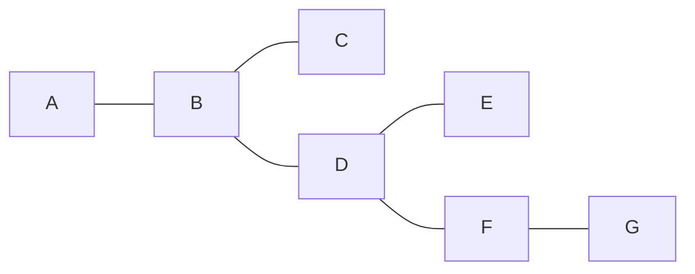
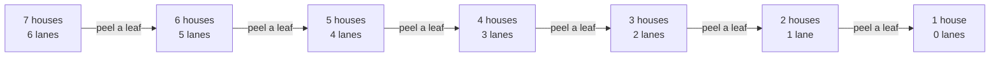

# Trees: connected with no cycles, exactly one fewer edge than vertices, and one route between any two points

[Syllabus](../../../SYLLABUS.md) → [Combinatorics and graphs](../README.md) → [Trees and Cheapest Routes](../README.md#s10) → Trees

---

## General Overview

A village has seven houses, A to G, and six lanes: A-B, B-C, B-D, D-E, D-F and F-G. Every house can be reached from every other, and nobody has a way round: leave a house, never turning back along the lane just used, and there is no way home.

Cut one lane and somebody is stranded: lose B-D and A, B, C lose contact with D, E, F, G. Lay one lane and a loop appears: A to G closes the ring A, B, D, F, G. The village has the lanes it needs, not one spare.

Such a map is a **tree**, the name Cayley gave it in 1857: *connected*, meaning some route joins every pair of houses ([Connected or not](../09-Graphs%20-%20Dots%20and%20Lines/04-connectivity-and-breadth-first-search.md)), and free of any *cycle*, meaning no route leaves a house and comes back to it repeating nothing else on the way ([Walks, paths and cycles](../09-Graphs%20-%20Dots%20and%20Lines/03-walks-paths-and-cycles.md)). Four descriptions with nothing obvious in common then pick out the same maps, two of them counts that trace no route.

**Connected with no cycle, one route between every pair, and one lane fewer than houses paired with either joined-up or loop-free — all the same maps, and every one of them with two houses or more has at least two houses served by a single lane.**

**What kind of fact this is:** a theorem, proved on this card in Why it works; tree, forest and leaf are definitions.

### The picture: seven houses, six lanes, no loop



B and D carry three lanes each, F two; A, C, E and G carry one apiece.

---

## The formula

Notation first. A map is its houses and the pairs a lane joins: $V$ the houses, $E$ the lanes, $n$ and $m$ how many of each ([Graphs](../09-Graphs%20-%20Dots%20and%20Lines/01-graphs-vertices-and-edges.md)). $G$ is any map, $T$ a tree; $c(G)$ counts its pieces and $\deg(v)$ the lanes at house $v$, its **degree** ([Degrees and the handshaking lemma](../09-Graphs%20-%20Dots%20and%20Lines/02-degree-and-handshaking.md)). A house of degree 1 is a **leaf**, and the double arrow $\Longleftrightarrow$ reads "exactly when".

$$m = n - 1$$

**Read it aloud:** a tree carries one lane fewer than it has houses.

$$\text{connected, no cycle} \;\Longleftrightarrow\; \text{one route per pair} \;\Longleftrightarrow\; \text{connected, } m = n - 1 \;\Longleftrightarrow\; \text{no cycle, } m = n - 1$$

A map with no cycle anywhere, joined up or not, is a **forest**: trees side by side. Each piece spends one lane fewer than it has houses — the forest law.

$$m = n - c(G)$$

| Symbol | Plain meaning | In our example | Push it up and the answer… |
| --- | --- | --- | --- |
| $T$, $G$ | a tree; any map, tree or not | the village; the trap, 6 lanes in 2 pieces | — |
| $V$, $E$, $n$, $m$ | houses, lanes, how many of each | A to G; six lanes; 7 and 6 | one more house than lanes, always |
| $c(G)$ | pieces the map falls into | 1, then 2 once B-D is cut | one lane fewer for each extra piece |
| $\deg(v)$ | lanes at a house | 3 at B, 1 at A | fewer leaves |
| $v$, $w$, $x$, $z$ | houses in general | B, D | — |

### When it holds

- **Finitely many houses.** A row running on for ever in both directions is joined up and loop-free with no leaf, and leaves $n - 1$ nothing to count.
- **Lanes both ways, one per pair at most, none from a house to itself.** A second lane between one pair, or a lane looping back on one house, adds no house and breaks the count without making a cycle of three. One-way lanes split each question in two ([Directed graphs](../09-Graphs%20-%20Dots%20and%20Lines/06-directed-graphs-and-topological-order.md)).
- **The count never travels alone.** Maps neither joined up nor loop-free also spend six lanes on seven houses.

---

## Why it works

### Step 0: a second route is a loop, and a loop is a second route

Follow two different routes from $v$ to $w$. Let $x$ be the last house they share before parting, $z$ the first beyond $x$ lying on both — they meet again, since both end at $w$. The two stretches from $x$ to $z$ share only their ends, so together they close a loop, and they cannot both be the lane from $x$ to $z$, there being at most one. The loop takes in three houses or more: a cycle. Read backwards, a cycle gives two routes between any two of its houses, one each way round. Spare routes and loops are one fact seen twice.

### Step 1: so joined up and loop-free gives one route per pair

Connected gives every pair a route; no cycle forbids a second. Exactly one each: 21 pairs, 21 routes, all listed by the check. Backwards, one route per pair is connectedness, and a cycle would have supplied a second.

### Step 2: two houses or more means two leaves or more

Finitely many routes, so one of them is longest. Its first house is a leaf. A second lane there would run to a house $w$: with $w$ off the route, that lane on the front makes a longer route; with $w$ on it, the stretch along to $w$ closes a loop. Neither is allowed, and the far end goes the same way. The village has four leaves, A, C, E and G, its degrees adding to 12 — twice its six lanes ([Degrees and the handshaking lemma](../09-Graphs%20-%20Dots%20and%20Lines/02-degree-and-handshaking.md)).

### Step 3: peel the leaves and the lanes count themselves

Passing through a house takes two lanes at it, so no route between two other houses passes through a leaf. Delete a leaf and its lane: still connected, still loop-free — a tree with one house and one lane fewer. Repeat.



Each step drops a house and a lane together, which is all $m = n - 1$ says: one house holds $0 = 1 - 1$ lanes, and a tree on $n$ houses is a tree on one fewer with a house and a lane put back ([Induction](../../01-Foundations/06-Proof/04-proof-by-induction.md)).

### Step 4: the count, with one companion, is enough

Connected with $m = n - 1$ forbids a cycle. Drop a lane of the supposed cycle and the map stays connected, the rest of the loop still joining that lane's ends; keep going until no loop is left. What remains is a tree, with $n - 1$ lanes by Step 3 — yet lanes were thrown away. So there was no cycle.

Loop-free with $m = n - 1$ forces a single piece: every piece is a tree in its own right, carrying one lane fewer than its houses, so the pieces add to the forest law, and $m = n - 1$ makes $c(G) = 1$.

<details>
<summary>Detailed proof: why four descriptions need only six implications</summary>

Call them (1) connected and no cycle, (2) one route between each pair, (3) connected and $m = n - 1$, (4) no cycle and $m = n - 1$. Steps 0 to 4 prove (1) $\Longleftrightarrow$ (2), (1) $\Longleftrightarrow$ (3) and (1) $\Longleftrightarrow$ (4). Six one-way proofs through the hub (1), not the twelve that every ordered pair would need.

</details>

### Step 5: every lane a bridge, every missing lane one loop

Each lane is the only route between its own two ends, so losing it leaves none: the pieces go from one to two and the forest law reads off the remainder, $5 = 7 - 2$ lanes. Every lane of a tree is therefore a **bridge**, a lane whose loss raises the piece count ([Connected or not](../09-Graphs%20-%20Dots%20and%20Lines/04-connectivity-and-breadth-first-search.md)). Adding a lane closes the unique old route between its ends into a ring, and no other: a new cycle must use the new lane, and the route it completes is unique. The check cuts all six lanes and adds all fifteen missing ones.

A second road lists maps instead of arguing: of the 1024 lane maps on five houses, all four descriptions pick the same 125. Counting trees rather than testing them is [Spanning trees](03-spanning-trees-and-cayleys-formula.md).

---

## Worked numbers, by hand

| Step | Arithmetic | Value |
| --- | --- | --- |
| routes, pair by pair | 21 pairs, every route listed | **1 each** |
| degrees added up, then the leaves | 1 + 3 + 1 + 3 + 1 + 2 + 1 | **12 = 2 × 6 lanes; A, C, E, G** |
| cut B-D, then D-F too | pieces of 3 and 4, then one more | **5 = 7 − 2; 4 = 7 − 3** |
| add A-G | the ring A B D F G | **1 loop, 5 lanes on it** |

Six lanes for seven houses, 6 = 7 − 1: every lane load-bearing, every pair one route apart.

### What breaks if you drop a piece

| Mistake | Comes out at | What went wrong |
| --- | --- | --- |
| Six lanes taken as proof enough | 6 lanes = 7 − 1, yet 2 pieces and a loop of 3 | A triangle beside a path spends the budget badly |
| A forest called a tree | 5 lanes over 2 pieces, sized 3 and 4 | Cutting B-D leaves $n - c(G)$ lanes, not $n - 1$ |
| A spare lane laid for safety | 7 lanes, only 2 of which strand anyone | A lane on a ring is not load-bearing |

The code prints all three.

---

## Code, from first principles, and it actually runs

Nothing is imported. Two roads share no arithmetic: every route listed pair by pair, and a flood outward plus repeated peeling of one-lane houses, which mentions no route. Both cut each lane, add each missing one, and run the four descriptions over all 1024 maps on five houses.

### Python

```python
# Trees -- the check behind the card.  Nothing is imported.  The village: seven houses A to G and
# the six lanes A-B B-C B-D D-E D-F F-G.  Every claim is reached by two roads sharing no arithmetic:
# routes listed out one pair at a time, and a flood plus repeated peeling of one-lane houses.  The
# census at the end runs the same four descriptions over all 1024 lane maps on five houses.
NAMES, LANES = "ABCDEFG", [(0, 1), (1, 2), (1, 3), (3, 4), (3, 5), (5, 6)]
TRAP = [(0, 1), (1, 2), (2, 0), (3, 4), (4, 5), (5, 6)]       # 6 lanes, a loop of 3, two pieces
def nbrs(n, es): return {v: sorted(w for e in es for w in e if v in e and w != v) for v in range(n)}
def routes(nb, u, goal, seen=()):             # road one: every route from u to goal repeating no house
    if u == goal: return [seen + (u,)]
    return [r for w in nb[u] if w not in seen + (u,) for r in routes(nb, w, goal, seen + (u,))]
def piece(nb, s):                             # road two: the houses a flood from s reaches
    block, more = set(), {s}
    while more: block |= more; more = {w for v in block for w in nb[v]} - block
    return tuple(sorted(block))
def pieces(n, es): nb = nbrs(n, es); return sorted({piece(nb, s) for s in range(n)})
def peel(n, es):                              # road two: strip off a house with one lane, and again
    left, rest, trail = list(range(n)), sorted(tuple(sorted(e)) for e in es), [(n, len(es))]
    while (ones := [v for v in left if sum(v in e for e in rest) == 1]):
        left.remove(ones[0]); rest = [e for e in rest if ones[0] not in e]; trail.append((len(left), len(rest)))
    return left, rest, trail
def pairs(n): return [(u, v) for u in range(n) for v in range(u + 1, n)]
def gaps(n, es): return [p for p in pairs(n) if p not in [tuple(sorted(e)) for e in es]]
def cut(n, es, e): return pieces(n, [f for f in es if f != e])
def one_each(n, es): nb = nbrs(n, es); return all(len(routes(nb, u, v)) == 1 for u, v in pairs(n))
def strand(n, es): return [e for e in es if len(cut(n, es, e)) > len(pieces(n, es))]
def choose(a, b): return 1 if b in (0, a) else choose(a - 1, b - 1) + choose(a - 1, b)  # Pascal's rule
def ln(e): return NAMES[e[0]] + "-" + NAMES[e[1]]

N, NB, miss = 7, nbrs(7, LANES), gaps(7, LANES)
counts, deg = [len(routes(NB, u, v)) for u, v in pairs(N)], [len(NB[v]) for v in range(N)]
blocks, (left, rest, trail) = pieces(N, LANES), peel(N, LANES)
cuts = [(ln(e), [len(b) for b in cut(N, LANES, e)]) for e in LANES]
closed = [(e, r) for e in miss for r in [routes(NB, e[0], e[1])[0]] for p in [peel(N, LANES + [e])] if sorted(p[0]) == sorted(r) and len(p[1]) == len(r)]
ring = next(r for e, r in closed if e == (0, 6))
f1, f2 = cut(N, LANES, (1, 3)), pieces(N, [f for f in LANES if f not in ((1, 3), (3, 5))])
maps = [[p for i, p in enumerate(pairs(5)) if mask >> i & 1] for mask in range(1 << 10)]   # every lane map on 5 houses
flags = [(len(pieces(5, es)) == 1, not peel(5, es)[1], len(es) == 4, one_each(5, es)) for es in maps]
sets = [[m for m, (w, lf, f, o) in zip(maps, flags) if t(w, lf, f, o)] for t in (lambda w, lf, f, o: w and lf,
        lambda w, lf, f, o: o, lambda w, lf, f, o: w and f, lambda w, lf, f, o: lf and f)]
four, same = sum(len(m) == 4 for m in maps), all(s == sets[0] for s in sets)

rows = [("seven houses A to G, the six lanes", f"{' '.join(ln(e) for e in LANES)}: {len(LANES)} lanes, {N} houses, one fewer"),
        ("routes listed out, one pair at a time", f"{len(counts)} pairs, fewest {min(counts)} route, most {max(counts)} route"),
        ("flood from A, then peel one-lane houses", f"{len(blocks)} piece of {len(blocks[0])}, peeled to {len(left)} house and {len(rest)} lanes"),
        ("houses and lanes down the peeling", " ".join(f"{h}-{m}" for h, m in trail)),
        ("degrees A to G, their sum, the leaves", f"{' '.join(str(d) for d in deg)}, sum {sum(deg)} = 2 x {len(LANES)} lanes, leaves {' '.join(NAMES[v] for v in range(N) if deg[v] == 1)}"),
        ("cut one lane, pieces left, A's side first", ", ".join(f"{a} {b[0]}+{b[1]}" for a, b in cuts)),
        ("lanes whose loss strands someone", f"{len(strand(N, LANES))} of {len(LANES)}, each cut leaving 2 pieces and {len(LANES) - 1} lanes = {N} - 2"),
        (f"add one of the {len(miss)} missing lanes", f"{len(closed)} of {len(miss)} close exactly one loop"),
        (f"A-G closes the loop {' '.join(NAMES[v] for v in ring)}", f"{len(ring)} houses, {len(ring)} lanes; now only {len(strand(N, LANES + [(0, 6)]))} of {len(LANES) + 1} lanes strand someone"),
        ("trap: triangle A-B-C beside path D-E-F-G", f"{len(TRAP)} lanes = {N} - 1, {len(pieces(N, TRAP))} pieces, a loop of {len(peel(N, TRAP)[1])}"),
        ("forest: cut B-D, then D-F as well", f"{len(f1)} pieces sized {len(f1[0])} and {len(f1[1])}, {len(LANES) - 1} lanes = {N} - 2; then {len(f2)} pieces, {len(LANES) - 2} lanes = {N} - 3"),
        (f"five houses, all {len(maps)} lane maps", f"connected and loop-free {len(sets[0])}, one route per pair {len(sets[1])}, connected with 4 lanes {len(sets[2])}, loop-free with 4 lanes {len(sets[3])}"),
        ("the four descriptions pick the same maps", f"{'yes' if same else 'no'}, {len(sets[0])} of them; {four} maps use 4 lanes, {four - len(sets[0])} of those not trees")]
for a, b in rows: print(f"{a:<46}{b}")
assert min(counts) == max(counts) == 1 and len(blocks) == 1 and (len(left), len(rest)) == (1, 0)
assert trail == [(7, 6), (6, 5), (5, 4), (4, 3), (3, 2), (2, 1), (1, 0)] and sum(deg) == 2 * len(LANES) and (len(pieces(N, TRAP)), len(peel(N, TRAP)[1]), len(f2)) == (2, 3, 3)
assert [b for _, b in cuts] == [[1, 6], [6, 1], [3, 4], [6, 1], [5, 2], [6, 1]] and len(closed) == len(miss) == 15 and (len(strand(N, LANES)), len(strand(N, LANES + [(0, 6)]))) == (6, 2)
assert same and len(sets[0]) == 125 and four == choose(10, 4) == 210
print("ALL CHECKS PASS")
```

**Ran 2026-09-19 on macOS, Python 3.14.6, standard library only. All checks passed. Output, pasted from the run:**

```
seven houses A to G, the six lanes            A-B B-C B-D D-E D-F F-G: 6 lanes, 7 houses, one fewer
routes listed out, one pair at a time         21 pairs, fewest 1 route, most 1 route
flood from A, then peel one-lane houses       1 piece of 7, peeled to 1 house and 0 lanes
houses and lanes down the peeling             7-6 6-5 5-4 4-3 3-2 2-1 1-0
degrees A to G, their sum, the leaves         1 3 1 3 1 2 1, sum 12 = 2 x 6 lanes, leaves A C E G
cut one lane, pieces left, A's side first     A-B 1+6, B-C 6+1, B-D 3+4, D-E 6+1, D-F 5+2, F-G 6+1
lanes whose loss strands someone              6 of 6, each cut leaving 2 pieces and 5 lanes = 7 - 2
add one of the 15 missing lanes               15 of 15 close exactly one loop
A-G closes the loop A B D F G                 5 houses, 5 lanes; now only 2 of 7 lanes strand someone
trap: triangle A-B-C beside path D-E-F-G      6 lanes = 7 - 1, 2 pieces, a loop of 3
forest: cut B-D, then D-F as well             2 pieces sized 3 and 4, 5 lanes = 7 - 2; then 3 pieces, 4 lanes = 7 - 3
five houses, all 1024 lane maps               connected and loop-free 125, one route per pair 125, connected with 4 lanes 125, loop-free with 4 lanes 125
the four descriptions pick the same maps      yes, 125 of them; 210 maps use 4 lanes, 85 of those not trees
ALL CHECKS PASS
```

### Rust

Same numbers, same labels, built with `rustc --edition 2021 -O`.

```rust
// Trees -- the same check as the Python, in Rust.  No crates.  The village: seven houses A to G and
// the six lanes A-B B-C B-D D-E D-F F-G.  Every claim is reached by two roads sharing no arithmetic:
// routes listed out one pair at a time, and a flood plus repeated peeling of one-lane houses.  The
// census at the end runs the same four descriptions over all 1024 lane maps on five houses.
const NAMES: [char; 7] = ['A', 'B', 'C', 'D', 'E', 'F', 'G'];
const LANES: [(usize, usize); 6] = [(0, 1), (1, 2), (1, 3), (3, 4), (3, 5), (5, 6)];
const TRAP: [(usize, usize); 6] = [(0, 1), (1, 2), (2, 0), (3, 4), (4, 5), (5, 6)];  // 6 lanes, a loop of 3, two pieces
type L = [(usize, usize)];
fn nbrs(n: usize, es: &L) -> Vec<Vec<usize>> {          // the houses one lane from each house
    (0..n).map(|v| { let mut l: Vec<usize> = es.iter().filter(|e| e.0 == v || e.1 == v).map(|e| if e.0 == v { e.1 } else { e.0 }).collect(); l.sort(); l }).collect()
}
fn routes(nb: &[Vec<usize>], u: usize, goal: usize, seen: &mut Vec<usize>, out: &mut Vec<Vec<usize>>) {
    seen.push(u);                                       // road one: every route from u to goal repeating no house
    if u == goal { out.push(seen.clone()) } else {
        for &w in &nb[u] { if !seen.contains(&w) { routes(nb, w, goal, seen, out) } } }
    seen.pop();
}
fn found(nb: &[Vec<usize>], u: usize, goal: usize) -> Vec<Vec<usize>> { let mut out = Vec::new(); routes(nb, u, goal, &mut Vec::new(), &mut out); out }
fn pieces(n: usize, es: &L) -> Vec<Vec<usize>> {        // road two: flood outward from each house
    let nb = nbrs(n, es);
    let mut out: Vec<Vec<usize>> = (0..n).map(|s| { let mut b = vec![s];
        loop { let more: Vec<usize> = (0..n).filter(|&w| !b.contains(&w) && b.iter().any(|&v| nb[v].contains(&w))).collect();
               if more.is_empty() { break } b.extend(more) }
        b.sort(); b }).collect();
    out.sort(); out.dedup(); out
}
fn peel(n: usize, es: &L) -> (Vec<usize>, Vec<(usize, usize)>, Vec<(usize, usize)>) {
    let (mut left, mut trail): (Vec<usize>, Vec<(usize, usize)>) = ((0..n).collect(), vec![(n, es.len())]);   // road two: strip off a house with one lane, and again
    let mut rest: Vec<(usize, usize)> = es.iter().map(|&(u, v)| (u.min(v), u.max(v))).collect(); rest.sort();
    while let Some(v) = left.iter().copied().find(|&v| rest.iter().filter(|e| e.0 == v || e.1 == v).count() == 1) {
        left.retain(|&x| x != v); rest.retain(|e| e.0 != v && e.1 != v); trail.push((left.len(), rest.len()));
    }
    (left, rest, trail)
}
fn pairs(n: usize) -> Vec<(usize, usize)> { (0..n).flat_map(|u| (u + 1..n).map(move |v| (u, v))).collect() }
fn gaps(n: usize, es: &L) -> Vec<(usize, usize)> { pairs(n).into_iter().filter(|p| !es.iter().any(|&(u, v)| (u.min(v), u.max(v)) == *p)).collect() }
fn cut(n: usize, es: &L, e: (usize, usize)) -> Vec<Vec<usize>> { pieces(n, &es.iter().copied().filter(|&f| f != e).collect::<Vec<_>>()) }
fn one_each(n: usize, es: &L) -> bool { let nb = nbrs(n, es); pairs(n).iter().all(|&(u, v)| found(&nb, u, v).len() == 1) }
fn strand(n: usize, es: &L) -> usize { es.iter().filter(|&&e| cut(n, es, e).len() > pieces(n, es).len()).count() }
fn choose(a: u64, b: u64) -> u64 { if b == 0 || b == a { 1 } else { choose(a - 1, b - 1) + choose(a - 1, b) } }  // Pascal's rule
fn ln(e: (usize, usize)) -> String { format!("{}-{}", NAMES[e.0], NAMES[e.1]) }
fn nm(vs: &[usize]) -> String { vs.iter().map(|&v| NAMES[v].to_string()).collect::<Vec<String>>().join(" ") }
fn main() {
    let (n, nb, miss) = (7usize, nbrs(7, &LANES), gaps(7, &LANES));
    let counts: Vec<usize> = pairs(n).iter().map(|&(u, v)| found(&nb, u, v).len()).collect();
    let (deg, blocks, (left, rest, trail)) = ((0..n).map(|v| nb[v].len()).collect::<Vec<usize>>(), pieces(n, &LANES), peel(n, &LANES));
    let cuts: Vec<(String, Vec<usize>)> = LANES.iter().map(|&e| (ln(e), cut(n, &LANES, e).iter().map(|b| b.len()).collect())).collect();
    let mut closed: Vec<((usize, usize), Vec<usize>)> = Vec::new();
    for &e in &miss {
        let (r, (l, rst, _)) = (found(&nb, e.0, e.1)[0].clone(), peel(n, &[LANES.to_vec(), vec![e]].concat()));
        let mut hs = r.clone(); hs.sort();
        if l == hs && rst.len() == r.len() { closed.push((e, r)) }
    }
    let ring = closed.iter().find(|c| c.0 == (0, 6)).unwrap().1.clone();
    let (f1, f2) = (cut(n, &LANES, (1, 3)), pieces(n, &LANES.iter().copied().filter(|&f| f != (1, 3) && f != (3, 5)).collect::<Vec<_>>()));
    let maps: Vec<Vec<(usize, usize)>> = (0..1usize << 10).map(|mask| pairs(5).into_iter().enumerate().filter(|(i, _)| mask >> i & 1 == 1).map(|(_, p)| p).collect()).collect();
    let flags: Vec<(bool, bool, bool, bool)> = maps.iter().map(|es| (pieces(5, es).len() == 1, peel(5, es).1.is_empty(), es.len() == 4, one_each(5, es))).collect();
    let sets: Vec<Vec<usize>> = (0..4).map(|k| (0..maps.len()).filter(|&i| { let (w, lf, f, o) = flags[i]; [w && lf, o, w && f, lf && f][k] }).collect()).collect();
    let (four, same) = (maps.iter().filter(|m| m.len() == 4).count(), sets.iter().all(|s| *s == sets[0]));
    let row = |a: String, b: String| println!("{:<46}{}", a, b);
    row("seven houses A to G, the six lanes".to_string(), format!("{}: {} lanes, {} houses, one fewer", LANES.iter().map(|&e| ln(e)).collect::<Vec<String>>().join(" "), LANES.len(), n));
    row("routes listed out, one pair at a time".to_string(), format!("{} pairs, fewest {} route, most {} route", counts.len(), counts.iter().min().unwrap(), counts.iter().max().unwrap()));
    row("flood from A, then peel one-lane houses".to_string(), format!("{} piece of {}, peeled to {} house and {} lanes", blocks.len(), blocks[0].len(), left.len(), rest.len()));
    row("houses and lanes down the peeling".to_string(), trail.iter().map(|(h, m)| format!("{}-{}", h, m)).collect::<Vec<String>>().join(" "));
    row("degrees A to G, their sum, the leaves".to_string(), format!("{}, sum {} = 2 x {} lanes, leaves {}", deg.iter().map(|d| d.to_string()).collect::<Vec<String>>().join(" "), deg.iter().sum::<usize>(), LANES.len(), nm(&(0..n).filter(|&v| deg[v] == 1).collect::<Vec<usize>>())));
    row("cut one lane, pieces left, A's side first".to_string(), cuts.iter().map(|(a, b)| format!("{} {}+{}", a, b[0], b[1])).collect::<Vec<String>>().join(", "));
    row("lanes whose loss strands someone".to_string(), format!("{} of {}, each cut leaving 2 pieces and {} lanes = {} - 2", strand(n, &LANES), LANES.len(), LANES.len() - 1, n));
    row(format!("add one of the {} missing lanes", miss.len()), format!("{} of {} close exactly one loop", closed.len(), miss.len()));
    row(format!("A-G closes the loop {}", nm(&ring)), format!("{} houses, {} lanes; now only {} of {} lanes strand someone", ring.len(), ring.len(), strand(n, &[LANES.to_vec(), vec![(0, 6)]].concat()), LANES.len() + 1));
    row("trap: triangle A-B-C beside path D-E-F-G".to_string(), format!("{} lanes = {} - 1, {} pieces, a loop of {}", TRAP.len(), n, pieces(n, &TRAP).len(), peel(n, &TRAP).1.len()));
    row("forest: cut B-D, then D-F as well".to_string(), format!("{} pieces sized {} and {}, {} lanes = {} - 2; then {} pieces, {} lanes = {} - 3", f1.len(), f1[0].len(), f1[1].len(), LANES.len() - 1, n, f2.len(), LANES.len() - 2, n));
    row(format!("five houses, all {} lane maps", maps.len()), format!("connected and loop-free {}, one route per pair {}, connected with 4 lanes {}, loop-free with 4 lanes {}", sets[0].len(), sets[1].len(), sets[2].len(), sets[3].len()));
    row("the four descriptions pick the same maps".to_string(), format!("{}, {} of them; {} maps use 4 lanes, {} of those not trees", if same { "yes" } else { "no" }, sets[0].len(), four, four - sets[0].len()));
    assert!(*counts.iter().min().unwrap() == 1 && *counts.iter().max().unwrap() == 1 && blocks.len() == 1 && (left.len(), rest.len()) == (1, 0));
    assert!(trail == vec![(7, 6), (6, 5), (5, 4), (4, 3), (3, 2), (2, 1), (1, 0)] && deg.iter().sum::<usize>() == 2 * LANES.len() && (pieces(n, &TRAP).len(), peel(n, &TRAP).1.len(), f2.len()) == (2, 3, 3));
    assert!(cuts.iter().map(|c| c.1.clone()).collect::<Vec<Vec<usize>>>() == vec![vec![1, 6], vec![6, 1], vec![3, 4], vec![6, 1], vec![5, 2], vec![6, 1]] && closed.len() == miss.len() && miss.len() == 15 && (strand(n, &LANES), strand(n, &[LANES.to_vec(), vec![(0, 6)]].concat())) == (6, 2));
    assert!(same && sets[0].len() == 125 && four == choose(10, 4) as usize && four == 210);
    println!("ALL CHECKS PASS");
}
```

**Ran 2026-09-19 on macOS, rustc 1.98.1, no crates. All checks passed. Output, pasted from the run:**

```
seven houses A to G, the six lanes            A-B B-C B-D D-E D-F F-G: 6 lanes, 7 houses, one fewer
routes listed out, one pair at a time         21 pairs, fewest 1 route, most 1 route
flood from A, then peel one-lane houses       1 piece of 7, peeled to 1 house and 0 lanes
houses and lanes down the peeling             7-6 6-5 5-4 4-3 3-2 2-1 1-0
degrees A to G, their sum, the leaves         1 3 1 3 1 2 1, sum 12 = 2 x 6 lanes, leaves A C E G
cut one lane, pieces left, A's side first     A-B 1+6, B-C 6+1, B-D 3+4, D-E 6+1, D-F 5+2, F-G 6+1
lanes whose loss strands someone              6 of 6, each cut leaving 2 pieces and 5 lanes = 7 - 2
add one of the 15 missing lanes               15 of 15 close exactly one loop
A-G closes the loop A B D F G                 5 houses, 5 lanes; now only 2 of 7 lanes strand someone
trap: triangle A-B-C beside path D-E-F-G      6 lanes = 7 - 1, 2 pieces, a loop of 3
forest: cut B-D, then D-F as well             2 pieces sized 3 and 4, 5 lanes = 7 - 2; then 3 pieces, 4 lanes = 7 - 3
five houses, all 1024 lane maps               connected and loop-free 125, one route per pair 125, connected with 4 lanes 125, loop-free with 4 lanes 125
the four descriptions pick the same maps      yes, 125 of them; 210 maps use 4 lanes, 85 of those not trees
ALL CHECKS PASS
```

The two outputs match line for line.

> [!TIP]
> **Try changing**
> Guess first, then run it. The asserts are pinned to this village, so expect one to stop it.
> - **Lay the spare lane.** Add `(0, 6)` to `LANES`: seven lanes, one ring, and the most routes a pair has rises to 2.
> - **Cut the middle lane.** Delete `(1, 3)`: two pieces, the peeling ending at 2 houses with no lanes — a forest.
> - **Shrink the census budget.** Change the `len(es) == 4` test to `len(es) == 3`: no map on five houses is joined up by only three lanes, so that list empties and the four part company.

---

## The usual mistake

> [!warning]
> **Reading "one lane fewer than houses" as the whole test.** The number is right and not enough alone: a triangle A-B-C beside the path D-E-F-G spends six lanes on seven houses, with a loop and two pieces. Pair the count with joined-up, or with loop-free.
>
> - **Calling a forest a tree.** Cutting B-D leaves 5 lanes in 2 pieces, sized 3 and 4; loop-free maps obey $m = n - c(G)$, and only one piece makes that $n - 1$.
> - **Expecting every house to have two lanes.** Give every house two and a loop appears somewhere: a finite tree has at least two leaves, four here.
> - **Reading "one route" as "one shortest route".** In a tree the route between a pair is the only one there is.

---

## Where you meet it in real life

- **Networks with no spare link.** A cable run with every link load-bearing is cheapest to build and worst to lose; the cheapest such skeleton when lanes have prices is [The cheapest skeleton](04-minimum-spanning-trees.md).
- **Folders, org charts, family lines.** One route from the top to each item is this property read downward, and naming a top house is what makes a tree rooted: [Rooted trees](02-rooted-and-binary-trees.md).
- **What a search leaves behind.** The lanes a flood keeps as it marks new houses ([Connected or not](../09-Graphs%20-%20Dots%20and%20Lines/04-connectivity-and-breadth-first-search.md)) form a tree over the piece it reached; so does a sentence broken into phrases within phrases, Grammars and a stack.

> **Say it back**
> A tree is a map that is joined up and carries no loop. Loops and spare routes are the same thing, so exactly one route joins every pair. Peel off a one-lane house again and again — a finite tree always has two to start from — and each peel costs a house and a lane: one lane fewer than houses, six for seven. Cut a lane and the pieces rise; add one and a single loop appears.

---

## What this builds on

- [Walks, paths and cycles](../09-Graphs%20-%20Dots%20and%20Lines/03-walks-paths-and-cycles.md): routes that repeat no house, and the cycle this card forbids.
- [Connected or not](../09-Graphs%20-%20Dots%20and%20Lines/04-connectivity-and-breadth-first-search.md): joined up, the pieces a map falls into, and the flood that finds them.
- [Induction](../../01-Foundations/06-Proof/04-proof-by-induction.md): the argument behind peeling leaves until one house is left.

## Where this goes next

- [Rooted trees](02-rooted-and-binary-trees.md): the same tree with one house named the top, so every other has a parent and a depth.
- [Spanning trees](03-spanning-trees-and-cayleys-formula.md): trees inside a larger map, and how many a map holds.
- [Planar graphs](../12-Planarity%20and%20Colouring/01-planar-graphs-and-eulers-formula.md): what becomes of $m = n - 1$ when loops are allowed but crossings are not.
- Grammars and a stack: trees as the record of how a sentence or a program was built.

Nothing here told one lane from another: put a price on each and the cheapest skeleton becomes a question, [The cheapest skeleton](04-minimum-spanning-trees.md).

---

## Sources

Verified 19 Sep 2026: every link below resolves to the publisher's page.

- Diestel, Reinhard. *Graph Theory*, 6th ed. Springer GTM 173, 2025. [Book site, main text free online](https://diestel-graph-theory.com/). Section 1.5, in standard form.
- Bondy, J. A., and U. S. R. Murty. *Graph Theory*. Springer GTM 244, 2008. [Publisher record, doi:10.1007/978-1-84628-970-5](https://doi.org/10.1007/978-1-84628-970-5). Chapter 4, "Trees": the two-leaf argument.
- Knuth, Donald E. *The Art of Computer Programming, Volume 1*, 3rd ed. Addison-Wesley. [Publisher page](https://www.informit.com/store/art-of-computer-programming-volume-1-fundamental-algorithms-9780201896831). Section 2.3.4.1, peeling written out.
- *Contemporary Mathematics*, section 12.10, "Trees." OpenStax. [Textbook page](https://openstax.org/books/contemporary-mathematics/pages/12-10-trees). Free, gentler.
