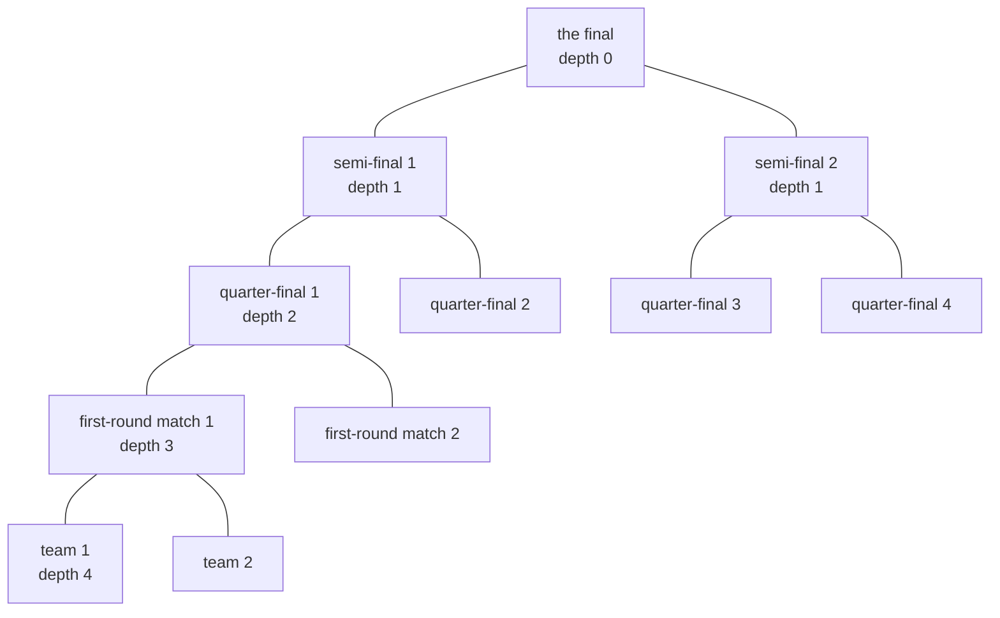
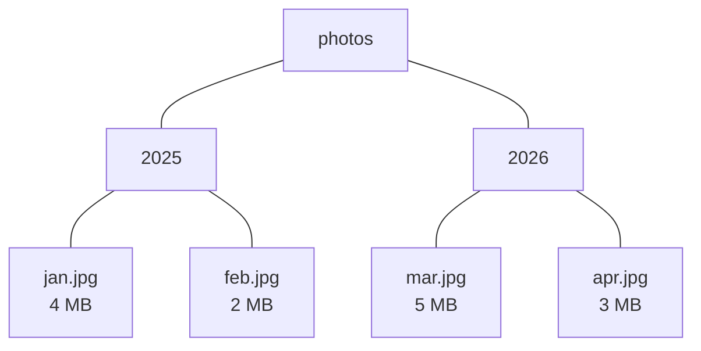

# Rooted trees: hang a tree from one vertex and you get parents, children, depth and the shape behind every file system

[Syllabus](../../../SYLLABUS.md) → [Combinatorics and graphs](../README.md) → [Trees and Cheapest Routes](../README.md#s10) → Rooted trees

---

## General Overview

Sixteen teams enter a knockout cup. Lose once and you are out. Eight matches settle the first round, four the quarter-finals, two the semi-finals, then the final: fifteen matches, one champion.

Draw it as a graph: a dot per team, a dot per match, a line from each match down to the two feeding it. That is 31 dots and 30 lines, one piece, no way round in a circle — a tree ([Trees](01-trees.md)).

A tree on paper has no top until one is named. Name the final and hold it up; everything else dangles. Every dot but the final now has one above it, the one it feeds, and below it the dots feeding it. Family words fit: **parent** above, **children** below, **leaf** where nothing hangs — the sixteen teams. Steps down give each dot a **depth**, the final 0 and the teams 4; the largest depth is the **height**, 4 here. Every match has two feeders, so each level holds twice the one above.

**Naming one vertex the root turns a tree into a hierarchy: every other vertex has one parent above it and its children below, and where each vertex has two children and every leaf sits at one depth the levels double — 1, 2, 4, 8, 16, adding to 31, one short of the next double.**

**What kind of fact this is:** a definition, rooting a tree and the words that come with it. The vertex count is a theorem, proved on this card in Why it works; the three walks are methods.

### The picture: the cup draw, hung from the final



One branch is drawn to the bottom; the other three quarter-finals carry the same two levels.

---

## The formula

Notation first, in words. A graph's dots are vertices, its lines edges, and $n$ counts the vertices ([Graphs](../09-Graphs%20-%20Dots%20and%20Lines/01-graphs-vertices-and-edges.md)). Write $T$ for a tree, $r$ for the vertex named its **root**. The **depth** $d(v)$ of a vertex $v$ counts the edges from $r$ down to it. The **height** $h$ is the largest depth, and $k$ stands for whichever depth is being counted.

Three words about children. **Binary**: at most two children, told apart as left and right. **Full**: two or none at every vertex. **Perfect**: full, with every leaf at the same depth — the cup's shape, all sixteen teams entering in one round.

For a perfect binary tree:

$$n = 1 + 2 + 4 + \dots + 2^{h} = 2^{h+1} - 1$$

**Read it aloud:** one root, then two, then four, doubling per level and landing one short of the next double.

$$\text{leaves} = 2^{h}, \qquad \text{inner vertices} = 2^{h} - 1$$

The last level holds the leaves; a vertex with children is **inner**. The two differ by one: 16 teams, 15 matches.

Three rules read a tree out, each calling itself on the subtrees, the plus joining lists:

$$\text{pre}(v) = [\,v\,] + \text{pre}(\text{left}) + \text{pre}(\text{right})$$
$$\text{in}(v) = \text{in}(\text{left}) + [\,v\,] + \text{in}(\text{right})$$
$$\text{post}(v) = \text{post}(\text{left}) + \text{post}(\text{right}) + [\,v\,]$$

**Read it aloud:** read the left half, read the right half; the only choice is where the vertex names itself.

| Symbol | Plain meaning | In our example | Push it up and the answer… |
| --- | --- | --- | --- |
| $T$ | a tree, root named | the cup draw | — |
| $r$ | the root, where it hangs | the final | depths change |
| $n$ | vertices, counted | 31 | — |
| $v$ | a vertex, left and right its children | a quarter-final | — |
| $d(v)$ | depth: edges below the root | a team, 4 | it hangs lower |
| $h$ | height: the largest depth | 4 | the count doubles |
| $k$ | a depth | 0 to 4 | — |
| $2^k$ | vertices at depth $k$ | 1, 2, 4, 8, 16 | — |

### When it holds

- **The root is a choice, not a property.** Rooted at a team, the same 31 vertices stand 8 deep.
- **Full and level, for the count.** Two children or none, *and* every leaf at depth $h$. A draw where each winner plays the next team in is full but stands 15 deep, where the formula claims 65535 vertices for 31.
- **Two children, for in-order.** A folder holding three things has no middle.
- **Finitely many vertices.** Each rule hands itself a smaller subtree, so a walk ends.

---

## Why it works

### Step 0: one path from the root, so every vertex has one parent

A tree holds exactly one path between any two vertices ([Trees](01-trees.md)). Fix the root: from any other vertex that path leaves along one edge, and the vertex at its far end is the parent. Every edge is now a parent-child link pointing one way, and since only the root lacks a parent the links number $n - 1$: 30 here, exactly a tree's edge count.

### Step 1: depth splits the tree into levels, and each level doubles

Depth is the length of that one path: one path, one number, so each vertex sits in exactly one level and level-by-level counting misses nothing. In a perfect tree every vertex at a depth short of $h$ has two children one level down, and each of those children has one parent back above. So level $k + 1$ holds two for each vertex of level $k$: the count doubles exactly. From one root, level $k$ holds $2^{k}$ — 1, 2, 4, 8, 16 — and the last level's number is the height.

### Step 2: add the levels up

$$1 + 2 + 4 + 8 + 16 = 31 = 2^{5} - 1$$

Why one short of the next double: double every term and each becomes the next one up, so the doubled list is the old one with the 1 dropped and $2^{h+1}$ added. So twice the total is the total, less one, plus $2^{h+1}$, leaving it at $2^{h+1} - 1$. The leaves are the last level, 16; the inner vertices the rest, 15.

### Step 3: a second count that never mentions depth

Each match sends one team home, and fifteen of the sixteen must go to leave a champion: fifteen matches, whatever the draw. The same count reads off any full binary tree. Each inner vertex has two children, so the children number twice the inner vertices — and the children are every vertex but the root. Twice the inner count is therefore the inner count plus the leaves, less one: inner vertices run one behind leaves. No height enters, which is why the level formula is the fragile one.

### Step 4: the three walks, and why each names every vertex once

A rooted binary tree splits at its root into three pieces with nothing in common — the root, the left subtree, the right subtree — together holding everything. So a rule naming the root once and handing each subtree to itself names every vertex once.

Four photographs in two year folders, in megabytes:



Seven vertices, height 2, perfect again: $2^{3} - 1 = 7$.

- **Pre-order**, the vertex before both subtrees: photos 2025 jan.jpg feb.jpg 2026 mar.jpg apr.jpg
- **In-order**, between them: jan.jpg 2025 feb.jpg photos mar.jpg 2026 apr.jpg
- **Post-order**, after both: jan.jpg feb.jpg 2025 mar.jpg apr.jpg 2026 photos

Each earns its keep. Pre-order is how a listing prints. Post-order is how a size total must finish: a folder's megabytes need its contents' first, 2025 at 6 MB, 2026 at 8 MB, photos at 14 MB. In-order is the binary-only one, and it reads keys back sorted: 1 to 7 set smaller-left come out 1 2 3 4 5 6 7.

<details>
<summary>Detailed proof: each walk names every vertex exactly once</summary>

By induction on the height. A tree of height 0 is one leaf, and all three rules return that name. Let $T$ have root $v$, and suppose the claim holds for both its subtrees, each of smaller height. Every rule returns their two lists and $[\,v\,]$ in some order, so each vertex below $v$ is named once and $v$ once. Each call takes a smaller tree, so the walk ends.

</details>

Two more routes, both in the code. Mirroring a tree — left and right swapped everywhere — turns pre-order into post-order read backwards. And addresses count the vertices with no levels: the root takes the empty word, a step left adds an L, a step right an R, so a vertex's word is as long as its depth. A perfect tree of height 4 is the words of length 0 to 4 over two letters, 31 of them ([Strings with repetition](../01-Counting%20Principles/02-strings-and-powers.md)), alphabetical order being pre-order. How many shapes are possible is counted on [Catalan everywhere](../06-Lattice%20Paths%20and%20Catalan%20Numbers/04-catalan-bijections.md).

---

## Worked numbers, by hand

| Step | Arithmetic | Value |
| --- | --- | --- |
| the five levels | 1, then doubling | 1, 2, 4, 8, **16** |
| every vertex once | 1 + 2 + 4 + 8 + 16 | **31** |
| closed form | 2^5 − 1 | **31** |
| matches | 31 − 16, and 16 − 1 | **15** |
| edges | 31 − 1 | **30** |
| rooted at a team | up 4, down 4 | **height 8** |
| the folder tree | 4 + 2, then 5 + 3, then 6 + 8 | **6, 8, 14 MB** |

Fifteen matches settle sixteen teams, in a draw of 31 vertices standing four edges deep — which is why doubling the field adds one round, not sixteen.

### What breaks if you drop a piece

| Mistake | Comes out at | What went wrong |
| --- | --- | --- |
| Five levels read as the height | 63, not 31 | Five levels stand four edges apart |
| The count formula on a bye draw | 65535, not 31 | The ladder is full, but 15 deep |
| Folder totals taken on the way in | photos 0 MB, not 14 | Subfolders must finish first |

The code prints all three.

---

## Code, from first principles, and it actually runs

Nothing is imported. Each count comes by two roads sharing no arithmetic: the tree built and scanned, then the same vertices counted as addresses, no tree in existence. The walks are checked against the mirror identity and against sorted keys.

### Python

```python
# Rooted trees -- the check behind the card.  Nothing is imported.  A 16-team knockout drawn as a binary tree:
# the final is the root, the 15 matches are the inner vertices, the 16 teams are the leaves.  Counts come by two
# roads sharing no arithmetic -- the tree built and scanned, and left/right addresses listed with no tree at all.
HEIGHT, SIZES = 4, {"jan.jpg": 4, "feb.jpg": 2, "mar.jpg": 5, "apr.jpg": 3}
FOLDER = ("photos", ("2025", ("jan.jpg", None, None), ("feb.jpg", None, None)),
                    ("2026", ("mar.jpg", None, None), ("apr.jpg", None, None)))
KEYS = ("4", ("2", ("1", None, None), ("3", None, None)), ("6", ("5", None, None), ("7", None, None)))
def full(h, a=""):                          # road one: the bracket, each vertex labelled by its address
    return (a, None, None) if h == 0 else (a, full(h - 1, a + "L"), full(h - 1, a + "R"))
def addresses(h):                           # road two: every address of length 0 to h, no tree at all
    out = [""]
    for k in range(h): out += [a + c for a in out if len(a) == k for c in "LR"]
    return out
def walk(t, order):                         # the card's three rules, each calling itself on a subtree
    if t[1] is None: return [t[0]]
    a, b, v = walk(t[1], order), walk(t[2], order), [t[0]]
    return v + a + b if order == "pre" else (a + v + b if order == "in" else a + b + v)
def mirror(t):                              # left and right swapped, all the way down
    return t if t[1] is None else (t[0], mirror(t[2]), mirror(t[1]))
def scan(t, d=0):                           # every vertex: its label, its depth, and leaf or not
    if t[1] is None: return [(t[0], d, True)]
    return [(t[0], d, False)] + scan(t[1], d + 1) + scan(t[2], d + 1)
def total(t, out):                          # post-order: a folder's megabytes, its contents finished first
    if t[1] is None: return SIZES[t[0]]
    mb = total(t[1], out) + total(t[2], out); out.append(f"{t[0]} {mb} MB"); return mb
def direct(t, out):                         # the mistake: totalled on the way in, loose files only
    if t[1] is None: return
    out.append(f"{t[0]} {sum(SIZES[c[0]] for c in (t[1], t[2]) if c[1] is None)} MB")
    direct(t[1], out); direct(t[2], out)
def dist(a, b):                             # steps between two vertices, read off their addresses
    return len(a) + len(b) - 2 * sum(1 for i in range(min(len(a), len(b))) if a[:i + 1] == b[:i + 1])
bracket, addrs, closed = full(HEIGHT), addresses(HEIGHT), 2 ** (HEIGHT + 1) - 1
s = scan(bracket); level = [sum(1 for x in s if x[1] == k) for k in range(HEIGHT + 1)]
teams, matches = [v for v, d, f in s if f], [v for v, d, f in s if not f]
lad = ("team 1", None, None)
for i in range(2, 17): lad = (f"match {i - 1}", lad, (f"team {i}", None, None))
ls, fs, tot, early = scan(lad), scan(FOLDER), [], []; total(FOLDER, tot); direct(FOLDER, early)
swaps = walk(mirror(FOLDER), "pre")[::-1] == walk(FOLDER, "post") and walk(mirror(FOLDER), "post")[::-1] == walk(FOLDER, "pre") and walk(mirror(FOLDER), "in")[::-1] == walk(FOLDER, "in")
print(f"bracket rooted at the final: height {max(x[1] for x in s)}, {len(s)} vertices, {len(s) - 1} edges")
print(f"vertices at depths 0 to {HEIGHT}: {' '.join(str(c) for c in level)}, adding to {sum(level)}")
print(f"the same total by doubling: 2^{HEIGHT + 1} - 1 = {closed}, leaves 2^{HEIGHT} = {2 ** HEIGHT}, inner 2^{HEIGHT} - 1 = {2 ** HEIGHT - 1}")
print(f"the tree walked instead: {len(teams)} teams at the leaves, {len(matches)} matches inside, so matches = teams - 1 = {len(teams) - 1}")
print(f"addresses of length 0 to {HEIGHT}, listed with no tree: {len(addrs)}; sorted, they are the pre-order: {'yes' if sorted(addrs) == walk(bracket, 'pre') else 'no'}")
print(f"the same {len(s)} vertices rooted at one team instead: height {max(dist('L' * HEIGHT, a) for a in addrs)}")
print(f"folder tree: {len(fs)} vertices, height {max(x[1] for x in fs)}, {len(fs) - len(SIZES)} folders, {len(fs) - 1} edges, files " + ", ".join(f"{k} {v} MB" for k, v in SIZES.items()))
for label, rule in (("pre-order,  the folder before its contents:", "pre"), ("in-order,   left, the folder, right:", "in"), ("post-order, the contents before the folder:", "post")):
    print(f"  {label:<43} {' '.join(walk(FOLDER, rule))}")
print(f"mirrored, then read backwards: pre-order swaps with post-order and in-order is unchanged: {'yes' if swaps else 'no'}")
print(f"megabytes finished in post-order: {', '.join(tot)}")
print(f"keys 1 to 7 set smaller-left, read in-order: {' '.join(walk(KEYS, 'in'))}")
print(f"mistake 1, five levels read as the height: 2^{HEIGHT + 2} - 1 = {2 ** (HEIGHT + 2) - 1}, not {closed}")
print(f"mistake 2, that formula on a knockout with byes: the ladder stands {max(x[1] for x in ls)} deep, so 2^16 - 1 = {2 ** 16 - 1}, where it holds {len(ls)} vertices and {sum(1 for x in ls if not x[2])} matches")
print(f"mistake 3, folders totalled on the way in: {', '.join(early)}")
assert sorted(addrs) == walk(bracket, "pre") and len(addrs) == closed == sum(level) and max(dist("L" * HEIGHT, a) for a in addrs) == 2 * HEIGHT and dist("LLLL", "LLLR") == 2
assert level == [2 ** k for k in range(HEIGHT + 1)] and len(matches) == len(teams) - 1 == 15
assert walk(KEYS, "in") == sorted(walk(KEYS, "pre")) and swaps
assert sum(1 for x in ls if not x[2]) == len(matches) and max(x[1] for x in ls) == 15 and tot == ["2025 6 MB", "2026 8 MB", "photos 14 MB"]
print("ALL CHECKS PASS")
```

**Ran 2026-09-19 on macOS, Python 3.14.6, standard library only. All checks passed. Output, pasted from the run:**

```
bracket rooted at the final: height 4, 31 vertices, 30 edges
vertices at depths 0 to 4: 1 2 4 8 16, adding to 31
the same total by doubling: 2^5 - 1 = 31, leaves 2^4 = 16, inner 2^4 - 1 = 15
the tree walked instead: 16 teams at the leaves, 15 matches inside, so matches = teams - 1 = 15
addresses of length 0 to 4, listed with no tree: 31; sorted, they are the pre-order: yes
the same 31 vertices rooted at one team instead: height 8
folder tree: 7 vertices, height 2, 3 folders, 6 edges, files jan.jpg 4 MB, feb.jpg 2 MB, mar.jpg 5 MB, apr.jpg 3 MB
  pre-order,  the folder before its contents: photos 2025 jan.jpg feb.jpg 2026 mar.jpg apr.jpg
  in-order,   left, the folder, right:        jan.jpg 2025 feb.jpg photos mar.jpg 2026 apr.jpg
  post-order, the contents before the folder: jan.jpg feb.jpg 2025 mar.jpg apr.jpg 2026 photos
mirrored, then read backwards: pre-order swaps with post-order and in-order is unchanged: yes
megabytes finished in post-order: 2025 6 MB, 2026 8 MB, photos 14 MB
keys 1 to 7 set smaller-left, read in-order: 1 2 3 4 5 6 7
mistake 1, five levels read as the height: 2^6 - 1 = 63, not 31
mistake 2, that formula on a knockout with byes: the ladder stands 15 deep, so 2^16 - 1 = 65535, where it holds 31 vertices and 15 matches
mistake 3, folders totalled on the way in: photos 0 MB, 2025 6 MB, 2026 8 MB
ALL CHECKS PASS
```

### Rust

Same numbers, same labels, built with `rustc --edition 2021 -O`.

```rust
// Rooted trees -- the same check as the Python, in Rust.  No crates.  A 16-team knockout drawn as a binary tree:
// the final is the root, the 15 matches are the inner vertices, the 16 teams are the leaves.  Counts come by two
// roads sharing no arithmetic -- the tree built and scanned, and left/right addresses listed with no tree at all.
const HEIGHT: usize = 4;
struct T { v: String, k: Option<(Box<T>, Box<T>)> }
fn leaf(v: &str) -> T { T { v: v.to_string(), k: None } }
fn node(v: &str, l: T, r: T) -> T { T { v: v.to_string(), k: Some((Box::new(l), Box::new(r))) } }
fn full(h: usize, a: &str) -> T {           // road one: the bracket, each vertex labelled by its address
    if h == 0 { leaf(a) } else { node(a, full(h - 1, &format!("{}L", a)), full(h - 1, &format!("{}R", a))) }
}
fn addresses(h: usize) -> Vec<String> {     // road two: every address of length 0 to h, no tree at all
    let mut out = vec![String::new()];
    for k in 0..h { let n: Vec<String> = out.iter().filter(|a| a.len() == k).flat_map(|a| [format!("{}L", a), format!("{}R", a)]).collect(); out.extend(n) }
    out
}
fn walk(t: &T, order: &str) -> Vec<String> {  // the card's three rules, each calling itself on a subtree
    let (l, r) = match &t.k { None => return vec![t.v.clone()], Some((l, r)) => (l, r) };
    let (a, b, v) = (walk(l, order), walk(r, order), vec![t.v.clone()]);
    match order { "pre" => [v, a, b].concat(), "in" => [a, v, b].concat(), _ => [a, b, v].concat() }
}
fn mirror(t: &T) -> T { match &t.k { None => leaf(&t.v), Some((l, r)) => node(&t.v, mirror(r), mirror(l)) } }
fn scan(t: &T, d: i64, out: &mut Vec<(String, i64, bool)>) {   // label, depth, and leaf or not
    out.push((t.v.clone(), d, t.k.is_none()));
    if let Some((l, r)) = &t.k { scan(l, d + 1, out); scan(r, d + 1, out) }
}
fn size(v: &str, sizes: &[(&str, i64)]) -> i64 { sizes.iter().find(|p| p.0 == v).unwrap().1 }
fn total(t: &T, sizes: &[(&str, i64)], out: &mut Vec<String>) -> i64 {   // post-order: contents first
    let (l, r) = match &t.k { None => return size(&t.v, sizes), Some((l, r)) => (l, r) };
    let mb = total(l, sizes, out) + total(r, sizes, out); out.push(format!("{} {} MB", t.v, mb)); mb
}
fn direct(t: &T, sizes: &[(&str, i64)], out: &mut Vec<String>) {   // the mistake: loose files only
    let (l, r) = match &t.k { None => return, Some((l, r)) => (l, r) };
    let mb: i64 = [l, r].iter().filter(|c| c.k.is_none()).map(|c| size(&c.v, sizes)).sum();
    out.push(format!("{} {} MB", t.v, mb)); direct(l, sizes, out); direct(r, sizes, out);
}
fn dist(a: &str, b: &str) -> usize {        // steps between two vertices, read off their addresses
    a.len() + b.len() - 2 * (0..a.len().min(b.len())).filter(|&i| a[..i + 1] == b[..i + 1]).count()
}
fn yn(claim: bool) -> &'static str { if claim { "yes" } else { "no" } }
fn main() {
    let sizes = [("jan.jpg", 4), ("feb.jpg", 2), ("mar.jpg", 5), ("apr.jpg", 3)];
    let folder = node("photos", node("2025", leaf("jan.jpg"), leaf("feb.jpg")), node("2026", leaf("mar.jpg"), leaf("apr.jpg")));
    let keys = node("4", node("2", leaf("1"), leaf("3")), node("6", leaf("5"), leaf("7")));
    let (bracket, addrs, closed) = (full(HEIGHT, ""), addresses(HEIGHT), 2i64.pow(HEIGHT as u32 + 1) - 1);
    let (mut s, mut ls, mut fs) = (Vec::new(), Vec::new(), Vec::new());
    scan(&bracket, 0, &mut s);
    let level: Vec<i64> = (0..=HEIGHT as i64).map(|k| s.iter().filter(|x| x.1 == k).count() as i64).collect();
    let (teams, matches) = (s.iter().filter(|x| x.2).count(), s.iter().filter(|x| !x.2).count());
    let mut lad = leaf("team 1");
    for i in 2..=16 { lad = node(&format!("match {}", i - 1), lad, leaf(&format!("team {}", i))) }
    scan(&lad, 0, &mut ls); scan(&folder, 0, &mut fs);
    let (mut tot, mut early) = (Vec::new(), Vec::new());
    total(&folder, &sizes, &mut tot); direct(&folder, &sizes, &mut early);
    let (mut sorted_addrs, lad_deep) = (addrs.clone(), ls.iter().map(|x| x.1).max().unwrap());
    let lad_matches = ls.iter().filter(|x| !x.2).count();
    let back = |o: &str| walk(&mirror(&folder), o).into_iter().rev().collect::<Vec<String>>();
    let swaps = back("pre") == walk(&folder, "post") && back("post") == walk(&folder, "pre") && back("in") == walk(&folder, "in");
    let (mut keyed, two) = (walk(&keys, "pre"), 2i64.pow(HEIGHT as u32));
    sorted_addrs.sort(); keyed.sort();
    println!("bracket rooted at the final: height {}, {} vertices, {} edges", s.iter().map(|x| x.1).max().unwrap(), s.len(), s.len() - 1);
    println!("vertices at depths 0 to {}: {}, adding to {}", HEIGHT, level.iter().map(|c| c.to_string()).collect::<Vec<String>>().join(" "), level.iter().sum::<i64>());
    println!("the same total by doubling: 2^{} - 1 = {}, leaves 2^{} = {}, inner 2^{} - 1 = {}", HEIGHT + 1, closed, HEIGHT, two, HEIGHT, two - 1);
    println!("the tree walked instead: {} teams at the leaves, {} matches inside, so matches = teams - 1 = {}", teams, matches, teams - 1);
    println!("addresses of length 0 to {}, listed with no tree: {}; sorted, they are the pre-order: {}", HEIGHT, addrs.len(), yn(sorted_addrs == walk(&bracket, "pre")));
    println!("the same {} vertices rooted at one team instead: height {}", s.len(), addrs.iter().map(|a| dist(&"L".repeat(HEIGHT), a)).max().unwrap());
    println!("folder tree: {} vertices, height {}, {} folders, {} edges, files {}", fs.len(), fs.iter().map(|x| x.1).max().unwrap(), fs.len() - sizes.len(), fs.len() - 1,
             sizes.iter().map(|p| format!("{} {} MB", p.0, p.1)).collect::<Vec<String>>().join(", "));
    for (label, rule) in [("pre-order,  the folder before its contents:", "pre"), ("in-order,   left, the folder, right:", "in"), ("post-order, the contents before the folder:", "post")] { println!("  {:<43} {}", label, walk(&folder, rule).join(" ")) }
    println!("mirrored, then read backwards: pre-order swaps with post-order and in-order is unchanged: {}", yn(swaps));
    println!("megabytes finished in post-order: {}", tot.join(", "));
    println!("keys 1 to 7 set smaller-left, read in-order: {}", walk(&keys, "in").join(" "));
    println!("mistake 1, five levels read as the height: 2^{} - 1 = {}, not {}", HEIGHT + 2, 2i64.pow(HEIGHT as u32 + 2) - 1, closed);
    println!("mistake 2, that formula on a knockout with byes: the ladder stands {} deep, so 2^16 - 1 = {}, where it holds {} vertices and {} matches", lad_deep, 2i64.pow(16) - 1, ls.len(), lad_matches);
    println!("mistake 3, folders totalled on the way in: {}", early.join(", "));
    assert!(sorted_addrs == walk(&bracket, "pre") && addrs.len() as i64 == closed && closed == level.iter().sum::<i64>() && addrs.iter().map(|a| dist(&"L".repeat(HEIGHT), a)).max().unwrap() == 2 * HEIGHT && dist("LLLL", "LLLR") == 2);
    assert!(level == (0..=HEIGHT as u32).map(|k| 2i64.pow(k)).collect::<Vec<i64>>() && matches == teams - 1 && teams == 16);
    assert!(walk(&keys, "in") == keyed && swaps);
    assert!(lad_matches == matches && lad_deep == 15 && tot == vec!["2025 6 MB", "2026 8 MB", "photos 14 MB"]);
    println!("ALL CHECKS PASS");
}
```

**Ran 2026-09-19 on macOS, rustc 1.98.1, no crates. All checks passed. Output, pasted from the run:**

```
bracket rooted at the final: height 4, 31 vertices, 30 edges
vertices at depths 0 to 4: 1 2 4 8 16, adding to 31
the same total by doubling: 2^5 - 1 = 31, leaves 2^4 = 16, inner 2^4 - 1 = 15
the tree walked instead: 16 teams at the leaves, 15 matches inside, so matches = teams - 1 = 15
addresses of length 0 to 4, listed with no tree: 31; sorted, they are the pre-order: yes
the same 31 vertices rooted at one team instead: height 8
folder tree: 7 vertices, height 2, 3 folders, 6 edges, files jan.jpg 4 MB, feb.jpg 2 MB, mar.jpg 5 MB, apr.jpg 3 MB
  pre-order,  the folder before its contents: photos 2025 jan.jpg feb.jpg 2026 mar.jpg apr.jpg
  in-order,   left, the folder, right:        jan.jpg 2025 feb.jpg photos mar.jpg 2026 apr.jpg
  post-order, the contents before the folder: jan.jpg feb.jpg 2025 mar.jpg apr.jpg 2026 photos
mirrored, then read backwards: pre-order swaps with post-order and in-order is unchanged: yes
megabytes finished in post-order: 2025 6 MB, 2026 8 MB, photos 14 MB
keys 1 to 7 set smaller-left, read in-order: 1 2 3 4 5 6 7
mistake 1, five levels read as the height: 2^6 - 1 = 63, not 31
mistake 2, that formula on a knockout with byes: the ladder stands 15 deep, so 2^16 - 1 = 65535, where it holds 31 vertices and 15 matches
mistake 3, folders totalled on the way in: photos 0 MB, 2025 6 MB, 2026 8 MB
ALL CHECKS PASS
```

The two outputs match line for line.

> [!TIP]
> **Try changing**
> Guess first, then run it. The asserts are pinned to a 16-team draw, so expect one to stop it.
> - **One round more.** Set `HEIGHT` to `5`: 63 vertices, and the second assert stops it, since 16 teams are written in.
> - **Break the doubling.** In `full`, make the right subtree a bare leaf: the levels stop doubling and the first assert stops it.
> - **Move the keys.** Swap the `"2"` and `"6"` subtrees in `KEYS`: in-order comes out unsorted and the third assert stops it.

---

## The usual mistake

> [!warning]
> **Counting levels and calling it the height.** The cup draw has five levels and height 4: height counts edges, and five levels stand four edges apart. Feed 5 into the count and it claims 63 vertices for a tree holding 31.
>
> - **Using the doubling count on any binary tree.** The ladder draw has the same 15 matches and 31 vertices but stands 15 deep, where the formula demands 65535.
> - **Totalling a folder on the way in.** Pre-order reaches photos first, so its size records as 0 MB, not 14 MB.
> - **Asking for in-order where a vertex has three children.** There is no middle to visit.

---

## Where you meet it in real life

- **File systems.** Every folder but the top has one parent, which is what lets a path be one line of text. A listing prints pre-order; a size total finishes in post-order.
- **Arithmetic expressions.** Operators inside, numbers at the leaves: in-order with brackets is how one is written, post-order how a machine evaluates it, which is reverse Polish notation.
- **Sorted lookup.** With smaller keys left, a search follows one root-to-leaf path, so height is what matters (Data structures).

> **Say it back**
> Naming one vertex the root gives every other vertex one parent, since a tree holds only one path between two vertices. Depth counts edges below the root, height is the largest depth, a leaf has no children. With two children everywhere and every leaf at one depth the levels double: 1, 2, 4, 8, 16, so 31 vertices. The 15 matches follow with no mention of depth, each sending one team home. Reading a tree out names the root and both subtrees; root first, middle or last gives pre-, in- and post-order.

---

## What this builds on

- [Trees](01-trees.md): the single path between two vertices, which gives each vertex one parent, and the $n - 1$ edges the parent links match.

## Where this goes next

- Data structures: keys held in a rooted tree, so a lookup costs a root-to-leaf path, not a scan.
- Huffman coding: a binary tree whose leaves are letters, lopsided on purpose so common letters sit shallow.

The cup draw is level only because sixteen teams fit a doubling shape exactly; data arriving in the wrong order grows the ladder instead, 15 deep for the same 31 vertices, and keeping a tree short as it grows is where a later card starts.

---

## Sources

Verified 19 Sep 2026: every link below resolves to the publisher's page.

- Knuth, Donald E. *The Art of Computer Programming, Volume 1: Fundamental Algorithms*, 3rd ed. Addison-Wesley. [Publisher page](https://www.informit.com/store/art-of-computer-programming-volume-1-fundamental-algorithms-9780201896831). Section 2.3: rooted and binary trees, and the three walks.
- Cormen, Thomas H., Charles E. Leiserson, Ronald L. Rivest and Clifford Stein. *Introduction to Algorithms*, 4th ed. MIT Press. [Publisher page](https://mitpress.mit.edu/9780262046305/introduction-to-algorithms/). Full and perfect binary trees, the walks as code.
- Diestel, Reinhard. *Graph Theory*, 6th ed. Springer GTM 173, 2025. [Book site, text free online](https://diestel-graph-theory.com/). Chapter 1 proves the one-path fact a rooting needs.
