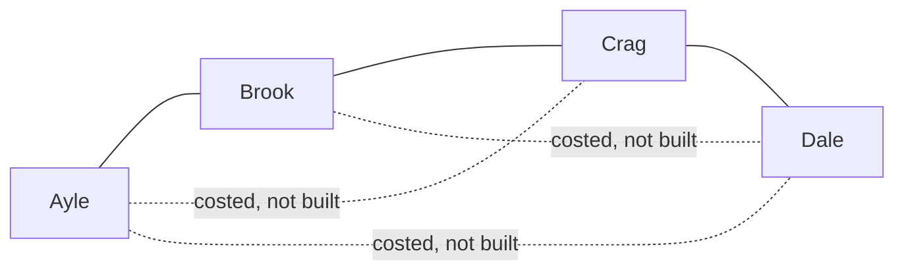

# Spanning trees: a loop-free skeleton reaching every vertex, and K(n) has n^(n-2) of them

Combinatorics and graphs → Trees and Cheapest Routes → Counting skeletons → Spanning trees

---

## General Overview

Four villages — Ayle, Brook, Crag and Dale — are to be joined by new roads, costed one per pair: six in all. The county will build only enough to reach every village with nothing wasted, one route between any two. Three roads, not six.

How many plans? Sixteen. Only two look different: a star, one village joined to the other three, and a line of four. But villages have names: a star centred on Ayle is a different budget from one centred on Dale. Four stars, one per centre, and twelve lines — two shapes, sixteen plans.

Roads that reach every village and never close a loop are a **spanning tree** of the map ([trees](01-trees.md)): *spanning* because they touch every village, *tree* because they hold no loop. Add a fifth village, Ember, cost all ten roads, and the count jumps to 125.

**Strip a map until no loop is left and every place is still reachable: that is a spanning tree, and where all n named places can be joined there are n to the power n − 2.**

**What kind of fact this is:** a theorem, Cayley's formula, proved on this card in Why it works; the spanning tree is a definition.

### The picture: six roads costed, three built



One of the sixteen plans; each dotted road would close a loop.

---

## The formula

Notation first. A map is two lists: $V$ its places, $E$ its joined pairs, with $n$ and $m$ counting each ([graphs-vertices-and-edges](../09-Graphs%20-%20Dots%20and%20Lines/01-graphs-vertices-and-edges.md)). The map is $G$. Some places with some of the roads between them make a **subgraph**; one using every place **spans** the map. Write $T$ for a spanning subgraph with no loop: it always holds $n - 1$ roads.

The map with every pair joined is the **complete map** $K_n$, so the six costed roads are $K_4$. Write $\tau(G)$, "tau of G", for the spanning trees $G$ has. Arthur Cayley, 1889:

$$\tau(K_n) = n^{\,n-2}$$

**Read it aloud:** with n named places and every pair available to join, the loop-free layouts reaching all of them number n to the power n − 2: n − 2 copies of n multiplied together.

So 4 × 4 = 16 for four villages, 5 × 5 × 5 = 125 for five. The proof writes each layout as a word of $n - 2$ names: its **Prüfer code**.

| Symbol | Plain meaning | In our example | Push it up and the answer… |
| --- | --- | --- | --- |
| $G$, $V$, $E$ | map, places, joined pairs | villages, costed roads | — |
| $n$, $m$ | places and roads, counted | 4 and 6 | steeply more layouts |
| $T$, $n - 1$ | a spanning tree and its roads | Ayle-Brook, Brook-Crag, Crag-Dale; 3 | one road per place |
| $K_n$, $K_4$ | the complete map, all pairs joined | the six costed roads | — |
| $\tau(G)$ | spanning trees $G$ has | 16 on $K_4$, 8 when sparse | — |

### When it holds

- **In one piece.** Otherwise there is no spanning tree, only one tree per piece — a spanning forest — and $\tau(G)$ is 0.
- **Every pair joinable, for Cayley.** Where only six of the ten roads between five villages exist, the layouts number 8, not 125; sparser maps take the determinant.
- **Named places.** Cayley counts labelled layouts: four villages, 2 shapes, 16 plans. Rub the names out and only the 2 shapes are left, which this formula does not count.

---

## Why it works

### Step 0: a loop always has a road to spare

Take a map in one piece. If some roads form a loop, remove any one of them: the places it joined are still joined the long way round, so the map stays whole. Repeat until no loop is left; what remains still reaches every place, so it is a spanning tree. The other way round is free: a map holding a spanning tree is in one piece.

### Step 1: one flood builds a spanning tree in a single pass

Hunting for loops is slow; flooding is fast. Mark the start, then every place one road from a marked place, keeping the road that marked it and ignoring roads landing on a mark. Stop when a round marks nothing: breadth-first search ([connectivity-and-breadth-first-search](../09-Graphs%20-%20Dots%20and%20Lines/04-connectivity-and-breadth-first-search.md)).

On a sparser five-village map, where only Ayle-Brook, Ayle-Crag, Brook-Crag, Brook-Dale, Crag-Dale and Dale-Ember can be built, flooding from Ayle marks in rings — 0 Ayle, 1 Brook and Crag, 2 Dale, 3 Ember — keeping Ayle-Brook, Ayle-Crag, Brook-Dale, Dale-Ember: four roads for five villages.

Every place but the start keeps one road, so the count is always $n - 1$, and no kept road closes a loop, since each lands on an unmarked place. Places left unmarked prove the map was in pieces.

### Step 2: counting by listing, and where listing gives out

Six roads, three to a plan: test all 20 choices of 3 from 6 ([n-choose-k](../01-Counting%20Principles/05-n-choose-k.md)). Sixteen pass; the failures are triangles, with a village stranded. Five villages: 210 choices, 125 pass. But 16 is 4 × 4 and 125 is 5 × 5 × 5 — a pattern that wants a reason.

### Step 3: every layout is a short word

Heinz Prüfer's 1918 proof gives one. Repeatedly remove the **dead end** — a place with one road, also called a **leaf** — first in the alphabet, writing down its neighbour, until two places are left.

Take the line Ayle-Brook-Crag-Dale. Its dead ends are Ayle and Dale, so remove Ayle and write Brook. What remains is Brook-Crag-Dale: remove Brook, write Crag. Two places left, stop. The word is Brook Crag.

Each removal writes one letter and they stop two places short, so the word holds $n - 2$ letters from $n$ names. Write the neighbour, never the dead end: the star centred on Ayle codes as Ayle Ayle.

### Step 4: every word is a layout, so counting words counts layouts

Run it backwards. A place's road count is one more than the times its name appears, so a place never named is a dead end. Then, letter by letter: take the place first in the alphabet still owed just one road, join it to that letter's place, knock one off both. At the end, join the two places still owed a road. Brook Crag returns the line it came from.

Decoding undoes encoding step for step, so layouts and words pair off one for one: a bijection ([bijection-and-double-counting](../02-Repeats%2C%20Groups%20and%20Double%20Counting/05-bijection-and-double-counting.md)). Words are easy — $n - 2$ slots, any of $n$ names each — so $n^{\,n-2}$ words, and that many layouts.

<details>
<summary>Detailed proof: decoding never sticks, and the two directions undo each other</summary>

**Encoding always works.** Every tree on two or more places has at least two dead ends ([trees](01-trees.md)), so there is always one to remove.

**The word has the right length.** A place's last road is never written, so a place met by k roads appears k − 1 times, a dead end never. Those counts add to 2(n − 1) − n = n − 2.

**Decoding never sticks.** After i letters, k = n − i places are still owed a road, their counts adding to 2(k − 1): if fewer than two of them were 1, the total would be at least 2k − 1, too big. So at least two are 1. Each step joins a leaving place to one still in play, closing no loop, and the dead ends come off in encoding's order.

</details>

<details>
<summary>The determinant road, which works on any map</summary>

Cayley's power needs every pair joinable. Kirchhoff's determinant does not, and is older: he counted these skeletons in 1847, solving currents in wire networks.

Build a square table, one row and column per place: on the diagonal how many roads meet that place, off it −1 where a road joins the pair, 0 otherwise. Delete any row with its column. Each village here has three roads, so cutting Ayle's leaves

```
 3  -1  -1
-1   3  -1
-1  -1   3
```

whose determinant ([determinants](../../03-Algebra/05-Solving%20Systems/04-determinants.md)) is 3(9 − 1) + 1(−3 − 1) − 1(1 + 3) = 24 − 4 − 4 = 16, the layout count, whichever row is cut: the **matrix-tree theorem**, proved in Godsil and Royle under Sources, not here.

</details>

Both roads count layouts as though every road cost the same; pricing them asks which is cheapest: [minimum-spanning-trees](04-minimum-spanning-trees.md).

---

## Worked numbers, by hand

| Step | Arithmetic | Value |
| --- | --- | --- |
| choices of 3 roads from 6 | the triples to test | 20 |
| triples reaching all four, no loop | tested one by one | **16** |
| the same by Cayley | 4 × 4 | **16** |
| the line as a word | write Brook, then Crag | Brook Crag |
| five villages, all pairs joinable | 5 × 5 × 5 | **125** |
| five villages, 6 roads of the 10 | tested one by one | **8** |

The last row is the warning: of the 125 layouts on five villages, only 8 are buildable.

### What breaks if you drop a piece

| Mistake | Comes out at | What went wrong |
| --- | --- | --- |
| Shapes counted, not plans | 2 | Ayle at the centre differs from Dale |
| Any three roads taken as a plan | 20 | Triangles strand a village |
| Cayley on a sparse map | 125 | Only 8 layouts are buildable |

The code prints all three.

---

## Code, from first principles, and it actually runs

Nothing is imported. The layouts are counted twice by roads sharing no arithmetic: every choice of $n - 1$ roads tested, and every Prüfer word decoded. A determinant is the third road; one flood both tests whether the roads reach everyone and builds Step 1's tree.

### Python

```python
# Spanning trees and Cayley's formula -- the check behind the card.  Nothing is imported.  Villages
# Ayle, Brook, Crag, Dale, then Ember.  A layout reaches every village and holds no loop.  Counted
# twice, by trying every choice of roads and by decoding every Prufer word, a determinant third.
NAMES = ["Ayle", "Brook", "Crag", "Dale", "Ember"]
SPARSE = [(0, 1), (0, 2), (1, 2), (1, 3), (2, 3), (3, 4)]
FULL = {n: [(i, j) for i in range(n) for j in range(i + 1, n)] for n in (4, 5)}

def flood(n, edges):                  # rings out from Ayle; each village keeps the road that reached it
    rings, kept = [[0]], []
    while rings[-1]:
        seen = {v for r in rings for v in r}
        nxt = sorted({w for v in rings[-1] for e in edges for w in e if v in e and w not in seen})
        kept += [min((min(v, w), max(v, w)) for v in rings[-1] if tuple(sorted((v, w))) in edges) for w in nxt]
        rings.append(nxt)
    return rings[:-1], tuple(sorted(kept))

def is_tree(n, edges):                # n-1 roads, and the flood reaches every village
    return len(edges) == n - 1 and sum(len(r) for r in flood(n, edges)[0]) == n

def by_listing(n, roads):             # road one: try every choice of n-1 of the roads
    tried = [tuple(r for i, r in enumerate(roads) if m >> i & 1) for m in range(1 << len(roads))]
    tried = [s for s in tried if len(s) == n - 1]
    return len(tried), sorted(s for s in tried if is_tree(n, s))

def decode(n, word):                  # road two: a word of n-2 names back into a layout
    deg, edges = [1 + list(word).count(v) for v in range(n)], []
    for letter in word:
        leaf = min(v for v in range(n) if deg[v] == 1)
        edges.append((min(leaf, letter), max(leaf, letter))); deg[leaf] -= 1; deg[letter] -= 1
    return tuple(sorted(edges + [tuple(v for v in range(n) if deg[v] == 1)]))

def det3(m):                          # road three: a 3-by-3 determinant, multiplied out here
    return (m[0][0] * (m[1][1] * m[2][2] - m[1][2] * m[2][1])
            - m[0][1] * (m[1][0] * m[2][2] - m[1][2] * m[2][0])
            + m[0][2] * (m[1][0] * m[2][1] - m[1][1] * m[2][0]))
def show(edges): return " ".join(f"{NAMES[u]}-{NAMES[v]}" for u, v in edges)
def say(vs): return " ".join(NAMES[v] for v in vs)

print(f"four villages {say(range(4))}; roads possible {len(FULL[4])}; each layout uses 3 roads")
counts, four = [], []
for label, n, roads in (("all 6 roads", 4, FULL[4]), ("all 10 roads", 5, FULL[5]), ("6 of the 10", 5, SPARSE)):
    tried, listed = by_listing(n, roads)
    words = sorted({decode(n, [m // n ** i % n for i in range(n - 2)]) for m in range(n ** (n - 2))})
    fit = [t for t in words if all(e in roads for e in t)]
    print(f"{n} villages, {label}: {tried} choices of {n - 1} roads tried, layouts by listing "
          f"{len(listed)}, from the {len(words)} words {len(fit)}")
    assert listed == fit and len(words) == n ** (n - 2)
    counts.append(len(listed)); four = listed if n == 4 else four
stars = sum(1 for t in four if max(sum(v in e for e in t) for v in range(4)) == 3)
rings, tree = flood(5, SPARSE)
print("the flood from Ayle over the sparse map, rings: " + " | ".join(f"{i} " + say(r) for i, r in enumerate(rings)))
print(f"  the layout it keeps: {show(tree)}; roads {len(tree)}; a tree: {'yes' if is_tree(5, tree) else 'no'}")
print(f"the word {say([1, 2])} decodes to {show(decode(4, [1, 2]))}, and {say([0, 0])} to {show(decode(4, [0, 0]))}")
k4tab = [[3, -1, -1], [-1, 3, -1], [-1, -1, 3]]
print(f"the four-village table, one row and column cut, has determinant {det3(k4tab)}")
print(f"Cayley 4^2 = {4 ** 2} and 5^3 = {5 ** 3}; the 16 plans are {stars} stars and "
      f"{counts[0] - stars} lines; 6 of the 10 roads allow {counts[2]}")
assert counts == [4 ** 2, 5 ** 3, 8] and det3(k4tab) == counts[0] and stars == 4
assert tree in listed and decode(4, [1, 2]) == ((0, 1), (1, 2), (2, 3)) and decode(4, [0, 0]) == ((0, 1), (0, 2), (0, 3))
print("ALL CHECKS PASS")
```

**Ran 2026-09-19 on macOS, Python 3.14.6, standard library only. All checks passed. Output, pasted from the run:**

```
four villages Ayle Brook Crag Dale; roads possible 6; each layout uses 3 roads
4 villages, all 6 roads: 20 choices of 3 roads tried, layouts by listing 16, from the 16 words 16
5 villages, all 10 roads: 210 choices of 4 roads tried, layouts by listing 125, from the 125 words 125
5 villages, 6 of the 10: 15 choices of 4 roads tried, layouts by listing 8, from the 125 words 8
the flood from Ayle over the sparse map, rings: 0 Ayle | 1 Brook Crag | 2 Dale | 3 Ember
  the layout it keeps: Ayle-Brook Ayle-Crag Brook-Dale Dale-Ember; roads 4; a tree: yes
the word Brook Crag decodes to Ayle-Brook Brook-Crag Crag-Dale, and Ayle Ayle to Ayle-Brook Ayle-Crag Ayle-Dale
the four-village table, one row and column cut, has determinant 16
Cayley 4^2 = 16 and 5^3 = 125; the 16 plans are 4 stars and 12 lines; 6 of the 10 roads allow 8
ALL CHECKS PASS
```

### Rust

Same numbers, same labels, built with `rustc --edition 2021 -O`. Its flood records each village's ring instead of a list of rings, so the two programs differ and print alike.

```rust
// Spanning trees and Cayley's formula -- the same check as the Python, in Rust.  No crates.  Villages
// Ayle, Brook, Crag, Dale, then Ember.  A layout reaches every village and holds no loop.  Counted twice,
// by every choice of roads and by decoding every Prufer word, a determinant third; flood gives each ring.
type Edge = (usize, usize);
const NAMES: [&str; 5] = ["Ayle", "Brook", "Crag", "Dale", "Ember"];
const SPARSE: [Edge; 6] = [(0, 1), (0, 2), (1, 2), (1, 3), (2, 3), (3, 4)];
const FULL4: [Edge; 6] = [(0, 1), (0, 2), (0, 3), (1, 2), (1, 3), (2, 3)];
const FULL5: [Edge; 10] = [(0, 1), (0, 2), (0, 3), (0, 4), (1, 2), (1, 3), (1, 4), (2, 3), (2, 4), (3, 4)];

fn flood(n: usize, edges: &[Edge]) -> (Vec<usize>, Vec<Edge>) {
    let (mut ring, mut kept) = ({ let mut r = vec![usize::MAX; n]; r[0] = 0; r }, Vec::new());
    for r in 0..n {                       // rings out from Ayle; each village keeps the road in
        for v in (0..n).filter(|&v| ring[v] == r).collect::<Vec<usize>>() {
            for (x, w) in edges.iter().flat_map(|&(a, b)| [(a, b), (b, a)]) {
                if x == v && ring[w] == usize::MAX { ring[w] = r + 1; kept.push((v.min(w), v.max(w))) }
            }
        }
    }
    kept.sort(); (ring, kept)
}
fn is_tree(n: usize, edges: &[Edge]) -> bool {    // n-1 roads, and the flood reaches every village
    edges.len() == n - 1 && flood(n, edges).0.iter().all(|&r| r != usize::MAX)
}
fn by_listing(n: usize, roads: &[Edge]) -> (usize, Vec<Vec<Edge>>) {   // road one: every choice of n-1
    let tried: Vec<Vec<Edge>> = (0..1u32 << roads.len()).map(|m| roads.iter().enumerate()
        .filter(|(i, _)| m >> i & 1 == 1).map(|(_, &r)| r).collect::<Vec<Edge>>())
        .filter(|s| s.len() == n - 1).collect();
    let mut out: Vec<Vec<Edge>> = tried.iter().filter(|s| is_tree(n, s)).cloned().collect();
    out.sort(); (tried.len(), out)
}
fn decode(n: usize, word: &[usize]) -> Vec<Edge> {   // road two: a word of n-2 names into a layout
    let mut deg: Vec<usize> = (0..n).map(|v| 1 + word.iter().filter(|&&a| a == v).count()).collect();
    let mut edges: Vec<Edge> = Vec::new();
    for &letter in word {
        let leaf = (0..n).find(|&v| deg[v] == 1).unwrap();
        edges.push((leaf.min(letter), leaf.max(letter))); deg[leaf] -= 1; deg[letter] -= 1;
    }
    let last: Vec<usize> = (0..n).filter(|&v| deg[v] == 1).collect();
    edges.push((last[0], last[1])); edges.sort(); edges
}
fn det3(m: &[[i64; 3]; 3]) -> i64 {       // road three: a 3-by-3 determinant, multiplied out here
    m[0][0] * (m[1][1] * m[2][2] - m[1][2] * m[2][1]) - m[0][1] * (m[1][0] * m[2][2] - m[1][2] * m[2][0])
        + m[0][2] * (m[1][0] * m[2][1] - m[1][1] * m[2][0])
}
fn show(e: &[Edge]) -> String { e.iter().map(|&(u, v)| format!("{}-{}", NAMES[u], NAMES[v])).collect::<Vec<_>>().join(" ") }
fn say(vs: &[usize]) -> String { vs.iter().map(|&v| NAMES[v]).collect::<Vec<_>>().join(" ") }

fn main() {
    println!("four villages {}; roads possible {}; each layout uses 3 roads", say(&[0, 1, 2, 3]), FULL4.len());
    let (mut counts, mut listed, mut four) = (Vec::new(), Vec::new(), Vec::new());
    for (label, n, roads) in [("all 6 roads", 4usize, FULL4.to_vec()), ("all 10 roads", 5, FULL5.to_vec()),
                              ("6 of the 10", 5, SPARSE.to_vec())] {
        let (tried, found) = by_listing(n, &roads);
        let total = n.pow((n - 2) as u32);
        let mut words: Vec<Vec<Edge>> = (0..total).map(|m| decode(n,
            &(0..n - 2).map(|i| m / n.pow(i as u32) % n).collect::<Vec<usize>>())).collect();
        words.sort(); words.dedup();
        let fit: Vec<Vec<Edge>> = words.iter().filter(|t| t.iter().all(|e| roads.contains(e))).cloned().collect();
        println!("{} villages, {}: {} choices of {} roads tried, layouts by listing {}, from the {} words {}",
                 n, label, tried, n - 1, found.len(), words.len(), fit.len());
        assert!(found == fit && words.len() == total);
        counts.push(found.len()); if n == 4 { four = found.clone() } listed = found;
    }
    let stars = four.iter().filter(|t| (0..4).any(|v| t.iter().filter(|e| e.0 == v || e.1 == v).count() == 3)).count();
    let (ring, tree) = flood(5, &SPARSE);
    println!("the flood from Ayle over the sparse map, rings: {}", (0..=*ring.iter().max().unwrap())
        .map(|r| format!("{} {}", r, say(&(0..5).filter(|&v| ring[v] == r).collect::<Vec<usize>>())))
        .collect::<Vec<String>>().join(" | "));
    println!("  the layout it keeps: {}; roads {}; a tree: {}", show(&tree), tree.len(),
             if is_tree(5, &tree) { "yes" } else { "no" });
    println!("the word {} decodes to {}, and {} to {}", say(&[1, 2]), show(&decode(4, &[1, 2])), say(&[0, 0]), show(&decode(4, &[0, 0])));
    let k4tab = [[3i64, -1, -1], [-1, 3, -1], [-1, -1, 3]];
    println!("the four-village table, one row and column cut, has determinant {}", det3(&k4tab));
    println!("Cayley 4^2 = {} and 5^3 = {}; the 16 plans are {} stars and {} lines; 6 of the 10 roads allow {}",
             4usize.pow(2), 5usize.pow(3), stars, counts[0] - stars, counts[2]);
    assert!(counts == vec![4usize.pow(2), 5usize.pow(3), 8] && det3(&k4tab) == counts[0] as i64 && stars == 4);
    assert!(listed.contains(&tree) && decode(4, &[1, 2]) == vec![(0, 1), (1, 2), (2, 3)]
        && decode(4, &[0, 0]) == vec![(0, 1), (0, 2), (0, 3)]);
    println!("ALL CHECKS PASS");
}
```

**Ran 2026-09-19 on macOS, rustc 1.98.1, no crates. All checks passed. Output, pasted from the run:**

```
four villages Ayle Brook Crag Dale; roads possible 6; each layout uses 3 roads
4 villages, all 6 roads: 20 choices of 3 roads tried, layouts by listing 16, from the 16 words 16
5 villages, all 10 roads: 210 choices of 4 roads tried, layouts by listing 125, from the 125 words 125
5 villages, 6 of the 10: 15 choices of 4 roads tried, layouts by listing 8, from the 125 words 8
the flood from Ayle over the sparse map, rings: 0 Ayle | 1 Brook Crag | 2 Dale | 3 Ember
  the layout it keeps: Ayle-Brook Ayle-Crag Brook-Dale Dale-Ember; roads 4; a tree: yes
the word Brook Crag decodes to Ayle-Brook Brook-Crag Crag-Dale, and Ayle Ayle to Ayle-Brook Ayle-Crag Ayle-Dale
the four-village table, one row and column cut, has determinant 16
Cayley 4^2 = 16 and 5^3 = 125; the 16 plans are 4 stars and 12 lines; 6 of the 10 roads allow 8
ALL CHECKS PASS
```

The two outputs match line for line.

> [!TIP]
> **Try changing**
> Guess first, then run it. The asserts are pinned to these maps, so expect one to stop the program.
> - **Shut the road to Ember.** Remove `(3, 4)` from `SPARSE`: nothing reaches all five, and the assert pinned to 8 stops the run.
> - **Make the sparse map complete.** Set `SPARSE` to every pair: the third row repeats the second, 210 choices and 125 layouts.
> - **Peel the wrong village.** In `decode`, change `min` to `max`: the same 16 layouts come back, each named by a different word, and the last assert stops it.

---

## The usual mistake

> [!warning]
> **Reading the power as a count of shapes.** Four villages give 2 shapes and 16 plans: the formula counts plans, and which village sits at the centre changes the budget.
>
> - **Taking any n − 1 roads.** Of the 20 triples, the triangles strand a village. A layout needs n − 1 roads *and* to reach everyone, or n − 1 roads *and* no loop.
> - **Using Cayley where the roads do not exist.** 125 counts layouts when every pair can be joined; this sparse map allows 8.
> - **Writing the dead end, not its neighbour.** The star centred on Ayle codes as Ayle Ayle; a list of its dead ends reads Brook Crag, which is the line.

---

## Where you meet it in real life

- **Anything cabled or piped once.** Reaching every building with no redundant run is this; priced runs make it [minimum-spanning-trees](04-minimum-spanning-trees.md).
- **Ethernet.** Switches agree on a loop-free skeleton of the cabling and switch the rest off: one loop makes broadcast traffic circulate until the network drowns.
- **Electrical circuits.** The determinant in the callout above is Kirchhoff's, from solving currents in wire networks.
- **Other trees on this shelf.** Least distance from one place gives another tree, [dijkstra](05-dijkstra.md); hanging a skeleton from one place makes it rooted, [rooted-and-binary-trees](02-rooted-and-binary-trees.md).

> **Say it back**
> A spanning tree reaches every place on a map and holds no loop, so it carries one road fewer than there are places. Every map in one piece has one: flood outward, keeping the road that first reaches each place. Where every pair can be joined, Cayley's formula counts them as n to the power n − 2: 16 plans on four villages, 125 on five. Tearing off dead ends alphabetically turns a layout into a word, and every word comes back as one layout.

---

## What this builds on

- [trees](01-trees.md): what a tree is, that it holds n − 1 roads, and that it has dead ends.
- [bijection-and-double-counting](../02-Repeats%2C%20Groups%20and%20Double%20Counting/05-bijection-and-double-counting.md): why pairing two collections one for one proves the counts equal.
- [determinants](../../03-Algebra/05-Solving%20Systems/04-determinants.md): working out the callout's determinant.

## Where this goes next

- [minimum-spanning-trees](04-minimum-spanning-trees.md): the same skeletons priced, and a greedy rule that finds the cheapest.

The costs in the opening never entered the count: all 16 plans were counted alike. Which of them is cheapest, found without listing all 16, is the next card.

---

## Sources

Verified 19 Sep 2026: every link below resolves to the publisher's page.

- Cayley, Arthur. "A Theorem on Trees." *Quarterly Journal of Pure and Applied Mathematics* 23 (1889): 376–378; reprinted as paper 895 in his *Collected Mathematical Papers*, vol. 13, p. 26. [Full scan](https://archive.org/details/collectedmathema13cayluoft). Cayley's wording: trees on n + 1 knots number (n + 1)^(n − 1), worked there for 4 knots as 16.
- Aigner, Martin, and Günter M. Ziegler. *Proofs from THE BOOK*, 6th ed. Springer, 2018. [Publisher page](https://link.springer.com/book/10.1007/978-3-662-57265-8). Four proofs of Cayley's formula, Prüfer's included.
- Diestel, Reinhard. *Graph Theory*, 5th ed. Springer, 2017. [Publisher page](https://link.springer.com/book/10.1007/978-3-662-53622-3). Section 1.5, trees and forests, including spanning trees.
- Godsil, Chris, and Gordon Royle. *Algebraic Graph Theory*. Springer, 2001. [Publisher page](https://link.springer.com/book/10.1007/978-1-4613-0163-9). Chapter 13, the Laplacian of a graph, proves Kirchhoff's determinant.
