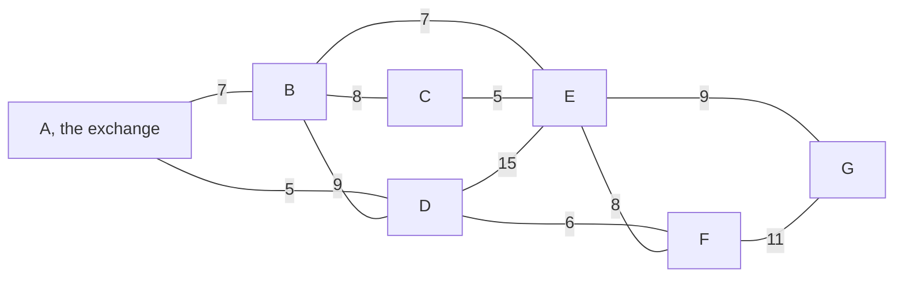
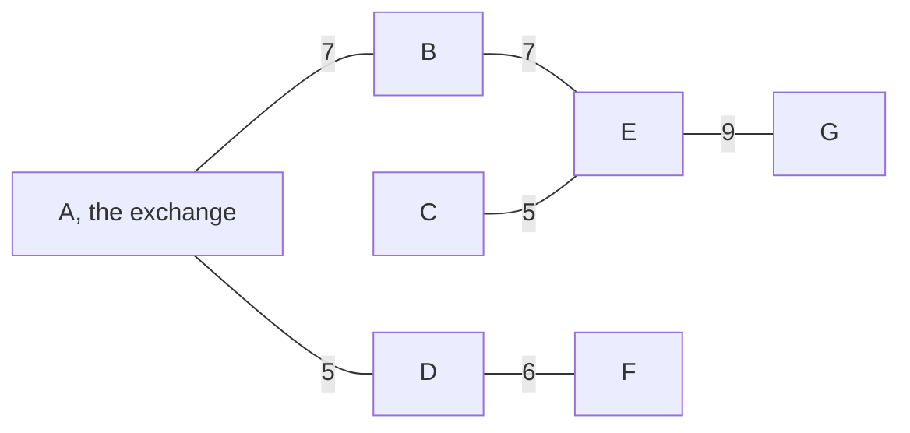

# The cheapest skeleton: Kruskal adds the cheapest safe edge, Prim grows from one vertex, and the cut property says both are right

Combinatorics and graphs → Trees and Cheapest Routes → Safe edges → The cheapest skeleton

---

## General Overview

A campus has seven buildings, A to G. Fibre arrives at A; every building must reach the network. A contractor prices eleven trench runs, in thousands of dollars, from AD at 5 to DE at 15 — the picture below carries all eleven.

Six runs will do it, and six is the fewest: joining seven buildings with no loop takes exactly six, a spanning tree ([spanning-trees-and-cayleys-formula](03-spanning-trees-and-cayleys-formula.md)). Six of the eleven can be picked 462 ways; 141 of those join all seven without a loop; one beats the rest, at 39.

Two procedures find it without pricing all 141: Kruskal's walk sorts the runs cheap to dear, Prim's walk grows one group out of A. They keep the same six.

**Sorting the runs and keeping each that joins two separate pieces, or growing one group by its cheapest outward run, both land on a cheapest network — because the cheapest run crossing any split can always be kept.**

**What kind of fact this is:** a theorem, the cut property, proved below in Why it works; the two walks are methods it licenses.

### The picture: seven buildings, eleven priced runs



Each number is a price. G hangs off the rest by EG 9 and FG 11 alone.

---

## The formula

Notation first, in words. A graph is written $G$: its vertices (the dots, here buildings) are $V$, its edges (the lines, here runs) are $E$, and $n$ counts the vertices. Each edge carries a **weight**, written $w$ — here a price, so $w$ of AD is 5.

A set of runs $T$ costs its weights added up, which the sigma sign says: add what follows, once per item underneath.

$$w(T) = \sum_{e \in T} w(e)$$

**Read it aloud:** the price of a network is the prices of its runs added up.

A **spanning tree** joins every vertex with no loop; on $n$ vertices that takes $n - 1$ edges. A **minimum spanning tree** is one no spanning tree beats on price: the cheapest skeleton.

Split the vertices into a group $S$ and the rest, neither empty: that is a **cut**. An edge **crosses** it with one end in $S$, one outside.

**The cut property.** Of the edges crossing a cut, a cheapest can always be kept: some minimum spanning tree holds it. Such an edge is **safe**.

**The cycle property.** An edge dearer than every other on a loop lies in no minimum spanning tree.

**Kruskal's walk.** Sort the edges cheap to dear, keep each whose ends lie in different pieces of what is kept, skip the rest, stop at $n - 1$ keeps.

**Prim's walk.** Put one vertex in a group; keep a cheapest edge leaving the group and move its far end in, until all $n$ are in.

| Symbol | Plain meaning | In our example | Push it up and the answer… |
| --- | --- | --- | --- |
| $G$ | the map: vertices and priced edges | 7 buildings, 11 runs | — |
| $V$, $n$ | the vertices, and how many | A to G, $n$ is 7 | one more run to buy |
| $E$ | the candidate edges | the 11 runs | the price can only fall, never rise |
| $e$, $f$, $u$, $v$ | edges, and the vertices one joins | AD joins A and D | — |
| $w$ | an edge's weight, here a price | $w$ of AD is 5 | the total rises |
| $T$, $S$ | kept edges; one side of a cut | the six runs; A, B, D, F | — |

### When it holds

- **Some chain of edges joins any two vertices.** Otherwise no spanning tree exists at any price, and both walks return a cheapest skeleton per piece ([trees](01-trees.md)).
- **No directions, and weights fixed in advance.** Negative weights are fine; a price that shifts with the other choices breaks the swap.
- **Ties may multiply the answers.** All weights different makes the answer unique; here 5 ties with 5 and 7 with 7, and it is still the only one.

---

## Why it works

### Step 0: a spanning tree plus one run holds exactly one loop

Add BC to the six runs that win — AD, CE, DF, AB, BE, EG. The seven hold one loop: B to C, C to E, E back to B. Drop any run of that loop and six again join all seven, no loop. Every step below is this move: an edge in, an edge of the loop out.

### Step 1: a cheapest edge across a cut is safe

Cut the vertices into $S$ and the rest. Let $e$ be a cheapest crossing edge, $T$ any cheapest skeleton. If $T$ holds $e$, nothing to prove. If not, add $e$ to $T$: one loop appears, it leaves $S$ and returns, so a second crossing edge $f$ lies on it. Drop $f$, keep $e$: a skeleton priced $w(T) - w(f) + w(e)$, no dearer, since $e$ was cheapest across the cut. Nothing beats a cheapest skeleton, so the new one is cheapest too, and holds $e$.

After Kruskal keeps AD, CE, DF and AB, the group A, B, D, F faces C, E, G. Crossing it: BE 7, BC 8, EF 8, FG 11, DE 15 — cheapest BE 7, which is in the answer.

### Step 2: the kept set stays inside one cheapest skeleton

One swap makes one edge safe; a walk needs everything kept inside one cheapest skeleton at every step. The same swap does that: the edge it drops crosses the cut, nothing kept does.

<details>
<summary>Detailed proof: the induction behind Step 2</summary>

The claim: after each keep, some cheapest skeleton holds everything kept. True at the start, the empty set sitting inside any cheapest skeleton — and one exists, the map being finite and connected.

Say cheapest skeleton $T$ holds everything kept, and the next keep is $e$, a cheapest edge across a cut no kept edge crosses. If $T$ holds $e$, the claim survives. If not, Step 1's swap drops a crossing edge $f$ of the loop in $T$ plus $e$, yielding a cheapest skeleton that holds $e$ — and $f$ crossed the cut, so was never kept.

After $n - 1$ keeps, the kept set and that skeleton are both $n - 1$ loop-free edges: the same set.

</details>

### Step 3: both walks keep only cheapest crossing edges

When Kruskal keeps the edge joining $u$ and $v$, let $S$ be the piece of kept edges holding $u$. No kept edge crosses that cut, each sitting inside one piece. Nor does a cheaper edge: it came earlier, its ends lie in different pieces now, so they lay in different pieces then, pieces only merging — so the walk kept it, and a kept edge's ends sit in one piece. A skip needs no defence: its ends are joined already.

Prim's cut is the group itself: every kept edge lies inside it, and the edge kept is a cheapest one leaving it. Each keep adds a new vertex, so no loop forms; the start fixes only the order, all seven pricing out at 39.

### Step 4: the cycle property, the swap read backwards

Suppose an edge is dearer than every other on a loop, and a cheapest skeleton held it. Removing it splits the skeleton in two; the loop crosses that split again, so a cheaper loop edge swaps in and the price strictly falls — it was not cheapest. Each skip closes a loop of runs already kept, none dearer and here none tied, so all five are dearest on their loops: forcing one in costs 40 at best for BC, then 41, 47, 40, 41 for BD, DE, EF, FG, against 39. A skip that only ties the dearest is not covered: it can sit in another cheapest skeleton.

Greedy — taking the cheapest thing available at each step — usually promises nothing; it works here because loop-free sets of edges have a swap property strong enough, the one naming a matroid (greedy-algorithms-and-matroids).

---

## Worked numbers, by hand

Kruskal's walk down the sorted list; "groups left" counts the pieces the kept runs make.

| Step | Run | Keep or skip | Groups left |
| --- | --- | --- | --- |
| 1 | AD 5 | keep | 6 |
| 2 | CE 5 | keep | 5 |
| 3 | DF 6 | keep | 4 |
| 4 | AB 7 | keep | 3 |
| 5 | BE 7 | keep | 2 |
| 6 | BC 8 | skip | 2 |
| 7 | EF 8 | skip | 2 |
| 8 | BD 9 | skip | 2 |
| 9 | EG 9 | keep | 1 |
| 10 | FG 11 | skip | 1 |
| 11 | DE 15 | skip | 1 |

Six keeps, at 5 + 5 + 6 + 7 + 7 + 9 = **39**. Every skip's ends were joined already — B to C through E, for one.

Prim from A keeps AD 5, DF 6, AB 7, BE 7, CE 5, EG 9: the same six, another order, 39 again. Six trenches, $39,000, every building on the fibre.

The six kept runs, with B reaching C the long way, on 7 and 5:



### What breaks if you drop a piece

| Mistake | Comes out at | What went wrong |
| --- | --- | --- |
| The six cheapest runs, no loop test | 38 | A loop closes, two groups are left, G gets nothing |
| Stopping after five runs | 30 | Five runs cannot join seven buildings |
| Dear to cheap, kept the same way | 59 | Reversed, the walk builds the dearest skeleton |

The code prints all three.

---

## Code, from first principles, and it actually runs

Nothing is imported. Three roads reach the same six runs: Kruskal's walk, on a union-find where each building points at another until a piece's root is reached; Prim's growing group; and brute force over all 462 six-run subsets, reading off the cheapest, the dearest, and how many price at the cheapest.

### Python

```python
# The cheapest skeleton -- the check behind the card.  Nothing is imported.  Seven campus
# buildings A to G, eleven possible fibre runs, prices in thousands of dollars.  Three roads
# to the cheapest network reaching all seven: Kruskal's sorted walk, Prim's growing group,
# brute force over every six-run subset.
V, E = "ABCDEFG", [("A", "B", 7), ("A", "D", 5), ("B", "C", 8), ("B", "D", 9),
     ("B", "E", 7), ("C", "E", 5), ("D", "E", 15), ("D", "F", 6), ("E", "F", 8),
     ("E", "G", 9), ("F", "G", 11)]
CHEAP = sorted(E, key=lambda r: (r[2], r[0], r[1]))   # cheap to dear, ties by name
def show(t): return ", ".join(f"{u}{v} {w}" for u, v, w in t)
def total(t): return sum(w for _, _, w in t)
def yn(c): return "yes" if c else "no"
def root(p, x):
    while p[x] != x: x = p[x]
    return x
def walk(edges):                     # keep a run only if it joins two separate groups
    p, kept, log = {v: v for v in V}, [], []
    for u, v, w in edges:
        add = root(p, u) != root(p, v)
        if add: p[root(p, u)] = root(p, v); kept.append((u, v, w))
        log.append(f"{u}{v} {w} {'add' if add else 'skip'} {len(V) - len(kept)}")
    return kept, log
def prim(s):                         # over and over, take the cheapest run leaving the group
    grown, kept = [s], []
    while len(grown) < len(V):
        w, u, v = min((w, u, v) for u, v, w in E if (u in grown) != (v in grown))
        kept.append((u, v, w)); grown.append(v if u in grown else u)
    return kept
kk, klog = walk(CHEAP)
pa, grp = prim("A"), "ABDF"          # grp: the group Kruskal has joined after four adds
subs = [[e for i, e in enumerate(E) if m >> i & 1]
        for m in range(1 << len(E)) if bin(m).count("1") == len(V) - 1]
nets = [s for s in subs if len(walk(s)[0]) == len(V) - 1]    # no loop, so a network
low, high = min(map(total, nets)), max(map(total, nets))
cross = sorted((e for e in E if (e[0] in grp) != (e[1] in grp)), key=lambda r: r[2])
forced = [(e, min(total(t) for t in nets if e in t)) for e in sorted(E) if e not in kk]
six, dearfirst = walk(CHEAP[:6])[0], walk(CHEAP[::-1])[0]
print(f"{len(V)} buildings, {len(E)} candidate runs, {len(V) - 1} runs in a network"
      "\nruns cheap to dear: " + show(CHEAP))
print("Kruskal walk, run price action groups-left: " + " | ".join(klog))
print(f"Kruskal keeps {show(sorted(kk))}, total {total(kk)}")
print(f"Prim from A keeps, in its own order, {show(pa)}, total {total(pa)}")
print("Prim's total from each start: " + " ".join(f"{s} {total(prim(s))}" for s in V)
      + f"; the same six runs every time: {yn(all(sorted(prim(s)) == sorted(kk) for s in V))}")
print(f"six-run subsets {len(subs)}, of them networks {len(nets)}, cheapest {low}, dearest "
      f"{high}, networks at the cheapest price {sum(1 for t in nets if total(t) == low)}")
print(f"split {grp} against {''.join(v for v in V if v not in grp)}: crossing runs "
      + show(cross) + f"; cheapest {cross[0][0]}{cross[0][1]} {cross[0][2]}; "
      f"kept by Kruskal: {yn(cross[0] in kk)}")
print("cheapest network that keeps a left-out run: "
      + " | ".join(f"{u}{v} {w} -> {c}" for (u, v, w), c in forced)
      + f"; every one dearer than {low}: {yn(all(c > low for _, c in forced))}")
print(f"mistake 1, the six cheapest runs with no loop test: total {total(CHEAP[:6])}, groups "
      f"left {len(V) - len(six)}; mistake 2, one run short: total {total(kk[:5])}, groups left 2")
print(f"mistake 3, dearest first with the loop test: total {total(dearfirst)}, "
      f"and the brute-force dearest network: {high}")
assert sorted(kk) == sorted(min(nets, key=total)) and total(kk) == low == 39
assert all(total(prim(s)) == low and sorted(prim(s)) == sorted(kk) for s in V)
assert sum(1 for t in nets if total(t) == low) == 1 and all(c > low for _, c in forced)
assert total(dearfirst) == high and cross[0] in kk
print("ALL CHECKS PASS")
```

**Ran 2026-09-19 on macOS, Python 3.14.6, standard library only. All checks passed. Output, pasted from the run:**

```
7 buildings, 11 candidate runs, 6 runs in a network
runs cheap to dear: AD 5, CE 5, DF 6, AB 7, BE 7, BC 8, EF 8, BD 9, EG 9, FG 11, DE 15
Kruskal walk, run price action groups-left: AD 5 add 6 | CE 5 add 5 | DF 6 add 4 | AB 7 add 3 | BE 7 add 2 | BC 8 skip 2 | EF 8 skip 2 | BD 9 skip 2 | EG 9 add 1 | FG 11 skip 1 | DE 15 skip 1
Kruskal keeps AB 7, AD 5, BE 7, CE 5, DF 6, EG 9, total 39
Prim from A keeps, in its own order, AD 5, DF 6, AB 7, BE 7, CE 5, EG 9, total 39
Prim's total from each start: A 39 B 39 C 39 D 39 E 39 F 39 G 39; the same six runs every time: yes
six-run subsets 462, of them networks 141, cheapest 39, dearest 59, networks at the cheapest price 1
split ABDF against CEG: crossing runs BE 7, BC 8, EF 8, FG 11, DE 15; cheapest BE 7; kept by Kruskal: yes
cheapest network that keeps a left-out run: BC 8 -> 40 | BD 9 -> 41 | DE 15 -> 47 | EF 8 -> 40 | FG 11 -> 41; every one dearer than 39: yes
mistake 1, the six cheapest runs with no loop test: total 38, groups left 2; mistake 2, one run short: total 30, groups left 2
mistake 3, dearest first with the loop test: total 59, and the brute-force dearest network: 59
ALL CHECKS PASS
```

### Rust

Same numbers, same labels, built with `rustc --edition 2021 -O`.

```rust
// The cheapest skeleton -- the same check as the Python, in Rust.  No crates.  Seven campus
// buildings A to G, eleven fibre runs, prices in thousands of dollars.  Three roads to the cheapest
// network reaching all seven: Kruskal's sorted walk, Prim's growing group, brute force on subsets.
type Run = (usize, usize, i64);
const N: usize = 7;
const E: [Run; 11] = [(0, 1, 7), (0, 3, 5), (1, 2, 8), (1, 3, 9), (1, 4, 7), (2, 4, 5),
                      (3, 4, 15), (3, 5, 6), (4, 5, 8), (4, 6, 9), (5, 6, 11)];
fn tag(i: usize) -> char { (b'A' + i as u8) as char }
fn show(t: &[Run]) -> String {
    t.iter().map(|&(u, v, w)| format!("{}{} {}", tag(u), tag(v), w)).collect::<Vec<_>>().join(", ")
}
fn total(t: &[Run]) -> i64 { t.iter().map(|&(_, _, w)| w).sum() }
fn yn(c: bool) -> &'static str { if c { "yes" } else { "no" } }
fn by_name(t: &[Run]) -> Vec<Run> { let mut s = t.to_vec(); s.sort(); s }
fn root(p: &mut [usize], mut x: usize) -> usize { while p[x] != x { x = p[x] } x }
fn walk(edges: &[Run]) -> (Vec<Run>, Vec<String>) {   // keep a run only if it joins two groups
    let (mut p, mut kept, mut log) = ((0..N).collect::<Vec<usize>>(), Vec::new(), Vec::new());
    for &(u, v, w) in edges {
        let (ru, rv) = (root(&mut p, u), root(&mut p, v));
        let act = if ru != rv { "add" } else { "skip" };
        if ru != rv { p[ru] = rv; kept.push((u, v, w)) }
        log.push(format!("{}{} {} {} {}", tag(u), tag(v), w, act, N - kept.len()));
    }
    (kept, log)
}
fn prim(s: usize) -> Vec<Run> {        // over and over, take the cheapest run leaving the group
    let (mut grown, mut kept) = (vec![s], Vec::new());
    while grown.len() < N {
        let (w, u, v) = E.iter().filter(|&&(u, v, _)| grown.contains(&u) != grown.contains(&v))
            .map(|&(u, v, w)| (w, u, v)).min().unwrap();
        kept.push((u, v, w));
        grown.push(if grown.contains(&u) { v } else { u });
    }
    kept
}
fn main() {
    let mut cheap = E.to_vec();  cheap.sort_by_key(|&(u, v, w)| (w, u, v));   // cheap to dear
    let ((kk, klog), pa, grp) = (walk(&cheap), prim(0), [0usize, 1, 3, 5]);   // grp: A, B, D, F
    let subs: Vec<Vec<Run>> = (0..1u32 << E.len()).filter(|m| m.count_ones() as usize == N - 1)
        .map(|m| E.iter().enumerate().filter(|(i, _)| m >> i & 1 == 1).map(|(_, &e)| e).collect()).collect();
    let nets: Vec<Vec<Run>> = subs.iter().filter(|s| walk(s).0.len() == N - 1).cloned().collect();
    let (low, high) = (nets.iter().map(|t| total(t)).min().unwrap(),
                       nets.iter().map(|t| total(t)).max().unwrap());
    let mut cross: Vec<Run> = E.iter().filter(|&&(u, v, _)| grp.contains(&u) != grp.contains(&v))
        .cloned().collect();
    cross.sort_by_key(|&(_, _, w)| w);
    let forced: Vec<(Run, i64)> = by_name(&E).iter().filter(|e| !kk.contains(e)).map(|&e|
        (e, nets.iter().filter(|t| t.contains(&e)).map(|t| total(t)).min().unwrap())).collect();
    let (six, dearfirst) = (walk(&cheap[..6]).0, walk(&cheap.iter().rev().cloned()
        .collect::<Vec<Run>>()).0);
    println!("{} buildings, {} candidate runs, {} runs in a network\nruns cheap to dear: {}",
             N, E.len(), N - 1, show(&cheap));
    println!("Kruskal walk, run price action groups-left: {}", klog.join(" | "));
    println!("Kruskal keeps {}, total {}", show(&by_name(&kk)), total(&kk));
    println!("Prim from A keeps, in its own order, {}, total {}", show(&pa), total(&pa));
    println!("Prim's total from each start: {}; the same six runs every time: {}",
             (0..N).map(|s| format!("{} {}", tag(s), total(&prim(s)))).collect::<Vec<_>>().join(" "),
             yn((0..N).all(|s| by_name(&prim(s)) == by_name(&kk))));
    println!("six-run subsets {}, of them networks {}, cheapest {}, dearest {}, networks at the \
              cheapest price {}", subs.len(), nets.len(), low, high,
             nets.iter().filter(|t| total(t) == low).count());
    println!("split {} against {}: crossing runs {}; cheapest {}{} {}; kept by Kruskal: {}",
             grp.iter().map(|&i| tag(i)).collect::<String>(),
             (0..N).filter(|i| !grp.contains(i)).map(tag).collect::<String>(),
             show(&cross), tag(cross[0].0), tag(cross[0].1), cross[0].2, yn(kk.contains(&cross[0])));
    println!("cheapest network that keeps a left-out run: {}; every one dearer than {}: {}",
             forced.iter().map(|&((u, v, w), c)| format!("{}{} {} -> {}", tag(u), tag(v), w, c))
                 .collect::<Vec<_>>().join(" | "), low, yn(forced.iter().all(|&(_, c)| c > low)));
    println!("mistake 1, the six cheapest runs with no loop test: total {}, groups left {}; \
              mistake 2, one run short: total {}, groups left 2",
             total(&cheap[..6]), N - six.len(), total(&kk[..5]));
    println!("mistake 3, dearest first with the loop test: total {}, and the brute-force dearest \
              network: {}", total(&dearfirst), high);
    assert!(by_name(&kk) == by_name(nets.iter().min_by_key(|t| total(t)).unwrap())
            && total(&kk) == low && low == 39);
    assert!((0..N).all(|s| total(&prim(s)) == low && by_name(&prim(s)) == by_name(&kk)));
    assert!(nets.iter().filter(|t| total(t) == low).count() == 1 && forced.iter().all(|&(_, c)| c > low));
    assert!(total(&dearfirst) == high && kk.contains(&cross[0]));
    println!("ALL CHECKS PASS");
}
```

**Ran 2026-09-19 on macOS, rustc 1.98.1, no crates. All checks passed. Output, pasted from the run:**

```
7 buildings, 11 candidate runs, 6 runs in a network
runs cheap to dear: AD 5, CE 5, DF 6, AB 7, BE 7, BC 8, EF 8, BD 9, EG 9, FG 11, DE 15
Kruskal walk, run price action groups-left: AD 5 add 6 | CE 5 add 5 | DF 6 add 4 | AB 7 add 3 | BE 7 add 2 | BC 8 skip 2 | EF 8 skip 2 | BD 9 skip 2 | EG 9 add 1 | FG 11 skip 1 | DE 15 skip 1
Kruskal keeps AB 7, AD 5, BE 7, CE 5, DF 6, EG 9, total 39
Prim from A keeps, in its own order, AD 5, DF 6, AB 7, BE 7, CE 5, EG 9, total 39
Prim's total from each start: A 39 B 39 C 39 D 39 E 39 F 39 G 39; the same six runs every time: yes
six-run subsets 462, of them networks 141, cheapest 39, dearest 59, networks at the cheapest price 1
split ABDF against CEG: crossing runs BE 7, BC 8, EF 8, FG 11, DE 15; cheapest BE 7; kept by Kruskal: yes
cheapest network that keeps a left-out run: BC 8 -> 40 | BD 9 -> 41 | DE 15 -> 47 | EF 8 -> 40 | FG 11 -> 41; every one dearer than 39: yes
mistake 1, the six cheapest runs with no loop test: total 38, groups left 2; mistake 2, one run short: total 30, groups left 2
mistake 3, dearest first with the loop test: total 59, and the brute-force dearest network: 59
ALL CHECKS PASS
```

The two outputs match line for line.

> [!TIP]
> **Try changing**
> Guess first. The asserts are pinned to this campus, so the first two stop the program.
> - **Make the dearest run cheap.** Change `("D", "E", 15)` to `("D", "E", 1)`. Does the total fall by 14? It falls to 33: DE comes in, BE 7 drops out, and two sets now tie at 33.
> - **Throw away the loop test.** Replace `add = root(p, u) != root(p, v)` with `add = True`: every run is kept, the result is no skeleton, and an assert stops it.
> - **Start Prim elsewhere.** Change `prim("A")` to `prim("G")`: the order opens with EG 9, and the six runs and the 39 hold.

---

## The usual mistake

> [!warning]
> **Confusing the cheapest network with the cheapest routes.** The skeleton minimises what the build costs, not how far a signal travels inside it. It sends B to C the long way, through E, rather than buying BC at 8, because BE 7 and CE 5 are each cheaper than that one run. Cheapest routes from one building are another question, answered by [dijkstra](05-dijkstra.md).
>
> - **Taking the six cheapest runs.** That comes to 38, buys a loop, and leaves G off the network. Cheap is not the test; "joins two separate pieces" is.
> - **Reading a tie as many answers.** Two pairs of runs tie here, and still just one network prices at 39.
> - **Treating Prim's start as a root.** It fixes the order of the keeps, nothing else; the skeleton has no root and no direction ([rooted-and-binary-trees](02-rooted-and-binary-trees.md)).

---

## Where you meet it in real life

- **Utility build-outs.** Fibre, water, power, leased lines: every site must be reached, and only the total build is charged.
- **Clustering.** Price each pair of data points by how far apart they lie, build the skeleton, cut its dearest runs: the pieces falling away are clusters.
- **A floor under tour prices.** A round trip with one leg dropped joins every building without a loop, so no tour here costs under 39 — where [travelling-salesman-in-outline](../11-Tours%20-%20Euler%20and%20Hamilton/04-travelling-salesman-in-outline.md) starts.

> **Say it back**
> Seven buildings need six runs to be joined with no loop, and one choice of six is cheapest, at 39. Kruskal sorts the runs cheap to dear and keeps each whose ends are not yet joined; Prim starts anywhere and keeps taking the cheapest run out of the group. Both are right for one reason: split the buildings in two, and a cheapest run crossing the split can always be kept.

---

## What this builds on

- [spanning-trees-and-cayleys-formula](03-spanning-trees-and-cayleys-formula.md): what a spanning tree is, and why seven buildings take six runs.

## Where this goes next

- [travelling-salesman-in-outline](../11-Tours%20-%20Euler%20and%20Hamilton/04-travelling-salesman-in-outline.md): the skeleton as a floor under a tour's price, and how a tour is built from one.
- greedy-algorithms-and-matroids: why a sorted greedy walk is right here and wrong for tours.
- graph-algorithms-in-practice: union-find and heaps, and what these walks cost on maps of millions of edges.

The skeleton says nothing about distances inside it — B reaches C only through E — so the price of one trip visiting every building is a separate question, the one travelling salesman opens.

---

## Sources

Verified 19 Sep 2026: every link below resolves to the publisher's page.

- Kruskal, Joseph B. "On the shortest spanning subtree of a graph and the traveling salesman problem." *Proceedings of the American Mathematical Society* 7, no. 1 (1956): 48–50. [doi:10.1090/S0002-9939-1956-0078686-7](https://doi.org/10.1090/S0002-9939-1956-0078686-7). Three pages: the sorted walk, and uniqueness when weights differ.
- Prim, R. C. "Shortest connection networks and some generalizations." *The Bell System Technical Journal* 36, no. 6 (1957): 1389–1401. [doi:10.1002/j.1538-7305.1957.tb01515.x](https://doi.org/10.1002/j.1538-7305.1957.tb01515.x). The growing group.
- Cormen, Thomas H., Charles E. Leiserson, Ronald L. Rivest, and Clifford Stein. *Introduction to Algorithms*, 4th ed. MIT Press, 2022. [Publisher page](https://mitpress.mit.edu/9780262046305/introduction-to-algorithms/). The safe-edge rule, both walks proved, and union-find costs.
