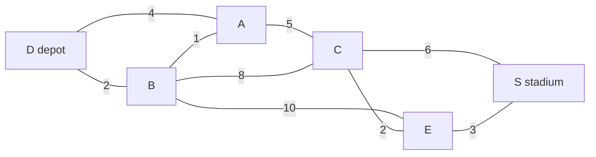
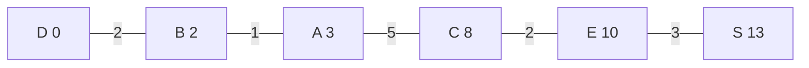

# Dijkstra's algorithm: settle the cheapest unsettled point, relax its neighbours, and the cheapest routes appear when no cost is negative

[Syllabus](../../../SYLLABUS.md) → [Combinatorics and graphs](../../../SYLLABUS.md#w04) → [Trees and Cheapest Routes](../../../SYLLABUS.md#w04-s10) → Dijkstra's algorithm

---

## General Overview

A van leaves the depot at six with stock for the stadium. Six points matter on the driver's map: the depot D, the stadium S, and four junctions, A, B, C and E. Nine roads join them, each marked with the minutes it takes to drive.

The map sets a trap at once. The depot's own road to A takes 4 minutes, yet the depot to B and B to A takes 2 + 1 = 3: the way round beats the direct road. Thirteen routes reach the stadium without doubling back, and the quickest uses five roads, not the fewest.

Dijkstra's procedure finds it without listing any of them. Every point holds a running guess at its cost from the depot; the smallest guess among the unfinished points is taken as final, and its roads improve its neighbours' guesses. Five settlements bring the stadium to 13 minutes, by D-B-A-C-E-S. Edsger Dijkstra published it in 1959, in three pages.

A finished point is **settled**; improving a neighbour's guess along one road is **relaxing** that road.

**No road costs less than nothing, so the smallest guess among the unsettled points cannot be beaten by any route still to be found: settle it, relax its roads, repeat, and the guesses end as the cheapest costs.**

**What kind of fact this is:** a method. That settling the smallest guess is safe is a theorem, proved on this card in Why it works.

### The picture: six points, nine roads, minutes on each



Each road runs both ways.

---

## The formula

Notation first, in words. Each point carries its **tentative cost** $d[v]$, the fewest minutes from the depot to v so far, and its **predecessor** $p[v]$, the point just before v on that route. Write $w(u,v)$ for the minutes on the road joining u to v, $\infty$ for a cost with no route behind it yet, and u and v for points.

Relaxing one road is one comparison. The arrow means *becomes*, and min is the smaller of the two numbers in the brackets:

$$d[v] \leftarrow \min\big(d[v],\ d[u] + w(u,v)\big)$$

**Read it aloud:** v's cheapest known cost is either what it was, or the cost of reaching u plus the road from u to v, whichever is smaller.

Settling is one choice:

$$\text{settle the unsettled } u \text{ of smallest } d[u]\text{: that } d[u] \text{ is final}$$

**Read it aloud:** the smallest guess among the unfinished points is already the truth.

Start with 0 at the depot, $\infty$ elsewhere, nothing settled; then settle, relax, and repeat until nothing is unsettled.

| Symbol | Plain meaning | In our example | Push it up and the answer… |
| --- | --- | --- | --- |
| $d[v]$ | tentative cost, minutes from the depot | d[A] is 4, then 3 | — |
| $p[v]$ | predecessor, the point just before v | p[S] is E | — |
| $w(u,v)$ | minutes on the road joining u and v | w(B,A) = 1 | routes using it cost more |
| $u$ | the point settled this round | D, then B, then A | — |
| $v$ | a neighbour of u being tested | A, C, E when B settles | — |
| $\infty$ | no route found yet | the stadium, until C settles | more points unreached |

### When it holds

- **No cost below zero.** Step 2 leans on it once, and the checks show 2 returned where 1 is right once a cost turns negative.
- **Costs add along a route.** A route costs the sum of its roads, nothing subtler.
- **Finitely many points.** Each settles once, so six rounds end it.
- **One start.** These are costs from the depot; costs from the stadium need a second run.

---

## Why it works

### Step 0: every route's front runs through settled points

Walk any route from the depot to an unsettled point and meet a first point on it not yet settled — call it x. Everything before x is settled, so the route's front, depot to x, is one of the routes the guesses already track.

### Step 1: a guess is the best route through settled points

What a guess means, at every moment: $d[v]$ is the cost of the cheapest route from the depot to v whose earlier points are all settled, and $\infty$ if there is none.

Settling u adds one kind of candidate, a route through settled points arriving by a road out of u; relaxing every road out of u tests exactly those, at $d[u] + w(u,v)$. So the meaning survives the round: settling B at 2 drops A's guess from 4 to 3 and gives C and E their first numbers, 10 and 12.

### Step 2: the smallest unsettled guess is already the truth

Let u be the unsettled point with the smallest guess, and take any route from the depot to u. By Step 0 it has a first unsettled point x; by Step 1 its front to x costs at least $d[x]$; and $d[x] \ge d[u]$. The rest is roads costing zero or more, so it cannot subtract. The route costs at least $d[u]$, itself a real route's cost. Nothing beats it, so settling is safe.

When A settles at 3, the settled points are D and B; any route to A must leave that pair, and the cheapest guess outside it is A's own 3.

<details>
<summary>Detailed proof: the induction behind Steps 1 and 2</summary>

Step 1's claim and "every settled point's guess is its true cheapest cost" are proved together, by induction on the rounds. Both hold before the first, when only the depot's empty route qualifies. Each round, Step 2 settles a point at its true cost and relaxing that point's roads restores Step 1.

</details>

### Step 3: the predecessors give the route, as a tree

The predecessors read p[S] = E, p[E] = C, p[C] = A, p[A] = B, p[B] = D. Walk back from the stadium and reverse: D-B-A-C-E-S, whose own roads add to 2 + 1 + 5 + 2 + 3 = 13.

Each point but the depot has one predecessor and every chain ends there, so the arrows form a tree rooted at the depot ([Rooted trees](02-rooted-and-binary-trees.md)), spanning all it reaches ([Spanning trees](03-spanning-trees-and-cayleys-formula.md)), here a single chain.



Each box holds a point and its settled cost, each label a road's minutes. D-A, B-C, B-E and C-S lie in no cheapest route.

### Step 4: one negative cost and the argument collapses

Drop the line about zero or more and Step 2 has nothing left. Money makes that concrete: three points, roads one-way only, since a rebate drivable both ways would pay for ever. The depot to A costs 4, the depot to B costs 2, and a stretch from A to B pays the driver back 3, a cost of −3. Settling takes B first, at 2, and locks it. A settles later at 4, and its road offers B 4 − 3 = 1. Too late: B will not reopen. Listing says 1; Dijkstra says 2 and is wrong. Relaxing every road repeatedly instead of settling anything is [Bellman-Ford](06-bellman-ford-and-arbitrage.md).

<details>
<summary>Finding the smallest guess faster</summary>

Scanning the unsettled points each round makes the work grow with the square of the number of points; a **binary heap**, a tree kept so no child holds a smaller number than its parent, hands over the smallest at once, dropping that to roughly the roads times the logarithm of the points.

</details>

---

## Worked numbers, by hand

| Step | Arithmetic | Value |
| --- | --- | --- |
| settle the depot at 0 | 4 to A, 2 to B | A 4, B 2 |
| settle B at 2 | 2 + 1 beats A's 4 | **A 3**, C 10, E 12 |
| settle A at 3 | 3 + 5 beats C's 10 | **C 8** |
| settle C at 8 | 8 + 2 beats E's 12 | E 10, S 14 |
| settle E at 10 | 10 + 3 beats S's 14 | **S 13** |
| settle S at 13 | nothing left | **13** |
| the route read back | 2 + 1 + 5 + 2 + 3 | **13** |

Five settlements leave the stadium the only unsettled point, so nothing can lower its 13; the sixth settles it and changes nothing. The van arrives 13 minutes after six, by a five-road way round rather than three roads at 15.

### What breaks if you drop a piece

| Mistake | Comes out at | What went wrong |
| --- | --- | --- |
| "Shortest" read as fewest roads | 15 minutes | D-A-C-S is three roads; minutes add |
| The stadium's first guess quoted | 14 minutes | the guess through C, before E lowers it |
| A guess never improved | 16 minutes | C keeps 10 through B, not 8 through A |
| A negative cost, one-way | 2 where 1 is right | a route's rest can then subtract |

The code prints all four.

---

## Code, from first principles, and it actually runs

Nothing is imported. Two checks share no arithmetic: the procedure, settling and relaxing; and a listing of every route out of the depot that repeats no point. The predecessors' route is checked against the listing's cheapest, its own roads added up separately, and the last line runs the rebate map.

### Python

```python
# Dijkstra's algorithm -- the check behind the card.  Nothing is imported.  A van leaves the depot D for
# the stadium S over nine roads across four junctions, the number on a road being minutes.  Check one
# settles the cheapest unsettled point and relaxes its neighbours; check two lists every repeat-free route
# and reads off the smallest total, settling nothing.  The last line puts a negative cost in and breaks it.
PTS = ["D", "A", "B", "C", "E", "S"]
ROADS = [("D", "A", 4), ("D", "B", 2), ("B", "A", 1), ("A", "C", 5), ("B", "C", 8),
         ("B", "E", 10), ("C", "E", 2), ("C", "S", 6), ("E", "S", 3)]
BIG, iS = 10 ** 9, PTS.index("S")        # BIG stands in for "no route found yet"; iS is S's column
VAN = {p: [] for p in PTS}
for a, b, w in ROADS: VAN[a].append((b, w)); VAN[b].append((a, w))          # a road runs both ways
NEG = {"D": [("A", 4), ("B", 2)], "A": [("B", -3)], "B": []}                # one-way, one rebate of 3
def settle(adj, pts, start, first_only=False):            # check one: settle, then relax
    d = {p: BIG for p in pts}; back = {}; d[start] = 0; unsettled = list(pts); rows = []
    while unsettled:
        u = min(unsettled, key=lambda v: (d[v], pts.index(v)))      # the cheapest unsettled point
        unsettled.remove(u)                                         # settled: its cost is final
        for v, w in adj[u]:
            better = d[v] == BIG if first_only else d[u] + w < d[v]
            if v in unsettled and better: d[v], back[v] = d[u] + w, u    # relax the road u-v
        rows.append((u, [d[p] for p in pts]))
    return d, back, rows
def listing(adj, a, b, seen=()):                          # check two: every repeat-free route
    if a == b: return [(0, (b,))]
    out = []
    for v, w in adj[a]:
        if v not in seen and v != a: out += [(w + c, (a,) + r) for c, r in listing(adj, v, b, seen + (a,))]
    return out
def best(adj, a, b): return min(listing(adj, a, b))
def row(tag, nums): return f"{tag:<6}" + "".join(f"{'inf' if n >= BIG else n:>5}" for n in nums)
d, back, rows = settle(VAN, PTS, "D")
route = ["S"]
while route[-1] != "D": route.append(back[route[-1]])      # walk the predecessors home
route.reverse(); legs = set(zip(route, route[1:]))
paid = sum(w for a, b, w in ROADS if (a, b) in legs or (b, a) in legs)
to_S = sorted(listing(VAN, "D", "S")); few = min((len(r) - 1, c, r) for c, r in to_S)
first_S = next(snap[iS] for _, snap in rows if snap[iS] < BIG)
no_relax = settle(VAN, PTS, "D", first_only=True)[0]["S"]
print("roads (minutes): " + ", ".join(f"{a}-{b} {w}" for a, b, w in ROADS))
print("settle" + "".join(f"{p:>5}" for p in PTS))
print(row("init", [0 if p == "D" else BIG for p in PTS]))
for u, snap in rows: print(row(u, snap))
print("cheapest minutes from D, by settling:  " + ", ".join(f"{p} {d[p]}" for p in PTS))
print("the same, by listing every route:      " + ", ".join(f"{p} {best(VAN, 'D', p)[0]}" for p in PTS))
print(f"route to S, from the predecessors {'-'.join(route)}, by listing {'-'.join(to_S[0][1])}, 1 of {len(to_S)}")
print(f"its own roads add to {paid}; S reads {rows[4][1][iS]} after 5 settlements, {rows[5][1][iS]} after 6")
print(f"mistake, fewest roads: {'-'.join(few[2])}, {few[0]} roads, {few[1]} minutes")
print(f"mistake, quoting S's first guess: {first_S} minutes, before E improves it")
print(f"mistake, never improving a guess: {no_relax} minutes")
print(f"negative map D-A 4, D-B 2, one-way A-B -3: settling says {settle(NEG, ['D', 'A', 'B'], 'D')[0]['B']}, "
      f"listing says {best(NEG, 'D', 'B')[0]}")
assert d == {p: best(VAN, "D", p)[0] for p in PTS}         # two roads, every cheapest cost
assert paid == d["S"] == 13 and tuple(route) == to_S[0][1]
assert (few[0], few[1], first_S, no_relax) == (3, 15, 14, 16)
assert best(NEG, "D", "B")[0] == 1 and settle(NEG, ["D", "A", "B"], "D")[0]["B"] == 2
print("ALL CHECKS PASS")
```

**Ran 2026-09-19 on macOS, Python 3.14.6, standard library only. All checks passed. Output, pasted from the run:**

```
roads (minutes): D-A 4, D-B 2, B-A 1, A-C 5, B-C 8, B-E 10, C-E 2, C-S 6, E-S 3
settle    D    A    B    C    E    S
init      0  inf  inf  inf  inf  inf
D         0    4    2  inf  inf  inf
B         0    3    2   10   12  inf
A         0    3    2    8   12  inf
C         0    3    2    8   10   14
E         0    3    2    8   10   13
S         0    3    2    8   10   13
cheapest minutes from D, by settling:  D 0, A 3, B 2, C 8, E 10, S 13
the same, by listing every route:      D 0, A 3, B 2, C 8, E 10, S 13
route to S, from the predecessors D-B-A-C-E-S, by listing D-B-A-C-E-S, 1 of 13
its own roads add to 13; S reads 13 after 5 settlements, 13 after 6
mistake, fewest roads: D-A-C-S, 3 roads, 15 minutes
mistake, quoting S's first guess: 14 minutes, before E improves it
mistake, never improving a guess: 16 minutes
negative map D-A 4, D-B 2, one-way A-B -3: settling says 2, listing says 1
ALL CHECKS PASS
```

### Rust

Same numbers, same labels, built with `rustc --edition 2021 -O`.

```rust
// Dijkstra's algorithm -- the same check as the Python, in Rust.  No crates.  A van leaves the depot D
// for the stadium S over nine roads across four junctions, the number on a road being minutes.  Check one
// settles the cheapest unsettled point and relaxes its neighbours; check two lists every repeat-free route
// and reads off the smallest total, settling nothing.  The last line puts a negative cost in and breaks it.
const PTS: [char; 6] = ['D', 'A', 'B', 'C', 'E', 'S'];
const ROADS: [(usize, usize, i64); 9] = [(0, 1, 4), (0, 2, 2), (2, 1, 1), (1, 3, 5), (2, 3, 8),
                                         (2, 4, 10), (3, 4, 2), (3, 5, 6), (4, 5, 3)];
const BIG: i64 = 1_000_000_000;          // BIG stands in for "no route found yet"
const IS: usize = 5;                     // S's column, the last of the six points
type Adj = Vec<Vec<(usize, i64)>>;
fn van() -> Adj { let mut a: Adj = vec![Vec::new(); 6];
    for &(u, v, w) in &ROADS { a[u].push((v, w)); a[v].push((u, w)) } a }        // a road runs both ways
fn neg() -> Adj { vec![vec![(1, 4), (2, 2)], vec![(2, -3)], Vec::new()] }        // one-way, one rebate
fn settle(adj: &Adj, start: usize, first_only: bool) -> (Vec<i64>, Vec<usize>, Vec<(usize, Vec<i64>)>) {
    let (n, mut rows) = (adj.len(), Vec::new());                    // check one: settle, then relax
    let (mut d, mut back) = (vec![BIG; n], vec![n; n]); d[start] = 0;
    let mut unsettled: Vec<usize> = (0..n).collect();
    while !unsettled.is_empty() {
        let u = *unsettled.iter().min_by_key(|&&v| (d[v], v)).unwrap();      // cheapest unsettled point
        unsettled.retain(|&v| v != u);                                       // settled: cost is final
        for &(v, w) in &adj[u] {                        // relax: is the road through u cheaper?
            if unsettled.contains(&v) && (if first_only { d[v] == BIG } else { d[u] + w < d[v] })
                { d[v] = d[u] + w; back[v] = u }
        }
        rows.push((u, d.clone()));
    }
    (d, back, rows)
}
fn listing(adj: &Adj, a: usize, b: usize, seen: &mut Vec<usize>) -> Vec<(i64, Vec<usize>)> {
    if a == b { return vec![(0, vec![b])] }           // check two: every repeat-free route
    let mut out = Vec::new(); seen.push(a);
    for &(v, w) in &adj[a] {
        if !seen.contains(&v) { for (c, r) in listing(adj, v, b, seen) {
            let mut route = vec![a]; route.extend(r); out.push((w + c, route)) } }
    }
    seen.pop(); out
}
fn best(adj: &Adj, a: usize, b: usize) -> (i64, Vec<usize>) {
    let mut all = listing(adj, a, b, &mut Vec::new()); all.sort(); all[0].clone() }
fn row(tag: String, nums: &[i64]) -> String { let mut s = format!("{:<6}", tag);
    for &n in nums { s += &format!("{:>5}", if n >= BIG { "inf".to_string() } else { n.to_string() }) } s }
fn name(vs: &[usize], sep: &str) -> String {
    vs.iter().map(|&v| PTS[v].to_string()).collect::<Vec<String>>().join(sep) }
fn main() {
    let (adj, rebate) = (van(), neg());
    let (d, back, rows) = settle(&adj, 0, false);
    let mut route = vec![IS];                                           // walk the predecessors home
    while *route.last().unwrap() != 0 { route.push(back[*route.last().unwrap()]) } route.reverse();
    let legs: Vec<(usize, usize)> = route.windows(2).map(|p| (p[0], p[1])).collect();
    let paid: i64 = ROADS.iter().filter(|&&(a, b, _)| legs.contains(&(a, b)) || legs.contains(&(b, a)))
        .map(|&(_, _, w)| w).sum();
    let mut to_s = listing(&adj, 0, IS, &mut Vec::new()); to_s.sort();
    let few = to_s.iter().map(|(c, r)| (r.len() - 1, *c, r.clone())).min().unwrap();
    let first_s = rows.iter().map(|(_, s)| s[IS]).find(|&v| v < BIG).unwrap();
    let no_relax = settle(&adj, 0, true).0[IS];
    println!("roads (minutes): {}", ROADS.iter().map(|&(a, b, w)| format!("{}-{} {}", PTS[a], PTS[b], w))
        .collect::<Vec<String>>().join(", "));
    println!("settle{}", PTS.iter().map(|p| format!("{:>5}", p)).collect::<Vec<String>>().join(""));
    let mut init = vec![BIG; 6]; init[0] = 0; println!("{}", row("init".to_string(), &init));
    for (u, snap) in &rows { println!("{}", row(PTS[*u].to_string(), snap)) }
    println!("cheapest minutes from D, by settling:  {}",
        (0..6).map(|v| format!("{} {}", PTS[v], d[v])).collect::<Vec<String>>().join(", "));
    println!("the same, by listing every route:      {}",
        (0..6).map(|v| format!("{} {}", PTS[v], best(&adj, 0, v).0)).collect::<Vec<String>>().join(", "));
    println!("route to S, from the predecessors {}, by listing {}, 1 of {}",
        name(&route, "-"), name(&to_s[0].1, "-"), to_s.len());
    println!("its own roads add to {}; S reads {} after 5 settlements, {} after 6",
        paid, rows[4].1[IS], rows[5].1[IS]);
    println!("mistake, fewest roads: {}, {} roads, {} minutes", name(&few.2, "-"), few.0, few.1);
    println!("mistake, quoting S's first guess: {} minutes, before E improves it", first_s);
    println!("mistake, never improving a guess: {} minutes", no_relax);
    println!("negative map D-A 4, D-B 2, one-way A-B -3: settling says {}, listing says {}",
        settle(&rebate, 0, false).0[2], best(&rebate, 0, 2).0);
    assert!(d == (0..6).map(|v| best(&adj, 0, v).0).collect::<Vec<i64>>());  // two roads, every cost
    assert!(paid == d[IS] && d[IS] == 13 && route == to_s[0].1);
    assert!((few.0, few.1, first_s, no_relax) == (3, 15, 14, 16));
    assert!(best(&rebate, 0, 2).0 == 1 && settle(&rebate, 0, false).0[2] == 2);
    println!("ALL CHECKS PASS");
}
```

**Ran 2026-09-19 on macOS, rustc 1.98.1, no crates. All checks passed. Output, pasted from the run:**

```
roads (minutes): D-A 4, D-B 2, B-A 1, A-C 5, B-C 8, B-E 10, C-E 2, C-S 6, E-S 3
settle    D    A    B    C    E    S
init      0  inf  inf  inf  inf  inf
D         0    4    2  inf  inf  inf
B         0    3    2   10   12  inf
A         0    3    2    8   12  inf
C         0    3    2    8   10   14
E         0    3    2    8   10   13
S         0    3    2    8   10   13
cheapest minutes from D, by settling:  D 0, A 3, B 2, C 8, E 10, S 13
the same, by listing every route:      D 0, A 3, B 2, C 8, E 10, S 13
route to S, from the predecessors D-B-A-C-E-S, by listing D-B-A-C-E-S, 1 of 13
its own roads add to 13; S reads 13 after 5 settlements, 13 after 6
mistake, fewest roads: D-A-C-S, 3 roads, 15 minutes
mistake, quoting S's first guess: 14 minutes, before E improves it
mistake, never improving a guess: 16 minutes
negative map D-A 4, D-B 2, one-way A-B -3: settling says 2, listing says 1
ALL CHECKS PASS
```

The two outputs match line for line.

> [!TIP]
> **Try changing**
> Guess first, then run it. The asserts are pinned to this map, so expect one to stop the program.
> - **Make the little road dearer.** Set B-A to 7 minutes in `ROADS`: A is never improved, the direct road at 4 wins it, and the assert pinned to 13 stops the run.
> - **Refuse to improve anything.** Pass `first_only=True` to `settle`: every point keeps its first guess and the stadium reads 16 minutes.
> - **Put the rebate on the van's map.** Set C-E to −2: the predecessors' route no longer costs 13, and the second assert stops the run.

---

## The usual mistake

> [!warning]
> **Reading a tentative cost as an answer before its point is settled.** The stadium's first number is 14 minutes, written the moment C settles. It is a guess, not a cost: settling E lowers it to 13. Quoting an unfinished table is the commonest way to run the procedure right and still report the wrong route.
>
> - **"Shortest means fewest roads."** Three roads reach the stadium in 15 minutes, five in 13. Counting steps is the flood of [Connected or not](../09-Graphs%20-%20Dots%20and%20Lines/04-connectivity-and-breadth-first-search.md), right only when steps cost the same.
> - **Settling whatever was discovered first.** C is discovered at 10, through B, and settles at 8. Discovery order is not cost order.
> - **Taking this tree for the cheapest skeleton.** [The cheapest skeleton](04-minimum-spanning-trees.md) makes the whole map's road minutes least; this makes each point's cost from one start least. The same roads can serve both, as here.

---

## Where you meet it in real life

- **Turn-by-turn navigation.** Junctions are points, segments carry estimated minutes, and the phone settles outward from the car; live traffic changes the numbers, not the procedure.
- **Internet routing.** A router running OSPF, a standard by which routers share the cost of each link, settles cheapest paths over that map and redoes them whenever a cost changes.
- **Fares and connections.** The cheapest itinerary through hubs, with money or waiting time on the roads.
- **Distance across a cloud of measurements.** Join each measurement to its nearest neighbours, settle routes through the cloud, and the costs approximate distance along a curved surface.

> **Say it back**
> Every point keeps a guess at its cheapest cost from the start and the point it came through. Take the smallest guess among the unfinished points, declare it final, and use that point's roads to lower its neighbours' guesses. It is safe because any other route must leave the finished set, and leaving already costs at least as much, with nothing negative to come. The stadium comes out at 13 minutes by D-B-A-C-E-S, against 15 for the best route with fewest roads.

---

## What this builds on

- [Connected or not](../09-Graphs%20-%20Dots%20and%20Lines/04-connectivity-and-breadth-first-search.md): the flood that counts fewest steps when every step costs the same, and the queue this card replaces with "cheapest guess first".

## Where this goes next

- [Bellman-Ford](06-bellman-ford-and-arbitrage.md): relaxes every road repeatedly, settling nothing, so negative costs are allowed — and a loop that pays is an arbitrage.
- [The Chinese postman](../11-Tours%20-%20Euler%20and%20Hamilton/02-chinese-postman.md): the cheapest round trip covering every road, built on cheapest point-to-point costs.
- Graph algorithms as code: what a heap and a target-directed search do on a country-sized map.
- Manifold learning: cheapest routes through data standing in for distance on a curved surface.

Minutes never run backwards, and that one fact is everything the safety argument used; where a cost can genuinely fall below zero, no point may be settled at all.

---

## Sources

Verified 19 Sep 2026: every link below resolves to the publisher's page.

- Dijkstra, E. W. "A note on two problems in connexion with graphs." *Numerische Mathematik* 1 (1959): 269–271. [doi:10.1007/BF01386390](https://doi.org/10.1007/BF01386390). The original; problem 2 is this card.
- Cormen, Thomas H., Charles E. Leiserson, Ronald L. Rivest, and Clifford Stein. *Introduction to Algorithms*, 4th ed. MIT Press, 2022. [Publisher page](https://mitpress.mit.edu/9780262046305/introduction-to-algorithms/). The standard proof of Step 2.
- Fredman, Michael L., and Robert Endre Tarjan. "Fibonacci heaps and their uses in improved network optimization algorithms." *Journal of the ACM* 34, no. 3 (1987): 596–615. [doi:10.1145/28869.28874](https://doi.org/10.1145/28869.28874). The queue behind the folded note on speed.
- Skiena, Steven S. *The Algorithm Design Manual*, 3rd ed. Springer, 2020. [Publisher page](https://link.springer.com/book/10.1007/978-3-030-54256-6). Which everyday problems are this one in disguise.
