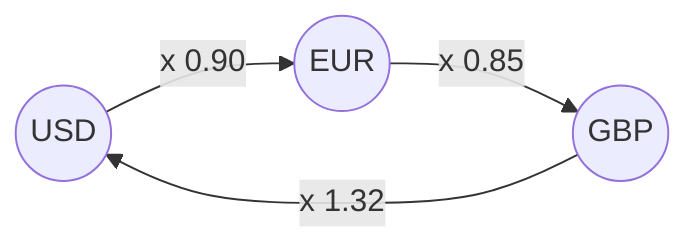
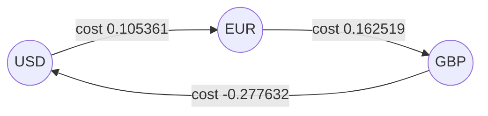

# Bellman-Ford: relax every edge n - 1 times, negative costs allowed, and a loop that still improves is a money machine

[Syllabus](../../../SYLLABUS.md) → [Combinatorics and graphs](../README.md) → [Trees and Cheapest Routes](../README.md#s10) → Bellman-Ford

---

## General Overview

A dealing screen quotes three one-way prices. One US dollar buys 0.90 euro. One euro buys 0.85 pound. One pound buys 1.32 dollars.

Multiply the three: 0.90 × 0.85 × 1.32 = 1.0098. A dollar sent round the loop comes home as 1.0098 dollars, up 0.98%, in three trades, with no view taken on where prices are heading. Money that leaves and returns larger is an **arbitrage** — the word from here on.

Three currencies can be checked by hand. Hundreds cannot, and the paying loop may run through any five of them. So change what the arrows carry: each leg's **cost** is minus the logarithm of its rate. Multiplying rates becomes adding costs, and a loop that multiplies money above 1 becomes one whose costs add below 0 — free money as a cheapest route with negative costs.

Negative costs are what the greedy method cannot take: it settles the nearest dot and never reconsiders it ([Dijkstra's algorithm](05-dijkstra.md)). Lester Ford in 1956 and Richard Bellman in 1958 set out a method that locks nothing.

**Relaxing every edge n − 1 times finds every cheapest route whenever no loop pays, since a cheapest route has at most n − 1 legs; an n-th round that still improves proves a loop pays — an arbitrage.**

**What kind of fact this is:** a method, resting on a theorem — n − 1 rounds suffice, a further improvement means a paying loop — proved on this card in Why it works.

### The picture: three currencies, three quoted rates



Each rate is one arrow. Round the loop they multiply to 1.0098.

---

## The formula

Notation first, in words. The market is a directed graph: a dot per currency, an arrow per quoted rate, $n$ of the first and $m$ of the second. On the arrow from $u$ to $v$, the rate $r(u \to v)$ is how much of $v$ one unit of $u$ buys; its cost is minus that rate's natural logarithm, written $\ln$ ([Logarithms](../../01-Foundations/03-Powers%2C%20Roots%20and%20Logarithms/05-logarithms.md)):

$$w(u \to v) \;=\; -\ln r(u \to v)$$

**Read it aloud:** a leg's cost is minus the log of its rate, so a generous rate is cheap.

Next, $d(v)$: the smallest cost so far of a route from the start to $v$, infinity until one is found. To **relax** an arrow is to ask whether reaching $u$ and paying its cost beats the number at $v$, and keep the smaller:

$$d(v) \;\leftarrow\; \min\big(d(v),\; d(u) + w(u \to v)\big)$$

The method is three lines. Set $d$ to 0 at the start, infinity elsewhere. Do $n$ − 1 rounds, each relaxing all $m$ arrows in a fixed order. Do one more: if any relax still improves, a loop pays.

For a loop of $k$ legs, profit test and cost test are one test:

$$r_1 r_2 \cdots r_k > 1 \quad\Longleftrightarrow\quad w_1 + w_2 + \cdots + w_k < 0$$

| Symbol | Plain meaning | In our example | Push it up and the answer… |
| --- | --- | --- | --- |
| $r$ | a quoted rate: units bought per unit sold | 0.90, 0.85, 1.32 | the loop's product rises |
| $w$ | a leg's cost, minus the log of its rate | 0.105361, 0.162519, −0.277632 | routes through it dearer |
| $d$ | smallest cost so far at a currency | 0.105361 at EUR | — |
| $u$, $v$ | an arrow's ends, $u$ to $v$ | USD and EUR | — |
| $n$ | currencies listed | 3 | more rounds, $n$ − 1 of them |
| $m$ | rates quoted | 3 | each round is $m$ relaxes |
| $k$ | legs in a route or loop | 3 | — |

### When it holds

- **Every rate is positive**, or it has no logarithm and so no cost; and the currencies are finitely many, since the round count is $n$ − 1.
- **No loop pays**, where a cheapest route is wanted: riding a paying loop again lowers the total again, and the extra round reports that instead of an answer.
- **The rates are the ones dealt, and the loop is reachable from the start.** A fee is a positive cost on its leg, and enough of it turns a paying loop into a losing one.

---

## Why it works

### Step 0: a logarithm turns multiplying into adding

Profit round a loop means the rates multiply above 1. The logarithm rises with its input, so taking logs keeps that inequality, and the log of a product is the sum of the logs ([Log laws and log scales](../../01-Foundations/03-Powers%2C%20Roots%20and%20Logarithms/06-log-laws-and-log-scales.md)). Negate every log and "above 1" becomes "below 0" — a route-finder on a trading screen.



The same legs as costs: the generous 1.32 turned negative, and the three total −0.009752.

### Step 1: after round $k$, every cheapest route of at most $k$ legs is on the table

Every number in $d$ is the cost of a real route, so none is ever too low; the rounds chase the numbers that are too high. Round 1 relaxes the arrows leaving the start, so every one-leg route lands. Cut the last arrow, $u$ to $v$, off a cheapest route of at most $k$ legs: what is left reaches $u$ in at most $k$ − 1 legs, on the table by round $k$ − 1, and round $k$ relaxes that arrow.

### Step 2: $n$ − 1 rounds are enough, when no loop pays

A cheapest route never has to visit a currency twice: cut out the stretch between two visits and a loop is gone, whose costs add to 0 or more when nothing pays, so the route is no dearer. A route with no repeat has at most $n$ − 1 legs, all on the table by round $n$ − 1: with three currencies, two rounds.

### Step 3: an $n$-th round that still improves is a money machine

If no loop pays, the table after $n$ − 1 rounds holds the cheapest costs and every arrow fails its relax question. A further improvement rules that case out: some loop pays. The detector is one round.

Round 3 drops USD from 0.000000 to −0.009752, and following each improvement back walks the loop: USD to EUR to GBP to USD, costs adding to −0.009752, rates multiplying to 1.009800. The fall does not stop. EUR reaches 0.095608 in the same round, and every later round pulls the table lower, so there is no cheapest route and no ceiling on the money.

<details>
<summary>Detailed proof: the induction and the exchange</summary>

Let $D_k(v)$ be the least cost of a route from the start to $v$ over at most $k$ arrows. **Claim 1:** after round $k$, $d(v) \le D_k(v)$. Induct: drop the last arrow, $u$ to $v$, of a $k$-arrow route costing $D_k(v)$; the rest is a $k$ − 1 case, so $u$ enters round $k$ at $D_k(v) - w(u \to v)$ or lower, and round $k$ relaxes that arrow.

**Claim 2:** with no negative-total loop, deleting the loop between two visits to a repeated currency never raises a cost, so a cheapest route needs at most $n$ − 1 arrows. Those costs admit no relax, so an improvement in round $n$ denies the hypothesis; "came from" followed back $n$ times closes the paying loop.

</details>

<details>
<summary>All pairs at once: Floyd-Warshall</summary>

Bellman-Ford answers from one currency; a desk wants every pair. Robert Floyd's 1962 loop — Algorithm 97, on a theorem of Stephen Warshall — keeps a square table `D(i,j)` of costs, one row and column per currency: for each currency `s` in turn and every pair `i`, `j`, keep the smaller of `D(i,j)` and `D(i,s) + D(s,j)`.

The outer loop is *which* currencies may be stepping-stones, not *how many* legs are allowed; move it inward and a different claim is proved. A negative number on the diagonal is then a paying loop: USD's own entry lands on −0.009752.

</details>

With no negative cost the greedy method is faster ([Dijkstra's algorithm](05-dijkstra.md)); the cheapest set of links holding a network together is another question ([The cheapest skeleton](04-minimum-spanning-trees.md)).

---

## Worked numbers, by hand

Start at USD and scan the legs in the check's order: GBP to USD, EUR to GBP, USD to EUR. Each leg comes before the leg that feeds it, the slowest order there is, so a round advances the answer by one leg.

| Step | Arithmetic | Value |
| --- | --- | --- |
| the three costs | minus the log of 0.90, 0.85, 1.32 | 0.105361, 0.162519, −0.277632 |
| start | USD at 0, the others unreached | 0.000000 |
| round 1 | the one relax that fires | EUR 0.105361 |
| round 2 | 0.105361 + 0.162519 | GBP 0.267879 |
| round 3, the extra | 0.267879 − 0.277632 | **USD −0.009752** |
| the loop in money | 0.90 × 0.85 × 1.32 | **1.009800** |

Two rounds settled the table and the third moved it anyway: the certificate. Move the pound-to-dollar rate to 1.30 and it is gone — the rates multiply to 0.994500, down 0.55%, and round 3 offers USD 0.005515, no improvement on 0.000000.

### What breaks if you drop a piece

| Mistake | Comes out at | What went wrong |
| --- | --- | --- |
| Stopping after $n$ − 1 rounds | USD reads 0.000000 | the table looks settled; the extra round finds the loop |
| Product against 0, costs against 1 | 0.994500 > 0, 0.005515 < 1 | the losing market clears both, so nothing is detected |
| Adding the log, not subtracting | the loop totals 0.009752 | a generous rate looks dear, so arbitrage is missed |

The code prints all three.

---

## Code, from first principles, and it actually runs

Nothing is imported. Two roads reach the verdict: one adds costs, minus the log of each rate, over $n$ − 1 rounds and one more; the other never takes a log, multiplying rates along every route of at most three legs. The log itself is computed twice: from a series, and as the area under 1/t, which is what a natural log measures.

### Python

```python
# Bellman-Ford and arbitrage -- the check behind the card.  Nothing is imported.
# Three currencies, three quoted rates: USD->EUR 0.90, EUR->GBP 0.85, GBP->USD
# 1.32.  Road one adds costs, minus the log of each rate, relaxing every quoted
# rate n-1 rounds and once more.  Road two multiplies rates along every route.
CUR = ["USD", "EUR", "GBP"]
ARB = [("GBP", "USD", 1.32), ("EUR", "GBP", 0.85), ("USD", "EUR", 0.90)]
CLEAN = [("GBP", "USD", 1.30), ("EUR", "GBP", 0.85), ("USD", "EUR", 0.90)]
INF, SRC = float("inf"), "USD"
def ln(x):                        # natural log, from the series in (x-1)/(x+1)
    y = (x - 1.0) / (x + 1.0)
    total, term = 0.0, y
    for k in range(1, 40, 2):
        total, term = total + term / k, term * y * y
    return 2.0 * total
def ln_area(x):                   # the same log as the area under 1/t, by Simpson's rule
    h, total = (x - 1.0) / 2000, 1.0 + 1.0 / x
    for i in range(1, 2000):
        total += (4.0 if i % 2 else 2.0) / (1.0 + i * h)
    return total * h / 3.0
def rounds(market, extra):        # road one: relax every quoted rate, round after round
    d = {c: (0.0 if c == SRC else INF) for c in CUR}
    table, improved = [dict(d)], False
    for r in range(len(CUR) - 1 + extra):
        for a, b, rate in market:
            if d[a] < INF and d[a] - ln(rate) < d[b] - 1e-12:
                d[b], improved = d[a] - ln(rate), improved or r == len(CUR) - 1
        table.append(dict(d))
    return table, improved
def walks(market, legs):          # road two: every route of at most `legs` legs, rates multiplied
    best, frontier = {SRC: 1.0}, [(SRC, 1.0)]
    for _ in range(legs):
        frontier = [(b, m * rate) for c, m in frontier for a, b, rate in market if a == c]
        for c, m in frontier:
            best[c] = max(best.get(c, 0.0), m)
    return best
def trip(market): return market[0][2] * market[1][2] * market[2][2]
def cost_sum(market): return sum(-ln(rate) for _, _, rate in market)

(tab, neg), (tabc, negc) = rounds(ARB, 1), rounds(CLEAN, 1)
p, pc = trip(ARB), trip(CLEAN)
print("quoted market: " + ",  ".join(f"{a}->{b} {r:.2f}" for a, b, r in reversed(ARB)))
print("costs, minus the log of each rate: " + ",  ".join(f"{a}->{b} {-ln(r):.6f}" for a, b, r in reversed(ARB)))
print("scan order inside every round: " + ", ".join(f"{a}->{b}" for a, b, _ in ARB))
print(f"{'round':<6}" + "".join(f"{c:>10}" for c in CUR))
for lab, d in (("start", tab[0]), ("1", tab[1]), ("2", tab[2]), ("3", tab[3])):
    print(f"{lab:<6}" + "".join(f"{'inf':>10}" if d[c] == INF else f"{d[c]:10.6f}" for c in CUR))
print(f"round 3 still improves {SRC}, {tab[3][SRC]:.6f} against {tab[2][SRC]:.6f}, so a loop pays: {'yes' if neg else 'no'}")
print(f"loop USD->EUR->GBP->USD: costs added {cost_sum(ARB):.6f}, rates multiplied {p:.6f} ({(p - 1) * 100:+.2f}%)")
print(f"minus the log of {p:.6f} is {-ln(p):.6f}; best multiplier home over routes of at most 3 legs {walks(ARB, 3)[SRC]:.6f}")
print(f"the log of 1.32 by the series {ln(1.32):.6f}, by the area under 1/t {ln_area(1.32):.6f}")
print(f"market with GBP->USD at 1.30: rates multiplied {pc:.6f} ({(pc - 1) * 100:+.2f}%), costs added {cost_sum(CLEAN):.6f}")
print(f"its rounds 1 and 2 read as above; round 3 offers {SRC} {tabc[2]['GBP'] - ln(1.30):.6f}, no improvement, loop pays: {'yes' if negc else 'no'}")
print(f"mistake 1, stopping after 2 rounds: {SRC} reads {tab[2][SRC]:.6f}, not {tab[3][SRC]:.6f}")
print(f"mistake 2, thresholds crossed over: the losing market clears both, {pc:.6f} > 0 and {cost_sum(CLEAN):.6f} < 1")
print(f"mistake 3, plus the log instead of minus: the loop totals {-cost_sum(ARB):.6f}, above zero, arbitrage missed")
assert neg == (p > 1.0) and negc == (pc > 1.0)            # detector against multiplied rates
assert abs(cost_sum(ARB) + ln(p)) < 1e-12 and abs(cost_sum(CLEAN) + ln(pc)) < 1e-12
assert max(abs(ln(r) - ln_area(r)) for _, _, r in ARB) < 1e-9      # series against area
assert all(abs(tabc[2][c] + ln(walks(CLEAN, 2)[c])) < 1e-12 for c in CUR) and abs(tab[3][SRC] + ln(walks(ARB, 3)[SRC])) < 1e-12
print("ALL CHECKS PASS")
```

**Ran 2026-09-19 on macOS, Python 3.14.6, standard library only. All checks passed. Output, pasted from the run:**

```
quoted market: USD->EUR 0.90,  EUR->GBP 0.85,  GBP->USD 1.32
costs, minus the log of each rate: USD->EUR 0.105361,  EUR->GBP 0.162519,  GBP->USD -0.277632
scan order inside every round: GBP->USD, EUR->GBP, USD->EUR
round        USD       EUR       GBP
start   0.000000       inf       inf
1       0.000000  0.105361       inf
2       0.000000  0.105361  0.267879
3      -0.009752  0.095608  0.267879
round 3 still improves USD, -0.009752 against 0.000000, so a loop pays: yes
loop USD->EUR->GBP->USD: costs added -0.009752, rates multiplied 1.009800 (+0.98%)
minus the log of 1.009800 is -0.009752; best multiplier home over routes of at most 3 legs 1.009800
the log of 1.32 by the series 0.277632, by the area under 1/t 0.277632
market with GBP->USD at 1.30: rates multiplied 0.994500 (-0.55%), costs added 0.005515
its rounds 1 and 2 read as above; round 3 offers USD 0.005515, no improvement, loop pays: no
mistake 1, stopping after 2 rounds: USD reads 0.000000, not -0.009752
mistake 2, thresholds crossed over: the losing market clears both, 0.994500 > 0 and 0.005515 < 1
mistake 3, plus the log instead of minus: the loop totals 0.009752, above zero, arbitrage missed
ALL CHECKS PASS
```

### Rust

Same numbers, same labels, built with `rustc --edition 2021 -O`.

```rust
// Bellman-Ford and arbitrage -- the same check as the Python, in Rust.  No crates.
// Three currencies, three quoted rates: USD->EUR 0.90, EUR->GBP 0.85, GBP->USD
// 1.32.  Road one adds costs, minus the log of each rate, relaxing every quoted
// rate n-1 rounds and once more.  Road two multiplies rates along every route.
const CUR: [&str; 3] = ["USD", "EUR", "GBP"];                   // USD 0, EUR 1, GBP 2
const ARB: [(usize, usize, f64); 3] = [(2, 0, 1.32), (1, 2, 0.85), (0, 1, 0.90)];
const CLEAN: [(usize, usize, f64); 3] = [(2, 0, 1.30), (1, 2, 0.85), (0, 1, 0.90)];
const INF: f64 = f64::INFINITY;
const SRC: usize = 0;
fn ln(x: f64) -> f64 {                   // natural log, from the series in (x-1)/(x+1)
    let y = (x - 1.0) / (x + 1.0);
    let (mut total, mut term) = (0.0, y);
    for k in (1..40).step_by(2) { total += term / k as f64; term *= y * y }
    2.0 * total
}
fn ln_area(x: f64) -> f64 {              // the same log as the area under 1/t, by Simpson's rule
    let (h, mut total) = ((x - 1.0) / 2000.0, 1.0 + 1.0 / x);
    for i in 1..2000 { total += (if i % 2 == 1 { 4.0 } else { 2.0 }) / (1.0 + i as f64 * h) }
    total * h / 3.0
}
fn rounds(market: &[(usize, usize, f64); 3], extra: usize) -> (Vec<[f64; 3]>, bool) {
    let mut d = [INF; 3];                // road one: relax every quoted rate, round after round
    d[SRC] = 0.0;
    let (mut table, mut improved) = (vec![d], false);
    for r in 0..(CUR.len() - 1 + extra) {
        for &(a, b, rate) in market.iter() {
            if d[a] < INF && d[a] - ln(rate) < d[b] - 1e-12 {
                d[b] = d[a] - ln(rate); improved = improved || r == CUR.len() - 1;
            }
        }
        table.push(d);
    }
    (table, improved)
}
fn walks(market: &[(usize, usize, f64); 3], legs: usize) -> [f64; 3] {
    let (mut best, mut frontier) = ([0.0, 0.0, 0.0], vec![(SRC, 1.0)]);   // road two: rates multiplied
    best[SRC] = 1.0;
    for _ in 0..legs {
        let mut next = Vec::new();
        for &(c, m) in frontier.iter() { for &(a, b, r) in market.iter() { if a == c { next.push((b, m * r)) } } }
        for &(c, m) in next.iter() { if m > best[c] { best[c] = m } }
        frontier = next;
    }
    best
}
fn trip(m: &[(usize, usize, f64); 3]) -> f64 { m[0].2 * m[1].2 * m[2].2 }
fn cost_sum(m: &[(usize, usize, f64); 3]) -> f64 { m.iter().map(|&(_, _, r)| -ln(r)).sum() }
fn leg(a: usize, b: usize) -> String { format!("{}->{}", CUR[a], CUR[b]) }
fn yn(claim: bool) -> &'static str { if claim { "yes" } else { "no" } }
fn main() {
    let ((tab, neg), (tabc, negc)) = (rounds(&ARB, 1), rounds(&CLEAN, 1));
    let (p, pc) = (trip(&ARB), trip(&CLEAN));
    println!("quoted market: {}", ARB.iter().rev().map(|&(a, b, r)|
        format!("{} {:.2}", leg(a, b), r)).collect::<Vec<String>>().join(",  "));
    println!("costs, minus the log of each rate: {}", ARB.iter().rev().map(|&(a, b, r)|
        format!("{} {:.6}", leg(a, b), -ln(r))).collect::<Vec<String>>().join(",  "));
    println!("scan order inside every round: {}", ARB.iter().map(|&(a, b, _)|
        leg(a, b)).collect::<Vec<String>>().join(", "));
    println!("{:<6}{:>10}{:>10}{:>10}", "round", CUR[0], CUR[1], CUR[2]);
    for (lab, d) in [("start", tab[0]), ("1", tab[1]), ("2", tab[2]), ("3", tab[3])].iter() {
        let cells: Vec<String> = (0..CUR.len()).map(|i|
            if d[i] == INF { format!("{:>10}", "inf") } else { format!("{:10.6}", d[i]) }).collect();
        println!("{:<6}{}", lab, cells.join(""));
    }
    println!("round 3 still improves {}, {:.6} against {:.6}, so a loop pays: {}", CUR[SRC], tab[3][SRC], tab[2][SRC], yn(neg));
    println!("loop USD->EUR->GBP->USD: costs added {:.6}, rates multiplied {:.6} ({:+.2}%)", cost_sum(&ARB), p, (p - 1.0) * 100.0);
    println!("minus the log of {:.6} is {:.6}; best multiplier home over routes of at most 3 legs {:.6}", p, -ln(p), walks(&ARB, 3)[SRC]);
    println!("the log of 1.32 by the series {:.6}, by the area under 1/t {:.6}", ln(1.32), ln_area(1.32));
    println!("market with GBP->USD at 1.30: rates multiplied {:.6} ({:+.2}%), costs added {:.6}", pc, (pc - 1.0) * 100.0, cost_sum(&CLEAN));
    println!("its rounds 1 and 2 read as above; round 3 offers {} {:.6}, no improvement, loop pays: {}", CUR[SRC], tabc[2][2] - ln(1.30), yn(negc));
    println!("mistake 1, stopping after 2 rounds: {} reads {:.6}, not {:.6}", CUR[SRC], tab[2][SRC], tab[3][SRC]);
    println!("mistake 2, thresholds crossed over: the losing market clears both, {:.6} > 0 and {:.6} < 1", pc, cost_sum(&CLEAN));
    println!("mistake 3, plus the log instead of minus: the loop totals {:.6}, above zero, arbitrage missed", -cost_sum(&ARB));
    assert!(neg == (p > 1.0) && negc == (pc > 1.0));                   // detector against multiplied rates
    assert!((cost_sum(&ARB) + ln(p)).abs() < 1e-12 && (cost_sum(&CLEAN) + ln(pc)).abs() < 1e-12);
    assert!(ARB.iter().map(|&(_, _, r)| (ln(r) - ln_area(r)).abs()).fold(0.0, f64::max) < 1e-9);
    let bw = walks(&CLEAN, 2);                                         // table against multiplied rates
    assert!((0..CUR.len()).all(|c| (tabc[2][c] + ln(bw[c])).abs() < 1e-12) && (tab[3][SRC] + ln(walks(&ARB, 3)[SRC])).abs() < 1e-12);
    println!("ALL CHECKS PASS");
}
```

**Ran 2026-09-19 on macOS, rustc 1.98.1, no crates. All checks passed. Output, pasted from the run:**

```
quoted market: USD->EUR 0.90,  EUR->GBP 0.85,  GBP->USD 1.32
costs, minus the log of each rate: USD->EUR 0.105361,  EUR->GBP 0.162519,  GBP->USD -0.277632
scan order inside every round: GBP->USD, EUR->GBP, USD->EUR
round        USD       EUR       GBP
start   0.000000       inf       inf
1       0.000000  0.105361       inf
2       0.000000  0.105361  0.267879
3      -0.009752  0.095608  0.267879
round 3 still improves USD, -0.009752 against 0.000000, so a loop pays: yes
loop USD->EUR->GBP->USD: costs added -0.009752, rates multiplied 1.009800 (+0.98%)
minus the log of 1.009800 is -0.009752; best multiplier home over routes of at most 3 legs 1.009800
the log of 1.32 by the series 0.277632, by the area under 1/t 0.277632
market with GBP->USD at 1.30: rates multiplied 0.994500 (-0.55%), costs added 0.005515
its rounds 1 and 2 read as above; round 3 offers USD 0.005515, no improvement, loop pays: no
mistake 1, stopping after 2 rounds: USD reads 0.000000, not -0.009752
mistake 2, thresholds crossed over: the losing market clears both, 0.994500 > 0 and 0.005515 < 1
mistake 3, plus the log instead of minus: the loop totals 0.009752, above zero, arbitrage missed
ALL CHECKS PASS
```

The two outputs match line for line.

> [!TIP]
> **Try changing**
> Guess first, then run it. An assert is a line that stops the program when a number comes out wrong.
> - **Kill the arbitrage.** In `ARB`, set the 1.32 to 1.30: round 3's offer rises above 0, the verdict flips to no, and no assert fires — both roads agree.
> - **Trust the first rounds.** In `rounds`, change `r == len(CUR) - 1` to `r == len(CUR)`, which never happens: nothing is flagged though the rates still multiply above 1, and the first assert stops it.
> - **Flip the sign.** In `rounds`, change both `- ln(rate)` to `+ ln(rate)`: generous rates look dear, round 3 improves nothing, and again the first assert stops it.

---

## The usual mistake

> [!warning]
> **Reading one negative cost as free money.** The pound-to-dollar leg costs −0.277632, which is no arbitrage: it is a rate above 1, one pound fetching more than a dollar. Only a loop's total counts; getting back to where the money started is the test.
>
> - **Stopping when the table stops changing.** After two rounds USD reads 0.000000; the extra round is where −0.009752 appears.
> - **Crossing the thresholds over.** The product is tested against 1, the cost total against 0, never the other way about: the losing 1.30 market clears 0.994500 > 0 and 0.005515 < 1 too.
> - **Losing the minus sign.** With plus the log the loop totals 0.009752, and the money machine is invisible.

---

## Where you meet it in real life

- **Currency desks.** Triangular arbitrage is hunted this way on streaming rates. Real gaps are a fraction of the 0.98% here, last seconds, and are mostly eaten by the fees.
- **Internet routing.** Distance-vector routing, RIP among others, is this method run by every router at once, the round limit doubling as a hop limit.
- **Deadlines and schedules.** Constraints like "job A starts three hours before job B" become arrows carrying costs, and the set can be met exactly when no loop has a negative total.

> **Say it back**
> Take minus the logarithm of each rate as a cost: multiplying rates becomes adding costs, and a paying loop becomes one whose costs add below zero. Bellman-Ford relaxes every arrow round after round, and after n − 1 rounds it holds every cheapest route, since a cheapest route never visits a currency twice. One extra round is the test: an improvement needs more legs, so it repeats a currency, so a loop pays. On 0.90, 0.85 and 1.32 it drops USD to −0.009752.

---

## What this builds on

- [Dijkstra's algorithm](05-dijkstra.md): cheapest routes, the relax step, and the lock that negative costs break.
- [Logarithms](../../01-Foundations/03-Powers%2C%20Roots%20and%20Logarithms/05-logarithms.md): what a logarithm is, and that it rises with its input.
- [Log laws and log scales](../../01-Foundations/03-Powers%2C%20Roots%20and%20Logarithms/06-log-laws-and-log-scales.md): the log of a product is the sum of the logs, the hinge of the card.

## Where this goes next

- [No arbitrage](../../12-Financial%20mathematics/03-Contracts%20and%20No-Arbitrage/02-no-arbitrage-and-the-law-of-one-price.md): the same test, no loop that pays, turned from a detector into the rule that prices a contract.

This card says whether a loop pays, not how much it will take before the rates move to close it: sizing the trade needs prices that answer back, where no-arbitrage pricing begins.

---

## Sources

Verified 19 Sep 2026: every link below resolves to the publisher's page.

- Bellman, Richard. "On a Routing Problem." *Quarterly of Applied Mathematics* 16 (1958): 87–90. [doi:10.1090/qam/102435](https://doi.org/10.1090/qam/102435). Four pages: the rounds, and why $n$ − 1 of them suffice.
- Ford, L. R. *Network Flow Theory*. RAND Corporation, paper P-923, 1956. [Publisher page](https://www.rand.org/pubs/papers/P923.html). The earlier statement, hence both names.
- Floyd, Robert W. "Algorithm 97: Shortest Path." *Communications of the ACM* 5, no. 6 (1962): 345. [doi:10.1145/367766.368168](https://doi.org/10.1145/367766.368168). The all-pairs loop above, in one paragraph.
- Cormen, Thomas H., Charles E. Leiserson, Ronald L. Rivest, and Clifford Stein. *Introduction to Algorithms*, 4th ed. MIT Press, 2022. [Publisher page](https://mitpress.mit.edu/9780262046305/introduction-to-algorithms/). The textbook treatment, exchange exercise included.
