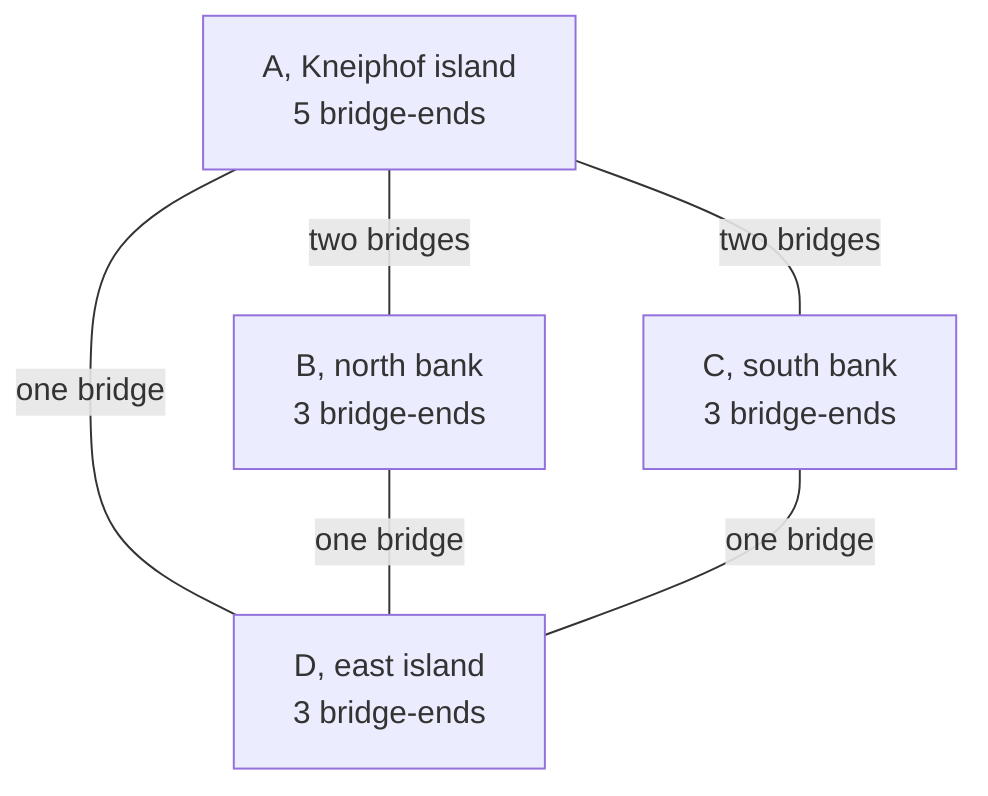
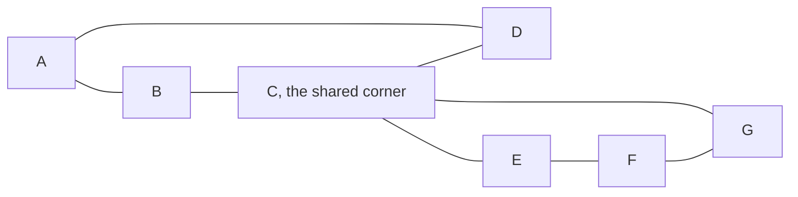

# Euler circuits: a closed route using every edge once exists exactly when the graph is connected and every degree is even

[Syllabus](../../../SYLLABUS.md) → [Combinatorics and graphs](../../../SYLLABUS.md#w04) → [Tours - Euler and Hamilton](../../../SYLLABUS.md#w04-s11) → Euler circuits

---

## General Overview

In 1735 Königsberg stood on both banks of the Pregel with two islands in it: four land masses, seven bridges. The town puzzle asked for a walk crossing every bridge exactly once. Nobody managed it, and Leonhard Euler proved nobody could.

Count bridge-ends, not bridges: the island A carries 5, the north bank B 3, the south bank C 3, the east island D 3. That count is a land's **degree** ([Degrees and the handshaking lemma](../09-Graphs%20-%20Dots%20and%20Lines/02-degree-and-handshaking.md)), and all four are odd, which settles it.

Odd is fatal: passing *through* a land spends two bridge-ends, one in and one out, so they pair off. Only the start and the finish leave an end unpaired, so at most two lands may be odd. Königsberg has four.

The count runs forwards too. A snowplough must clear every street of a 3 x 3 grid — nine junctions, 12 streets — and finish at the depot. Four junctions carry three streets, so no closed sweep exists: four extra passes are needed, and the code builds the 16-pass route.

Vocabulary, once. A route repeating no line is a **trail** ([Walks, paths and cycles](../09-Graphs%20-%20Dots%20and%20Lines/03-walks-paths-and-cycles.md)); closed means it ends where it began. A closed trail covering every line once is an **Euler circuit**, the open one an **Euler trail**.

**A closed route using every line once exists exactly when the lines sit in one piece and every dot has an even number of line-ends, because passing through a dot spends two of them.**

**What kind of fact this is:** a theorem, proved both ways in Why it works; Hierholzer's splice, Step 4, is the method that builds the route.

### The picture: four lands, seven bridges, all tallies odd



Two bridges reach the north bank, two the south, one the east island: the island's tally is 5. The four tallies add to 14, twice the bridge count.

---

## The formula

Notation first, in words. $G$ is the network, $V$ its dots, $E$ its lines; a line may be repeated — Königsberg's doubled bridges are two lines between one pair — or join a dot to itself, laying two ends there. $\deg(v)$ is a dot's degree, $k$ the count of odd-degree dots, $T$ a trail.

$$\text{some closed trail } T \text{ covers every line of } G \iff G \text{ is in one piece and } \deg(v) \text{ is even at every dot } v$$

**Read it aloud:** one closed sweep covers every line exactly when the network holds together and no dot has an odd number of line-ends.

The open twin is the same statement with $k = 2$: two odd dots, and the trail must run from one to the other.

"In one piece" is asked of the lines, each reachable from every other ([Connected or not](../09-Graphs%20-%20Dots%20and%20Lines/04-connectivity-and-breadth-first-search.md)); dots carrying no line sit out. And $k$ is never odd, the degrees adding to twice the line count — so 0 and 2 exhaust the cases that work.

| Symbol | Plain meaning | In our example | Push it up and the answer… |
| --- | --- | --- | --- |
| $G$ | the network of dots and lines | Königsberg | — |
| $V$ | its dots | A, B, C, D | more places to pass |
| $E$ | its lines, repeats allowed | seven bridges | a longer route |
| $\deg(v)$ | line-ends at a dot | deg(A) = 5 | odd ones block a closed route |
| $k$ | dots of odd degree | 4 | 0 closed, 2 open, more none |
| $T$ | a trail: no line repeated | the grid's 16-pass route | — |

### When it holds

- **Finitely many lines.** The proof takes a longest trail, which an endless network need not have.
- **Lines scored honestly.** Score the two north bridges as one and the island reads even, so the test lies.
- **One piece.** Two triangles apart have every degree 2 and no route covering both: the check prints 0 odd dots, no route.
- **Lines, not dots, and no arrows.** Every dot once is [Hamiltonian cycles](03-hamiltonian-cycles.md); one-way lines have their own test ([Directed graphs](../09-Graphs%20-%20Dots%20and%20Lines/06-directed-graphs-and-topological-order.md)).

---

## Why it works

### Step 0: passing through a dot spends two line-ends

Watch a route pass a dot part way along: it arrives on one line and leaves on another, two of that dot's ends spent together. Only the start and the finish spend a single end.

### Step 1: so even degrees and one piece are forced

Suppose a closed trail covers every line. Tally the ends spent at one dot: each visit spends two, the closing arrival pairing with the opening departure. Every line is used once, so all the ends there are spent in pairs — the degree is even. One piece follows too, the stretch of trail between any two lines joining them. Königsberg fails the first test four times over.

### Step 2: a longest trail closes, and leftovers splice into it

Now the other direction: a network in one piece, every degree even. No trail repeats a line, so trails cannot run on for ever: take a longest one. Were it to stop away from its start, that dot would have spent two ends per visit plus the arrival that never left — an odd number — while its degree is even. So a free line hangs there and extends the trail: the longest trail closes.

Were a line unused, one piece would leave an unused line at some dot of the trail. Strip the trail's lines: every dot loses an even number of ends, so the leftovers are even too, and walking them from that dot until stuck comes back — a closed loop. Splice it in there, going round the detour before carrying on, and the trail is longer again. So the longest trail covers every line and closes: an Euler circuit.

### Step 3: two odd dots, and one phantom line

Join the two odd dots with one extra line: every degree turns even, so Step 2 gives a closed route. Delete the phantom line and an open trail is left, running between those two dots. Königsberg with an eighth bridge B-C is the check's second row: B and C rise from 3 to 4, leaving A and D the odd pair, verdict an open trail. Four odd dots or more defeat every ordering, Step 1 allowing two unpaired ends at most.

### Step 4: Hierholzer's method is Step 2, run forwards

Hierholzer's 1873 procedure is Step 2 as instructions: walk from the start along unused lines until stuck, which means being back at the start, and if lines remain, one touches the tour, so begin a fresh loop there and splice it in. The code keeps a stack of dots and writes one down only once no unused line is left at it — the postponement is the splice.

### The picture: two squares sharing a corner, spliced at C



Every dot is even and the lines are in one piece, so a closed route exists. From A the code returns A-B-C-E-F-G-C-D-A: the first square as far as C, the second square from C back to C, then the rest of the first.

A second proof instead cuts such a network into loops sharing no lines and glues them at shared dots; how far loops reach in general is Cycle double cover.

---

## Worked numbers, by hand

| Step | Arithmetic | Value |
| --- | --- | --- |
| bridge-ends per land | island, north, south, east | A 5, B 3, C 3, D 3 |
| the tallies added | 5 + 3 + 3 + 3 | 14 = 2 × 7 |
| odd lands, and the verdict | 4 is neither 0 nor 2 | **4, no route** |
| an eighth bridge B-C | B, C turn even | **open trail, A to D** |
| the grid's odd junctions | B, D, F, H, paired at 2 + 2 | **4 extra passes** |
| the swept route | 12 streets + 4 repeats | **16 passes, closed** |

Königsberg's walk never existed, and the plough drives 16 street-lengths to clear 12.

### What breaks if you drop a piece

| Mistake | Comes out at | What went wrong |
| --- | --- | --- |
| Two odd dots read as closed | Königsberg plus a bridge B-C: open trail only | Two odd dots are an open trail's ends |
| Skipping the one-piece test | two triangles apart: 0 odd dots, no route | Even degrees cannot join separate pieces |
| Sweeping the grid unrepeated | 12 streets, 4 odd junctions, no route | A failing network must change, not re-order |

The code prints all three.

---

## Code, from first principles, and it actually runs

Nothing is imported. Six networks face the same question, and every verdict comes twice by roads sharing no arithmetic: this card's degree count, and a brute-force hunt trying every order of the lines from every dot, knowing no theorem. Hierholzer builds the routes, audited against the list of lines. The grid's four extra passes come twice too: from pairing the odd junctions, and from trying every set of repeats.

### Python

```python
# Euler circuits -- the check behind the card.  Nothing is imported.  Konigsberg's seven
# bridges, the same map with an eighth, two separate triangles, a figure-eight of two squares,
# and a 3 x 3 street grid before and after four streets are repeated.  Every verdict is
# reached twice: by counting odd dots, and by hunting a route line by line.
def dots(edges): return sorted({v for e in edges for v in e})
def deg(edges, v): return sum((a == v) + (b == v) for a, b in edges)
def odds(edges): return [v for v in dots(edges) if deg(edges, v) % 2]
def steps(edges, start):                            # steps out from one dot, settled by relaxing
    d, both = {start: 0}, [x for a, b in edges for x in ((a, b), (b, a))]
    for a, b in [e for _ in both for e in both]:     # enough passes to reach every ring
        if a in d and d.get(b, len(both)) > d[a] + 1: d[b] = d[a] + 1
    return d
def hunt(here, left, home):                         # road two: try every order of the lines
    if not left: return home is None or here == home
    for i, (u, v) in enumerate(left):
        rest = left[:i] + left[i + 1:]
        if (u == here and hunt(v, rest, home)) or (v == here and hunt(u, rest, home)): return True
    return False
def hierholzer(edges, start):                       # walk till stuck, splice the loops in
    left, stack, route = list(edges), [start], []
    while stack:
        on = [e for e in left if stack[-1] in e]
        if not on: route.append(stack.pop())
        else: left.remove(on[0]); stack.append(on[0][1] if on[0][0] == stack[-1] else on[0][0])
    return route[::-1]
def once_each(edges, route):                        # independent audit of a finished route
    return sorted(tuple(sorted(p)) for p in zip(route, route[1:])) == sorted(tuple(sorted(e)) for e in edges)
def repeats(edges):                                 # cheapest set of repeats, every set tried
    sets = [[e for i, e in enumerate(edges) if m >> i & 1] for m in range(1 << len(edges))]
    return min((s for s in sets if not odds(edges + s)), key=len)
KON = [("A", "B"), ("A", "B"), ("A", "C"), ("A", "C"), ("A", "D"), ("B", "D"), ("C", "D")]
EIGHT = [("A", "B"), ("B", "C"), ("C", "D"), ("D", "A"), ("C", "E"), ("E", "F"), ("F", "G"), ("G", "C")]
GRID = [("A", "B"), ("B", "C"), ("D", "E"), ("E", "F"), ("G", "H"), ("H", "I"),
        ("A", "D"), ("D", "G"), ("B", "E"), ("E", "H"), ("C", "F"), ("F", "I")]
EXTRA, ODD = repeats(GRID), odds(GRID); e8 = hierholzer(EIGHT, "A")
CASES = [("Konigsberg, 7 bridges", KON), ("Konigsberg, an eighth bridge B-C", KON + [("B", "C")]),
         ("two separate triangles", [("A", "B"), ("B", "C"), ("C", "A"), ("D", "E"), ("E", "F"), ("F", "D")]),
         ("figure-eight of two squares", EIGHT), ("3 x 3 street grid", GRID), ("grid, 4 streets repeated", GRID + EXTRA)]
say = lambda shut, ajar: "closed route" if shut else ("open trail" if ajar else "no route")
yn = lambda claim: "yes" if claim else "no"          # the two verdict labels, printed below
print(f"{'graph':<36}{'dots':>5}{'lines':>6}{'odd':>4}{'one piece':>10}   {'by degrees':<14}by hand")
for name, es in CASES:
    piece = len(steps(es, es[0][0])) == len(dots(es))
    one = (piece and not odds(es), piece and len(odds(es)) in (0, 2))
    two = (any(hunt(s, tuple(es), s) for s in dots(es)), any(hunt(s, tuple(es), None) for s in dots(es)))
    print(f"{name:<36}{len(dots(es)):>5}{len(es):>6}{len(odds(es)):>4}{yn(piece):>10}   {say(*one):<14}{say(*two)}")
    assert one == two                               # the degree count against the brute-force hunt
print(f"Konigsberg degrees: {', '.join(f'{v} {deg(KON, v)}' for v in dots(KON))}, adding to "
      f"{sum(deg(KON, v) for v in dots(KON))} = 2 x {len(KON)} bridges")
print(f"figure-eight from A, the second square spliced in at C: {'-'.join(e8)}")
swept = hierholzer(GRID + EXTRA, "A")
costs = [steps(GRID, ODD[0])[ODD[i]] + steps(GRID, ODD[j])[ODD[k]] for i, j, k in ((1, 2, 3), (2, 1, 3), (3, 1, 2))]
print(f"grid odd junctions {' '.join(ODD)}: the three ways to pair them cost {costs} extra passes")
print(f"cheapest repeats, every set of streets tried: {len(EXTRA)}, namely {' '.join('-'.join(e) for e in EXTRA)}")
print(f"the swept route, {len(GRID)} streets + {len(EXTRA)} repeats = {len(swept) - 1} passes, closed "
      f"{yn(swept[0] == swept[-1])}, every street once {yn(once_each(GRID + EXTRA, swept))}: {'-'.join(swept)}")
assert once_each(EIGHT, e8) and e8[0] == e8[-1] and len(e8) - 1 == len(EIGHT)
assert len(EXTRA) == min(costs) and len(swept) - 1 == len(GRID) + len(EXTRA)
assert sum(deg(KON, v) for v in dots(KON)) == 2 * len(KON) and len(odds(KON)) == 4
print("ALL CHECKS PASS")
```

**Ran 2026-09-19 on macOS, Python 3.14.6, standard library only. All checks passed. Output, pasted from the run:**

```
graph                                dots lines odd one piece   by degrees    by hand
Konigsberg, 7 bridges                   4     7   4       yes   no route      no route
Konigsberg, an eighth bridge B-C        4     8   2       yes   open trail    open trail
two separate triangles                  6     6   0        no   no route      no route
figure-eight of two squares             7     8   0       yes   closed route  closed route
3 x 3 street grid                       9    12   4       yes   no route      no route
grid, 4 streets repeated                9    16   0       yes   closed route  closed route
Konigsberg degrees: A 5, B 3, C 3, D 3, adding to 14 = 2 x 7 bridges
figure-eight from A, the second square spliced in at C: A-B-C-E-F-G-C-D-A
grid odd junctions B D F H: the three ways to pair them cost [4, 4, 4] extra passes
cheapest repeats, every set of streets tried: 4, namely E-F G-H D-G B-E
the swept route, 12 streets + 4 repeats = 16 passes, closed yes, every street once yes: A-B-C-F-E-D-G-H-I-F-E-B-E-H-G-D-A
ALL CHECKS PASS
```

### Rust

Same numbers, same labels, built with `rustc --edition 2021 -O`.

```rust
// Euler circuits -- the same check as the Python, in Rust.  No crates.  Konigsberg's seven bridges, the
// same map with an eighth, two triangles apart, a figure-eight of squares, and a 3 x 3 street grid before
// and after four streets are repeated.  Every verdict comes twice: odd-dot count, brute hunt.
use std::collections::BTreeMap;         type E = (&'static str, &'static str);
fn dots(edges: &[E]) -> Vec<&'static str> {                   // the dots, in order, no repeats
    let mut v: Vec<&'static str> = edges.iter().flat_map(|&(a, b)| [a, b]).collect(); v.sort(); v.dedup(); v }
fn deg(edges: &[E], v: &str) -> usize {                       // line-ends at one dot
    edges.iter().map(|&(a, b)| (a == v) as usize + (b == v) as usize).sum() }
fn odds(edges: &[E]) -> Vec<&'static str> {                   // the dots of odd degree
    dots(edges).into_iter().filter(|v| deg(edges, v) % 2 == 1).collect() }
fn steps(edges: &[E], start: &'static str) -> BTreeMap<&'static str, usize> {
    let both: Vec<E> = edges.iter().flat_map(|&(a, b)| [(a, b), (b, a)]).collect();
    let (mut d, far) = (BTreeMap::from([(start, 0usize)]), both.len());
    for _ in 0..far { for &(a, b) in &both {                  // enough passes to reach every ring
        if let Some(&k) = d.get(a) { if *d.get(b).unwrap_or(&far) > k + 1 { d.insert(b, k + 1); } } } }
    d }
fn hunt(here: &'static str, left: &[E], home: Option<&'static str>) -> bool {
    if left.is_empty() { return home.map_or(true, |h| h == here); }
    for i in 0..left.len() {                                  // road two: try every order of the lines
        let mut rest = left.to_vec(); let (u, v) = rest.remove(i);
        if (u == here && hunt(v, &rest, home)) || (v == here && hunt(u, &rest, home)) { return true; } }
    false }
fn hierholzer(edges: &[E], start: &'static str) -> Vec<&'static str> {
    let (mut left, mut stack, mut route) = (edges.to_vec(), vec![start], Vec::new());
    while let Some(&v) = stack.last() {                       // walk till stuck, splice the loops in
        match left.iter().position(|e| e.0 == v || e.1 == v) {
            None => { route.push(stack.pop().unwrap()); }
            Some(i) => { let e = left.remove(i); stack.push(if e.0 == v { e.1 } else { e.0 }); } } }
    route.reverse(); route }
fn once_each(edges: &[E], route: &[&'static str]) -> bool {    // independent audit of a finished route
    let key = |a: &'static str, b: &'static str| if a <= b { (a, b) } else { (b, a) };
    let mut walked: Vec<E> = route.windows(2).map(|w| key(w[0], w[1])).collect();
    let mut want: Vec<E> = edges.iter().map(|&(a, b)| key(a, b)).collect();
    walked.sort(); want.sort(); walked == want }
fn repeats(edges: &[E]) -> Vec<E> {                           // cheapest set of repeats, every set tried
    let mut best = edges.to_vec();
    for m in 0..(1u32 << edges.len()) {
        let extra: Vec<E> = (0..edges.len()).filter(|i| m >> i & 1 == 1).map(|i| edges[i]).collect();
        let mut all = edges.to_vec(); all.extend(&extra);
        if odds(&all).is_empty() && extra.len() < best.len() { best = extra; } }
    best }
fn main() {
    let kon: Vec<E> = vec![("A", "B"), ("A", "B"), ("A", "C"), ("A", "C"), ("A", "D"), ("B", "D"), ("C", "D")];
    let eight: Vec<E> = vec![("A", "B"), ("B", "C"), ("C", "D"), ("D", "A"), ("C", "E"), ("E", "F"), ("F", "G"), ("G", "C")];
    let grid: Vec<E> = vec![("A", "B"), ("B", "C"), ("D", "E"), ("E", "F"), ("G", "H"), ("H", "I"),
                            ("A", "D"), ("D", "G"), ("B", "E"), ("E", "H"), ("C", "F"), ("F", "I")];
    let tri: Vec<E> = vec![("A", "B"), ("B", "C"), ("C", "A"), ("D", "E"), ("E", "F"), ("F", "D")];
    let (extra, odd) = (repeats(&grid), odds(&grid));
    let (mut kon8, mut grid2) = (kon.clone(), grid.clone());
    kon8.push(("B", "C")); grid2.extend(&extra);
    let (e8, swept) = (hierholzer(&eight, "A"), hierholzer(&grid2, "A"));
    let cases: Vec<(&str, &Vec<E>)> = vec![("Konigsberg, 7 bridges", &kon),
        ("Konigsberg, an eighth bridge B-C", &kon8), ("two separate triangles", &tri),
        ("figure-eight of two squares", &eight), ("3 x 3 street grid", &grid), ("grid, 4 streets repeated", &grid2)];
    let say = |shut: bool, ajar: bool| if shut { "closed route" } else if ajar { "open trail" } else { "no route" };
    let yn = |claim: bool| if claim { "yes" } else { "no" };  // the two verdict labels, printed below
    println!("{:<36}{:>5}{:>6}{:>4}{:>10}   {:<14}by hand", "graph", "dots", "lines", "odd", "one piece", "by degrees");
    for (name, es) in &cases {
        let (piece, o) = (steps(es, es[0].0).len() == dots(es).len(), odds(es));
        let one = (piece && o.is_empty(), piece && (o.is_empty() || o.len() == 2));
        let two = (dots(es).iter().any(|&s| hunt(s, es, Some(s))), dots(es).iter().any(|&s| hunt(s, es, None)));
        println!("{:<36}{:>5}{:>6}{:>4}{:>10}   {:<14}{}", name, dots(es).len(), es.len(), o.len(),
                 yn(piece), say(one.0, one.1), say(two.0, two.1));
        assert!(one == two); }                                // the degree count against the brute-force hunt
    let kd: Vec<String> = dots(&kon).iter().map(|v| format!("{} {}", v, deg(&kon, v))).collect();
    let total: usize = dots(&kon).iter().map(|v| deg(&kon, v)).sum();
    println!("Konigsberg degrees: {}, adding to {} = 2 x {} bridges", kd.join(", "), total, kon.len());
    println!("figure-eight from A, the second square spliced in at C: {}", e8.join("-"));
    let costs: Vec<usize> = [(1usize, 2usize, 3usize), (2, 1, 3), (3, 1, 2)].iter()
        .map(|&(i, j, k)| steps(&grid, odd[0])[odd[i]] + steps(&grid, odd[j])[odd[k]]).collect();
    println!("grid odd junctions {}: the three ways to pair them cost {:?} extra passes", odd.join(" "), costs);
    let names: Vec<String> = extra.iter().map(|(a, b)| format!("{}-{}", a, b)).collect();
    println!("cheapest repeats, every set of streets tried: {}, namely {}", extra.len(), names.join(" "));
    println!("the swept route, {} streets + {} repeats = {} passes, closed {}, every street once {}: {}", grid.len(),
             extra.len(), swept.len() - 1, yn(swept[0] == swept[swept.len() - 1]), yn(once_each(&grid2, &swept)), swept.join("-"));
    assert!(once_each(&eight, &e8) && e8[0] == e8[e8.len() - 1] && e8.len() - 1 == eight.len());
    assert!(extra.len() == *costs.iter().min().unwrap() && swept.len() - 1 == grid.len() + extra.len());
    assert!(total == 2 * kon.len() && odds(&kon).len() == 4);
    println!("ALL CHECKS PASS");
}
```

**Ran 2026-09-19 on macOS, rustc 1.98.1, no crates. All checks passed. Output, pasted from the run:**

```
graph                                dots lines odd one piece   by degrees    by hand
Konigsberg, 7 bridges                   4     7   4       yes   no route      no route
Konigsberg, an eighth bridge B-C        4     8   2       yes   open trail    open trail
two separate triangles                  6     6   0        no   no route      no route
figure-eight of two squares             7     8   0       yes   closed route  closed route
3 x 3 street grid                       9    12   4       yes   no route      no route
grid, 4 streets repeated                9    16   0       yes   closed route  closed route
Konigsberg degrees: A 5, B 3, C 3, D 3, adding to 14 = 2 x 7 bridges
figure-eight from A, the second square spliced in at C: A-B-C-E-F-G-C-D-A
grid odd junctions B D F H: the three ways to pair them cost [4, 4, 4] extra passes
cheapest repeats, every set of streets tried: 4, namely E-F G-H D-G B-E
the swept route, 12 streets + 4 repeats = 16 passes, closed yes, every street once yes: A-B-C-F-E-D-G-H-I-F-E-B-E-H-G-D-A
ALL CHECKS PASS
```

The two outputs match line for line.

> [!TIP]
> **Try changing**
> Guess first, then run it.
> - **Start the splice elsewhere.** Change `hierholzer(EIGHT, "A")` to `hierholzer(EIGHT, "E")`: the route becomes E-C-B-A-D-C-G-F-E, the *first* square now spliced in at C.
> - **Take a street out of the grid.** Delete `("B", "E")` from `GRID`: eleven streets, odd junctions D E F H, repeats down to 3, the sweep to 14 passes. Both roads move together, so every assert holds.
> - **Break the test.** Change `in (0, 2)` to `in (0, 2, 4)`: the degree road now calls four odd dots passable, the hunt still says no, and the first assert stops the program on Königsberg's row.

---

## The usual mistake

> [!warning]
> **Asking for every dot once instead of every line once.** Königsberg's four lands can be toured one after another and back to the start; its seven bridges cannot be walked in one go. Covering lines is a degree count; covering dots is [Hamiltonian cycles](03-hamiltonian-cycles.md), for which no cheap test is known.
>
> - **Two odd dots read as a closed tour.** They give an *open* trail, from one odd dot to the other.
> - **Forgetting the one-piece test.** Two triangles apart have every degree 2 and 0 odd dots, and no route covers both: even degrees are half the theorem.
> - **Mis-scoring lines.** A repeated line counts separately, a self-joining line lays two ends; score them loosely and the arithmetic lies.
> - **Crediting Euler with both halves.** His 1735 argument rules the walk out when too many lands are odd. That the test is *enough* is Hierholzer's, in 1873.

---

## Where you meet it in real life

- **Snowploughs, gritters, sweepers, postal rounds.** Every line must be covered and the depot wants the vehicle back. Once streets have lengths and the repeats must be picked cheaply, the question becomes [The Chinese postman](02-chinese-postman.md).
- **Reading a genome.** Overlapping fragments are lines and a reconstruction is a trail covering them, so sequence assembly rests on Euler circuits, not dot tours — the trick of [De Bruijn sequences](05-de-bruijn-sequences.md).
- **One-stroke drawing, cutter paths, inspection routes.** "Without lifting the pen" is the open case: with two odd dots, start at one.

> **Say it back**
> A closed route using every line once is an Euler circuit. Passing through a dot spends two of its line-ends, so every degree must be even and the lines must sit in one piece. Those conditions are enough as well: a longest trail must close, and leftovers splice in as detours — Hierholzer's method. Two odd dots give an open trail instead. Königsberg's four lands are all odd, so its bridges cannot be walked in one go; a plough on 12 grid streets meets four odd junctions and needs four extra passes.

---

## What this builds on

- [Degrees and the handshaking lemma](../09-Graphs%20-%20Dots%20and%20Lines/02-degree-and-handshaking.md): the degree, and why odd dots come in pairs.
- [Connected or not](../09-Graphs%20-%20Dots%20and%20Lines/04-connectivity-and-breadth-first-search.md): what "in one piece" means, and the flood that tests it.

## Where this goes next

- [The Chinese postman](02-chinese-postman.md): choosing the repeats at least cost once streets have lengths.
- [Hamiltonian cycles](03-hamiltonian-cycles.md): every dot once instead of every line once, an easy test turned hard search.
- [De Bruijn sequences](05-de-bruijn-sequences.md): Euler circuits at work, building the shortest string holding every window.
- Cycle double cover: covering lines with loops in general, still unproved.

This card says whether a closed sweep exists and builds one when it does; the cheapest way to fix a network that fails is [The Chinese postman](02-chinese-postman.md).

---

## Sources

Verified 19 Sep 2026: every link below resolves to the publisher's page.

- Euler, Leonhard. "Solutio problematis ad geometriam situs pertinentis." *Commentarii academiae scientiarum Petropolitanae* 8 (1741): 128–140; written 1735, in the volume for 1736, catalogued E53. [Euler Archive page, with the full text](https://scholarlycommons.pacific.edu/euler-works/53/). The bridges, and the half ruling walks out.
- Hierholzer, Carl, and Chr. Wiener. "Ueber die Möglichkeit, einen Linienzug ohne Wiederholung und ohne Unterbrechung zu umfahren." *Mathematische Annalen* 6 (1873): 30–32. [doi:10.1007/BF01442866](https://doi.org/10.1007/BF01442866). The other half, and the code's splice.
- Diestel, Reinhard. *Graph Theory*, 5th ed. Springer, 2017. [Publisher page](https://link.springer.com/book/10.1007/978-3-662-53622-3). Section 1.8, the modern statement.
- Biggs, Norman L., E. Keith Lloyd, and Robin J. Wilson. *Graph Theory 1736–1936*. Oxford University Press, paperback 1999. [Publisher page](https://global.oup.com/academic/product/graph-theory-1736-1936-9780198539162). Translations of both papers.
