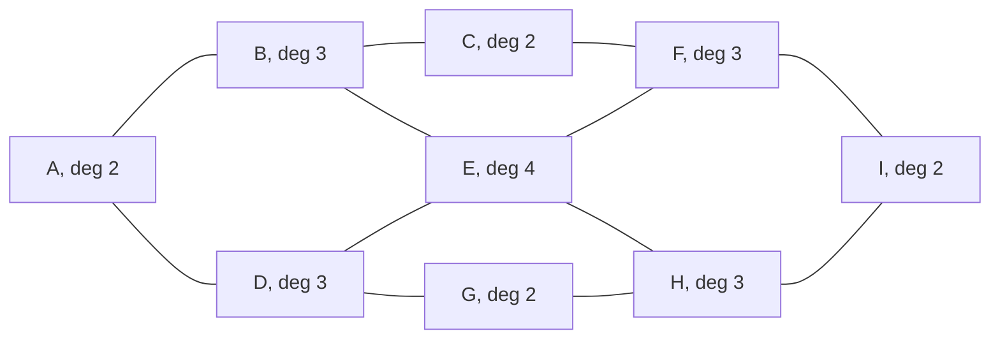
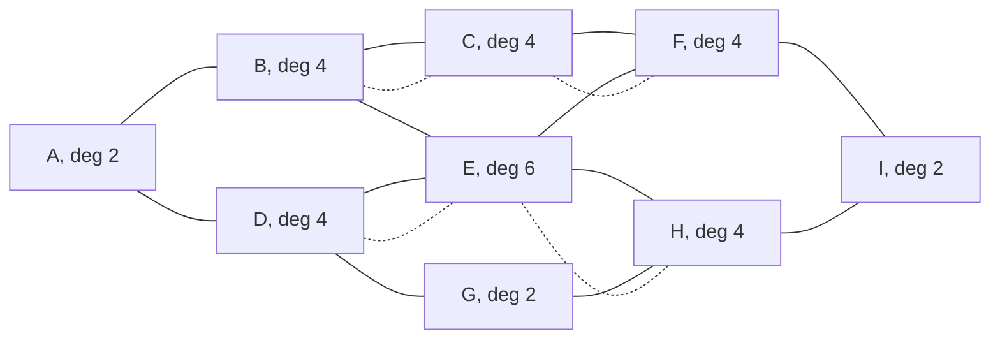

# The Chinese postman: when no Euler circuit exists, pair up the odd vertices as cheaply as possible and walk those streets twice

[Syllabus](../../../SYLLABUS.md) → [Combinatorics and graphs](../README.md) → [Tours - Euler and Hamilton](../README.md#s11) → The Chinese postman

---

## General Overview

A postman parks the van at junction A of a small estate: nine junctions in a 3 by 3 grid, lettered A to I across the rows, joined by twelve streets of 100 m. Every street needs a delivery, and the round must end back at the van. That is 1,200 m of street; the shortest round is 1,600 m.

The extra 400 m is forced. A round walking every street exactly once and ending where it began exists only when every junction meets an even number of streets ([Euler circuits](01-euler-circuits.md)). Four junctions here meet three: B, D, F and H, the middles of the sides. So some streets must be walked twice — which, and how few metres?

One move answers it. Take the junctions an odd number of streets meet — **odd junctions** from here on — and pair them up; for each pair, walk the shortest route between its two a second time. Doubling a street adds one at each end, and a junction passed through gains two, so only the pair's counts flip. Every junction is then even, and one round covers the lot.

Kwan Mei-ko set the problem out in 1960; Jack Edmonds named it the Chinese postman problem for Kwan and, with Ellis Johnson, proved the pairing is all there is to it.

**The shortest closed round covering every street is the total street length plus the cheapest pairing of the odd junctions, each pair charged the shortest walk between its two.**

**What kind of fact this is:** a method, resting on a theorem proved on this card in Why it works.

### The picture: the estate



deg counts the streets at a junction. The corners A, C, G and I are on two, the centre E on four, and B, D, F and H on three: the whole problem.

---

## The formula

Symbols first. $w(e)$ is the length of the street named in the brackets, 100 m across this estate. $d(u,v)$ is the length of the shortest walk between two junctions ([Dijkstra's algorithm](../10-Trees%20and%20Cheapest%20Routes/05-dijkstra.md)). The odd junctions are collected as $O$, and a **pairing** $M$ splits $O$ into pairs, every odd junction in one. A capital sigma says "add one term per item listed underneath"; "min over $M$" says "work the sum out for every pairing, keep the smallest".

$$L = \sum_{e \in E} w(e) \;+\; \min_{M} \sum_{\{u,v\} \in M} d(u,v)$$

**Read it aloud:** the shortest round is every street's length added up, plus the cheapest total of shortest walks pairing the odd junctions off.

| Symbol | Plain meaning | In our example | Push it up and the answer… |
| --- | --- | --- | --- |
| $E$ | the streets, as pairs of junctions | twelve | a longer round |
| $w(e)$ | one street's length | 100 m | a longer round |
| $\deg(v)$ | streets at a junction | 3 at B, D, F, H | odd counts force repeats |
| $O$ | the odd junctions | B, D, F, H | more repeats |
| $d(u,v)$ | the shortest walk between two | 200 m, every pair in $O$ | dearer repeats |
| $M$ | one pairing of $O$ | B with F, D with H | — |
| $L$ | the shortest closed round | 1,600 m | — |

The pairings are easy to count. Write 2k for the number of odd junctions, a count the handshaking sum forces to be even ([Degrees and the handshaking lemma](../09-Graphs%20-%20Dots%20and%20Lines/02-degree-and-handshaking.md)): the first takes any of the other 2k − 1, the rest pair the same way, so there are

$$1 \times 3 \times 5 \times \cdots \times (2k-1)$$

of them: three for four odd junctions, 945 for ten.

### When it holds

- **Every street covered, the map in one piece.** Split the estate and no round reaches both halves ([Connected or not](../09-Graphs%20-%20Dots%20and%20Lines/04-connectivity-and-breadth-first-search.md)).
- **Lengths positive, a street the same price either way.** One-way streets need flows, not pairings.
- **A second pass allowed anywhere, at full price.** A street barred from repeats, or free the second time, changes the sum.

---

## Why it works

### Step 0: repeating a street is the same as drawing it twice

A round that walks B-C twice walks every street once on a map where B-C appears twice. Add a copy per repeat and the round is an Euler circuit of that fuller map: every copy used once, ending where it started. The route question has become a map question — which copies to add ([Euler circuits](01-euler-circuits.md)).

### Step 1: the added copies must be odd exactly where the map is odd

A copy adds one to the count at each of its two ends, and Euler's test wants every count even. So an even junction takes an even number of copies, an odd junction an odd number. Read the copies as a map of their own: its odd junctions must be exactly B, D, F and H.

### Step 2: a pair's cheapest repeat is a shortest walk

Such a map breaks into walks joining those four two by two, plus closed loops. The loops can go: deleting one leaves every junction as odd or even as it was — its parity — and saves metres. A walk from B to F is at least $d(B,F)$ long, so nothing beats a shortest walk, and no street is walked three times: two copies of one street delete together.

### Step 3: add the two pieces

Every street is walked at least once, whatever the round: 1,200 m. The repeats are one pairing's shortest walks, the cheapest costing 400 m. So no round beats 1,600 m, and the pairing builds one that reaches it. "B with F, D with H" repeats B-C, C-F, D-E and E-H: 16 street-lengths.

<details>
<summary>Detailed proof: the two halves of the argument</summary>

Map in one piece, every length positive. Take any closed round covering every street and collect its extra passes as R. With R's copies added the round uses every copy once, so it is an Euler circuit: every junction even there. A count there is the map count plus the R count, so R is odd exactly at the map's odd junctions. Deleting two copies of one street, or one of R's closed loops, holds every parity and shortens R. What is left splits into walks pairing the odd junctions, each at least the shortest walk between its ends, so R costs at least the cheapest pairing.

The other half builds a round: add every street on a cheapest pairing's walks, deleting any street thereby doubled. Every junction is even and the map in one piece, so an Euler circuit exists, of length the street total plus at most the pairing's total. The bounds meet.

</details>

### Step 4: how far listing the pairings goes

A loop settles three pairings, or 945, in no time. But the count keeps multiplying, so listing stops being possible at a few dozen odd junctions — and a city map has hundreds. Edmonds' 1965 matching algorithm, blossom, finds the cheapest pairing without listing any, in a time growing like a fixed power of the junction count. This card leans on it, unbuilt.

A second road reaches the same 400 m with no pairings and no shortest walks: keep every set of streets whose own odd junctions are exactly B, D, F and H, then take the smallest, every street here being 100 m — Step 1 read forwards.

---

## Worked numbers, by hand

| Step | Arithmetic | Value |
| --- | --- | --- |
| every street once | 12 × 100 m | 1,200 m |
| the counts at the junctions | read off the map | 2, 3, 2, 3, 4, 3, 2, 3, 2 |
| the odd junctions | B, D, F, H | **4** |
| pairings to try | 1 × 3 | 3 |
| each pair's shortest walk | two streets, whichever pair | 200 m |
| the cheapest pairing | 200 + 200, and all three tie | **400 m** |
| the round | 1,200 + 400 | **1,600 m** |

The postman walks 1,600 m to deliver on 1,200 m of street. All three pairings tie at 400 m, so "cheapest" is idle on this estate; it earns its keep on the code's second map, two rows of four junctions.

### The picture: the four repeats



Dotted: the second passes, B to F through C and D to H through E. Every junction is now on an even number of passes.

### What breaks if you drop a piece

| Mistake | Comes out at | What went wrong |
| --- | --- | --- |
| Walking every street twice to be safe | 2,400 m | Four streets of the twelve want a second pass, not all |
| Pairing by eye: on the second map, Q with V, R with U | 1,400 m, against 1,200 m | Two repeats of 200 m, where two of 100 m would do |
| Leaving the round's two ends free | 1,400 m on the estate | An open round doubles one pair only and must start and end at the other two odd junctions, neither of them the van |

The code prints all three of those.

---

## Code, from first principles, and it actually runs

Nothing is imported, and the round is reached three ways. Road one is this card's method: count the streets at each junction, get every shortest walk by Floyd's method — each junction tried in turn as a stepping stone ([Dijkstra's algorithm](../10-Trees%20and%20Cheapest%20Routes/05-dijkstra.md)) — then list the pairings and keep the cheapest. Road two mentions neither pairings nor shortest walks: all 4,096 sets of the twelve streets, keeping the smallest whose odd junctions match the map's. Road three walks the answer, taking any unused street at the junction under foot: Hierholzer's method.

### Python

```python
# The Chinese postman -- the check behind the card.  Nothing is imported.  The round is a 3 x 3 grid of junctions A to
# I joined by 12 streets of 100 m each; the two-row map P to W has 10.  The shortest closed round is reached three ways:
# the odd junctions paired by shortest walks, every set of streets that could be repeated searched, and the round walked.
W = 100
GRID = ("ABCDEFGHI", ["AB", "BC", "AD", "BE", "CF", "DE", "EF", "DG", "EH", "FI", "GH", "HI"])
ROWS = ("PQRSTUVW", ["PQ", "QR", "RS", "TU", "UV", "VW", "PT", "QU", "RV", "SW"])
def degs(names, edges): return [sum(v in e for e in edges) for v in names]   # streets met at a junction
def odd_of(names, edges): return "".join(v for v, k in zip(names, degs(names, edges)) if k % 2)
def apsp(names, edges):                      # shortest walk between every pair: Floyd-Warshall
    d = {a + b: (0 if a == b else 10 ** 6) for a in names for b in names}
    for e in edges: d[e] = d[e[1] + e[0]] = W
    for k in names:
        for ab in d: d[ab] = min(d[ab], d[ab[0] + k] + d[k + ab[1]])
    return d
def pairings(items):                         # every way to pair a list up, two by two
    if not items: return [[]]
    r = items[1:]
    return [[(items[0], r[i])] + p for i in range(len(r)) for p in pairings(r[:i] + r[i + 1:])]
def repeats(names, edges, odd):              # road two: every set of streets, no pairing and no shortest walk used
    every = [[e for i, e in enumerate(edges) if m >> i & 1] for m in range(1 << len(edges))]
    fits = [p for p in every if odd_of(names, p) == odd]
    return [p for p in fits if len(p) == min(len(q) for q in fits)]
def circuit(edges):                          # road three: walk the round, Hierholzer's method
    left, stack, route = list(edges), [edges[0][0]], []
    while stack:
        v, nxt = stack[-1], next((e for e in left if stack[-1] in e), None)
        if nxt is None: route.append(stack.pop())
        else: left.remove(nxt); stack.append(nxt[1] if nxt[0] == v else nxt[0])
    return route
def spaced(names, ds): return "  ".join(f"{v} {k}" for v, k in zip(names, ds))
def listed(pcs): return " | ".join(f"({', '.join(a + '-' + b for a, b in p)}) {c}" for p, c in pcs)
def dfact(k): return 1 if k == 0 else (2 * k - 1) * dfact(k - 1)             # 1 x 3 x 5 x ... x (2k-1)
def yn(claim): return "yes" if claim else "no"
def report(label, names, edges, want):
    d, odd, street = apsp(names, edges), odd_of(names, edges), len(edges) * W
    pcs = [(p, sum(d[a + b] for a, b in p)) for p in pairings(list(odd))]
    best, worst, sets_ = min(c for _, c in pcs), max(c for _, c in pcs), repeats(names, edges, odd)
    aug = edges + sets_[0]
    route, after = circuit(aug), degs(names, aug)
    walked = sorted("".join(sorted(p)) for p in zip(route, route[1:]))
    opened = min(d[a + b] for i, a in enumerate(odd) for b in odd[i + 1:])
    print(f"{label}: {len(names)} junctions, {len(edges)} streets of {W} m, {street} m of street in all\n"
          f"degrees: {spaced(names, degs(names, edges))}; odd junctions {' '.join(odd)}, {len(odd)} of them, so no Euler circuit as the map stands\n"
          f"shortest walks between the odd junctions, in m: "
          f"{'  '.join(f'{a}-{b} {d[a + b]}' for i, a in enumerate(odd) for b in odd[i + 1:])}\n"
          f"the pairings and the metres each adds: {listed(pcs)}\n"
          f"road 1, the cheapest pairing adds {best} m: {street} + {best} = {street + best} m; the dearest would add {worst} m, giving {street + worst} m\n"
          f"road 2, over all {1 << len(edges)} sets of streets to repeat: {len(sets_)} cheapest sets, each {len(sets_[0]) * W} m, first in order {' '.join(sets_[0])}; degrees then {spaced(names, after)}, all even: {yn(all(k % 2 == 0 for k in after))}\n"
          f"road 3, the round walked, {len(aug)} streets: {'-'.join(route)} = {len(aug) * W} m; it walks every street of the map and every repeat once each: {yn(walked == sorted(''.join(sorted(e)) for e in aug))}")
    assert best == len(sets_[0]) * W and street + best == want        # the pairing road and the search agree
    assert walked == sorted("".join(sorted(e)) for e in aug) and len(route) == len(aug) + 1 and route[0] == route[-1]
    assert all(k % 2 == 0 for k in after) and sum(after) == 2 * len(aug)
    return street, best, worst, opened, len(sets_)
grid, rows = report("the round, a 3 x 3 grid", *GRID, 1600), report("the two-row map", *ROWS, 1200)
print(f"an open round, not returning to the van: one pair doubled, {grid[3]} m, giving {grid[0] + grid[3]} m; every street walked twice instead: {2 * grid[0]} m")
counts = [len(pairings(list(range(2 * k)))) for k in (2, 3, 4, 5)]
print(f"pairings to test for 4, 6, 8, 10 odd junctions, counted by listing them: {counts}; by 1 x 3 x 5 x ...: {[dfact(k) for k in (2, 3, 4, 5)]}")
assert grid[1] == grid[2] and grid[4] == 7 and rows[2] == 400 and counts == [dfact(k) for k in (2, 3, 4, 5)]
print("ALL CHECKS PASS")
```

**Ran 2026-09-19 on macOS, Python 3.14.6, standard library only. All checks passed. Output, pasted from the run:**

```
the round, a 3 x 3 grid: 9 junctions, 12 streets of 100 m, 1200 m of street in all
degrees: A 2  B 3  C 2  D 3  E 4  F 3  G 2  H 3  I 2; odd junctions B D F H, 4 of them, so no Euler circuit as the map stands
shortest walks between the odd junctions, in m: B-D 200  B-F 200  B-H 200  D-F 200  D-H 200  F-H 200
the pairings and the metres each adds: (B-D, F-H) 400 | (B-F, D-H) 400 | (B-H, D-F) 400
road 1, the cheapest pairing adds 400 m: 1200 + 400 = 1600 m; the dearest would add 400 m, giving 1600 m
road 2, over all 4096 sets of streets to repeat: 7 cheapest sets, each 400 m, first in order BC CF DE EH; degrees then A 2  B 4  C 4  D 4  E 6  F 4  G 2  H 4  I 2, all even: yes
road 3, the round walked, 16 streets: A-D-E-H-G-D-E-H-I-F-C-B-E-F-C-B-A = 1600 m; it walks every street of the map and every repeat once each: yes
the two-row map: 8 junctions, 10 streets of 100 m, 1000 m of street in all
degrees: P 2  Q 3  R 3  S 2  T 2  U 3  V 3  W 2; odd junctions Q R U V, 4 of them, so no Euler circuit as the map stands
shortest walks between the odd junctions, in m: Q-R 100  Q-U 100  Q-V 200  R-U 200  R-V 100  U-V 100
the pairings and the metres each adds: (Q-R, U-V) 200 | (Q-U, R-V) 200 | (Q-V, R-U) 400
road 1, the cheapest pairing adds 200 m: 1000 + 200 = 1200 m; the dearest would add 400 m, giving 1400 m
road 2, over all 1024 sets of streets to repeat: 2 cheapest sets, each 200 m, first in order QR UV; degrees then P 2  Q 4  R 4  S 2  T 2  U 4  V 4  W 2, all even: yes
road 3, the round walked, 12 streets: P-T-U-V-R-Q-U-V-W-S-R-Q-P = 1200 m; it walks every street of the map and every repeat once each: yes
an open round, not returning to the van: one pair doubled, 200 m, giving 1400 m; every street walked twice instead: 2400 m
pairings to test for 4, 6, 8, 10 odd junctions, counted by listing them: [3, 15, 105, 945]; by 1 x 3 x 5 x ...: [3, 15, 105, 945]
ALL CHECKS PASS
```

### Rust

Same numbers, same labels, built with `rustc --edition 2021 -O`.

```rust
// The Chinese postman -- the same check as the Python, in Rust.  No crates.  The round is a 3 x 3 grid of junctions A to
// I joined by 12 streets of 100 m each; the two-row map P to W has 10.  The shortest closed round is reached three ways:
// the odd junctions paired by shortest walks, every set of streets that could be repeated searched, and the round walked.
const W: i64 = 100;
fn ix(names: &str, c: char) -> usize { names.chars().position(|x| x == c).unwrap() }
fn ends(e: &str) -> (char, char) { (e.chars().next().unwrap(), e.chars().nth(1).unwrap()) }
fn pair(a: char, b: char) -> String { if a <= b { format!("{}{}", a, b) } else { format!("{}{}", b, a) } }
fn degs(names: &str, edges: &[String]) -> Vec<i64> {       // streets met at a junction
    names.chars().map(|v| edges.iter().filter(|e| e.contains(v)).count() as i64).collect() }
fn odd_of(names: &str, edges: &[String]) -> String {
    names.chars().zip(degs(names, edges)).filter(|&(_, k)| k % 2 == 1).map(|(v, _)| v).collect() }
fn apsp(names: &str, edges: &[String]) -> Vec<Vec<i64>> {  // shortest walk between every pair: Floyd-Warshall
    let n = names.chars().count();
    let mut d: Vec<Vec<i64>> = (0..n).map(|a| (0..n).map(|b| if a == b { 0 } else { 1_000_000 }).collect()).collect();
    for e in edges { let (a, b) = ends(e); d[ix(names, a)][ix(names, b)] = W; d[ix(names, b)][ix(names, a)] = W }
    for k in 0..n { for a in 0..n { for b in 0..n { if d[a][k] + d[k][b] < d[a][b] { d[a][b] = d[a][k] + d[k][b] } } } }
    d }
fn pairings(items: &[char]) -> Vec<Vec<(char, char)>> {    // every way to pair a list up, two by two
    if items.is_empty() { return vec![vec![]] }
    (0..items.len() - 1).flat_map(|i| {
        let mut r: Vec<char> = items[1..].to_vec(); r.remove(i);
        pairings(&r).into_iter().map(move |mut p| { p.insert(0, (items[0], items[i + 1])); p }).collect::<Vec<_>>()
    }).collect() }
fn repeats(names: &str, edges: &[String], odd: &str) -> Vec<Vec<String>> {   // road two: every set of streets
    let every: Vec<Vec<String>> = (0..1u32 << edges.len()).map(|m| (0..edges.len())
        .filter(|i| m >> i & 1 == 1).map(|i| edges[i].clone()).collect()).collect();
    let fits: Vec<Vec<String>> = every.into_iter().filter(|p| odd_of(names, p) == odd).collect();
    let least = fits.iter().map(|p| p.len()).min().unwrap();
    fits.into_iter().filter(|p| p.len() == least).collect() }
fn circuit(edges: &[String]) -> Vec<char> {                // road three: walk the round, Hierholzer's method
    let (mut left, mut stack, mut route) = (edges.to_vec(), vec![ends(&edges[0]).0], Vec::new());
    while let Some(&v) = stack.last() {
        match left.iter().position(|e| e.contains(v)) {
            None => route.push(stack.pop().unwrap()),
            Some(i) => { let (a, b) = ends(&left.remove(i)); stack.push(if a == v { b } else { a }) } } }
    route }
fn spaced(names: &str, ds: &[i64]) -> String { names.chars().zip(ds).map(|(v, k)| format!("{} {}", v, k)).collect::<Vec<_>>().join("  ") }
fn listed(pcs: &[(Vec<(char, char)>, i64)]) -> String { pcs.iter().map(|(p, c)| format!("({}) {}", p.iter().map(|(a, b)| format!("{}-{}", a, b)).collect::<Vec<_>>().join(", "), c)).collect::<Vec<_>>().join(" | ") }
fn sorted_edges(edges: &[String]) -> Vec<String> { let mut o: Vec<String> = edges.iter().map(|e| { let (a, b) = ends(e); pair(a, b) }).collect(); o.sort(); o }
fn dfact(k: i64) -> i64 { if k == 0 { 1 } else { (2 * k - 1) * dfact(k - 1) } }   // 1 x 3 x 5 x ... x (2k-1)
fn yn(claim: bool) -> &'static str { if claim { "yes" } else { "no" } }
fn report(label: &str, names: &str, edges: &[String], want: i64) -> (i64, i64, i64, i64, usize) {
    let (d, odd, street) = (apsp(names, edges), odd_of(names, edges), edges.len() as i64 * W);
    let oc: Vec<char> = odd.chars().collect();
    let pcs: Vec<(Vec<(char, char)>, i64)> = pairings(&oc).into_iter()
        .map(|p| { let c = p.iter().map(|&(a, b)| d[ix(names, a)][ix(names, b)]).sum(); (p, c) }).collect();
    let (best, worst) = (pcs.iter().map(|&(_, c)| c).min().unwrap(), pcs.iter().map(|&(_, c)| c).max().unwrap());
    let sets = repeats(names, edges, &odd);
    let aug: Vec<String> = edges.iter().chain(sets[0].iter()).cloned().collect();
    let (route, after) = (circuit(&aug), degs(names, &aug));
    let mut walked: Vec<String> = route.windows(2).map(|w| pair(w[0], w[1])).collect(); walked.sort();
    let (mut ws, mut opened) = (Vec::new(), i64::MAX);
    for i in 0..oc.len() { for j in i + 1..oc.len() { let m = d[ix(names, oc[i])][ix(names, oc[j])];
        ws.push(format!("{}-{} {}", oc[i], oc[j], m)); opened = opened.min(m) } }
    println!("{}: {} junctions, {} streets of {} m, {} m of street in all", label, names.chars().count(), edges.len(), W, street);
    println!("degrees: {}; odd junctions {}, {} of them, so no Euler circuit as the map stands", spaced(names, &degs(names, edges)),
             odd.chars().map(|c| c.to_string()).collect::<Vec<_>>().join(" "), oc.len());
    println!("shortest walks between the odd junctions, in m: {}", ws.join("  "));
    println!("the pairings and the metres each adds: {}", listed(&pcs));
    println!("road 1, the cheapest pairing adds {} m: {} + {} = {} m; the dearest would add {} m, giving {} m", best, street, best, street + best, worst, street + worst);
    println!("road 2, over all {} sets of streets to repeat: {} cheapest sets, each {} m, first in order {}; degrees then {}, all even: {}",
             1 << edges.len(), sets.len(), sets[0].len() as i64 * W, sets[0].join(" "), spaced(names, &after), yn(after.iter().all(|k| k % 2 == 0)));
    println!("road 3, the round walked, {} streets: {} = {} m; it walks every street of the map and every repeat once each: {}",
             aug.len(), route.iter().map(|c| c.to_string()).collect::<Vec<_>>().join("-"), aug.len() as i64 * W, yn(walked == sorted_edges(&aug)));
    assert!(best == sets[0].len() as i64 * W && street + best == want);   // the pairing road and the search agree
    assert!(walked == sorted_edges(&aug) && route.len() == aug.len() + 1 && route[0] == route[route.len() - 1]);
    assert!(after.iter().all(|k| k % 2 == 0) && after.iter().sum::<i64>() == 2 * aug.len() as i64);
    (street, best, worst, opened, sets.len()) }
fn main() {
    let grid = report("the round, a 3 x 3 grid", "ABCDEFGHI",
        &["AB", "BC", "AD", "BE", "CF", "DE", "EF", "DG", "EH", "FI", "GH", "HI"].iter().map(|s| s.to_string()).collect::<Vec<String>>(), 1600);
    let rows = report("the two-row map", "PQRSTUVW",
        &["PQ", "QR", "RS", "TU", "UV", "VW", "PT", "QU", "RV", "SW"].iter().map(|s| s.to_string()).collect::<Vec<String>>(), 1200);
    println!("an open round, not returning to the van: one pair doubled, {} m, giving {} m; every street walked twice instead: {} m", grid.3, grid.0 + grid.3, 2 * grid.0);
    let counts: Vec<i64> = [2i64, 3, 4, 5].iter().map(|&k| pairings(&"abcdefghij".chars().take(2 * k as usize).collect::<Vec<char>>()).len() as i64).collect();
    let closed: Vec<i64> = [2i64, 3, 4, 5].iter().map(|&k| dfact(k)).collect();
    println!("pairings to test for 4, 6, 8, 10 odd junctions, counted by listing them: {:?}; by 1 x 3 x 5 x ...: {:?}", counts, closed);
    assert!(grid.1 == grid.2 && grid.4 == 7 && rows.2 == 400 && counts == closed);
    println!("ALL CHECKS PASS");
}
```

**Ran 2026-09-19 on macOS, rustc 1.98.1, no crates. All checks passed. Output, pasted from the run:**

```
the round, a 3 x 3 grid: 9 junctions, 12 streets of 100 m, 1200 m of street in all
degrees: A 2  B 3  C 2  D 3  E 4  F 3  G 2  H 3  I 2; odd junctions B D F H, 4 of them, so no Euler circuit as the map stands
shortest walks between the odd junctions, in m: B-D 200  B-F 200  B-H 200  D-F 200  D-H 200  F-H 200
the pairings and the metres each adds: (B-D, F-H) 400 | (B-F, D-H) 400 | (B-H, D-F) 400
road 1, the cheapest pairing adds 400 m: 1200 + 400 = 1600 m; the dearest would add 400 m, giving 1600 m
road 2, over all 4096 sets of streets to repeat: 7 cheapest sets, each 400 m, first in order BC CF DE EH; degrees then A 2  B 4  C 4  D 4  E 6  F 4  G 2  H 4  I 2, all even: yes
road 3, the round walked, 16 streets: A-D-E-H-G-D-E-H-I-F-C-B-E-F-C-B-A = 1600 m; it walks every street of the map and every repeat once each: yes
the two-row map: 8 junctions, 10 streets of 100 m, 1000 m of street in all
degrees: P 2  Q 3  R 3  S 2  T 2  U 3  V 3  W 2; odd junctions Q R U V, 4 of them, so no Euler circuit as the map stands
shortest walks between the odd junctions, in m: Q-R 100  Q-U 100  Q-V 200  R-U 200  R-V 100  U-V 100
the pairings and the metres each adds: (Q-R, U-V) 200 | (Q-U, R-V) 200 | (Q-V, R-U) 400
road 1, the cheapest pairing adds 200 m: 1000 + 200 = 1200 m; the dearest would add 400 m, giving 1400 m
road 2, over all 1024 sets of streets to repeat: 2 cheapest sets, each 200 m, first in order QR UV; degrees then P 2  Q 4  R 4  S 2  T 2  U 4  V 4  W 2, all even: yes
road 3, the round walked, 12 streets: P-T-U-V-R-Q-U-V-W-S-R-Q-P = 1200 m; it walks every street of the map and every repeat once each: yes
an open round, not returning to the van: one pair doubled, 200 m, giving 1400 m; every street walked twice instead: 2400 m
pairings to test for 4, 6, 8, 10 odd junctions, counted by listing them: [3, 15, 105, 945]; by 1 x 3 x 5 x ...: [3, 15, 105, 945]
ALL CHECKS PASS
```

The two outputs match line for line.

> [!TIP]
> **Try changing**
> Guess first, then run it. The asserts are pinned to both maps' answers, so expect one to stop the program.
> - **Ask for the dearest pairing.** Take `max` instead of `min` for `best`. The estate holds still, its pairings tied; the second map jumps to 1,400 m and the assert stops the run.
> - **Let road two keep the largest set.** Take `max` instead of `min` in `repeats`. Every parity is still fixed and the answer is every street repeated: 2,400 m. Parity is necessary, not enough.
> - **Start the walk elsewhere.** In `circuit`, start from `edges[0][1]`. Another round prints and every assert passes: the round is not unique, its length is.

---

## The usual mistake

> [!warning]
> **Pairing the odd junctions by eye.** Any pairing gives a legal round; only the cheapest gives the shortest. On the code's second map the careless choice costs 1,400 m against 1,200 m.
>
> - **Walking every street twice to be safe.** 2,400 m here, 800 m more than needed.
> - **Expecting a pair to be joined by one street.** No two of B, D, F and H are neighbours, and each pair still costs 200 m: a pair is charged a walk, and every street on it is doubled.
> - **Reading it as the travelling salesman.** Covering every street is this card, settled quickly; visiting every junction once is the other problem, with no quick method known ([The travelling salesman](04-travelling-salesman-in-outline.md)).

---

## Where you meet it in real life

- **Gritting, sweeping and bin rounds.** The lorry covers streets rather than visiting them, so the cost is street length plus repeats, with the depot for the van.
- **Meter reading and line inspection.** Anything passing along every cable, pipe or track pays for its map's odd junctions.
- **Testing a machine with states.** Exercising every transition once over is a postman round on the diagram of states, its repeats the resets.

> **Say it back**
> A round covering every street walks each street once or twice. Walking one twice is the same as drawing it twice, and Euler's test wants every junction even, so the repeats must be odd exactly where the map is odd. That makes them a pairing of the odd junctions, each pair charged the shortest walk between its two. The answer: street total plus cheapest pairing, here 1,200 m plus 400 m, so 1,600 m.

---

## What this builds on

- [Euler circuits](01-euler-circuits.md): why a round using every street once needs every junction even, and how to walk one.
- [Dijkstra's algorithm](../10-Trees%20and%20Cheapest%20Routes/05-dijkstra.md): the shortest walk between two junctions, the price of a pair.

## Where this goes next

- [Hamiltonian cycles](03-hamiltonian-cycles.md): a tour through every junction once, which no parity test decides.
- [The travelling salesman](04-travelling-salesman-in-outline.md): the cheapest such tour, and why it resists the methods that settle this card.
- [De Bruijn sequences](05-de-bruijn-sequences.md): an Euler circuit building the shortest string holding every block of symbols.

Parity settled the street-covering round cheaply. Ask for a round visiting every junction once and parity has nothing to say, which is where [Hamiltonian cycles](03-hamiltonian-cycles.md) begins.

---

## Sources

Verified 19 Sep 2026: every link below resolves to the publisher's page.

- Grötschel, Martin, and Ya-xiang Yuan. "Euler, Mei-ko Kwan, Königsberg, and a Chinese postman." *Documenta Mathematica*, Extra Volume ISMP (2012): 43–50. [doi:10.4171/dms/6/10](https://doi.org/10.4171/dms/6/10). Kwan's 1960 paper and the name.
- Edmonds, Jack, and Ellis L. Johnson. "Matching, Euler tours and the Chinese postman." *Mathematical Programming* 5 (1973): 88–124. [doi:10.1007/BF01580113](https://doi.org/10.1007/BF01580113). The reduction this card teaches, in general.
- Edmonds, Jack. "Paths, Trees, and Flowers." *Canadian Journal of Mathematics* 17 (1965): 449–467. [doi:10.4153/CJM-1965-045-4](https://doi.org/10.4153/CJM-1965-045-4). The blossom method that Step 4's cheapest-pairing algorithm is built on.
- Bondy, J. A., and U. S. R. Murty. *Graph Theory*. Springer, 2008. [Publisher page](https://link.springer.com/book/9781846289699). Euler tours and the postman problem in the standard notation.
