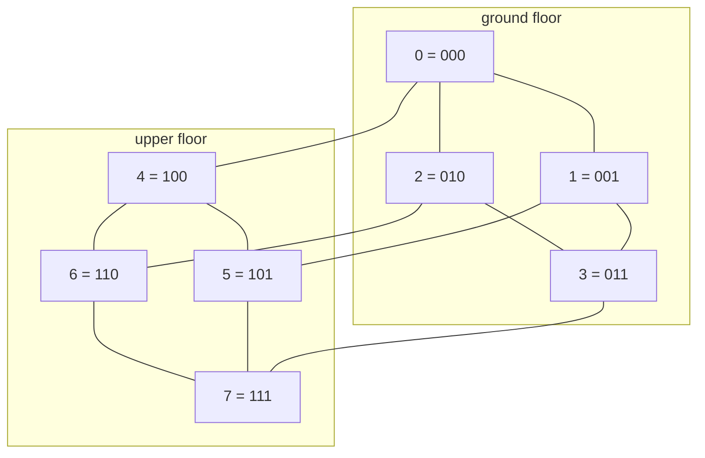
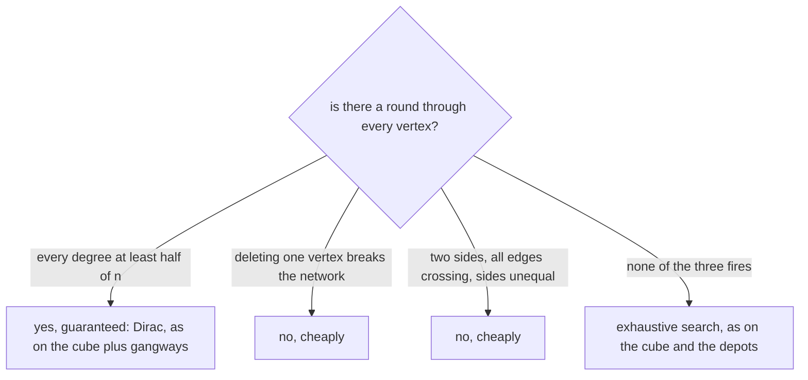

# Hamiltonian cycles: visit every vertex once and return, with no quick test, but enough edges guarantee one

Combinatorics and graphs → Tours - Euler and Hamilton → Every vertex once → Hamiltonian cycles

---

## General Overview

A distribution warehouse is built as a cube: eight corners, a walkway along each of its twelve edges. Number the corners 0 to 7 in three binary digits, one per direction of the building; two corners share a walkway exactly when their codes differ in one digit.

A courier signs a sheet at every corner, walking only the walkways, signing nowhere twice, finishing where the round began. One round works: 0, 1, 3, 2, 6, 7, 5, 4, back to 0. Six such rounds exist.

A tour like that, every vertex once and then home, is a **Hamiltonian cycle**. The twin question asks for every *edge* once: that is Euler's, and degrees settle it in a line ([euler-circuits](01-euler-circuits.md)). Swapping "edge" for "vertex" changes everything. No quick test is known, and since Karp's 1972 list this has been a standard hard problem.

Enough edges still force a round; that guarantee is this card. No count of edges explains a failure, though: ten depots on fifteen links, three at each — the Petersen network, as well wired per depot as a cube corner — carry no round, which a search over all 274 partial routes confirms.

**A Hamiltonian cycle visits every vertex once and comes home; no quick test for one is known, but every vertex reaching at least half the vertices guarantees one.**

**What kind of fact this is:** a theorem, Dirac's, proved on this card in Why it works; the Hamiltonian cycle itself is a definition.

### The picture: the warehouse, floor by floor



Twelve walkways: four per floor, four between them. The round above takes three ground walkways, a riser, three upstairs, and the last riser home.

---

## The formula

Notation first, in words. A network of dots and lines is $G$: dots are vertices, lines edges ([graphs-vertices-and-edges](../09-Graphs%20-%20Dots%20and%20Lines/01-graphs-vertices-and-edges.md)). The vertex count is $n$; the edges at one vertex are its degree, $\deg(v)$ ([degree-and-handshaking](../09-Graphs%20-%20Dots%20and%20Lines/02-degree-and-handshaking.md)). A network's smallest degree is $\delta(G)$, the Greek letter delta, read "the minimum degree of G".

A **Hamiltonian cycle** lists every vertex once, an edge joining each to the next and the last back to the first:

$$x_1 \to x_2 \to \cdots \to x_n \to x_1$$

Dirac's theorem, from 1952, is the guarantee:

$$\text{if } n \ge 3 \text{ and } \delta(G) \ge n/2, \text{ then } G \text{ has a Hamiltonian cycle}$$

**Read it aloud:** three vertices or more, each reaching at least half of them, is enough for a round through all.

| Symbol | Plain meaning | In our example | Push it up and the answer… |
| --- | --- | --- | --- |
| $G$ | the network: vertices and edges | 8 corners, 12 walkways | — |
| $n$ | how many vertices | 8 | the bar rises with it |
| $\deg(v)$ | edges at one vertex | 3 at every corner | rounds get easier to find |
| $\delta(G)$ | the smallest degree anywhere | 3 | at half of $n$ the guarantee fires |
| $n/2$ | half the vertices: Dirac's bar | 4 | harder to clear |
| $x_1$, $x_i$, $x_k$, $x_n$ | a route's vertices in order: a full round ends at $x_n$, a part-route at $x_k$, with $x_i$ along the way | 0, 1, 3, 2, 6, 7, 5, 4 | — |

### When it holds

- **Three vertices or more, simply joined.** Two vertices and one edge make no cycle; a repeated edge, or an edge from a vertex to itself, serves no round.
- **Half exactly is enough.** Four gangways across the middle lift every degree to 4 on a network of 8: the bar met exactly, and 72 rounds.
- **One way only.** Below the bar the theorem says nothing — the cube sits at degree 3 against a bar of 4, with six rounds regardless.

---

## Why it works

### Step 0: improve a route, rather than test the network

The proof never asks whether the network has a round. It takes a longest route and shows that enough degree closes it into a loop with nothing left out. Twice it assumes the opposite and counts until something impossible appears ([proof-by-contradiction](../../01-Foundations/06-Proof/03-proof-by-contradiction.md)).

### Step 1: the ends of a longest route have nowhere new to go

Let $x_1$ and $x_k$ end a route with no repeats, through as many vertices as any route in the network. A neighbour of $x_1$ off that route could be hung on the front, making a longer one — so every neighbour of either end already lies on it.

### Step 2: the ends' neighbours must collide, and the collision closes the route

Each end has at least half of $n$ neighbours, all on the route. Mark where $x_1$'s neighbours sit, and mark one step past each of $x_k$'s: two lists, at least $n$ marks between them, in the fewer than $n$ positions after the first. Two marks must land together, giving a vertex $x_i$ joined to $x_1$ with the vertex before it joined to $x_k$.

That collision closes the route: from $x_1$ jump to $x_i$, run forward to $x_k$, jump back to the vertex before $x_i$, run backwards to $x_1$, every vertex used once.

### Step 3: the loop cannot have left a vertex out

The loop holds all of $x_1$'s neighbours, so more than half the vertices sit on it. Suppose one sits outside. Joined to the loop anywhere, it lets the loop be cut open there, and that route with the stray on the end beats the longest. Joined nowhere, its neighbours all lie outside, where fewer than half the vertices remain. Impossible either way, so the loop is a Hamiltonian cycle.

<details>
<summary>Detailed proof: the collision, counted exactly</summary>

With `x1 x2 ... xk` a longest path, collect `A = { i : x1 joined to xi }` and `B = { i : the vertex before xi joined to xk }`, both inside `2, ..., k`. Each holds one member per neighbour of its end, so at least `n` members sit in at most `n - 1` positions and some `i` lies in both. Then `x1, xi, xi+1, ..., xk, xi-1, ..., x1` is a cycle on every vertex of the path; `i = k` is the plain closing edge.

</details>

### Step 4: why the ten depots have none, and why no degree count says so

Every depot has three links, as every cube corner does: the same pattern, six rounds on one network and none on the other. Degrees alone cannot decide. Two cheap ways to rule a round out do exist: a vertex whose deletion breaks the network into pieces, since deleting one vertex of a round leaves a single path; and a two-sided network whose sides differ in size, since a round alternates sides ([bipartite-graphs-and-odd-cycles](../09-Graphs%20-%20Dots%20and%20Lines/05-bipartite-graphs-and-odd-cycles.md)). The cube clears both, four corners a side; the depots have no such vertex and no two sides at all, and still no round.

What settles the depots here is exhaustion: the search opens 274 partial routes and closes none — a verdict on one network, not a test. The general question sits on Karp's 1972 list (karps-problems-and-hardness-recipes).



Ore's theorem of 1960 asks less: two vertices with no edge between them need only have degrees adding to at least $n$. Step 2 used nothing more, so the collision survives; only Step 3's last count is restated, as a degree sum under $n$.

---

## Worked numbers, by hand

| Step | Arithmetic | Value |
| --- | --- | --- |
| walkways, Dirac's bar, every degree against it | 8 corners × 3 each ÷ 2 ends; 8 ÷ 2; 3 against 4 | 12, bar 4, silent |
| orders a blind sift would face, and routes opened | (8 − 1)! ÷ 2, against the search | 2520, 112 |
| rounds, one being 0-1-3-2-6-7-5-4-0 | both roads | **6** |
| four gangways: every degree, and the rounds | 3 + 1 against 4, then 4! × 3! ÷ 2 | fires, **72** |
| the depots against their bar, every route refused | 3 against 5, then both roads | silent, **0** |

Six rounds, found by searching. Four gangways lift every corner to half the network, turning the search into a guarantee. They also complete it: the codes split four-four by whether they hold an even or an odd count of 1s, and every corner now joins all four of the other kind. That network is K(4, 4), whose rounds number 4! × 3! ÷ 2 = 72: each side ordered, one start fixed, halved for direction. The depots have none.

### What breaks if you drop a piece

| Mistake | Comes out at | What went wrong |
| --- | --- | --- |
| Every walkway once, not every corner | 8 corners of odd degree: no walkway circuit | Euler's question, with its own answer |
| Dirac backwards: below the bar, no round | the cube's 6 rounds | Sufficient, never necessary |
| A route through every depot read as a round | 0-1-2-3-4-9-6-8-5-7 covers 10; 0 rounds | A round closes: the ends need an edge |

The code prints all three.

---

## Code, from first principles, and it actually runs

Nothing is imported, and every count is reached twice. Road one is backtracking: extend a route corner by corner, and when stuck, back up and take the next edge. Road two builds no route: it tallies how many routes from corner 0 cover each set of corners and stop at each corner in it, then closes the full sets. Beside them: the gangway count against K(4, 4)'s 4! × 3! ÷ 2, and a census of all six-corner networks.

### Python

```python
# Hamiltonian cycles -- the check behind the card.  Nothing is imported.  Three networks:
# the 8 corners of a cube-shaped warehouse, that cube plus four gangways across the middle,
# and the Petersen network of 10 depots.  Every round is counted twice, by backtracking over
# routes and by a tally over sets of corners that builds no route at all.
deg = lambda x: bin(x).count("1")          # a degree: the 1 bits of a neighbour set
low = lambda w: (w & -w).bit_length() - 1  # the lowest-numbered corner in a bit set
fact = lambda k: 1 if k < 2 else k * fact(k - 1)             # k! = 1 x 2 x ... x k
FMT = "{:<17}{:>3}{:>7}{:>9}{:>9}{:>5}{:>7}{:>10}{:>8}{:>9}"
def masks(n, edges):                       # each corner's neighbours, as bits
    return [sum(1 << (v if u == i else u) for u, v in edges if i in (u, v)) for i in range(n)]
def search(m, close=True):                 # road one: backtracking, a route at a time
    n, out, opened = len(m), [], [0]
    def walk(path, left):
        opened[0] += 1                     # one more partial route opened
        if not left and (not close or (m[path[-1]] >> path[0] & 1 and path[1] < path[-1])):
            out.append(path + [path[0]] if close else path)
        w = m[path[-1]] & left
        while w:
            b = w & -w; w -= b
            walk(path + [low(b)], left - b)
    walk([0], (1 << n) - 2)
    return out, opened[0]
def subsets(m):                            # road two: a tally over sets of corners
    n, full = len(m), (1 << len(m)) - 1
    cnt = [[0] * n for _ in range(full + 1)]; cnt[1][0] = 1   # one route: at 0, no step yet
    for s in range(1, full + 1, 2):        # every set of corners that holds corner 0
        for v in range(n):
            c, w = cnt[s][v], m[v] & ~s
            while c and w:
                b = w & -w; w -= b
                cnt[s | b][low(b)] += c    # the same routes, one corner longer
    return sum(cnt[full][v] for v in range(n) if m[0] >> v & 1) // 2
CUBE = [(x, y) for x in range(8) for y in range(x + 1, 8) if deg(x ^ y) == 1]
GANG = CUBE + [(x, 7 - x) for x in range(4)]          # gangways to opposite corners
PET = ([(i, (i + 1) % 5) for i in range(5)] + [(i, i + 5) for i in range(5)]
       + [(i + 5, (i + 2) % 5 + 5) for i in range(5)])
NETS = [("cube warehouse", 8, CUBE), ("cube + gangways", 8, GANG), ("Petersen depots", 10, PET)]
M, found, tally, opened = {}, {}, {}, {}
print(FMT.format("network", "n", "links", "min deg", "odd deg", "n/2", "Dirac", "(n-1)!/2", "search", "subsets"))
for name, n, edges in NETS:
    M[name] = m = masks(n, edges); rounds, opened[name] = search(m)
    found[name], tally[name] = len(rounds), subsets(m)
    d, e, o = min(map(deg, m)), sum(map(deg, m)) // 2, sum(x % 2 for x in map(deg, m))
    print(FMT.format(name, n, e, d, o, f"{n / 2:.1f}", "yes" if d >= n / 2 else "no", fact(n - 1) // 2, found[name], tally[name]))
print("one round on the cube: " + "-".join(map(str, search(M["cube warehouse"])[0][0])))
print(f"partial routes opened by the search: cube {opened['cube warehouse']}, Petersen {opened['Petersen depots']}")
print(f"rounds on cube + gangways, from the K(4,4) count 4! x 3! / 2: {fact(4) * fact(3) // 2}")
print("route over all 10 depots that will not close: " + "-".join(map(str, search(M["Petersen depots"], False)[0][0])))
pairs, dirac, ham, both = [(i, j) for i in range(6) for j in range(i + 1, 6)], 0, 0, 0
for bits in range(1 << 15):                # every network on 6 labelled corners
    m = masks(6, [pairs[i] for i in range(15) if bits >> i & 1])
    d, h = min(map(deg, m)) >= 3, bool(search(m)[0])
    dirac, ham, both = dirac + d, ham + h, both + (d and h)
print(f"of all {1 << 15} networks on 6 corners, {dirac} meet Dirac and all {both} of those have a round")
print(f"of the same {1 << 15}, {ham} have a round, so {ham - both} have one with Dirac silent")
assert [found[k] for k, _, _ in NETS] == [tally[k] for k, _, _ in NETS]   # the two roads agree
assert found["cube + gangways"] == fact(4) * fact(3) // 2 and found["cube + gangways"] == 72
assert found["cube warehouse"] == 6 and found["Petersen depots"] == 0
assert dirac == both < ham                 # Dirac is never wrong, and never necessary
print("ALL CHECKS PASS")
```

**Ran 2026-09-19 on macOS, Python 3.14.6, standard library only. All checks passed. Output, pasted from the run:**

```
network            n  links  min deg  odd deg  n/2  Dirac  (n-1)!/2  search  subsets
cube warehouse     8     12        3        8  4.0     no      2520       6        6
cube + gangways    8     16        4        0  4.0    yes      2520      72       72
Petersen depots   10     15        3       10  5.0     no    181440       0        0
one round on the cube: 0-1-3-2-6-7-5-4-0
partial routes opened by the search: cube 112, Petersen 274
rounds on cube + gangways, from the K(4,4) count 4! x 3! / 2: 72
route over all 10 depots that will not close: 0-1-2-3-4-9-6-8-5-7
of all 32768 networks on 6 corners, 1858 meet Dirac and all 1858 of those have a round
of the same 32768, 10078 have a round, so 8220 have one with Dirac silent
ALL CHECKS PASS
```

### Rust

Same numbers, same labels, built with `rustc --edition 2021 -O`.

```rust
// Hamiltonian cycles -- the same check as hamiltonian_cycles_check.py, in Rust.  No crates.  Three
// networks: the 8 corners of a cube-shaped warehouse, that cube plus four gangways across the middle,
// and the Petersen network of 10 depots.  Every round is counted twice, by backtracking over routes
// and by a tally over sets of corners that builds no route at all.
fn deg(x: u64) -> u32 { x.count_ones() }             // a degree: the 1 bits of a neighbour set
fn low(w: u64) -> usize { w.trailing_zeros() as usize }   // the lowest corner in a bit set
fn fact(k: u64) -> u64 { if k < 2 { 1 } else { k * fact(k - 1) } }   // k! = 1 x 2 x ... x k
fn dash(r: &[usize]) -> String { r.iter().map(|v| v.to_string()).collect::<Vec<_>>().join("-") }
fn masks(n: usize, edges: &[(usize, usize)]) -> Vec<u64> {           // neighbours, as bits
    (0..n).map(|i| edges.iter().filter(|e| e.0 == i || e.1 == i).map(|e| 1u64 << if e.0 == i { e.1 } else { e.0 }).sum()).collect()
}
fn walk(m: &[u64], path: &mut Vec<usize>, left: u64, close: bool, out: &mut Vec<Vec<usize>>, opened: &mut u64) {
    *opened += 1; let end = path[path.len() - 1];   // one more partial route opened
    if left == 0 && (!close || (m[end] >> path[0] & 1 == 1 && path[1] < end)) {
        let mut r = path.clone(); if close { r.push(path[0]) } out.push(r);
    }
    let mut w = m[end] & left;
    while w != 0 {
        let b = w & w.wrapping_neg(); w -= b;
        path.push(low(b));
        walk(m, path, left - b, close, out, opened);
        path.pop();
    }
}
fn search(m: &[u64], close: bool) -> (Vec<Vec<usize>>, u64) {        // road one: backtracking
    let (mut out, mut opened) = (Vec::new(), 0u64);
    walk(m, &mut vec![0], (1u64 << m.len()) - 2, close, &mut out, &mut opened);
    (out, opened)
}
fn subsets(m: &[u64]) -> u64 {                      // road two: a tally over sets of corners
    let (n, full) = (m.len(), (1usize << m.len()) - 1);
    let mut cnt = vec![vec![0u64; n]; full + 1];
    cnt[1][0] = 1;                                  // one route: at 0, no step yet
    for s in (1..=full).step_by(2) {                // every set of corners that holds corner 0
        for v in 0..n {
            let (c, mut w) = (cnt[s][v], m[v] & !(s as u64));
            while c > 0 && w != 0 {
                let b = w & w.wrapping_neg(); w -= b;
                cnt[s | b as usize][low(b)] += c;   // the same routes, one corner longer
            }
        }
    }
    (0..n).filter(|&v| m[0] >> v & 1 == 1).map(|v| cnt[full][v]).sum::<u64>() / 2
}
fn main() {
    let cube: Vec<(usize, usize)> = (0..8).flat_map(|x| (x + 1..8).map(move |y| (x, y))).filter(|&(x, y)| deg((x ^ y) as u64) == 1).collect();
    let mut gang = cube.clone(); for x in 0..4 { gang.push((x, 7 - x)) }   // to opposite corners
    let pet: Vec<(usize, usize)> = (0..5).flat_map(|i| [(i, (i + 1) % 5), (i, i + 5), (i + 5, (i + 2) % 5 + 5)]).collect();
    let nets = [("cube warehouse", 8usize, &cube), ("cube + gangways", 8, &gang), ("Petersen depots", 10, &pet)];
    println!("{:<17}{:>3}{:>7}{:>9}{:>9}{:>5}{:>7}{:>10}{:>8}{:>9}", "network", "n", "links",
             "min deg", "odd deg", "n/2", "Dirac", "(n-1)!/2", "search", "subsets");
    let (mut mm, mut found, mut tally, mut opened) = (vec![], vec![], vec![], vec![]);
    for (name, n, edges) in nets {
        let m = masks(n, edges); let (rounds, op) = search(&m, true);
        let (t, d) = (subsets(&m), m.iter().map(|&x| deg(x)).min().unwrap());
        let (e, o) = (m.iter().map(|&x| deg(x)).sum::<u32>() / 2, m.iter().filter(|&&x| deg(x) % 2 == 1).count());
        println!("{:<17}{:>3}{:>7}{:>9}{:>9}{:>5}{:>7}{:>10}{:>8}{:>9}", name, n, e, d, o,
                 format!("{:.1}", n as f64 / 2.0), if d as f64 >= n as f64 / 2.0 { "yes" } else { "no" },
                 fact(n as u64 - 1) / 2, rounds.len(), t);
        mm.push(m); found.push(rounds.len() as u64); tally.push(t); opened.push(op);
    }
    println!("one round on the cube: {}", dash(&search(&mm[0], true).0[0]));
    println!("partial routes opened by the search: cube {}, Petersen {}", opened[0], opened[2]);
    println!("rounds on cube + gangways, from the K(4,4) count 4! x 3! / 2: {}", fact(4) * fact(3) / 2);
    println!("route over all 10 depots that will not close: {}", dash(&search(&mm[2], false).0[0]));
    let pairs: Vec<(usize, usize)> = (0..6).flat_map(|i| (i + 1..6).map(move |j| (i, j))).collect();
    let (mut dirac, mut ham, mut both) = (0u64, 0u64, 0u64);
    for bits in 0..1u32 << 15 {                     // every network on 6 labelled corners
        let m = masks(6, &(0..15).filter(|i| bits >> i & 1 == 1).map(|i| pairs[i]).collect::<Vec<_>>());
        let (d, h) = (m.iter().map(|&x| deg(x)).min().unwrap() >= 3, !search(&m, true).0.is_empty());
        dirac += d as u64; ham += h as u64; both += (d && h) as u64;
    }
    println!("of all {} networks on 6 corners, {} meet Dirac and all {} of those have a round", 1 << 15, dirac, both);
    println!("of the same {}, {} have a round, so {} have one with Dirac silent", 1 << 15, ham, ham - both);
    assert!(found == tally);                        // the two roads agree
    assert!(found[1] == fact(4) * fact(3) / 2 && found[1] == 72);      // search vs K(4,4) count
    assert!(found[0] == 6 && found[2] == 0);
    assert!(dirac == both && both < ham);           // Dirac is never wrong, and never necessary
    println!("ALL CHECKS PASS");
}
```

**Ran 2026-09-19 on macOS, rustc 1.98.1, no crates. All checks passed. Output, pasted from the run:**

```
network            n  links  min deg  odd deg  n/2  Dirac  (n-1)!/2  search  subsets
cube warehouse     8     12        3        8  4.0     no      2520       6        6
cube + gangways    8     16        4        0  4.0    yes      2520      72       72
Petersen depots   10     15        3       10  5.0     no    181440       0        0
one round on the cube: 0-1-3-2-6-7-5-4-0
partial routes opened by the search: cube 112, Petersen 274
rounds on cube + gangways, from the K(4,4) count 4! x 3! / 2: 72
route over all 10 depots that will not close: 0-1-2-3-4-9-6-8-5-7
of all 32768 networks on 6 corners, 1858 meet Dirac and all 1858 of those have a round
of the same 32768, 10078 have a round, so 8220 have one with Dirac silent
ALL CHECKS PASS
```

The two outputs match line for line.

> [!TIP]
> **Try changing**
> Guess first, then run it. The asserts are pinned to these three networks, so expect one to stop.
> - **Drop the rule keeping one direction.** Remove `path[1] < path[-1]`. Each round is then counted twice, once each way round, while the subset tally is unmoved: the first assert stops it.
> - **Lower the bar below half.** Change the census test `>= 3` to `>= 2`. 12068 networks clear it and only 10078 have a round: 1990 false guarantees, and the fourth assert stops it.
> - **Take a walkway out of the cube.** Drop one pair from `CUBE`. Every walkway lies in four of the six rounds, so two survive — and the third assert, pinned to 6, stops it.

---

## The usual mistake

> [!warning]
> **Reading Dirac's theorem as a test.** It only ever says yes. Of the 10078 networks on six corners that have a round, it catches 1858; the other 8220 have one with the guarantee silent. "Dirac fails, so no round" is the commonest wrong step, and the cube refutes it six times over.
>
> - **Asking for every edge once.** That is a degree count; this is not. All eight cube corners have odd degree, so no circuit covers each walkway once, while six rounds cover each corner.
> - **Taking a route through everything as a round.** The depots have a route touching all ten, 0-1-2-3-4-9-6-8-5-7, and no round: its ends are not joined, and no reshuffle joins them.
> - **Halving with whole numbers.** The bar is $n/2$ as a fraction; rounding it down on an odd vertex count manufactures guarantees.

---

## Where you meet it in real life

- **Position encoders.** The round 0, 1, 3, 2, 6, 7, 5, 4 is the reflected binary code: one digit flips per step, so a sensor on three tracks cannot straddle two positions and read a third.
- **Vehicle routing.** Cost each edge and ask for the cheapest round: this search is the travelling salesman's skeleton ([travelling-salesman-in-outline](04-travelling-salesman-in-outline.md)).
- **The postman, not the courier.** Covering every street instead has an efficient algorithm ([chinese-postman](02-chinese-postman.md)).
- **Shortest string holding every code.** A sequence containing each binary block of one length once is a round through every vertex of one network ([de-bruijn-sequences](05-de-bruijn-sequences.md)).

> **Say it back**
> A Hamiltonian cycle visits every vertex once and returns home. Euler's twin question, every edge once, has a cheap degree test; this one has none. Dirac's theorem gives a one-way guarantee: three vertices or more, every degree at least half the vertices. Its proof takes a longest route and counts the ends' neighbours until they must collide, closing it. The warehouse has six rounds with the bar unmet; four gangways meet it and lift the count to 72; the ten depots have none.

---

## What this builds on

- [euler-circuits](01-euler-circuits.md): the edge-covering twin, and the cheap degree test this question lacks.
- [proof-by-contradiction](../../01-Foundations/06-Proof/03-proof-by-contradiction.md): the shape of Steps 1 and 3.

## Where this goes next

- [travelling-salesman-in-outline](04-travelling-salesman-in-outline.md): the same round with a cost on every edge, where finding one stops being the hard part.
- karps-problems-and-hardness-recipes: where "no quick test is known" becomes a precise claim about a family of problems.

The search opened 274 partial routes where a blind sift of ten depots faces 181440 orders — encouraging until the depots number a thousand. What to do when the exact answer is out of reach is the next card's business.

---

## Sources

Verified 19 Sep 2026: every link below resolves to the publisher's page.

- Dirac, G. A. "Some theorems on abstract graphs." *Proceedings of the London Mathematical Society* s3-2, no. 1 (1952): 69–81. [Publisher page, London Mathematical Society](https://londmathsoc.onlinelibrary.wiley.com/doi/10.1112/plms/s3-2.1.69). The guarantee proved here.
- Ore, Øystein. "Note on Hamilton Circuits." *The American Mathematical Monthly* 67, no. 1 (1960): 55. [Journal page, JSTOR](https://www.jstor.org/stable/2308928). The degree-sum version.
- Karp, Richard M. "Reducibility among Combinatorial Problems." In *Complexity of Computer Computations*, 85–103. Plenum Press, 1972. [Chapter page](https://link.springer.com/chapter/10.1007/978-1-4684-2001-2_9). The list holding this problem.
- Bondy, J. A., and U. S. R. Murty. *Graph Theory*. Springer, 2008. [Publisher page](https://link.springer.com/book/9781846289699). Step 4's conditions, and the Petersen network.
