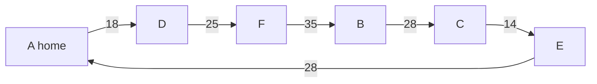

# The travelling salesman: the cheapest Hamiltonian cycle, brute force for a few cities, and why nobody has a fast method

Combinatorics and graphs → Tours - Euler and Hamilton → Cheapest round trips → The travelling salesman

---

## General Overview

A sales rep covers six towns, written A to F, home at A. The Monday round leaves A, calls once at each of the other five, and ends back at A. The firm's chart gives the miles between every pair.

Sixty rounds are possible, few enough to list outright: the cheapest is A-D-F-B-C-E-A at 148 miles, the dearest A-E-F-C-D-B-A at 267.

Greed comes close and loses: always drive to the nearest town not yet called on and the round costs 160 miles, 8.11% above the cheapest.

**The cost of a round is the sum of its legs, so a few towns are settled by listing every round and reading off the cheapest; past a couple of dozen towns nobody knows a method that stays quick on every chart.**

**What kind of fact this is:** a method, carrying a theorem proved below ($n$ towns hold $(n-1)!/2$ rounds), an approximation with no fixed guarantee (the nearest-town rule), and an open question, unsettled as of 19 September 2026: whether a fast exact method can exist.

### The picture: the cheapest of the sixty rounds



The six legs add to 148 miles; driven the other way, the same round.

---

## The formula

Notation first, in words. The chart is $d$: $d(i, j)$ is the miles between towns i and j, so $d(A, D)$ is 18.

```
The rep's chart: miles between every pair, rows and columns A to F

     A   B   C   D   E   F
A    0  34  42  18  28  19
B   34   0  28  51  26  35
C   42  28   0  58  14  54
D   18  51  58   0  44  25
E   28  26  14  44   0  42
F   19  35  54  25  42   0
```

A round calling at every town once and returning home is a **tour**: a Hamiltonian cycle ([hamiltonian-cycles](03-hamiltonian-cycles.md)) priced leg by leg. Write it as the order it calls in, $t$, with $t_1$ home and $t_k$ the k-th town called at.

$$\text{cost}(t) = d(t_1, t_2) + d(t_2, t_3) + \cdots + d(t_5, t_6) + d(t_6, t_1)$$

**Read it aloud:** add the miles of each leg in turn, then the miles home from the last town.

The smallest cost any tour can have is written $L$: 148 miles here. With $n$ towns, how many tours must be searched:

$$\text{tours} = \frac{(n-1)!}{2}$$

Here $n!$ is the factorial: $n$ times every whole number below it ([factorial](../01-Counting%20Principles/03-factorial.md)). **Read it aloud:** hold home still, order the other towns every way, then halve, since a round driven backwards is the same round.

One more quantity is needed below: the **cheapest connecting tree**, joining all six towns with five legs and no loop for the least miles ([minimum-spanning-trees](../10-Trees%20and%20Cheapest%20Routes/04-minimum-spanning-trees.md)). Write $T$ for it, 105 here.

| Symbol | Plain meaning | In our example | Push it up and the answer… |
| --- | --- | --- | --- |
| $n$, $n!$ | towns on the round, home included; $n!$ is the factorial | 6; 5! = 120 | the search outgrows any computer |
| $d$ | the chart; $d(i, j)$ is the miles between two towns | $d(A, D)$ = 18 | every tour costs more |
| $t$, $t_1$, $t_k$ | a tour, as the order it calls in; $t_k$ is its k-th town | A, D, F, B, C, E | — |
| $L$ | the cheapest tour's miles | 148 | — |
| $T$ | the cheapest tree's miles | 105 | floor and ceiling rise |

### When it holds

- **The chart is symmetric:** B to C equals C to B. Where one-way systems break that, the halving fails and the count rises to $(n-1)!$, 120 rounds.
- **Every pair has a direct road:** no cell is blank. Where one is, orders needing that leg are not tours, and the count includes undrivable rounds.
- **No detour beats the direct road:** A to C is 42 miles, A to E to C also 42, never less. Charts breaking this keep the floor, lose the ceiling.

---

## Why it works

### Step 0: the tours are finitely many, so one of them is cheapest

Each tour has a cost, the tours can be listed, and a finite list of numbers has a smallest member. Brute force is honest for that reason: it reads the answer off a complete list. Everything hard here is that list's length.

### Step 1: sixty tours to check, and then a wall

Six towns line up in 6! = 720 orders, most naming the same round. Fixing home first strips a factor of six: 720 over 6 is 120, the orders of the other five towns. Each round still appears twice, clockwise and anticlockwise, so halving gives 60 — the bracelet count, with towns for beads ([circular-arrangements](../02-Repeats%2C%20Groups%20and%20Double%20Counting/04-circular-arrangements.md)).

Each town added multiplies the count by the number of towns already there: a seventh town takes 60 rounds to 360, ten towns to 181,440, fifteen to 43,589,145,600, twenty to 60,822,550,204,416,000. That is no large constant; it is a wall.

### Step 2: the nearest-town rule is fast, close, and wrong

From wherever the van stands, drive to the nearest town not yet called on, and home from the last one: the **nearest-neighbour rule**.

It gives A-D-F-B and then stumbles. At B the nearest uncalled town is E at 26 miles against C at 28, so greed takes E — and the bill lands on the final leg, which greed never chooses: 42 miles home from C against 28 from E. The round costs 160 miles, 8.11% above 148; restarting at each of the six towns in turn does best from F, at 158. The rule never looks ahead, so nothing protects the drive home, and its excess can grow with the number of towns.

### Step 3: the cheapest connecting tree traps the answer from both sides

$$T \le L \le 2T$$

**Read it aloud:** the cheapest tour is never shorter than the cheapest tree, nor longer than twice it: 105 ≤ 148 ≤ 210.

The floor: delete one leg from any tour and five legs remain, still connected and with no room for a loop — a spanning tree, costing the tour less that leg. The cheapest tree is no dearer, so 105 sits below 148 before a single tour is costed.

The ceiling: walk the cheapest tree from A, each leg once out and once back. That is 210 miles and calls at every town, but towns repeat, so it is no tour. Repair it in one pass: wherever the walk would return to a town already called on, drive straight to the next town not yet called on. Each skip trades a chain of legs for one direct road, no dearer since no detour beats a direct road. The repaired round calls once at each town for at most 210 miles, so $L$ is at most 210 too.

Sharper floors than the tree exist, and inside a search that prunes they solve real instances (integer-programming-and-branch-and-bound).

### Step 4: why nobody has a fast method

Held and Karp published a better exact method in 1962: for every set of towns already called on and every town in it, keep only the cheapest way to leave A, call at that set and stop there, each record built from the records one town shorter. Six towns need 80 records against 60 tours, no saving; twenty need 4,980,736. That count doubles with each town added, so it too runs out.

Karp's 1972 list of problems with no known fast method holds the bare question of whether a Hamiltonian cycle exists at all. Price a map's roads at one mile each and its missing roads at two: a round costing one mile per town exists exactly when a Hamiltonian cycle does. So asking whether a round comes in under a given number of miles is at least as hard as anything on that list — a family now thousands strong, each problem rewritable as any other in steps growing like a power of the input size (karps-problems-and-hardness-recipes). One method quick on every chart would make all of them quick; none is known, and whether one can exist is the open P versus NP question. Charts of tens of thousands of towns are still solved exactly: the guarantee is what is missing, not the answers.

Degrees settle whether a route using every road once exists ([euler-circuits](01-euler-circuits.md)), and matching settles the cheapest road-covering route ([chinese-postman](02-chinese-postman.md)); no such test is known once towns replace roads.

---

## Worked numbers, by hand

| Step | Arithmetic | Value |
| --- | --- | --- |
| tours to check | 5! = 120 orders, each loop twice | **60** |
| cheapest, A-D-F-B-C-E-A | 18 + 25 + 35 + 28 + 14 + 28 | **148 miles** |
| dearest, A-E-F-C-D-B-A | 28 + 42 + 54 + 58 + 51 + 34 | **267 miles** |
| nearest-town rule from A | 18 + 25 + 35 + 26 + 14 + 42 | **160 miles** |
| cheapest connecting tree | 18 + 19 + 28 + 14 + 26 | **105 miles** |
| the bracket, no tour costed | 105, and twice 105 | **105 ≤ 148 ≤ 210** |

Twelve miles a week separate the best round from the one greed suggests.

```
Miles on the rep's chart, one block per full 10 miles

cheapest connecting tree   ██████████                  105
cheapest tour              ██████████████              148
nearest-town rule from A   ████████████████            160
twice the tree             █████████████████████       210
dearest tour               ██████████████████████████  267
```

### What breaks if you drop a piece

| Mistake | Comes out at | What went wrong |
| --- | --- | --- |
| Every order counted as a tour | 720 instead of 60 | Home is fixed, and a loop reversed is the same loop |
| Stopping at the nearest-town round | 160 miles, 12 more | Greed never chooses the leg home |
| The cheapest tree read as a route | 105 miles, 43 short | A tree has no way home |

The code prints all three.

---

## Code, from first principles, and it actually runs

Nothing is imported. The cheapest tour comes twice over, by roads sharing no arithmetic: all 120 orders of the five towns after A, costed and sorted, and the set-by-set method, which forms no whole tour. The count comes twice too, formula against folding.

### Python

```python
# The travelling salesman -- the check behind the card.  Nothing is imported.  Six
# towns, A home, and the rep's mileage chart.  The cheapest tour is found twice over:
# by listing every order of the five towns after A, and by the set-by-set method,
# which keeps the cheapest way to reach each set of towns and end at each of them.
NAMES, N = "ABCDEF", 6
D = [[0, 34, 42, 18, 28, 19], [34, 0, 28, 51, 26, 35], [42, 28, 0, 58, 14, 54],
     [18, 51, 58, 0, 44, 25], [28, 26, 14, 44, 0, 42], [19, 35, 54, 25, 42, 0]]
def orders(rest):                        # every order of the towns after home
    return [()] if not rest else [(x,) + t for x in rest for t in orders([y for y in rest if y != x])]
def cost(t): return sum(D[t[k]][t[(k + 1) % N]] for k in range(N))   # legs, plus the drive home
def show(t): return "-".join(NAMES[c] for c in t) + "-" + NAMES[t[0]]
def fact(k): return 1 if k < 2 else k * fact(k - 1)
def fold(t):                             # one name per tour: rotations, both directions
    rots = [t[k:] + t[:k] for k in range(N)]
    return min(min(rots), min(tuple(reversed(r)) for r in rots))
def nearest(start):                      # greed: drive to the nearest town not yet seen
    seen = [start]
    while len(seen) < N:
        seen.append(min((D[seen[-1]][v], v) for v in range(N) if v not in seen)[1])
    return tuple(seen)
tours = [(0,) + p for p in orders(list(range(1, N)))]
ranked = sorted((cost(t), t) for t in tours)          # road one: every order, costed
best, worst, distinct = ranked[0], ranked[-1], len({fold(t) for t in tours})
sym = all(D[u][v] == D[v][u] for u in range(N) for v in range(N))
tri = all(D[u][v] <= D[u][w] + D[w][v] for u in range(N) for v in range(N) for w in range(N))
paths = {(1 << (v - 1), v): D[0][v] for v in range(1, N)}       # second road: set by set
for _ in range(N - 2):
    grown = dict(paths)
    for (s, v), c in paths.items():
        for w in range(1, N):
            if not s >> (w - 1) & 1 and c + D[v][w] < grown.get((s | 1 << (w - 1), w), 10 ** 9):
                grown[(s | 1 << (w - 1), w)] = c + D[v][w]
    paths = grown
setbest = min(paths[((1 << (N - 1)) - 1, v)] + D[v][0] for v in range(1, N))   # all five seen
inn, legs, tree = [0], [], 0
while len(inn) < N:                      # the cheapest connecting tree, grown from A
    w, u, v = min((D[u][v], u, v) for u in inn for v in range(N) if v not in inn)
    inn.append(v); legs.append(f"{NAMES[u]}-{NAMES[v]} {w}"); tree += w
nnt = nearest(0)
nnc, nns = cost(nnt), [cost(nearest(s)) for s in range(N)]
print("six towns, A home; the rep's mileage chart in miles, rows and columns A to F:")
for u in range(N):
    print(f"  {NAMES[u]} " + "".join(f"{D[u][v]:>4}" for v in range(N)))
print(f"chart symmetric: {'yes' if sym else 'no'}; no detour shorter than the direct road: {'yes' if tri else 'no'}")
print(f"orders of the five towns after A: 5! = {len(tours)}; tours (6-1)!/2 = {fact(N - 1) // 2}; by folding rotations and reversals: {distinct}")
print(f"cheapest tour, from all {len(tours)} orders: {show(best[1])} = {best[0]} miles")
print(f"the same cost from the set-by-set method: {setbest} miles, kept in {len(paths)} records")
print(f"dearest tour: {show(worst[1])} = {worst[0]} miles")
print(f"nearest neighbour from A: {show(nnt)} = {nnc} miles, {(nnc - best[0]) * 100 / best[0]:.2f}% above {best[0]}")
print(f"nearest neighbour restarted at each town A to F: {nns}; cheapest of the six {min(nns)}, still above {best[0]}")
print(f"cheapest connecting tree: {', '.join(legs)} = {tree} miles; the bracket {tree} <= {best[0]} <= {2 * tree}")
print(f"tours to check as towns are added: 6 -> {fact(5) // 2}, 7 -> {fact(6) // 2}, 10 -> {fact(9) // 2}, 15 -> {fact(14) // 2}, 20 -> {fact(19) // 2}")
print(f"records the set-by-set method keeps: 6 towns {len(paths)}, 20 towns {19 * 2 ** 18}")
print(f"mistake, every order of six towns counted as a tour: {fact(N)} instead of {distinct}")
print(f"mistake, stopping at the nearest-neighbour route: {nnc} miles, {nnc - best[0]} more than {best[0]}; the tree read as a route: {tree} miles, {best[0] - tree} short")
assert best[0] == setbest == 148 and worst[0] == 267
assert distinct == fact(N - 1) // 2 and len(tours) == fact(N - 1)
assert sym and tri and tree < best[0] <= 2 * tree
assert len(paths) == (N - 1) * 2 ** (N - 2) and nns == [160, 160, 171, 170, 161, 158] and best[0] < min(nns)
print("ALL CHECKS PASS")
```

**Ran 2026-09-19 on macOS, Python 3.14.6, standard library only. All checks passed. Output, pasted from the run:**

```
six towns, A home; the rep's mileage chart in miles, rows and columns A to F:
  A    0  34  42  18  28  19
  B   34   0  28  51  26  35
  C   42  28   0  58  14  54
  D   18  51  58   0  44  25
  E   28  26  14  44   0  42
  F   19  35  54  25  42   0
chart symmetric: yes; no detour shorter than the direct road: yes
orders of the five towns after A: 5! = 120; tours (6-1)!/2 = 60; by folding rotations and reversals: 60
cheapest tour, from all 120 orders: A-D-F-B-C-E-A = 148 miles
the same cost from the set-by-set method: 148 miles, kept in 80 records
dearest tour: A-E-F-C-D-B-A = 267 miles
nearest neighbour from A: A-D-F-B-E-C-A = 160 miles, 8.11% above 148
nearest neighbour restarted at each town A to F: [160, 160, 171, 170, 161, 158]; cheapest of the six 158, still above 148
cheapest connecting tree: A-D 18, A-F 19, A-E 28, E-C 14, E-B 26 = 105 miles; the bracket 105 <= 148 <= 210
tours to check as towns are added: 6 -> 60, 7 -> 360, 10 -> 181440, 15 -> 43589145600, 20 -> 60822550204416000
records the set-by-set method keeps: 6 towns 80, 20 towns 4980736
mistake, every order of six towns counted as a tour: 720 instead of 60
mistake, stopping at the nearest-neighbour route: 160 miles, 12 more than 148; the tree read as a route: 105 miles, 43 short
ALL CHECKS PASS
```

### Rust

Same numbers, same labels, built with `rustc --edition 2021 -O`.

```rust
// The travelling salesman -- the same check as the Python, in Rust.  No crates.  Six
// towns, A home, and the rep's mileage chart.  The cheapest tour is found twice over:
// by listing every order of the five towns after A, and by the set-by-set method,
// which keeps the cheapest way to reach each set of towns and end at each of them.
use std::collections::HashMap;
const NAMES: [char; 6] = ['A', 'B', 'C', 'D', 'E', 'F'];
const N: usize = 6;
const D: [[i64; 6]; 6] = [[0, 34, 42, 18, 28, 19], [34, 0, 28, 51, 26, 35], [42, 28, 0, 58, 14, 54],
                          [18, 51, 58, 0, 44, 25], [28, 26, 14, 44, 0, 42], [19, 35, 54, 25, 42, 0]];
fn orders(rest: &[usize]) -> Vec<Vec<usize>> {     // every order of the towns after home
    if rest.is_empty() { return vec![Vec::new()] }
    (0..rest.len()).flat_map(|i| { let mut left = rest.to_vec(); let x = left.remove(i);
        orders(&left).into_iter().map(move |t| { let mut r = vec![x]; r.extend(t); r }).collect::<Vec<Vec<usize>>>() }).collect()
}
fn cost(t: &[usize]) -> i64 { (0..N).map(|k| D[t[k]][t[(k + 1) % N]]).sum() }   // legs, plus the drive home
fn show(t: &[usize]) -> String { t.iter().map(|&c| NAMES[c].to_string()).collect::<Vec<String>>().join("-") + "-" + &NAMES[t[0]].to_string() }
fn fact(k: i64) -> i64 { if k < 2 { 1 } else { k * fact(k - 1) } }
fn fold(t: &[usize]) -> Vec<usize> {               // one name per tour: rotations, both directions
    (0..N).flat_map(|k| { let r: Vec<usize> = (0..N).map(|i| t[(k + i) % N]).collect();
        let mut b = r.clone(); b.reverse(); vec![r, b] }).min().unwrap()
}
fn nearest(start: usize) -> Vec<usize> {           // greed: drive to the nearest town not yet seen
    let mut seen = vec![start];
    while seen.len() < N {
        let last = *seen.last().unwrap();
        seen.push((0..N).filter(|v| !seen.contains(v)).map(|v| (D[last][v], v)).min().unwrap().1);
    }
    seen
}
fn main() {
    let tours: Vec<Vec<usize>> = orders(&(1..N).collect::<Vec<usize>>()).iter().map(|p| { let mut t = vec![0]; t.extend(p); t }).collect();
    let mut ranked: Vec<(i64, Vec<usize>)> = tours.iter().map(|t| (cost(t), t.clone())).collect();
    ranked.sort();                                 // road one: every order, costed
    let (best, worst) = (ranked[0].clone(), ranked[ranked.len() - 1].clone());
    let mut names: Vec<Vec<usize>> = tours.iter().map(|t| fold(t)).collect();
    names.sort(); names.dedup();
    let distinct = names.len() as i64;
    let sym = (0..N).all(|u| (0..N).all(|v| D[u][v] == D[v][u]));
    let tri = (0..N).all(|u| (0..N).all(|v| (0..N).all(|w| D[u][v] <= D[u][w] + D[w][v])));
    let mut paths: HashMap<(u32, usize), i64> = (1..N).map(|v| ((1u32 << (v - 1), v), D[0][v])).collect();   // second road: set by set
    for _ in 0..N - 2 {
        let mut grown = paths.clone();
        for (&(s, v), &c) in paths.iter() {
            for w in (1..N).filter(|w| s >> (w - 1) & 1 == 0) {
                let key = (s | 1 << (w - 1), w);
                if c + D[v][w] < *grown.get(&key).unwrap_or(&1_000_000_000) { grown.insert(key, c + D[v][w]); }
            }
        }
        paths = grown;
    }
    let setbest = (1..N).map(|v| paths[&((1u32 << (N - 1)) - 1, v)] + D[v][0]).min().unwrap();  // all five seen
    let (mut inn, mut legs, mut tree) = (vec![0usize], Vec::new(), 0);
    while inn.len() < N {                          // the cheapest connecting tree, grown from A
        let mut pick = (i64::MAX, 0usize, 0usize);
        for &u in inn.iter() { for v in 0..N { if !inn.contains(&v) && (D[u][v], u, v) < pick { pick = (D[u][v], u, v) } } }
        inn.push(pick.2); legs.push(format!("{}-{} {}", NAMES[pick.1], NAMES[pick.2], pick.0)); tree += pick.0;
    }
    let nnt = nearest(0);
    let (nnc, nns): (i64, Vec<i64>) = (cost(&nnt), (0..N).map(|s| cost(&nearest(s))).collect());
    let low = *nns.iter().min().unwrap();
    println!("six towns, A home; the rep's mileage chart in miles, rows and columns A to F:");
    for u in 0..N { println!("  {} {}", NAMES[u], (0..N).map(|v| format!("{:>4}", D[u][v])).collect::<Vec<String>>().join("")) }
    println!("chart symmetric: {}; no detour shorter than the direct road: {}", if sym { "yes" } else { "no" }, if tri { "yes" } else { "no" });
    println!("orders of the five towns after A: 5! = {}; tours (6-1)!/2 = {}; by folding rotations and reversals: {}", tours.len(), fact(N as i64 - 1) / 2, distinct);
    println!("cheapest tour, from all {} orders: {} = {} miles", tours.len(), show(&best.1), best.0);
    println!("the same cost from the set-by-set method: {} miles, kept in {} records", setbest, paths.len());
    println!("dearest tour: {} = {} miles", show(&worst.1), worst.0);
    println!("nearest neighbour from A: {} = {} miles, {:.2}% above {}", show(&nnt), nnc, (nnc - best.0) as f64 * 100.0 / best.0 as f64, best.0);
    println!("nearest neighbour restarted at each town A to F: {:?}; cheapest of the six {}, still above {}", nns, low, best.0);
    println!("cheapest connecting tree: {} = {} miles; the bracket {} <= {} <= {}", legs.join(", "), tree, tree, best.0, 2 * tree);
    println!("tours to check as towns are added: 6 -> {}, 7 -> {}, 10 -> {}, 15 -> {}, 20 -> {}", fact(5) / 2, fact(6) / 2, fact(9) / 2, fact(14) / 2, fact(19) / 2);
    println!("records the set-by-set method keeps: 6 towns {}, 20 towns {}", paths.len(), 19 * 2i64.pow(18));
    println!("mistake, every order of six towns counted as a tour: {} instead of {}", fact(N as i64), distinct);
    println!("mistake, stopping at the nearest-neighbour route: {} miles, {} more than {}; the tree read as a route: {} miles, {} short", nnc, nnc - best.0, best.0, tree, best.0 - tree);
    assert!(best.0 == setbest && setbest == 148 && worst.0 == 267);
    assert!(distinct == fact(N as i64 - 1) / 2 && tours.len() as i64 == fact(N as i64 - 1));
    assert!(sym && tri && tree < best.0 && best.0 <= 2 * tree);
    assert!(paths.len() as i64 == (N as i64 - 1) * 2i64.pow(N as u32 - 2) && nns == vec![160, 160, 171, 170, 161, 158] && best.0 < low);
    println!("ALL CHECKS PASS");
}
```

**Ran 2026-09-19 on macOS, rustc 1.98.1, no crates. All checks passed. Output, pasted from the run:**

```
six towns, A home; the rep's mileage chart in miles, rows and columns A to F:
  A    0  34  42  18  28  19
  B   34   0  28  51  26  35
  C   42  28   0  58  14  54
  D   18  51  58   0  44  25
  E   28  26  14  44   0  42
  F   19  35  54  25  42   0
chart symmetric: yes; no detour shorter than the direct road: yes
orders of the five towns after A: 5! = 120; tours (6-1)!/2 = 60; by folding rotations and reversals: 60
cheapest tour, from all 120 orders: A-D-F-B-C-E-A = 148 miles
the same cost from the set-by-set method: 148 miles, kept in 80 records
dearest tour: A-E-F-C-D-B-A = 267 miles
nearest neighbour from A: A-D-F-B-E-C-A = 160 miles, 8.11% above 148
nearest neighbour restarted at each town A to F: [160, 160, 171, 170, 161, 158]; cheapest of the six 158, still above 148
cheapest connecting tree: A-D 18, A-F 19, A-E 28, E-C 14, E-B 26 = 105 miles; the bracket 105 <= 148 <= 210
tours to check as towns are added: 6 -> 60, 7 -> 360, 10 -> 181440, 15 -> 43589145600, 20 -> 60822550204416000
records the set-by-set method keeps: 6 towns 80, 20 towns 4980736
mistake, every order of six towns counted as a tour: 720 instead of 60
mistake, stopping at the nearest-neighbour route: 160 miles, 12 more than 148; the tree read as a route: 105 miles, 43 short
ALL CHECKS PASS
```

The two outputs match line for line.

> [!TIP]
> **Try changing**
> Guess first, then run it. The asserts are pinned to this chart, so expect one to stop the program.
> - **Make one road one-way.** In row C set the E entry to 40, leaving row E's C entry at 14: the symmetric line reads "no" and the third assert stops it.
> - **Start greed at F.** Change `nearest(0)` to `nearest(5)`: the round printed costs 158 miles, still above 148, and nothing stops it.
> - **Count rotations only.** In `fold`, return `min(rots)`: the count reads 120, not 60, and the second assert stops it.

---

## The usual mistake

> [!warning]
> **Taking the nearest-town round for the answer.** It is a genuine tour, 8.11% above the best here, but 160 miles against 148 is 12 miles a week the rule cannot know it has lost, since it never looks past its next call. A heuristic hands over a tour; a bound hands over a fact.
>
> - **Counting every order as a tour.** Six towns give 720 orders but only 60 rounds.
> - **Restarting greed everywhere and calling it exhaustive.** The best of the six starts is 158 miles, still above 148.
> - **Reading the cheapest tree as a route.** It costs 105 miles, 43 short of any tour, and no van can drive it.

---

## Where you meet it in real life

- **Delivery rounds.** One van, a list of drops, back to the depot, with time windows on top.
- **Drilling circuit boards.** Thousands of holes, and the drill head's route is a tour: a percent off it is a percent off the day.
- **Genome assembly.** Overlapping DNA fragments stitched into the shortest string holding them all pose a shortest-tour question, next door to [de-bruijn-sequences](05-de-bruijn-sequences.md).

> **Say it back**
> A tour calls at every town once and comes home, and its cost is the sum of its legs. Six towns hold 60 tours: half of the 5! = 120 orders of the towns after home, since a loop reversed is the same loop. All 60 can be costed — 148 miles at best, 267 at worst — while greed returns 160, never choosing the leg home. The cheapest tree floors the answer at 105 and, doubled, caps it at 210; each town added multiplies the tours, and no method stays quick on every chart.

---

## What this builds on

- [hamiltonian-cycles](03-hamiltonian-cycles.md): the object being priced, and why finding one is already hard.
- [minimum-spanning-trees](../10-Trees%20and%20Cheapest%20Routes/04-minimum-spanning-trees.md): the cheapest connecting tree, which gives both ends of the bracket.

## Where this goes next

- polynomial-versus-exponential-time: what separates 4,980,736 records from 60,822,550,204,416,000 tours, and both from "fast".
- approximation-algorithms: heuristics with a guaranteed ratio.
- integer-programming-and-branch-and-bound: floors and pruning made into an exact method.
- classic-integer-models-knapsack-assignment-and-covering: the tour as whole-number variables and constraints.
- heuristics-and-approximation-guarantees: how close a quick method can be promised to get.
- karps-problems-and-hardness-recipes: the family this problem joins, and how membership is proved.

This card costs all 60 tours and shrugs at the twenty-town count; what "quick" means precisely is polynomial-versus-exponential-time.

---

## Sources

Verified 19 Sep 2026: every link below resolves to the publisher's page.

- Applegate, David L., Robert E. Bixby, Vašek Chvátal, and William J. Cook. *The Traveling Salesman Problem: A Computational Study*. Princeton University Press, 2006. [Publisher page](https://press.princeton.edu/books/hardcover/9780691129938/the-traveling-salesman-problem). Exact solving at the scale of tens of thousands.
- Held, Michael, and Richard M. Karp. "A Dynamic Programming Approach to Sequencing Problems." *Journal of the Society for Industrial and Applied Mathematics* 10, no. 1 (1962): 196–210. [doi:10.1137/0110015](https://doi.org/10.1137/0110015). The set-by-set method, the code's second road.
- Rosenkrantz, Daniel J., Richard E. Stearns, and Philip M. Lewis II. "An Analysis of Several Heuristics for the Traveling Salesman Problem." *SIAM Journal on Computing* 6, no. 3 (1977): 563–581. [doi:10.1137/0206041](https://doi.org/10.1137/0206041). The nearest-neighbour excess, bounded and unbounded.
- Karp, Richard M. "Reducibility among Combinatorial Problems." In *Complexity of Computer Computations*, 85–103. Springer, 1972. [doi:10.1007/978-1-4684-2001-2_9](https://doi.org/10.1007/978-1-4684-2001-2_9). The list that made the tour question a hardest case.
