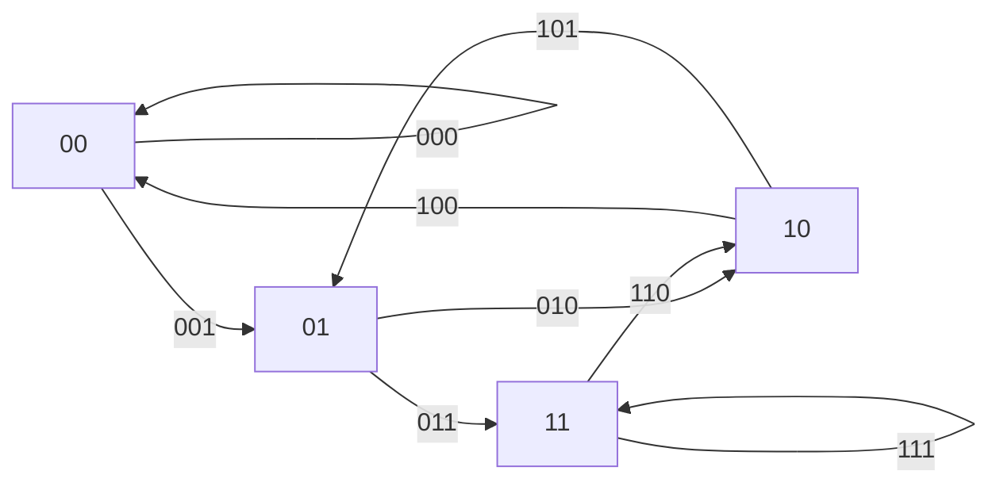

# De Bruijn sequences: an Euler circuit that packs every possible code into one shortest string

[Syllabus](../../../SYLLABUS.md) → [Combinatorics and graphs](../README.md) → [Tours - Euler and Hamilton](../README.md#s11) → De Bruijn sequences

---

## General Overview

A stockroom door carries a keypad: ten digits, no enter key. It opens the moment the last four digits pressed are the right four. Trying the codes one at a time means 10,000 codes at four presses each: 40,000 presses.

But presses overlap: type 0000, then 1, and the lock has seen 0000 and 0001 — two codes for five presses. At the limit every press after the first three finishes an untried code, and 10,003 presses reach that limit, opening the door whatever the code is.

The small case is checkable by eye. Two digits and codes of length 3 give eight codes, 24 digits in a plain list. Read the eight digits 00010111 as a ring instead — a circle with no start — three at a time, wrapping past the end: 000, 001, 010, 101, 011, 111, 110, 100. Each code once.

Such a string is a **de Bruijn sequence**, after Nicolaas de Bruijn, whose 1946 paper counted the binary ones. The construction never searches. It makes the codes the **arrows** of a graph, not its places, and walks every arrow once — an Euler circuit ([Euler circuits](01-euler-circuits.md)), as I. J. Good showed that year.

**Take the windows one digit shorter than a code as the places of a graph and the codes as arrows between them; every place then has as many arrows in as out, so one closed walk uses every arrow once, and the digits it adds spell a ring with one digit per code.**

**What kind of fact this is:** a theorem, proved on this card in Why it works — a ring that short always exists, and nothing shorter holds every code. The counting formula is stated, not proved.

### The picture: four windows, eight codes



Each place is a two-digit window, each arrow a three-digit code: leaving a place, drop its first digit, add the arrow's last. The loops are 000 and 111.

---

## The formula

Two letters, both plain counts. $n$ is how many digits are available, 2 for the ring and 10 for the lock; $k$ is how long a code is, 3 and 4. A **window** is a code with one digit trimmed off, so $k-1$ digits long. There are $n^k$ codes ([Strings with repetition](../01-Counting%20Principles/02-strings-and-powers.md)), and $n^{k-1}$ windows.

$$\text{length of the ring} = n^k$$

**Read it aloud:** one digit per code, because each digit finishes exactly one code.

Typed flat rather than bent round, the string repeats its first $k-1$ digits at the end, so presses come to $n^k$ plus $k-1$: 10, and 10,003 on the lock.

How many rings exist is a second formula, in which $n!$ is the factorial, 1 × 2 × … × n:

$$\text{how many rings} = \frac{(n!)^{\,n^{k-1}}}{n^k}$$

**Read it aloud:** a factorial per window, since its $n$ arrows can leave in $n!$ orders, multiplied over the $n^{k-1}$ windows, then divided by the length, since a ring starts anywhere. Most such orders split the arrows into several small circuits, not one, so this reads the formula rather than proving it.

| Symbol | Plain meaning | In our example | Push it up and the answer… |
| --- | --- | --- | --- |
| $n$ | how many digits are available | 2, and 10 | more arrows out of each window |
| $k$ | how long one code is | 3, and 4 | the ring grows $n$-fold per step |
| $n^k$ | how many codes, and the ring's length | 8, and 10,000 | — |
| $n^{k-1}$ | how many windows, so how many places | 4, and 1,000 | more places, $n$ arrows each |
| $n!$ | the factorial: orders $n$ arrows can be taken in | 2, from 1 × 2 | far more rings to choose from |

### When it holds

- **No code is banned.** Ban some and a window can end with more arrows in than out; then no circuit exists, and some arrows must be walked twice — the postman's question ([The Chinese postman](02-chinese-postman.md)).
- **The reading wraps round.** Stop after the lock's 10,000 digits and the 3 codes straddling the join never happen.
- **Whatever reads the string judges every window.** An enter key, or a pad clearing every four presses, kills the overlap: back to 40,000. Repeated digits must count as codes too, since the ring includes 000 and 111.

---

## Why it works

### Step 0: make the codes the arrows, not the places

The obvious graph makes the eight codes its places, joining 001 to 011 because they overlap in two digits, and asks for a cycle through every place — a Hamiltonian cycle ([Hamiltonian cycles](03-hamiltonian-cycles.md)), for which no fast method is known ([The travelling salesman](04-travelling-salesman-in-outline.md)).

Drop a level. The places become the four two-digit windows, the arrows the codes: 001 runs from 00 to 01. Now "every code once" means "every arrow once" — an Euler circuit, with a one-line test and a fast method ([Euler circuits](01-euler-circuits.md)). Same task, different graph, and the difficulty went with it.

### Step 1: every window has as many arrows in as out

Two arrows leave window 01, 010 and 011, one per digit appended; two arrive, 001 and 101, one per digit put in front. The count is $n$ both ways at every window. The checks tally both off the list of codes, not off the construction: in- and out-degree 2 to 2 everywhere.

Connected, too: pressing another window's digits reaches it within $k-1$ presses. Equal degrees plus connected is the condition for a closed walk using every arrow once ([Euler circuits](01-euler-circuits.md)), so one exists for every graph of this shape, with no search.

### Step 2: the walk spells the string

Write the starting window, then one digit per arrow taken: the digit its code ends with. Taking arrow 001 out of window 00 means the last three digits typed are 001, so that code is tested there and nowhere else.

From 00 the checks' circuit takes 000, 001, 010, 101, 011, 111, 110, 100. Those eight arrows add eight digits to the two-digit start: 0001011100, ten presses, the last two repeating the first two because the walk came home to 00. Cut them: the ring is 00010111.

### Step 3: nothing shorter can work

Every position of a circular string starts one code, so a ring holds at most as many codes as digits. Holding all $n^k$ codes needs at least $n^k$ digits, and the circuit uses exactly that many.

### Step 4: how many rings there are

Two, not one, at this size. Brute force over all 256 eight-digit strings finds 16 that hold every code: the eight rotations of each of two rings, 00010111 and 00011101, so 16 ÷ 8 = 2, which is what the formula gives. Both roads agree at two more sizes: 16 rings for binary codes of length 4, 24 for length 2 over three digits. That it holds at every size is the BEST theorem, named in the sources.

<details>
<summary>Detailed proof: the ring exists for every alphabet and every code length</summary>

Places: the $n^{k-1}$ windows; arrows: each code, from its first $k-1$ digits to its last $k-1$. For any $n$ and $k$, every window has $n$ arrows out and $n$ in, so the degrees match, and typing a window's digits reaches it from any other in $k-1$ steps, so the graph is connected. A connected directed graph with matching degrees has a closed walk using every arrow once ([Euler circuits](01-euler-circuits.md)). Steps 2 and 3 are written for any $n$ and $k$ already, so the ring exists and is shortest at every size.

</details>

A second route draws no graph: start with $k$ zeros and keep appending the largest digit that repeats no code, M. H. Martin's 1934 rule, which always reaches a full ring. Not every greedy rule does: the one in the checks strands at four codes.

---

## Worked numbers, by hand

Two digits, codes of length 3, by hand.

| Step | Arithmetic | Value |
| --- | --- | --- |
| codes to cover, and windows to be places | 2 × 2 × 2, and 2 × 2 | 8 and 4 |
| the circuit, arrow by arrow | 000, 001, 010, 101, 011, 111, 110, 100 | 8 arrows |
| typed: start window, a digit per arrow | 00 then 0, 1, 0, 1, 1, 1, 0, 0 | 0001011100, 10 presses |
| the ring | the first 8 digits | **00010111** |
| rings this size | (1 × 2) to the power 4, over 8 | **2** |

A two-button door watching its last three presses yields in 10 presses against 24; the ten-digit lock in 10,003 against 40,000, saving 29,997.

### What breaks if you drop a piece

| Mistake | Comes out at | What went wrong |
| --- | --- | --- |
| Writing each arrow's label, not the digit it adds | 24 digits | The plain list again; overlap is what shortens it |
| Typing the 8-digit ring flat, no wrap | 6 codes of 8, missing 100 and 110 | Two codes straddle the join |
| A greedy walk that never re-splices | stops at 4 codes: 000, 001, 010, 100 | Back at 00 with its arrows spent, four unwalked |

The code prints all three.

---

## Code, from first principles, and it actually runs

Nothing is imported, and no road borrows another's answer. The first walks an Euler circuit of the window graph, taking the smallest unused code each step and parking a window when it runs dry, so skipped arrows are spliced in on the way back. The second tests all 256 eight-digit strings, no graph at all. The third counts the rings by formula. The lock is built the same way.

### Python

```python
# De Bruijn sequences -- the check behind the card.  Nothing is imported.  Main case: n = 2 digits,
# codes of length k = 3.  Three roads: an Euler circuit, brute force over every string, the formula.
def codes(n, k):                                   # every k-digit code, in order
    out = [""]
    for _ in range(k): out = [s + str(d) for s in out for d in range(n)]
    return out
def leaving(n, k):                                 # window -> codes leaving it, smallest first
    out = {}
    for c in codes(n, k): out.setdefault(c[:-1], []).append(c)
    return out
def wrapped(s, k):                                 # the k-digit codes read round the cycle
    r = s + s[:k - 1]
    return [r[i:i + k] for i in range(len(s))]
def circuit(n, k):                                 # road 1: Hierholzer, smallest edge first
    out, stack, path = leaving(n, k), ["0" * (k - 1)], []
    while stack:
        v = stack[-1]
        if out.get(v): stack.append(out[v].pop(0)[1:])        # walk on, using up an edge
        else: path.append(stack.pop())                        # stuck: park this window
    path.reverse()                                            # windows in circuit order
    trail = [path[i] + path[i + 1][-1] for i in range(len(path) - 1)]
    return trail, path[0] + "".join(v[-1] for v in path[1:])
def brute(n, k):                                   # road 2: try every string of length n^k
    every = ("".join(str(m // n ** i % n) for i in range(n ** k)) for m in range(n ** (n ** k)))
    return [s for s in every if len(set(wrapped(s, k))) == n ** k]
def by_formula(n, k):                              # road 3: (n!)^(n^(k-1)) / n^k
    f = 1
    for i in range(2, n + 1): f *= i
    return f ** (n ** (k - 1)) // n ** k
def greedy(n, k):                                  # a walk that never goes back to re-splice
    out, v, walk = leaving(n, k), "0" * (k - 1), []
    while out.get(v): e = out[v].pop(0); walk.append(e); v = e[1:]
    return walk
def yn(c): return "yes" if c else "no"
trail, typed = circuit(2, 3); seq = typed[:8]; good = brute(2, 3); rounds = wrapped(seq, 3)
ins = [sum(c[1:] == v for c in codes(2, 3)) for v in codes(2, 2)]     # tallied off the edge list
outs = [sum(c[:-1] == v for c in codes(2, 3)) for v in codes(2, 2)]
cycles = sorted({min(s[i:] + s[:i] for i in range(8)) for s in good}); ncyc = len(good) // len(seq)
flat = [seq[i:i + 3] for i in range(6)]; miss = sorted(set(codes(2, 3)) - set(flat))
extra = [(n, k, len(brute(n, k)) // n ** k, by_formula(n, k)) for n, k in ((2, 4), (3, 2))]
walk, (_, pin_typed) = greedy(2, 3), circuit(10, 4); pin = pin_typed[:10 ** 4]
nv, ne, pins = len(codes(2, 2)), len(codes(2, 3)), set(wrapped(pin, 4)); L, ng = len(seq), len(good)
naive, npin = 3 * ne, len(pins)
print(f"n = 2, k = 3: {nv} windows as vertices, {ne} codes as edges, in- and out-degree {min(ins + outs)} to {max(ins + outs)}")
print(f"Euler circuit, edge by edge: {' '.join(trail)}")
print(f"start window plus a digit per edge: {typed}, {len(typed)} presses; cycle = first {len(seq)} digits: {seq}")
print(f"codes round the cycle = those edges in order: {yn(rounds == trail)}; all {len(set(rounds))} distinct, against {naive} digits listed one by one")
print(f"brute force over all {2 ** 8} strings of length {L}: {ng} work, {ng} / {L} rotations = {ncyc} cycles: {' '.join(cycles)}")
print(f"the count by formula (n!)^(n^(k-1)) / n^k: {by_formula(2, 3)}, agrees with brute force: {yn(by_formula(2, 3) == ncyc)}")
for n, k, b, f in extra: print(f"n = {n}, k = {k}: brute force {b} cycles, formula {f}, agree: {yn(b == f)}")
print(f"mistake, cycle typed with no wrap: {len(set(flat))} codes of {ne}, missing {' '.join(miss)}")
print(f"mistake, greedy walk with no re-splice: stops after {len(walk)} codes: {' '.join(walk)}")
print(f"keypad lock, n = 10, k = 4: {10 ** 3} windows as vertices, {10 ** 4} codes as edges")
print(f"its circuit: {len(pin_typed)} presses, cycle {len(pin)} digits starting {pin[:12]}, all {npin} PINs once: {yn(npin == 10 ** 4)}")
print(f"against {4 * 10 ** 4} presses for every PIN separately: {4 * 10 ** 4 - len(pin_typed)} saved")
assert seq == "00010111" and rounds == trail and len(set(rounds)) == 8
assert cycles == ["00010111", "00011101"] and len(good) == 16 and min(ins + outs) == max(ins + outs) == 2
assert by_formula(2, 3) == ncyc and all(b == f for _, _, b, f in extra)
assert len(pin_typed) == 10 ** 4 + 3 and npin == 10 ** 4 and len(walk) == 4 and len(set(flat)) == 6
print("ALL CHECKS PASS")
```

**Ran 2026-09-19 on macOS, Python 3.14.6, standard library only. All checks passed. Output, pasted from the run:**

```
n = 2, k = 3: 4 windows as vertices, 8 codes as edges, in- and out-degree 2 to 2
Euler circuit, edge by edge: 000 001 010 101 011 111 110 100
start window plus a digit per edge: 0001011100, 10 presses; cycle = first 8 digits: 00010111
codes round the cycle = those edges in order: yes; all 8 distinct, against 24 digits listed one by one
brute force over all 256 strings of length 8: 16 work, 16 / 8 rotations = 2 cycles: 00010111 00011101
the count by formula (n!)^(n^(k-1)) / n^k: 2, agrees with brute force: yes
n = 2, k = 4: brute force 16 cycles, formula 16, agree: yes
n = 3, k = 2: brute force 24 cycles, formula 24, agree: yes
mistake, cycle typed with no wrap: 6 codes of 8, missing 100 110
mistake, greedy walk with no re-splice: stops after 4 codes: 000 001 010 100
keypad lock, n = 10, k = 4: 1000 windows as vertices, 10000 codes as edges
its circuit: 10003 presses, cycle 10000 digits starting 000010002000, all 10000 PINs once: yes
against 40000 presses for every PIN separately: 29997 saved
ALL CHECKS PASS
```

### Rust

Same numbers, same labels, built with `rustc --edition 2021 -O`.

```rust
// De Bruijn sequences -- the same check as de_bruijn_sequences_check.py, in Rust.  No crates.  Main
// case: n = 2 digits, codes of length k = 3.  Three roads: an Euler circuit, brute force, the formula.
use std::collections::{BTreeMap, BTreeSet};
fn last(s: &str) -> &str { &s[s.len() - 1..] }
fn yn(c: bool) -> &'static str { if c { "yes" } else { "no" } }
fn codes(n: usize, k: usize) -> Vec<String> {                    // every k-digit code, in order
    (0..n.pow(k as u32)).map(|m| (0..k).rev()
        .map(|i| char::from_digit((m / n.pow(i as u32) % n) as u32, 10).unwrap()).collect()).collect() }
fn leaving(n: usize, k: usize) -> BTreeMap<String, Vec<String>> { // window -> codes leaving it
    let mut out: BTreeMap<String, Vec<String>> = BTreeMap::new();
    for c in codes(n, k) { out.entry(c[..k - 1].to_string()).or_default().push(c) }
    out }
fn wrapped(s: &str, k: usize) -> Vec<String> {                   // codes read round the cycle
    let r = format!("{}{}", s, &s[..k - 1]);
    (0..s.len()).map(|i| r[i..i + k].to_string()).collect() }
fn circuit(n: usize, k: usize) -> (Vec<String>, String) {        // road 1: Hierholzer, smallest first
    let (mut out, mut stack, mut path) = (leaving(n, k), vec!["0".repeat(k - 1)], Vec::new());
    while let Some(v) = stack.last().cloned() {
        if let Some(es) = out.get_mut(&v).filter(|es| !es.is_empty()) {
            let e = es.remove(0); stack.push(e[1..].to_string());                 // use up an edge
        } else { path.push(stack.pop().unwrap()) }                                // park this window
    }
    path.reverse();                                                              // circuit order
    let trail: Vec<String> = (0..path.len() - 1).map(|i| format!("{}{}", path[i], last(&path[i + 1]))).collect();
    (trail, format!("{}{}", path[0], path[1..].iter().map(|v| last(v)).collect::<String>())) }
fn brute(n: usize, k: usize) -> Vec<String> {                    // road 2: try every string
    let length = n.pow(k as u32);
    (0..n.pow(length as u32)).map(|m| (0..length)
        .map(|i| char::from_digit((m / n.pow(i as u32) % n) as u32, 10).unwrap()).collect::<String>())
        .filter(|s| wrapped(s, k).into_iter().collect::<BTreeSet<_>>().len() == length).collect() }
fn by_formula(n: u64, k: u32) -> u64 {                           // road 3: (n!)^(n^(k-1)) / n^k
    let f: u64 = (2..=n).product();
    f.pow(n.pow(k - 1) as u32) / n.pow(k) }
fn greedy(n: usize, k: usize) -> Vec<String> {                   // a walk that never re-splices
    let (mut out, mut v, mut walk) = (leaving(n, k), "0".repeat(k - 1), Vec::new());
    while let Some(es) = out.get_mut(&v).filter(|es| !es.is_empty()) {
        let e = es.remove(0); v = e[1..].to_string(); walk.push(e); }
    walk }
fn main() {
    let (trail, typed) = circuit(2, 3);
    let (seq, good) = (typed[..8].to_string(), brute(2, 3));
    let (v2, e3) = (codes(2, 2), codes(2, 3));
    let rounds = wrapped(&seq, 3);
    let degs: Vec<usize> = v2.iter().flat_map(|v| [e3.iter().filter(|c| &c[1..] == v.as_str()).count(),
        e3.iter().filter(|c| &c[..2] == v.as_str()).count()]).collect();          // tallied off the edge list
    let (lo, hi) = (*degs.iter().min().unwrap(), *degs.iter().max().unwrap());
    let cycles: Vec<String> = good.iter().map(|s| (0..8).map(|i| format!("{}{}", &s[i..], &s[..i])).min().unwrap())
        .collect::<BTreeSet<String>>().into_iter().collect();
    let ncyc = (good.len() / seq.len()) as u64;
    let flat: BTreeSet<String> = (0..6).map(|i| seq[i..i + 3].to_string()).collect();
    let miss: Vec<String> = e3.iter().filter(|c| !flat.contains(c.as_str())).cloned().collect();
    let extra: Vec<(usize, usize, u64, u64)> = vec![(2usize, 4usize), (3, 2)].into_iter()
        .map(|(n, k)| (n, k, (brute(n, k).len() / n.pow(k as u32)) as u64, by_formula(n as u64, k as u32))).collect();
    let (walk, (_, pin_typed)) = (greedy(2, 3), circuit(10, 4));
    let pin = pin_typed[..10000].to_string();
    let pins: BTreeSet<String> = wrapped(&pin, 4).into_iter().collect();
    let (naive, npin) = (3 * e3.len(), pins.len());
    println!("n = 2, k = 3: {} windows as vertices, {} codes as edges, in- and out-degree {} to {}", v2.len(), e3.len(), lo, hi);
    println!("Euler circuit, edge by edge: {}", trail.join(" "));
    println!("start window plus a digit per edge: {}, {} presses; cycle = first {} digits: {}", typed, typed.len(), seq.len(), seq);
    println!("codes round the cycle = those edges in order: {}; all {} distinct, against {} digits listed one by one",
             yn(rounds == trail), rounds.iter().collect::<BTreeSet<_>>().len(), naive);
    println!("brute force over all {} strings of length {}: {} work, {} / {} rotations = {} cycles: {}",
             2usize.pow(8), seq.len(), good.len(), good.len(), seq.len(), ncyc, cycles.join(" "));
    println!("the count by formula (n!)^(n^(k-1)) / n^k: {}, agrees with brute force: {}", by_formula(2, 3), yn(by_formula(2, 3) == ncyc));
    for (n, k, b, f) in &extra { println!("n = {}, k = {}: brute force {} cycles, formula {}, agree: {}", n, k, b, f, yn(b == f)) }
    println!("mistake, cycle typed with no wrap: {} codes of {}, missing {}", flat.len(), e3.len(), miss.join(" "));
    println!("mistake, greedy walk with no re-splice: stops after {} codes: {}", walk.len(), walk.join(" "));
    println!("keypad lock, n = 10, k = 4: {} windows as vertices, {} codes as edges", 10usize.pow(3), 10usize.pow(4));
    println!("its circuit: {} presses, cycle {} digits starting {}, all {} PINs once: {}",
             pin_typed.len(), pin.len(), &pin[..12], npin, yn(npin == 10000));
    println!("against {} presses for every PIN separately: {} saved", 4 * 10000, 4 * 10000 - pin_typed.len());
    assert!(seq == "00010111" && rounds == trail && rounds.iter().collect::<BTreeSet<_>>().len() == 8);
    assert!(cycles == vec!["00010111", "00011101"] && good.len() == 16 && lo == 2 && hi == 2);
    assert!(by_formula(2, 3) == ncyc && extra.iter().all(|&(_, _, b, f)| b == f));
    assert!(pin_typed.len() == 10003 && npin == 10000 && walk.len() == 4 && flat.len() == 6);
    println!("ALL CHECKS PASS");
}
```

**Ran 2026-09-19 on macOS, rustc 1.98.1, no crates. All checks passed. Output, pasted from the run:**

```
n = 2, k = 3: 4 windows as vertices, 8 codes as edges, in- and out-degree 2 to 2
Euler circuit, edge by edge: 000 001 010 101 011 111 110 100
start window plus a digit per edge: 0001011100, 10 presses; cycle = first 8 digits: 00010111
codes round the cycle = those edges in order: yes; all 8 distinct, against 24 digits listed one by one
brute force over all 256 strings of length 8: 16 work, 16 / 8 rotations = 2 cycles: 00010111 00011101
the count by formula (n!)^(n^(k-1)) / n^k: 2, agrees with brute force: yes
n = 2, k = 4: brute force 16 cycles, formula 16, agree: yes
n = 3, k = 2: brute force 24 cycles, formula 24, agree: yes
mistake, cycle typed with no wrap: 6 codes of 8, missing 100 110
mistake, greedy walk with no re-splice: stops after 4 codes: 000 001 010 100
keypad lock, n = 10, k = 4: 1000 windows as vertices, 10000 codes as edges
its circuit: 10003 presses, cycle 10000 digits starting 000010002000, all 10000 PINs once: yes
against 40000 presses for every PIN separately: 29997 saved
ALL CHECKS PASS
```

The two outputs match line for line.

> [!TIP]
> **Try changing**
> Guess first, then run it. The asserts are pinned to the binary ring, so expect one to stop the program.
> - **Take the largest code first.** In `circuit`, pop the last unused code, not the first: another valid ring, and the first assert stops the run.
> - **Lose the splice.** Delete `path.reverse()`: the codes read off no longer match the arrows walked.
> - **Break the count.** In `by_formula`, raise the factorial to the power of the codes, not of the windows: brute force is unmoved and the two disagree.

---

## The usual mistake

> [!warning]
> **Reading the ring's length as the number of presses.** The ring is a circle; a keypad is a line. Stop after the lock's 10,000 digits and the codes straddling the join go untried: the first 3 must be typed again, 10,003 in all. Flat and unwrapped, the eight-digit ring gives 6 codes of 8, missing 100 and 110.
>
> - **Assuming each code needs presses of its own.** The 40,000-press answer, wasting 29,997 of them.
> - **Drawing the codes as places.** A cycle through every place is a hard problem; a walk along every arrow is an easy one.
> - **Trusting any greedy walk.** Smallest unused code, never re-splicing, stops at 4 of the 8 codes.
> - **Expecting one ring.** There are 2 at this size, 16 for length 4, 24 for length 2 over three digits.

---

## Where you meet it in real life

- **Keypads and remote fobs.** A pad with no enter key can be walked in one press per code. Hence the enter key, the delay after a wrong try, the counter: each breaks the overlap.
- **Assembling DNA.** A sequencing machine returns short reads. Assemblers cut each into windows, draw this graph, and hunt a walk using every observed arrow: the construction run backwards, rebuilding one string.

> **Say it back**
> Neighbouring codes share all but one digit, so every code of a fixed length packs into one circular string as long as the number of codes. Make the graph's places the windows one digit shorter than a code, its arrows the codes. Every window then has as many arrows in as out and the graph is connected, so one closed walk uses every arrow once. Write the starting window, then a digit per arrow: for two digits and length 3, 00010111.

---

## What this builds on

- [Euler circuits](01-euler-circuits.md): the test for a closed walk using every arrow once, and the splicing method that finds one.
- [Directed graphs](../09-Graphs%20-%20Dots%20and%20Lines/06-directed-graphs-and-topological-order.md): arrows with a direction, counted in and out of a place.
- [Strings with repetition](../01-Counting%20Principles/02-strings-and-powers.md): why $n$ digits in $k$ slots give $n^k$ codes.

## Where this goes next

- Hamming and Reed-Solomon: shift registers and codes built from the same finite-field arithmetic.
- **Shift registers.** A few bits of memory and a feedback rule emit one of these rings a digit at a time, storing no table.
- **Counting the walks.** The BEST theorem counts the circuits by turning them into spanning trees.

This card builds one ring and checks the count at three sizes; the counting theorem settles it at every size.

---

## Sources

Verified 19 Sep 2026: every link below resolves to the publisher's page.

- de Bruijn, N. G. "A combinatorial problem." *Proceedings of the Koninklijke Nederlandse Akademie van Wetenschappen* 49, no. 7 (1946): 758–764. [Repository record and full text](https://research.tue.nl/en/publications/a-combinatorial-problem/). Counts the binary rings; the paper they are named for.
- Good, I. J. "Normal Recurring Decimals." *Journal of the London Mathematical Society* s1-21, no. 3 (1946): 167–169. [doi:10.1112/jlms/s1-21.3.167](https://doi.org/10.1112/jlms/s1-21.3.167). The graph construction used here.
- van Aardenne-Ehrenfest, T., and N. G. de Bruijn. "Circuits and trees in oriented linear graphs." Reprinted in *Classic Papers in Combinatorics*, 149–163. Birkhäuser, 1987. [Repository record](https://research.tue.nl/en/publications/circuits-and-trees-in-oriented-linear-graphs/). The BEST theorem, which counts the circuits.
- Knuth, Donald E. *The Art of Computer Programming, Volume 4A: Combinatorial Algorithms, Part 1*. Addison-Wesley, 2011. [Publisher page](https://www.informit.com/store/art-of-computer-programming-volume-4a-combinatorial-algorithms-9780201038040). Section 7.2.1.1 gathers the constructions and the greedy rule.
