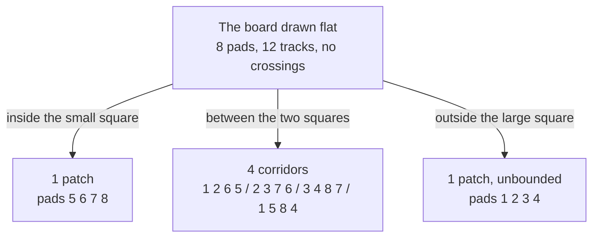
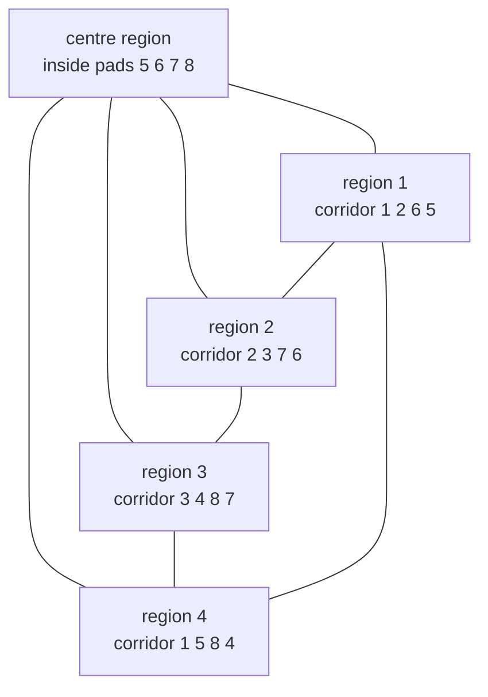

# Planar graphs: drawn flat with no crossings, and vertices minus edges plus faces is always 2

Combinatorics and graphs → Planarity and Colouring → Counting faces → Planar graphs

---

## General Overview

A single-layer circuit board carries 8 solder pads and 12 copper tracks; no track may cross another. Pads 1 to 4 sit at the corners of a large square, pads 5 to 8 at the corners of a small square inside it. Eight tracks run round the two squares; four spokes join each inner pad to the outer pad facing it.

Now count the bare board the copper leaves: the patch inside the small square, four corridors between the squares, everything outside the large square. Six patches, and 8 − 12 + 6 = 2.

Nothing about circuit boards produced the 2. Redraw the same 8 pads and 12 tracks anywhere without crossings: the patch count is 6 again. Leonhard Euler wrote the count down in 1750 for a solid's corners, edges and faces — a cube's are 8, 12 and 6, this board's numbers — and published it in 1758. Two of the three counts fix the third.

**A network drawn flat in one piece with no crossings always has two more dots and regions together than lines, once the region outside the drawing counts.**

**What kind of fact this is:** a theorem, proved on this card in Why it works; the crossing-free drawing and the face it cuts out are definitions it needs first.

### The picture: eight pads, six patches



The third arrow is the one people leave out.

---

## The formula

Three counts, in words first. $V$ is how many dots the drawing has — pads here — and $E$ how many lines join them: tracks. $F$ is new on this card: the number of **faces**, the patches the drawing cuts the sheet into, the one outside everything included. A drawing whose lines meet only at dots is a **plane drawing**; a network that can be drawn that way is **planar**.

$$V - E + F = 2$$

**Read it aloud:** dots, minus lines, plus regions including the outside, is two for any crossing-free drawing in one piece.

| Symbol | Plain meaning | In our example | Push it up and the answer… |
| --- | --- | --- | --- |
| $V$ | dots: pads | 8 | add one on a track and $E$ rises too, so the total holds |
| $E$ | lines: tracks | 12 | a track inside a patch splits it, so $F$ rises |
| $F$ | faces: patches of bare board, the outside counted | 6 | pinned by the other two |
| $c$ | pieces of the drawing | 1 | each piece adds 1, giving $1 + c$ |

Rearranged, it gives the face count:

$$F = E - V + 2$$

Here 12 − 8 + 2 = 6: the patch count, without the picture.

### When it holds

- **Finitely many dots and lines.** An endless grid has nothing to add up.
- **Already drawn with no crossings.** The claim is about a drawing, not a network. Each crossing adds a patch without adding a pad, so the total overshoots: 2 plus one per crossing. Redraw to fix it.
- **In one piece.** Two boards side by side share one outside patch and come to 3; $c$ pieces give $1 + c$.
- **The outside patch counted.** Drop it and the board reads 1.

---

## Why it works

### Step 0: a track on a cycle has a different patch on each side

A **cycle** is a closed run of tracks back to its start, no pad repeated ([walks-paths-and-cycles](../09-Graphs%20-%20Dots%20and%20Lines/03-walks-paths-and-cycles.md)). Drawn without crossings it is a closed curve, with an inside and an outside and no way between them except across it — the Jordan curve theorem, taken as given here. So a track on a cycle has one patch on its left and a different one on its right.

### Step 1: a drawing with no cycle is a tree, and cuts nothing out

Connected with no cycle is the definition of a tree, and a tree has one fewer line than dots ([trees](../10-Trees%20and%20Cheapest%20Routes/01-trees.md)). Drawn flat it encloses nothing, so $F = 1$ and

$$V - E + F = V - (V - 1) + 1 = 2.$$

Every tree, at once.

### Step 2: one rub-out loses a track and a patch together

Rub out a track lying on a cycle. The pads are untouched, so $V$ holds. One track is gone, so $E$ falls by 1. By Step 0 the two faces along it were different, so they merge and $F$ falls by 1. The falls cancel, $V - E + F$ does not move, and the rest of the cycle keeps the drawing in one piece.

### Step 3: keep rubbing out until the tree shows

Each rub-out costs a track, so the rubbing stops, and it stops with no cycle left — a tree, where Step 1 gives 2. No rub-out moved the total, so the drawing at the start was 2: induction on the number of tracks, run downward ([proof-by-induction](../../01-Foundations/06-Proof/04-proof-by-induction.md)). The board takes five rub-outs; the patch count falls 6, 5, 4, 3, 2, 1 and the total holds at 2. The code prints the ladder.

<details>
<summary>What the proof takes on trust</summary>

Nothing above is special to the board: the four steps run on any finite plane drawing in one piece. Two claims are assumed rather than proved — the Jordan curve theorem of Step 0, and that a plane tree cuts out nothing. The rest is the induction on tracks.

</details>

### Step 4: the same drawing read as a map, and its dual

Read the copper as borders: the large square a coastline, the rest internal frontiers. Five regions — inside the small square, and the four corridors — with the sea as the sixth face.

Put a dot inside each face, six in all, and join two whenever their faces share a border; each of the 12 borders gives one join. The result is again a plane drawing: the **dual**.

Its counts are the board's, shuffled: 6 dots for its faces, 12 lines for its lines, 8 faces for its dots. So 6 − 12 + 8 = 2, and a second dual brings the board back. This dual is the octahedron's skeleton, the cube's partner among the solids ([polyhedra-and-eulers-formula](../../05-Geometry%20and%20trig/02-Circles%20and%20Solids/06-polyhedra-and-eulers-formula.md)).

Drop the sea's dot and the four joins reaching it: five dots, eight joins, five faces, 5 − 8 + 5 = 2 — the region graph colouring works on ([vertex-colouring-and-chromatic-number](03-vertex-colouring-and-chromatic-number.md)).

### The picture: five regions, eight shared borders



The centre region touches all four corridors, which close into a ring: degrees 3, 3, 3, 3 and 4. Cauchy's route to the same count runs the other way, peeling triangles off a drawing whose every patch is a triangle.

---

## Worked numbers, by hand

| Step | Arithmetic | Value |
| --- | --- | --- |
| pads, tracks, patches by eye | 4 + 4, 4 + 4 + 4, 1 + 4 + 1 | 8, 12, 6 |
| the count | 8 − 12 + 6 | **2** |
| patches, from the formula | 12 − 8 + 2 | **6** |
| the tree after five rub-outs | 8 pads, 7 tracks, 1 patch | 8 − 7 + 1 = **2** |
| the dual | 6 dots, 12 lines, 8 faces | 6 − 12 + 8 = **2** |
| the five regions alone | 5 dots, 8 lines, 5 faces | 5 − 8 + 5 = **2** |

Four drawings — board, tree, dual, region map — and the same count from each.

### What breaks if you drop a piece

| Mistake | Comes out at | What went wrong |
| --- | --- | --- |
| The outside patch left out | 1 | That patch is what makes the total 2 |
| The corridors read as one ring | −1 | The spokes cut it into four |
| Two boards as one drawing | 3 | Two pieces give $1 + c$ |

The code prints all three.

---

## Code, from first principles, and it actually runs

Nothing is imported. The drawing arrives the only way it can without a picture: for each pad, the cyclic order in which its tracks leave it. Walking that order traces one face at a time, so the patch count is read off the drawing, not assumed; each track is walked from both sides, 24 sides for 12 tracks. Road one counts the traced faces, road two predicts the number from $E - V + 2$, and the proof runs as a program. The dual gives the second case: the map's five-region graph.

### Python

```python
# Planar graphs and Euler's formula -- the check behind the card.  Nothing is imported.
# The board is a cube drawn flat: outer pads 1 2 3 4, inner pads 5 6 7 8, four spokes.
# Every face is traced from the drawing itself -- the cyclic order of tracks round each
# pad -- and only then met with E - V + 2.  Then the same count on the map's dual graph.
BOARD = {1: [2, 5, 4], 2: [3, 6, 1], 3: [4, 7, 2], 4: [3, 1, 8],
         5: [6, 8, 1], 6: [7, 5, 2], 7: [3, 8, 6], 8: [7, 4, 5]}
WHEEL = {0: [2, 3, 4, 1], 1: [2, 0, 4], 2: [3, 0, 1], 3: [4, 0, 2], 4: [0, 3, 1]}
SEA = {1, 2, 3, 4}                      # which face is unbounded is part of the drawing

def trace(rot):                         # one walk round a face is one face
    out, used = [], set()
    for start in sorted((u, v) for u in rot for v in rot[u]):
        if start in used: continue
        (u, v), face = start, []
        while (u, v) != start or not face:
            used.add((u, v)); face.append(u); u, v = v, rot[v][rot[v].index(u) - 1]
        out.append(face)
    return sorted(out)

def size(rot): return len(rot), sum(len(rot[u]) for u in rot) // 2
def parts(rot):                         # separate pieces: pass the smallest pad name along
    home = {u: u for u in rot}
    for _ in rot: home = {u: min([home[u]] + [home[v] for v in rot[u]]) for u in rot}
    return len(set(home.values()))
def cut(rot, u, v): return {a: [b for b in rot[a] if {a, b} != {u, v}] for a in rot}

V, E = size(BOARD); faces = trace(BOARD)
print(f"the board drawn flat: pads V = {V}, tracks E = {E}, pieces = {parts(BOARD)}")
print(f"road 1, faces traced from the drawing: F = {len(faces)}, sides walked {sum(len(f) for f in faces)} = 2 x {E}\n  {faces}")
print(f"road 2, faces from E - V + 2: F = {E - V + 2}; the roads agree: {'yes' if len(faces) == E - V + 2 else 'no'}")
print(f"V - E + F = {V} - {E} + {len(faces)} = {V - E + len(faces)}")
rot, peeled, fs, chis = BOARD, [], [], []
while True:
    spare = [(u, v) for u in sorted(rot) for v in sorted(rot[u]) if u < v and parts(cut(rot, u, v)) == 1]
    if not spare: break
    (a, b), rot = spare[0], cut(rot, *spare[0])
    peeled.append(f"{a}-{b}"); pv, pe = size(rot); fs.append(len(trace(rot))); chis.append(pv - pe + fs[-1])
tv, te = size(rot)
print(f"peel one cycle track at a time, {len(peeled)} of them: {', '.join(peeled)}")
print(f"  F after each peel: {fs};  V - E + F after each: {chis}")
print(f"what is left is a tree: V = {tv}, E = {te}, F = {len(trace(rot))}, and E = V - 1: {'yes' if te == tv - 1 else 'no'}")
sides = [(tuple(sorted((f[j], f[(j + 1) % len(f)]))), i) for i, f in enumerate(faces) for j in range(len(f))]
border = {e: [i for e2, i in sides if e2 == e] for e, _ in sides}; sea = [i for i, f in enumerate(faces) if set(f) == SEA][0]
reg_e = sum(1 for b in border.values() if sea not in b)
reg_deg = sorted(sum(1 for b in border.values() if i in b and sea not in b) for i in range(len(faces)) if i != sea)
wv, we = size(WHEEL); wf = trace(WHEEL); wheel_deg = sorted(len(WHEEL[u]) for u in WHEEL)
print(f"the dual, one vertex per face: V = {len(faces)}, E = {len(border)}, F from E - V + 2 = {len(border) - len(faces) + 2}, the board's pad count {V}")
print(f"drop the sea vertex: {len(faces) - 1} regions, E = {reg_e}, degrees {reg_deg}")
print(f"the 5-region map graph on its own: V = {wv}, E = {we}, F = {len(wf)}, V - E + F = {wv - we + len(wf)}, degrees {wheel_deg}\n  {wf}")
TWO = dict(BOARD); TWO.update({u + 8: [w + 8 for w in BOARD[u]] for u in BOARD})
two_f = len(trace(TWO)) - 1             # side by side, the two outer faces are one region
for k, (lab, bad) in enumerate((("the outside face forgotten", len(faces) - 1), ("the four corridors read as one ring", 3))):
    print(f"mistake {k + 1}, {lab}: {V} - {E} + {bad} = {V - E + bad}, not 2")
print(f"mistake 3, two boards as one drawing: {2 * V} - {2 * E} + {two_f} = {2 * V - 2 * E + two_f}, and 1 + pieces = {1 + parts(TWO)}")
assert len(faces) == E - V + 2 and sum(len(f) for f in faces) == 2 * E
assert all(c == 2 for c in chis) and fs == [5, 4, 3, 2, 1] and te == tv - 1
assert len(border) == E and len(faces) - 1 == wv and reg_e == we and reg_deg == wheel_deg
assert len(wf) == we - wv + 2 and 2 * V - 2 * E + two_f == 1 + parts(TWO)
print("ALL CHECKS PASS")
```

**Ran 2026-09-19 on macOS, Python 3.14.6, standard library only. All checks passed. Output, pasted from the run:**

```
the board drawn flat: pads V = 8, tracks E = 12, pieces = 1
road 1, faces traced from the drawing: F = 6, sides walked 24 = 2 x 12
  [[1, 2, 6, 5], [1, 4, 3, 2], [1, 5, 8, 4], [2, 3, 7, 6], [3, 4, 8, 7], [5, 6, 7, 8]]
road 2, faces from E - V + 2: F = 6; the roads agree: yes
V - E + F = 8 - 12 + 6 = 2
peel one cycle track at a time, 5 of them: 1-2, 1-4, 2-3, 3-4, 5-6
  F after each peel: [5, 4, 3, 2, 1];  V - E + F after each: [2, 2, 2, 2, 2]
what is left is a tree: V = 8, E = 7, F = 1, and E = V - 1: yes
the dual, one vertex per face: V = 6, E = 12, F from E - V + 2 = 8, the board's pad count 8
drop the sea vertex: 5 regions, E = 8, degrees [3, 3, 3, 3, 4]
the 5-region map graph on its own: V = 5, E = 8, F = 5, V - E + F = 2, degrees [3, 3, 3, 3, 4]
  [[0, 1, 2], [0, 2, 3], [0, 3, 4], [0, 4, 1], [1, 4, 3, 2]]
mistake 1, the outside face forgotten: 8 - 12 + 5 = 1, not 2
mistake 2, the four corridors read as one ring: 8 - 12 + 3 = -1, not 2
mistake 3, two boards as one drawing: 16 - 24 + 11 = 3, and 1 + pieces = 3
ALL CHECKS PASS
```

### Rust

Same numbers, same labels, built with `rustc --edition 2021 -O`.

```rust
// Planar graphs and Euler's formula -- the same check as the Python, in Rust.  No crates.  The
// board is a cube drawn flat: outer pads 1 2 3 4, inner pads 5 6 7 8, four spokes.  Every face is
// traced from the drawing itself -- the cyclic order of tracks round each pad -- and only then met
// with E - V + 2.  Then the same count on the map's dual graph.
use std::collections::{BTreeMap, BTreeSet};
type Rot = BTreeMap<i64, Vec<i64>>;

fn trace(rot: &Rot) -> Vec<Vec<i64>> {          // one walk round a face is one face
    let mut darts: Vec<(i64, i64)> = rot.iter().flat_map(|(u, ns)| ns.iter().map(move |v| (*u, *v))).collect();
    darts.sort();
    let (mut out, mut used): (Vec<Vec<i64>>, BTreeSet<(i64, i64)>) = (Vec::new(), BTreeSet::new());
    for start in &darts {
        if used.contains(start) { continue }
        let ((mut u, mut v), mut face) = (*start, Vec::new());
        while (u, v) != *start || face.is_empty() {
            used.insert((u, v)); face.push(u);
            let (ring, i) = (&rot[&v], rot[&v].iter().position(|&w| w == u).unwrap());
            (u, v) = (v, ring[if i == 0 { ring.len() - 1 } else { i - 1 }]);
        }
        out.push(face);
    }
    out.sort(); out
}

fn size(rot: &Rot) -> (i64, i64) { (rot.len() as i64, rot.values().map(|n| n.len() as i64).sum::<i64>() / 2) }
fn cut(rot: &Rot, u: i64, v: i64) -> Rot { rot.iter().map(|(a, ns)| (*a, ns.iter().copied().filter(|b| !(*a == u && *b == v) && !(*a == v && *b == u)).collect())).collect() }

fn parts(rot: &Rot) -> i64 {                    // separate pieces: pass the smallest pad name along
    let mut home: BTreeMap<i64, i64> = rot.keys().map(|&u| (u, u)).collect();
    for _ in 0..rot.len() { home = rot.iter().map(|(u, ns)| (*u, ns.iter().map(|w| home[w]).chain([home[u]]).min().unwrap())).collect(); }
    home.values().copied().collect::<BTreeSet<i64>>().len() as i64
}

fn spare(rot: &Rot) -> Option<(i64, i64)> {     // the first track whose removal still leaves one piece
    let mut all: Vec<(i64, i64)> = rot.iter().flat_map(|(u, ns)| ns.iter().map(move |v| (*u, *v))).filter(|(u, v)| u < v).collect();
    all.sort();
    all.into_iter().find(|&(u, v)| parts(&cut(rot, u, v)) == 1)
}

fn main() {
    let board: Rot = [(1, vec![2, 5, 4]), (2, vec![3, 6, 1]), (3, vec![4, 7, 2]), (4, vec![3, 1, 8]),
                      (5, vec![6, 8, 1]), (6, vec![7, 5, 2]), (7, vec![3, 8, 6]), (8, vec![7, 4, 5])].into_iter().collect();
    let wheel: Rot = [(0, vec![2, 3, 4, 1]), (1, vec![2, 0, 4]), (2, vec![3, 0, 1]), (3, vec![4, 0, 2]), (4, vec![0, 3, 1])].into_iter().collect();
    let sea_pads: BTreeSet<i64> = [1, 2, 3, 4].into_iter().collect();   // which face is unbounded is part of the drawing
    let (v, e) = size(&board); let faces = trace(&board); let nf = faces.len() as i64;
    println!("the board drawn flat: pads V = {}, tracks E = {}, pieces = {}", v, e, parts(&board));
    println!("road 1, faces traced from the drawing: F = {}, sides walked {} = 2 x {}\n  {:?}", nf, faces.iter().map(|f| f.len() as i64).sum::<i64>(), e, faces);
    println!("road 2, faces from E - V + 2: F = {}; the roads agree: {}", e - v + 2, if nf == e - v + 2 { "yes" } else { "no" });
    println!("V - E + F = {} - {} + {} = {}", v, e, nf, v - e + nf);
    let (mut rot, mut peeled, mut fs, mut chis): (Rot, Vec<String>, Vec<i64>, Vec<i64>) = (board.clone(), Vec::new(), Vec::new(), Vec::new());
    while let Some((a, b)) = spare(&rot) {
        rot = cut(&rot, a, b); peeled.push(format!("{}-{}", a, b));
        let (pv, pe) = size(&rot); fs.push(trace(&rot).len() as i64); chis.push(pv - pe + fs[fs.len() - 1]);
    }
    let (tv, te) = size(&rot);
    println!("peel one cycle track at a time, {} of them: {}", peeled.len(), peeled.join(", "));
    println!("  F after each peel: {:?};  V - E + F after each: {:?}", fs, chis);
    println!("what is left is a tree: V = {}, E = {}, F = {}, and E = V - 1: {}", tv, te, trace(&rot).len(), if te == tv - 1 { "yes" } else { "no" });
    let mut border: BTreeMap<(i64, i64), Vec<usize>> = BTreeMap::new();
    for (i, f) in faces.iter().enumerate() { for j in 0..f.len() { let (p, q) = (f[j], f[(j + 1) % f.len()]); border.entry((p.min(q), p.max(q))).or_default().push(i); } }
    let sea = faces.iter().position(|f| f.iter().copied().collect::<BTreeSet<i64>>() == sea_pads).unwrap();
    let reg_e = border.values().filter(|b| !b.contains(&sea)).count() as i64;
    let mut reg_deg: Vec<i64> = (0..faces.len()).filter(|i| *i != sea).map(|i| border.values().filter(|b| b.contains(&i) && !b.contains(&sea)).count() as i64).collect();
    reg_deg.sort();
    let (wv, we) = size(&wheel); let wf = trace(&wheel);
    let mut wheel_deg: Vec<i64> = wheel.values().map(|n| n.len() as i64).collect(); wheel_deg.sort();
    println!("the dual, one vertex per face: V = {}, E = {}, F from E - V + 2 = {}, the board's pad count {}", nf, border.len(), border.len() as i64 - nf + 2, v);
    println!("drop the sea vertex: {} regions, E = {}, degrees {:?}", nf - 1, reg_e, reg_deg);
    println!("the 5-region map graph on its own: V = {}, E = {}, F = {}, V - E + F = {}, degrees {:?}\n  {:?}", wv, we, wf.len(), wv - we + wf.len() as i64, wheel_deg, wf);
    let two: Rot = board.iter().flat_map(|(u, ns)| [(*u, ns.clone()), (u + 8, ns.iter().map(|w| w + 8).collect())]).collect();
    let two_f = trace(&two).len() as i64 - 1;   // side by side, the two outer faces are one region
    let bad = [("the outside face forgotten", nf - 1), ("the four corridors read as one ring", 3)];
    for (k, (lab, f)) in bad.iter().enumerate() { println!("mistake {}, {}: {} - {} + {} = {}, not 2", k + 1, lab, v, e, f, v - e + f); }
    println!("mistake 3, two boards as one drawing: {} - {} + {} = {}, and 1 + pieces = {}", 2 * v, 2 * e, two_f, 2 * v - 2 * e + two_f, 1 + parts(&two));
    assert!(nf == e - v + 2 && faces.iter().map(|f| f.len() as i64).sum::<i64>() == 2 * e);
    assert!(chis.iter().all(|c| *c == 2) && fs == vec![5, 4, 3, 2, 1] && te == tv - 1);
    assert!(border.len() as i64 == e && nf - 1 == wv && reg_e == we && reg_deg == wheel_deg);
    assert!(wf.len() as i64 == we - wv + 2 && 2 * v - 2 * e + two_f == 1 + parts(&two));
    println!("ALL CHECKS PASS");
}
```

**Ran 2026-09-19 on macOS, rustc 1.98.1, no crates. All checks passed. Output, pasted from the run:**

```
the board drawn flat: pads V = 8, tracks E = 12, pieces = 1
road 1, faces traced from the drawing: F = 6, sides walked 24 = 2 x 12
  [[1, 2, 6, 5], [1, 4, 3, 2], [1, 5, 8, 4], [2, 3, 7, 6], [3, 4, 8, 7], [5, 6, 7, 8]]
road 2, faces from E - V + 2: F = 6; the roads agree: yes
V - E + F = 8 - 12 + 6 = 2
peel one cycle track at a time, 5 of them: 1-2, 1-4, 2-3, 3-4, 5-6
  F after each peel: [5, 4, 3, 2, 1];  V - E + F after each: [2, 2, 2, 2, 2]
what is left is a tree: V = 8, E = 7, F = 1, and E = V - 1: yes
the dual, one vertex per face: V = 6, E = 12, F from E - V + 2 = 8, the board's pad count 8
drop the sea vertex: 5 regions, E = 8, degrees [3, 3, 3, 3, 4]
the 5-region map graph on its own: V = 5, E = 8, F = 5, V - E + F = 2, degrees [3, 3, 3, 3, 4]
  [[0, 1, 2], [0, 2, 3], [0, 3, 4], [0, 4, 1], [1, 4, 3, 2]]
mistake 1, the outside face forgotten: 8 - 12 + 5 = 1, not 2
mistake 2, the four corridors read as one ring: 8 - 12 + 3 = -1, not 2
mistake 3, two boards as one drawing: 16 - 24 + 11 = 3, and 1 + pieces = 3
ALL CHECKS PASS
```

The two outputs match line for line.

> [!TIP]
> **Try changing**
> Guess first, then run it. The asserts are pinned to this board, so expect one to stop the run.
> - **Turn one pad's tracks round.** Write pad 5 as `[6, 1, 8]`: no crossing-free drawing has that order, the tracer wanders, and 4 faces give 8 − 12 + 4 = 0.
> - **Rub out one spoke.** Write pad 1 as `[2, 4]` and pad 5 as `[6, 8]`: 8 pads, 11 tracks, 5 patches, and 8 − 11 + 5 is still 2. The peel ladder, pinned to 12 tracks, is not.
> - **Take all four spokes out.** The drawing falls into two rings; the tracer walks each alone and reports 4 faces, while the sheet has 3.

---

## The usual mistake

> [!warning]
> **Counting only the regions inside the drawing.** The sheet outside the layout is a face like any other, and the one that makes the total 2 rather than 1. The board's inside patches number 5, and 8 − 12 + 5 = 1.
>
> - **Mixing "planar" with "plane".** Planar says a crossing-free drawing exists; plane says the drawing in hand is one. A crossing layout is a bad drawing, not a counterexample.
> - **Reading a ring of patches as one patch.** The corridors run all the way round, but the spokes wall them apart: count one and the total reads −1.
> - **Using it on a drawing in two pieces.** Two boards side by side come to 16 − 24 + 11 = 3.
> - **Expecting 2 on any surface.** The 2 belongs to the flat sheet and the sphere; on a doughnut the count is 0 (euler-characteristic-and-triangulations).

---

## Where you meet it in real life

- **Single-layer board layout.** A one-layer board is a plane drawing. A wiring list that cannot be drawn flat needs a second layer, and the case for "cannot" starts here ([edge-bound-and-kuratowski](02-edge-bound-and-kuratowski.md)).
- **Map colouring.** Turning a map into its region graph, as Step 4 does, starts every colouring result ([vertex-colouring-and-chromatic-number](03-vertex-colouring-and-chromatic-number.md), [five-and-four-colour-theorems](05-five-and-four-colour-theorems.md)).
- **Meshes.** Graphics software checks a surface mesh by this count; any other number means a hole or a tear.
- **Solids.** Flatten a convex solid's skeleton from a point above one face: a plane drawing, so this is the polyhedron count ([polyhedra-and-eulers-formula](../../05-Geometry%20and%20trig/02-Circles%20and%20Solids/06-polyhedra-and-eulers-formula.md)).

> **Say it back**
> A plane drawing is a network drawn so lines meet only at dots; it cuts the sheet into faces, the outside one counted. For such a drawing in one piece, dots minus lines plus faces is 2. The proof rubs out one line of a cycle at a time: each rub-out loses a line and merges two faces, leaving the total alone, down to a tree with one face. The board's 8, 12 and 6 give 2; so do its dual's 6, 12 and 8.

---

## What this builds on

- [trees](../10-Trees%20and%20Cheapest%20Routes/01-trees.md): one fewer line than dots, the base case and where the rubbing out ends.
- [walks-paths-and-cycles](../09-Graphs%20-%20Dots%20and%20Lines/03-walks-paths-and-cycles.md): the cycle, drawn as the closed curve with a different face on each side.
- [proof-by-induction](../../01-Foundations/06-Proof/04-proof-by-induction.md): why settling the tree and one rub-out settles every drawing.

## Where this goes next

- [edge-bound-and-kuratowski](02-edge-bound-and-kuratowski.md): the count as a ceiling on a flat drawing's lines, and the two networks that break it.
- [polyhedra-and-eulers-formula](../../05-Geometry%20and%20trig/02-Circles%20and%20Solids/06-polyhedra-and-eulers-formula.md): the same count on solids, where Euler found it.
- graph-laplacian-and-spectral-clustering: dots and lines as a matrix, for large drawings.
- euler-characteristic-and-triangulations: the same count elsewhere, where the 2 names the surface.
- cycle-double-cover-conjecture: the six faces here cover each of the 12 tracks twice; whether cycles can do that without a flat drawing is open.

This card assumes a crossing-free drawing is in hand and never asks whether one exists; deciding that is [edge-bound-and-kuratowski](02-edge-bound-and-kuratowski.md).

---

## Sources

Verified 19 Sep 2026: every link below resolves to the publisher's page.

- Euler, Leonhard. "Elementa doctrinae solidorum." *Novi Commentarii academiae scientiarum Petropolitanae* 4 (1758): 109–140. [Euler Archive, E230](https://scholarlycommons.pacific.edu/euler-works/230). The count first stated, for solids; his attempted proof, cutting corners off a solid, is [E231](https://scholarlycommons.pacific.edu/euler-works/231).
- Diestel, Reinhard. *Graph Theory*, 5th ed. Springer, 2017. [Publisher page](https://link.springer.com/book/10.1007/978-3-662-53622-3); the author's [book page](https://diestel-graph-theory.com/) carries a free electronic edition, now the 6th. Chapter 4 proves it by induction on edges, this card's route, and treats duality.
- Bondy, J. A., and U. S. R. Murty. *Graph Theory*. Graduate Texts in Mathematics 244. Springer, 2008. [Publisher page](https://link.springer.com/book/10.1007/978-1-84628-970-5). Chapter 10 proves it and builds the dual graph.
