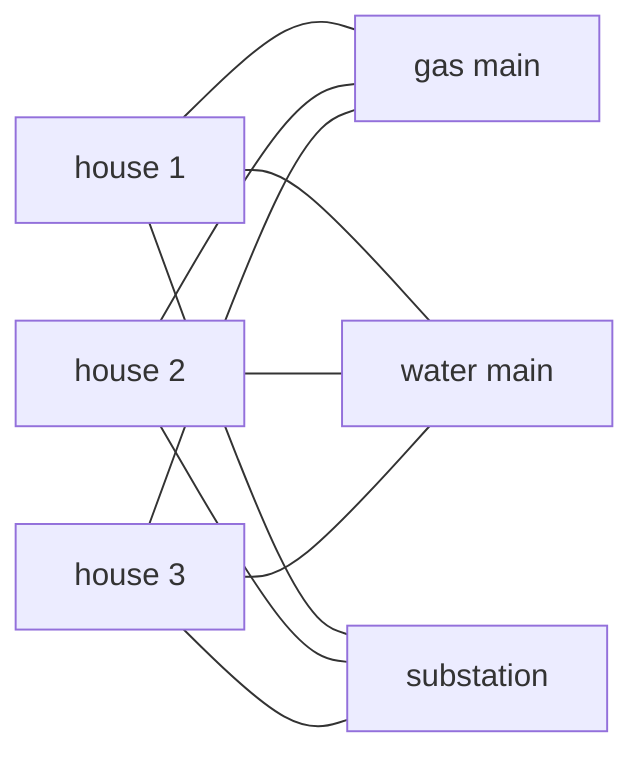
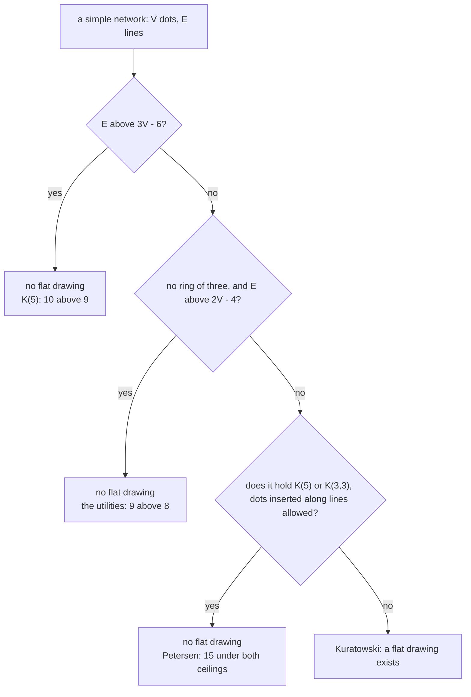

# Why some graphs cannot be drawn flat: at most 3V - 6 edges, so K(5) and the three-utilities graph fail, and Kuratowski says those two are the only obstacles

Combinatorics and graphs → Planarity and Colouring → The edge ceiling → Why some graphs cannot be drawn flat

---

## General Overview

Three new houses stand on a close. Each needs gas, water and electricity: nine connections, to the gas main, the water main and the substation. All nine go in one shallow trench layer, so no two may cross. A crossing means a second layer, and a second bill.

The job is impossible, and not for want of ingenuity: six points on a flat sheet, no pair joined twice and no three closing a ring, carry eight connections at most — one short of nine.

The reason is a count. A crossing-free drawing cuts the sheet into regions, Euler's identity fixes how many, and no region closes without a minimum of lines around it. That sets a ceiling on the lines: on V dots, 3V − 6, and 2V − 4 when no three dots close a ring. Break the ceiling and no routing helps. Kazimierz Kuratowski proved in 1930 that two small networks — this one, and five dots each joined to all the rest — are the only obstructions, dots along their lines allowed.

**A flat drawing spends its lines walling regions, and no region closes with fewer than three, so V dots carry at most 3V − 6 lines: a network wanting more cannot be drawn flat.**

**What kind of fact this is:** a theorem, both ceilings proved on this card in Why it works; Kuratowski's characterisation is quoted, its easy half proved here, the hard half left to Diestel under Sources.

### The picture: six dots, nine connections



Nine lines on six dots, none joining two houses or two mains: the ceiling is 8.

---

## The formula

A reminder from the sibling card: $V$ counts a drawing's dots, $E$ its lines and $F$ its regions, the patch outside counted as one ([planar-graphs-and-eulers-formula](01-planar-graphs-and-eulers-formula.md)). The graphs shelf calls them vertices and edges, and a dot's **degree** is the lines meeting it. Two names are new: **K(5)** is five dots with every pair joined, 10 lines; **K(3,3)** is two groups of three, every cross pair joined and none inside a group, 9 lines — the houses and the mains.

$$E \le 3V - 6$$

**Read it aloud:** a simple network drawn flat on three dots or more holds at most three lines per dot, minus six.

$$E \le 2V - 4$$

**Read it aloud:** with no three dots closing a ring, the ceiling falls to two per dot, minus four.

| Symbol | Plain meaning | In our example | Push it up and the answer… |
| --- | --- | --- | --- |
| $V$ | dots: houses and mains | 6 | each dot lifts the ceiling by 3, or by 2 |
| $E$ | lines: pipes and cables | 9 | past the ceiling, no flat drawing |
| $F$ | regions, the outside counted | 5, if drawable | more walls to pay for |
| K(5) | five dots, every pair joined | 10 lines, ceiling 9 | — |
| K(3,3) | two groups of three, cross pairs joined | the utilities: 9, ceiling 8 | — |

### When it holds

- **Simple: one line per pair, none from a dot to itself.** A doubled line walls a two-sided region, and the count needs three.
- **Three dots or more.** Two dots and one line read 1 > 0, a false verdict of impossible.
- **For the second ceiling, no ring of three.** Lines drawn only between two groups close no ring ([bipartite-graphs-and-odd-cycles](../09-Graphs%20-%20Dots%20and%20Lines/05-bipartite-graphs-and-odd-cycles.md)).
- **One direction only.** Over the ceiling proves no flat drawing; under it proves nothing, as Petersen below shows.

---

## Why it works

### Step 0: a line has two sides, and both of them wall a region

Walk one region's boundary, counting lines as they pass: a line with the same region on both sides counts twice, any other once. So the side-counts of all regions add to twice the lines:

$$\text{sides of all regions added} = 2E$$

Nine pipes supply 18 sides, however they are laid.

### Step 1: no region closes with fewer than three sides

One side would need a line looping from a dot back to itself, two sides a second line between one pair. A simple network has neither, so each of the $F$ regions demands three sides at least:

$$2E \ge 3F$$

### Step 2: trade regions for lines

Euler's identity fixes the regions of a crossing-free drawing in one piece: $F = E - V + 2$ ([planar-graphs-and-eulers-formula](01-planar-graphs-and-eulers-formula.md)). Substitute and take $2E$ from both sides:

$$2E \ge 3(E - V + 2), \qquad E \le 3V - 6$$

The ceiling belongs to the network, not to one drawing of it. Where no three dots close a ring, no region has three sides: the demand becomes $4F$ and the same substitution gives

$$2E \ge 4(E - V + 2), \qquad E \le 2V - 4.$$

<details>
<summary>Detailed proof: what the steps glossed over</summary>

**The side count.** A line whose removal splits the drawing has the same region on both sides, its walk passing it twice, so the walks still add to $2E$.

**The floor.** Simplicity forbids a loop and a repeated pair, and $V \ge 3$ forbids a region walled by one line, so no walk closes in under three steps. Equality comes when every region has exactly three sides, or four.

**Pieces.** Separate pieces can be joined across the outer region with no crossing, and the joined drawing holds more lines and still obeys the ceiling.

</details>

### Step 3: the three houses cannot be done, and neither can K(5)

Suppose the nine pipes could be laid without a crossing. The sheet would hold 9 − 6 + 2 = 5 regions. No house joins a house and no main joins a main, so no ring of three closes: those 5 regions demand 4 × 5 = 20 sides and nine pipes supply 18. Demand above supply is a contradiction ([proof-by-contradiction](../../01-Foundations/06-Proof/03-proof-by-contradiction.md)), and the ceiling reads 2 × 6 − 4 = 8 against the builder's 9.

The first ceiling catches K(5), 10 lines against 3 × 5 − 6 = 9. It misses the houses — 3 × 6 − 6 = 12, which 9 fits — so only the four-sided floor exposes them.

### Step 4: somewhere a dot of degree five or less

Degrees add to $2E$, each line raising two. In a flat drawing $2E \le 6V - 12$, so degrees average below 6 and some dot carries 5 lines or fewer.

Five cannot be lowered to four: the icosahedron's skeleton, the twenty-triangle solid flattened, has 12 dots and 30 lines, exactly 3 × 12 − 6, every dot of degree 5.

### Step 5: Kuratowski, and why two obstructions are enough

Insert a junction box along a pipe: the network gains a dot of degree 2, and the result is a **subdivision** of the original. Erase the inserted dots from a flat drawing of the subdivision and a flat drawing of the original is left. Any part of a flat drawing is itself one, so a network holding a subdivision of K(5) or K(3,3) cannot be drawn flat.

Kuratowski's theorem (1930) is the converse, and the surprise: **a finite network can be drawn flat exactly when it holds no subdivision of K(5) and none of K(3,3).** Klaus Wagner's 1937 version contracts lines — merging two joined dots — and reaches the same two.

Petersen shows why the theorem is needed: a pentagon, a five-pointed star inside, five spokes joining them, 10 dots and 15 lines. Both ceilings stay silent, 15 being under 24 and under 16, and still no flat drawing exists: the code exhausts all 1024 cyclic orders and reaches 5 regions where 7 are needed. Kuratowski's test fires where counting cannot — a subdivision of K(3,3) sits inside.



Counting is the cheap test, Kuratowski's the complete one. The code below runs a third, and doing that one fast on a large network is a matter for algorithms.

---

## Worked numbers, by hand

| Step | Arithmetic | Value |
| --- | --- | --- |
| dots and lines wanted | 3 houses + 3 mains, 3 × 3 pipes | 6 and 9 |
| regions, if it could be drawn | 9 − 6 + 2 | 5 |
| sides they demand | 4 × 5, no ring of three | 20 |
| sides nine pipes supply | 2 × 9 | **18** |
| as a ceiling | 2 × 6 − 4 | **8**, one short of 9 |

So the close needs a second trench layer.

### What breaks if you drop a piece

| Mistake | Comes out at | What went wrong |
| --- | --- | --- |
| 3V − 6 used where no three dots close a ring | 9 ≤ 12, "it fits" | Each region needs four sides: the ceiling is 8 |
| The ceiling read as permission | Petersen: 15 ≤ 24, 15 ≤ 16 | 1024 orders reach 5 regions, not the 7 needed |
| The ceiling used on two dots | 1 > 3 × 2 − 6 = 0 | Below three dots no region has three sides |

The code prints all three.

---

## Code, from first principles, and it actually runs

Nothing is imported. Road one is the arithmetic above: count the lines, work out both ceilings, report which is broken. Road two never mentions a ceiling: a flat drawing is recorded by the cyclic order in which lines leave each dot, so the code tries every order at every dot and keeps the best region count. For a network in one piece, a flat drawing is the one reaching $E - V + 2$. Road one can only say no, so on K(5) minus one line and on Petersen road two answers alone.

### Python

```python
# Why some graphs cannot be drawn flat -- the check behind the card.  Nothing is imported.  Road
# one is the Euler ceiling: a flat drawing of a simple graph on three dots or more holds at most
# 3V - 6 lines, and at most 2V - 4 when no three dots form a ring of three.  Road two never counts
# lines: it tries every cyclic order of lines round every dot, walks each order to count regions,
# and a flat drawing is one whose regions reach E - V + 2.
def complete(n): return [(u, v) for u in range(n) for v in range(u + 1, n)]
def utilities(a, b): return [(u, a + v) for u in range(a) for v in range(b)]
def adj(n, edges): return {u: [b if a == u else a for a, b in edges if u in (a, b)] for u in range(n)}
def degrees(n, edges): return sorted(len(vs) for vs in adj(n, edges).values())
def perms(xs): return [[x] + p for i, x in enumerate(xs) for p in perms(xs[:i] + xs[i + 1:])] or [[]]
def ring_free(n, es): return not any(w in adj(n, es)[v] for u, v in es for w in adj(n, es)[u])
RING = [(i, (i + 1) % 5) for i in range(5)]                                 # a pentagon of five dots
PET = RING + [(5 + i, 5 + (i + 2) % 5) for i in range(5)] + [(i, 5 + i) for i in range(5)]
ICO = (RING + [(5 + i, 5 + (i + 1) % 5) for i in range(5)] + [(10, i) for i in range(5)]
       + [(11, 5 + i) for i in range(5)] + [(i, 5 + i) for i in range(5)] + [(i, 5 + (i + 1) % 5) for i in range(5)])

def trace(rot):                              # one closed walk of the orders is one region
    used, faces = set(), []
    for start in sorted((u, v) for u in rot for v in rot[u]):
        if start in used: continue
        (u, v), sides = start, 0
        while (u, v) != start or sides == 0:
            used.add((u, v)); sides += 1; u, v = v, rot[v][rot[v].index(u) - 1]
        faces.append(sides)
    return sorted(faces)
def hunt(n, edges):                          # road two: every cyclic order round every dot
    choices = [[[ns[0]] + p for p in perms(ns[1:])] for ns in adj(n, edges).values()]
    total, best = 1, []
    for c in choices: total *= len(c)
    for k in range(total):
        rot, m = {}, k
        for u, c in enumerate(choices): rot[u], m = c[m % len(c)], m // len(c)
        if len(f := trace(rot)) > len(best): best = f
    return total, best
GRAPHS = [("K(3,3), the utilities", 6, utilities(3, 3)), ("K(5)", 5, complete(5)),
          ("K(5) minus one line", 5, [e for e in complete(5) if e != (3, 4)]), ("Petersen", 10, PET)]
print(f"{'graph':<22}{'V':>3}{'E':>4}{'3V-6':>6}{'2V-4':>6}{'over?':>7}{'orders':>8}{'best F':>8}{'target':>8}{'flat?':>7}")
rows = []
for name, n, edges in GRAPHS:
    e, c3, c4, free = len(edges), 3 * n - 6, 2 * n - 4, ring_free(n, edges)
    total, best = hunt(n, edges)
    rows.append((n, e, e > c3 or (free and e > c4), total, best, e - n + 2))
    cells = [n, e, c3, c4 if free else "-", "yes" if rows[-1][2] else "no", total, len(best), e - n + 2, "yes" if len(best) == e - n + 2 else "no"]
    print(f"{name:<22}" + "".join(f"{c:>{w}}" for c, w in zip(cells, (3, 4, 6, 6, 7, 8, 8, 8, 7))))
hv, he, flat, pet = 6, 9, rows[2], rows[3]
print(f"the three houses: dots {hv}, pipes wanted {he}, regions if it could be drawn {he - hv + 2}, pipe-sides {2 * he}, sides the regions need {4 * (he - hv + 2)}")
print(f"no ring of three, so the ceiling is 2 x {hv} - 4 = {2 * hv - 4}: {he} pipes is one too many")
print(f"the drawing found for K(5) minus one line: {len(flat[4])} regions, sides {' '.join(map(str, flat[4]))}, adding to 2E = {sum(flat[4])}")
print("a dot of small degree: the degrees add to 2E, so a flat drawing averages under 6")
print(f"  K(5) minus one line: V = {flat[0]}, E = {flat[1]}, average degree {2 * flat[1] / flat[0]:.2f}, degrees {degrees(5, GRAPHS[2][2])}")
print(f"  icosahedron: V = 12, E = {len(ICO)} = 3V - 6 = {3 * 12 - 6}, average degree {2 * len(ICO) / 12:.2f}, every degree {min(degrees(12, ICO))}, regions {len(ICO) - 12 + 2}")
print(f"mistake 1, the ring-of-three ceiling on the utilities: {he} <= {3 * hv - 6} says it fits, and the right ceiling is {2 * hv - 4}")
print(f"mistake 2, the ceiling read as permission: Petersen {pet[1]} <= {3 * 10 - 6} and <= {2 * 10 - 4}, yet {pet[3]} orders reach only {len(pet[4])} regions, not {pet[5]}")
print(f"mistake 3, the ceiling on two dots and one line: 1 > 3 x 2 - 6 = {3 * 2 - 6} calls one line impossible")
assert [len(r[4]) for r in rows] == [3, 5, 6, 5] and [r[3] for r in rows] == [64, 7776, 864, 1024]
assert [r[2] for r in rows] == [True, True, False, False]     # counting is silent on Petersen
assert [len(r[4]) == r[5] for r in rows] == [False, False, True, False]
assert sum(flat[4]) == 2 * flat[1] and min(flat[4]) >= 3 and degrees(12, ICO) == [5] * 12
print("ALL CHECKS PASS")
```

**Ran 2026-09-19 on macOS, Python 3.14.6, standard library only. All checks passed. Output, pasted from the run:**

```
graph                   V   E  3V-6  2V-4  over?  orders  best F  target  flat?
K(3,3), the utilities   6   9    12     8    yes      64       3       5     no
K(5)                    5  10     9     -    yes    7776       5       7     no
K(5) minus one line     5   9     9     -     no     864       6       6    yes
Petersen               10  15    24    16     no    1024       5       7     no
the three houses: dots 6, pipes wanted 9, regions if it could be drawn 5, pipe-sides 18, sides the regions need 20
no ring of three, so the ceiling is 2 x 6 - 4 = 8: 9 pipes is one too many
the drawing found for K(5) minus one line: 6 regions, sides 3 3 3 3 3 3, adding to 2E = 18
a dot of small degree: the degrees add to 2E, so a flat drawing averages under 6
  K(5) minus one line: V = 5, E = 9, average degree 3.60, degrees [3, 3, 4, 4, 4]
  icosahedron: V = 12, E = 30 = 3V - 6 = 30, average degree 5.00, every degree 5, regions 20
mistake 1, the ring-of-three ceiling on the utilities: 9 <= 12 says it fits, and the right ceiling is 8
mistake 2, the ceiling read as permission: Petersen 15 <= 24 and <= 16, yet 1024 orders reach only 5 regions, not 7
mistake 3, the ceiling on two dots and one line: 1 > 3 x 2 - 6 = 0 calls one line impossible
ALL CHECKS PASS
```

### Rust

Same numbers, same labels, built with `rustc --edition 2021 -O`.

```rust
// Why some graphs cannot be drawn flat -- the same check as the Python, in Rust.  No crates.  Road one
// is the Euler ceiling: a flat drawing of a simple graph on three dots or more holds at most 3V - 6
// lines, and at most 2V - 4 when no three dots form a ring of three.  Road two never counts lines: it
// tries every cyclic order of lines round every dot, walks each order to count the regions, and a
// flat drawing is one whose regions reach E - V + 2.
use std::collections::BTreeSet;
type Edges = Vec<(usize, usize)>;
fn complete(n: usize) -> Edges { (0..n).flat_map(|u| (u + 1..n).map(move |v| (u, v))).collect() }
fn utilities(a: usize, b: usize) -> Edges { (0..a).flat_map(|u| (0..b).map(move |v| (u, a + v))).collect() }
fn adj(n: usize, es: &Edges) -> Vec<Vec<usize>> {
    (0..n).map(|u| es.iter().filter(|e| e.0 == u || e.1 == u).map(|e| if e.0 == u { e.1 } else { e.0 }).collect()).collect()
}
fn degrees(n: usize, es: &Edges) -> Vec<usize> { let mut d: Vec<usize> = adj(n, es).iter().map(|ns| ns.len()).collect(); d.sort(); d }
fn perms(xs: &[usize]) -> Vec<Vec<usize>> {
    if xs.is_empty() { return vec![vec![]] }
    (0..xs.len()).flat_map(|i| { let mut r = xs.to_vec(); let x = r.remove(i);
        perms(&r).into_iter().map(move |p| { let mut o = vec![x]; o.extend(p); o }).collect::<Vec<_>>() }).collect()
}
fn ring_free(n: usize, es: &Edges) -> bool {         // no three dots joined in a ring of three
    let a = adj(n, es); !es.iter().any(|&(u, v)| a[u].iter().any(|w| a[v].contains(w)))
}
fn trace(rot: &[Vec<usize>]) -> Vec<usize> {         // one closed walk of the orders is one region
    let mut darts: Vec<(usize, usize)> = rot.iter().enumerate().flat_map(|(u, ns)| ns.iter().map(move |&v| (u, v))).collect();
    darts.sort(); let (mut used, mut faces): (BTreeSet<(usize, usize)>, Vec<usize>) = (BTreeSet::new(), Vec::new());
    for &start in &darts {
        if used.contains(&start) { continue }
        let ((mut u, mut v), mut sides) = (start, 0);
        while (u, v) != start || sides == 0 {
            used.insert((u, v)); sides += 1; let i = rot[v].iter().position(|&w| w == u).unwrap();
            (u, v) = (v, rot[v][if i == 0 { rot[v].len() - 1 } else { i - 1 }]);
        }
        faces.push(sides);
    }
    faces.sort(); faces
}
fn hunt(n: usize, es: &Edges) -> (u64, Vec<usize>) { // road two: every cyclic order round every dot
    let choices: Vec<Vec<Vec<usize>>> = adj(n, es).iter().map(|ns| perms(&ns[1..]).into_iter()
        .map(|p| { let mut o = vec![ns[0]]; o.extend(p); o }).collect()).collect();
    let total: u64 = choices.iter().map(|c| c.len() as u64).product();
    let mut best: Vec<usize> = Vec::new();
    for k in 0..total {
        let mut m = k;
        let rot: Vec<Vec<usize>> = choices.iter().map(|c| { let o = c[(m % c.len() as u64) as usize].clone(); m /= c.len() as u64; o }).collect();
        let f = trace(&rot);
        if f.len() > best.len() { best = f }
    }
    (total, best)
}
fn main() {
    let ring: Edges = (0..5).map(|i| (i, (i + 1) % 5)).collect();            // a pentagon of five dots
    let k5e: Edges = complete(5).into_iter().filter(|&e| e != (3, 4)).collect();
    let pet: Edges = ring.iter().copied().chain((0..5).map(|i| (5 + i, 5 + (i + 2) % 5))).chain((0..5).map(|i| (i, 5 + i))).collect();
    let ico: Edges = ring.iter().copied().chain((0..5).map(|i| (5 + i, 5 + (i + 1) % 5))).chain((0..5).map(|i| (10, i)))
        .chain((0..5).map(|i| (11, 5 + i))).chain((0..5).map(|i| (i, 5 + i))).chain((0..5).map(|i| (i, 5 + (i + 1) % 5))).collect();
    let graphs: Vec<(&str, usize, Edges)> = vec![("K(3,3), the utilities", 6, utilities(3, 3)),
        ("K(5)", 5, complete(5)), ("K(5) minus one line", 5, k5e.clone()), ("Petersen", 10, pet)];
    println!("{:<22}{:>3}{:>4}{:>6}{:>6}{:>7}{:>8}{:>8}{:>8}{:>7}", "graph", "V", "E", "3V-6", "2V-4", "over?", "orders", "best F", "target", "flat?");
    let mut rows: Vec<(usize, usize, bool, u64, Vec<usize>, usize)> = Vec::new();
    for (name, n, es) in &graphs {
        let (n, e) = (*n, es.len()); let (c3, c4, free) = (3 * n - 6, 2 * n - 4, ring_free(n, es));
        let (total, best) = hunt(n, es); let (over, target) = (e > c3 || (free && e > c4), e - n + 2);
        println!("{:<22}{:>3}{:>4}{:>6}{:>6}{:>7}{:>8}{:>8}{:>8}{:>7}", name, n, e, c3, if free { c4.to_string() } else { "-".to_string() }, if over { "yes" } else { "no" }, total, best.len(), target, if best.len() == target { "yes" } else { "no" });
        rows.push((n, e, over, total, best, target));
    }
    let ((hv, he), flat, pet_r) = ((6usize, 9usize), &rows[2], &rows[3]);
    println!("the three houses: dots {}, pipes wanted {}, regions if it could be drawn {}, pipe-sides {}, sides the regions need {}", hv, he, he - hv + 2, 2 * he, 4 * (he - hv + 2));
    println!("no ring of three, so the ceiling is 2 x {} - 4 = {}: {} pipes is one too many", hv, 2 * hv - 4, he);
    println!("the drawing found for K(5) minus one line: {} regions, sides {}, adding to 2E = {}", flat.4.len(), flat.4.iter().map(|s| s.to_string()).collect::<Vec<String>>().join(" "), flat.4.iter().sum::<usize>());
    println!("a dot of small degree: the degrees add to 2E, so a flat drawing averages under 6");
    println!("  K(5) minus one line: V = {}, E = {}, average degree {:.2}, degrees {:?}", flat.0, flat.1, 2.0 * flat.1 as f64 / flat.0 as f64, degrees(5, &k5e));
    println!("  icosahedron: V = 12, E = {} = 3V - 6 = {}, average degree {:.2}, every degree {}, regions {}", ico.len(), 3 * 12 - 6, 2.0 * ico.len() as f64 / 12.0, degrees(12, &ico)[0], ico.len() - 12 + 2);
    println!("mistake 1, the ring-of-three ceiling on the utilities: {} <= {} says it fits, and the right ceiling is {}", he, 3 * hv - 6, 2 * hv - 4);
    println!("mistake 2, the ceiling read as permission: Petersen {} <= {} and <= {}, yet {} orders reach only {} regions, not {}", pet_r.1, 3 * 10 - 6, 2 * 10 - 4, pet_r.3, pet_r.4.len(), pet_r.5);
    println!("mistake 3, the ceiling on two dots and one line: 1 > 3 x 2 - 6 = {} calls one line impossible", 3 * 2 - 6);
    assert!(rows.iter().map(|r| r.4.len()).collect::<Vec<usize>>() == vec![3, 5, 6, 5] && rows.iter().map(|r| r.3).collect::<Vec<u64>>() == vec![64, 7776, 864, 1024]);
    assert!(rows.iter().map(|r| r.2).collect::<Vec<bool>>() == vec![true, true, false, false]);   // silent on Petersen
    assert!(rows.iter().map(|r| r.4.len() == r.5).collect::<Vec<bool>>() == vec![false, false, true, false]);
    assert!(flat.4.iter().sum::<usize>() == 2 * flat.1 && *flat.4.iter().min().unwrap() >= 3 && degrees(12, &ico) == vec![5; 12]);
    println!("ALL CHECKS PASS");
}
```

**Ran 2026-09-19 on macOS, rustc 1.98.1, no crates. All checks passed. Output, pasted from the run:**

```
graph                   V   E  3V-6  2V-4  over?  orders  best F  target  flat?
K(3,3), the utilities   6   9    12     8    yes      64       3       5     no
K(5)                    5  10     9     -    yes    7776       5       7     no
K(5) minus one line     5   9     9     -     no     864       6       6    yes
Petersen               10  15    24    16     no    1024       5       7     no
the three houses: dots 6, pipes wanted 9, regions if it could be drawn 5, pipe-sides 18, sides the regions need 20
no ring of three, so the ceiling is 2 x 6 - 4 = 8: 9 pipes is one too many
the drawing found for K(5) minus one line: 6 regions, sides 3 3 3 3 3 3, adding to 2E = 18
a dot of small degree: the degrees add to 2E, so a flat drawing averages under 6
  K(5) minus one line: V = 5, E = 9, average degree 3.60, degrees [3, 3, 4, 4, 4]
  icosahedron: V = 12, E = 30 = 3V - 6 = 30, average degree 5.00, every degree 5, regions 20
mistake 1, the ring-of-three ceiling on the utilities: 9 <= 12 says it fits, and the right ceiling is 8
mistake 2, the ceiling read as permission: Petersen 15 <= 24 and <= 16, yet 1024 orders reach only 5 regions, not 7
mistake 3, the ceiling on two dots and one line: 1 > 3 x 2 - 6 = 0 calls one line impossible
ALL CHECKS PASS
```

The two outputs match line for line.

> [!TIP]
> **Try changing**
> Guess first, then run it. The asserts are pinned to these four networks, so expect one to stop the run.
> - **Add a fourth utility.** Make the first row of `GRAPHS` read `("K(3,4)", 7, utilities(3, 4))`: 12 pipes on 7 dots against a ceiling of 10, broken wider than before. Forget the 7 and the run halts on an undeclared dot.
> - **Give two houses a shared line.** Make the first row's pipes `utilities(3, 3) + [(0, 1)]`: a ring of three appears, so the second ceiling stops applying and the first lets 10 lines through — yet the hunt reaches 4 regions where 6 are needed.
> - **Blind the hunt.** Change `range(total)` to `range(1)`, one order per dot: the best counts fall to 3, 3, 2, 3, the flat drawing of K(5) minus one line is missed, and the first assert stops the run.

---

## The usual mistake

> [!warning]
> **Reading the ceiling as permission to draw.** The test runs one way: over the ceiling no flat drawing exists, under it nothing is settled. Petersen obeys 24 and 16 and still cannot be drawn flat.
>
> - **Using 3V − 6 where 2V − 4 is live.** Nine pipes fit under 12 and fail against 8.
> - **Reading crossings as proof.** A drawing with crossings may be a poor drawing of a network that can be drawn flat ([planar-graphs-and-eulers-formula](01-planar-graphs-and-eulers-formula.md)).
> - **Treating a subdivision as a different network.** A junction box changes no crossing question, so a K(5) with dots along its lines is forbidden too.

---

## Where you meet it in real life

- **One-layer wiring and single-trench utilities.** The count settles whether a wiring list fits one layer; over the ceiling, buy the second.
- **Junctions and flyovers.** Five junctions each linked straight to the other four ask for 10 roads where 9 is the ceiling, so some pair takes a bridge.
- **Graph drawing software.** Planarity is tested first, the flat drawing being the readable one; after that, how few crossings will do.
- **Map colouring.** Step 4's dot of degree 5 or less is the foothold for five colours and for the machine proof of four ([five-and-four-colour-theorems](05-five-and-four-colour-theorems.md), [vertex-colouring-and-chromatic-number](03-vertex-colouring-and-chromatic-number.md)).

> **Say it back**
> Lines have two sides, so they supply twice their number in region walls, while every region demands three sides — four with no rings of three. Euler's count of the regions turns that into a ceiling, 3V − 6 lines or 2V − 4, which also leaves some dot with 5 lines or fewer. The three houses ask for 9 lines on 6 dots where 8 is the ceiling; five dots all joined ask for 10 where 9 is. Under the ceiling nothing is settled, and Kuratowski finishes it: those two networks, dots along their lines allowed, are the only obstructions.

---

## What this builds on

- [planar-graphs-and-eulers-formula](01-planar-graphs-and-eulers-formula.md): the region count $F = E - V + 2$ behind both ceilings.
- [bipartite-graphs-and-odd-cycles](../09-Graphs%20-%20Dots%20and%20Lines/05-bipartite-graphs-and-odd-cycles.md): why lines drawn only between two groups close no ring of three.
- [proof-by-contradiction](../../01-Foundations/06-Proof/03-proof-by-contradiction.md): Step 3's shape, a layout assumed and refuted by its own count.

## Where this goes next

- [five-and-four-colour-theorems](05-five-and-four-colour-theorems.md): that dot of degree 5 or less, used until a map is coloured.

This card finds the leftover dot and stops; what to do with it is a later card's work.

---

## Sources

Verified 19 Sep 2026: every link below resolves to the publisher's page.

- Kuratowski, Kazimierz. "Sur le problème des courbes gauches en topologie." *Fundamenta Mathematicae* 15 (1930): 271–283. [doi:10.4064/fm-15-1-271-283](https://doi.org/10.4064/fm-15-1-271-283), free at [EuDML](https://eudml.org/doc/212352). Step 5's characterisation.
- Wagner, Klaus. "Über eine Eigenschaft der ebenen Komplexe." *Mathematische Annalen* 114 (1937): 570–590. [doi:10.1007/BF01594196](https://doi.org/10.1007/BF01594196). The same obstructions, by contraction.
- Diestel, Reinhard. *Graph Theory*, 5th ed. Springer, 2017. [Publisher page](https://link.springer.com/book/10.1007/978-3-662-53622-3). Chapter 4 derives both ceilings and proves Kuratowski's hard half.
- Bondy, J. A., and U. S. R. Murty. *Graph Theory*. Graduate Texts in Mathematics 244. Springer, 2008. [Publisher page](https://link.springer.com/book/9781846289699). Chapter 10 runs the same count and Step 4.
