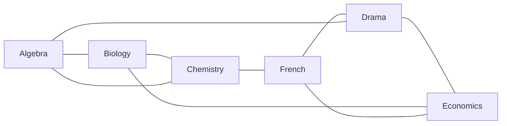

# Colouring: give joined vertices different colours, and the fewest colours needed is the size of the timetable

Combinatorics and graphs → Planarity and Colouring → Fewest colours → Colouring

---

## General Overview

A college has six exams to place in one week: Algebra, Biology, Chemistry, Drama, Economics and French. Of its five students, one sits Algebra, Biology and Chemistry, another Drama, Economics and French, and three more each sit a cross pair — Algebra with Drama, Biology with Economics, Chemistry with French. Two exams clash when one student sits both, and clashing exams cannot share a session.

Draw a dot per exam and a line per clash: nine lines. How few sessions does the week need? Algebra, Biology and Chemistry clash in every pair, so those three need three sessions: a floor of three. Three is also enough — Algebra with French, Biology with Drama, Chemistry with Economics.

Handing every dot a colour so that joined dots differ is a **proper colouring**. A colour here is a session, and colour is the word from here on. The fewest that work is the graph's **chromatic number**.

**A graph needs at least as many colours as its largest all-joined group, and never more than one past its busiest dot's line count; on the exam graph the floor reads three, and a sharper ceiling comes down to meet it.**

**What kind of fact this is:** a definition — proper colouring, and the chromatic number counting its colours — wrapped in two bounds proved in Why it works. Brooks' theorem sharpens the ceiling; this card states it and leaves its proof to the sources.

### The picture: six exams, nine clashes



Each triangle is a student sitting three exams; each line between the triangles is a student sitting two.

---

## The formula

Notation first, in words. A graph $G$ is two lists: its dots, collected as $V$, and its joined pairs, the lines, collected as $E$ ([graphs-vertices-and-edges](../09-Graphs%20-%20Dots%20and%20Lines/01-graphs-vertices-and-edges.md)). Write $n$ for the dot count, 6 here. A **colouring** is a rule $c$ handing the dot $v$ a colour $c(v)$, the colours numbered 1, 2, 3 upward, $k$ of them on offer. It is **proper** when

$$c(u) \ne c(v) \quad \text{for every line joining the dots } u \text{ and } v$$

**Read it aloud:** no line carries one colour at both ends.

The **chromatic number** $\chi(G)$, written with the Greek letter chi, is the smallest $k$ admitting a proper colouring in $k$ colours. Two counts hem it in. The **clique number** $\omega(G)$ is the size of the largest set of dots joined in every pair: 3 here, Algebra with Biology with Chemistry. The **maximum degree** $\Delta(G)$ is the largest line count at one dot — a dot's line count is its degree — and it is 3 here.

$$\omega(G) \le \chi(G) \le \Delta(G) + 1$$

**Read it aloud:** never fewer colours than the biggest all-joined group, never more than one past the busiest dot's line count.

**Brooks' theorem** (1941) takes one off the ceiling, with two exceptions. A graph in one piece that is neither **complete** — every pair of dots joined — nor an odd ring, a cycle of odd length ([bipartite-graphs-and-odd-cycles](../09-Graphs%20-%20Dots%20and%20Lines/05-bipartite-graphs-and-odd-cycles.md)), has $\chi(G) \le \Delta(G)$.

| Symbol | Plain meaning | In our example | Push it up and the answer… |
| --- | --- | --- | --- |
| $G$, $V$, $E$, $n$ | a graph: dots, lines, dot count | six exams, nine clashes, $n$ = 6 | more lines can force more colours |
| $c$, $v$, $u$, $k$ | the colouring rule; two dots; colours offered | $c$(Algebra) = 1 | — |
| $\chi$ | fewest colours a proper colouring needs | 3 sessions | — |
| $\Delta$ | largest line count at one dot | 3 clashes | ceiling rises |
| $\omega$, $\alpha$ | largest set joined in every pair; largest with no line inside | 3 exams; 2 exams | floor up; floor down |

### When it holds

- **No dot joined to itself.** Both ends of such a line are one dot, and no colour differs from itself.
- **Both limits can be slack.** Five exams clashing in a ring hold no clashing triple, so that floor reads 2 where the answer is 3.
- **Brooks outside its two exceptions only.** Complete graphs and odd rings need one past the busiest count: the Algebra–Biology–Chemistry triangle needs 3 where its busiest count is 2.

---

## Why it works

### Step 0: one colour is a set of exams with no clash inside it

Read a colouring backwards: collect the exams per colour. Session 1 holds Algebra and French, which do not clash. A set of dots with no line inside it is **independent**, so a proper colouring splits the dots into independent sets, one per colour, and the chromatic number asks for the fewest such groups.

### Step 1: mutual clashes set a floor

Algebra, Biology and Chemistry clash in every pair, so no two share a group: three groups at least. The largest all-joined set always spends one colour per dot, which is $\chi(G) \ge \omega(G)$, here 3.

A second floor never looks for a triangle. The **independence number** $\alpha(G)$ is the size of the largest independent set — 2 here, Biology and Drama. One colour's dots are such a set, so no session holds 3 exams, and six exams need at least 6 ÷ 2 = 3 sessions. Two counts, both 3.

### Step 2: one dot at a time never needs more than one past the busiest count

Fix any order of the dots, walk it, and give each dot the lowest-numbered colour no already-coloured neighbour carries. That is **greedy colouring**: each dot decided once, never revisited.

At a dot's turn at most $\Delta(G)$ neighbours hold colours, so one of the first $\Delta(G) + 1$ is always free, whatever the order. Each line's later end avoided its earlier end's colour, so the result is proper: $\chi(G) \le \Delta(G) + 1$, at most 4 here.

### Step 3: the order decides what greedy spends

Take the exams as listed. Algebra 1, Biology 2, Chemistry 3; Drama clashes only with Algebra so far, so 2; Economics 1; French clashes with Chemistry, Drama and Economics, finds 1, 2 and 3 barred, and opens a fourth session — four, on a graph needing three.

Visit Algebra, French, Biology, Drama, Chemistry, Economics instead and the rule spends 1, 1, 2, 2, 3, 3 in that order — the timetable above. Some order always spends exactly $\chi(G)$ colours — the classes of a best colouring, listed one after another — but finding that order needs that colouring in hand: the whole problem.

### Step 4: Brooks meets the floor and settles this graph

The exam graph is in one piece. Algebra and Economics do not clash, so it is not complete. Every exam has three clashes, where a ring would give two. So Brooks applies and three colours suffice.

Floor 3, ceiling 3, so $\chi(G) = 3$ — settled by counting, with no colouring searched for. That is what a bound is worth: on a graph too big to search, arithmetic still answers.

<details>
<summary>Detailed proof: the order behind Brooks' theorem</summary>

Steps 1 and 2 prove the floors and the ceiling in full. Brooks' order is what exceeds the card; this is its shape.

Suppose some dot has fewer than $\Delta(G)$ lines. Grow a tree of shortest routes out from it and colour in reverse tree order, each child before its parent: every other dot still has an uncoloured neighbour, its parent, so it sees at most $\Delta(G) - 1$ colours, and the root has fewer than $\Delta(G)$ neighbours. When every dot has exactly $\Delta(G)$ lines, Brooks finds one dot with two unjoined neighbours such that removing that pair leaves the rest in one piece; colour those two alike first, then work inward, and that dot sees at most $\Delta(G) - 1$ colours among $\Delta(G)$ neighbours. The graphs in one piece with every count at $\Delta(G)$ and no such triple are the complete graphs and the rings, and among those the ones needing $\Delta(G) + 1$ are the complete graphs and the odd rings. Showing the triple exists otherwise is Brooks' paper.

</details>

A second route counts instead of searching: how many proper colourings $k$ colours allow, with $\chi(G)$ the smallest $k$ whose count is not zero ([chromatic-polynomial](04-chromatic-polynomial.md)).

---

## Worked numbers, by hand

| Step | Arithmetic | Value |
| --- | --- | --- |
| clashes from the enrolments | 3 + 3 + 1 + 1 + 1 | 9 |
| clashes at each exam | three others apiece | $\Delta$ = 3 |
| largest all-clashing set | Algebra, Biology, Chemistry | $\omega$ = 3, floor 3 |
| largest clash-free set | Biology, Drama | $\alpha$ = 2, 6 ÷ 2 = 3 |
| greedy ceiling | 3 + 1 | at most 4 |
| Brooks ceiling | one piece, not complete, not a ring | at most 3 |
| floor meets ceiling | 3 and 3 | **3 sessions** |

Three sessions: Algebra with French, Biology with Drama, Chemistry with Economics — all nine clashes crossing between sessions, so nobody sits two exams at once.

### What breaks if you drop a piece

| Mistake | Comes out at | What went wrong |
| --- | --- | --- |
| Greedy's listed-order count as the answer | 4 sessions | the count follows the order, the ceiling does not |
| Brooks on the Algebra, Biology, Chemistry triangle | 2 sessions | every pair joined: an exception needing 3 |
| The clash floor as the answer, on a ring of five exams | 2 sessions | no clashing triple in a ring, and still 3 needed |

The code prints all three.

---

## Code, from first principles, and it actually runs

Nothing is imported. The answer comes twice by roads sharing no arithmetic: every assignment of $k$ colours is tried in turn, $k$ counting up from 1; and the floors and ceilings are read off the clash lists. Greedy runs in two orders, and two smaller graphs carry the mistakes.

### Python

```python
# Vertex colouring and the chromatic number -- the check behind the card.  Nothing is imported.  Six
# exams clash when one student sits both, and the fewest sessions is reached twice: by trying every
# colouring, and by a floor from mutual clashes meeting the ceiling Brooks allows.
EXAMS = ["Algebra", "Biology", "Chemistry", "Drama", "Economics", "French"]
STUDENTS = [[0, 1, 2], [3, 4, 5], [0, 3], [1, 4], [2, 5]]
RING, GOOD, LISTED = [[0, 1], [1, 2], [2, 3], [3, 4], [4, 0]], [0, 5, 1, 3, 2, 4], [0, 1, 2, 3, 4, 5]

def clash_graph(groups, n):                    # one line per pair of exams one student sits
    adj = [set() for _ in range(n)]
    for g in groups:
        for a in g: adj[a] |= {b for b in g if b != a}
    return adj
def biggest(adj, joined):                      # largest set with every pair joined, or none
    pick = ([i for i in range(len(adj)) if m >> i & 1] for m in range(1 << len(adj)))
    ok = [s for s in pick if all((b in adj[a]) == joined for a in s for b in s if a != b)]
    return max(ok, key=len)
def greedy(adj, order):                        # lowest colour no already-coloured neighbour has
    colour = [0] * len(adj)
    for v in order:
        colour[v] = next(c for c in range(1, len(adj) + 2) if c not in {colour[w] for w in adj[v]})
    return colour
def fewest(adj):                               # exhaustive: every assignment of k colours, k up
    n = len(adj)
    for k in range(1, n + 1):
        for m in range(k ** n):
            c = [m // k ** i % k + 1 for i in range(n)]
            if all(c[v] != c[w] for v in range(n) for w in adj[v]): return k

n, adj = len(EXAMS), clash_graph(STUDENTS, len(EXAMS))
edges, deg = sorted((a, b) for a in range(n) for b in adj[a] if a < b), [len(adj[v]) for v in range(n)]
clique, free = biggest(adj, True), biggest(adj, False)
omega, alpha, delta = len(clique), len(free), max(deg)
by_free, good, listed = -(-n // alpha), greedy(adj, GOOD), greedy(adj, LISTED)   # n/alpha, rounded up
ring, tri, inits = clash_graph(RING, 5), clash_graph([[0, 1, 2]], 3), lambda s: "".join(EXAMS[i][0] for i in s)
proper, y = lambda c: all(c[v] != c[w] for v in range(n) for w in adj[v]), lambda t: "yes" if t else "no"
reach = {0} | {w for v in adj[0] | {0} for w in adj[v]}   # every exam within two clashes of Algebra

print(f"exams {n}, students {len(STUDENTS)}, clashing pairs {len(edges)}")
print("clashes by initial: " + " ".join(inits(e) for e in edges))
print(f"clashes at each exam: {deg}, busiest count Delta = {delta}")
print(f"largest all-clashing set: {', '.join(EXAMS[i] for i in clique)} -> omega = {omega}")
print(f"largest clash-free set: {', '.join(EXAMS[i] for i in free)} -> alpha = {alpha}, so {n} exams "
      f"need at least {by_free} sessions")
print(f"greedy in the listed order {inits(LISTED)}: {listed} -> {max(listed)} sessions")
print(f"greedy in the order {inits(GOOD)}: {good} -> {max(good)} sessions")
print(f"Brooks test: one piece {y(len(reach) == n)}, every pair clashing {y(min(deg) == n - 1)}, a ring {y(delta == 2)}")
print(f"floor {max(omega, by_free)} meets Brooks ceiling {delta}, so chi = {max(omega, by_free)}, no search")
print(f"every colouring tried, no bounds used: chi = {fewest(adj)}")
for c in range(1, max(good) + 1):
    print(f"session {c}: " + ", ".join(EXAMS[i] for i in range(n) if good[i] == c))
print(f"no clash inside a session, over all {len(edges)} clashes: {y(proper(good))}")
print(f"mistake 1, the greedy count read as the answer: {max(listed)} sessions, not {fewest(adj)}")
print(f"mistake 2, Brooks on the {inits([0, 1, 2])} triangle alone: every pair clashes, so it is an "
      f"exception; it would claim {max(len(s) for s in tri)}, and chi = {fewest(tri)}")
print(f"mistake 3, the five-exam ring: omega = {len(biggest(ring, True))}, chi = {fewest(ring)}")
assert fewest(adj) == omega == max(good) and proper(good)
assert max(listed) == 4 and max(listed) <= delta + 1 and proper(listed)
assert alpha == 2 and by_free == fewest(adj) and len(reach) == n
assert fewest(ring) == 3 and len(biggest(ring, True)) == 2 and fewest(tri) == 3
print("ALL CHECKS PASS")
```

**Ran 2026-09-19 on macOS, Python 3.14.6, standard library only. All checks passed. Output, pasted from the run:**

```
exams 6, students 5, clashing pairs 9
clashes by initial: AB AC AD BC BE CF DE DF EF
clashes at each exam: [3, 3, 3, 3, 3, 3], busiest count Delta = 3
largest all-clashing set: Algebra, Biology, Chemistry -> omega = 3
largest clash-free set: Biology, Drama -> alpha = 2, so 6 exams need at least 3 sessions
greedy in the listed order ABCDEF: [1, 2, 3, 2, 1, 4] -> 4 sessions
greedy in the order AFBDCE: [1, 2, 3, 2, 3, 1] -> 3 sessions
Brooks test: one piece yes, every pair clashing no, a ring no
floor 3 meets Brooks ceiling 3, so chi = 3, no search
every colouring tried, no bounds used: chi = 3
session 1: Algebra, French
session 2: Biology, Drama
session 3: Chemistry, Economics
no clash inside a session, over all 9 clashes: yes
mistake 1, the greedy count read as the answer: 4 sessions, not 3
mistake 2, Brooks on the ABC triangle alone: every pair clashes, so it is an exception; it would claim 2, and chi = 3
mistake 3, the five-exam ring: omega = 2, chi = 3
ALL CHECKS PASS
```

### Rust

Same numbers, same labels, built with `rustc --edition 2021 -O`.

```rust
// Vertex colouring and the chromatic number -- the same check as the Python, in Rust.  No crates.
// Six exams clash when one student sits both, and the fewest sessions is reached twice: by trying
// every colouring, and by a floor from mutual clashes meeting the ceiling Brooks allows.
const EXAMS: [&str; 6] = ["Algebra", "Biology", "Chemistry", "Drama", "Economics", "French"];
fn clash_graph(groups: &[Vec<usize>], n: usize) -> Vec<Vec<bool>> {   // a line per co-sat pair
    let mut adj = vec![vec![false; n]; n];
    for g in groups { for &a in g { for &b in g { if a != b { adj[a][b] = true } } } }
    adj
}
fn nbrs(adj: &[Vec<bool>], v: usize) -> Vec<usize> { (0..adj.len()).filter(|&w| adj[v][w]).collect() }
fn biggest(adj: &[Vec<bool>], joined: bool) -> Vec<usize> {   // every pair joined, or none joined
    let n = adj.len(); let mut best: Vec<usize> = Vec::new();
    for m in 0..(1usize << n) {
        let s: Vec<usize> = (0..n).filter(|i| m >> i & 1 == 1).collect();
        if s.len() > best.len() && s.iter().all(|&a| s.iter().all(|&b| a == b || adj[a][b] == joined)) { best = s }
    }
    best
}
fn greedy(adj: &[Vec<bool>], order: &[usize]) -> Vec<usize> {   // lowest colour left free
    let mut colour = vec![0usize; adj.len()];
    for &v in order {
        let used: Vec<usize> = nbrs(adj, v).iter().map(|&w| colour[w]).collect();
        colour[v] = (1..adj.len() + 2).find(|c| !used.contains(c)).unwrap()
    }
    colour
}
fn fewest(adj: &[Vec<bool>]) -> usize {   // exhaustive: every assignment of k colours, k counting up
    let n = adj.len();
    let ok = |c: &Vec<usize>| (0..n).all(|v| (0..n).all(|w| !adj[v][w] || c[v] != c[w]));
    (1..=n).find(|&k| (0..k.pow(n as u32)).any(|m|
        ok(&(0..n).map(|i| m / k.pow(i as u32) % k + 1).collect()))).unwrap()
}

fn main() {
    let students: Vec<Vec<usize>> = vec![vec![0, 1, 2], vec![3, 4, 5], vec![0, 3], vec![1, 4], vec![2, 5]];
    let ring_pairs: Vec<Vec<usize>> = vec![vec![0, 1], vec![1, 2], vec![2, 3], vec![3, 4], vec![4, 0]];
    let (good_order, listed) = ([0usize, 5, 1, 3, 2, 4], [0usize, 1, 2, 3, 4, 5]);
    let n = EXAMS.len();
    let adj = clash_graph(&students, n);
    let mut edges: Vec<(usize, usize)> = Vec::new();
    for a in 0..n { for b in a + 1..n { if adj[a][b] { edges.push((a, b)) } } }
    let deg: Vec<usize> = (0..n).map(|v| nbrs(&adj, v).len()).collect();
    let (clique, free) = (biggest(&adj, true), biggest(&adj, false));
    let (omega, alpha, delta) = (clique.len(), free.len(), *deg.iter().max().unwrap());
    let by_free = (n + alpha - 1) / alpha; let floor = omega.max(by_free);   // n/alpha, rounded up
    let (gcol, lcol) = (greedy(&adj, &good_order), greedy(&adj, &listed));
    let (gmax, lmax) = (*gcol.iter().max().unwrap(), *lcol.iter().max().unwrap());
    let (ring, tri) = (clash_graph(&ring_pairs, 5), clash_graph(&[vec![0, 1, 2]], 3));
    let tri_d = (0..3).map(|v| nbrs(&tri, v).len()).max().unwrap();
    let reach: Vec<usize> = (0..n).filter(|&w| w == 0 || adj[0][w] || (0..n).any(|v| adj[0][v] && adj[v][w])).collect();
    let proper = |c: &Vec<usize>| (0..n).all(|v| (0..n).all(|w| !adj[v][w] || c[v] != c[w]));
    let names = |s: &[usize]| s.iter().map(|&i| EXAMS[i]).collect::<Vec<&str>>().join(", ");
    let inits = |s: &[usize]| s.iter().map(|&i| &EXAMS[i][0..1]).collect::<Vec<&str>>().join("");
    let y = |t: bool| if t { "yes" } else { "no" };
    println!("exams {}, students {}, clashing pairs {}", n, students.len(), edges.len());
    println!("clashes by initial: {}", edges.iter().map(|&(a, b)| inits(&[a, b])).collect::<Vec<String>>().join(" "));
    println!("clashes at each exam: {:?}, busiest count Delta = {}", deg, delta);
    println!("largest all-clashing set: {} -> omega = {}", names(&clique), omega);
    println!("largest clash-free set: {} -> alpha = {}, so {} exams need at least {} sessions",
             names(&free), alpha, n, by_free);
    println!("greedy in the listed order {}: {:?} -> {} sessions", inits(&listed), lcol, lmax);
    println!("greedy in the order {}: {:?} -> {} sessions", inits(&good_order), gcol, gmax);
    println!("Brooks test: one piece {}, every pair clashing {}, a ring {}", y(reach.len() == n),
             y(*deg.iter().min().unwrap() == n - 1), y(delta == 2));
    println!("floor {} meets Brooks ceiling {}, so chi = {}, no search", floor, delta, floor);
    println!("every colouring tried, no bounds used: chi = {}", fewest(&adj));
    for c in 1..=gmax {
        println!("session {}: {}", c, names(&(0..n).filter(|&i| gcol[i] == c).collect::<Vec<usize>>()));
    }
    println!("no clash inside a session, over all {} clashes: {}", edges.len(), y(proper(&gcol)));
    println!("mistake 1, the greedy count read as the answer: {} sessions, not {}", lmax, fewest(&adj));
    println!("mistake 2, Brooks on the {} triangle alone: every pair clashes, so it is an exception; \
              it would claim {}, and chi = {}", inits(&[0, 1, 2]), tri_d, fewest(&tri));
    println!("mistake 3, the five-exam ring: omega = {}, chi = {}", biggest(&ring, true).len(), fewest(&ring));
    assert!(fewest(&adj) == omega && omega == gmax && proper(&gcol));
    assert!(lmax == 4 && lmax <= delta + 1 && proper(&lcol));
    assert!(alpha == 2 && by_free == fewest(&adj) && reach.len() == n);
    assert!(fewest(&ring) == 3 && biggest(&ring, true).len() == 2 && fewest(&tri) == 3);
    println!("ALL CHECKS PASS");
}
```

**Ran 2026-09-19 on macOS, rustc 1.98.1, no crates. All checks passed. Output, pasted from the run:**

```
exams 6, students 5, clashing pairs 9
clashes by initial: AB AC AD BC BE CF DE DF EF
clashes at each exam: [3, 3, 3, 3, 3, 3], busiest count Delta = 3
largest all-clashing set: Algebra, Biology, Chemistry -> omega = 3
largest clash-free set: Biology, Drama -> alpha = 2, so 6 exams need at least 3 sessions
greedy in the listed order ABCDEF: [1, 2, 3, 2, 1, 4] -> 4 sessions
greedy in the order AFBDCE: [1, 2, 3, 2, 3, 1] -> 3 sessions
Brooks test: one piece yes, every pair clashing no, a ring no
floor 3 meets Brooks ceiling 3, so chi = 3, no search
every colouring tried, no bounds used: chi = 3
session 1: Algebra, French
session 2: Biology, Drama
session 3: Chemistry, Economics
no clash inside a session, over all 9 clashes: yes
mistake 1, the greedy count read as the answer: 4 sessions, not 3
mistake 2, Brooks on the ABC triangle alone: every pair clashes, so it is an exception; it would claim 2, and chi = 3
mistake 3, the five-exam ring: omega = 2, chi = 3
ALL CHECKS PASS
```

The two outputs match line for line.

> [!TIP]
> **Try changing**
> Guess first, then run it. The asserts are pinned to this clash graph, so expect one to stop the program.
> - **Drop a clash.** Remove `[0, 3]` from `STUDENTS`. The listed order now finds three sessions, so the greedy count falls to 3 and the second assert stops it.
> - **Walk the exams backwards.** Set the listed order to `[5, 4, 3, 2, 1, 0]`. No better: colours 4, 1, 2, 3, 2, 1, four sessions again, every assert still passing.
> - **Give one student all six exams.** Add `[0, 1, 2, 3, 4, 5]` to `STUDENTS`. Every pair clashes, so six sessions are needed: the Brooks line reports the exception, and the floor 6 answers.

---

## The usual mistake

> [!warning]
> **Believing the largest all-clashing group settles the count.** Five exams clashing in a ring hold no clashing triple, so that floor reads 2, and the ring still needs 3: two colours alternate round it and collide when it closes ([bipartite-graphs-and-odd-cycles](../09-Graphs%20-%20Dots%20and%20Lines/05-bipartite-graphs-and-odd-cycles.md)).
>
> - **Greedy's count read as the chromatic number.** The listed order spends 4 sessions where 3 suffice.
> - **Brooks without its two exceptions.** The triangle alone has a busiest count of 2 and needs 3.
> - **Colouring the lines instead of the dots.** A different question, with a different count ([edge-colouring-and-round-robin](06-edge-colouring-and-round-robin.md)).

---

## Where you meet it in real life

- **Exam and lecture timetables.** Dots are exams, lines shared students, colours sessions. Welsh and Powell put that translation in print in 1967, running greedy in order of decreasing clash count.
- **Maps.** Regions sharing a border are joined, and any flat map needs at most four colours ([five-and-four-colour-theorems](05-five-and-four-colour-theorems.md)).
- **Compilers and radio channels.** Two values needed at once cannot share a processor register, and two transmitters with overlapping ranges cannot share a frequency: both are colourings, done in practice by search that settles for good (local-search-and-metaheuristics), since the exact answer is among the standard hard problems (polynomial-reductions-and-np-completeness).

> **Say it back**
> A proper colouring gives joined dots different colours, and the chromatic number is the fewest that manage it. Read backwards, a colouring splits the dots into groups holding no line, so a timetable is a colouring. Dots joined in every pair need a colour each, which sets a floor. Colouring one dot at a time, lowest free colour each time, never spends more than one past the busiest dot's line count, and Brooks takes that one back off except on complete graphs and odd rings. Here both limits read 3.

---

## What this builds on

- [graphs-vertices-and-edges](../09-Graphs%20-%20Dots%20and%20Lines/01-graphs-vertices-and-edges.md): dots, lines, and the line count the ceiling is built from.
- [bipartite-graphs-and-odd-cycles](../09-Graphs%20-%20Dots%20and%20Lines/05-bipartite-graphs-and-odd-cycles.md): the two-colour case in full, and why an odd ring refuses two colours.

## Where this goes next

- [chromatic-polynomial](04-chromatic-polynomial.md): counts the colourings in $k$ colours rather than hunting one.
- [five-and-four-colour-theorems](05-five-and-four-colour-theorems.md): the ceiling for graphs drawn flat with no crossings.
- [edge-colouring-and-round-robin](06-edge-colouring-and-round-robin.md): the same question asked of the lines.
- local-search-and-metaheuristics: clash graphs with thousands of exams.
- polynomial-reductions-and-np-completeness: why no fast exact method is known.
- hadwiger-nelson-chromatic-number-of-the-plane: the same count over every point of the plane.

The limits pinned this graph only because they met; on most graphs they leave a range, which the next card closes by counting colourings rather than hunting one.

---

## Sources

Verified 19 Sep 2026: every link below resolves to the publisher's page.

- Bondy, J. A., and U. S. R. Murty. *Graph Theory*. Graduate Texts in Mathematics 244. Springer, 2008. [Publisher page](https://link.springer.com/book/9781846289699). Proves both bounds and Brooks.
- Brooks, R. L. "On colouring the nodes of a network." *Mathematical Proceedings of the Cambridge Philosophical Society* 37, no. 2 (1941): 194–197. [doi:10.1017/S030500410002168X](https://doi.org/10.1017/S030500410002168X). The theorem of Step 4.
- Welsh, D. J. A., and M. B. Powell. "An upper bound for the chromatic number of a graph and its application to timetabling problems." *The Computer Journal* 10, no. 1 (1967): 85–86. [doi:10.1093/comjnl/10.1.85](https://doi.org/10.1093/comjnl/10.1.85). Timetabling as colouring.
- Diestel, Reinhard. *Graph Theory*. 6th ed. Graduate Texts in Mathematics 173. Springer, 2025. [Author's page, with the main text free online](https://diestel-graph-theory.com/). Its colouring chapter, free to read.
