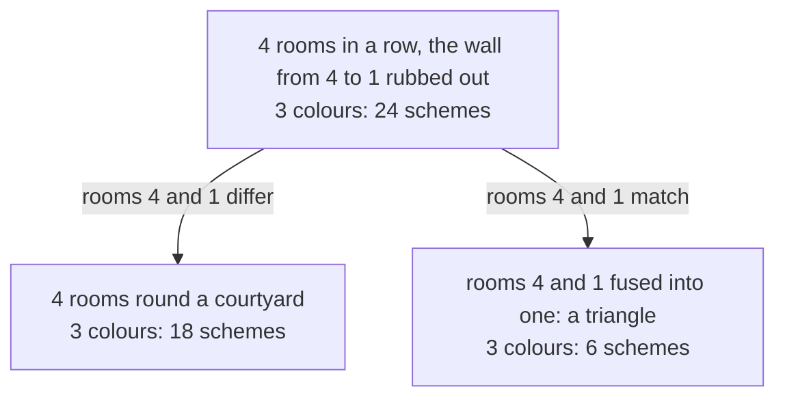

# The chromatic polynomial: count the colourings with q colours, by deleting an edge and contracting it

[Syllabus](../../../SYLLABUS.md) → [Combinatorics and graphs](../README.md) → [Planarity and Colouring](../README.md#s12) → The chromatic polynomial

---

## General Overview

A gallery has four rooms in a row off one corridor, numbered 1 to 4, and three tins of paint. Each room takes one colour, and rooms sharing a wall must not match. Room 1 can have any of the 3, each later room only has to differ from the one before: 3 × 2 × 2 × 2 = 24 schemes.

Rebuild the four rooms round a courtyard, so room 4 shares a wall with room 1. Same rule, new count: 18 schemes.

Both counts come from one expression in the number of tins, written q, and both read 2 when only two tins are in stock. Such a count, a polynomial in the number of colours, is the network's **chromatic polynomial**, written P(G, q). George Birkhoff put it in print in 1912, to attack map colouring.

One move computes it. Rub out a wall: every scheme of the wall-less plan keeps that wall's rooms apart or lets them match, and fusing those rooms into one counts the matching ones. A line between two dots is also an **edge**; rubbing one out is **deletion**, fusing its ends **contraction**.

**The number of ways to colour a network with q colours so that joined dots differ is a polynomial in q, and rubbing out one line and fusing its ends splits that count in two.**

**What kind of fact this is:** the chromatic polynomial is a definition; the recurrence and the polynomial claim are theorems, proved below in Why it works.

### The picture: one wall, two plans



The row's 24 schemes split with nothing over: 18 keep rooms 4 and 1 apart, 6 let them match.

---

## The formula

Notation first, in words. $P(G, q)$ counts the proper colourings of a network $G$ from $q$ colours: no line joins two dots of one colour. $G - e$ is $G$ with one line $e$ rubbed out (**deletion**); $G/e$ is $G$ with $e$'s ends fused into one dot, keeping their other lines (**contraction**).

$$P(G, q) = P(G - e, q) - P(G/e, q)$$

**Read it aloud:** a network's colourings are its colourings with one line rubbed out, less the ones giving that line's ends the same colour.

| Symbol | Plain meaning | In our example | Push it up and the answer… |
| --- | --- | --- | --- |
| $G$ | the network: rooms as dots, walls as lines | the courtyard ring | more lines, fewer colourings |
| $q$ | colours in stock, a whole number | 3 | climbs, near $q^n$ |
| $n$ | dots in the network | 4 | raises the highest power |
| $P(G, q)$ | proper colourings of $G$ | 18 | — |
| $e$ | the line picked | the wall from room 4 to 1 | — |
| $G - e$, $G/e$ | that line gone; its ends fused | the row, 24; the triangle, 6 | — |

Two shapes answer without the recurrence, both settled below: a row of n rooms — any tree, in fact, meaning one piece and no round trip — and a ring of n rooms.

$$P(\text{a row of } n \text{ rooms}, q) = q(q-1)^{n-1}, \qquad P(\text{a ring of } n \text{ rooms}, q) = (q-1)^n + (-1)^n(q-1)$$

So $(q-1)$ is added when n is even and subtracted when n is odd — the difference between a four-room ring, which two tins paint, and a five-room ring, which they cannot.

### When it holds

- **One line at a time.** Any wall may be picked: another gives different smaller plans and the same difference. Sorting by two walls at once needs four camps, not two.
- **No line from a dot to itself.** A dot cannot differ from itself, so such a network counts 0. Fusing can leave two lines on one pair: they forbid the same match, so they count as one.
- **Whole colour counts, colours told apart.** Only a whole q counts schemes, and red-then-blue is a second scheme beside blue-then-red: count a swap as one and the answer drops.

---

## Why it works

### Step 0: sort the schemes by one wall

Rub out the wall between rooms 4 and 1 and look through the row's 24 schemes. In each, rooms 4 and 1 differ or match: no third case, none in both camps. So count the camps.

### Step 1: the two camps

A row scheme whose rooms 4 and 1 differ obeys every wall of the ring, the rubbed-out one included, and every ring scheme is such a row scheme: that camp is the ring's 18.

If rooms 4 and 1 match, read the shared colour as one room's and fuse them. The fused room meets rooms 2 and 3, which still meet: a triangle. Matching schemes pair one for one with its colourings, so that camp is 3 × 2 × 1 = 6.

The camps fill the row: 24 = 18 + 6. Nothing in the argument needed four rooms, so it holds for any network and any line.

<details>
<summary>Detailed proof, in full</summary>

Call the chosen line's two dots its **ends**, and take a proper colouring of $G - e$: its ends differ or agree, never both.

**Ends differ.** That line is the only one of $G$ missing from $G - e$, and the colouring respects it, so it colours $G$ properly; every proper colouring of $G$ is one of these. That camp is $P(G, q)$.

**Ends agree.** Give the fused dot of $G/e$ the shared colour and every other dot the colour it had. It is proper: a dot joined to the fused dot was joined in $G$ to an end, and that line survives in $G - e$. Handing the colour back to both ends undoes the step, so the pairing is one for one and that camp is $P(G/e, q)$. Hence $P(G - e, q) = P(G, q) + P(G/e, q)$.

**A polynomial.** Induct on the lines. With none, every dot is free and the count is $q^n$. Otherwise both smaller networks have fewer lines, so their counts are polynomials of highest power $n$ and $n - 1$ with a 1 in front; subtracting leaves $q^n$ alone, and the next coefficient down comes to minus the number of lines.

</details>

### Step 2: rows straight off, rings by climbing

A row has no round trip, so it is a tree ([Trees](../10-Trees%20and%20Cheapest%20Routes/01-trees.md)). Paint room 1: q ways; then walk along, each new room meeting one painted room, so q − 1 ways each. Three tins, four rooms: 3 × 2 × 2 × 2 = 24, and any tree goes the same way.

A ring closes on itself, so no such walk exists and the recurrence works instead:

$$P(\text{ring of 4}, q) = q(q-1)^3 - q(q-1)(q-2) = q^4 - 4q^3 + 6q^2 - 3q$$

At q = 3 that is 24 − 6 = 18: highest power 4, the rooms, and next coefficient −4, the walls, as the folded proof promises.

One wall out of a ring of n rooms leaves a row of n, fusing its ends a ring of n − 1, so each ring leans on the one below ([Recurrences](../05-Recurrences/01-recurrences-and-fibonacci.md)); climbing from the triangle closes the form.

<details>
<summary>The ring formula by induction</summary>

The triangle is the base: $(q-1)^3 - (q-1) = (q-1)\big[(q-1)^2 - 1\big] = q(q-1)(q-2)$. If the form holds for $n - 1$ rooms, then
$$q(q-1)^{n-1} - \big[(q-1)^{n-1} + (-1)^{n-1}(q-1)\big] = (q-1)^n + (-1)^n(q-1),$$
since subtracting $(-1)^{n-1}$ adds $(-1)^n$: the claim for $n$.

</details>

### Step 3: where the count leaves zero

The value is a count, so 0 means no colouring exists: the fewest colours that work is the smallest whole q with P(G, q) above 0, the chromatic number ([Colouring](03-vertex-colouring-and-chromatic-number.md)). Row and ring read 2 at two tins; the triangle reads 0 there and 6 at three, so it needs three. A five-room ring also reads 0 at two, since (2−1)^5 − (2−1) = 0: odd rings need three tins, even rings two.

A second road skips the recurrence: over every set of walls, add q raised to the number of pieces that set ties the rooms into, minus for odd-sized sets. Each term counts the schemes where those walls all match across, and the signs strike out the schemes that break a rule. Hassler Whitney published it in 1932; it gives the courtyard's 18.

---

## Worked numbers, by hand

| Step | Arithmetic | Value |
| --- | --- | --- |
| the row, room by room | 3 × 2 × 2 × 2 | 24 |
| the triangle | 3 × 2 × 1 | 6 |
| the ring, deletion less contraction | 24 − 6 | **18** |
| the ring, by its polynomial | q^4 − 4q^3 + 6q^2 − 3q at q = 3 | **18** |
| a hatch joining rooms 2 and 4 | 18 − 12 | **6** |

Three tins give the courtyard 18 against the corridor's 24, the difference being the 6 schemes where rooms 4 and 1 matched. The last row is a second plan: a hatch joins rooms 2 and 4, and fusing them leaves a three-room row of 12.

### What breaks if you drop a piece

| Mistake | Comes out at | What went wrong |
| --- | --- | --- |
| The wall from room 4 to 1 left out | 24 | The corridor's count: those rooms may match |
| The recurrence read with a plus | 30 | A wall only forbids; 30 beats the 24 counted with that wall gone |
| The contraction's count taken as the answer | 6 | Those schemes are removed, not kept |

The code prints all three.

---

## Code, from first principles, and it actually runs

Nothing is imported. Four roads reach the ring's count: try all q^n colourings and keep the proper ones, which needs no theory; run deletion and contraction on coefficient lists, so the polynomial falls out; add and subtract over every set of walls; and the closed form. The row takes three of them, the other plans fewer.

### Python

```python
# The chromatic polynomial -- the check behind the card.  Nothing is imported.  Rooms are dots, a
# shared wall is a line, and a colouring is proper when no wall carries the same colour on both sides.
# Four roads to every count: try all q^n colourings, run the deletion-contraction recursion on
# polynomial coefficients, add and subtract over sets of walls, and the closed forms.
def ring(n): return (n, [(i, (i + 1) % n) for i in range(n)])
def path(n): return (n, [(i, i + 1) for i in range(n - 1)])
ROW, RING, TRI, PATH3, QS, Q = path(4), ring(4), ring(3), path(3), list(range(6)), 3
HATCH = (4, RING[1] + [(1, 3)])            # a hatch makes rooms 2 and 4 neighbours as well
def brute(g, q):                           # road 1: try every one of the q^n colourings
    n, edges = g
    return sum(all(code // q ** u % q != code // q ** v % q for u, v in edges) for code in range(q ** n))
def contract(g, e):                        # fuse a wall's two ends into one dot
    (n, edges), (u, v) = g, e
    to = {x: (u if x == v else x) - (1 if (u if x == v else x) > v else 0) for x in range(n)}
    fused = {(min(to[a], to[b]), max(to[a], to[b])) for a, b in edges if to[a] != to[b]}
    return (n - 1, sorted(fused))
def chrom(g):                              # road 2: deletion minus contraction
    n, edges = g
    if not edges: return [0] * n + [1]     # no walls left: q^n, every room free
    keep, gone = chrom((n, edges[1:])), chrom(contract(g, edges[0]))
    return [a - b for a, b in zip(keep, gone + [0] * (len(keep) - len(gone)))]
def at(p, q): return sum(a * q ** i for i, a in enumerate(p))
def pieces(n, edges):                      # how many separate pieces a set of walls leaves
    home = list(range(n))
    for _ in range(n):
        for a, b in edges: home[a] = home[b] = min(home[a], home[b])
    return len(set(home))
def by_sets(g, q):                         # road 3: add and subtract over sets of walls
    n, edges = g
    return sum((-1) ** bin(m).count("1") * q ** pieces(n, [e for i, e in enumerate(edges) if m >> i & 1])
               for m in range(2 ** len(edges)))
def chi(g): return next(q for q in range(1, 9) if brute(g, q) > 0)
def show(p):                               # coefficients into q^4 - 4q^3 + 6q^2 - 3q
    term = lambda i, a: ("" if abs(a) == 1 and i else str(abs(a))) + ("q" if i else "") + (f"^{i}" if i > 1 else "")
    return " ".join([("- " if a < 0 else "+ ") + term(i, a) for i, a in enumerate(p) if a][::-1]).lstrip("+ ")
hatch_closed, chis = Q * (Q - 1) * (Q - 2) ** 2, [chi(g) for g in (ROW, RING, TRI, HATCH)]
poly_chis = [min(q for q in range(1, 9) if at(chrom(g), q) > 0) for g in (ROW, RING, TRI, HATCH)]
tab = [("colours q", QS), ("row, every colouring tried", [brute(ROW, q) for q in QS]),
       ("row, q(q-1)^3", [q * (q - 1) ** 3 for q in QS]),
       ("ring, every colouring tried", [brute(RING, q) for q in QS]),
       ("ring, deletion minus contraction", [at(chrom(RING), q) for q in QS]),
       ("ring, add and subtract over wall sets", [by_sets(RING, q) for q in QS]),
       ("ring, (q-1)^4 + (q-1)", [(q - 1) ** 4 + (q - 1) for q in QS]),
       ("triangle, every colouring tried", [brute(TRI, q) for q in QS])]
print(f"the row: {ROW[0]} rooms, {len(ROW[1])} shared walls;  the ring: {RING[0]} rooms, "
      f"{len(RING[1])} walls;  the triangle: {TRI[0]} rooms, {len(TRI[1])} walls")
for lab, vals in tab: print(f"{lab:<37}" + "".join(f"{v:>5}" for v in vals))
print(f"the ring's polynomial, by recursion: {show(chrom(RING))}")
print(f"{Q} colours: row {brute(ROW, Q)} = ring {brute(RING, Q)} + triangle {brute(TRI, Q)}")
print(f"fewest colours that work, by search {chis}, off the polynomial {poly_chis}")
print(f"a hatch between rooms 2 and 4, {Q} colours: ring {brute(RING, Q)} - path {brute(PATH3, Q)} = {brute(HATCH, Q)}, and q(q-1)(q-2)^2 = {hatch_closed}")
print(f"rings of 3, 4 and 5 rooms: {Q} colours give {[brute(ring(n), Q) for n in (3, 4, 5)]}, 2 colours give {[brute(ring(n), 2) for n in (3, 4, 5)]}")
print(f"mistake 1, the wall between rooms 4 and 1 ignored: {brute(ROW, Q)}, not {brute(RING, Q)}")
print(f"mistake 2, the recurrence read with a plus: {brute(ROW, Q)} + {brute(TRI, Q)} = {brute(ROW, Q) + brute(TRI, Q)}, above the {brute(ROW, Q)} with no wall there at all")
print(f"mistake 3, the contraction's count alone: {brute(TRI, Q)}, the colourings where 4 and 1 match")
assert tab[3][1] == tab[4][1] == tab[5][1] == tab[6][1]
assert tab[1][1] == tab[2][1] == [by_sets(ROW, q) for q in QS]
assert brute(ROW, Q) == brute(RING, Q) + brute(TRI, Q) and chrom(RING) == [0, -3, 6, -4, 1]
assert brute(HATCH, Q) == brute(RING, Q) - brute(PATH3, Q) == hatch_closed and chis == [2, 2, 3, 3] == poly_chis
print("ALL CHECKS PASS")
```

**Ran 2026-09-19 on macOS, Python 3.14.6, standard library only. All checks passed. Output, pasted from the run:**

```
the row: 4 rooms, 3 shared walls;  the ring: 4 rooms, 4 walls;  the triangle: 3 rooms, 3 walls
colours q                                0    1    2    3    4    5
row, every colouring tried               0    0    2   24  108  320
row, q(q-1)^3                            0    0    2   24  108  320
ring, every colouring tried              0    0    2   18   84  260
ring, deletion minus contraction         0    0    2   18   84  260
ring, add and subtract over wall sets    0    0    2   18   84  260
ring, (q-1)^4 + (q-1)                    0    0    2   18   84  260
triangle, every colouring tried          0    0    0    6   24   60
the ring's polynomial, by recursion: q^4 - 4q^3 + 6q^2 - 3q
3 colours: row 24 = ring 18 + triangle 6
fewest colours that work, by search [2, 2, 3, 3], off the polynomial [2, 2, 3, 3]
a hatch between rooms 2 and 4, 3 colours: ring 18 - path 12 = 6, and q(q-1)(q-2)^2 = 6
rings of 3, 4 and 5 rooms: 3 colours give [6, 18, 30], 2 colours give [0, 2, 0]
mistake 1, the wall between rooms 4 and 1 ignored: 24, not 18
mistake 2, the recurrence read with a plus: 24 + 6 = 30, above the 24 with no wall there at all
mistake 3, the contraction's count alone: 6, the colourings where 4 and 1 match
ALL CHECKS PASS
```

### Rust

Same numbers, same labels, built with `rustc --edition 2021 -O`.

```rust
// The chromatic polynomial -- the same check as the Python, in Rust.  No crates.  Rooms are dots, a shared wall is a line,
// and a colouring is proper when no wall carries the same colour on both sides.  Four roads to every count: try all q^n
// colourings, run the deletion-contraction recursion on coefficients, add and subtract over sets of walls, the closed forms.
type G = (usize, Vec<(usize, usize)>);
fn ring(n: usize) -> G { (n, (0..n).map(|i| (i, (i + 1) % n)).collect()) }
fn path(n: usize) -> G { (n, (0..n - 1).map(|i| (i, i + 1)).collect()) }
fn brute(g: &G, q: i64) -> i64 {                 // road 1: try every one of the q^n colourings
    let (n, edges) = g;
    (0..q.pow(*n as u32)).filter(|c| edges.iter().all(|(u, v)| c / q.pow(*u as u32) % q != c / q.pow(*v as u32) % q)).count() as i64
}
fn contract(g: &G, e: (usize, usize)) -> G {     // fuse a wall's two ends into one dot
    let ((n, edges), (u, v)) = (g, e);
    let to = |x: usize| { let y = if x == v { u } else { x }; if y > v { y - 1 } else { y } };
    let mut fused: Vec<(usize, usize)> = edges.iter().map(|(a, b)| (to(*a), to(*b))).filter(|(a, b)| a != b).map(|(a, b)| (a.min(b), a.max(b))).collect();
    fused.sort(); fused.dedup();
    (n - 1, fused)
}
fn chrom(g: &G) -> Vec<i64> {                    // road 2: deletion minus contraction
    let (n, edges) = g;
    if edges.is_empty() { let mut p = vec![0; *n]; p.push(1); return p }  // no walls: q^n, rooms free
    let (keep, mut gone) = (chrom(&(*n, edges[1..].to_vec())), chrom(&contract(g, edges[0])));
    gone.resize(keep.len(), 0);  keep.iter().zip(gone).map(|(a, b)| a - b).collect()
}
fn at(p: &[i64], q: i64) -> i64 { p.iter().enumerate().map(|(i, a)| a * q.pow(i as u32)).sum() }
fn pieces(n: usize, edges: &[(usize, usize)]) -> i64 {   // separate pieces a set of walls leaves
    let mut home: Vec<usize> = (0..n).collect();
    for _ in 0..n { for (a, b) in edges { let m = home[*a].min(home[*b]); home[*a] = m; home[*b] = m } }
    home.sort(); home.dedup(); home.len() as i64
}
fn by_sets(g: &G, q: i64) -> i64 {               // road 3: add and subtract over sets of walls
    let (n, edges) = g;
    (0..1usize << edges.len()).map(|m| {
        let s: Vec<(usize, usize)> = edges.iter().enumerate().filter(|(i, _)| m >> i & 1 == 1).map(|(_, e)| *e).collect();
        if s.len() % 2 == 0 { q.pow(pieces(*n, &s) as u32) } else { -q.pow(pieces(*n, &s) as u32) }
    }).sum()
}
fn chi(g: &G) -> i64 { (1..9).find(|&q| brute(g, q) > 0).unwrap() }
fn show(p: &[i64]) -> String {                   // coefficients into q^4 - 4q^3 + 6q^2 - 3q
    let mut bits: Vec<String> = p.iter().enumerate().filter(|(_, a)| **a != 0).map(|(i, a)| {
        let mag = if a.abs() == 1 && i > 0 { String::new() } else { a.abs().to_string() };
        format!("{} {}{}", if *a < 0 { "-" } else { "+" }, mag, if i > 1 { format!("q^{}", i) } else if i == 1 { "q".to_string() } else { String::new() })
    }).collect();
    bits.reverse();
    bits.join(" ").trim_start_matches("+ ").to_string()
}
fn main() {
    let (row, rg, tri, path3) = (path(4), ring(4), ring(3), path(3));
    let mut he = rg.1.clone(); he.push((1, 3));   // a hatch makes rooms 2 and 4 neighbours as well
    let (hatch, qs, q): (G, Vec<i64>, i64) = ((4, he), (0..6).collect(), 3);
    let (hatch_closed, gs) = (q * (q - 1) * (q - 2).pow(2), [&row, &rg, &tri, &hatch]);
    let chis: Vec<i64> = gs.iter().map(|g| chi(g)).collect();
    let poly_chis: Vec<i64> = gs.iter().map(|g| (1..9).find(|&x| at(&chrom(g), x) > 0).unwrap()).collect();
    println!("the row: {} rooms, {} shared walls;  the ring: {} rooms, {} walls;  the triangle: {} rooms, {} walls", row.0, row.1.len(), rg.0, rg.1.len(), tri.0, tri.1.len());
    let tab: Vec<(&str, Vec<i64>)> = vec![("colours q", qs.clone()),
        ("row, every colouring tried", qs.iter().map(|&x| brute(&row, x)).collect()),
        ("row, q(q-1)^3", qs.iter().map(|&x| x * (x - 1).pow(3)).collect()),
        ("ring, every colouring tried", qs.iter().map(|&x| brute(&rg, x)).collect()),
        ("ring, deletion minus contraction", qs.iter().map(|&x| at(&chrom(&rg), x)).collect()),
        ("ring, add and subtract over wall sets", qs.iter().map(|&x| by_sets(&rg, x)).collect()),
        ("ring, (q-1)^4 + (q-1)", qs.iter().map(|&x| (x - 1).pow(4) + (x - 1)).collect()),
        ("triangle, every colouring tried", qs.iter().map(|&x| brute(&tri, x)).collect())];
    for (lab, vals) in &tab { println!("{:<37}{}", lab, vals.iter().map(|v| format!("{:>5}", v)).collect::<String>()) }
    println!("the ring's polynomial, by recursion: {}", show(&chrom(&rg)));
    println!("{} colours: row {} = ring {} + triangle {}", q, brute(&row, q), brute(&rg, q), brute(&tri, q));
    println!("fewest colours that work, by search {:?}, off the polynomial {:?}", chis, poly_chis);
    println!("a hatch between rooms 2 and 4, {} colours: ring {} - path {} = {}, and q(q-1)(q-2)^2 = {}",
             q, brute(&rg, q), brute(&path3, q), brute(&hatch, q), hatch_closed);
    println!("rings of 3, 4 and 5 rooms: {} colours give {:?}, 2 colours give {:?}", q,
             [3, 4, 5].map(|n| brute(&ring(n), q)), [3, 4, 5].map(|n| brute(&ring(n), 2)));
    println!("mistake 1, the wall between rooms 4 and 1 ignored: {}, not {}", brute(&row, q), brute(&rg, q));
    println!("mistake 2, the recurrence read with a plus: {} + {} = {}, above the {} with no wall there at all",
             brute(&row, q), brute(&tri, q), brute(&row, q) + brute(&tri, q), brute(&row, q));
    println!("mistake 3, the contraction's count alone: {}, the colourings where 4 and 1 match", brute(&tri, q));
    assert!(tab[3].1 == tab[4].1 && tab[4].1 == tab[5].1 && tab[5].1 == tab[6].1);
    assert!(tab[1].1 == tab[2].1 && tab[1].1 == qs.iter().map(|&x| by_sets(&row, x)).collect::<Vec<i64>>());
    assert!(brute(&row, q) == brute(&rg, q) + brute(&tri, q) && chrom(&rg) == vec![0, -3, 6, -4, 1]);
    assert!(brute(&hatch, q) == brute(&rg, q) - brute(&path3, q) && brute(&hatch, q) == hatch_closed && chis == vec![2, 2, 3, 3] && poly_chis == chis);
    println!("ALL CHECKS PASS");
}
```

**Ran 2026-09-19 on macOS, rustc 1.98.1, no crates. All checks passed. Output, pasted from the run:**

```
the row: 4 rooms, 3 shared walls;  the ring: 4 rooms, 4 walls;  the triangle: 3 rooms, 3 walls
colours q                                0    1    2    3    4    5
row, every colouring tried               0    0    2   24  108  320
row, q(q-1)^3                            0    0    2   24  108  320
ring, every colouring tried              0    0    2   18   84  260
ring, deletion minus contraction         0    0    2   18   84  260
ring, add and subtract over wall sets    0    0    2   18   84  260
ring, (q-1)^4 + (q-1)                    0    0    2   18   84  260
triangle, every colouring tried          0    0    0    6   24   60
the ring's polynomial, by recursion: q^4 - 4q^3 + 6q^2 - 3q
3 colours: row 24 = ring 18 + triangle 6
fewest colours that work, by search [2, 2, 3, 3], off the polynomial [2, 2, 3, 3]
a hatch between rooms 2 and 4, 3 colours: ring 18 - path 12 = 6, and q(q-1)(q-2)^2 = 6
rings of 3, 4 and 5 rooms: 3 colours give [6, 18, 30], 2 colours give [0, 2, 0]
mistake 1, the wall between rooms 4 and 1 ignored: 24, not 18
mistake 2, the recurrence read with a plus: 24 + 6 = 30, above the 24 with no wall there at all
mistake 3, the contraction's count alone: 6, the colourings where 4 and 1 match
ALL CHECKS PASS
```

The two outputs match line for line.

> [!TIP]
> **Try changing**
> Guess first, then run it.
> - **Longer rings.** Add 6 to both `(3, 4, 5)` lists: 66 schemes at three tins, 2 at two, and the run still passes.
> - **More tins.** Change `list(range(6))` to `list(range(8))`: the row reaches 1512 and the ring 1302, all roads agreeing.
> - **Add instead of subtract.** In `chrom`, change `a - b` to `a + b`: the ring's row reads 14 at one colour and an assert stops the run.

---

## The usual mistake

> [!warning]
> **Walking round the ring and multiplying as if it were a row.** A row of four gives 3 × 2 × 2 × 2 = 24, so the ring looks like 3 × 2 × 2 × 1 = 12, one colour left for room 4. It is 18: when rooms 1 and 3 match they forbid room 4 one colour, not two, and no single product holds both cases.
>
> - **Deleting without subtracting.** That plan counts the corridor's 24, not the courtyard's 18; the contraction's 6 is the part to remove, not the answer.
> - **Reading the plan off the polynomial.** Every four-room tree gives q(q−1)^3, so the count cannot tell the corridor from one room with three others off it.
> - **Reading the value as a colour count.** At two tins the ring reads 2: two schemes, not two colours.

---

## Where you meet it in real life

- **Timetabling and radio channels.** Clashing exams or transmitters make a network, the colours slots or frequencies ([Colouring](03-vertex-colouring-and-chromatic-number.md)). The polynomial says how many schedules q slots allow, not just whether one exists.
- **Map colouring.** Birkhoff defined it to attack the claim that a flat map's count never reads 0 at four colours ([Colouring maps](05-five-and-four-colour-theorems.md)).
- **The move itself.** Rub out a part or fuse its ends, then combine: the move also counts spanning trees and network reliability.

> **Say it back**
> A proper colouring gives every dot a colour so that no line joins two dots of one colour, and P(G, q) counts them for q colours in stock. Rub out one line: each colouring of the smaller network keeps that line's ends apart, which colours the original, or lets them match, which colours the network with those ends fused. So the count with the line is the count without it, less the fused network's count. Run that down to no lines and only powers of q remain: the count is a polynomial. Three tins give the row 24 and the fused triangle 6, so the ring gives 18.

---

## What this builds on

- [Colouring](03-vertex-colouring-and-chromatic-number.md): proper colourings, and the chromatic number read off a polynomial here.
- [Recurrences](../05-Recurrences/01-recurrences-and-fibonacci.md): unwinding a count written in terms of smaller cases.
- [Polynomials](../../03-Algebra/02-Polynomials/01-polynomials.md): degree and coefficients.

## Where this goes next

- [Colouring maps](05-five-and-four-colour-theorems.md): whether a flat map's count is ever 0 at four colours, Birkhoff's plan.
- [Edge colouring](06-edge-colouring-and-round-robin.md): the same question, asked of the lines.

Every wall doubles the split, so a real floor plan is past hand calculation. And nothing here rules out a flat map whose count reads 0 at four colours: that is the next card's question.

---

## Sources

Verified 19 Sep 2026: every link below resolves to the publisher's page.

- Birkhoff, George D. "A Determinant Formula for the Number of Ways of Coloring a Map." *Annals of Mathematics* 14, no. 1/4 (1912): 42–46. [doi:10.2307/1967597](https://doi.org/10.2307/1967597). Where the polynomial begins.
- Whitney, Hassler. "A logical expansion in mathematics." *Bulletin of the American Mathematical Society* 38, no. 8 (1932): 572–579. [doi:10.1090/S0002-9904-1932-05460-X](https://doi.org/10.1090/S0002-9904-1932-05460-X). The expansion over sets of lines.
- Read, Ronald C. "An introduction to chromatic polynomials." *Journal of Combinatorial Theory* 4, no. 1 (1968): 52–71. [doi:10.1016/S0021-9800(68)80087-0](https://doi.org/10.1016/S0021-9800(68)80087-0). The standard survey.
