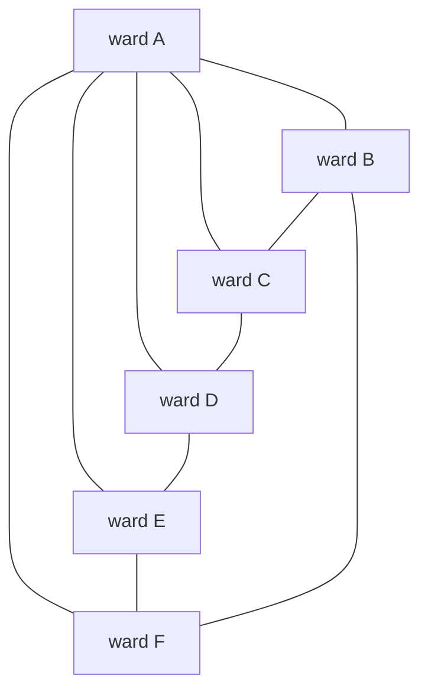

# Colouring maps: five colours always suffice by a short argument, four by a famous long one

[Syllabus](../../../SYLLABUS.md) → [Combinatorics and graphs](../../../SYLLABUS.md#w04) → [Planarity and Colouring](../../../SYLLABUS.md#w04-s12) → Colouring maps

---

## General Overview

A council prints a wall map of its twelve wards, lettered A to L. Ward A sits in the middle, five wards ring it — B, C, D, E, F — and six wrap round the outside: G, H, I, J, K, L. Wards sharing a stretch of border need different inks, or the border vanishes on the sheet.

Four inks do it: A 1, B 2, C 3, D 2, E 3, F 4, G 1, H 2, I 1, J 4, K 1, L 3. Three do not, and the reason is on the sheet: the five wards ringing A close a ring of odd length, so two inks cannot alternate right round it and the ring alone takes three; A borders all five and takes a fourth.

Four is not this map's luck: every map drawn flat takes four inks, however many regions it holds — the four colour theorem, settled in 1976 by a machine check no person has read end to end. Five inks need an evening and a pencil.

**Every map drawn flat can be shaded with five colours by an argument that fits on a page, and with four by a proof that fits only inside a computer.**

**What kind of fact this is:** two theorems. Five colours is proved on this card in Why it works. Four colours is stated, not proved here; the code shades one map, which is not the theorem.

### The picture: the ring of five that forces a fourth ink



A and its ring, all ten borders between them. Outside, G H I J K L close a ring of six, reaching inward: G to B and C, H to C, I to C and D, J to D and E, K to E and F, L to F and B. Twelve wards, 27 borders.

---

## The formula

The map becomes a network, written $G$: a dot per ward, a line per shared stretch of border ([Colouring](03-vertex-colouring-and-chromatic-number.md)). $V$ counts its dots, $E$ its lines, and a dot's **degree** is how many lines meet it. The **chromatic number** of $G$ is the fewest colours its dots can take with no line's two ends alike, written with the Greek letter chi.

$$\chi(G) \le 5 \qquad\text{and}\qquad \chi(G) \le 4 \qquad\text{for every planar } G$$

**Read it aloud:** a network drawn flat without crossings never needs a sixth colour, and in fact never a fifth.

| Symbol | Plain meaning | In our example | Push it up and the answer… |
| --- | --- | --- | --- |
| $G$ | the network drawn from the map | 12 dots, 27 lines | — |
| $V$ | dots, one per ward | 12 | neither 5 nor 4 moves |
| $E$ | lines, one per border | 27 | past $3V - 6$ it is not flat |
| $\chi$ | fewest colours that work | 4 | — |
| $v$ | one dot, one ward | A, H | — |
| $\deg$ | a dot's degree: lines at it | A 5, C 6, H 3 | busier dots block more inks |

### When it holds

- **Drawn flat, no crossings.** The count belongs to the sheet and the sphere; on a doughnut it rises to seven.
- **Each region in one piece, borders that are stretches, not points.** A ward printed as two patches sharing one ink can force a fifth; wards meeting at a corner are not neighbours.
- **At least three regions.** Below three dots the bound $E \le 3V - 6$ does not start ([Why some graphs cannot be drawn flat](02-edge-bound-and-kuratowski.md)).

---

## Why it works

### Step 0: shading the dots puts flat drawings behind the question

Colouring the map is colouring the dots of its network, so every fact about flat drawings bears on inks ([Planar graphs](01-planar-graphs-and-eulers-formula.md)). The first: a flat drawing cannot be crowded, $E \le 3V - 6$.

### Step 1: some ward has at most five neighbours

Every line has two ends, so the degrees added up over all the dots $v$ — what the sigma sign says to do — count each line twice:

$$2E = \sum_{v} \deg(v) \le 6V - 12$$

That averages under six lines a dot, and whole numbers cannot all sit above their average, so some dot has degree 5 or less. Here the degrees add to 54 against a ceiling of 60, the average is 4.50, and the least busy ward, H, has 3.

### Step 2: six colours, by lifting one ward out

Lift out a ward with at most five neighbours — Step 1 promises one. What remains is still flat, so assume six inks shade it. Put the ward back: its neighbours wear five inks at most, so a sixth is free. Six wards or fewer get an ink apiece, where the induction stops ([Induction](../../01-Foundations/06-Proof/04-proof-by-induction.md)).

The code runs that proof: lift the least busy ward over and over, never finding one with more than 3 borders left at its lift, then shade back in reverse to A4 B1 C2 D1 E3 F2 G4 H1 I3 J2 K1 L3 — four inks, well under six.

### Step 3: five colours, by trading two inks along a chain

Five neighbours block five inks, which is why six was easy. One case is hard: the five wear five different inks. Two of them not side by side round A must still share no border: five mutually bordering dots need 10 lines and five flat dots allow 9, and a B–D border would fence C off from E, leaving that pair free instead.

Lift out A. Its neighbours, in the order they sit round it, are B, C, D, E, F; give them inks 1 to 5 and fill the outer ring as G 3, H 1, I 4, J 1, K 2, L 4. No ink is left for A.

Here B and D share no border. Follow the wards wearing ink 1 or ink 3 from B: B (1) borders G (3), G borders H (1), and it ends — a **Kempe chain**, wards wearing two inks, linked border to border, followed as far as it goes. D wears 3 and is off it, so trade the two inks along the chain: B becomes 3, G becomes 1, H becomes 3. Borders inside it still hold two inks, both ends having moved, and a border leaving it ends on a ward wearing neither. A's neighbours now wear 3, 2, 3, 4, 5, so ink 1 is free.

Had the chain reached D, nothing would be freed. But a chain of 1s and 3s from B to D, closed by A's two lines, pens C inside with E outside, so no chain of 2s and 4s runs from C to E: trading those frees ink 2 instead.

<details>
<summary>Detailed proof: from this map to every flat map</summary>

Induct on the number of dots. Five or fewer: one colour each. Otherwise delete a dot v of degree at most 5 — Step 1 promises one — shade the rest by induction, and restore v. A colour is free unless v's five neighbours wear five colours.

In that case run the steps above with v for A. Name the neighbours P, Q, R, S, T in the order their lines leave v; some pair not side by side is unjoined, since a line P–R would fence Q off from S. Trade 1 and 3 along P's chain, or, if that chain reaches R, trade 2 and 4 along Q's instead, which the closed curve through v keeps clear of S. Only the Jordan curve theorem is taken on trust.

</details>

### Step 4: four colours, and what kind of proof it has

Alfred Kempe published a proof of four colours in 1879 using this chain; Percy Heawood found the hole in 1890. With four inks the trade needs two chains, which can share wards, so the second can undo the first. What survived is Step 3.

Appel and Haken closed the gap in 1976 with a finite check: a list of local patterns every flat map must contain one of, each shadeable once a smaller map is, leaving no smallest unshadeable map. Their list held nearly two thousand patterns, later trimmed to 1,476, and took about twelve hundred hours of machine time. Robertson, Sanders, Seymour and Thomas rebuilt it in 1997 with 633; Gonthier redid it inside a proof assistant in 2005, so a program now certifies every step.

---

## Worked numbers, by hand

Ward by ward in alphabetical order, each taking the lowest ink no shaded neighbour wears.

| Step | Arithmetic | Value |
| --- | --- | --- |
| A, B, C | nothing blocked; A blocks 1; A, B block 1, 2 | 1, 2, 3 |
| D, E, F | A, C block 1, 3; A, D block 1, 2; A, B, E block 1, 2, 3 | 2, 3, 4 |
| G, H, I | B, C block 2, 3; C, G block 3, 1; C, D, H block 3, 2 | 1, 2, 1 |
| J, K, L | D, E, I block 2, 3, 1; E, F, J block 3, 4; B, F, G, K block 2, 4, 1 | 4, 1, 3 |
| inks used | no shading with three exists | **4** |

The wall map prints in four inks, and an exhaustive count finds 1,008 ways to do it and none with three.

### What breaks if you drop a piece

| Mistake | Comes out at | What went wrong |
| --- | --- | --- |
| Three inks tried | 0 of 531,441 shadings | The odd ring needs three, A a fourth |
| Shading L back to A, not A to L | 5 inks | The rule follows the order given |
| Trading between B and C, which do border | 0 inks free for A | The chain takes C along: both ends move |

The code prints all three.

---

## Code, from first principles, and it actually runs

Nothing is imported. Each ward's neighbours are listed both ways round, so a typo in one row contradicts another. Four inks arrive by three roads sharing no arithmetic: the six-colour proof run as a program, the by-hand walk above, and an exhaustive count with one to four inks, which settles the minimum rather than bounding it. The hard case runs last, the failed trade beside the good one.

### Python

```python
# Five and four colour theorems -- the check behind the card.  Nothing is imported.  The
# map is 12 council wards: the centre A, the ring B C D E F round it, the outer ring G H
# I J K L.  Every ward's neighbours are listed both ways round, so the list checks itself.
# Four colours are reached three ways -- the six-colour peel run as a program, by hand in
# alphabetical order, and an exhaustive search that also settles three -- and then the
# five-colour proof's Kempe swap is run on the hard case, A's five neighbours in five colours.
MAP = {"A": "BCDEF", "B": "ACFGL", "C": "ABDGHI", "D": "ACEIJ", "E": "ADFJK", "F": "ABEKL",
       "G": "BCHL", "H": "CGI", "I": "CDHJ", "J": "DEIK", "K": "EFJL", "L": "BFGK"}
RING, OUT = "BCDEF", "GHIJKL"
def free(g, col, v, k):                     # the colours 1 to k no neighbour of v wears
    return [c for c in range(1, k + 1) if c not in {col.get(u) for u in g[v]}]
def proper(g, col):                         # no border with one colour on both sides
    return all(col[u] != col[v] for u in g for v in g[u] if u in col and v in col)
def greedy(g, order, col):                  # each ward in turn takes its lowest free colour
    col = dict(col)
    for v in order: col[v] = free(g, col, v, 9)[0]
    return col
def peel(g):                                # lift out the least busy ward, over and over
    left, out = dict(g), []
    while left:
        v = min(left, key=lambda u: (len(left[u]), u)); out.append(f"{v}{len(left[v])}")
        left = {a: left[a].replace(v, "") for a in left if a != v}
    return out
def count(g, k, col):                       # how many proper colourings with k colours
    rest = [v for v in g if v not in col]
    if not rest: return 1
    return sum(count(g, k, {**col, rest[0]: c}) for c in free(g, col, rest[0], k))
def chain(g, col, v, a, b):                 # the wards reached from v through colours a and b
    seen, stack = {v}, [v]
    while stack:
        for w in g[stack.pop()]:
            if w not in seen and col.get(w) in (a, b): seen.add(w); stack.append(w)
    return "".join(sorted(seen))
def swap(col, comp, a, b):                  # trade colours a and b all along one chain
    return {v: ({a: b, b: a}.get(c, c) if v in comp else c) for v, c in col.items()}
def show(col): return " ".join(f"{v}{col[v]}" for v in sorted(col))
def yn(c): return "yes" if c else "no"
DEG = {v: len(MAP[v]) for v in MAP}; V, E = len(MAP), sum(DEG.values()) // 2
peeled = peel(MAP); back = greedy(MAP, "".join(p[0] for p in reversed(peeled)), {})
hand, rev = greedy(MAP, "".join(sorted(MAP)), {}), greedy(MAP, "".join(sorted(MAP, reverse=True)), {})
counts = [count(MAP, k, {}) for k in (1, 2, 3, 4)]
hard = greedy(MAP, OUT, {v: i + 1 for i, v in enumerate(RING)})
kch, bad = chain(MAP, hard, "B", 1, 3), chain(MAP, hard, "B", 1, 2)
fixed, badfix = swap(hard, kch, 1, 3), swap(hard, bad, 1, 2)
five = {**fixed, "A": free(MAP, fixed, "A", 5)[0]}
print(f"the ward map: V = {V} wards, E = {E} borders, at most 3V - 6 = {3 * V - 6}; borders per ward {show(DEG)}, adding to {2 * E} = 2E, at most 6V - 12 = {6 * V - 12}, fewest {min(DEG.values())}, average {2 * E / V:.2f}")
print(f"road 1, lift out the least busy ward over and over: {' '.join(peeled)}; most borders at a lift {max(int(p[1:]) for p in peeled)}, the promise is 5\n  put them back in reverse, lowest free colour each time: {show(back)}, colours used {max(back.values())}, proper: {yn(proper(MAP, back))}")
print(f"road 2, by hand A to L, lowest free colour: {show(hand)}, colours used {max(hand.values())}, proper: {yn(proper(MAP, hand))}")
print(f"road 3, exhaustive: proper colourings with 1, 2, 3, 4 colours: {counts}; fewest colours that work {min(k for k in (1, 2, 3, 4) if counts[k - 1])}")
print(f"the hard case, A lifted out and its ring given five colours: {show(hard)}; colours free for A: {len(free(MAP, hard, 'A', 5))}\n  the {len(RING)} ring wards all bordering each other would need {len(RING) * (len(RING) - 1) // 2} lines, past the {3 * len(RING) - 6} a flat drawing on {len(RING)} dots allows")
print(f"  the 1-and-3 chain from B: {kch}; does it reach D, wearing 3: {yn('D' in kch)}\n  swap 1 and 3 along it: {show({v: fixed[v] for v in kch})}, whole map still proper: {yn(proper(MAP, fixed))}, colours free for A: {free(MAP, fixed, 'A', 5)}")
print(f"five colours over the whole map: {show(five)}, proper: {yn(proper(MAP, five))}, colours used {len(set(five.values()))}")
print(f"mistake 1, three colours on this map: {counts[2]} of {3 ** V} shadings proper\nmistake 2, the swap run on the neighbours B and C: the 1-and-2 chain {bad} takes C along, colours free for A still {len(free(MAP, badfix, 'A', 5))}")
print(f"mistake 3, colouring L back to A instead: {show(rev)}, colours used {max(rev.values())}")
assert min(DEG.values()) <= 5 and E <= 3 * V - 6 and all(v in MAP[u] for v in MAP for u in MAP[v])
assert proper(MAP, hand) and proper(MAP, back) and max(hand.values()) == 4 and counts[2] == 0 and counts[3] > 0
assert "D" not in kch and proper(MAP, fixed) and free(MAP, fixed, "A", 5) == [1] and proper(MAP, five) and len(set(five.values())) == 5
assert "C" in bad and free(MAP, badfix, "A", 5) == [] and max(rev.values()) == 5 and min(k for k in (1, 2, 3, 4) if counts[k - 1]) == max(hand.values())
print("ALL CHECKS PASS")
```

**Ran 2026-09-19 on macOS, Python 3.14.6, standard library only. All checks passed. Output, pasted from the run:**

```
the ward map: V = 12 wards, E = 27 borders, at most 3V - 6 = 30; borders per ward A5 B5 C6 D5 E5 F5 G4 H3 I4 J4 K4 L4, adding to 54 = 2E, at most 6V - 12 = 60, fewest 3, average 4.50
road 1, lift out the least busy ward over and over: H3 G3 I3 C3 B3 L2 A3 D2 F2 E2 J1 K0; most borders at a lift 3, the promise is 5
  put them back in reverse, lowest free colour each time: A4 B1 C2 D1 E3 F2 G4 H1 I3 J2 K1 L3, colours used 4, proper: yes
road 2, by hand A to L, lowest free colour: A1 B2 C3 D2 E3 F4 G1 H2 I1 J4 K1 L3, colours used 4, proper: yes
road 3, exhaustive: proper colourings with 1, 2, 3, 4 colours: [0, 0, 0, 1008]; fewest colours that work 4
the hard case, A lifted out and its ring given five colours: B1 C2 D3 E4 F5 G3 H1 I4 J1 K2 L4; colours free for A: 0
  the 5 ring wards all bordering each other would need 10 lines, past the 9 a flat drawing on 5 dots allows
  the 1-and-3 chain from B: BGH; does it reach D, wearing 3: no
  swap 1 and 3 along it: B3 G1 H3, whole map still proper: yes, colours free for A: [1]
five colours over the whole map: A1 B3 C2 D3 E4 F5 G1 H3 I4 J1 K2 L4, proper: yes, colours used 5
mistake 1, three colours on this map: 0 of 531441 shadings proper
mistake 2, the swap run on the neighbours B and C: the 1-and-2 chain BCH takes C along, colours free for A still 0
mistake 3, colouring L back to A instead: A1 B5 C4 D3 E4 F3 G2 H1 I2 J1 K2 L1, colours used 5
ALL CHECKS PASS
```

### Rust

Same numbers, same labels, built with `rustc --edition 2021 -O`.

```rust
// Five and four colour theorems -- the same check as the Python, in Rust.  No crates.  The map is 12
// council wards: the centre A, the ring B C D E F round it, the outer ring G H I J K L, each ward's
// neighbours listed both ways round.  Four colours are reached three ways -- the six-colour peel run
// as a program, by hand in alphabetical order, and an exhaustive search that also settles three --
// then the Kempe swap is run on the five-colour proof's hard case.
use std::collections::{BTreeMap, BTreeSet};
type G = BTreeMap<char, Vec<char>>;
type Col = BTreeMap<char, i64>;
const WARDS: [(char, &str); 12] = [('A', "BCDEF"), ('B', "ACFGL"), ('C', "ABDGHI"), ('D', "ACEIJ"),
    ('E', "ADFJK"), ('F', "ABEKL"), ('G', "BCHL"), ('H', "CGI"), ('I', "CDHJ"), ('J', "DEIK"),
    ('K', "EFJL"), ('L', "BFGK")];
const RING: &str = "BCDEF"; const OUT: &str = "GHIJKL";
// the colours 1 to k no neighbour of v wears
fn free(g: &G, col: &Col, v: char, k: i64) -> Vec<i64> { (1..=k).filter(|c| !g[&v].iter().any(|u| col.get(u) == Some(c))).collect() }
// no border with one colour on both sides
fn proper(g: &G, col: &Col) -> bool { g.iter().all(|(u, ns)| ns.iter().all(|v| col.get(u).is_none() || col.get(v).is_none() || col[u] != col[v])) }
fn greedy(g: &G, order: &str, col: &Col) -> Col {           // each ward in turn takes its lowest free colour
    let mut col = col.clone();
    for v in order.chars() { let c = free(g, &col, v, 9)[0]; col.insert(v, c); }
    col
}
fn peel(g: &G) -> Vec<String> {                             // lift out the least busy ward, over and over
    let (mut left, mut out) = (g.clone(), Vec::new());
    while !left.is_empty() {
        let v = *left.iter().min_by_key(|(u, ns)| (ns.len(), **u)).unwrap().0;   // ties go to the earlier letter
        out.push(format!("{}{}", v, left[&v].len()));
        left = left.iter().filter(|(a, _)| **a != v).map(|(a, ns)| (*a, ns.iter().copied().filter(|b| *b != v).collect())).collect();
    }
    out
}
fn count(g: &G, k: i64, col: &Col) -> i64 {                 // how many proper colourings with k colours
    match g.keys().find(|v| !col.contains_key(v)) {         // the first ward still uncoloured
        None => 1,
        Some(&v) => free(g, col, v, k).iter().map(|&c| { let mut n = col.clone(); n.insert(v, c); count(g, k, &n) }).sum() } }
fn chain(g: &G, col: &Col, v: char, a: i64, b: i64) -> String {   // the wards reached from v through colours a and b
    let (mut seen, mut stack) = (BTreeSet::from([v]), vec![v]);
    while let Some(u) = stack.pop() {
        for w in g[&u].clone() { if !seen.contains(&w) && [Some(&a), Some(&b)].contains(&col.get(&w)) { seen.insert(w); stack.push(w); } }
    }
    seen.iter().collect()
}
// trade colours a and b all along one chain
fn swap(col: &Col, comp: &str, a: i64, b: i64) -> Col { col.iter().map(|(v, &c)| (*v, if !comp.contains(*v) { c } else if c == a { b } else if c == b { a } else { c })).collect() }
fn show(col: &Col) -> String { col.iter().map(|(v, c)| format!("{}{}", v, c)).collect::<Vec<String>>().join(" ") }
fn yn(c: bool) -> &'static str { if c { "yes" } else { "no" } }
fn main() {
    let map: G = WARDS.iter().map(|(v, ns)| (*v, ns.chars().collect())).collect();
    let (none, deg): (Col, Col) = (BTreeMap::new(), map.iter().map(|(v, ns)| (*v, ns.len() as i64)).collect());
    let (nv, ne) = (map.len() as i64, deg.values().sum::<i64>() / 2);   // lines counted once
    let peeled = peel(&map);   // the lifting order, each ward with the borders it still had
    let order: String = peeled.iter().rev().map(|p| p.chars().next().unwrap()).collect();   // put back in reverse
    let (back, hand) = (greedy(&map, &order, &none), greedy(&map, "ABCDEFGHIJKL", &none));
    let (rev, counts) = (greedy(&map, "LKJIHGFEDCBA", &none), (1..=4).map(|k| count(&map, k, &none)).collect::<Vec<i64>>());
    let fewest = (1..=4).find(|&k| counts[k as usize - 1] > 0).unwrap();   // the chromatic number, road 3
    let seed: Col = RING.chars().enumerate().map(|(i, v)| (v, i as i64 + 1)).collect();   // the ring in five colours
    let hard = greedy(&map, OUT, &seed);   // the outer ring filled in round it, still no colour for A
    let (kch, bad) = (chain(&map, &hard, 'B', 1, 3), chain(&map, &hard, 'B', 1, 2));   // the good pair, then the bad
    let (fixed, badfix) = (swap(&hard, &kch, 1, 3), swap(&hard, &bad, 1, 2));
    let mut five = fixed.clone(); five.insert('A', free(&map, &fixed, 'A', 5)[0]);   // A takes the freed colour
    let swapped: Col = kch.chars().map(|v| (v, fixed[&v])).collect();   let (used, inks) = (|c: &Col| *c.values().max().unwrap(), |c: &Col| c.values().collect::<BTreeSet<&i64>>().len());
    println!("the ward map: V = {} wards, E = {} borders, at most 3V - 6 = {}; borders per ward {}, adding to {} = 2E, at most 6V - 12 = {}, fewest {}, average {:.2}",
             nv, ne, 3 * nv - 6, show(&deg), 2 * ne, 6 * nv - 12, deg.values().min().unwrap(), 2.0 * ne as f64 / nv as f64);
    println!("road 1, lift out the least busy ward over and over: {}; most borders at a lift {}, the promise is 5\n  put them back in reverse, lowest free colour each time: {}, colours used {}, proper: {}",
             peeled.join(" "), peeled.iter().map(|p| p[1..].parse::<i64>().unwrap()).max().unwrap(), show(&back), used(&back), yn(proper(&map, &back)));
    println!("road 2, by hand A to L, lowest free colour: {}, colours used {}, proper: {}", show(&hand), used(&hand), yn(proper(&map, &hand)));
    println!("road 3, exhaustive: proper colourings with 1, 2, 3, 4 colours: {:?}; fewest colours that work {}", counts, fewest);
    println!("the hard case, A lifted out and its ring given five colours: {}; colours free for A: {}\n  the {} ring wards all bordering each other would need {} lines, past the {} a flat drawing on {} dots allows",
             show(&hard), free(&map, &hard, 'A', 5).len(), RING.len(), RING.len() * (RING.len() - 1) / 2, 3 * RING.len() - 6, RING.len());
    println!("  the 1-and-3 chain from B: {}; does it reach D, wearing 3: {}\n  swap 1 and 3 along it: {}, whole map still proper: {}, colours free for A: {:?}",
             kch, yn(kch.contains('D')), show(&swapped), yn(proper(&map, &fixed)), free(&map, &fixed, 'A', 5));
    println!("five colours over the whole map: {}, proper: {}, colours used {}", show(&five), yn(proper(&map, &five)), inks(&five));
    println!("mistake 1, three colours on this map: {} of {} shadings proper\nmistake 2, the swap run on the neighbours B and C: the 1-and-2 chain {} takes C along, colours free for A still {}",
             counts[2], 3i64.pow(nv as u32), bad, free(&map, &badfix, 'A', 5).len());
    println!("mistake 3, colouring L back to A instead: {}, colours used {}", show(&rev), used(&rev));
    assert!(*deg.values().min().unwrap() <= 5 && ne <= 3 * nv - 6 && map.iter().all(|(v, ns)| ns.iter().all(|u| map[u].contains(v))));
    assert!(proper(&map, &hand) && proper(&map, &back) && used(&hand) == 4 && counts[2] == 0 && counts[3] > 0);
    assert!(!kch.contains('D') && proper(&map, &fixed) && free(&map, &fixed, 'A', 5) == vec![1] && proper(&map, &five) && inks(&five) == 5);
    assert!(bad.contains('C') && free(&map, &badfix, 'A', 5).is_empty() && used(&rev) == 5 && fewest == used(&hand));
    println!("ALL CHECKS PASS");
}
```

**Ran 2026-09-19 on macOS, rustc 1.98.1, no crates. All checks passed. Output, pasted from the run:**

```
the ward map: V = 12 wards, E = 27 borders, at most 3V - 6 = 30; borders per ward A5 B5 C6 D5 E5 F5 G4 H3 I4 J4 K4 L4, adding to 54 = 2E, at most 6V - 12 = 60, fewest 3, average 4.50
road 1, lift out the least busy ward over and over: H3 G3 I3 C3 B3 L2 A3 D2 F2 E2 J1 K0; most borders at a lift 3, the promise is 5
  put them back in reverse, lowest free colour each time: A4 B1 C2 D1 E3 F2 G4 H1 I3 J2 K1 L3, colours used 4, proper: yes
road 2, by hand A to L, lowest free colour: A1 B2 C3 D2 E3 F4 G1 H2 I1 J4 K1 L3, colours used 4, proper: yes
road 3, exhaustive: proper colourings with 1, 2, 3, 4 colours: [0, 0, 0, 1008]; fewest colours that work 4
the hard case, A lifted out and its ring given five colours: B1 C2 D3 E4 F5 G3 H1 I4 J1 K2 L4; colours free for A: 0
  the 5 ring wards all bordering each other would need 10 lines, past the 9 a flat drawing on 5 dots allows
  the 1-and-3 chain from B: BGH; does it reach D, wearing 3: no
  swap 1 and 3 along it: B3 G1 H3, whole map still proper: yes, colours free for A: [1]
five colours over the whole map: A1 B3 C2 D3 E4 F5 G1 H3 I4 J1 K2 L4, proper: yes, colours used 5
mistake 1, three colours on this map: 0 of 531441 shadings proper
mistake 2, the swap run on the neighbours B and C: the 1-and-2 chain BCH takes C along, colours free for A still 0
mistake 3, colouring L back to A instead: A1 B5 C4 D3 E4 F3 G2 H1 I2 J1 K2 L1, colours used 5
ALL CHECKS PASS
```

The two outputs match line for line.

> [!TIP]
> **Try changing**
> Guess first, then run it. The asserts are pinned to this map, so expect one to stop the program.
> - **Trade from the other end.** Follow the chain from D, not B: it runs D, J and frees ink 3, not ink 1.
> - **Give the ring a repeated ink.** Seed it 1, 2, 1, 3, 4: ink 5 is free at once, no chain needed.
> - **Lift ward A out for good.** Delete its row and strike A from the others: three inks still shade nothing, the outer ring's inward borders keeping the odd ring boxed in.

---

## The usual mistake

> [!warning]
> **Reading four as a requirement.** It is a ceiling, not a demand: this map needs four, a row of three regions needs two, nothing flat needs more.
>
> - **Expecting every region to have at most five neighbours.** The promise is that one does. Ward C has six.
> - **Trusting the chain trade at four inks.** Step 4 says why it fails: two chains can share wards, and the second undoes the first.
> - **Recolouring one ward, not a whole chain.** Moving B's ink alone leaves a clash: the trade runs to the chain's end or not at all.

---

## Where you meet it in real life

- **Printed maps and atlases.** The question began there: Francis Guthrie noticed in 1852, colouring the counties of England, that four inks always sufficed.
- **Shaded data maps.** Four tints keep neighbouring districts distinct, leaving the rest of the palette to carry the data.
- **Timetables and register allocation.** The same machinery runs on clash networks nowhere near flat, where four is no help ([Colouring](03-vertex-colouring-and-chromatic-number.md), [Edge colouring](06-edge-colouring-and-round-robin.md)).

> **Say it back**
> Turn a map into a network: a dot per region, a line per shared border. A flat drawing cannot be crowded, so some dot has five lines or fewer. Lift it out, shade the rest, put it back: five neighbours block five colours, so six always work. Five work too, by trading two colours along a chain of regions wearing them, freeing a colour for the dot that had none. Four work as well, but only by a machine check of hundreds of patterns.

---

## What this builds on

- [Why some graphs cannot be drawn flat](02-edge-bound-and-kuratowski.md): the ceiling $E \le 3V - 6$, and why five mutually bordering regions are not flat.
- [Colouring](03-vertex-colouring-and-chromatic-number.md): the map-to-network step, and the count this card bounds.
- [Induction](../../01-Foundations/06-Proof/04-proof-by-induction.md): why settling small maps and one lifted region settles all.

## Where this goes next

- [Edge colouring](06-edge-colouring-and-round-robin.md): colouring the borders instead of the regions, where the busiest ward, not flatness, sets the count.

The question left open is about proofs, not maps: nobody knows whether four colours can be settled in a way one person could read.

---

## Sources

Verified 19 Sep 2026: every link below resolves and names the work cited.

- Diestel, Reinhard. *Graph Theory*, 5th ed. Springer, 2017. [Publisher page](https://link.springer.com/book/10.1007/978-3-662-53622-3). Chapter 5 proves five colours and states four.
- Appel, K., and W. Haken. "Every planar map is four colorable. Part I: Discharging." *Illinois Journal of Mathematics* 21, no. 3 (1977): 429–490. [doi:10.1215/ijm/1256049011](https://doi.org/10.1215/ijm/1256049011). The 1976 proof.
- Thomas, Robin. "An Update on the Four-Color Theorem." *Notices of the American Mathematical Society* 45, no. 7 (1998): 848–859. [Author's copy](https://thomas.math.gatech.edu/PAP/update.pdf). Guthrie's 1852 question, and both pattern counts, 1,476 then 633.
- Gonthier, Georges. *The Four Color Theorem*, formal proof in Coq, 2005. [Library and full source](https://github.com/coq-community/fourcolor). The machine-checked proof itself.
