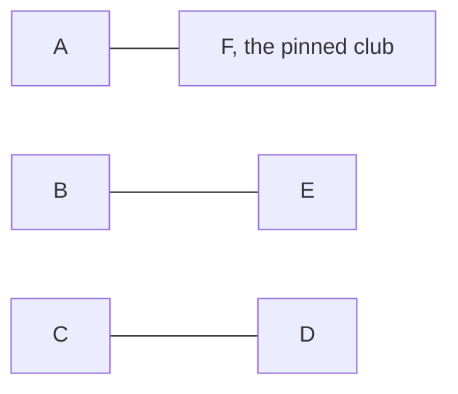

# Edge colouring: colour the edges so no two at a vertex match, and a league fixture list is exactly this

[Syllabus](../../../SYLLABUS.md) → [Combinatorics and graphs](../README.md) → [Planarity and Colouring](../README.md#s12) → Edge colouring

---

## General Overview

Six clubs in a league: A, B, C, D, E, F. Everyone plays everyone once — 15 matches — and no club plays twice on the same weekend. How few weekends does the season need?

Five. Each club has five opponents and plays one a weekend, and six clubs make at most three matches at a time: 15 matches need five weekends of three.

Strip the league to dots and lines: a dot per club, a line per match ([Graphs](../09-Graphs%20-%20Dots%20and%20Lines/01-graphs-vertices-and-edges.md)). Paint each match with its weekend's colour, and "no club plays twice a weekend" reads: no two lines of one colour meet at a dot. That is an **edge colouring**; the fewest colours that work is the **chromatic index**. ([Colouring](03-vertex-colouring-and-chromatic-number.md) does the same for dots.)

**The lines of a network need as many colours as the busiest dot has lines, or exactly one more; a league with an even number of clubs needs only that count, built by pinning one club and rotating the rest.**

**What kind of fact this is:** a theorem — Vizing's bound, stated here and proved in the sources; König's equality, proved below. The chromatic index is a definition, the rotation a method.

### The picture: one weekend, three matches



The season's first weekend, built below; four more of this shape finish it.

---

## The formula

Notation first. A capital Greek delta before a network's name, $\Delta(G)$, is its largest degree: the busiest dot's line count, read "delta of G" ([Degrees and the handshaking lemma](../09-Graphs%20-%20Dots%20and%20Lines/02-degree-and-handshaking.md)). The chromatic index is a primed chi, $\chi'(G)$, read "chi prime of G": the fewest colours in a **proper** edge colouring, where no two lines of a colour meet at a dot. Plain chi is the dot version. And $K_n$ is the **complete network**: all $n$ dots pairwise joined.

Vizing's theorem, 1964:

$$\Delta(G) \;\le\; \chi'(G) \;\le\; \Delta(G) + 1$$

**Read it aloud:** the lines need as many colours as the busiest dot has lines, or one more, and nothing else.

Two exact answers sit inside it. A **bipartite** network splits its dots into two sides with every line crossing between them — teachers one side, classes the other ([Bipartite graphs](../09-Graphs%20-%20Dots%20and%20Lines/05-bipartite-graphs-and-odd-cycles.md)). There the lower end always holds: König, 1916.

$$\chi'(G) = \Delta(G) \quad \text{for bipartite } G, \qquad \chi'(K_n) = n - 1 \ \text{ for even } n, \qquad \chi'(K_n) = n \ \text{ for odd } n \ge 3$$

Six clubs: busiest count 5, chromatic index 5, five weekends. Five clubs: busiest count 4, chromatic index 5 — five weekends still, one resting.

| Symbol | Plain meaning | In our example | Push it up and the answer… |
| --- | --- | --- | --- |
| $n$ | how many dots in the network | 6 | more matches |
| $\Delta(G)$ | the busiest dot's line count | 5 | the floor rises |
| $\chi'(G)$ | fewest colours for the lines | 5 | — |
| $K_n$ | all $n$ dots pairwise joined | the league | — |
| $i$, $j$, $k$ | two rotating labels, and the weekend | A is 0, E is 4; weekends 0 to 4 | — |

### When it holds

- **No pair meets twice.** A triangle whose every pair plays twice has six matches all touching: six colours, where the bound promises five.
- **Bipartite, or no promise.** An odd cycle — a closed run of an odd number of lines — ends König's guarantee; the five-club league spends the spare colour.
- **Which of the two, Vizing does not say.** No quick test for choosing between three colours and four is known (Holyer, 1981), so the code below searches.

---

## Why it works

### Step 0: one colour is a set of matches with no club in common

Matches sharing a colour meet at no dot, so no two share a club. A set of lines, no two meeting, is a **matching**, so an edge colouring cuts the match list into matchings, one per colour.

### Step 1: the busiest dot sets the floor

Five lines meet the dot A and any two of them meet there, so all five differ in colour: the chromatic index is at least the busiest dot's line count, in every network.

### Step 2: an odd club count raises the floor again

A matching leaves no dot with two lines, so an odd dot count always leaves one dot out. Five clubs have 10 matches and no weekend holds more than 2, so 5 weekends are needed although the busiest club has 4 opponents: Vizing's upper end, exactly, 5 = 4 + 1.

Six clubs are even: 15 matches at 3 a weekend is 5, Step 1's floor again — the first sign 5 can be built.

### Step 3: the rotation builds the five weekends

Sit F out of the wheel: F is the **pin**, playing every weekend and never moving. Put A, B, C, D, E round a circle with labels 0 to 4, number the weekends $k = 0$ to 4, and wrap label arithmetic at 5.

$$\text{weekend } k: \quad \text{the pin meets label } k, \quad \text{and labels } i \text{ and } j \text{ meet when } i + j \equiv 2k \ (\mathrm{mod}\ 5)$$

Weekend 0: the pin meets label 0, A; labels adding to 0 are 1 + 4 and 2 + 3, so B-E and C-D — the picture above.

**Nothing clashes.** Any label but $k$ has one partner, $2k$ minus itself, which is the label itself only when the label is $k$ — already booked against the pin. Every club plays once, three matches a weekend.

**Every match happens, once.** Two labels fix their weekend, since $2k$ must be their sum, and multiplying by 2 can be undone at 5, because 3 times 2 leaves 1: multiply the sum by 3 and $k$ comes back. A and B add to 1, so $k$ is 3, the fourth weekend. Five weekends of three is 15 — every pair once.

Doubling undoes only when the rotating count is odd, which is what the pin is for: rotate all six and only even label sums ever come up — 6 of the 15 matches, and A never meets B.

### Step 4: Vizing's bound, stated

The lower end is Step 1. The upper end — one spare colour, never two — is Vizing's theorem; its proof rebuilds a fan of lines round one end of a bare line, then swaps two colours along a path. Bondy and Murty give it in full (Sources). Both ends are reached: six clubs the lower, five the upper.

### Step 5: bipartite networks never need the spare colour

Teachers one side, classes the other, a line per lesson owed. Induct on the line count: take a line off and colour the rest with the busiest count — taking one off cannot raise that count, so induction allows it — then put it back and call its ends u and v. Each end now carries fewer lines than there are colours, so some colour is absent at u — red — and some at v — blue. Absent at both: paint the bare line blue.

Otherwise u has a blue line. Walk out along it, then a red line, then alternate until the colours run out. That walk cannot reach v, so swap red and blue along it: the blue line at u turns red, blue is now absent at both ends, and the bare line takes it.

<details>
<summary>Detailed proof: why the walk misses v, and why the swap is safe</summary>

Keep only the red and blue lines: every dot carries at most one of each, so the pieces are paths and cycles, and the piece holding u is a path with u at one end, its lines reading blue, red, blue, red.

Had it reached v, the line there would be red, since v has no blue line, and red lines sit at even positions — so the path would be even in length, and an even walk in a bipartite network ends on the side it began, while u and v are joined. The swap is safe: interior dots trade one red line for one blue, and each end's line moves into a gap already there.

</details>

<details>
<summary>The fixture grid is a Latin square</summary>

In the grid the code prints, `A . 4 2 5 3 1` says A meets B in round 4, C in 2, D in 5, E in 3, F in 1. Every row holds rounds 1 to 5 once, and every column too, the grid reading the same across the diagonal; a sixth symbol in each diagonal blank then makes a **Latin square** of order 6 — every symbol once per row and column.

</details>

---

## Worked numbers, by hand

| Step | Arithmetic | Value |
| --- | --- | --- |
| the matches | 6 × 5, halved | **15** |
| the two floors | 6 − 1 lines at one dot; 15 at 3 a weekend | at least 5 |
| the rotation | labels summing to twice the weekend | **5 weekends of 3** |
| a search, no formula | fewest colours, 15 lines | **5** |
| five clubs instead | 10 matches, 2 a weekend | **5 weekends** |

Five weekends run the season for six clubs, and five for five, one club resting each weekend — Vizing's spare colour.

### What breaks if you drop a piece

| Mistake | Comes out at | What went wrong |
| --- | --- | --- |
| All six rotating, none pinned | 6 of the 15 matches | Doubling needs an odd count; A never meets B |
| The season squeezed into 4 weekends | 12 slots for 15 | 3 short: Step 2 forbids it |
| The busiest count read as five clubs' answer | 4 weekends, 8 slots for 10 matches | An odd count caps a weekend at 2 |

The code prints all three.

---

## Code, from first principles, and it actually runs

Nothing is imported. The code says teams and rounds for clubs and weekends, numbering them 1 to 5. Road one is the rotation's closed form; road two is a backtracking search that knows no formula, trying one colour, then two, until every line is coloured. The roads meet at 5. It also settles the five-club league, a doubled triangle, and two censuses — 1024 networks on five clubs against Vizing, 512 bipartite ones against König.

### Python

```python
# Edge colouring and the round-robin -- the check behind the card.  Nothing is imported.  Six teams
# A to F each meet the other five: F is pinned while A to E rotate, so the pin meets team i in round
# i and rotating teams i and j meet in round 3(i + j) mod 5.  Road two is a backtracking search that
# knows no formula and reports the fewest colours it can manage: it settles the six-team league, the
# five-team one, a doubled triangle, and two censuses of small networks against Vizing and Konig.
NAMES = "ABCDEF"
M = 5                                        # the rotating teams, labelled 0 to 4
def rotation():                              # road one: the closed form
    rounds = [[(i, M)] for i in range(M)]    # the pin, team 5, meets team i in round i
    for i in range(M):
        for j in range(i + 1, M): rounds[3 * (i + j) % M].append((i, j))
    return rounds
def maxdeg(n, edges): return max(sum((u == t) + (v == t) for u, v in edges) for t in range(n))
def fewest(n, edges):                        # road two: search, fewest colours first
    for k in range(len(edges) + 1):
        used = [[False] * k for _ in range(n)]
        def place(e):
            if e == len(edges): return True
            u, v = edges[e]
            for c in range(k):
                if not (used[u][c] or used[v][c]):
                    used[u][c] = used[v][c] = True
                    if place(e + 1): return True
                    used[u][c] = used[v][c] = False
            return False
        if place(0): return k
def clash(rs): return any(len({t for m in r for t in m}) != 2 * len(r) for r in rs)
def show(ms): return " ".join(NAMES[u] + "-" + NAMES[v] for u, v in ms)
def yn(c): return "yes" if c else "no"
def subsets(pool): return ([p for i, p in enumerate(pool) if m >> i & 1] for m in range(1 << len(pool)))
pairs6, pairs5 = [[(a, b) for a in range(n) for b in range(a + 1, n)] for n in (6, 5)]
bip = [(a, 3 + b) for a in range(3) for b in range(3)]        # 3 teachers against 3 classes
fat = [(0, 1), (0, 1), (1, 2), (1, 2), (0, 2), (0, 2)]        # a triangle, every match played twice
allsix = {(i, j) for k in range(6) for i in range(6) for j in range(i + 1, 6) if (i + j) % 6 == 2 * k % 6}
rounds = rotation()
grid = [[next((str(r + 1) for r, ms in enumerate(rounds) if (min(u, v), max(u, v)) in ms), ".") for v in range(6)] for u in range(6)]
five = [[m for m in r if M not in m] for r in rounds]         # the same rounds without the pin
d6, k6, d5, k5 = maxdeg(6, pairs6), fewest(6, pairs6), maxdeg(5, pairs5), fewest(5, pairs5)
tally = [0, 0, 0]                            # slot 2 catches any count Vizing forbids
for es in subsets(pairs5): tally[fewest(5, es) - maxdeg(5, es) if es else 0] += 1
konig = all(fewest(6, es) == maxdeg(6, es) for es in subsets(bip) if es)
latin = all(sorted(grid[u][v] for v in range(6) if v != u) == list("12345") for u in range(6))
print(f"six teams {NAMES}: {len(pairs6)} matches, every team meets {d6} others, so at least {d6} rounds")
for r, ms in enumerate(rounds): print(f"  round {r + 1}:  {show(ms)}")
print(f"all {len(pairs6)} pairs, each exactly once: {yn(sorted(m for r in rounds for m in r) == pairs6)}; nobody twice in one round: {yn(not clash(rounds))}\nroad two, a search knowing no formula: fewest rounds {k6}, the busiest team's count {d6}")
print(f"the fixture grid, entry = the round in which the row team meets the column team; every row holds rounds 1 to {M} once: {yn(latin)}\n  " + "    ".join(NAMES[u] + " " + " ".join(grid[u]) for u in range(6)))
print(f"five teams {NAMES[:M]}: {len(pairs5)} matches, every team meets {d5}, and a round holds only {len(five[0])} matches, so fewest rounds {k5} = {d5} + 1\n  " + " | ".join(f"round {r + 1}: {show(five[r])}, {NAMES[r]} rests" for r in range(M)))
print(f"all {1 << len(pairs5)} networks on five named teams: fewest = busiest degree in {tally[0]} of them, one more in {tally[1]}, never worse: {yn(tally[2] == 0)}\nall {1 << len(bip)} bipartite networks, 3 teachers against 3 classes: fewest = busiest degree every time: {yn(konig)}")
print(f"a triangle with every match played twice: busiest degree {maxdeg(3, fat)}, fewest rounds {fewest(3, fat)}, past Vizing's {maxdeg(3, fat) + 1}")
print(f"mistake, all six teams rotating: only {len(allsix)} of the {len(pairs6)} matches ever scheduled, and A-B is not among them: {yn((0, 1) not in allsix)}\nmistake, {len(pairs6)} matches in 4 rounds: 4 rounds x {len(rounds[0])} matches = {4 * len(rounds[0])}, short by {len(pairs6) - 4 * len(rounds[0])}\nmistake, five teams in the busiest count of {d5} rounds: {d5} rounds x {len(five[0])} matches = {d5 * len(five[0])}, short by {len(pairs5) - d5 * len(five[0])}")
assert sorted(m for r in rounds for m in r) == pairs6 and not clash(rounds)
assert k6 == 5 and d6 == 5 and latin
assert k5 == 5 and d5 == 4 and fewest(3, fat) == 6
assert tally == [951, 73, 0] and konig
print("ALL CHECKS PASS")
```

**Ran 2026-09-19 on macOS, Python 3.14.6, standard library only. All checks passed. Output, pasted from the run:**

```
six teams ABCDEF: 15 matches, every team meets 5 others, so at least 5 rounds
  round 1:  A-F B-E C-D
  round 2:  B-F A-C D-E
  round 3:  C-F A-E B-D
  round 4:  D-F A-B C-E
  round 5:  E-F A-D B-C
all 15 pairs, each exactly once: yes; nobody twice in one round: yes
road two, a search knowing no formula: fewest rounds 5, the busiest team's count 5
the fixture grid, entry = the round in which the row team meets the column team; every row holds rounds 1 to 5 once: yes
  A . 4 2 5 3 1    B 4 . 5 3 1 2    C 2 5 . 1 4 3    D 5 3 1 . 2 4    E 3 1 4 2 . 5    F 1 2 3 4 5 .
five teams ABCDE: 10 matches, every team meets 4, and a round holds only 2 matches, so fewest rounds 5 = 4 + 1
  round 1: B-E C-D, A rests | round 2: A-C D-E, B rests | round 3: A-E B-D, C rests | round 4: A-B C-E, D rests | round 5: A-D B-C, E rests
all 1024 networks on five named teams: fewest = busiest degree in 951 of them, one more in 73, never worse: yes
all 512 bipartite networks, 3 teachers against 3 classes: fewest = busiest degree every time: yes
a triangle with every match played twice: busiest degree 4, fewest rounds 6, past Vizing's 5
mistake, all six teams rotating: only 6 of the 15 matches ever scheduled, and A-B is not among them: yes
mistake, 15 matches in 4 rounds: 4 rounds x 3 matches = 12, short by 3
mistake, five teams in the busiest count of 4 rounds: 4 rounds x 2 matches = 8, short by 2
ALL CHECKS PASS
```

### Rust

Same numbers, same labels, built with `rustc --edition 2021 -O`.

```rust
// Edge colouring and the round-robin -- the same check as the Python, in Rust.  No crates.  Six teams
// A to F each meet the other five: F is pinned while A to E rotate, so the pin meets team i in round
// i and rotating teams i and j meet in round 3(i + j) mod 5.  Road two is a backtracking search that
// knows no formula and reports the fewest colours it can manage: it settles the six-team league, the
// five-team one, a doubled triangle, and two censuses of small networks against Vizing and Konig.
const NAMES: &str = "ABCDEF";
const M: usize = 5;                              // the rotating teams, labelled 0 to 4
type Edge = (usize, usize);
fn tag(i: usize) -> char { NAMES.as_bytes()[i] as char }
fn rotation() -> Vec<Vec<Edge>> {                // road one: the closed form
    let mut rounds: Vec<Vec<Edge>> = (0..M).map(|i| vec![(i, M)]).collect();  // pin meets i in round i
    for i in 0..M { for j in i + 1..M { rounds[3 * (i + j) % M].push((i, j)) } }
    rounds
}
fn maxdeg(n: usize, es: &[Edge]) -> usize {      // the busiest team's match count
    (0..n).map(|t| es.iter().map(|&(u, v)| (u == t) as usize + (v == t) as usize).sum()).max().unwrap()
}
fn place(es: &[Edge], e: usize, k: usize, used: &mut Vec<Vec<bool>>) -> bool {
    if e == es.len() { return true }
    let (u, v) = es[e];
    for c in 0..k {
        if used[u][c] || used[v][c] { continue }
        used[u][c] = true; used[v][c] = true;
        if place(es, e + 1, k, used) { return true }
        used[u][c] = false; used[v][c] = false;
    }
    false
}
fn fewest(n: usize, es: &[Edge]) -> usize {      // road two: search, fewest colours first
    (0..=es.len()).find(|&k| place(es, 0, k, &mut vec![vec![false; k]; n])).unwrap_or(es.len())
}
fn clash(rs: &[Vec<Edge>]) -> bool {
    rs.iter().any(|r| { let mut t: Vec<usize> = r.iter().flat_map(|&(u, v)| [u, v]).collect();
        t.sort(); t.dedup(); t.len() != 2 * r.len() })
}
fn show(ms: &[Edge]) -> String {
    ms.iter().map(|&(u, v)| format!("{}-{}", tag(u), tag(v))).collect::<Vec<_>>().join(" ")
}
fn yn(c: bool) -> &'static str { if c { "yes" } else { "no" } }
fn complete(n: usize) -> Vec<Edge> { (0..n).flat_map(|a| (a + 1..n).map(move |b| (a, b))).collect() }
fn subset(pool: &[Edge], mask: u32) -> Vec<Edge> { (0..pool.len()).filter(|i| mask >> i & 1 == 1).map(|i| pool[i]).collect() }
fn main() {
    let (pairs6, pairs5) = (complete(6), complete(5));
    let bip: Vec<Edge> = (0..3).flat_map(|a| (0..3).map(move |b| (a, 3 + b))).collect();   // 3 teachers, 3 classes
    let fat: Vec<Edge> = vec![(0, 1), (0, 1), (1, 2), (1, 2), (0, 2), (0, 2)];  // a triangle, matches twice
    let mut allsix: Vec<Edge> = Vec::new();
    for k in 0..6 { for i in 0..6 { for j in i + 1..6 {
        if (i + j) % 6 == 2 * k % 6 && !allsix.contains(&(i, j)) { allsix.push((i, j)) } } } }
    let rounds = rotation();
    let grid: Vec<Vec<String>> = (0..6).map(|u| (0..6).map(|v| rounds.iter()
        .position(|ms| ms.contains(&(u.min(v), u.max(v))))
        .map_or(".".to_string(), |r| (r + 1).to_string())).collect()).collect();
    let five: Vec<Vec<Edge>> = rounds.iter()     // the same rounds without the pin
        .map(|r| r.iter().copied().filter(|&(u, v)| u != M && v != M).collect()).collect();
    let (d6, k6, d5, k5) = (maxdeg(6, &pairs6), fewest(6, &pairs6), maxdeg(5, &pairs5), fewest(5, &pairs5));
    let mut tally = [0usize; 3];                 // slot 2 catches any count Vizing forbids
    for mask in 0..(1u32 << pairs5.len()) {
        let es = subset(&pairs5, mask);
        tally[fewest(5, &es) - maxdeg(5, &es)] += 1;
    }
    let konig = (0..(1u32 << bip.len())).all(|mask| { let es = subset(&bip, mask);
        es.is_empty() || fewest(6, &es) == maxdeg(6, &es) });
    let latin = (0..6).all(|u| { let mut row: Vec<&str> = (0..6).filter(|&v| v != u)
        .map(|v| grid[u][v].as_str()).collect(); row.sort(); row == ["1", "2", "3", "4", "5"] });
    let mut played: Vec<Edge> = rounds.iter().flatten().copied().collect();
    played.sort();
    println!("six teams {}: {} matches, every team meets {} others, so at least {} rounds", NAMES, pairs6.len(), d6, d6);
    for (r, ms) in rounds.iter().enumerate() { println!("  round {}:  {}", r + 1, show(ms)) }
    println!("all {} pairs, each exactly once: {}; nobody twice in one round: {}\nroad two, a search knowing no formula: fewest rounds {}, the busiest team's count {}", pairs6.len(), yn(played == pairs6), yn(!clash(&rounds)), k6, d6);
    println!("the fixture grid, entry = the round in which the row team meets the column team; every row holds rounds 1 to {} once: {}\n  {}", M, yn(latin), (0..6).map(|u| format!("{} {}", tag(u), grid[u].join(" "))).collect::<Vec<_>>().join("    "));
    println!("five teams {}: {} matches, every team meets {}, and a round holds only {} matches, so fewest rounds {} = {} + 1\n  {}", &NAMES[..M], pairs5.len(), d5, five[0].len(), k5, d5, (0..M).map(|r| format!("round {}: {}, {} rests", r + 1, show(&five[r]), tag(r))).collect::<Vec<_>>().join(" | "));
    println!("all {} networks on five named teams: fewest = busiest degree in {} of them, one more in {}, never worse: {}\nall {} bipartite networks, 3 teachers against 3 classes: fewest = busiest degree every time: {}", 1 << pairs5.len(), tally[0], tally[1], yn(tally[2] == 0), 1 << bip.len(), yn(konig));
    println!("a triangle with every match played twice: busiest degree {}, fewest rounds {}, past Vizing's {}", maxdeg(3, &fat), fewest(3, &fat), maxdeg(3, &fat) + 1);
    println!("mistake, all six teams rotating: only {} of the {} matches ever scheduled, and A-B is not among them: {}\nmistake, {} matches in 4 rounds: 4 rounds x {} matches = {}, short by {}\nmistake, five teams in the busiest count of {} rounds: {} rounds x {} matches = {}, short by {}", allsix.len(), pairs6.len(), yn(!allsix.contains(&(0, 1))), pairs6.len(), rounds[0].len(), 4 * rounds[0].len(), pairs6.len() - 4 * rounds[0].len(), d5, d5, five[0].len(), d5 * five[0].len(), pairs5.len() - d5 * five[0].len());
    assert!(played == pairs6 && !clash(&rounds));
    assert!(k6 == 5 && d6 == 5 && latin);
    assert!(k5 == 5 && d5 == 4 && fewest(3, &fat) == 6);
    assert!(tally == [951, 73, 0] && konig);
    println!("ALL CHECKS PASS");
}
```

**Ran 2026-09-19 on macOS, rustc 1.98.1, no crates. All checks passed. Output, pasted from the run:**

```
six teams ABCDEF: 15 matches, every team meets 5 others, so at least 5 rounds
  round 1:  A-F B-E C-D
  round 2:  B-F A-C D-E
  round 3:  C-F A-E B-D
  round 4:  D-F A-B C-E
  round 5:  E-F A-D B-C
all 15 pairs, each exactly once: yes; nobody twice in one round: yes
road two, a search knowing no formula: fewest rounds 5, the busiest team's count 5
the fixture grid, entry = the round in which the row team meets the column team; every row holds rounds 1 to 5 once: yes
  A . 4 2 5 3 1    B 4 . 5 3 1 2    C 2 5 . 1 4 3    D 5 3 1 . 2 4    E 3 1 4 2 . 5    F 1 2 3 4 5 .
five teams ABCDE: 10 matches, every team meets 4, and a round holds only 2 matches, so fewest rounds 5 = 4 + 1
  round 1: B-E C-D, A rests | round 2: A-C D-E, B rests | round 3: A-E B-D, C rests | round 4: A-B C-E, D rests | round 5: A-D B-C, E rests
all 1024 networks on five named teams: fewest = busiest degree in 951 of them, one more in 73, never worse: yes
all 512 bipartite networks, 3 teachers against 3 classes: fewest = busiest degree every time: yes
a triangle with every match played twice: busiest degree 4, fewest rounds 6, past Vizing's 5
mistake, all six teams rotating: only 6 of the 15 matches ever scheduled, and A-B is not among them: yes
mistake, 15 matches in 4 rounds: 4 rounds x 3 matches = 12, short by 3
mistake, five teams in the busiest count of 4 rounds: 4 rounds x 2 matches = 8, short by 2
ALL CHECKS PASS
```

The two outputs match line for line.

> [!TIP]
> **Try changing**
> Guess first, then run it; the asserts are pinned to the league, so expect one to stop it.
> - **Wrong multiplier.** `2 * (i + j) % M`: round 2 reads B-F A-D B-C — one club booked twice, another idle; assert one stops it.
> - **Search forgets one end.** `if not used[u][c]`: it reports 4 rounds for five clubs; assert three stops it.
> - **Pin's match moved.** `[[((i + 1) % M, M)] for i in range(M)]`: the pin collides with a rotating pair; assert one stops it.

---

## The usual mistake

> [!warning]
> **Taking the busiest club's count as the matches per weekend.** A club has five opponents but plays one match a weekend, and a weekend holds three. Five is the colour count, three the size of one colour.
>
> - **Assuming the busiest count is enough.** Five clubs need 5 weekends on a busiest count of 4.
> - **Rotating every club.** All six on the wheel schedules only 6 of the 15 matches.
> - **Colouring the dots instead.** A different question with a different answer ([Colouring](03-vertex-colouring-and-chromatic-number.md)); in print the prime on the chi is all that separates them.

---

## Where you meet it in real life

- **Sports fixture lists.** This rotation is the circle method; real seasons add home-and-away balance, shared venues and television slots (Sources).
- **Timetables and switches.** A lesson list is bipartite, so Step 5 gives the exact number of periods. A data switch joining inputs to outputs in time slots is the same, a colour per slot.
- **Balanced experiment layouts.** The fixture grid is a Latin square, and Latin squares keep two nuisance differences — order and location, say — out of a comparison ([Blocking and factorial designs](../../09-Probability%20and%20statistics/13-Survival%2C%20Design%20and%20Causality/05-blocking-and-factorial-designs.md)).

> **Say it back**
> An edge colouring paints the lines so no two of one colour meet at a dot; the fewest colours is the chromatic index. The busiest dot's line count is a floor, since its lines all touch each other, and Vizing proved one spare colour is always enough — bipartite networks need none. Six clubs playing everyone once need five weekends of three: pin one club, label the other five round a circle, pair the labels summing to twice the weekend number.

---

## What this builds on

- [Colouring](03-vertex-colouring-and-chromatic-number.md): colours on the dots, and the word chromatic; this card moves it onto the lines.
- [Degrees and the handshaking lemma](../09-Graphs%20-%20Dots%20and%20Lines/02-degree-and-handshaking.md): the degree, and why the busiest one is what the answer hangs on.

## Where this goes next

- [Blocking and factorial designs](../../09-Probability%20and%20statistics/13-Survival%2C%20Design%20and%20Causality/05-blocking-and-factorial-designs.md): the same balanced grids laying out an experiment rather than a season.

The rotation hands over a balanced grid and says nothing about what the rounds are for; putting that balance to work in an experiment is [Blocking and factorial designs](../../09-Probability%20and%20statistics/13-Survival%2C%20Design%20and%20Causality/05-blocking-and-factorial-designs.md).

---

## Sources

Verified 19 Sep 2026: every link below resolves to the publisher's page.

- Bondy, J. A., and U. S. R. Murty. *Graph Theory*. Springer, 2008. [Publisher page](https://link.springer.com/book/9781846289699). Vizing's theorem in full.
- Diestel, Reinhard. *Graph Theory*, 6th ed. Springer GTM 173, 2025. [Book site, main text free online](https://diestel-graph-theory.com/). Both theorems, short proofs.
- Holyer, Ian. "The NP-Completeness of Edge-Coloring." *SIAM Journal on Computing* 10, no. 4 (1981): 718–720. [doi:10.1137/0210055](https://doi.org/10.1137/0210055). Choosing between the two is hard.
- Rasmussen, Rasmus V., and Michael A. Trick. "Round robin scheduling – a survey." *European Journal of Operational Research* 188, no. 3 (2008): 617–636. [doi:10.1016/j.ejor.2007.05.046](https://doi.org/10.1016/j.ejor.2007.05.046). The circle method in practice.
